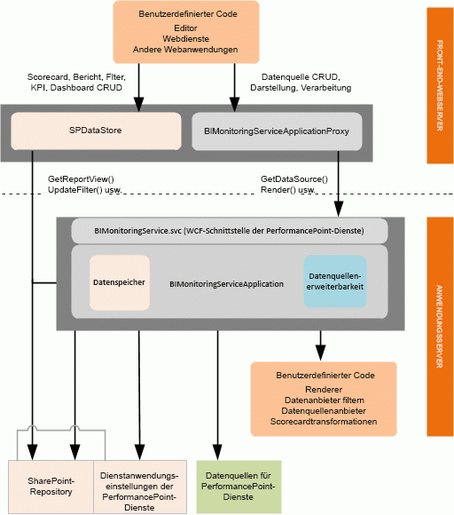

# PerformancePoint-Dienste in SharePointPerformancePoint Services in SharePoint
In diesem Artikel werden die unterstützten Entwicklungsszenarien für die PerformancePoint-Dienste in SharePoint beschrieben sowie deren Erweiterbarkeitsarchitektur.Learn about supported development scenarios and the extensibility architecture for PerformancePoint Services in SharePoint.
Bei den PerformancePoint-Diensten handelt es sich um SharePoint-Dienstanwendungen.PerformancePoint Services is a SharePoint service application. Mit ihrer Hilfe können Benutzer Business Intelligence-Dashboards (BI-Dashboards) erstellen, die Einblick in die Leistung einer Organisation gewähren.It enables users to create business intelligence (BI) dashboards that provide insight into an organization's performance. Dabei kann der native Funktionsumfang der PerformancePoint-Dienste um benutzerdefinierte Berichte, Filter, tabellarische Datenquellen und Scorecardtransformationen erweitert werden.You can create custom reports, filters, tabular data sources, and scorecard transforms to extend the native functionality of PerformancePoint Services. So können Sie beispielsweise eine benutzerdefinierte Berichtsvisualisierung speziell für die Medizinbranche erstellen und in eine wiederverwendbare vertikale Lösung integrieren.For example, you can create a custom report visualization that is optimized for the medical industry and then integrate it into a reusable vertical solution.
  
    
    

## Benutzerdefinierte Berichte, Filter und tabellarische Datenquellen in den PerformancePoint-Diensten in SharePointCustom PerformancePoint Services reports, filters, and tabular data sources in SharePoint

Sie können systemeigene PerformancePoint-Dienste  [ReportView](https://msdn.microsoft.com/library/Microsoft.PerformancePoint.Scorecards.ReportView.aspx) , [Filter](https://msdn.microsoft.com/library/Microsoft.PerformancePoint.Scorecards.Filter.aspx) und tabellarischen [DataSource](https://msdn.microsoft.com/library/Microsoft.PerformancePoint.Scorecards.DataSource.aspx) Objekte erweitern, indem Sie benutzerdefinierte Werte für deren Eigenschaften definieren. Benutzerdefinierte Berichte, Filter und tabellarischen Datenquellenerweiterungen umfassen in der Regel drei Komponenten: ein Renderer oder Anbieter, ein Editor-Anwendung und Erweiterungsmetadaten.You can extend native PerformancePoint Services  [ReportView](https://msdn.microsoft.com/library/Microsoft.PerformancePoint.Scorecards.ReportView.aspx) , [Filter](https://msdn.microsoft.com/library/Microsoft.PerformancePoint.Scorecards.Filter.aspx) , and tabular [DataSource](https://msdn.microsoft.com/library/Microsoft.PerformancePoint.Scorecards.DataSource.aspx) objects by defining custom values for their properties. Custom report, filter, and tabular data source extensions typically include three components: a renderer or provider, an editor application, and extension metadata.
  
    
    

### Renderer und Anbietern für PerformancePoint-Dienste-ErweiterungenRenderers and providers for PerformancePoint Services extensions

Der Typ des Objekts, die Sie erweitern bestimmt, ob es ein Renderer oder ein Anbieter verwendet wird. Berichts- und Erweiterungen Renderern verwenden, und Filtern und Datenquellenerweiterungen verwenden Anbieter.The type of object that you are extending determines whether it uses a renderer or a provider. Report and filter extensions use renderers, and filter and data source extensions use providers.
  
    
    

- Bei Berichterweiterungen ist für die Berichtvisualisierung ein Renderer erforderlich.Report extensions require a renderer for the report visualization. 
    
  
- Filtererweiterungen erforderlich für das Steuerelement zur Auswahl ein Renderer. Renderer kann eines benutzerdefinierten Renderers oder einer systemeigenen PerformancePoint-Dienste Renderer sein. Wenn Sie einen PerformancePoint-Dienste Renderer verwenden, registrieren Sie einfach in der Erweiterung. Wenn Sie einen benutzerdefinierten Renderer verwenden, müssen Sie auch in der Erweiterung einbeziehen.Filter extensions require a renderer for the selection control. The renderer can be a custom renderer or a native PerformancePoint Services renderer. If you are using a PerformancePoint Services renderer, you simply register it in your extension. If you are using a custom renderer, you must also include it in your extension.
    
  
- Filtererweiterungen erfordern einen Verbindung mit der zugrunde liegenden Datenquelle Datenanbieter.Filter extensions require a data provider to connect to the underlying data source.
    
  
- Bei Datenquellenerweiterungen ist zum Herstellen der Verbindung mit der zugrunde liegenden Datenquelle ein Anbieter erforderlich.Data source extensions require a provider to connect to the underlying data source.
    
  
Weitere Informationen finden Sie unter den folgenden Themen zum Erstellen von Renderern und Anbieter:For more information, see the following topics about creating renderers and providers:
  
    
    

-  [Vorgehensweise: Erstellen von berichtsrenderern für PerformancePoint Services in SharePointHow to: Create report renderers for PerformancePoint Services in SharePoint](how-to-create-report-renderers-for-performancepoint-services-in-sharepoint.md)
    
  
-  [Vorgehensweise: Erstellen Filter von Datenanbietern für PerformancePoint Services in SharePointHow to: Create filter data providers for PerformancePoint Services in SharePoint](how-to-create-filter-data-providers-for-performancepoint-services-in-sharepoint.md)
    
  
-  [How to: Create tabular data source providers for PerformancePoint Services in SharePointHow to: Create tabular data source providers for PerformancePoint Services in SharePoint](how-to-create-tabular-data-source-providers-for-performancepoint-services-in-sha.md)
    
  

### Editoranwendungen für PerformancePoint-Dienste-Erweiterungen in SharePointEditor applications for PerformancePoint Services extensions in SharePoint

Benutzerdefinierte Editoren können Benutzer Eigenschaften für ein benutzerdefiniertes Objekt definieren, interagieren Sie mit Objekten im Repository und Endpunkte für benutzerdefinierte Berichte und Filter zu initialisieren. Editor sollte die Eigenschaften verfügbar machen, die Sie Aktivieren von Benutzern anzeigen und ändern möchten. Editoren können von Objekten in PerformancePoint Dashboard-Designer oder Elemente in der PerformancePoint-Inhaltsliste oder PerformancePoint-Datenverbindungsbibliothek geöffnet werden. Um in die für die Webseitenerstellung Dashboard-Designer integrieren, muss der Editor aus einen uniform Resource Identifier (URI) zu öffnen und der URI muss für die benutzerdefiniertes Objekt in der web.config-Datei PerformancePoint-Dienste registriert werden.Custom editors enable users to define properties for a custom object, interact with objects in the repository, and initialize endpoints for custom reports and filters. Your editor should expose the properties that you want to enable users to view and modify. Editors can be opened from objects in PerformancePoint Dashboard Designer or from items in the PerformancePoint Content List or PerformancePoint Data Connections Library. To integrate into the Dashboard Designer authoring experience, your editor must be able to open from a uniform resource identifier (URI), and the URI must be registered for the custom object in the PerformancePoint Services web.config file.
  
    
    
Weitere Informationen zum Erstellen von Editoren finden Sie unter den folgenden Themen:For more information about creating editors, see the following topics:
  
    
    

-  [Vorgehensweise: erstellen Bericht-Editoren für PerformancePoint Services in SharePointHow to: Create report editors for PerformancePoint Services in SharePoint](how-to-create-report-editors-for-performancepoint-services-in-sharepoint.md)
    
  
-  [Vorgehensweise: Erstellen Filter-Editoren für PerformancePoint Services in SharePointHow to: Create filter editors for PerformancePoint Services in SharePoint](how-to-create-filter-editors-for-performancepoint-services-in-sharepoint.md)
    
  
-  [How to: Create tabular data source editors for PerformancePoint Services in SharePointHow to: Create tabular data source editors for PerformancePoint Services in SharePoint](how-to-create-tabular-data-source-editors-for-performancepoint-services-in-share.md)
    
  
> [!NOTE]
> Mit PerformancePoint Dashboard-Designer können Sie Objekte erstellen und löschen. Ihr Editor muss also keine Logik zum Erstellen oder Löschen von Objekten bereitstellen.Note: PerformancePoint Dashboard Designer can create and delete custom objects, so your editor does not need to provide logic for creating or deleting objects. 
  
    
    

### Konfigurationsmetadaten für PerformancePoint-Dienste-Erweiterungen in SharePointConfiguration metadata for PerformancePoint Services extensions in SharePoint

Sie müssen während des Installationsvorgangs Metadaten für die Erweiterung in der PerformancePoint-Dienste web.config-Datei angeben. Die Metadaten enthält **type**, **subType**, **RendererClass**, **EditorURI**und **Resources** Attribute.You must specify metadata for your extension in the PerformancePoint Services web.config file during the installation process. The metadata includes **type**, **subType**, **RendererClass**, **EditorURI**, and **Resources** attributes.
  
    
    
Zum Erstellen eines benutzerdefinierten Objekts Dashboard-Designer Ruft Metadaten für das Objekt aus der PerformancePoint-Dienste web.config-Datei und dann das Objekt als einen Inhaltstyp im Repository Dashboard-Designer erstellt. Nach dem Erstellen des benutzerdefinierten Objekts zeigt Dashboard-Designer eine Verknüpfung zum-Editor.To create a custom object, Dashboard Designer retrieves the object's metadata from the PerformancePoint Services web.config file and then creates the object as a content type in the Dashboard Designer repository. After creating the custom object, Dashboard Designer displays a link to the editor.
  
    
    
Weitere Informationen zu Erweiterungsmetadaten finden Sie unter [Gewusst wie: Manuelles Registrieren von PerformancePoint-Dienste-Erweiterungen](http://msdn.microsoft.com/library/3aa6d340-4b05-46b3-9648-2b6e18e04e09%28Office.15%29.aspx).For more information about extension metadata, see  [How to: Manually Register PerformancePoint Services Extensions](http://msdn.microsoft.com/library/3aa6d340-4b05-46b3-9648-2b6e18e04e09%28Office.15%29.aspx).
  
    
    

## Benutzerdefinierte Transformationen für PerformancePoint-Dienste-Scorecards in SharePointCustom transforms for PerformancePoint Services scorecards in SharePoint

Transformationen Ändern der Darstellung, den Inhalt oder die Funktionalität der Scorecards vor Abfragen der Datenquelle nach Abfragen der Datenquelle oder vor dem Rendern der Scorecard im Webpart. Beispielsweise PerformancePoint-Dienste Transformationen verwendet, um verschiedene Vorgänge ausführen, vor dem Rendern einer Scorecardansicht, z. B. das benannte Mengen, erweitern computing Rollups und Netzwerke Aggregations. Diese Änderungen werden während der Laufzeit angewendet, und sie die Definition des scorecardobjekts nicht ändern.Transforms change the appearance, contents, or functionality of scorecards before querying the data source, after querying the data source, or before rendering the scorecard in the Web Part. For example, PerformancePoint Services uses transforms to perform several operations before rendering a scorecard view, such as expanding named sets, computing rollups, and computing aggregations. These changes are applied at run time and they do not modify the definition of the scorecard object.
  
    
    
Weitere Informationen zu Scorecardtransformationen finden Sie unter [Gewusst wie: Erstellen von Scorecardtransformationen für PerformancePoint-Dienste in SharePoint](how-to-create-scorecard-transforms-for-performancepoint-services-in-sharepoint-2.md).For more information about scorecard transforms, see  [How to: Create scorecard transforms for PerformancePoint Services in SharePoint](how-to-create-scorecard-transforms-for-performancepoint-services-in-sharepoint-2.md).
  
> [!NOTE]
> Wenn eine Transformation die Datenwerte einer Scorecard ändert, werden die Änderungen direkt in Strategiekartenberichte eingefügt, die die Scorecard als Datenquelle verwenden. Darüber hinaus können sich Änderungen an Scorecards auf KPI-Detailberichte auswirken.If a transform modifies the data values in a scorecard, the changes propagate directly to Strategy Map reports that use the scorecard as a data source. In addition, changes to scorecards may affect KPI Details reports. 
  
    
    

## Erweiterbarkeitsarchitektur der PerformancePoint-Dienste in SharePointExtensibility architecture for PerformancePoint Services in SharePoint

Unterstützte Anwendungserweiterungen führen innerhalb einer Anwendungsinstanz PerformancePoint-Dienste, auf dem Front-End-Webserver oder auf dem Anwendungsserver aus, wie in der folgenden Abbildung dargestellt.Supported extensions run within a PerformancePoint Services application instance, either on the front-end web server or on the application server, as shown in the following diagram.
  
    
    

**Abbildung 1. Erweiterbarkeitsarchitektur von PerformancePoint Services****Figure 1. PerformancePoint Services extensibility architecture**

  
    
    

  
    
    

  
    
    

### Auf dem SharePoint-Front-End-Webserver ausgeführte PerformancePoint-Dienste-ErweiterungenPerformancePoint Services extensions that run on the SharePoint front-end web server

Benutzerdefinierte Editoren (und andere unterstützten benutzerdefinierten Anwendungen) auf dem Front-End-Webserver in einer Instanz einer Anwendung PerformancePoint-Dienste ausführen. Editoren sind in der Regel als ASPX-Seiten bereitgestellt und in den Pfad  `%ProgramFiles%\\Common Files\\Microsoft Shared\\web server extensions\\15\\TEMPLATE\\LAYOUTS`installiert sind. Editoren rufen das  [BIMonitoringServiceApplicationProxy](https://msdn.microsoft.com/library/Microsoft.PerformancePoint.Scorecards.BIMonitoringServiceApplicationProxy.aspx) oder [SPDataStore](https://msdn.microsoft.com/library/Microsoft.PerformancePoint.Scorecards.Store.SPDataStore.aspx) -Objekt für den Autor oder Prozesskonto Content wie folgt:Custom editors (and other supported custom applications) run on the front-end web server within a PerformancePoint Services application instance. Editors are typically deployed as .aspx pages and are installed in the path  `%ProgramFiles%\\Common Files\\Microsoft Shared\\web server extensions\\15\\TEMPLATE\\LAYOUTS`. Editors call the  [BIMonitoringServiceApplicationProxy](https://msdn.microsoft.com/library/Microsoft.PerformancePoint.Scorecards.BIMonitoringServiceApplicationProxy.aspx) object or [SPDataStore](https://msdn.microsoft.com/library/Microsoft.PerformancePoint.Scorecards.Store.SPDataStore.aspx) object to author or process content, as follows:
  
    
    

- Berichts- und Filterobjekte sollten  [SPDataStore](https://msdn.microsoft.com/library/Microsoft.PerformancePoint.Scorecards.Store.SPDataStore.aspx) für alle Repository-Vorgänge verwenden.Report and filter objects should use  [SPDataStore](https://msdn.microsoft.com/library/Microsoft.PerformancePoint.Scorecards.Store.SPDataStore.aspx) for all repository tasks.
    
  
- Datenquellenobjekte sollten  [BIMonitoringServiceApplicationProxy](https://msdn.microsoft.com/library/Microsoft.PerformancePoint.Scorecards.BIMonitoringServiceApplicationProxy.aspx) verwenden, um **Create** und **Update** Aufgaben ausführen, damit diese Aufgaben im Kontext der PerformancePoint-Dienste-Anwendung ausgeführt werden. **Read** (get) und **Delete** Aufgaben mithilfe von [BIMonitoringServiceApplicationProxy](https://msdn.microsoft.com/library/Microsoft.PerformancePoint.Scorecards.BIMonitoringServiceApplicationProxy.aspx) oder [SPDataStore](https://msdn.microsoft.com/library/Microsoft.PerformancePoint.Scorecards.Store.SPDataStore.aspx) ausgeführt werden können. (Allerdings können benutzerdefinierte Datenquelle Anwendungen, die auf dem Anwendungsserver ausgeführt [SPDataStore](https://msdn.microsoft.com/library/Microsoft.PerformancePoint.Scorecards.Store.SPDataStore.aspx) direkt aufrufen.)Data source objects should use  [BIMonitoringServiceApplicationProxy](https://msdn.microsoft.com/library/Microsoft.PerformancePoint.Scorecards.BIMonitoringServiceApplicationProxy.aspx) to perform **Create** and **Update** tasks so that these tasks are performed within the context of the PerformancePoint Services service application. **Read** (get) and **Delete** tasks can be performed by using [BIMonitoringServiceApplicationProxy](https://msdn.microsoft.com/library/Microsoft.PerformancePoint.Scorecards.BIMonitoringServiceApplicationProxy.aspx) or [SPDataStore](https://msdn.microsoft.com/library/Microsoft.PerformancePoint.Scorecards.Store.SPDataStore.aspx) . (However, custom data source applications that run on the application server can call [SPDataStore](https://msdn.microsoft.com/library/Microsoft.PerformancePoint.Scorecards.Store.SPDataStore.aspx) directly.)
    
  

### Auf dem SharePoint-Anwendungsserver ausgeführte PerformancePoint-Dienste-ErweiterungenPerformancePoint Services extensions that run on the SharePoint application server

Benutzerdefinierte Renderer, Anbieter und scorecardtransformationen auf dem Anwendungsserver ausgeführt. Der Anwendungsserver gehostet wird, die Middle-Tier-Geschäftslogik für die PerformancePoint-Dienste-Instanz.Custom renderers, providers, and scorecard transforms run on the application server. The application server hosts the middle-tier business logic for the PerformancePoint Services instance.
  
    
    

## Siehe auchSee also

-  [Grundlagen der PerformancePoint Services-Entwicklung](http://msdn.microsoft.com/library/5d2c183b-95f8-4930-b6d0-f3ffe1ee166e%28Office.15%29.aspx)[Fundamentals of PerformancePoint Services Development](http://msdn.microsoft.com/library/5d2c183b-95f8-4930-b6d0-f3ffe1ee166e%28Office.15%29.aspx)
    
  
-  [Codebeispiele für PerformancePoint Services in SharePoint Server 2010](http://msdn.microsoft.com/library/97f0cbd4-03ef-44f8-9869-699df9d9c97f%28Office.15%29.aspx)[Code Samples for PerformancePoint Services in SharePoint Server 2010](http://msdn.microsoft.com/library/97f0cbd4-03ef-44f8-9869-699df9d9c97f%28Office.15%29.aspx)
    
  
-  [Problembehandlung und FAQs für PerformancePoint Services-Entwicklung](http://msdn.microsoft.com/library/a90156e2-0522-46a1-9fc9-b6c8d2fffad7%28Office.15%29.aspx)[Troubleshooting and FAQs for PerformancePoint Services Development](http://msdn.microsoft.com/library/a90156e2-0522-46a1-9fc9-b6c8d2fffad7%28Office.15%29.aspx)
    
  

