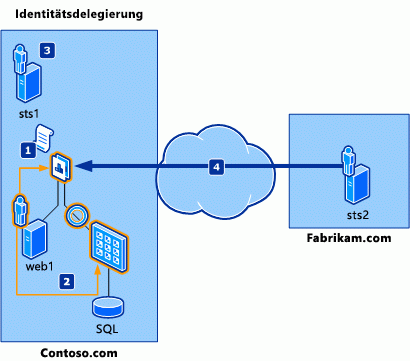
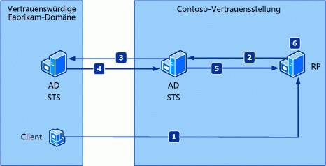
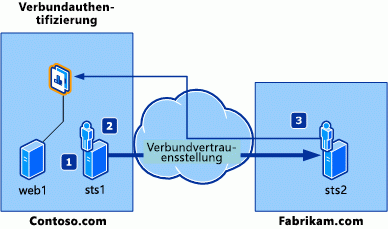

# Beispieldelegierung-, Verbund- und Authentifizierungsszenario in SharePointSample delegation, federation, and authentication scenario in SharePoint
Dieser Artikel enthält Beispielszenarien für identitätsdelegierung und Identitätsverbund.This article provides sample scenarios for identity delegation and identity federation.
## BeispielszenarienSample scenarios

Die folgenden fiktiven Unternehmen und ihren geschäftsanforderungen werden die Anforderungen in den Beispielszenarien verwendet, die in diesem Artikel beschrieben werden:The following fictional companies and their stated business needs are used in the sample scenarios that are described in this article:
  
    
    

- **Contoso Hybrid** ist ein internationaler Autohändler Engine Kooperation von Unternehmen, die spezialisierte sich auf manufacturing elektrische und Brennstoffe Zelle-basierte Hybrid Module, Auto Hersteller innerhalb und außerhalb der USA. Die IT-Abteilung bei Contoso wird in eine strategische Aufwand für die Teile Sortierung optimierte seiner Kunden zu erfüllen damit beauftragt, mit dem Entwickeln und Bereitstellen einer sicheren Internet zugänglichen Webparts Sortierung-Anwendung über dem Hostnamen "contoso.com". Diese Anwendung muss auch mehrere Zugriffsebenen für verschiedene interne Benutzer (Contoso Mitarbeiter) und externe Benutzer (Auto Hersteller Mitarbeiter) bereitstellen. Minimieren der Kosten für die Verwaltung von den Teilen der Anwendung, Sortierung IT vermeiden Sie müssen auch die Notwendigkeit für die Anwendung verwenden und einen zusätzliche Kontospeicher für interne und externe Benutzer auf die Anwendung zugreifen.**Contoso Hybrid** is an international automobile engine supply company that specializes in manufacturing electric and fuel cell-based hybrid engines to car manufactures inside and outside of the United States. In a strategic effort to meet the parts ordering demands of its customers, the IT department at Contoso is tasked with developing and deploying a secure Internet-accessible parts ordering application through their host name, Contoso.com. This application must also provide multiple levels of access for various internal users (Contoso employees) and external users (car manufacturer employees). To minimize costs associated with maintaining the parts ordering application, IT must also avoid the need for the application to use and maintain an additional account store for internal and external users to access the application.
    
  
- **Fabrikam Motors** ist ein Schwedisch Hersteller von sparsamsten compact Autos und kleine Autos, der bei seiner niedrigem Preis auf Hybrid Automobilen weltweit bekannt ist. Obwohl Sales konsistent jedes Jahr für Fabrikam eine schnellere haben, hat eine bedeutende Zunahme Hybrid Engine Fehlerraten im ersten Jahr, in Autos an Kunden verkauft wurde. Für Fabrikam vermeiden der Standard für high-Level des Diensts verwalten muss er eine effizientere Möglichkeit für hybride Engine Teile über Contoso Hybrid bestellt werden implementieren.**Fabrikam Motors** is a Swedish manufacturer of fuel-efficient compact cars and small cars that is known worldwide for its low price point on hybrid automobiles. Although sales have accelerated consistently year after year for Fabrikam, there has been a noticeable increase in hybrid engine failure rates within their first year, in cars sold to customers. For Fabrikam Motors to maintain its standard for high levels of service, it must implement a more efficient way for hybrid engine parts to be ordered through Contoso Hybrid.
    
  
Die beiden folgenden Konzepte sind verwandt:The following are related concepts:
  
    
    

- **Identitätsverbund**. Dieses Szenario erläutert die Einrichtung eines Verbunds zwischen Contoso Hybrid und Fabrikam Motors, damit Fabrikam-Benutzer für den Zugriff auf Contoso Hybrid-Ressourcen eine Umgebung mit einmaliger Anmeldung erhalten.**Identity federation**. Explains the establishment of federation between Contoso Hybrid and Fabrikam Motors so that Fabrikam users get a single sign-on experience when accessing Contoso Hybrid resources.
    
  
- **Identitätsdelegierung**. Dieses Szenario veranschaulicht die Möglichkeit, auf Ressourcen eines Webdiensts von Contoso Hybrid zuzugreifen, der ein "ActAs"-Token erfordert. Dies bedeutet, dass der Dienst die Identität des unmittelbaren Aufrufers (in der Regel die Identität des Diensts) und des ursprünglichen Benutzers benötigt, von dem die Anforderung durchgeführt wurde (in der Regel die Identität des interaktiven Benutzers).**Identity delegation**. Explains the ability to access the resources from a Contoso Hybrid web service that requires an ActAs token; that is, the service requires the identity of the immediate caller (typically the identity of the service) and the original user who initiated the request (typically the identity of the interactive user).
    
  

## IdentitätsdelegationIdentity delegation

In diesem Szenario wird eine Anwendung, die auf Back-End-Ressourcen zugreifen, die erfordern die Identität Delegierung Kette Access Control Prüfungen ausführen muss. Die Informationen auf dem ursprünglichen Anrufer und die Identität des Aufrufers sofortige besteht in der Regel eine einfache Identität Delegierung Kette aus.This scenario describes an application that needs to access back-end resources that require the identity delegation chain to perform access control checks. A simple identity delegation chain usually consists of the information on the initial caller and the identity of the immediate caller. 
  
    
    
Mit dem Kerberos-Delegierung Objektmodell auf der Windows-Plattform heute stehen die Back-End-Ressourcen Zugriff nur für die Identität des Aufrufers sofortige und nicht auf, die mit dem ursprünglichen Aufrufer. Bei diesem Modell wird häufig als des vertrauenswürdigen Subsystems bezeichnet. Windows Identity Foundation (WIF) behält die Identität des dem ursprünglichen Anrufer und der direkte Aufrufer in der Kette Delegierung mithilfe der  [Delegate()](https://msdn.microsoft.com/de-DE/library/cc310252.aspx) -Eigenschaft.With the Kerberos delegation model on the Windows platform today, the back-end resources have access only to the identity of the immediate caller and not to that of the initial caller. This model is commonly referred to as the trusted subsystem model. Windows Identity Foundation (WIF) maintains the identity of the initial caller and the immediate caller in the delegation chain by using the  [Delegate()](https://msdn.microsoft.com/de-DE/library/cc310252.aspx) property.
  
    
    
Abbildung 1 zeigt ein typisches identitätsdelegationsszenario in dem Fabrikam-Mitarbeiter in einer Anwendung Contoso.com verfügbar gemachten Ressourcen zugreift. **Abbildung 1. Forderungsbasierte Verbundauthentifizierung**Figure 1 shows a typical identity delegation scenario in which a Fabrikam employee accesses resources exposed in a Contoso.com application. **Figure 1. Claims federation authentication**

  
    
    

  
    
    

  
    
    
Die folgenden fiktiven Benutzer sind an diesem Szenario beteiligt:The fictional users participating in this scenario are:
- Frank: Ein Fabrikam-Mitarbeiter, der auf Contoso-Ressourcen zugreifen möchte.Frank: A Fabrikam employee who wants to access Contoso resources.
    
  
- Daniel: Ein Contoso-Anwendungsentwickler, der die notwendigen Änderungen in die Anwendung implementiert.Daniel: A Contoso application developer who implements the necessary changes in the application.
    
  
- Adam: Der IT-Administrator von Contoso.Adam: The Contoso IT administrator.
    
  
Die folgenden Komponenten sind an diesem Szenario beteiligt:The components involved in this scenario are:
- web1: Eine Webanwendung mit Links zu Back-End-Ressourcen, die die delegierte Identität des ursprünglichen Aufrufers erfordern. Diese Anwendung wurde mit ASP.NET erstellt.web1: A web application with links to back-end resources that require the delegated identity of the initial caller. This application is built with ASP.NET.
    
  
- Ein Webdienst, der greift auf einem Computer mit Microsoft SQL Server, die die delegierte Identität mit dem ursprünglichen Aufrufer und der direkte Aufrufer erforderlich sind. Dieser Dienst wird mit Windows Communication Foundation (WCF) erstellt.A web service that accesses a computer running Microsoft SQL Server, which requires the delegated identity of the initial caller and of the immediate caller. This service is built with Windows Communication Foundation (WCF).
    
  
- sts1: Ein Sicherheitstokendienst (Security Token Service, STS) mit der Rolle des Verbundanbieters, der die von der Anwendung (web1) erwarteten Ansprüche ausgibt. Er hat eine Vertrauensstellung zu Fabrikam.com und zur Anwendung hergestellt.sts1: A security token service (STS) that is in the role of federation provider, and emits claims that are expected by the application (web1). It has established trust with Fabrikam.com and also with the application.
    
  
- sts2: Ein STS mit der Rolle des Identitätsanbieters für Fabrikam.com, der einen vom Fabrikam-Mitarbeiter zur Authentifizierung verwendeten Endpunkt bereitstellt. Er hat eine Vertrauensstellung zu Contoso.com hergestellt, sodass Fabrikam-Mitarbeiter auf die Ressourcen von Contoso.com zugreifen können.sts2: An STS that is in the role of identity provider for Fabrikam.com and that provides an endpoint that the Fabrikam employee uses to authenticate. It has established trust with Contoso.com so that Fabrikam employees are allowed to access resources on Contoso.com.
    
  
Beachten Sie, dass der Begriff "ActAs Token" auf ein Token verweist, die von einem STS ausgestellt wurde, und die Identität des Benutzers enthält. Die  [Delegate()](https://msdn.microsoft.com/de-DE/library/cc310252.aspx) -Eigenschaft enthält die STS-Identität.Wie in Abbildung 1 dargestellt, ist der Ablauf in diesem Szenario:Note that the term "ActAs token" refers to a token that is issued by an STS and that contains the user's identity. The  [Delegate()](https://msdn.microsoft.com/de-DE/library/cc310252.aspx) property contains the STS's identity.As shown in Figure 1, the flow in this scenario is:
  
    
    

1. Die Contoso-Anwendung wird für das Abrufen eines ActAs-Tokens konfiguriert, das die Identität des Fabrikam-Mitarbeiters und des unmittelbaren Aufrufers in der  [Delegate()](https://msdn.microsoft.com/de-DE/library/cc310252.aspx) -Eigenschaft enthält. Daniel implementiert diese Änderungen in die Anwendung.The Contoso application is configured to obtain an ActAs token that contains both the Fabrikam employee's identity and the immediate caller's identity in the  [Delegate()](https://msdn.microsoft.com/de-DE/library/cc310252.aspx) property. Daniel implements these changes to the application.
    
  
2. Die Contoso-Anwendung wird für die Weitergabe des ActAs-Tokens an den Back-End-Dienst konfiguriert. Daniel implementiert diese Änderungen in die Anwendung.The Contoso application is configured to pass the ActAs token to the back-end service. Daniel implements these changes to the application.
    
  
3. Der Contoso-Webdienst wird für die Überprüfung des ActAs-Tokens durch Aufrufen von sts1 konfiguriert.The Contoso web service is configured to validate the ActAs token by calling sts1. Adam hat sts1 zur Verarbeitung von Delegationsanforderungen aktiviert.Adam enables sts1 to process delegation requests.
    
  
4. Der Fabrikam-Benutzer Frank greift auf die Contoso-Anwendung zu und erhält Zugriff auf die Back-End-Ressourcen.Fabrikam user Frank accesses the Contoso application and is given access to the back-end resources.
    
  

## VerbundauthentifizierungFederated authentication

Verbundauthentifizierung ermöglicht eine Sicherheitstokendienst (Security Token Service, STS) in einer vertrauenswürdigen Domäne Authentifizierungsinformationen für einen STS in einer anderen vertrauenswürdigen Domäne bereitstellen, wenn es eine Vertrauensstellung zwischen den beiden Domänen ist. Ein Beispiel hierfür ist in Abbildung 2 dargestellt.Federated authentication allows a security token service (STS) in one trust domain to provide authentication information to an STS in another trust domain when there is a trust relationship between the two domains. An example of this is shown in Figure 2.
  
    
    

**Abbildung 2. Forderungsbasiertes Verbundszenario****Figure 2. Claims federation scenario**

  
    
    

  
    
    

  
    
    

  
    
    

1. Von einem Client in der vertrauenswürdigen Domäne von Fabrikam wird eine Anforderung an eine Anwendung einer vertrauenden Seite innerhalb der vertrauenswürdigen Domäne von Contoso gesendet.A client in the Fabrikam trust domain sends a request to a relying party application in the Contoso trust domain.
    
  
2. Der Client wird von der vertrauenden Seite an einen STS in der vertrauenswürdigen Domäne von Contoso weitergeleitet. Der Client ist dem STS nicht bekannt.The relying party redirects the client to an STS in the Contoso trust domain. This STS has no knowledge of the client.
    
  
3. Der Client wird vom STS von Contoso an einen STS in der vertrauenswürdigen Domäne von Fabrikam weitergeleitet, mit dem die vertrauenswürdige Domäne von Contoso über eine Vertrauensstellung verfügt.The Contoso STS redirects the client to an STS in the Fabrikam trust domain, with which the Contoso trust domain has a trust relationship.
    
  
4. Die Identität des Clients wird durch den STS von Fabrikam überprüft, und anschließend wird ein Sicherheitstoken an den STS von Contoso ausgestellt.The Fabrikam STS verifies the client's identity and issues a security token to the Contoso STS.
    
  
5. Mithilfe des Tokens von Fabrikam wird vom STS von Contoso ein eigenes Token erstellt, das an die vertrauende Seite gesendet wird.The Contoso STS uses the Fabrikam token to create its own token, which it sends to the relying party.
    
  
6. Die Kundenansprüche werden von der vertrauenden Seite aus dem Sicherheitstoken extrahiert, und es wird eine Authentifizierungsentscheidung gefällt.The relying party extracts the client's claims from the security token and makes an authentication decision.
    
  
Dieses Szenario beschreibt eine Anmeldung für einen Mitarbeiter der Partner, wenn er Zugriff auf Ressourcen von einem anderen Partnerdomäne versucht. Er muss nur einmal anmelden. Es gibt drei wichtigsten Spieler in einem Verbundszenario: Identitätsanbieter, verbundanbieter und eine vertrauende Seite. WIF bietet APIs, um alle drei Spieler zu erstellen.Abbildung 3 zeigt eine typische Verbundszenario, in dem ein Fabrikam-Mitarbeiter "contoso.com" Ressourcen zugreifen, ohne dass Sie Re-Anmeldung möchte; d. h., der Mitarbeiter von Fabrikam einmaliges Anmelden verwenden möchte. **Abbildung 3. Szenario für forderungsidentitätsdelegierung**This scenario describes a sign-on experience for a partner employee when she tries to access resources from another partner's domain. She has to sign-on only once. There are three major players in a federation scenario: an identity provider, a federation provider, and a relying party. WIF offers APIs to build all three players. Figure 3 shows a typical federation scenario where a Fabrikam employee wants to access Contoso.com resources without having to re-login; that is, the Fabrikam employee wants to use single sign-on. **Figure 3. Claims identity delegation scenario**

  
    
    

  
    
    

  
    
    
Die folgenden fiktiven Benutzer sind an diesem Szenario beteiligt:The fictional users participating in this scenario are:
- Frank: Ein Fabrikam-Mitarbeiter, der auf Contoso-Ressourcen zugreifen möchte.Frank: A Fabrikam employee who wants to access Contoso resources.
    
  
- Daniel: Ein Contoso-Anwendungsentwickler, der die notwendigen Änderungen in die Anwendung implementiert.Daniel: A Contoso application developer who implements the necessary changes in the application.
    
  
- Adam: Der IT-Administrator von Contoso.Adam: The Contoso IT administrator.
    
  
Die folgenden Komponenten sind an diesem Szenario beteiligt:The components involved in this scenario are:
- web1: Eine Webanwendung zur Bestellung von Teilen, die mit ASP.NET erstellt wurde und die Steuerung des Zugriffs auf die entsprechenden Teile ermöglicht.web1: A parts ordering web application that is built with ASP.NET and controls access to the relevant parts.
    
  
- sts1: Einen STS, der Verbundanbieter bei Contoso.com ist und Ansprüche ausgibt, die von der Anwendung (web1) erwartet werden. Zwischen dem STS und Fabrikam.com besteht eine Vertrauensstellung, und der STS ist so konfiguriert, dass er Mitarbeitern von Fabrikam Zugriff gewährt.sts1: An STS that is in the role of federation provider in Contoso.com and emits claims that are expected by the application (web1). It has established trust with Fabrikam.com and is configured to allow access to Fabrikam employees.
    
  
- sts2: ein Sicherheitstokendienst, dem die Rolle des Identitätsanbieters in Fabrikam.com und bietet einen Endpunkt, der der Mitarbeiter von Fabrikam authentifiziert wird. Es wurde Vertrauensstellung mit Contoso.com festgestellt, sodass Mitarbeiter von Fabrikam "contoso.com"-Ressourcen zugreifen dürfen.sts2: An STS that is in the role of identity provider in Fabrikam.com and provides an endpoint to which the Fabrikam employee is authenticated. It has established trust with Contoso.com so that Fabrikam employees are allowed to access the Contoso.com resources.
    
  
Wie in Abbildung 3 gezeigt, ist der Ablauf in diesem Szenario:As shown in Figure 3, the flow in this scenario is:
  
    
    

1. Der Contoso-Administrator Adam konfiguriert die Vertrauensstellung zwischen der Anwendung (vertrauende Seite) und sts1.Contoso administrator Adam configures the trust between the application (relying party) and sts1.
    
  
2. Peter, der Administrator von Contoso, konfiguriert die Vertrauensstellung mit sts2 als Identitätsanbieter.Contoso administrator Adam configures the trust with sts2 as an identity provider.
    
  
3. Der Fabrikam-Administrator Frank konfiguriert die Vertrauensstellung mit sts1 als Verbundanbieter und greift dann auf die Anwendung zu.Fabrikam administrator Frank configures the trust with sts1 as a federation provider and then accesses the application.
    
  

## Siehe auchSee also

-  [Anspruchsbasierte Identität und-Konzepte in SharePointClaims-based identity and concepts in SharePoint](claims-based-identity-and-concepts-in-sharepoint.md)
    
  
-  [Anspruchsbasierte Identität - BegriffsdefinitionenClaims-based identity term definitions](claims-based-identity-term-definitions.md)
    
  

