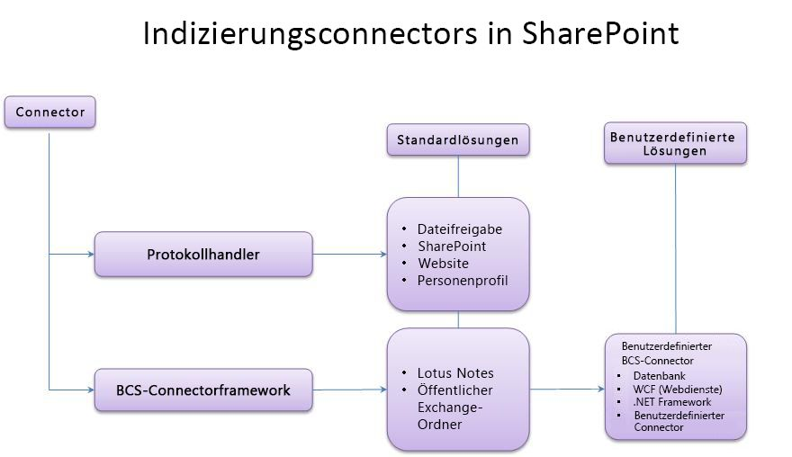
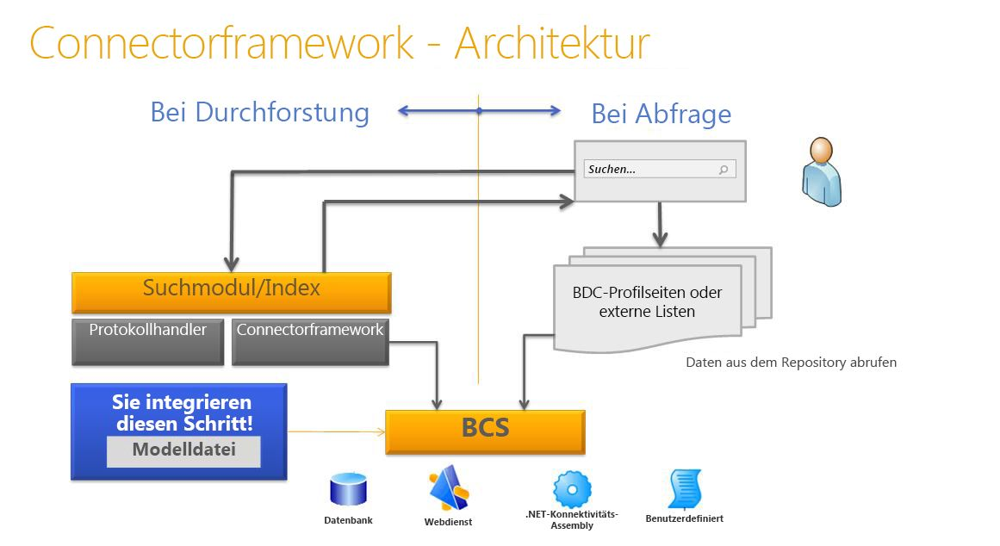

# Connector Framework für die Suche in SharePointSearch connector framework in SharePoint
Erfahren Sie mehr über die SharePoint-Indizierungsconnectors, das Connector Framework und das Erstellen von benutzerdefinierten BCS-Indizierungsconnectors zum Durchsuchen externer Systeme.Learn about the SharePoint indexing connectors, the connector framework, and how you can create custom BCS indexing connectors to search external systems.
## Inhalt für die Suche in SharePoint verfügbar machenMaking content available for search in SharePoint

Suche in SharePoint stellt zwei Ansätze für die Verarbeitung von Anfragen zum Zurückgeben von Suchergebnissen bereit: die Sammelsuche und das Durchforsten von Inhalten.Search in SharePoint provides two approaches for processing queries to return search results—federated search and content crawling.
  
    
    
 **Sammelsuche** Bei diesem Ansatz werden Suchergebnisse für Inhalte zurückgegeben, die nicht von Ihrem Suchserver durchforstet werden. Die Abfrage wird an ein externes Inhaltsrepository weitergeleitet, in dem sie von der Suchmaschine dieses Repositorys verarbeitet wird. Die Suchmaschine des Repositorys gibt dann die Ergebnisse an den Suchserver zurück. Der Suchserver formatiert und rendert die Ergebnisse aus dem externen Repository für die Anzeige auf der Suchergebnisseite. Dieser Ansatz bietet folgende Vorteile:**Federated search** In this approach, search results are returned for content that is not crawled by your search server. The query is forwarded to an external content repository where it is processed by that repository's search engine. The repository's search engine then returns the results to the search server. The search server formats and renders the results from the external repository to display on the search results page. This approach offers the following advantages:
  
    
    

- Sie benötigen keine zusätzlichen Kapazitäten für den Inhaltsindex, da der Inhalt nicht von Suche in SharePoint durchforstet wird.You require no additional capacity requirements for the content index, because content is not crawled by Search in SharePoint.
    
  
- Sie können die vorhandene Suchmaschine eines Repositorys nutzen. Sie können z. B. einen Verbund mit einer Internetsuchmaschine herstellen, um das Internet zu durchsuchen.You can take advantage of a repository's existing search engine. For example, you can federate to an Internet search engine to search the web.
    
  
- Sie können die Suchmaschine des Inhaltsrepositorys für die spezielle Inhaltsgruppe des Repositorys optimieren, was möglicherweise eine bessere Suchleistung für die Inhaltsgruppe bereitstellt.You can optimize the content repository's search engine for the repository's specific set of content, which might provide better search performance on the content set.
    
  
- Sie können auf Repositories zugreifen, die gegen Durchforstungen gesichert sind, auf die jedoch mit Suchabfragen zugegriffen werden kann.You can access repositories that are secured against crawls, but that can be accessed by search queries.
    
  
 **Durchforsten von Inhalten** Bei diesem Ansatz werden Ergebnisse vom Inhaltsindex der Suchdienstanwendung basierend auf der Abfrage des Benutzers zurückgegeben. Der Inhaltsindex enthält Inhalte, die von der Suchdienstanwendung durchforstet werden, und umfasst Textinhalte und Metadaten für jedes Inhaltselement. Dieser Ansatz ermöglicht Folgendes:**Content crawling** In this approach, results are returned from the Search service application's content index based on the user's query. The content index contains content that is crawled by the Search service application, and includes text content and metadata for each content item. This approach enables you to:
  
    
    

- Sie können Suchergebnisse nach Relevanz sortieren.Sort results by relevance.
    
  
- Sie können steuern, wie häufig der Inhaltsindex aktualisiert wird.Control how frequently the content index is updated.
    
  
- Sie können angeben, welche Metadaten durchforstet werden.Specify what metadata is crawled.
    
  
- Sie können einen einzelnen Sicherungsvorgang für durchforstete Inhalte durchführen.Perform a single backup operation for crawled content.
    
  

## Durchforsten von Inhalten mit Indizierungsconnectors in SharePointCrawling content with indexing connectors in SharePoint

Der Crawler verwendet Indizierungsconnectors, um auf die zu durchforstenden Inhalte zuzugreifen. Der Indizierungsconnector ist eine Komponente, die weiß, wie eine Verbindung mit der Inhaltsquelle hergestellt wird, was durchforstet werden soll und wie der Inhalt durchforstet wird. In früheren Versionen von SharePoint wurden diese als Protokollhandler bezeichnet, Komponenten, die auf benutzerdefinierten Schnittstellen nicht verwalteten C++-Code ausführen.The crawler uses indexing connectors to access the content to crawl. The indexing connector is the component that knows how to connect to the content source, what to crawl, and how to crawl it. In earlier versions of SharePoint, these were known as protocol handlers, components that are based on custom interfaces running unmanaged C++ code. 
  
    
    
Suche in SharePointenthält ein Connector Framework, das in SharePoint Server 2010 eingeführt wurde und auf Microsoft Business Connectivity Services (BCS) basiert, was einen einfacheren Ansatz für die Entwicklung von Indizierungsconnectors bietet. Mit dem Connector Framework verwendet der Crawler auf BCS basierende Indizierungsconnectors zum Durchforsten von externen Inhalten. SharePoint verwendet sowohl Indizierungsconnectors, die auf Protokollhandlern basieren, als auch BCS-Indizierungsconnectors zum Durchforsten von Inhalten.Search in SharePoint includes a connector framework, introduced in SharePoint Server 2010 and built on Microsoft Business Connectivity Services (BCS), which provides a simpler approach to developing indexing connectors. With the connector framework, the crawler uses indexing connectors based on BCS to crawl external content. SharePoint uses both protocol handler-based indexing connectors and BCS indexing connectors to crawl content.
  
    
    
In Abbildung 1 sehen Sie eine allgemeine Übersicht über die SharePoint-Indizierungsconnectors.Figure 1 provides a high-level overview of the SharePoint indexing connector story.
  
    
    

  
    
    

  
    
    

  
    
    

  
    
    

## BCS-Übersicht für Suche in SharePointBCS overview for Search in SharePoint

BCS ist die Sammlung von Tools und Infrastrukturen, mit denen Sie eine Verbindung zu externen Systemen von SharePoint herstellen können. Abbildung 2 enthält eine allgemeine Ansicht der BCS-Architektur, in der die für die Suche relevanten Bereiche markiert sind.BCS is the umbrella of tools and infrastructure that enables you to connect to external systems from SharePoint. Figure 2 shows a high-level view of the BCS architecture, with the relevant areas for Search highlighted.
  
    
    

  
    
    

**Abbildung 2: BCS-Architektur einschließlich Suche****Figure 2. BCS architecture including Search**

  
    
    

  
    
    

  
    
    

  
    
    
BCS stellt die Verbindung mit den externen Daten basierend auf den externen Inhaltstypdefinition im Metadatenspeicher her. Der Metadatenspeicher enthält die folgenden Informationen für einen externen Inhaltstyp:BCS makes the connection to the external data based on the external content type definition in the metadata store. The metadata store contains the following information for an external content type:
  
    
    

- **Konnektivitätsinformationen** Beschreibt, wie eine Verbindung mit dem externen System hergestellt wird.**Connectivity information** Describes how to connect to the external system.
    
  
- **Entitätsinformationen** Beschreibt die Struktur der externen Daten.**Entity information** Describes the structure of the external data.
    
  
- **Vorgänge**Beschreibt Methoden, die für den Zugriff auf die externen Daten verwendet werden. Bei Datenbanken und Webdiensten werden diese Methoden vom externen System unterstützt: SQL-Anweisungen für Datenbankconnectors und Webmethoden für Webdienste. Bei .NET- und benutzerdefinierten BCS-Indizierungsconnectors handelt es sich um Methoden, die in der Connectorassembly implementiert sind, der Komponenten-DLL, die Sie für den Indizierungsconnector erstellen.**Operations** Describes methods used to access the external data. In the case of databases and web services, these are methods supported by the external system: SQL statements for database connectors and web methods for web services. For .NET and custom BCS indexing connectors, these are methods that are implemented in the connector assembly, which is the component DLL you create for the indexing connector.
    
  
Diese Informationen sind in der BDC-Modelldatei für den externen Inhaltstyp angegeben. Weitere Informationen zu BDC-Modellen und deren Inhalten finden Sie unter  [BDC-Modellinfrastruktur]((http://msdn.microsoft.com/library/2818ebdd-6cda-4d8f-82b2-7fde9fbf2633%28Office.15%29.aspx)).This information is specified in the external content type's BDC model file. For more information about BDC models and what they contain, see  [BDC Model Infrastructure]((http://msdn.microsoft.com/library/2818ebdd-6cda-4d8f-82b2-7fde9fbf2633%28Office.15%29.aspx)).
  
    
    
Ausführliche Informationen über die BCS-Architektur und -Funktionalität finden Sie unter  [Business Connectivity Services (Übersicht)]((http://msdn.microsoft.com/library/91dd7b01-ead2-4f87-804b-b59ef2245c87%28Office.15%29.aspx)) und [Mechanismen im Zusammenhang mit der Verwendung von Business Connectivity Services]((http://msdn.microsoft.com/library/ff3e312b-0fbc-48ed-a752-76c50d286533%28Office.15%29.aspx)).For details about BCS architecture and functionality, see  [Business Connectivity Services Overview]((http://msdn.microsoft.com/library/91dd7b01-ead2-4f87-804b-b59ef2245c87%28Office.15%29.aspx)) and [Mechanics of Using Business Connectivity Services]((http://msdn.microsoft.com/library/ff3e312b-0fbc-48ed-a752-76c50d286533%28Office.15%29.aspx)).
  
    
    

### Verwenden des Connector FrameworksUsing the connector framework

Zum Durchforseten externer Daten müssen Sie einen der Inhaltsquellentypen hinzufügen, die das Verbinden mit externen Daten unterstützen. In Tabelle 1 sind diese Inhaltsquellentypen aufgelistet.To crawl external data, you have to add one of the content source types that support connecting to external data. Table 1 lists these content source types.
  
    
    

**Tabelle 1: Inhaltsquellentypen, die BCS-Indizierungsconnectors unterstützen****Table 1. Content source types that support BCS indexing connectors**

|**Inhaltsquellentyp****Content source type**|**Beschreibung****Description**|
|:-----|:-----|
|BranchendatenLine of Business Data    |Verwenden Sie diese Inhaltsquelle für Datenbank- und Webdienst-BCS-Indizierungsconnenctors.Use this content source for database and web service BCS indexing connectors.    |
|Benutzerdefiniertes RepositoryCustom Repository    |Verwenden Sie diese Inhaltsquelle für .NET- und benutzerdefinierte BCS-Indizierungsconnectors.Use this content source for .NET and custom BCS indexing connectors.    |
   
Mit dem Connector Framework können Sie BCS-Indizierungsconnectors verwenden, um eine Verbindung zu externen Inhalten herzustellen, die Sie durchforsten und in den Inhaltsindex einschließen möchten. Der BCS-Indizierungsconnector wird vom Crawler verwendet, um mit der externen Datenquelle zu kommunizieren. Zum Zeitpunkt der Durchforstung ruft der Crawler den BCS-Indizierungsconnector auf, um die Daten aus dem externen System abzurufen und zurück an den Crawler zu übergeben. Der BCS-Indizierungsconnector analysiert außerdem die Zugriffs-URLs, die von der Suche verstanden wurden, und die Kennungen, die von BCS verstanden wurden, wenn sie während der Durchforstung zwischen BCS und der Suche übergeben werden.The connector framework enables you to create BCS indexing connectors to connect to external content that you want to crawl and include in the content index. The BCS indexing connector is used by the crawler to communicate with the external data source. At crawl time, the crawler calls the BCS indexing connector to fetch the data from the external system and pass it back to the crawler. The BCS indexing connector also parses the access URLs understood by Search and the identifiers understood by BCS as they are passed between BCS and Search during the crawl process.
  
    
    
BCS-Indizierungsconnectors bestehen aus Folgendem:BCS indexing connectors are composed of the following:
  
    
    

  
    
    
> **BDC-Modelldatei** Die Datei, die die Struktur der Daten und die Verbindungsinformationen für das externe System bereitstellt**The BDC model file** The file that provides the structure of the data, and that provides connection information to the external system.
    
  

  
    
    
> **Connector** Die Komponente, die den Code enthält, der eine Verbindung mit dem externen System herstellt und die Zugriffs-URLs und BCS-Kennungen analysiert.**The connector** The component containing the code that connects to the external system and parses the access URLs and BCS identifiers.
    
  
Für BCS-Indizierungsconnectors, die auf den Branchen-Inhaltsquelltypen basieren, enthält die Suche integrierte Connectors, sodass Sie nur eine BDC-Modelldatei erstellen müssen.For BCS indexing connectors based on the Line of Business Data content source types, Search includes built-in connectors, so you have to create only a BDC model file. 
  
    
    
Für BCS-Indizierungsconnectors, die auf dem Inhaltsquellentyp für ein benutzerdefiniertes Repository basieren, müssen Sie eine benutzerdefinierte Komponente zusätzlich zu einer BDC-Modelldatei entwickeln, um die Verbindung mit externen Daten herzustellen.For BCS indexing connectors based on the Custom Repository content source types, you must develop a custom component in addition to a BDC model file to connect to the external data.
  
    
    
Abbildung 3 zeigt eine allgemeine Ansicht der Such-Connector-Framework-Architektur.Figure 3 shows a high-level view of the search connector framework architecture.
  
    
    

**Abbildung 3: Such-Connector-Framework-Architektur****Figure 3. Search connector framework architecture**

  
    
    

  
    
    

  
    
    

  
    
    

  
    
    

### BCS-IndizierungsconnectorsBCS indexing connectors

SharePoint unterstützt die folgenden Typen von BCS-Indizierungsconnectors:SharePoint supports the following types of BCS indexing connectors:
  
    
    

- **Datenbankconnector** SharePoint enthält einen vordefinierten BCS-Connector, der das Herstellen einer Verbindung zu Datenbanken unterstützt, sodass Sie einen Datenbank-BCS-Indizierungsconnector erstellen können, ohne Code schreiben zu müssen - Sie erstellen einfach die BDC-Modelldatei für den Connector.**Database connector** SharePoint includes a predefined BCS connector that supports connecting to databases, so you can create a database BCS indexing connector without writing any code—just create the BDC model file for the connector.
    
  
- **WCF-Connector (Webdienste)** SharePoint enthält einen vordefinierten BCS-Connector, der das Herstellen einer Verbindung zu Webdiensten unterstützt, sodass Sie einen Webdienst-BCS-Indizierungsconnector erstellen können, ohne Code schreiben zu müssen - Sie erstellen einfach die BDC-Modelldatei für den Connector.**WCF (web services) connector** SharePoint includes a predefined BCS connector that supports connecting to web services, so you can create a web service BCS indexing connector without writing any code—just create the BDC model file for the connector.
    
    > [!NOTE]
    > Sie müssen zwar keinen Code schreiben, um einen Connector für einen Webdienst zu erstellen; der Webdienst muss jedoch Methoden enthalten, die dieselben Funktionen bereitstellen wie der .NET-BCS-Connector. Nur so lassen sich externe Geschäftsdaten an BCS übergeben.Note: Although you don't have to write code to create a connector for web services, the web service must include methods that provide the same functionality that the .NET BCS connector provides, to pass the external business data to BCS. Informationen zur Erstellung von Webdiensten finden Sie unter [Erstellen von .NET-Konnektivitäts-Assemblys und Webdiensten]((http://msdn.microsoft.com/library/9a6c6712-868a-4a9c-9645-3aa448ad5092%28Office.15%29.aspx)).For information about creating a web service, see  [Creating .NET Connectivity Assemblies and Web Services]((http://msdn.microsoft.com/library/9a6c6712-868a-4a9c-9645-3aa448ad5092%28Office.15%29.aspx)). Codebeispiele finden Sie unter [Codebeispiel: Sample Orders ASP.Net Web Service]((http://msdn.microsoft.com/library/10e46860-788f-4ed0-a4d8-1e17ada58e83%28Office.15%29.aspx)) und [Codebeispiel: Sample Orders WCF Service]((http://msdn.microsoft.com/library/535277c8-9d5c-41eb-ab23-0ae141d726c5%28Office.15%29.aspx)).For code examples, see  [Sample Orders ASP.NET Web Service Sample]((http://msdn.microsoft.com/library/10e46860-788f-4ed0-a4d8-1e17ada58e83%28Office.15%29.aspx)) and [Sample Orders WCF Service Sample]((http://msdn.microsoft.com/library/535277c8-9d5c-41eb-ab23-0ae141d726c5%28Office.15%29.aspx)). 

- **.NET-BCS-Connector**SharePoint enthält keinen vordefinierten BCS-Connector für .NET-Connectors, sodass Sie zusätzlich zum Erstellen einer BDC-Modelldatei auch eine .NET-Komponente für den BCS-Indizierungsconnector erstellen müssen. Sie müssen die erforderlichen stereotypen Vorgänge zur Unterstützung der Durchforstung der Daten sowie Methoden für die Analyse der Zugriffs-URLs und BDC-Kennungen implementieren.**.NET BCS connector** SharePoint does not include a predefined BCS connector for .NET connectors, so in addition to creating a BDC model file, you must also create a .NET component for the BCS indexing connector. You must implement the required stereotyped operations to support crawling the data, and implement methods for parsing the access URLs and BDC identifiers.
    
  
- **Benutzerdefinierter BCS-Connector**SharePoint enthält keinen vordefinierten BCS-Connector für benutzerdefinierte .NET-Connectors, deshalb müssen Sie zusätzlich zum Erstellen einer BDC-Modelldatei wie beim .NET-BCS-Connector auch eine .NET-Komponente für den BCS-Indizierungsconnector erstellen. Sie müssen die erforderlichen stereotypen Vorgänge zur Unterstützung der Durchforstung der Daten sowie Methoden für die Analyse der Zugriffs-URLs und BDC-Kennungen implementieren. Außerdem müssen Sie die **ISystemUtility**-Schnittstelle implementieren.**Custom BCS connector** SharePoint does not include a predefined BCS connector for custom .NET connectors, so in addition to creating a BDC model file, you must also create a .NET component for the BCS indexing connector, just as you must for the .NET BCS connector. You must implement the required stereotyped operations to support crawling the data, and implement methods for parsing the access URLs and BDC identifiers. You must also implement the **ISystemUtility** interface.
    
  

## Erstellen von BCS-IndizierungsconnectorsBuilding BCS indexing connectors

Bei der Entwicklung eines BCS-Indizierungsconnectors müssen Sie unabhängig davon, ob Sie nur die BDC-Modelldatei für Datenbank- und Webdienst-Indizierungsconnectors erstellen oder die BDC-Modelldatei erstellen und die BCS-Connectorkomponente für .NET sowie benutzerdefinierte Indizierungsconnectors codieren, Folgendes berücksichtigen:When you develop a BCS indexing connector—whether you're just creating the BDC model file for database and web service indexing connectors, or creating the BDC model file and coding the BCS connector component for .NET and custom indexing connectors—you need to think about the following:
  
    
    

- **Konnektivität** Wie Sie die Verbindung zum externen Datenrepository erstellen, z. B. die Serveradresse, die IP-Adresse oder den Namen der Datenbankinstanz. Umfasst außerdem die Authentifizierungsinformationen, die zum Verbinden mit dem externen Datenrepository verwendet werden.**Connectivity** How to connect to the external data repository, for example, the server address, IP address, or database instance name. Also includes the authentication information used to connect to the external data repository.
    
  
- **Struktur des Repositorys** Zum Lesen der Daten muss der Connector wissen, wie das Repository organisiert ist. Ist es hierarchisch, numerisch oder muss es Links durchlaufen?**Structure of repository** To read the data, the connector must know how the repository is organized. Is it hierarchical, enumerical, or does it have to traverse links?
    
  
- **Inkrementelle Durchforstungen** Geben Sie dem Connector zur Reduzierung der Leistungsauslastung im externen Datenrepository die Möglichkeit, zusätzliche zu vollständigen Durchforstungen inkrementelle Durchforstungen durchzuführen. Dafür muss der Connector erkennen, welche Daten seit der letzten Durchforstung geändert wurden und nur diese Daten durchforsten können. Dies kann mit einer zeitstempelbasierten inkrementellen Durchforstung oder einer Durchforstung auf der Basis des Änderungsprotokolls erfolgen. Der von Ihnen implementierte Ansatz hängt von den APIs, die das Repository bereitstellt, und den Aktualitätszielen für den Inhalt ab.**Incremental crawls** To reduce the performance load on the external data repository, give the connector the ability to do incremental crawls in addition to full crawls. For this, the connector must recognize what data has changed since the last crawl and be able to crawl only that data. This can be done by using a timestamp-based incremental crawl or a change log-based crawl. The approach you implement depends on the APIs provided by the repository and the freshness goals for the content.
    
  
- **Sichern von Daten** In den meisten Szenarien sind nicht alle Daten für alle Benutzer zugänglich. Es ist wichtig, dass dies auch bei der Suche funktioniert, damit einem Benutzer, der über die Suchbenutzeroberfläche sucht, nur die Ergebnisse angezeigt werden, auf die er Zugriff hat. Das bedeutet, dass der Connector wissen muss, wie er die Sicherheit des externen Systems liest, und diese sicherheitsbezogenen Informationen während der Durchforstung zurück zum Index bringen muss. Sie können z. B. das Speichern von Windows NT-Zugriffssteuerungslisten (ACLs) während der Durchforstung implementieren.**Securing data** In most scenarios, not all data is accessible to all users. It's important that this also works with search, so when a user searches by using the search UI, the user can see only the results he or she has access to. This means the connector must know how to read the security of the external system, and bring that security-related information back during the crawl into the index. For example, you could implement crawl-time storage of Windows NT access control lists (ACLs).
    
  
In Tabelle 2 sind die stereotypen Vorgänge beschrieben, die für das Erstellen eines BCS-Indizierungsconnectors für SharePoint gelten.Table 2 describes the stereotyped operations that apply when you create a BCS indexing connector for SharePoint.
  
    
    

**Tabelle 2: Von Suche in SharePoint unterstützte stereotype BCS-Vorgänge****Table 2. BCS stereotyped operations supported by Search in SharePoint**

|**Vorgang****Operation**|**Beschreibung****Description**|
|:-----|:-----|
|FinderFinder    |Kernvorgang, der beim Erstellen eines BCS-Connectors erforderlich ist. Dieser Vorgang ruft die Liste der Elemente der externen Inhaltsquelle ab. Weitere Informationen finden Sie unter  [Implementieren eines Finders]((http://msdn.microsoft.com/library/a0cb7cfe-8758-4057-aa85-03071536745e%28Office.15%29.aspx)).Core operation required when creating a BCS connector. This operation retrieves the list of items of the external content source. See  [Implementing a Finder]((http://msdn.microsoft.com/library/a0cb7cfe-8758-4057-aa85-03071536745e%28Office.15%29.aspx)).    |
|SpecificFinderSpecificFinder    |Kernvorgang, der beim Erstellen eines BCS-Connectors erforderlich ist. Dieser Vorgang ruft einzelne Elemente aus der externen Inhaltsquelle ab. Weitere Informationen finden Sie unter  [Implementieren von SpecificFinder]((http://msdn.microsoft.com/library/9b6effa5-20ce-4ce7-a8dc-0fd601eb0f23%28Office.15%29.aspx)).Core operation required when creating a BCS connector. This operation retrieves individual items from the external content source. See  [Implementing a SpecificFinder]((http://msdn.microsoft.com/library/9b6effa5-20ce-4ce7-a8dc-0fd601eb0f23%28Office.15%29.aspx)).    |
|ChangedIdEnumeratorChangedIdEnumerator    |Erforderlich, um inkrementelle Durchforstungen auf der Basis des Änderungsprotokolls zu implementieren. Weitere Informationen finden Sie unter  [Implementieren von ChangedIdEnumerator]((http://msdn.microsoft.com/library/19d3c942-f6d7-49e7-853f-4d9b61b10422%28Office.15%29.aspx)).Required to implement changelog-based incremental crawls. See  [Implementing a ChangedIdEnumerator]((http://msdn.microsoft.com/library/19d3c942-f6d7-49e7-853f-4d9b61b10422%28Office.15%29.aspx)).    |
|DeletedIdEnumeratorDeletedIdEnumerator    |Erforderlich, um inkrementelle Durchforstungen auf der Basis des Änderungsprotokolls zu implementieren. Weitere Informationen finden Sie unter  [Implementieren von DeletedIdEnumerator]((http://msdn.microsoft.com/library/aa1c521a-0c9b-4dc0-a32f-fb9e54c52bed%28Office.15%29.aspx)).Required to implement changelog-based incremental crawls. See  [Implementing a DeletedIdEnumerator]((http://msdn.microsoft.com/library/aa1c521a-0c9b-4dc0-a32f-fb9e54c52bed%28Office.15%29.aspx)).    |
|BinarySecurityDescriptorAccessorBinarySecurityDescriptorAccessor    |Erforderlich zum Implementieren der Sicherheit auf Elementebene. Gibt die Sicherheitsbeschreibung für ein Element aus der externen Inhaltsquelle zurück. Weitere Informationen finden Sie unter  [Implementieren von BinarySecurityDescriptorAccessor]((http://msdn.microsoft.com/library/6cf70490-dd3c-49cd-bb13-ed33e938435d%28Office.15%29.aspx)).Required to implement item-level security. Returns the security descriptor for an item from the external content source. See  [Implementing a BinarySecurityDescriptorAccessor]((http://msdn.microsoft.com/library/6cf70490-dd3c-49cd-bb13-ed33e938435d%28Office.15%29.aspx)).    |
|StreamAccessorStreamAccessor    |Erforderlich zum Aktivieren der Durchforstung von Anlagen aus der externen Inhaltsquelle. Gibt die Anlage als Datenstrom zurück. Weitere Informationen finden Sie unter  [Implementieren von StreamAccessor]((http://msdn.microsoft.com/library/e3d8053b-90c0-4207-98e3-91e42db13cf1%28Office.15%29.aspx)).Required to enable crawling of attachments from the external content source. Returns the attachment as a data stream. See  [Implementing a StreamAccessor]((http://msdn.microsoft.com/library/e3d8053b-90c0-4207-98e3-91e42db13cf1%28Office.15%29.aspx)).    |
   

  
    
    

### Toolunterstützung für die Entwicklung von BCS-IndizierungsconnectorsTooling support for developing BCS indexing connectors

BCS bietet Toolunterstützung für BCS-Connectors in SharePoint Designer und Visual Studio.BCS provides tooling support for BCS connectors in SharePoint Designer and Visual Studio.
  
    
    

#### SharePoint Designer-Toolunterstützung für BCS-ConnectorsSharePoint Designer tooling support for BCS connectors

SharePoint Designer stellt eine begrenzte Sammlung von Funktionen bereit. Sie können diese verwenden, um BDC-Modelldateien für vorhandene BCS-Connectortypen wie Datenbank-, Webdienst- und .NET-BCS-Connectors zu erstellen. Sie können sie auch verwenden, um BDC-Modelldateien aus einer BCS-Dienstanwendung in eine andere BCS-Dienstanwendung zu exportieren.SharePoint Designer provides a limited set of capabilities; you can use it to create BDC model files for existing BCS connector types, such as database, web service, and .NET BCS connectors. You can also use it to export BDC model files from one BCS service application to another BCS service application.
  
    
    

#### Visual Studio-Toolunterstützung für BCS-ConnectorsVisual Studio tooling support for BCS connectors

Sie können mit Visual Studio die Komponente für .NET-BCS- und benutzerdefinierten BCS-Connectors erstellen. Für .NET-BCS-Connectors stellt Visual Studio die Business Data Connectivity-Modellprojektvorlage bereit, die eine Reihe von visuellen Designer- und Codeverwaltungsfunktionen enthält, mit denen Sie die .NET-Komponente und die zugehörige BDC-Modelldatei für den .NET-BCS-Connector einfacher erstellen, debuggen und bereitstellen können. Es gibt keine entsprechende Projektvorlage für benutzerdefinierte BCS-Connectors.You can use Visual Studio to create the component for .NET BCS connectors and custom BCS connectors. For .NET BCS connectors, Visual Studio provides the Business Data Connectivity Model project template, which includes a set of visual designers and code management capabilities to enable you to more easily create, debug, and deploy the .NET component and the associated BDC model file for the .NET BCS connector. There is no corresponding project template for custom BCS connectors.
  
    
    

## Verbesserungen am Connector Framework in SharePointConnector framework enhancements in SharePoint

In SharePoint unterstützt das Connector Framework BCS-Connectors, die Anspruchsinformationen für Inhalte abrufen, die in benutzerdefinierten externen Datenrepositorys gespeichert sind.In SharePoint the connector framework supports BCS connectors retrieving claims information for content that is stored in custom external data repositories.
  
    
    
Das Connector Framework bietet außerdem eine verbesserte Ausnahmeerfassung und -protokollierung, die Ihnen helfen, Fehler beim Durchforsten von Inhaltsquellen mithilfe von BCS-Connectors zu beheben.The connector framework also provides improved exception capturing and logging to help you troubleshoot errors encountered when crawling content sources by using BCS connectors.
  
    
    

## Siehe auchSee also

-  [Optimieren der BDC-Modelldatei für die Suche in SharePointEnhancing the BDC model file for Search in SharePoint](enhancing-the-bdc-model-file-for-search-in-sharepoint.md)
    
  
-  [SharePoint 2013: MyFileConnector custom BCS indexing connector sample]((https://code.msdn.microsoft.com/sharepoint-2013-myfileconne-79d2ea26))[SharePoint 2013: MyFileConnector custom BCS indexing connector sample]((https://code.msdn.microsoft.com/sharepoint-2013-myfileconne-79d2ea26))
    
  
-  [How to: Crawl associated external content types in SharePointHow to: Crawl associated external content types in SharePoint](how-to-crawl-associated-external-content-types-in-sharepoint.md)
    
  
-  [Vorgehensweise: durchforsten binary large Objects () in SharePointHow to: Crawl binary large objects (BLOBs) in SharePoint](how-to-crawl-binary-large-objects-blobs-in-sharepoint.md)
    
  
-  [Vorgehensweise: durchforsten zugeordneter externe Inhaltstypen in SharePointHow to: Crawl associated external content types in SharePoint](how-to-crawl-associated-external-content-types-in-sharepoint.md)
    
  
-  [Vorgehensweise: Konfigurieren der Sicherheit auf Elementebene in SharePointHow to: Configure item-level security in SharePoint](how-to-configure-item-level-security-in-sharepoint.md)
    
  

