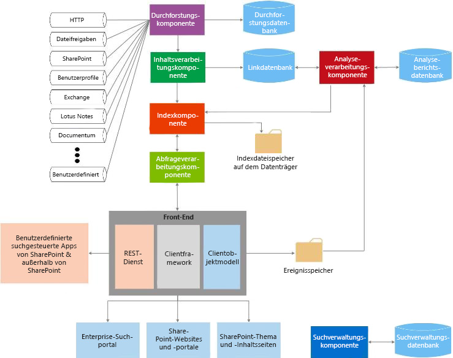

# Suche in SharePoint
Informationen zur Erweiterbarkeit von Bausteinen in Suche in SharePoint und zu deren Verwendung für Ihre Anwendungsfälle. Mithilfe von Suche in SharePoint können Benutzer relevante Informationen schneller und einfacher denn je finden. Zudem wird es für Suchadministratoren einfach gestaltet, die Suchabfrage anzupassen. Außerdem werden verschiedene API-Sätze für komplexere Anpassungen und Lösungen bereitgestellt.
  
    
    

In den folgenden Artikeln erhalten Sie eine geeignete Einführung zu allgemeinen SharePoint-Entwicklungskonzepten. Möglicherweise ist es für Sie hilfreich, diese vor dem Fortfahren zu lesen:
-  [Einrichten einer allgemeinen Entwicklungsumgebung für SharePoint](set-up-a-general-development-environment-for-sharepoint.md)
    
  
-  [Auswählen des richtigen API-Satzes in SharePoint](choose-the-right-api-set-in-sharepoint.md)
    
  
-  [SharePoint-Add-Ins im Vergleich zu SharePoint-Lösungen](sharepoint-add-ins-compared-with-sharepoint-solutions.md)
    
  
-  [Entscheidung zwischen SharePoint-Add-Ins und SharePoint-Lösungen](deciding-between-sharepoint-add-ins-and-sharepoint-solutions.md)
    
  

## Übersicht über die Architektur der Suche

Suche in SharePoint umfasst eine Vielzahl von Verbesserungen und neuen Features. Mit dieser Version wird Suche in SharePoint zu einer einzelnen Unternehmenssuchplattform umgestaltet. Die Sucharchitektur besteht aus den folgenden Bereichen:
  
    
    

-  [Durchforsten und Inhaltsverarbeitung](#bk_crawl)
    
  
-  [Index](#bk_index)
    
  
-  [Abfrageverarbeitung](#bk_query)
    
  
-  [Suchverwaltung](#bk_searchadmin)
    
  
-  [Analyse](#bk_analytics)
    
  
Diese Bereiche bestehen aus Komponenten und Datenbanken, die gemeinsam Suchvorgänge ausführen. Abbildung 1 bietet einen Überblick über die verschiedenen Bereiche der Sucharchitektur und die darin enthaltenen Komponenten und Datenbanken, die gemeinsam die Suchvorgänge ausführen. 
  
    
    

**Abbildung 1. Interaktion der Suchkomponenten**

  
    
    

  
    
    

  
    
    
Eine ausführlichere Ansicht finden Sie unter  [Technische Diagramme - Suche](http://technet.microsoft.com/de-DE/library/cc263199.aspx#search) und [Übersicht über die Suche in SharePoint](http://technet.microsoft.com/de-DE/library/jj219738.aspx).
  
    
    

### Durchforsten und Inhaltsverarbeitung

Die Architektur für Durchforsten und Inhaltsverarbeitung umfasst Folgendes:
  
    
    
 **Durchforstungskomponente**
  
    
    
 Durchforstet Inhaltsquellen, um durchforstete Eigenschaften und Metadaten von durchforsteten Elementen zu sammeln, und sendet diese Informationen an die Inhaltsverarbeitungskomponente.
  
    
    
 **Durchforstungsdatenbank**
  
    
    
Enthält Informationen zu durchforsteten Elementen, z. B. zum Zeitstempel der letzten Durchforstung, zur letzten Durchforstungs-ID und zum Typ der Aktualisierung während der letzten Durchforstung.
  
    
    
 **Inhaltsverarbeitungskomponente**
  
    
    
Durchforstet Inhaltsquellen, um durchforstete Eigenschaften und Metadaten von durchforsteten Elementen zu erfassen. Diese Informationen werden dann an die Indexkomponente gesendet.
  
    
    

### Index 

Die Indexkomponente empfängt die von der Inhaltsverarbeitungskomponente verarbeiteten Elemente und schreibt diese in den Suchindex. Diese Komponente behandelt auch eingehende Abfragen, ruft Informationen aus dem Suchindex ab und sendet das Resultset an die Abfrageverarbeitungskomponente zurück.
  
    
    

### Abfrageverarbeitung

Die Abfrageverarbeitungkomponente analysiert und verarbeitet Suchabfragen und Ergebnisse. Die verarbeitete Abfrage wird dann an die Indexkomponente gesendet, die eine Reihe von Suchergebnissen für die Abfrage zurückgibt.
  
    
    

### Suchverwaltung

Die Suchverwaltung besteht aus der Suchverwaltungskomponente und ihrer entsprechenden Datenbank.
  
    
    
 **Suchverwaltungskomponente**
  
    
    
Führt die Systemprozesse für die Suche aus, fügt neue Instanzen von Suchkomponenten hinzu und initialisiert diese.
  
    
    
 **Suchverwaltungsdatenbank**
  
    
    
Speichert Suchkonfigurationsdaten.
  
    
    

### Analyse

Die Analysearchitektur besteht aus der Analyseverarbeitungskomponente, Analyseberichtsdatenbank und Linkdatenbank.
  
    
    
 **Analyseverarbeitungskomponente**
  
    
    
Führt die Suchanalyse und Nutzungsanalyse durch.
  
    
    
 **Linkdatenbank**
  
    
    
Speichert Informationen, die von der Inhaltsverarbeitungskomponente und Klickinformationen der Suche extrahiert werden.
  
    
    
 **Analyseberichtsdatenbank**
  
    
    
Speichert die Ergebnisse der Verwendungsanalyse.
  
    
    
 **Ereignisspeicher**
  
    
    
Speichert die Nutzungsereignisse, die auf dem Front-End erfasst werden.
  
    
    

## Erweiterbarkeitspunkte der Suche

Die Suche in SharePoint-Architektur bietet verschiedene Erweiterbarkeitspunkte, um Anpassungsszenarien zu unterstützen. In diesem Abschnitt werden diese Punkte beschrieben und gezeigt, wo Sie weitere Informationen zur Entwicklung für diese Szenarien finden können.
  
    
    

### Konnektorframework

Die Durchforstungskomponente durchforstet Inhalte, indem Konnektoren oder Protokollhandler aufgerufen werden, die mit Inhaltsquellen interagieren, um Daten abzurufen. Suche in SharePoint umfasst ein Konnektorframework, mit dem Sie Konnektoren anpassen und erstellen können, um neue Inhaltsquellen zu durchforsten. Weitere Informationen zur Architektur des Konnektorframeworks und zu deren Erweiterung finden Sie unter  [Connector Framework für die Suche in SharePoint](search-connector-framework-in-sharepoint.md).
  
    
    

### Benutzerdefinierte Inhaltsverarbeitung

Innerhalb der Inhaltsverarbeitungskomponente können Sie das Webdienstpopup für die Inhaltsanreicherung verwenden, um die verwalteten Eigenschaften von durchforsteten Elementen zu ändern, bevor diese zum Suchindex hinzugefügt werden. Dieses Webdienstpopup wird für jeden von Ihnen erstellten externen Webdienst für die Inhaltsanreicherung ausgerufen. Weitere Informationen finden Sie unter  [Benutzerdefinierte Inhaltsverarbeitung mit dem Webdienstpopup zur Inhaltsanreicherung](custom-content-processing-with-the-content-enrichment-web-service-callout.md). Informationen zur schrittweisen Implementierung eines Webdiensts für die Inhaltsanreicherung finden Sie unter  [Vorgehensweise: verwenden die Anreicherung Web Service als Legende für SharePoint Server](how-to-use-the-content-enrichment-web-service-callout-for-sharepoint-server.md). Der Blogbeitrag  [Anpassen der SharePoint-Suchabfrage mit einem Webdienst für die Inhaltsanreicherung](http://blogs.msdn.com/b/sharepointdev/archive/2012/11/13/customize-the-sharepoint-search-experience-with-a-content-enrichment-web-service.aspx) ist ebenfalls eine geeignete Ressource.
  
    
    

### Abfrage-APIs

Suche in SharePoint stellt verschiedene Abfrage-APIs zur Verfügung und bietet Ihnen damit unzählige Wege für den Zugriff auf Suchergebnisse. Suchergebnisse können somit in einer Vielzahl von benutzerdefinierten Lösungstypen zurückgegeben werden.
  
    
    
Tabelle 1 zeigt die APIs, die Sie zum Programmieren von Suche in SharePoint verwenden können, und wo Sie diese finden.
  
    
    

**Tabelle 1: Such-APIs**

|**API-Name**|**Klassenbibliothek oder Schema und Pfad**|
|:-----|:-----|
|.NET-Clientobjektmodelle (CSOM)    |Microsoft.SharePoint.Client.Search.dll  im Ordner %ProgramFiles%\\Common Files\\Microsoft Shared\\web server extensions\\15\\ISAPI    |
|Silverlight-CSOM    |Microsoft.SharePoint.Client.Search.Silverlight.dll  im Ordner %ProgramFiles%\\Common Files\\Microsoft Shared\\web server extensions\\15\\TEMPLATE\\LAYOUTS\\ClientBin    |
|JavaScript-CSOM    |SP.search.js  im Ordner %ProgramFiles%\\Common Files\\Microsoft Shared\\web server extensions\\15\\TEMPLATE\\LAYOUTS    |
|REST-Endpunkte (Representational State Transfer)    |http://server/_api/search/query  http://server/_api/search/suggest    |
|Serverobjektmodell    |Microsoft.Office.Server.Search.dll  im Ordner %ProgramFiles%\\Common Files\\Microsoft Shared\\web server extensions\\15\\ISAPI    |
   
Weitere Informationen finden Sie unter  [Verwenden der SharePoint-Suchabfrage-APIs](using-the-sharepoint-search-query-apis.md).
  
    
    

### Analyse

Die Analyseverarbeitungskomponente analysiert sowohl Inhalte an sich als auch die Interaktion der Benutzer mit Inhalten, um jene Inhalte zu identifizieren und verfügbar zu machen, die für Benutzer am nützlichsten und relevantesten sind. Diese Analysen werden von Zeitgeberaufträgen durchgeführt, die für die Durchführung der Analyse-Lebenszyklusaufgaben, wie z.B. das Starten, Beenden, Anhalten und Fortsetzen eines Analyseauftrags, verantwortlich sind. Sie können diese Zeitgeberaufträge über den Namespace [Microsoft.Office.Server.Search.Analytics](https://msdn.microsoft.com/library/Microsoft.Office.Server.Search.Analytics.aspx) bearbeiten. Ausführliche Informationen zu Analysen in SharePoint finden Sie unter [Übersicht über die Analyseverarbeitung in SharePoint](http://technet.microsoft.com/de-DE/library/jj219554.aspx).
  
    
    

### Benutzerdefinierte Rangfolgemodelle

Suchergebnisse können auf verschiedene Arten, wie z. B. nach Rang, sortiert werden. Bewertungsergebnisse werden von der Suchmaschine mithilfe von Bewertungsmodellen berechnet. SharePoint enthält standardmäßig 14 Bewertungsmodelle. Wenn Sie nicht mit der Sortierung Ihrer Suchergebnisse zufrieden sind, können Sie ein benutzerdefiniertes Bewertungsmodell verwenden. Weitere Informationen zum Erstellen und zur Optimierung eines benutzerdefinierten Bewertungsmodells finden Sie unter [Anpassen von Bewertungsmodellen zur Verbesserung der Relevanz in SharePoint](customizing-ranking-models-to-improve-relevance-in-sharepoint.md).
  
    
    

### Benutzerdefinierte Sicherheitskürzung

Die Suche in SharePoint führt zum Zeitpunkt der Abfrage mit den Sicherheitsinformationen der Durchforstungskomponente eine Sicherheitskürzung der Suchergebnisse durch, die auf der Identität des Benutzers, der die Anfrage sendet, basiert. In einigen Fällen müssen Sie die benutzerdefinierte Sicherheitskürzung möglicherweise implementieren. Dazu bietet SharePoint zwei Schnittstellen an: [ISecurityTrimmerPre](https://msdn.microsoft.com/library/Microsoft.Office.Server.Search.Query.ISecurityTrimmerPre.aspx) und [ISecurityTrimmerPost](https://msdn.microsoft.com/library/Microsoft.Office.Server.Search.Query.ISecurityTrimmerPost.aspx) .
  
    
    
Die Prä-Trimmer-Schnittstelle ( **ISecurityTrimmerPre**) führt eine Auswertung vor der Abfrage aus, wobei die Suchabfrage umgeschrieben wird, um Sicherheitsinformationen hinzuzufügen, bevor die Abfrage mit dem Suchindex abgeglichen wird. Im Gegensatz dazu führt die Post-Trimmer-Schnittstelle ( **ISecurityTrimmerPost**) eine Auswertung nach der Abfrage durch, wobei die Suchergebnisse gekürzt werden, bevor sie an den Benutzer zurückgegeben werden. Weitere Informationen zu den beiden Schnittstellen finden Sie unter [Benutzerdefinierte Sicherheitskürzung für die Suche in SharePoint](custom-security-trimming-for-search-in-sharepoint-server.md). Schrittweise Informationen zum Implementieren eines Security Trimmers finden Sie unter [Vorgehensweise: Verwenden eines benutzerdefinierten Security Trimmer für Suchergebnisse für SharePoint Server](how-to-use-a-custom-security-trimmer-for-sharepoint-server-search-results.md).
  
    
    

### Webpart für Inhaltssuche

Das Inhaltssuche-Webpart ist ein Webpart, das dynamische Inhalte anzeigen kann, die zuvor durchforstet und zum Suchindex hinzugefügt wurden. Jede Instanz des Webparts wird einer Suchabfrage zugeordnet und zeigt die Ergebnisse für diese bestimmte Suchabfrage an. Wenn Benutzer zu einer Seite navigieren, die ein Inhaltssuche-Webpart enthält, wird automatisch eine Suchabfrage gestartet und die entsprechenden Suchergebnisse werden vom Suchindex zurückgegeben. Sie können das Inhaltssuche-Webpart jederzeit verwenden, wenn Sie Inhalte anzeigen möchten, die über automatisch generierte Suchabfragen aufgefüllt werden. In einigen Fällen können Sie das Inhaltssuche-Webpart erweitern, das über den  [Microsoft.Office.Server.Search.WebControls](https://msdn.microsoft.com/library/Microsoft.Office.Server.Search.WebControls.aspx) -Namespace als [ContentBySearchWebPart](https://msdn.microsoft.com/library/Microsoft.Office.Server.Search.WebControls.ContentBySearchWebPart.aspx) bereitgestellt wird. Informationen zum Erweitern von [ContentBySearchWebPart](https://msdn.microsoft.com/library/Microsoft.Office.Server.Search.WebControls.ContentBySearchWebPart.aspx) , damit das Webpart benutzerdefinierte Eigenschaften erkennt, finden Sie unter [Benutzersegmentierung in SharePoint](user-segmentation-in-sharepoint.md).
  
    
    

### Suchgesteuerte mobile Apps, die die REST-Schnittstellen für die Navigation und Ereignisprotokollierung verwenden

SharePoint bietet zwei neue REST-Schnittstellen: Navigation und Ereignisprotokollierung. Sie können diese Schnittstellen verwenden, um suchgesteuerte mobile Apps für Mobilgeräte, wie z. B. Smartphones und Tablets, zu erstellen, die auf anderen Betriebssystemen als Windows ausgeführt werden. Mit diesem Feature können Sie den Produktkatalog auf andere Art als über einen mobilen Kanal auf Ihrem Mobilgerät anzeigen. Unter [Vorgehensweise: Erstellen suchgesteuerter mobiler Apps mit den REST-Schnittstellen für Navigation und Ereignisprotokollierung](how-to-build-search-driven-mobile-apps-with-the-navigation-and-event-logging-res.md) finden Sie ein detailliertes Beispiel für die Erstellung einer solchen App.
  
    
    

## Inhalt dieses Abschnitts

-  [What's new in SharePoint-Suche für Entwickler](what-s-new-in-sharepoint-search-for-developers.md)
    
  
-  [Durchsuchen neuer Inhalte mit SharePoint-Suche](searching-new-content-with-sharepoint-search.md)
    
  
-  [Konfigurieren der Suche in SharePoint](configure-search-in-sharepoint.md)
    
  
-  [Erstellen von Suchabfragen in SharePoint](building-search-queries-in-sharepoint.md)
    
  
-  [Übersicht über die REST-API der SharePoint-Suche](sharepoint-search-rest-api-overview.md)
    
  
-  [Anpassen von Suchergebnissen in SharePoint](customizing-search-results-in-sharepoint.md)
    
  
-  [Sortieren von Suchergebnissen in SharePoint](sorting-search-results-in-sharepoint.md)
    
  
-  [Anpassen von Bewertungsmodellen zur Verbesserung der Relevanz in SharePoint](customizing-ranking-models-to-improve-relevance-in-sharepoint.md)
    
  
-  [Benutzerdefinierte Sicherheitskürzung für die Suche in SharePoint](custom-security-trimming-for-search-in-sharepoint-server.md)
    
  
-  [Exportieren und Importieren von Konfigurationseinstellungen für Suche in SharePoint](exporting-and-importing-search-configuration-settings-in-sharepoint.md)
    
  

## Siehe auch

-  [Änderungen zwischen SharePoint 2010 und SharePoint](http://technet.microsoft.com/de-DE/library/ff607742.aspx)
    
  
-  [Technische Diagramme - Suchen](http://technet.microsoft.com/de-DE/library/cc263199.aspx#search)
    
  
-  [Hinzufügen von SharePoint-Funktionen](add-sharepoint-capabilities.md)
    
  
