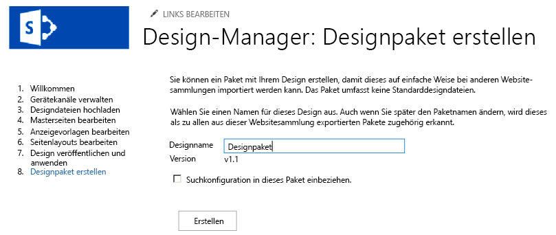

# Designpakete des SharePoint-Entwurfs-ManagersSharePoint Design Manager design packages
Informationen zum Erstellen und Exportieren des visuellen Designs einer SharePoint-Websitesammlung als PaketLearn how to build and export the visual design of a SharePoint site collection as a package.
## Übersicht über DesignpaketeOverview of Design Packages

Mithilfe des Entwurfs-Managers in SharePoint können Webentwickler und Webdesigner visuelle Designs für SharePoint-Websitesammlungen erstellen und anschließend als Paket exportieren.In SharePoint, Design Manager can help web developers and designers build and export the visual design of a SharePoint site collection as a package. Ein solches Paket lässt sich unkompliziert an Kunden oder andere involvierte Gruppen übermitteln, die es in ihren Websitesammlungen installieren können.This package can easily be distributed to customers, or other designated groups, for installation on their site collections. Dieses neue Feature vereinfacht die Übermittlung von Designs und macht es Kunden einfacher, die Entwicklung visueller Designs für ihre Websites auszulagern.This new feature reduces the complexity of transporting designs, and makes it easier for customers to outsource the visual design of their sites. Möglich sind beispielsweise folgende Verwendungsszenarien:For example, some usage scenarios can include the following:
  
    
    

- **Neues Design**: Ein Unternehmen mit eingeschränkten Fähigkeiten im Bereich Webdesign schließt möglicherweise einen Vertrag mit einer Agentur ab, die die aktuelle SharePoint-Website des Unternehmens aktualisiert und moderner gestaltet. Die Agentur kann die Website erstellen und die Inhalte problemlos packen, um sie in die SharePoint-Farm des Unternehmens zurück zu importieren.**New Design** —A company with limited web design capabilities might contract a vendor agency to refresh their current SharePoint site with a more modern interpretation. The agency can create the site and easily package the contents for importing back into the company SharePoint farm.
    
  
- **Websiteübergreifende Veröffentlichung**: Die IT-Abteilung eines Unternehmens, das die websiteübergreifende Veröffentlichung in SharePoint nutzt, muss ggf. ein visuelles Design über mehrere Websitesammlungen hinweg freigeben. Das Unternehmen erstellt die Website intern und sucht nach einer einfachen Möglichkeit, das Design über mehrere SharePoint-Websites hinweg zu transportieren. Die Designpaketfunktion des Entwurfs-Managers bietet dem Unternehmen die Möglichkeit, die Daten mit geringerem Verwaltungsaufwand und reduzierter Komplexität zu exportieren und zu importieren.**Cross-Site Publishing** —An enterprise IT department using cross-site publishing in SharePoint might have to share a visual design across multiple site collections. They create the site in-house and want a simple way to transport the design across several SharePoint websites. The design package functionality through Device Manager enables them to export and import with reduced administrative support and complexity.
    
  
Dieser Artikel kann Ihnen dabei helfen, zu verstehen, wie Designpakete in SharePoint erstellt und verwendet werden. Sie erhalten einen Überblick über die Paketerstellung und Anleitungen zum Workflow beim Exportieren und Importieren von Paketen. Außerdem werden erforderliche Berechtigungen für bestimmte Vorgänge sowie die Architektur von Designpaketen erörtert.This article can help you understand design packaging in SharePoint by providing an overview of package creation, and offers workflow guidance for package exporting and importing. It also discusses required permissions for specific operations, and design package architecture.
  
    
    

## Erstellen von DesignpaketenCreating a design package

Benutzer erstellen als SharePoint-Lösungspakete (WSP-Datei) bezeichnete Designpakete auf ihrer SharePoint-Website über den Entwurfs-Manager in **Websiteeinstellungen**. Der Schritt zum Erstellen des Pakets folgt auf andere Entwurfs-Manager-Schritte für das Branding und die Veröffentlichung einer SharePoint-Website. Hierzu zählen das Hochladen der Designdateien, das Erstellen einer Gestaltungsvorlage und das Bearbeiten von Seitenlayouts. Nachdem die Website veröffentlicht wurde, ist das Erstellen der WSP-Datei für den Export ein relativ einfacher Vorgang.A user creates a design package, called a SharePoint solution package (.wsp file) on their SharePoint site, through Design Manager in **Site Settings**. The step for creating the package follows other Design Manager steps for branding and publishing a SharePoint site, including uploading design files, creating a master page, and editing page layouts. After the site is published, it is a relatively simple process to create the .wsp file for export.
  
    
    
In Abbildung 1 wird die Option im Entwurfs-Manager gezeigt, mit der das Designpaket benannt und erstellt wird.Figure 1 shows the option in Design Manager for naming and creating the design package.
  
    
    

**Abbildung 1: Exportieren eines Designpakets****Figure 1. Exporting a design package**

  
    
    

  
    
    

  
    
    
Alternativ können Sie ein Designpaket aus einer anderen SharePoint-Websitesammlung über den Entwurfs-Manager auf der Homepage importieren, oder indem Sie **Designpaket importieren** unter **Websiteeinstellungen** auswählen.Alternatively, you can import a design package from another SharePoint site collection through Design Manager on the Welcome page, or by choosing **Import design package** in **Site Settings**.
  
    
> [!NOTE]
> Weitere Informationen zum Entwurfs-Manager und zum Veröffentlichungsvorgang finden Sie unter [Übersicht über den Entwurfs-Manager in SharePoint](overview-of-design-manager-in-sharepoint.md).[Note:](overview-of-design-manager-in-sharepoint.md) For more information about Design Manager and the publishing process, see  Overview of Design Manager in SharePoint. 
  
    
    

Es ist ein Kontrollkästchen vorhanden, über das die Suchkonfiguration in das Designpaket aufgenommen wird. Diese Option wählen Sie, wenn Sie eine Website entwerfen und bedingte Suchergebnisse erstellen oder die Suchumgebung steuern. Diese Konfiguration enthält Objekte wie Abfrageregeln, Ergebnisquellen, Ergebnistypen sowie jegliche Schema- und Bewertungsmodelle. Damit sichergestellt wird, dass der Import der Suchkonfiguration nicht fehlschlägt, dürfen bei Elementen der Suchkonfiguration keine doppelten Namen vorhanden sein. Wenn Sie beispielsweise in einer Websitesammlung über eine Abfrageregel namens **SampleQueryRule** verfügen und diese in eine andere Websitesammlung mit einer bestehenden Regeln namens **SampleQueryRule** importieren, schlägt der Import der Suchkonfiguration fehl. Um dies zu verhindern, können Sie die Abfrageregel in der Quelle oder dem Ziel umbenennen oder löschen. Ergebnisquellen sowie das Schema müssen ebenfalls eindeutige Namen aufweisen. Wenn Sie eine Suchkonfiguration in Ihr Designpaket aufnehmen möchten, müssen Sie die folgenden Features auf Websiteebene unter **Websitefeatures verwalten** aktivieren, bevor Sie das Designpaket exportieren:There is a check box for including the search configuration in the design package. You would choose this option if you are designing a site and creating conditional search results, or controlling the search experience. This configuration contains assets like query rules, result sources, result types, and any schema and ranking models. To ensure that the import of the search configuration does not fail, there must not be duplicate names for any elements of the search configuration. For example, if you have a query rule in a site collection named **SampleQueryRule**, and you import it into another site collection with an existing rule named **SampleQueryRule**, importing the search configuration fails. To prevent this, you can rename or delete the query rule on the source or on the target. Result sources, and the schema, also have to be uniquely named. If you want to include a search configuration in your design package, you must activate the following features at the site level under **Manage Site Features** before you export the design package:
  
    
    

- Suchkonfigurationsdaten-InhaltstypenSearch Config Data Content Types
    
  
- Suchkonfigurationsdaten-WebsitespaltenSearch Config Data Site Columns
    
  
- Suchkonfigurationslisten-InstanzfeatureSearch Config List Instance Feature
    
  
- Suchkonfigurationsvorlagen-FeatureSearch Config Template Feature
    
  
Wenn Sie möchten, dass Ihr Design im Ziel des Imports veröffentlicht wird, sollten Sie alle Designobjekte veröffentlichen oder die Hauptversionsverwaltung in designbezogenen Bibliotheken in der Quelle des Exports deaktivieren. Der Entwurfs-Manager exportiert nur die neueste Version jedes Objekts aus der Quelle. Wenn Sie beispielsweise über die Version 1.1 einer Gestaltungsvorlage in der Quelle verfügen, wird diese als Entwurf in das Ziel kopiert. Version 1.0 wird jedoch nicht kopiert. Außerdem werden alle Dateien, die ausgecheckt sind, nicht exportiert.If you want your design to be published on the target of import, you should publish all design assets or disable major versioning in design-related libraries on the source of export. Design Manager exports only the most recent version of each asset from the source. For example, if you have version 1.1 of a master page on the source it will be copied to the target as a draft. But, version 1.0 is not copied. Also, files that are checked out are not exported.
  
    
    

## Exportieren und Importieren von DesignpaketenExporting and importing a design package

Sie können auf verschiedene Weise an einen End-to-End-Paketworkflow herangehen, wobei der Ansatz größtenteils von Ihren Zielsetzungen und den verfügbaren Designressourcen abhängig ist. Möglicherweise entscheiden Sie sich dafür, die Arbeit an eine Agentur auszulagern, oder Sie arbeiten intern, wenn Sie über die geeigneten internen Ressourcen verfügen. In Tabelle 1 wird ein Beispielworkflow erläutert. Dies umfasst den Austausch von Daten für das Design zwischen einem Kunden und einer Agentur sowie den Export und Import des Designpakets. Außerdem werden die benötigten Berechtigungen für designbezogene Vorgänge sowie Verpackungsvorgänge erläutert.You can approach an end-to-end packaging workflow several ways, with much of the approach depending on your objectives and available design resources. You may decide to outsource to a vendor agency, or do the work in-house if you have internal resourcing. Table 1 provides a sample workflow and exchange between a client and a vendor agency over the design, exporting, and importing of the design package. It also provides the required permissions for design-related operations, and packaging operations.
  
    
    

**Tabelle 1: Beispielworkflow für ein Designpaket****Table 1. Sample design package workflow**

|**Schritt****Step**|**Aktion****Action**|**Beschreibung****Description**|
|:-----|:-----|:-----|
|11    |Ein Kunde beauftragt eine Agentur mit der Erstellung eines visuellen Designs.Customer contracts vendor agency to create visual design.    | Der Designer erstellt die Website basierend auf den Anforderungen des Unternehmens.The vendor designer creates site, based on company requirements.   **Hinweis:** Der Designer benötigt die Berechtigungsstufe **Designer**, um mit dem Entwurfs-Manager arbeiten und Pakete exportieren zu können.**Note:**  The vendor designer must have the **Designers** permission level to use Design Manager and create and export packages. Genauer gesagt benötigt er die Berechtigung **Design** zum Aufrufen, Hinzufügen, Aktualisieren, Löschen, Genehmigen und Anpassen von visuellen Designs.More specifically, the **Design** permission that allows viewing, adding, updating, deleting, approving, and customizing visual designs.          |
|22    |Der Designer exportiert das visuelle Design in ein Designpaket.Vendor designer exports visual design into a design package.    | Der Designer exportiert das SharePoint-Lösungspaket (WSP-Datei), nachdem er die übrigen erforderlichen Branding- und Veröffentlichungsschritte abgeschlossen hat.The vendor designer exports the SharePoint solution package (.wsp file) after completing the other required branding and publishing steps.    Das Designpaket wird über einen sicheren Kanal an den Kunden geliefert.The design package is delivered to the customer via a secure channel.   |
|33    |Der Kunde importiert das visuelle Design in die angegebene SharePoint-Websitesammlung.Customer imports visual design into their specified SharePoint site collection.    | Der Kunde erhält das Designpaket über einen sicheren Kanal.The customer receives the design package via a secure channel.    Über die Homepage im Entwurfs-Manager oder durch Auswahl von **Designpaket importieren** unter **Websiteeinstellungen** importiert der Kunde die WSP-Datei und wendet das Designpaket auf die angegebene Websitesammlung an.Through the Welcome page in Design Manager or by choosing **Import design package** in **Site Settings**, the customer imports the .wsp file and applies the design package to the specified site collection.    **Hinweis:** Der Kunde benötigt die Berechtigungsstufe **Designer**, um mit dem Entwurfs-Manager arbeiten und Designpakete importieren zu können.**Note:**  The customer must have the **Designers** permission level to use Design Manager and import design packages.          |
   

## Übersicht über den Inhalt von DesignpaketenUnderstanding design package contents

Das Designpaket (WSP-Datei) enthält verschiedene Dateien, wenn es über den Entwurfs-Manager erstellt wird. Bei dem Verfahren werden Dateien aus verschiedenen Listen und Bibliotheken exportiert und bilden auf diese Weise das Gesamtpaket. Beim Import in eine Websitesammlung werden diese Dateien basierend auf dem Dateityp an verschiedene Speicherorte verteilt. Tabelle 2 enthält nähere Informationen zum Speicherort der Dateien und dem Typ der während des Zusammenstellungsvorgangs exportierten Dateien.Several files are included in the design package .wsp file when it is created through Design Manager. The process exports files from various lists and libraries to form the overall package. While importing to a site collection, these files are distributed to different locations based on file type. Table 2 details the location and type of files exported during the assembly process.
  
    
    

**Tabelle 2: Übersicht über den Inhalt eines Designpakets und Speicherorte für exportierte Dateien****Table 2. Summary of design package contents and file exportation locations**

|**Exportspeicherort****Export Location**|**Exportierte Objekte****Exported Assets**|
|:-----|:-----|
|DokumentbibliothekenDocument libraries    | GestaltungsvorlagenkatalogMaster Pages Gallery    DesignkatalogThemes Gallery    FormatbibliothekStyle Library    WebsiteobjektbibliothekSite Assets Library   |
|Inhaltstypen, FelderContent types, fields    | Inhaltstypen, die vom Inhaltstyp "Seite" erbenContent types that inherit from the Page content type   |
|ListenLists    | Design GalleryDesign Gallery    Durchkomponierte LooksComposed looks    GerätekanäleDevice channels   |
   
> [!NOTE]
> In SharePoint werden ausschließlich angepasste Dateien in Designpakete aufgenommen.Note: In SharePoint, only customized files are included in design packages. Die meisten standardmäßigen, nicht angepassten Systemdateien werden vom Packprozess nicht exportiert.The packaging process will not export most of the default non-customized system files. 
  
    
    

In SharePoint können Sie ein importiertes Designpaket nicht deinstallieren, und Sie sollten niemals versuchen, ein Designpaket über den Lösungskatalog zu deaktivieren. Falls Sie dies versuchen, werden die Inhaltstypen des Seitenlayouts entfernt, und Benutzer können möglicherweise keine Unterwebsites mehr erstellen. Um diesen Zustand zu beheben, sollten Sie die folgenden Schritte durchführen, bei denen Folgendes gilt: Website A ist die ursprüngliche Websitesammlung, Website B ist die Websitesammlung mit dem deaktivierten Designpaket (ungültiger Zustand), und Website C ist eine von Ihnen erstellte neue leere Website.In SharePoint you cannot uninstall an imported design package, and you should never attempt to deactivate a design package through the solution gallery. If you do, page layout content types are removed and users may not be able to create subsites. To recover from this state, you should perform the following steps where site A= the original site collection, site B = the site collection with the deactivated design package (bad state), and site C = a new, blank site collection that you have created:
  
    
    

1. Exportieren Sie ein Designpaket von Website AExport a design package from site A
    
  
2. Importieren Sie das Designpaket in Website CImport the design package to site C
    
  
3. Exportieren Sie ein Designpaket von Website BExport a design package from site B
    
  
4. Importieren Sie das Designpaket in Website CImport the design package to site C
    
  
5. Exportieren Sie das Designpaket von Website CExport the design package from site C
    
  
6. Importieren Sie das Designpaket in Website BImport the design package to site B
    
  
Alle erstellen Gerätekanäle und ihre Konfigurationen werden ebenfalls importiert, wenn das Designpaket entladen wird. Sie müssen jedoch Gestaltungsvorlagen angegebenen Gerätekanälen neu zuordnen, da diese Zuordnungen nicht konfiguriert werden.Any created device channels, and their configurations, are also imported when the design package is unloaded. But, you have to re-associate master pages to specified device channels because these mappings will not be configured.
  
    
    
Beim Importieren eines Designpakets wird keine alternative CSS-URL festgelegt, selbst wenn eine solche in der Quelle des Exports konfiguriert war. CSS-Klassen sollten nicht in einer externen Datei im Gestaltungsvorlagenkatalog und auch nicht in der Gestaltungsvorlagendatei selbst gespeichert werden.When importing a design package, an alternate CSS URL is not set, even if one was configured on the source of export. CSS classes should be stored in an external file in the Master Page Gallery and not in the master page file itself.
  
    
    

## Siehe auchSee also

-  [Entwickeln des Website-Designs in SharePointDevelop the site design in SharePoint](develop-the-site-design-in-sharepoint.md)
    
  
-  [Übersicht über den Entwurfs-Manager in SharePointOverview of Design Manager in SharePoint](overview-of-design-manager-in-sharepoint.md)
    
  
-  [Neuerung bei SharePoint-WebsiteentwicklungWhat's new with SharePoint site development](what-s-new-with-sharepoint-site-development.md)
    
  
