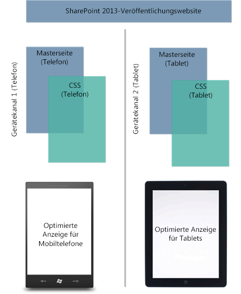
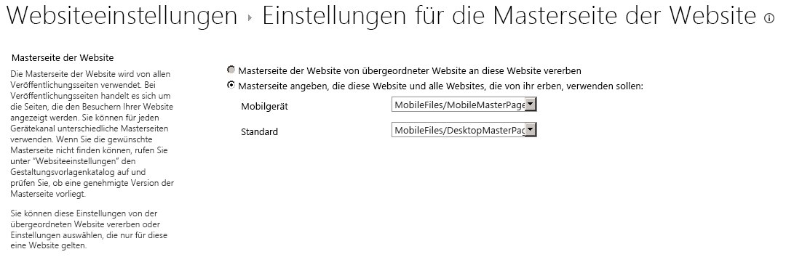

# <a name="sharepoint-design-manager-device-channels"></a><span data-ttu-id="99692-102">SharePoint-Design-Manager-Gerätekanäle</span><span class="sxs-lookup"><span data-stu-id="99692-102">SharePoint Design Manager device channels</span></span>
<span data-ttu-id="99692-103">Erfahren Sie mehr über das Planen und Konfigurieren einer Gerätekanälefunktion auf einer SharePoint-Website.</span><span class="sxs-lookup"><span data-stu-id="99692-103">Learn about, plan and configure a device channels experience on a SharePoint site.</span></span>
## <a name="introduction-to-device-channels"></a><span data-ttu-id="99692-104">Einführung in Gerätekanäle</span><span class="sxs-lookup"><span data-stu-id="99692-104">Introduction to device channels</span></span>
<span data-ttu-id="99692-105"><a name="Int"> </a></span><span class="sxs-lookup"><span data-stu-id="99692-105"></span></span>

<span data-ttu-id="99692-p101">Das Browsen im Web auf einem mobilen Gerät ist jetzt so üblich, dass eine SharePoint-Website für die Lesbarkeit und Benutzerfreundlichkeit auf Smartphones und anderen mobilen Geräten wie Tablets optimiert werden muss. Dank der Gerätekanäle in SharePoint können Sie eine einzige Veröffentlichungswebsite auf verschiedene Arten rendern, indem Sie verschiedene Designs verwenden, die auf verschiedene Geräte ausgerichtet sind. Die Informationen in diesem Artikel helfen Ihnen, die Verwendung der Funktion für Gerätekanäle in SharePoint zu planen. Er bietet eine ausführliche Übersicht über die Funktion selbst und die erforderlichen Informationen für das Erstellen eines Gerätekanals. Nach der Lektüre dieses Artikels wissen Sie außerdem, welches Gerätekanäle implementiert werden müssen und wie Sie diese Kanäle implementieren.</span><span class="sxs-lookup"><span data-stu-id="99692-p101">Browsing the web on a mobile device is now so common that a SharePoint site must be optimized for readability and ease of use on smartphones and other mobile devices such as tablets. With device channels in SharePoint, you can render a single publishing site in multiple ways by using different designs that target different devices. This article can help you plan for using the device channels feature in SharePoint. It provides a detailed overview of the feature itself, and provides the necessary information for creating a device channel. Also, after reading this article, you'll know what device channels you need to implement, and how to implement those channels.</span></span>
  
    
    
<span data-ttu-id="99692-p102">Gerätekanäle sind nur für SharePoint-Veröffentlichungswebsites verfügbar. Bevor Sie Gerätekanäle implementieren, sollten Sie bereits ein allgemeines Verständnis für die Teile einer SharePoint-Website haben, wissen, wie eine SharePoint-Seite zusammengestellt wird und über allgemeine Kenntnisse des Entwurfs-Managers verfügen. Weitere Informationen zum SharePoint-Seitenmodell, einschließlich Masterseite und Seitenlayouts, finden Sie unter  [Übersicht über das SharePoint-Seitenmodell](overview-of-the-sharepoint-page-model.md). Weitere Informationen zum Entwurfs-Manager finden Sie unter  [Übersicht über den Entwurfs-Manager in SharePoint](overview-of-design-manager-in-sharepoint.md).</span><span class="sxs-lookup"><span data-stu-id="99692-p102">Device channels are available only for SharePoint publishing sites. Before you implement device channels, you should already have a general understanding of the parts of a SharePoint site, how a SharePoint page is put together, and a general understanding of design manager. For more information about the SharePoint page model, including master page and page layouts, see  [Overview of the SharePoint page model](overview-of-the-sharepoint-page-model.md). For more information about design manager, see  [Overview of Design Manager in SharePoint](overview-of-design-manager-in-sharepoint.md).</span></span>
  
    
    

## <a name="what-is-a-device-channel"></a><span data-ttu-id="99692-115">Was ist ein Gerätekanal?</span><span class="sxs-lookup"><span data-stu-id="99692-115">What is a device channel?</span></span>
<span data-ttu-id="99692-116"><a name="WhatDev"> </a></span><span class="sxs-lookup"><span data-stu-id="99692-116"></span></span>

<span data-ttu-id="99692-p103">Ein Gerätekanal ist Teil der SharePoint-Veröffentlichungsinfrastruktur, mit der Sie bestimmte Websiteinhalte rendern, Ihre Inhalte formatieren und sogar Bilder ändern können - während Sie gleichzeitig dieselbe URL über einen Pool von verschiedenen Geräten beibehalten. Im Vergleich zur Desktopversion der SharePoint-Website kann ein mobiles Rendering mit einer geringeren Breite formatiert werden, eine bessere Navigation durch breitere Toucheingabeziele bereitstellen und eine reduzierte Menge von Informationen für eine bessere Benutzerfreundlichkeit anzeigen. Sie können eine einzelne Website erstellen und die Inhalte ein einziges Mal für alle verschiedenen mobilen Geräte erstellen und bearbeiten. Wenn ein Benutzer eine SharePoint-Website von einem mobilen Gerät wie einem Smartphone oder Tablet browst, übermittelt der mobile Browser eine HTTP GET-Anforderung an die Website, die eine Benutzer-Agent-Zeichenfolge enthält. Diese Zeichenfolge enthält Informationen über die Art von Gerät, das versucht, auf die Website zuzugreifen. Basierend auf dieser Geräteteilzeichenfolge kann der Browser des Geräts zu einer bestimmten Masterseitenansicht umgeleitet werden. Wenn Sie z. B. Sammlung von Windows Phone- und iPad-Geräten haben, können Sie jedem Pool ein eindeutiges Rendering der SharePoint-Website bereitstellen, indem Sie Gerätekanäle verwenden. Diese Gerätekanäle können jeweils eine andere Masterseite und damit CSS-Datei erhalten, damit Benutzer von einem optimalen Anzeigeerlebnis profitieren. In Abbildung 1 ist die Verwendung von zwei Gerätekanälen gezeigt, um zwei eindeutige Websiterendering für ein Telefon und Tabletgerät bereitzustellen.</span><span class="sxs-lookup"><span data-stu-id="99692-p103">A device channel is part of the SharePoint publishing infrastructure that enables you to render certain site content, style your content, and even change images—while maintaining the same URL across a pool of different devices. Compared to the desktop version of the SharePoint site, a mobile rendering can be formatted with a smaller width, have better navigation with wider touch targets, and show a reduced amount of information for better usability. You can create a single site, and author and edit the content a single time for all your different mobile devices. When a user browses a SharePoint site from a mobile device such as a smartphone or tablet, the mobile browser submits to the site an HTTP GET request that includes a user agent string. This string contains information about the type of device that is trying to access the site. Based on that device substring, the device browser can be redirected to a specific master page view. For example, if you have a collection of Windows Phone and iPad devices, you can provide each pool with a unique rendering of the SharePoint publishing site by using device channels. These device channels can each be given a different master page and thus CSS file to give users a more optimal viewing experience. Figure 1 shows the use of two device channels to provide two unique site renderings for a phone and tablet device.</span></span>
  
    
    
<span data-ttu-id="99692-p104">Abbildung 1: Verwenden von Gerätekanälen über verschiedene Geräteplattformen</span><span class="sxs-lookup"><span data-stu-id="99692-p104">Figure 1. Using device channels across different device platforms</span></span>
  
    
    

  
    
    

  
    
    
<span data-ttu-id="99692-p105">Sie können einen Gerätekanal über das Menü **Websiteeinstellungen** im Abschnitt **Aussehen und Verhalten** oder alternativ über die Option **Entwurfs-Manager** im selben Abschnitt erstellen und konfigurieren. Wenn Sie ein Gerätekanalelement erstellen, gibt es fünf erforderliche und optionale Felder, die Sie für den Prozess angeben müssen. Tabelle 1 enthält diese Felder und eine Beschreibung, welche Art von Informationen bereitgestellt werden muss.</span><span class="sxs-lookup"><span data-stu-id="99692-p105">You can create and configure a device channel from the **Site Settings** menu under the **Look and Feel** section, or alternatively through the **Design Manager** option in the same section. When you create a device channel item, there are five required and optional fields to supply for the process. Table 1 lists these fields and describes what type of information must be provided.</span></span>
  
    
    

<span data-ttu-id="99692-132">**Tabelle 1: Erforderliche und optionale Felder für das Erstellen eines Gerätekanals**</span><span class="sxs-lookup"><span data-stu-id="99692-132">**Table 1. Required and optional fields for creating a device channel**</span></span>


|<span data-ttu-id="99692-133">**Field**</span><span class="sxs-lookup"><span data-stu-id="99692-133">**Field**</span></span>|<span data-ttu-id="99692-134">**Erforderlicher Wert**</span><span class="sxs-lookup"><span data-stu-id="99692-134">**Required Value**</span></span>|<span data-ttu-id="99692-135">**Wert**</span><span class="sxs-lookup"><span data-stu-id="99692-135">**Value**</span></span>|
|:-----|:-----|:-----|
|<span data-ttu-id="99692-136">Name</span><span class="sxs-lookup"><span data-stu-id="99692-136">Name</span></span>  <br/> |<span data-ttu-id="99692-137">Ja</span><span class="sxs-lookup"><span data-stu-id="99692-137">Yes</span></span>  <br/> |<span data-ttu-id="99692-p106">Dies ist der Name für Ihren Entwurfskanal, der ein Anzeigenamen sein kann, um den Kanal zu identifizieren.</span><span class="sxs-lookup"><span data-stu-id="99692-p106">This is the name of your design channel. It can be a friendly name to identify the channel.</span></span>  <br/> |
|<span data-ttu-id="99692-140">Alias</span><span class="sxs-lookup"><span data-stu-id="99692-140">Alias</span></span>  <br/> |<span data-ttu-id="99692-141">Ja</span><span class="sxs-lookup"><span data-stu-id="99692-141">Yes</span></span>  <br/> |<span data-ttu-id="99692-142">Mit dem Aliasnamen können Sie Ihren Gerätekanal im Code, in Gerätekanalbereichen (weiter unten in diesem Artikel beschrieben), in der Vorschau und anderen Kontexten identifizieren.</span><span class="sxs-lookup"><span data-stu-id="99692-142">The alias name enables you to identify your device channel in code, device channel panels (discussed later in this article), previews, and other contexts.</span></span>  <br/> <span data-ttu-id="99692-143">**Wichtig:** Wenn Sie später den Kanalalias ändern, müssen Sie die Masterseitenzuordnungen, Gerätekanalbereiche sowie benutzerdefinierten Code oder Markups manuell aktualisieren.</span><span class="sxs-lookup"><span data-stu-id="99692-143">If you later change the channel alias, you'll have to manually update master page mappings, device channel panels, and any custom code or markup.</span></span>           |
|<span data-ttu-id="99692-144">Beschreibung</span><span class="sxs-lookup"><span data-stu-id="99692-144">Description</span></span>  <br/> |<span data-ttu-id="99692-145">Nein</span><span class="sxs-lookup"><span data-stu-id="99692-145">No</span></span>  <br/> |<span data-ttu-id="99692-146">Ein Feld zum Angeben einer allgemeinen Beschreibung des Gerätekanals.</span><span class="sxs-lookup"><span data-stu-id="99692-146">A field for supplying a general description for the device channel.</span></span>  <br/> |
|<span data-ttu-id="99692-147">Geräteeinschlussregeln</span><span class="sxs-lookup"><span data-stu-id="99692-147">Device Inclusion Rules</span></span>  <br/> |<span data-ttu-id="99692-148">Ja</span><span class="sxs-lookup"><span data-stu-id="99692-148">Yes</span></span>  <br/> |<span data-ttu-id="99692-p107">Ein Feld zum Angeben der Benutzer-Agent-Teilzeichenfolge wie Windows Phone OS. Die Geräteumleitung auf eine bestimmte Masterseite hängt davon ab, was für diesen Wert eingegeben wird. Weitere Informationen dazu, welche Werte in diesem Feld angegeben werden können, finden Sie im Abschnitt  [Benutzer-Agent-Teilzeichenfolgen und Gerätekanalbewertungen](#PlanDeviceChannels_UserAgentSubstrings) in diesem Artikel.</span><span class="sxs-lookup"><span data-stu-id="99692-p107">A field for supplying the user agent substring such as Windows Phone OS. Device redirection to a specific master page depends on what is entered for this value. For more information about what values to supply in this field, see the section  [User agent substrings and device channel rankings](#PlanDeviceChannels_UserAgentSubstrings) in this article. </span></span><br/> |
|<span data-ttu-id="99692-152">Aktiv</span><span class="sxs-lookup"><span data-stu-id="99692-152">Active</span></span>  <br/> |<span data-ttu-id="99692-153">Nein</span><span class="sxs-lookup"><span data-stu-id="99692-153">No</span></span>  <br/> |<span data-ttu-id="99692-p108">Wenn Sie dieses Kontrollkästchen aktivieren, wird Ihr Gerätekanal aktiviert. Wenn Sie an einer Livewebsite arbeiten, sollten Sie den Kanal erst aktivieren, wenn Sie das Entwerfen abgeschlossen haben. Verwenden Sie für Tests die Abfragezeichenfolge  `?DeviceChannel=alias` in einem Browser, um eine Vorschau Ihrer Website für einen bestimmten Kanal anzuzeigen.</span><span class="sxs-lookup"><span data-stu-id="99692-p108">Selecting this check box activates your device channel. If you are working on a live site, you should not activate the channel before you have finished designing it. For testing, you can use the query string  `?DeviceChannel=alias` within a browser to preview your site for a specific channel. </span></span><br/> |
   

  
    
    

    
> <span data-ttu-id="99692-157">**Hinweis:** Weitere Informationen und Schritte zum Erstellen eines Gerätekanals finden Sie im Abschnitt  [Erstellen eines Gerätekanals](sharepoint-design-manager-device-channels.md#create) in diesem Artikel.</span><span class="sxs-lookup"><span data-stu-id="99692-157">**Note** For more information and steps for creating a device channel, see the  [Create a device channel](sharepoint-design-manager-device-channels.md#create) section of this article.</span></span>
  
    
    

<span data-ttu-id="99692-p109">Nachdem ein Gerätekanal erstellt und aktiviert wurde, ist die Umleitung an eine bestimmte Masterseite, z. B. eine mobile Version, möglich. Der nächste Schritt besteht darin, anzugeben, welche Masterseite für mobile Geräte auf der Websiteebene angezeit werden soll, entweder über die Option **Einstellungen für die Masterseite der Website**oder die Option **Veröffentlichen und übernehmen** im Entwurfs-Manager.</span><span class="sxs-lookup"><span data-stu-id="99692-p109">After a device channel is created and activated, device redirection to a specific master page, for example a mobile version, is possible. The next step is to specify what master page should be displayed for mobile devices at the site level, through either the **Site Master Page Settings** or by using the **Publish and Apply** option in Design Manager.</span></span>
  
    
    

<span data-ttu-id="99692-160">**Abbildung 2: Festlegen der Masterseiten für die Anzeige auf mobilen Geräten und dem Standarddesktop**</span><span class="sxs-lookup"><span data-stu-id="99692-160">**Figure 2. Setting master pages for mobile device viewing and default desktop viewing**</span></span>

  
    
    

  
    
    

  
    
    
<span data-ttu-id="99692-p110">Wie in Abbildung 2 dargestellt, können Sie eine bestimmte Masterseite für die normale Desktopanzeige der Website und mobile Masterseite für die Geräteumleitung zuweisen. Ob die mobile oder die Standardmasterseite gerendert wird, hängt vom konfigurierten, aktiven Gerätekanal ab. Insbesondere hängt es von der Teilzeichenfolge für die Geräteeinschlussregel ab, die während der Erstellung Gerätekanals angegeben wird.</span><span class="sxs-lookup"><span data-stu-id="99692-p110">As seen in Figure 2, you can assign a specific master page for regular desktop viewing of the site, and a mobile master page for device redirection. Whether the mobile or default master pages are rendered depends on the configured, active device channel. Specifically, it depends on the device inclusion rule substring that is supplied in the device channel creation process.</span></span>
  
    
    

### <a name="user-agent-substrings-and-device-channel-rankings"></a><span data-ttu-id="99692-165">Benutzer-Agent-Teilzeichenfolgen und Gerätekanalbewertungen</span><span class="sxs-lookup"><span data-stu-id="99692-165">User agent substrings and device channel rankings</span></span>
<span data-ttu-id="99692-166"><a name="PlanDeviceChannels_UserAgentSubstrings"> </a></span><span class="sxs-lookup"><span data-stu-id="99692-166"></span></span>

<span data-ttu-id="99692-p111">Wenn Sie einen Gerätekanal erstellen, werden Sie aufgefordert, eine Benutzer-Agent-Teilzeichenfolge anzugeben, die für die Gerätumleitung zu einer angegebenen Masterseite verantwortlich ist. Wenn Sie diesen Wert nicht im Feld **Geräteinschlussregeln** bereitstellen, ist keine Geräteumleitung möglich, und der Gerätekanal kann nicht erstellt werden. Tabelle 2 enthält einige Beispiele für Benutzer-Agent-Teilzeichenfolgenwerte, die verwendet werden können, wenn Sie einen Gerätekanal erstellen.</span><span class="sxs-lookup"><span data-stu-id="99692-p111">When creating a device channel, you are asked to supply a user agent substring that is responsible for device redirection to a specified master page. If you do not provide this value in the **Device Inclusion Rules** field, device redirection is not possible and the channel cannot be created. Table 2 provides some sample user agent substring values that can be used when you are creating a device channel.</span></span>
  
    
    

<span data-ttu-id="99692-170">**Tabelle 2: Beispielwerte für Benutzer-Agent-Teilzeichenfolgen**</span><span class="sxs-lookup"><span data-stu-id="99692-170">**Table 2. Sample user agent substring values**</span></span>


|<span data-ttu-id="99692-171">**Gerät**</span><span class="sxs-lookup"><span data-stu-id="99692-171">**Device**</span></span>|<span data-ttu-id="99692-172">**Benutzer-Agent-Teilzeichenfolge(n)**</span><span class="sxs-lookup"><span data-stu-id="99692-172">**User agent substring(s)**</span></span>|
|:-----|:-----|
|<span data-ttu-id="99692-173">Windows Phone</span><span class="sxs-lookup"><span data-stu-id="99692-173">Windows Phone</span></span>  <br/> | <span data-ttu-id="99692-174">Windows Phone OS 7.5 (speziell für Windows Phone 7.5-Telefon)</span><span class="sxs-lookup"><span data-stu-id="99692-174">Windows Phone OS 7.5 (Specific to Windows Phone 7.5 phone.)</span></span> <br/>  <span data-ttu-id="99692-175">Windows Phone OS (generische Teilzeichenfolge für alle Versionen von Windows Phone).</span><span class="sxs-lookup"><span data-stu-id="99692-175">Windows Phone OS (Generic substring for all Windows Phone versions.)</span></span> <br/> |
|<span data-ttu-id="99692-176">iPhone</span><span class="sxs-lookup"><span data-stu-id="99692-176">iPhone channel</span></span>  <br/> |<span data-ttu-id="99692-177">iPhone</span><span class="sxs-lookup"><span data-stu-id="99692-177">iPhone channel</span></span>  <br/> |
|<span data-ttu-id="99692-178">iPad</span><span class="sxs-lookup"><span data-stu-id="99692-178">iPad channel</span></span>  <br/> |<span data-ttu-id="99692-179">iPad</span><span class="sxs-lookup"><span data-stu-id="99692-179">iPad channel</span></span>  <br/> |
|<span data-ttu-id="99692-180">Android</span><span class="sxs-lookup"><span data-stu-id="99692-180">Android</span></span>  <br/> |<span data-ttu-id="99692-181">Android</span><span class="sxs-lookup"><span data-stu-id="99692-181">Android</span></span>  <br/> |
   
<span data-ttu-id="99692-182">Im Feld **Geräteeinschlussregeln** fügen Sie nur den jeweiligen Teilzeichenfolgenwert für die Geräte ein, die Sie einschließen möchten.</span><span class="sxs-lookup"><span data-stu-id="99692-182">In the **Device Inclusion Rules** field, you add just the substring value or values for the devices that you want to include.</span></span>
  
    
    

> <span data-ttu-id="99692-183">**Wichtig:** Benutzer-Agent-Teilzeichenfolgewerte sind von Gerätehersteller zu Gerätehersteller und möglicherweise auch innerhalb einer Reihe firmenspezifischer Geräte unterschiedlich  (siehe Windows Phone oben).</span><span class="sxs-lookup"><span data-stu-id="99692-183">**Important:** User agent substring values differ from device manufacturer to device manufacturer, and possibly throughout a set of similarly branded devices, as seen above with Windows Phone.</span></span> <span data-ttu-id="99692-184">Um den Datenverkehr erfolgreich zu einem bestimmten Pool umzuleiten, müssen Sie einen eindeutigen Bezeichner für die Benutzer-Agent-Teilzeichenfolge bereitstellen.</span><span class="sxs-lookup"><span data-stu-id="99692-184">To achieve successful traffic redirection to a specific pool, you must provide a unique identifier for the user agent substring.</span></span> <span data-ttu-id="99692-185">Weitere Informationen dazu, wie Sie eine Teilzeichenfolge auf unterschiedlichen Geräten isolieren, finden Sie im Abschnitt [Planen Ihrer Gerätekanalerfahrung](sharepoint-design-manager-device-channels.md#plan) dieses Artikels.</span><span class="sxs-lookup"><span data-stu-id="99692-185">For more information about how to isolate a substring across different devices, see the  [Planning your device channels experience](sharepoint-design-manager-device-channels.md#plan) section of this article.</span></span>
  
    
    

<span data-ttu-id="99692-p113">Nach ihrer Erstellung werden Gerätekanäle in einer Liste sortiert und gespeichert. Sie können bis zu 10 Gerätekanäle pro Website in SharePoint unterstützen, sodass es möglicherweise erforderlich ist, den Kanäle für ein ordnungsgemäßes Weiterleiten von Datenverkehr einen Rang zuzuweisen. Sie sollten die spezifischsten Regeln für eine höhere Priorität oben anordnen. Angenommen, Sie haben verschiedene Betriebssystemversionen für mobile Geräte in Ihrer Organisation und möchten eine eindeutige Masterseite für das Rendering für Windows Phone 7.5-Geräte erstellen. Alle anderen Windows Phone-Geräten würden eine andere Masterseite für die mobile Ansicht erhalten. In Tabelle 3 sind zwei Sortierungsschemas, die angewendet werden können, und die Auswirkungen auf die Weiterleitungsentscheidung gezeigt.</span><span class="sxs-lookup"><span data-stu-id="99692-p113">After they are created, device channels are ordered and stored in a list. It is possible to support up to 10 device channels per site in SharePoint, so it may be necessary to rank your channels for proper traffic routing. You should order the most specific rules at the top for higher priority. For example, you may have multiple OS versions for Windows Phone devices in your organization, and want a unique master page rendering for Windows Phone 7.5 devices. All other Windows Phone devices would receive another mobile master page view. Table 3 shows two ordering schemes that could be applied, and the effects on the routing decision.</span></span>
  
    
    

> <span data-ttu-id="99692-192">**Hinweis:** Weitere Informationen zum Neuanordnen von Gerätekanälen finden Sie im Abschnitt  [Erstellen eines Gerätekanals](sharepoint-design-manager-device-channels.md#create) in diesem Artikel.</span><span class="sxs-lookup"><span data-stu-id="99692-192">**Note** For more information about how to reorder device channels see the  [Create a device channel](sharepoint-design-manager-device-channels.md#create) section of this article.</span></span>
  
    
    


<span data-ttu-id="99692-193">**Tabelle 3: Beispielsortierung von Gerätekanälen**</span><span class="sxs-lookup"><span data-stu-id="99692-193">**Table 3. Sample ordering of device channels**</span></span>


|<span data-ttu-id="99692-194">**Sortierung 1 (Gerätekanäle)**</span><span class="sxs-lookup"><span data-stu-id="99692-194">**Order 1 (Device Channels)**</span></span>|<span data-ttu-id="99692-195">**Sortierung 2 (Gerätekanäle)**</span><span class="sxs-lookup"><span data-stu-id="99692-195">**Order 2 (Device Channels)**</span></span>|
|:-----|:-----|
|<span data-ttu-id="99692-196">Gerätekanal 1: Windows Phone OS 7.5</span><span class="sxs-lookup"><span data-stu-id="99692-196">device channel 1—Windows Phone OS 7.5</span></span>  <br/> |<span data-ttu-id="99692-197">Gerätekanal 1: Windows Phone OS</span><span class="sxs-lookup"><span data-stu-id="99692-197">device channel 1—Windows Phone OS</span></span>  <br/> |
|<span data-ttu-id="99692-198">Gerätekanal 2: Windows Phone OS</span><span class="sxs-lookup"><span data-stu-id="99692-198">device channel 2—Windows Phone OS</span></span>  <br/> |<span data-ttu-id="99692-199">Gerätekanal 2: Windows Phone OS 7.5</span><span class="sxs-lookup"><span data-stu-id="99692-199">device channel 2—Windows Phone OS 7.5</span></span>  <br/> |
|<span data-ttu-id="99692-200">Gerätekanal 3: Standard</span><span class="sxs-lookup"><span data-stu-id="99692-200">device channel 3—Default</span></span>  <br/> |<span data-ttu-id="99692-201">Gerätekanal 3: Standard</span><span class="sxs-lookup"><span data-stu-id="99692-201">device channel 3—Default</span></span>  <br/> |
   
<span data-ttu-id="99692-p114">Wenn Sie Sortierung 1 auswählen, bei der die Teilzeichenfolge für die Geräteeinschlussregel auf **Windows Phone OS 7.5** festgelegt ist, wird ein Benutzer, der mit einem Windows Phone 7.5-Gerät zu Ihrer Website navigiert, an Gerätekanal 1 umgeleitet. Ein Benutzer mit einer anderen Windows Phone-Version wird an Gerätekanal 2 umgeleitet, und jeder Benutzer mit einem anderen Betriebssystem als Windows Phone erhält Kanal 3. Wenn Sie jedoch Sortierung 2 auswählen, die die generische Windows Phone OS-Teilzeichenfolge priorisiert, wird der gesamte Windows Phone-Datenverkehr an Gerätekanal 1 umgeleitet. Gerätekanal 2 wird aufgrund der Priorisierung und generischen Beschaffenheit von Gerätekanal 1 nicht aufgerufen Wenn Sie mehrere Gerätekanäle erstellen, müssen Sie verstehen, wie sich die Sortierung und Bewertung auf die Umleitung des Datenverkehrs für Ihre Gerätepools auswirken.</span><span class="sxs-lookup"><span data-stu-id="99692-p114">If you choose Order 1, where the device inclusion rule substring is set to **Windows Phone OS 7.5**, a user browsing to your site with a Windows Phone 7.5 device is directed to device channel 1. A user with any other Windows Phone version is directed to device channel 2, and any non-Windows Phone user receives channel 3. But, if you choose Order 2, which prioritizes the generic Windows Phone OS substring, all Windows Phone traffic is directed to device channel 1. Device channel 2 isn't invoked for Windows Phone 7.5 devices because of the prioritization and generic nature of device channel 1. If you create multiple device channels, it is important to understand how order and ranking affect traffic redirection for your device pools.</span></span>
  
    
    

> <span data-ttu-id="99692-207">**Hinweis:** Weitere Informationen und Schritte für die Sortierung von Gerätekanälen finden Sie im Abschnitt [Ändern der Reihenfolge von Gerätekanälen](sharepoint-design-manager-device-channels.md#reorder) in diesem Artikel.</span><span class="sxs-lookup"><span data-stu-id="99692-207">**Note** For more information and steps for ordering device channels, see the  [Change the order of device channels](sharepoint-design-manager-device-channels.md#reorder) section of this article.</span></span>
  
    
    


### <a name="device-channel-panels"></a><span data-ttu-id="99692-208">Gerätekanalbereiche</span><span class="sxs-lookup"><span data-stu-id="99692-208">Device channel panels</span></span>
<span data-ttu-id="99692-209"><a name="PlanDeviceChannels_UserAgentSubstrings"> </a></span><span class="sxs-lookup"><span data-stu-id="99692-209"></span></span>

<span data-ttu-id="99692-p115">Ein Gerätekanalbereich ist ein Container, der auf einer Masterseite oder in einem Seitenlayout verwendet werden kann, wenn Sie bestimmte Inhalte zum Rendern basierend auf den Alias eines bestimmten Gerätekanals oder einer Gruppe von Kanälen rendern möchten. Möglicherweise haben Sie z. B. ein Webpart oder Steuerelement, das nur in der Desktopansicht der Website und nicht auf mobilen Geräten angezeigt werden soll. Mit dem Gerätekanalbereich können Sie dieses Webpart im Code kapseln und nur über einen angegebenen Gerätekanal rendern. Ein großer Vorteil von Gerätekanalbereichen gegenüber der Verwendung von  `Display:None` in einer CSS-Klasse ist, dass der Inhalt in einem Gerätekanalbereich überhaupt nicht auf den nicht angegeben Kanälen gerendert wird. Gerätekanalbereiche können auch verwendet werden, um die gerenderte Größe einer Seite für Geräte durch Vermeidung unnötiger Inhalte zu reduzieren. Auf diese Weise können Sie die Websitereaktionszeiten auf Geräten mit eingeschränkter Bandbreite erhöhen.</span><span class="sxs-lookup"><span data-stu-id="99692-p115">A device channel panel is a container that can be used on a master page or page layout when you want specific content to render based on the alias of a given device channel, or set of channels. For example, you may have a web part or control that you want revealed only on the desktop view of the site, and not on any mobile device. The device channel panel can enable you to encapsulate this web part in code, and enable you to render it only through a designated device channel. A major benefit of device channel panels over using  `Display:None` in a CSS class is that the content inside a device channel panel is not rendered at all on the non-specified channels. Also, device channel panels can be used to reduce the rendered size of a page for devices by eliminating bulky content. This provides a way to increase site responsiveness on bandwidth-constrained devices.</span></span>
  
    
    
<span data-ttu-id="99692-p116">Bei der Vorschau einer Masterseite oder eines Seitenlayouts kann ein Gerätekanalbereichs-Codeausschnitt aus dem Codeausschnittkatalog erstellt werden. Das folgende HTML-Beispiel zeigt, wie Sie einen Gerätekanalbereich erstellen. In diesem Szenario gibt es einen Absatz mit eingefügtem Text, der nur für einen bestimmten Gerätekanal gerendert wird. Im Attribut **IncludedChannels** geben Sie den Alias des konfigurierten Gerätekanals an. Ein Alias ist ein Name, der beim Erstellen des Gerätekanals zugewiesen wird und auf den im Code verwiesen werden kann.</span><span class="sxs-lookup"><span data-stu-id="99692-p116">A device channel panel snippet can be produced from the snippet gallery when you are previewing a master page or page layout. The following HTML example shows how to create a device channel panel. In this scenario, there is a paragraph of inserted text that is rendered only for a specific device channel. The attribute **IncludedChannels** is where you specify the alias of your configured device channel. Again, an alias is a name that is assigned during the device channel creation process and can be referenced in your code.</span></span>
  
    
    

  
    
    


```HTML

<div data-name="DeviceChannelPanel">
 <!--CS: Start device channel panel snippet.-->
<!--SPM:<%@Register Tagprefix="Publishing" Namespace="Microsoft.SharePoint.Publishing.WebControls" Assembly="Microsoft.SharePoint.Publishing, Version=15.0.0.0, Culture=neutral, PublicKeyToken=62TDCXXXXXXXXXX
<!--MS:<Publishing:MobilePanel runat="server" IncludedChannels="DEFAULT">-->
<p>
This paragraph of content shows up only in the default channel, which means that you can use the same page layout for all your different devices. You can put HTML content, page fields, web parts, or CSS/JavaScript links within a device channel panel so that the content loads only on your specified channels.
</p>
<!--ME:</Publishing:MobilePanel>-->
<!--CE: End Device Channel Panel Snippet-->
</div>
```

<span data-ttu-id="99692-p117">Wenn der Inhalt auf mehreren Kanälen angezeigt werden soll, müssen die Aliase durch Kommas in Anführungszeichen getrennt werden:  `IncludedChannels="alias1, alias2"`. Weitere Informationen zum Gerätekanal-Bereichscontainer finden Sie unter  [Übersicht über das SharePoint-Seitenmodell](overview-of-the-sharepoint-page-model.md). Weitere Informationen zur Verwendung von Entwurfs-Manager-Codeausschnitten finden Sie unter  [Codeausschnitte des SharePoint-Entwurfs-Managers](sharepoint-design-manager-snippets.md).</span><span class="sxs-lookup"><span data-stu-id="99692-p117">If you want the content to be displayed on more than one channel, the aliases should be separated by commas within the quotation marks:  `IncludedChannels="alias1, alias2"` For more information about the device channel panel container, see [Overview of the SharePoint page model](overview-of-the-sharepoint-page-model.md). For more information about using Design Manager snippets, see  [SharePoint Design Manager snippets](sharepoint-design-manager-snippets.md).</span></span>
  
    
    

## <a name="planning-your-device-channels-experience"></a><span data-ttu-id="99692-223">Planen Ihrer Gerätekanalerfahrung</span><span class="sxs-lookup"><span data-stu-id="99692-223">Planning your device channels experience</span></span>
<span data-ttu-id="99692-224"><a name="plan"> </a></span><span class="sxs-lookup"><span data-stu-id="99692-224"></span></span>

<span data-ttu-id="99692-p118">Es gibt verschiedene Fragen und Informationen, die beantwortet und gesammelt werden müssen, bevor Sie Gerätekanäle in Ihrer Organisation implementieren. Dieser Abschnitt unterstützt Sie bei der Planung für die Verwendung von Gerätekanälen durch relevante Fragen zu Ihren Anforderungen an Geräte und Benutzerfreundlichkeit und bietet Anleitungen für die Vorgehensweise hinsichtlich der Funktion. Die Fragen in diesem Abschnitt sollten in der vorgegebenen Reihenfolge und nicht einzeln gelesen werden.</span><span class="sxs-lookup"><span data-stu-id="99692-p118">There are several questions and pieces of information that have to be answered and collected before you implement device channels in your organization. This section helps you plan for using device channels by asking relevant questions about your device and usability needs, and offering guidance on your approach for the feature. The questions in this section are intended to be read in order and not individually.</span></span>
  
    
    

### <a name="what-site-experience-am-i-trying-to-achieve-across-the-desktop-and-my-devices"></a><span data-ttu-id="99692-228">Welche Websiteerfahrung möchte ich auf dem Desktop und auf meinen Geräten erreichen?</span><span class="sxs-lookup"><span data-stu-id="99692-228">What site experience am I trying to achieve across the desktop and my devices?</span></span>

<span data-ttu-id="99692-p119">Wie die meisten Unternehmen wird es auch bei Ihnen eindeutige Anforderungen an die Benutzerfreundlichkeit geben, die den Anforderungen Ihrer Organisation basieren. Das ideale Ziel ist, sicherzustellen, dass diese Erfahrung optimal in einen beliebigen Formfaktor übersetzt wird, unabhängig davon, ob es sich um einen Desktop oder ein Gerät handelt. Doch trotz dieser breiten Generalisierung ist es immer noch ein komplexer Vorgang, insbesondere, wenn Sie mit unterschiedlichen Auflösungen und weniger Bildschirmbereich für die Touchinteraktionen zu tun haben. Außerdem sind für einige Mobiltelefone in Ihrem Lager vielleicht spezielle Anpassungen der Benutzeroberfläche erforderlich, die andere nicht benötigen oder nicht haben sollten. Die Webentwicklung kann in diesen Szenarien schwierig sein, umso mehr, wenn Sie nicht den Luxus haben, eine einzige Masterseite über Geräte mehrerer Marken zuweisen zu können.</span><span class="sxs-lookup"><span data-stu-id="99692-p119">Like most organizations, there will be unique usability requirements based on your organization's needs. The ideal goal is to make sure that this experience is translated optimally to any type of form factor, whether a desktop or device. But, despite that broad generalization, it is still a complex process, especially when you deal with varying resolutions and less screen area for touch interaction. Also, perhaps some phones in your inventory require unique UI customization that others cannot or should not have. Web development can be difficult in these scenarios, and more so if you do not have the luxury of assigning a single master page across several device brands.</span></span>
  
    
    
<span data-ttu-id="99692-p120">Eine erste Aufgabe sollte darin bestehen, dass Sie notieren, welche Funktionen Sie erreichen müssen, um eine erfolgreiche Benutzererfahrung auf allen Geräten zu erstellen. Was erwartet die Benutzerbasis von Ihrer SharePoint-Veröffentlichungswebsite auf ihren Desktops, Telefonen und Tablets? Sie erkennen möglicherweise verschiedene Probleme, einschließlich möglicher Einschränkungen, und ermitteln Überlegungen für einzelne Geräte, die berücksichtigt werden müssen. Zeichnen Sie all diese Informationen in einem beliebigen Format auf. Sie helfen Ihnen, Ihre bestimmten Ziele mit der Gerätekanalfunktionen zu verstehen und die aufeinander folgenden Fragen weiter unten zu beantworten, z. B., welche Geräte Sie unterstützen möchten und wie viele Gerätekanäle Sie implementieren sollten.</span><span class="sxs-lookup"><span data-stu-id="99692-p120">One first task should be to write down what has to be achieved functionally to create a successful user experience across devices. What does the user base expect to be able to do with your SharePoint publishing site on their desktop, phone, tablet? You may discover various issues including possible limitations, and individual device considerations that have to be considered. Record all of this information in any format; it will help you understand your specific objectives with the device channel feature, and help you answer successive questions listed below, like what devices you are willing to support and how many device channels you should implement.</span></span>
  
    
    
<span data-ttu-id="99692-p121">Außerdem sollten Sie daran denken, dass einige wichtigen Funktionen, die die Gerätekanalfunktion bereitstellt, verschiedene Planungsprobleme beheben können. Beispiele sind die Unterstützung von mehreren Gerätekanälen für eindeutige Masterseitenzuordnungen zu mehreren Geräte. Auch die Verwendung von Gerätekanalbereichen zum selektiven Anzeigen verschiedener Inhaltselemente über verschiedene Gerätepools gehört dazu.</span><span class="sxs-lookup"><span data-stu-id="99692-p121">Also, it is important to remember some key functions the device channels feature provides that can solve various planning issues. Examples include the support of several device channels for unique master page mappings to multiple devices. Also, the use of device channel panels to selectively display various content elements across different device pools.</span></span>
  
    
    

### <a name="how-many-device-channels-do-you-need"></a><span data-ttu-id="99692-241">Wie viele Gerätekanäle benötigen Sie?</span><span class="sxs-lookup"><span data-stu-id="99692-241">How many device channels do you need?</span></span>

<span data-ttu-id="99692-p122">Ihnen stehen maximal 10 Gerätekanäle, einschließlich dem auf einer bestimmten Website für eine lokale Installation konfigurierten Standardkanal, und insgesamt zwei Gerätekanäle zur Verfügung, wenn SharePoint Online verwenden. Für Ihre Organisation müssen Sie möglicherweise nicht mehr tun, als eines einen einzigen Gerätekanal zu erstellen, mehrere Geräteeinschlussregeln für alle Geräte anzuwenden und das Umleiten auf eine bestimmte Masterseite festzulegen. Im Idealfall ist es optimal, so wenig Gerätekanäle wie möglich zu haben. Möglicherweise ist es basierend auf einer Gerätedifferenzierung oder eindeutigen HTML-/CSS-Anpassung jedoch keine Option, nur einen Kanal zu haben, und es sind zusätzliche Gerätekanäle erforderlich.</span><span class="sxs-lookup"><span data-stu-id="99692-p122">You can have a maximum of 10 device channels including the default configured on a specific site for an on-premises installation, and a total of two device channels when using SharePoint Online. For your organization, it might be as simple as creating a single device channel, applying several device inclusion rules representing all the devices, and redirecting to a specific master page. Ideally, it is optimal to have as few device channels as possible. However, based on device differentiation or unique HTML/CSS customization, having only one channel might not an option, and you might require additional device channels.</span></span>
  
    
    
<span data-ttu-id="99692-p123">Um die Anzahl der Gerätekanäle zu ermitteln, sollten Sie die zu Ihren Websitezielen über Geräte gesammelten Informationen, die Geräte, die Sie unterstützen möchten, und den Grand der erforderlichen Anpassung aus den vorherigen Fragen in Betracht ziehen. Erstellen Sie anhand dieser Informationen eine Liste der Kanäle, die Sie implementieren möchten. Kann eine mobile Masterseite, die an einen Gerätekanal angefügt wird, alle Anforderungen erfüllen? Oder benötigen Sie eine separate Masterseitenzuordnung für Tablets und deshalb mehrere Kanäle? Dies ist auch eine geeignete Zeit, um Ihre Kanäle zu benennen und über einen geeigneten Aliasnamen für jeden Kanal nachzudenken, damit im Code darauf verwiesen werden kann. Wenn Sie den Kanalalias später ändern, müssen Sie alle Verweise darauf aktualisieren.</span><span class="sxs-lookup"><span data-stu-id="99692-p123">To determine the number of device channels, you should reference the information collected about your site goals across devices, devices that you plan to support, and the level of required customization from the previous questions. Using this information, create a list of the channels you want to implement. Can one mobile master page attached to one device channel address all requirements? Or do you need a separate master page association for tablets, and so multiple channels? This is also an appropriate time to name your channels, and think of a suitable alias name for each channel so that it can be referenced in code. If you change the channel alias later, you will have to update all references to it.</span></span>
  
    
    

### <a name="where-is-a-list-of-all-of-the-device-substrings-i-can-use"></a><span data-ttu-id="99692-252">Wo gibt es eine Liste aller Geräteteilzeichenfolgen, die ich verwenden kann?</span><span class="sxs-lookup"><span data-stu-id="99692-252">Where is a list of all of the device substrings I can use?</span></span>

<span data-ttu-id="99692-p124">Es gibt einige Benutzer-Agent-Teilzeichenfolgen von Originalherstellern, die Sie für die Geräteumleitung wie Windows Phone OS oder iPhone verwenden können, wie in Tabelle 2 dargestellt. Die im Feld **Geräteeinschlussregeln** benötigte Teilzeichenfolge ist in der Regel eine Teilmenge der viel größeren Benutzer-Agent-Zeichenfolge, die bereitgestellt wird, wenn sich das Gerät mit der Website verbindet. Es wird empfohlen, auf der Website des Herstellers oder Softwareanbieters nach einer gerätespezifischen Teilzeichenfolge zu suchen oder eine allgemeine webbasierte Suche durchzuführen. Manchmal ist möglicherweise schwierig, aufgrund der Ähnlichkeiten in der Benutzer-Agent-Zeichenfolgenzusammensetzung eine spezielle Teilzeichenfolge für eine bestimmte Version zu finden. Tabelle 4 enthält zwei Beispiele für Benutzer-Agent-Zeichenfolgen für Windows 8-Desktop und für ein Tabletgerät.</span><span class="sxs-lookup"><span data-stu-id="99692-p124">There are some generic manufacturer user agent substrings that you can use for device redirection such as Windows Phone OS or iPhone, as shown in Table 2. The substring needed in the **Device Inclusion Rules** field is usually a subset of the much larger user agent string provided when the device connects to the site. It is recommended that you find a device-specific string by locating it on the manufacturer or software provider website, or through a general web-based search. Sometimes a specific, versioned substring might be difficult to isolate given similarities in user agent string construction. Table 4 provides two sample user agent strings, for Windows 8 desktop and for a tablet device.</span></span>
  
    
    

> <span data-ttu-id="99692-258">**Hinweis:** Die folgenden Zeichenfolgen sind Beispiele und kein originalen Zeichenfolgen für die behandelten Windows-Geräte.</span><span class="sxs-lookup"><span data-stu-id="99692-258">**Note** The below strings are examples, and not genuine strings for the covered Windows devices. They are provided to illustrate the point of isolating a substring if needed.</span></span> <span data-ttu-id="99692-259">Sie werden bereitgestellt, um die Isolierung einer Teilzeichenfolge zu veranschaulichen.</span><span class="sxs-lookup"><span data-stu-id="99692-259">The below strings are examples, and not genuine strings for the covered Windows devices. They are provided to illustrate the point of isolating a substring if needed.</span></span> 
  
    
    


<span data-ttu-id="99692-260">**Tabelle 4: Unterscheidung zwischen den Zeichenfolgen des Benutzer-Agenten**</span><span class="sxs-lookup"><span data-stu-id="99692-260">**Table 4. Differentiating between user agent strings**</span></span>


|<span data-ttu-id="99692-261">**Gerät**</span><span class="sxs-lookup"><span data-stu-id="99692-261">**Device**</span></span>|<span data-ttu-id="99692-262">**Zeichenfolge des Benutzer-Agenten**</span><span class="sxs-lookup"><span data-stu-id="99692-262">**User Agent String**</span></span>|
|:-----|:-----|
|<span data-ttu-id="99692-263">Windows 8-Desktop</span><span class="sxs-lookup"><span data-stu-id="99692-263">Windows 8 desktop</span></span>  <br/> |<span data-ttu-id="99692-264">(kompatibel; MSIE 10.0; Windows NT 6.2; WOW64; Trident/6.0)</span><span class="sxs-lookup"><span data-stu-id="99692-264">(compatible; MSIE 10.0; Windows NT 6.2; WOW64; Trident/6.0)</span></span>  <br/> |
|<span data-ttu-id="99692-265">Windows 8-Tablet (Beispiel)</span><span class="sxs-lookup"><span data-stu-id="99692-265">Windows 8 tablet (example)</span></span>  <br/> |<span data-ttu-id="99692-266">(kompatibel; MSIE 10.0; Windows NT 6.2; WOW64; Trident/6.0; Touch)</span><span class="sxs-lookup"><span data-stu-id="99692-266">(compatible; MSIE 10.0; Windows NT 6.2; WOW64; Trident/6.0; touch)</span></span>  <br/> |
   
<span data-ttu-id="99692-p126">Diese Zeichenfolgen sind im Format sehr ähnlich. Der einzige Unterschied ist das Einschließen von  `touch` für das Windows 8-Tabletbeispiel. Für dieses bestimmte Szenario würden Sie, wenn Sie ein bestimmtes Masterseitenrendering für Tabletgeräte haben wollten, `touch` als Teilzeichenfolge angeben, wenn Sie eine Geräteeinschlussregel erstellen. In derartigen Situationen ist es wichtig, einen Aspekt der Unterscheidung zwischen ähnlichen Zeichenfolgen zu finden. Wenn Sie einen Gerätekanal mit einer Geräteeinschlussregel über einen gemeinsamen Wert wie **MSIE 10.0** erstellen würden, gäbe es keine Möglichkeit zur Unterscheidung zwischen dem Desktop und dem Tablet.</span><span class="sxs-lookup"><span data-stu-id="99692-p126">These strings are very similar in format; the only difference is the inclusion of  `touch` for the Windows 8 tablet example. For this particular scenario, if you wanted a specific master page rendering for the tablet device, you would supply `touch` as your substring when you are creating a device inclusion rule. The key, when you deal with situations such as this, is to find a point of differentiation between similar strings. If you were to create a device channel with a device inclusion rule using a common value such as **MSIE 10.0**, there would be no way to differentiate between the desktop and the tablet.</span></span>
  
    
    

### <a name="do-i-need-to-use-device-channel-panels"></a><span data-ttu-id="99692-271">Muss ich Gerätekanalbereiche verwenden?</span><span class="sxs-lookup"><span data-stu-id="99692-271">Do I need to use device channel panels?</span></span>

<span data-ttu-id="99692-p127">Nein. Gerätekanalbereiche sind hilfreich, wenn Sie zulassen, anpassen oder verhindern möchten, dass einige UI-basierte Elemente über verschiedene Geräteumgebungen gerendert werden. Möglicherweise haben Sie z. B. Text oder ein Steuerelement, das auf einem iPhone, aber nicht auf einem Android-Gerät angezeigt werden soll. Ein Grund könnte sein, dass der Formfaktor auf einer kleineren Bildschirmgröße basiert und die Benutzerfreundlichkeit betroffen wäre. Unabhängig von den Bedingungen können Gerätekanalbereiche einem Alias für einen erstellten Gerätekanal zugewiesen werden und bieten die Flexibilität, die für diesen Grad der Unterscheidung erforderlich ist. Eine gute Frage ist, ob es einen Grund gibt, eine einzelne Masterseite nicht für eineGruppe von verschiedenen Geräten in meiner Organisation anzuwenden? Falls ja, ist ein Gerätekanalbereich möglicherweise die beste Option für eine präzisere Entwicklungserfahrung, die spezielle Geräteanforderungen erfüllt. Darüber hinaus können Sie Gerätekanalbereiche auch verwenden, um kanalspezifisches CSS zu Seitenlayouts hinzuzufügen.</span><span class="sxs-lookup"><span data-stu-id="99692-p127">No. Device channel panels are helpful when you want to allow, adjust, or prevent the rendering of some UI-based element across different device experiences. For example, you may have text or a control that you want to appear on iPhone that you wouldn't want to appear on an Android device. A reason could be that the form factor has a smaller screen size and usability would be affected. Regardless of the condition, device channel panels can be assigned to an alias of a created device channel and provide the flexibility needed for this level of differentiation. A good question to ask is would there be a reason for not applying a single master page to a group of different devices in my organization? If so, a device channel panel may be the best option to get a more granular development experience that caters to specific device needs. Also, you can use device channel panels to add channel-specific CSS to page layouts.</span></span>
  
    
    

### <a name="can-i-use-cookies-to-select-a-device-channel"></a><span data-ttu-id="99692-280">Kann ich Cookies verwenden, um einen Gerätekanal auszuwählen?</span><span class="sxs-lookup"><span data-stu-id="99692-280">Can I use cookies to select a device channel?</span></span>

<span data-ttu-id="99692-p128">Ja, Sie können Sie die Gerätkanalauswahl mithilfe von Cookies erzwingen oder außer Kraft setzen. Hierzu müssen Sie ein Browsercookie namens DeviceChannel erstellen und ihm den Alias des angegebenen Gerätekanals bereitstellen. Gerätekanäle können auch eine JavaScript-Variable namens **EffectiveDeviceChannel** festlegen, die den aktuellen Kanalalias enthält. Diese Variable kann verwendet werden, um anzuzeigen, welcher Kanal derzeit verwendet wird. Damit Ihre Website die JavaScript-Variable ausgeben kann, fügen Sie diese Eigenschaft zur Eigenschaftensammlung der Stammwebsite hinzu:</span><span class="sxs-lookup"><span data-stu-id="99692-p128">Yes, you can force or override device channel selection through the use of cookies. To do so, you have to create a browser cookie named deviceChannel, and provide it with the alias of your specified device channel. Also, device channels can set a JavaScript variable called **effectiveDeviceChannel** that contains the current channel alias. This variable can be used to show which channel is currently being used. To make your site emit the JavaScript variable, add this property to the root web property bag:</span></span>
  
    
    

```

key = PublishingInformationControlIncludeEffectiveDeviceChannel, value = true
```

<span data-ttu-id="99692-286">Diese Variable kann auch verwendet werden, um das Rendering von Inhalten und Webparts auf einer Seite zu beeinflussen.</span><span class="sxs-lookup"><span data-stu-id="99692-286">This variable can also be used to affect the rendering of content, and web parts, on a page.</span></span>
  
    
    

## <a name="create-a-device-channel"></a><span data-ttu-id="99692-287">Erstellen eines Gerätekanals</span><span class="sxs-lookup"><span data-stu-id="99692-287">Create a device channel</span></span>
<span data-ttu-id="99692-288"><a name="create"> </a></span><span class="sxs-lookup"><span data-stu-id="99692-288"></span></span>

<span data-ttu-id="99692-289">Verwenden Sie das folgende Verfahren, um einen neuen Gerätekanal zu erstellen.</span><span class="sxs-lookup"><span data-stu-id="99692-289">Use this procedure to create a new device channel.</span></span>
  
    
    

### <a name="to-create-a-device-channel"></a><span data-ttu-id="99692-290">So erstellen Sie einen Gerätekanal</span><span class="sxs-lookup"><span data-stu-id="99692-290">To create a device channel</span></span>


1. <span data-ttu-id="99692-p129">Starten Sie den Entwurfs-Manager. (Wählen Sie z. B. im Menü **Einstellungen** die Option **Entwurfs-Manager** aus.)</span><span class="sxs-lookup"><span data-stu-id="99692-p129">Start Design Manager. (For example, on the **Settings** menu, choose **Design Manager**.)</span></span>
    
  
2. <span data-ttu-id="99692-293">Wählen Sie in der nummerierten Liste **Gerätekanäle verwalten** aus.</span><span class="sxs-lookup"><span data-stu-id="99692-293">In the numbered list, select **Manage Device Channels**.</span></span>
    
  
3. <span data-ttu-id="99692-294">Wählen Sie im Entwurfs-Manager auf der Seite „Gerätekanäle verwalten" **Kanal erstellen** aus.</span><span class="sxs-lookup"><span data-stu-id="99692-294">On the Design Manager: Manage Device Channels page, choose **Create a channel**.</span></span>
    
  
4. <span data-ttu-id="99692-295">Geben Sie auf der Seite „Gerätekanäle - Neues Element" in das Textfeld **Name** einen Namen für den Gerätekanal ein.</span><span class="sxs-lookup"><span data-stu-id="99692-295">On the Device Channels - New Item page, in the **Name** text box, enter a name for the device channel.</span></span>
    
  
5. <span data-ttu-id="99692-p130">Geben Sie in das Textfeld **Alias** einen Alias für den Gerätekanal ein. Der Alias muss alphanumerische Zeichen enthalten und darf keine Leerzeichen enthalten. Sie verwenden den Alias, um in Code und anderen Kontexten auf den Gerätekanal zu verweisen.</span><span class="sxs-lookup"><span data-stu-id="99692-p130">In the **Alias** text box, enter an alias for the device channel. The alias must be alphanumeric characters and may not contain spaces. You will use the alias to refer to the device channel in code and in other contexts.</span></span>
    
  
6. <span data-ttu-id="99692-299">Geben Sie in das Textfeld **Beschreibung** eine kurze Beschreibung der Geräte oder Browser ein, die der Kanal erfasst.</span><span class="sxs-lookup"><span data-stu-id="99692-299">In the **Description** text box, enter a brief description of the devices or browsers that the channel will capture.</span></span>
    
  
7. <span data-ttu-id="99692-p131">Geben Sie in das Textfeld **Geräteeinschlussregeln** die Teilzeichenfolgen des Benutzer-Agenten für den Kanal ein. Eine Anforderung für eine Webseite verwendet diesen Kanal, wenn eine der Zeichenfolgen, die Sie bereitstellen, der Zeichenfolge des Benutzer-Agenten der Anforderung entspricht.</span><span class="sxs-lookup"><span data-stu-id="99692-p131">In the **Device Inclusion Rules** text box, enter the user agent substrings for the channel. A request for a webpage will use this channel if any of the strings that you provide match the user agent string of the request.</span></span>
    
  
8. <span data-ttu-id="99692-302">Wenn Sie bereit sind, den Kanal zum Rendern von Seiten zur Verfügung zu stellen, aktivieren Sie das Kontrollkästchen **Aktiv**.</span><span class="sxs-lookup"><span data-stu-id="99692-302">If you are ready to make the channel available to render pages, select the **Active** check box.</span></span>
    
  
9. <span data-ttu-id="99692-303">Wählen Sie **Speichern** aus.</span><span class="sxs-lookup"><span data-stu-id="99692-303">Choose **Save**.</span></span>
    
  

## <a name="change-a-device-channel"></a><span data-ttu-id="99692-304">Ändern eines Gerätekanals</span><span class="sxs-lookup"><span data-stu-id="99692-304">Change a device channel</span></span>
<span data-ttu-id="99692-305"><a name="modify"> </a></span><span class="sxs-lookup"><span data-stu-id="99692-305"></span></span>

<span data-ttu-id="99692-306">Verwenden Sie das folgende Verfahren, um einen vorhandenen Gerätekanal zu ändern.</span><span class="sxs-lookup"><span data-stu-id="99692-306">Use this procedure to change an existing device channel.</span></span>
  
    
    

> <span data-ttu-id="99692-307">**Hinweis:** Der Standardkanal kann nicht geändert werden.</span><span class="sxs-lookup"><span data-stu-id="99692-307">**Note** You cannot modify the Default channel.</span></span> 
  
    
    


### <a name="to-change-a-device-channel"></a><span data-ttu-id="99692-308">Ändern eines Gerätekanals</span><span class="sxs-lookup"><span data-stu-id="99692-308">To change a device channel</span></span>


1. <span data-ttu-id="99692-p132">Starten Sie den Entwurfs-Manager. (Wählen Sie z. B. im Menü **Einstellungen** die Option **Entwurfs-Manager** aus.)</span><span class="sxs-lookup"><span data-stu-id="99692-p132">Start Design Manager. (For example, on the **Settings** menu, choose **Design Manager**.)</span></span>
    
  
2. <span data-ttu-id="99692-311">Wählen Sie in der nummerierten Liste **Gerätekanäle verwalten** aus.</span><span class="sxs-lookup"><span data-stu-id="99692-311">In the numbered list, select **Manage Device Channels**.</span></span>
    
  
3. <span data-ttu-id="99692-312">Wählen Sie im Entwurfs-Manager auf der Seite „Gerätekanäle verwalten" **Vorhandene Kanäle bearbeiten oder neu sortieren** aus.</span><span class="sxs-lookup"><span data-stu-id="99692-312">On the Design Manager: Manage Device Channels page, choose **Edit or reorder existing channels**.</span></span>
    
  
4. <span data-ttu-id="99692-313">Wählen Sie in der Liste **Gerätekanäle** den Gerätekanal aus, den Sie ändern möchten, und wählen Sie dann auf der Registerkarte **Elemente** die Option **Element bearbeiten** aus.</span><span class="sxs-lookup"><span data-stu-id="99692-313">In the **Device Channels** list, select the device channel that you want to change, and then, on the **ITEMS** tab, choose **Edit Item**.</span></span>
    
  
5. <span data-ttu-id="99692-314">Um den Namen des Gerätekanals zu ändern, geben Sie einen neuen Namen in das Textfeld **Name** ein.</span><span class="sxs-lookup"><span data-stu-id="99692-314">To change the name of the device channel, enter a new name in the **Name** text box.</span></span>
    
  
6. <span data-ttu-id="99692-315">Um den Alias des Gerätekanals zu ändern, geben Sie einen neuen Alias in das Textfeld **Alias** ein.</span><span class="sxs-lookup"><span data-stu-id="99692-315">To change the alias of the device channel, enter a new alias in the **Alias** text box.</span></span>
    
    > <span data-ttu-id="99692-316">**Hinweis:** Wenn Sie den Alias eines Gerätekanals ändern, müssen Sie den Alias an anderen Stellen, an denen er verwendet wird, manuell ändern.</span><span class="sxs-lookup"><span data-stu-id="99692-316">**Note** If you change a device channel's alias, you must manually change the alias in other places where you use it. For example, you must manually change the alias in custom code or markup, and you must manually change the mappings between the device channel and master pages.</span></span> <span data-ttu-id="99692-317">Sie müssen beispielsweise den Alias in benutzerdefiniertem Code oder Markup manuell ändern, und Sie müssen die Zuordnungen zwischen dem Gerätekanal und den Gestaltungsvorlagen manuell ändern.</span><span class="sxs-lookup"><span data-stu-id="99692-317">If you change a device channel's alias, you must manually change the alias in other places where you use it. For example, you must manually change the alias in custom code or markup, and you must manually change the mappings between the device channel and master pages.</span></span> 
7. <span data-ttu-id="99692-318">Um die Beschreibung des Gerätekanals zu ändern, geben Sie eine neue Beschreibung in das Textfeld **Beschreibung** ein.</span><span class="sxs-lookup"><span data-stu-id="99692-318">To change the description of the device channel, enter a new description in the **Description** text box.</span></span>
    
  
8. <span data-ttu-id="99692-319">Um die Geräteeinschlussregeln zu ändern, bearbeiten Sie die Zeichenfolgen im Textfeld **Geräteeinschlussregeln**.</span><span class="sxs-lookup"><span data-stu-id="99692-319">To change the device inclusion rules, edit the strings in the **Device Inclusion Rules** text box.</span></span>
    
  
9. <span data-ttu-id="99692-p134">Um den Gerätekanal als aktiv festzulegen, aktivieren Sie das Kontrollkästchen **Aktiv**. Sie können den Kanal deaktivieren, indem Sie das Kontrollkästchen **Aktiv** deaktivieren.</span><span class="sxs-lookup"><span data-stu-id="99692-p134">To make the device channel active, select the **Active** check box. To make the channel inactive, clear the **Active** check box.</span></span>
    
  
10. <span data-ttu-id="99692-322">Wählen Sie **Speichern** aus.</span><span class="sxs-lookup"><span data-stu-id="99692-322">Choose **Save**.</span></span>
    
  

## <a name="delete-a-device-channel"></a><span data-ttu-id="99692-323">Löschen eines Gerätekanals</span><span class="sxs-lookup"><span data-stu-id="99692-323">Delete a device channel</span></span>
<span data-ttu-id="99692-324"><a name="delete"> </a></span><span class="sxs-lookup"><span data-stu-id="99692-324"></span></span>

<span data-ttu-id="99692-325">Verwenden Sie das folgende Verfahren, um einen vorhandenen Gerätekanal zu löschen.</span><span class="sxs-lookup"><span data-stu-id="99692-325">Use this procedure to delete an existing device channel.</span></span>
  
    
    

> <span data-ttu-id="99692-326">**Hinweis:** Der Standardkanal kann nicht gelöscht werden.</span><span class="sxs-lookup"><span data-stu-id="99692-326">**Note** You cannot delete the Default channel.</span></span> 
  
    
    


### <a name="to-delete-a-device-channel"></a><span data-ttu-id="99692-327">Löschen eines Gerätekanals</span><span class="sxs-lookup"><span data-stu-id="99692-327">To delete a device channel</span></span>


1. <span data-ttu-id="99692-p135">Starten Sie den Entwurfs-Manager. (Wählen Sie z. B. im Menü **Einstellungen** die Option **Entwurfs-Manager** aus.)</span><span class="sxs-lookup"><span data-stu-id="99692-p135">Start Design Manager. (For example, on the **Settings** menu, choose **Design Manager**.)</span></span>
    
  
2. <span data-ttu-id="99692-330">Wählen Sie in der nummerierten Liste **Gerätekanäle verwalten** aus.</span><span class="sxs-lookup"><span data-stu-id="99692-330">In the numbered list, select **Manage Device Channels**.</span></span>
    
  
3. <span data-ttu-id="99692-331">Wählen Sie im Entwurfs-Manager auf der Seite „Gerätekanäle verwalten" **Vorhandene Kanäle bearbeiten oder neu sortieren** aus.</span><span class="sxs-lookup"><span data-stu-id="99692-331">On the Design Manager: Manage Device Channels page, choose **Edit or reorder existing channels**.</span></span>
    
  
4. <span data-ttu-id="99692-332">Wählen Sie in der Liste **Gerätekanäle** den Gerätekanal aus, den Sie löschen möchten.</span><span class="sxs-lookup"><span data-stu-id="99692-332">In the **Device Channels** list, select the device channel that you want to delete.</span></span>
    
  
5. <span data-ttu-id="99692-333">Wählen Sie auf der Registerkarte **Elemente** die Option **Element löschen** aus.</span><span class="sxs-lookup"><span data-stu-id="99692-333">On the **ITEMS** tab, choose **Delete Item**.</span></span>
    
  
6. <span data-ttu-id="99692-334">Wählen Sie **OK** aus.</span><span class="sxs-lookup"><span data-stu-id="99692-334">Choose **OK**.</span></span>
    
  

## <a name="change-the-order-of-device-channels"></a><span data-ttu-id="99692-335">Ändern der Reihenfolge von Gerätekanälen</span><span class="sxs-lookup"><span data-stu-id="99692-335">Change the order of device channels</span></span>
<span data-ttu-id="99692-336"><a name="reorder"> </a></span><span class="sxs-lookup"><span data-stu-id="99692-336"></span></span>

<span data-ttu-id="99692-337">Verwenden Sie das folgende Verfahren, um die Reihenfolge von Gerätekanälen zu ändern.</span><span class="sxs-lookup"><span data-stu-id="99692-337">Use this procedure to change the order of device channels.</span></span>
  
    
    

### <a name="to-reorder-device-channels"></a><span data-ttu-id="99692-338">So sortieren Sie Gerätekanäle neu</span><span class="sxs-lookup"><span data-stu-id="99692-338">To reorder device channels</span></span>


1. <span data-ttu-id="99692-p136">Starten Sie den Entwurfs-Manager. (Wählen Sie z. B. im Menü **Einstellungen** die Option **Entwurfs-Manager** aus.)</span><span class="sxs-lookup"><span data-stu-id="99692-p136">Start Design Manager. (For example, on the **Settings** menu, choose **Design Manager**.)</span></span>
    
  
2. <span data-ttu-id="99692-341">Wählen Sie in der nummerierten Liste **Gerätekanäle verwalten** aus.</span><span class="sxs-lookup"><span data-stu-id="99692-341">In the numbered list, select **Manage Device Channels**.</span></span>
    
  
3. <span data-ttu-id="99692-342">Wählen Sie im Entwurfs-Manager auf der Seite „Gerätekanäle verwalten" **Vorhandene Kanäle bearbeiten oder neu sortieren** aus.</span><span class="sxs-lookup"><span data-stu-id="99692-342">On the Design Manager: Manage Device Channels page, choose **Edit or reorder existing channels**.</span></span>
    
  
4. <span data-ttu-id="99692-343">Wählen Sie auf der Registerkarte **Elemente** die Option **Kanäle neu sortieren** aus.</span><span class="sxs-lookup"><span data-stu-id="99692-343">On the **ITEMS** tab, choose **Reorder Channels**.</span></span>
    
  
5. <span data-ttu-id="99692-344">Wählen Sie auf der Seite für das Neusortieren von Gerätekanälen den Kanal aus, dessen Reihenfolge Sie ändern möchten, und wählen Sie dann **Nach oben** oder **Nach unten** aus.</span><span class="sxs-lookup"><span data-stu-id="99692-344">On the Device Channel Reordering page, choose the channel whose order you want to change, and then select **Move Up** or **Move Down**.</span></span>
    
  
6. <span data-ttu-id="99692-345">Nachdem die Kanäle wie gewünscht sortiert sind, wählen Sie **OK** aus.</span><span class="sxs-lookup"><span data-stu-id="99692-345">After the channels are ordered the way that you want them, choose **OK**.</span></span>
    
  

## <a name="additional-resources"></a><span data-ttu-id="99692-346">Zusätzliche Ressourcen</span><span class="sxs-lookup"><span data-stu-id="99692-346">Additional resources</span></span>
<span data-ttu-id="99692-347"><a name="PlanDeviceChannels_addresources"> </a></span><span class="sxs-lookup"><span data-stu-id="99692-347"></span></span>


-  [<span data-ttu-id="99692-348">Entwickeln des Website-Designs in SharePoint</span><span class="sxs-lookup"><span data-stu-id="99692-348">Develop the site design in SharePoint</span></span>](develop-the-site-design-in-sharepoint.md)
    
  
-  [<span data-ttu-id="99692-349">Übersicht über das SharePoint-Seitenmodell</span><span class="sxs-lookup"><span data-stu-id="99692-349">Overview of the SharePoint page model</span></span>](overview-of-the-sharepoint-page-model.md)
    
  
-  [<span data-ttu-id="99692-350">Übersicht über den Entwurfs-Manager in SharePoint</span><span class="sxs-lookup"><span data-stu-id="99692-350">Overview of Design Manager in SharePoint</span></span>](overview-of-design-manager-in-sharepoint.md)
    
  
