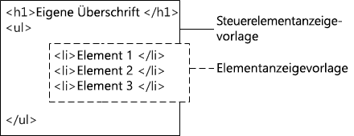

# <a name="sharepoint-design-manager-display-templates"></a><span data-ttu-id="8f872-102">Anzeigevorlagen im SharePoint-Entwurfs-Manager</span><span class="sxs-lookup"><span data-stu-id="8f872-102">SharePoint Design Manager display templates</span></span>
<span data-ttu-id="8f872-103">Hier finden Sie Informationen zu Anzeigevorlagen. Es wird erläutert, in welchem Zusammenhang diese mit Suche-Webparts stehen, wie die Vorlagen strukturiert sind, wie Eigenschaften zugeordnet und Variablen und jQuery verwendet werden und wie eine benutzerdefinierte Anzeigevorlage in SharePoint erstellt wird.</span><span class="sxs-lookup"><span data-stu-id="8f872-103">Learn about display templates, including: how they relate to Search Web Parts, how the templates are structured, how to map properties and use variables and jQuery, and how to create a custom display template in SharePoint Server 2013.</span></span>
## <a name="introduction-to-display-templates"></a><span data-ttu-id="8f872-104">Einführung in Anzeigevorlagen</span><span class="sxs-lookup"><span data-stu-id="8f872-104">Introduction to display templates</span></span>
<span data-ttu-id="8f872-105"><a name="bk_introduction"> </a></span><span class="sxs-lookup"><span data-stu-id="8f872-105"></span></span>

<span data-ttu-id="8f872-106">Anzeigevorlagen in SharePoint sind Vorlagen in Webparts, die Suchtechnologie verwenden (in diesem Artikel als Suche-Webparts bezeichnet), um die Ergebnisse einer Abfrage des Suchindex anzuzeigen.</span><span class="sxs-lookup"><span data-stu-id="8f872-106">Display templates in SharePoint are templates used in Web Parts that use search technology (referred to in this article as Search Web Parts) to show the results of a query made to the search index.</span></span> <span data-ttu-id="8f872-107">Anzeigevorlagen steuern, welche verwalteten Eigenschaften in den Suchergebnissen angezeigt werden und wie diese im Webpart angezeigt werden.</span><span class="sxs-lookup"><span data-stu-id="8f872-107">Display templates control which managed properties are shown in the search results, and how they appear in the Web Part.</span></span> <span data-ttu-id="8f872-108">Jede Anzeigevorlage besteht aus zwei Dateien: einer HTML-Version der Anzeigevorlage, die Sie im HTML-Editor bearbeiten können, und einer .js-Datei, die SharePoint verwendet.</span><span class="sxs-lookup"><span data-stu-id="8f872-108">Each display template is made of two files: an HTML version of the display template that you can edit in your HTML editor, and a .js file that SharePoint uses.</span></span>
  
    
    

> <span data-ttu-id="8f872-109">**Hinweis:** Nur Suche-Webparts können Anzeigevorlagen verwenden.</span><span class="sxs-lookup"><span data-stu-id="8f872-109">**Note:** Only Search Web Parts can use display templates.</span></span> <span data-ttu-id="8f872-110">Das Inhaltsabfrage-Webpart ist nicht suchgesteuert und verwendet daher keine Anzeigevorlagen.</span><span class="sxs-lookup"><span data-stu-id="8f872-110">Only Search Web Parts can use display templates. The Content Query Web Part is not search-driven, and so does not use display templates.</span></span> 
  
    
    

<span data-ttu-id="8f872-p103">Sie können vorhandene Anzeigevorlagen im Entwurfs-Manager anzeigen. Sie können sie aber nicht auf die gleiche Weise im Entwurfs-Manager erstellen, wie Sie Gestaltungsvorlagen und Seitenlayouts erstellen. Stattdessen gehen Sie folgendermaßen vor:</span><span class="sxs-lookup"><span data-stu-id="8f872-p103">You can view existing display templates in Design Manager, but you don't create them in Design Manager the way that you create master pages and page layouts. Instead, you:</span></span>
  
    
    

- <span data-ttu-id="8f872-113">Öffnen Sie Ihr  [dem Gestaltungsvorlagenkatalog zugeordnetes Netzwerklaufwerk](how-to-map-a-network-drive-to-the-sharepoint-master-page-gallery.md).</span><span class="sxs-lookup"><span data-stu-id="8f872-113">Open your  [mapped network drive to the Master Page Gallery](how-to-map-a-network-drive-to-the-sharepoint-master-page-gallery.md).</span></span>
    
  
- <span data-ttu-id="8f872-114">Öffnen Sie einen der vier Ordner im Ordner **Anzeigevorlagen** .</span><span class="sxs-lookup"><span data-stu-id="8f872-114">Open one of the four folders in the **Display Templates** folder.</span></span>
    
    > <span data-ttu-id="8f872-115">**Hinweis:** Der Ordner Ihrer Wahl hängt vom Typ der zu verwendenden Anzeigevorlage ab.</span><span class="sxs-lookup"><span data-stu-id="8f872-115">**Note:** The folder you choose depends on the type of display template you want to use.</span></span> <span data-ttu-id="8f872-116">Wenn Ihre Website beispielsweise websiteübergreifende Veröffentlichung verwendet, kopieren Sie eine Anzeigevorlage aus dem Ordner **Inhalt-WebParts**.</span><span class="sxs-lookup"><span data-stu-id="8f872-116">For example, if your site uses cross-site publishing, copy a display template from the **Content Web Parts** folder.</span></span> <span data-ttu-id="8f872-117">Weitere Informationen finden Sie unter [Anzeigen der Vorlagenreferenz in SharePoint Server](http://technet.microsoft.com/en-us/library/jj944947.aspx).</span><span class="sxs-lookup"><span data-stu-id="8f872-117">For more information about these and other display templates, see  [Display template reference in SharePoint Server 2013](http://technet.microsoft.com/en-us/library/jj944947.aspx).</span></span> 
- <span data-ttu-id="8f872-p105">Kopieren Sie die HTML-Datei für eine vorhandene Anzeigevorlage, die derjenigen ähnelt, die Sie erstellen möchten. Der genaue Speicherort, an den Sie die Datei kopieren, ist nicht wichtig, solange sich dieser im **Gestaltungsvorlagenkatalog** befindet.</span><span class="sxs-lookup"><span data-stu-id="8f872-p105">Copy the HTML file for an existing display template that's similar to what you want. The exact location that you copy the file to does not matter, as long as it is in the **Master Page Gallery**.</span></span>
    
  
- <span data-ttu-id="8f872-120">Öffnen und ändern Sie Ihre Kopie in einem HTML-Editor.</span><span class="sxs-lookup"><span data-stu-id="8f872-120">Open and modify your copy in an HTML editor.</span></span>
    
  
<span data-ttu-id="8f872-p106">Wenn Sie eine vorhandene Anzeigevorlage als Ausgangspunkt für eine neue Anzeigevorlage verwenden, können Sie von den hilfreichen Informationen zum Anpassungsprozess in den Kommentaren der Standardanzeigevorlagen profitieren, und Sie verfügen über einen Rahmen für einfache Aufgaben wie das Zuordnen von Eingabefeldern. Außerdem ist durch diese Vorgehensweise sichergestellt, dass Ihre Vorlagen die richtige grundlegende Seitenstruktur verwenden.</span><span class="sxs-lookup"><span data-stu-id="8f872-p106">By using an existing display template as a starting point for a new display template, you can benefit from helpful information about the customization process in the comments of the default display templates, and you have a framework in place for basic tasks such as mapping input fields. It also guarantees that your templates use the correct basic page structure.</span></span>
  
    
    
<span data-ttu-id="8f872-123">Wenn Sie durch Kopieren der HTML-Datei für eine vorhandene Anzeigevorlage im Ordner **Anzeigevorlagen** im **Gestaltungsvorlagenkatalog** eine Anzeigevorlage erstellen, gilt Folgendes:</span><span class="sxs-lookup"><span data-stu-id="8f872-123">When you create a display template by copying the HTML file for an existing display template in the **Display Templates** folder in the **Master Page Gallery**:</span></span>
  
    
    

- <span data-ttu-id="8f872-124">Eine .js-Datei mit demselben Namen wird  an dem Ort erstellt, an den Sie die HTML-Datei kopiert haben.</span><span class="sxs-lookup"><span data-stu-id="8f872-124">A .js file that has the same name is created in the location where you copied the HTML file.</span></span>
    
  
- <span data-ttu-id="8f872-125">Sämtliches Markup, das SharePoint benötigt, wird der.js-Datei hinzugefügt, sodass die Anzeigevorlage korrekt angezeigt wird.</span><span class="sxs-lookup"><span data-stu-id="8f872-125">All markup required by SharePoint Server 2013 is added to the .js file so that the display template displays correctly.</span></span>
    
  
- <span data-ttu-id="8f872-126">Die HTML-Datei und die JS-Datei werden verknüpft, sodass spätere Änderungen an der HTML-Datei mit der JS-Datei synchronisiert werden, wenn die HTML-Datei gespeichert wird.</span><span class="sxs-lookup"><span data-stu-id="8f872-126">The HTML file and the .js file are associated, so that any later edits to the HTML file are synched to the .js file when the HTML file is saved.</span></span>
    
  

> <span data-ttu-id="8f872-127">**Hinweis:** Die Synchronisierung erfolgt nur in eine Richtung.</span><span class="sxs-lookup"><span data-stu-id="8f872-127">**Note:** The syncing goes in one direction only.</span></span> <span data-ttu-id="8f872-128">Änderungen an der HTML-Anzeigevorlage werden mit der zugehörigen .js-Datei synchronisiert.</span><span class="sxs-lookup"><span data-stu-id="8f872-128">Changes to the HTML display template are synched to the associated .js file.</span></span> <span data-ttu-id="8f872-129">Im Gegensatz zu Gestaltungsvorlagen und Seitenlayouts können Sie beim Arbeiten mit Anzeigevorlagen nicht nur mit der .js-Datei arbeiten, indem Sie die Zuordnung zwischen den Dateien trennen.</span><span class="sxs-lookup"><span data-stu-id="8f872-129">Note The syncing goes in one direction only. Changes to the HTML display template are synched to the associated .js file. Unlike master pages and page layouts, when working with display templates you can't choose to work only with the .js file by breaking the association between the files. You must enter all the HTML and JavaScript in the HTML file.</span></span> <span data-ttu-id="8f872-130">Sie müssen HTML und JavaScript komplett in der HTML-Datei eingeben.</span><span class="sxs-lookup"><span data-stu-id="8f872-130">You must enter all the HTML and JavaScript in the HTML file.</span></span> 
  
    
    


## <a name="understanding-the-relationship-between-display-templates-and-search-web-parts"></a><span data-ttu-id="8f872-131">Grundlegendes zur Beziehung zwischen Anzeigevorlagen und Suche-Webparts</span><span class="sxs-lookup"><span data-stu-id="8f872-131">Understanding the relationship between display templates and Search Web Parts</span></span>
<span data-ttu-id="8f872-132"><a name="bk_DTandSWP"> </a></span><span class="sxs-lookup"><span data-stu-id="8f872-132"></span></span>

<span data-ttu-id="8f872-133">Es gibt grundsätzlich zwei Arten von Anzeigevorlagen:</span><span class="sxs-lookup"><span data-stu-id="8f872-133">There are two primary types of display templates:</span></span>
  
    
    

- <span data-ttu-id="8f872-p108">**Steuerelementvorlagen** bestimmen die allgemeine Struktur der Präsentation der Ergebnisse. Sie umfassen Listen, Listen mit Paging und Diaschauen.</span><span class="sxs-lookup"><span data-stu-id="8f872-p108">**Control templates** determine the overall structure of how the results are presented. Includes lists, lists with paging, and slide shows.</span></span>
    
  
- <span data-ttu-id="8f872-p109">**Elementvorlagen** bestimmen, wie jedes Ergebnis im Satz angezeigt wird. Beinhaltet Bilder, Text, Video und andere Elemente.</span><span class="sxs-lookup"><span data-stu-id="8f872-p109">**Item templates** determine how each result in the set is displayed. Includes images, text, video, and other items.</span></span>
    
  
<span data-ttu-id="8f872-138">Weitere Informationen zu diesen und anderen Anzeigevorlagen finden Sie unter  [Referenz der Anzeigevorlagen in SharePoint](http://technet.microsoft.com/en-us/library/jj944947.aspx).</span><span class="sxs-lookup"><span data-stu-id="8f872-138">For more information about these and other display templates, see  [Display template reference in SharePoint Server 2013](http://technet.microsoft.com/en-us/library/jj944947.aspx).</span></span>
  
    
    
<span data-ttu-id="8f872-139">Nachdem Sie einer Seite ein Such-Webpart (wie z. B. das Inhaltssuche-Webpart) hinzugefügt haben, wählen Sie zum Konfigurieren des Webparts sowohl eine Steuerelementvorlage als auch eine Elementanzeigevorlage aus (siehe Abbildung 1).</span><span class="sxs-lookup"><span data-stu-id="8f872-139">After you add a Search Web Part (such as the Content Search Web Part) to a page, to configure the Web Part, you select both a control display template and an item display template, as shown in Figure 1.</span></span>
  
    
    

<span data-ttu-id="8f872-140">**Abbildung 1. Toolbereich des Inhaltssuche-Webparts**</span><span class="sxs-lookup"><span data-stu-id="8f872-140">**Figure 1. Tool pane of Content Search Web Part**</span></span>

  
    
    

  
    
    

  
    
    
<span data-ttu-id="8f872-p110">Die Steuerelementvorlage stellt HTML bereit, um das allgemeine Layout so zu strukturieren, wie die Suchergebnisse präsentiert werden sollen. So stellt die Steuerelementvorlage möglicherweise das HTML für eine Kopfzeile und Beginn und Ende einer Liste bereit. Die Steuerelementvorlage wird im Webpart nur einmal gerendert.</span><span class="sxs-lookup"><span data-stu-id="8f872-p110">The control display template provides HTML to structure the overall layout for how you want to present the search results. For example, the control display template might provide the HTML for a heading and the beginning and end of a list. The control display template is rendered only once in the Web Part.</span></span>
  
    
    
<span data-ttu-id="8f872-p111">Die Elementanzeigevorlage stellt HTML bereit, das die Anzeige jedes Elements im Ergebnissatz bestimmt. So stellt die Elementanzeigevorlage möglicherweise das HTML für ein Listenelement bereit, das ein Bild und drei Zeilen Text enthält, die unterschiedlichen verwalteten Eigenschaften zugeordnet sind, die mit dem Element verknüpft sind. Die Elementanzeigevorlage wird für jedes Element im Ergebnissatz einmal gerendert. Wenn der Ergebnissatz zehn Elemente enthält, erstellt die Anzeigevorlage daher ihren HMTL-Abschnitt zehnmal.</span><span class="sxs-lookup"><span data-stu-id="8f872-p111">The item display template provides HTML that determines how each item in the result set is displayed. For example, the item display template might provide the HTML for a list item that contains a picture, and three lines of text that are mapped to different managed properties associated with the item. The item display template is rendered one time for each item in the result set. So, if the result set contains ten items, the item display template creates its section of HTML ten times.</span></span>
  
    
    
<span data-ttu-id="8f872-149">Wenn die Steuerelement- und die Elementanzeigevorlage auf diese Art und Weise zusammen verwendet werden, wird ein zusammenhängender HTML-Block erstellt, der im Webpart gerendert wird (siehe Abbildung 2).</span><span class="sxs-lookup"><span data-stu-id="8f872-149">When used together in this way, the control display template and the item display template combine to create a cohesive block of HTML that is rendered in the Web Part, as shown in Figure 2.</span></span>
  
    
    

<span data-ttu-id="8f872-150">**Abbildung 2. Kombinierte HTML-Ausgabe einer Steuerelementanzeigevorlage und einer Elementanzeigevorlage**</span><span class="sxs-lookup"><span data-stu-id="8f872-150">**Figure 2. Combined HTML output of a control display template and item display template**</span></span>

  
    
    

  
    
    

  
    
    
<span data-ttu-id="8f872-152">Weitere Informationen zu Anzeigevorlagen finden Sie in Artikel  [Übersicht über das SharePoint-Seitenmodell](overview-of-the-sharepoint-page-model.md) im Abschnitt "Suchgesteuerte Webparts und Anzeigevorlagen".</span><span class="sxs-lookup"><span data-stu-id="8f872-152">For more information about display templates, see the "Search-driven Web Parts and display templates" section in  [Overview of the SharePoint page model](overview-of-the-sharepoint-page-model.md).</span></span>
  
    
    

## <a name="understanding-the-display-template-structure"></a><span data-ttu-id="8f872-153">Grundlegendes zur Anzeigevorlagenstruktur</span><span class="sxs-lookup"><span data-stu-id="8f872-153">Understanding the display template structure</span></span>
<span data-ttu-id="8f872-154"><a name="bk_DTstructure"> </a></span><span class="sxs-lookup"><span data-stu-id="8f872-154"></span></span>

<span data-ttu-id="8f872-p112">Die HTML-Datei, die für eine Anzeigevorlage verwendet wird, ist ein vollständiges HTML-Dokument, stellt aber keine vollständige HTML-Webseite dar. SharePoint wandelt die Teile der HTML-Anzeigevorlagendatei in JavaScript um. In diesem Abschnitt werden die vier wichtigsten Abschnitte einer Anzeigevorlage beschrieben.</span><span class="sxs-lookup"><span data-stu-id="8f872-p112">The HTML file that is used for a display template is a fully-formed HTML document, but it does not represent a full HTML webpage. SharePoint converts the pieces of the display template HTML file into JavaScript. This section describes the four major sections of a display template.</span></span>
  
    
    

### <a name="title-tag"></a><span data-ttu-id="8f872-158">Tag „title“</span><span class="sxs-lookup"><span data-stu-id="8f872-158">Title tag</span></span>

<span data-ttu-id="8f872-159">Der Text im Tag **\<title\>** in einer Anzeigevorlagendatei wird als der Anzeigename im Abschnitt **Anzeigevorlagen** des Webpart-Bearbeitungsbereichs verwendet, wenn sich das Suche-Webpart im Bearbeitungsmodus befindet. </span><span class="sxs-lookup"><span data-stu-id="8f872-159">The text in the    tag in a display template file is used as the display name in the Display Templates section of the Web Part edit pane when the Search Web Part is in edit mode. The following example is for the item display template named Item_Picture3Lines.html:</span></span> <span data-ttu-id="8f872-160">Das folgende Beispiel bezieht sich auf die Elementanzeigevorlage mit dem Namen „Item_Picture3Lines.html“":</span><span class="sxs-lookup"><span data-stu-id="8f872-160">The following example is for the item display template named Item_Picture3Lines.html:</span></span>
  
    

```HTML

<title>Picture on left, 3 lines on right</title>
```


### <a name="header-properties"></a><span data-ttu-id="8f872-161">Eigenschaften der Kopfzeile</span><span class="sxs-lookup"><span data-stu-id="8f872-161">Header properties</span></span>

<span data-ttu-id="8f872-162">Direkt nach dem Tag **\<title\>** findet sich ein Satz benutzerdefinierter Elemente, die mit folgendem Markup versehen sind:</span><span class="sxs-lookup"><span data-stu-id="8f872-162">Immediately after the <title> tag, there is a set of custom elements bounded by the following markup:</span></span>
  
    
    

```HTML
<!--[if gte mso 9]><xml>
<mso:CustomDocumentProperties>
…
</mso:CustomDocumentProperties>
</xml><![endif]-->

```

<span data-ttu-id="8f872-p114">Diese Elemente und deren Eigenschaften liefern der SharePoint-Umgebung wichtige Informationen zur Anzeigevorlage. Tabelle 1 beschreibt die benutzerdefinierten Eigenschaften, die in Anzeigevorlagen verwendet werden.</span><span class="sxs-lookup"><span data-stu-id="8f872-p114">These elements and their properties provide important information to the SharePoint environment about the display template. Table 1 describes the custom properties that are used in display templates.</span></span>
  
    
    

> <span data-ttu-id="8f872-165">**Hinweis:** Nicht alle benutzerdefinierten Eigenschaften in jeder Anzeigevorlage werden verwendet.</span><span class="sxs-lookup"><span data-stu-id="8f872-165">**Note:** Not all custom properties are used in every display template.</span></span> <span data-ttu-id="8f872-166">Außerdem können einige Eigenschaften geändert werden, indem die Eigenschaften der Anzeigevorlagendatei im Entwurfs-Manager bearbeitet werden.</span><span class="sxs-lookup"><span data-stu-id="8f872-166">Not all custom properties are used in every display template. Also, some properties can be changed by editing the display template file properties in Design Manager.</span></span> 
  
    
    


<span data-ttu-id="8f872-167">**Tabelle 1. Liste der CustomDocumentProperties-Einträge**</span><span class="sxs-lookup"><span data-stu-id="8f872-167">**Table 1. List of CustomDocumentProperties entries**</span></span>


|<span data-ttu-id="8f872-168">**Eigenschaft**</span><span class="sxs-lookup"><span data-stu-id="8f872-168">**Property**</span></span>|<span data-ttu-id="8f872-169">**Beschreibung**</span><span class="sxs-lookup"><span data-stu-id="8f872-169">**Description**</span></span>|
|:-----|:-----|
|<span data-ttu-id="8f872-170">**TemplateHidden**</span><span class="sxs-lookup"><span data-stu-id="8f872-170">**TemplateHidden**</span></span> <br/> |<span data-ttu-id="8f872-p116">Boolescher Wert, der angibt, ob die Anzeigevorlage in der Liste verfügbarer Vorlagen im Webpart ausgeblendet werden soll. Dieser Wert kann in den Eigenschaften der Anzeigevorlagendatei geändert werden.</span><span class="sxs-lookup"><span data-stu-id="8f872-p116">Boolean value that indicates whether to hide the display template from the list of available templates in the Web Part. This value can be changed in the display template file properties.</span></span>  <br/> |
|<span data-ttu-id="8f872-173">**ManagedPropertyMapping**</span><span class="sxs-lookup"><span data-stu-id="8f872-173">**ManagedPropertyMapping**</span></span> <br/> |<span data-ttu-id="8f872-p117">Ordnet Felder, die von Suchergebniselemente verfügbar gemacht werden, für JavaScript verfügbaren Eigenschaften zu. Wird nur in Elementvorlagen verwendet.</span><span class="sxs-lookup"><span data-stu-id="8f872-p117">Maps fields exposed by search result items into properties available for JavaScript. Used only in item templates.</span></span>  <br/> |
|<span data-ttu-id="8f872-176">**MasterPageDescription**</span><span class="sxs-lookup"><span data-stu-id="8f872-176">**MasterPageDescription**</span></span> <br/> |<span data-ttu-id="8f872-p118">Liefert eine benutzerfreundliche Beschreibung der Anzeigevorlage. Diese wird Benutzern in der SharePoint-Bearbeitungsumgebung angezeigt. Dieser Wert kann in den Eigenschaften der Anzeigevorlagendatei geändert werden.</span><span class="sxs-lookup"><span data-stu-id="8f872-p118">Provides a friendly description of the display template. This is shown to users in the SharePoint editing environment. This value can be changed in the display template file properties.</span></span>  <br/> |
|<span data-ttu-id="8f872-180">**ContentTypeId**</span><span class="sxs-lookup"><span data-stu-id="8f872-180">**ContentTypeId**</span></span> <br/> |<span data-ttu-id="8f872-181">Die ID des mit der Anzeigevorlage verknüpften Inhaltstyps.</span><span class="sxs-lookup"><span data-stu-id="8f872-181">The ID of the content type associated with the display template.</span></span>  <br/> |
|<span data-ttu-id="8f872-182">**TargetControlType**</span><span class="sxs-lookup"><span data-stu-id="8f872-182">**TargetControlType**</span></span> <br/> |<span data-ttu-id="8f872-p119">Gibt den Kontext an, in dem die Anzeigevorlage verwendet wird. Dieser Wert kann in den Eigenschaften der Anzeigevorlagendatei geändert werden.</span><span class="sxs-lookup"><span data-stu-id="8f872-p119">Indicates the context in which the display template is used. This value can be changed in the display template file properties.</span></span>  <br/> |
|<span data-ttu-id="8f872-185">**HtmlDesignAssociated**</span><span class="sxs-lookup"><span data-stu-id="8f872-185">**HtmlDesignAssociated**</span></span> <br/> |<span data-ttu-id="8f872-186">Boolesche Wert, der angibt, ob mit einer HTML-Anzeigevorlagendatei eine JS-Datei verknüpft ist.</span><span class="sxs-lookup"><span data-stu-id="8f872-186">Boolean value that indicates whether a display template HTML file has a .js file associated with it.</span></span>  <br/> |
|<span data-ttu-id="8f872-187">**HtmlDesignConversionSucceeded**</span><span class="sxs-lookup"><span data-stu-id="8f872-187">**HtmlDesignConversionSucceeded**</span></span> <br/> |<span data-ttu-id="8f872-p120">Gibt an, ob der Konvertierungsprozess erfolgreich war. Dieser Wert wird der Datei von SharePoint automatisch hinzugefügt und wird nur in benutzerdefinierten Anzeigevorlagen verwendet.</span><span class="sxs-lookup"><span data-stu-id="8f872-p120">Indicates whether the conversion process was successful. This value is automatically added to the file by SharePoint, and is used only in custom display templates.</span></span>  <br/> |
|<span data-ttu-id="8f872-190">**HtmlDesignStatusAndPreview**</span><span class="sxs-lookup"><span data-stu-id="8f872-190">**HtmlDesignStatusAndPreview**</span></span> <br/> |<span data-ttu-id="8f872-p121">Enthält die URL zur HTML-Datei und den Text für die Spalte **Status** (entweder **Konvertierung erfolgreich** oder **Warnungen und Fehler**). Dieser Wert wird der Datei von SharePoint automatisch hinzugefügt und wird nur in benutzerdefinierten Anzeigevorlagen verwendet.  </span><span class="sxs-lookup"><span data-stu-id="8f872-p121">Contains the URL to the HTML file and the text for the **Status** column (either **Conversion successful** or **Warnings and Errors**). This value is automatically added to the file by SharePoint, and is used only in custom display templates.  </span></span><br/> |
   

### <a name="script-block"></a><span data-ttu-id="8f872-193">Skriptblock</span><span class="sxs-lookup"><span data-stu-id="8f872-193">Script block</span></span>
<span data-ttu-id="8f872-194"><a name="bk_scriptblock"> </a></span><span class="sxs-lookup"><span data-stu-id="8f872-194"></span></span>

<span data-ttu-id="8f872-195">Im Tag **\<body\>** sehen Sie das folgende **\<script\>**-Tag:</span><span class="sxs-lookup"><span data-stu-id="8f872-195">Inside the <body> tag, you can see the following <script> tag:</span></span>
  
    
    

```HTML

<script>
     $includeLanguageScript(this.url, "~sitecollection/_catalogs/masterpage/Display Templates/Language Files/{Locale}/CustomStrings.js");
</script>
```

<span data-ttu-id="8f872-196">Standardmäßig ist diese Zeile in allen Anzeigevorlagen enthalten.</span><span class="sxs-lookup"><span data-stu-id="8f872-196">By default, this line is included in all display templates.</span></span> <span data-ttu-id="8f872-197">Sie können weitere Codezeilen im Tag ** \<script\> ** hinzufügen, um CSS-Dateien oder andere JavaScript-Dateien außerhalb Ihrer HTML-Datei für die Hauptanzeigevorlage zu referenzieren.</span><span class="sxs-lookup"><span data-stu-id="8f872-197">By default, this line is included in all display templates. You can add more lines of code inside the    tag to reference CSS files or other JavaScript files outside your main display template HTML file. Table 2 shows examples for how to include other resources.</span></span> <span data-ttu-id="8f872-198">Tabelle 2 zeigt Beispiele, wie Sie andere Ressourcen einschließen.</span><span class="sxs-lookup"><span data-stu-id="8f872-198">Table 2 shows examples for how to include other resources.</span></span>
  
    
    

<span data-ttu-id="8f872-199">**Tabelle 2. Beispiele für das Einschließen externer Ressourcen in das Tag \<script\>**</span><span class="sxs-lookup"><span data-stu-id="8f872-199">Table 2. Examples for including external resources in the <script> tag</span></span>


|<span data-ttu-id="8f872-200">**Wenn Sie Folgendes einschließen möchten:**</span><span class="sxs-lookup"><span data-stu-id="8f872-200">**If you want to include the following:**</span></span>|<span data-ttu-id="8f872-201">**Verwenden Sie den folgenden Code:**</span><span class="sxs-lookup"><span data-stu-id="8f872-201">**Use the following code:**</span></span>|
|:-----|:-----|
|<span data-ttu-id="8f872-202">Eine JavaScript-Datei, die Teil der aktuellen Websitesammlung ist</span><span class="sxs-lookup"><span data-stu-id="8f872-202">A JavaScript file that is part of the current site collection</span></span>  <br/> | `$includeScript(this.url, "~sitecollection/_catalogs/masterpage/Display Templates/Content Web Parts/MyScripts.js");` <br/> |
|<span data-ttu-id="8f872-203">Eine externe JavaScript-Datei</span><span class="sxs-lookup"><span data-stu-id="8f872-203">An external JavaScript file</span></span>  <br/> | `$includeScript(this.url, "http://www.contoso.com/ExternalScript.js");` <br/> |
|<span data-ttu-id="8f872-204">Eine CSS-Datei, die Teil der aktuellen Websitesammlung ist</span><span class="sxs-lookup"><span data-stu-id="8f872-204">A CSS file that is part of the current site collection</span></span>  <br/> | `$includeCSS(this.url, "~sitecollection/_catalogs/masterpage/Display Templates/Content Web Parts/MyCSS.css");` <br/> |
|<span data-ttu-id="8f872-205">Eine CSS-Datei, die sich an einem Speicherort relativ zur aktuellen Anzeigevorlage befindet</span><span class="sxs-lookup"><span data-stu-id="8f872-205">A CSS file that is in a location relative to the current display template</span></span>  <br/> | `$includeCSS(this.url,"../../MyStyles/MyCSS.css");` <br/> |
   

> <span data-ttu-id="8f872-206">**Hinweis:** Wenn für Elemente im Gestaltungsvorlagenkatalog eine **Inhaltsgenehmigung** erforderlich ist, müssen alle Ressourcendateien (einschließlich CSS- und .js-Dateien) veröffentlicht werden, bevor sie für Gestaltungsvorlagen und Seitenlayouts verfügbar sind.</span><span class="sxs-lookup"><span data-stu-id="8f872-206">**Note** If **Content Approval** is required for items in the Master Page Gallery, all resource files (including CSS and .js files) must be published before they are available to master pages and page layouts. For more information, see Require approval of items in a site list or library.</span></span> <span data-ttu-id="8f872-207">Weitere Informationen finden Sie unter [Festlegen einer Genehmigungsanforderung für Elemente in einer Websiteliste oder -bibliothek](http://office.microsoft.com/en-us/sharepoint-help/require-approval-of-items-in-a-site-list-or-library-HA102853936.aspx?CTT=1).</span><span class="sxs-lookup"><span data-stu-id="8f872-207">For more information, see [Require approval of items in a site list or library](http://office.microsoft.com/en-us/sharepoint-help/require-approval-of-items-in-a-site-list-or-library-HA102853936.aspx?CTT=1).</span></span> 
  
    
    


### <a name="div-block"></a><span data-ttu-id="8f872-208">DIV-Block</span><span class="sxs-lookup"><span data-stu-id="8f872-208">DIV block</span></span>
<span data-ttu-id="8f872-209"><a name="bk_scriptblock"> </a></span><span class="sxs-lookup"><span data-stu-id="8f872-209"></span></span>

<span data-ttu-id="8f872-210">Dem Tag **\<script\>** folgt das Tag **\<div\>** mit einer ID.</span><span class="sxs-lookup"><span data-stu-id="8f872-210">Following the **\<script\>** tag is a **\<div\>** tag with an ID.</span></span> <span data-ttu-id="8f872-211">Standardmäßig entspricht die ID für das Tag ** \<div\> ** dem Namen der HTML-Datei.</span><span class="sxs-lookup"><span data-stu-id="8f872-211">By default, the ID for this **\<div\>** tag matches the name of the HTML file.</span></span> <span data-ttu-id="8f872-212">HTML oder Code, die/den die Anzeigevorlage bereitstellen soll, muss im Tag **\<div\>** enthalten sein.</span><span class="sxs-lookup"><span data-stu-id="8f872-212">Any HTML or code that you want the display template to provide must be included inside this **\<div\>** tag.</span></span> <span data-ttu-id="8f872-213">Aber das Tag selbst ist nicht im Markup enthalten, das auf der Webseite zur Laufzeit wiedergegeben wird.</span><span class="sxs-lookup"><span data-stu-id="8f872-213">But, the tag itself is not included in the markup that is rendered on the webpage at run time.</span></span>
  
    
    

> <span data-ttu-id="8f872-214">**Hinweis:** Wenn Sie eine CSS-Formatvorlage oder eine ID zum HTML-Block zuweisen, der auf der Seite zur Laufzeit zurückgegeben wird, können Sie ein neues Tag im ersten **\<div\>**-Tag hinzufügen.</span><span class="sxs-lookup"><span data-stu-id="8f872-214">Note If you want to assign a CSS style or an ID to the block of HTML that is rendered on the page at run time, you can add a new tag inside the first    tag. You can also assign a CSS style or an ID to the HTML that surrounds the variable  in the control template. The variable  is used to render the HTML that surrounds the query results that are rendered by the item template.</span></span> <span data-ttu-id="8f872-215">Sie können eine CSS-Formatvorlage oder ID auch zum HTML-Code zuweisen, der die Variable `_#= ctx.RenderGroups(ctx) =#_` in der Steuerelementvorlage umgibt.</span><span class="sxs-lookup"><span data-stu-id="8f872-215">You can also assign a CSS style or an ID to the HTML that surrounds the variable `_#= ctx.RenderGroups(ctx) =#_` in the control template.</span></span> <span data-ttu-id="8f872-216">Die Variable `_#= ctx.RenderGroups(ctx) =#_` wird verwendet, um den HTML-Code wiederzugeben, der die Abfrageergebnisse umgibt, die von der Elementvorlage wiedergegeben werden.</span><span class="sxs-lookup"><span data-stu-id="8f872-216">The variable `_#= ctx.RenderGroups(ctx) =#_` is used to render the HTML that surrounds the query results that are rendered by the item template.</span></span>
  
    
    

<span data-ttu-id="8f872-217">Im ersten ** \<div\> **-Tag sehen Sie Code in Kommentarblöcken, der mit ** \<!-- #\_ ** beginnt und mit ** \_#--\>** endet.</span><span class="sxs-lookup"><span data-stu-id="8f872-217">In the first **\<div\>** tag you'll see code inside comment blocks that begin with **\<!--#\_** and end with **\_#--\>**.</span></span> <span data-ttu-id="8f872-218">Sie verwenden JavaScript-Code in diesen Blöcken und HTML außerhalb der Blöcke.</span><span class="sxs-lookup"><span data-stu-id="8f872-218">You use JavaScript code inside these blocks, and HTML outside the blocks.</span></span> <span data-ttu-id="8f872-219">Sie können mit diesen Blöcken auch den HTML-Code mit bedingten Anweisungen steuern.</span><span class="sxs-lookup"><span data-stu-id="8f872-219">You can also use these blocks to control the HTML with conditional statements.</span></span> <span data-ttu-id="8f872-220">Verwenden Sie dazu einen Kommentarblock mit der bedingten Anweisung und einer öffnenden Klammer, gefolgt vom HTML-Code, gefolgt von einem weiteren Kommentarblock mit einer schließenden Klammer.</span><span class="sxs-lookup"><span data-stu-id="8f872-220">To do this, use a comment block with the conditional statement and opening bracket, followed by HTML, followed by another comment block with the closing bracket.</span></span> <span data-ttu-id="8f872-221">Im folgenden Beispiel wird das Anker-Tag nur auf der Seite wiedergegeben, wenn den Wert für das Objekt **linkURL** nicht leer ist.</span><span class="sxs-lookup"><span data-stu-id="8f872-221">In the following example, the anchor tag is rendered on the page only if the value for the **linkURL** object is not empty.</span></span>
  
    
    


```HTML

<!--#_
if(!linkURL.isEmpty)
{
_#-->
     <a class="cbs-pictureImgLink" href="_#= linkURL =#_" title="_#= $htmlEncode(line1.defaultValueRenderer(line1)) =#_" id="_#= pictureLinkId =#_">
<!--#_
}
_#-->

```


## <a name="mapping-input-properties-and-getting-their-values"></a><span data-ttu-id="8f872-222">Zuordnen von Eingabeeigenschaften und Abrufen ihrer Werte</span><span class="sxs-lookup"><span data-stu-id="8f872-222">Mapping input properties and getting their values</span></span>
<span data-ttu-id="8f872-223"><a name="bk_mapproperties"> </a></span><span class="sxs-lookup"><span data-stu-id="8f872-223"></span></span>

<span data-ttu-id="8f872-p127">Der Kopfzeilenbereich einer Elementanzeigevorlage weist eine benutzerdefinierte Dokumenteigenschaft namens **ManagedPropertyMapping** auf. Diese Eigenschaft ordnet die verwalteten Eigenschaften, die von der Suche verwendet werden, Werten zu, die von der Anzeigevorlage verwendet werden können. Die Eigenschaft ist eine durch Kommas getrennte Werteliste im folgenden Format: ' _Anzeigename der Eigenschaft_'{ _Eigenschaftsname_}:' _verwaltete Eigenschaft_'. Beispiel:  `'Picture URL'{Picture URL}:'PublishingImage;PictureURL;PictureThumbnailURL'`.</span><span class="sxs-lookup"><span data-stu-id="8f872-p127">The header section of an item display template has a custom document property named **ManagedPropertyMapping**. This property takes the managed properties that are used by search and maps them to values that can be used by the display template. The property is a comma-delimited list of values that uses the following format: ' _property display name_'{ _property name_}:' _managed property_'. For example,  `'Picture URL'{Picture URL}:'PublishingImage;PictureURL;PictureThumbnailURL'`.</span></span>
  
    
    
<span data-ttu-id="8f872-228">Im Folgenden wird das Format näher erläutert:</span><span class="sxs-lookup"><span data-stu-id="8f872-228">Let's look at the format in more detail:</span></span>
  
    
    

-  <span data-ttu-id="8f872-229">_Anzeigename der Eigenschaft_ ist der Eigenschaftsname, der im Bearbeitungsbereich des Webparts angezeigt wird, wenn die Anzeigevorlage ausgewählt wird.</span><span class="sxs-lookup"><span data-stu-id="8f872-229">_property display name_ is the property name that shows in the Web Part editing pane when the display template is selected.</span></span>
    
  
-  <span data-ttu-id="8f872-p128">_Eigenschaftsname_ ist ein Bezeichner, der lokalisierte Zeichenfolgeressourcen verwendet, um den Namen der verwalteten Eigenschaft nachzuschlagen. Er verwendet auch den Wert, der im Menü mit den Webparteinstellungen im Abschnitt **Eigenschaftszuordnungen** angezeigt wird. Wenn Sie die Einstellungen für ein Webpart bearbeiten, können Sie diesen Wert ändern, um zu ändern, welche verwaltete Eigenschaft mit dem im Webpart angezeigten Feld verknüpft wird.</span><span class="sxs-lookup"><span data-stu-id="8f872-p128">_property name_ is an identifier that uses localized string resources to look up the name of the managed property. It is also the value that appears in the **Property Mappings** section of the Web Part settings menu. When you edit the settings for a Web Part, you can change this value to change what managed property is associated with the field that appears in the Web Part.</span></span>
    
  
-  <span data-ttu-id="8f872-p129">_verwaltete Eigenschaft_ ist eine Zeichenfolge einer oder mehrerer verwalteter Eigenschaften, die durch Strichpunkte getrennt sind. Zur Laufzeit wird diese Liste von links nach rechts gelesen, und der erste Wert, der mit dem Namen einer verwalteten Eigenschaft des aktuellen Suchelements übereinstimmt, wird diesem Slot zugeordnet. Dadurch können Sie einen Anzeigenamen schreiben, der mit mehreren Elementtypen verwendet werden kann, und der bei Vorhandensein kompatibler Eigenschaften konsistentes Rendering verwenden kann.</span><span class="sxs-lookup"><span data-stu-id="8f872-p129">_managed property_ is a string of one or more managed properties, separated by semicolons. At run time, the list is evaluated from left to right, and the first value that matches the name of a managed property of the current search item will have its value mapped to this slot. This enables you to write a display template that can work with multiple item types and that can use consistent rendering if compatible properties are present.</span></span>
    
  
<span data-ttu-id="8f872-236">Nachdem Sie eine Eigenschaft zugeordnet haben, können Sie mit folgendem Code deren Wert in Skript abrufen:  `var pictureURL = $getItemValue(ctx, "Picture URL");`</span><span class="sxs-lookup"><span data-stu-id="8f872-236">After you map a property, you can get its value in script by using the following code:  `var pictureURL = $getItemValue(ctx, "Picture URL");`</span></span>
  
    
    
<span data-ttu-id="8f872-p130">Der zweite Parameter, der an **$getItemValue()** übergeben wird, muss dem Anzeigenamen der Eigenschaft in einfachen Anführungszeichen entsprechen, der im **ManagedPropertyMapping**-Element verwendet wird. In diesem Beispiel ist **Picture URL** der Eigenschaftsname, der an **$getItemValue()** übergeben wird.</span><span class="sxs-lookup"><span data-stu-id="8f872-p130">The second parameter that is passed to **$getItemValue()** must match the property display name in single quotes used in the **ManagedPropertyMapping** element. In this example, **Picture URL** is the property name that is passed to **$getItemValue()**.</span></span>
  
    
    
<span data-ttu-id="8f872-p131">Dieser Code gibt ein Wertinformationsobjekt zurück ( **valueInfoObj**). Dieses Objekt enthält eine Rohdarstellung des Eingabewerts, zusammen mit dem Wert, auf den eine Standardcodierung angewendet wurde.</span><span class="sxs-lookup"><span data-stu-id="8f872-p131">This code returns a value information object ( **valueInfoObj**). This object contains a raw representation of the input value, together with the value with a default encoding applied to it.</span></span>
  
    
    
<span data-ttu-id="8f872-p132">Sie können Variablen innerhalb der Abschnitte von JavaScript verwenden, wie Sie das normalerweise tun würden, um Variablen zu bearbeiten und HTML-Zeichenfolgen zu erstellen, die zur Laufzeit auf der Seite gerendert werden. Um Variablen zu referenzieren, die im Skript direkt im HTML deklariert wurden, müssen Sie allerdings das folgende Format verwenden: _#=  _variableName_ =#_. Um z. B. die Variable **pictureURL** als den Wert für ein Bild zu verwenden, müssen Sie den folgenden HTML-Code verwenden: ``</span><span class="sxs-lookup"><span data-stu-id="8f872-p132">You can use variables within the sections of JavaScript as you typically would, to manipulate variables and create HTML strings to be rendered on the page at run time. But, to reference variables declared in the script directly in the HTML, you must use the following format: _#=  _variableName_ =#_. For example, to use the variable **pictureURL** as the value for an image, you use the following HTML: ``</span></span>
  
    
    

## <a name="using-jquery-with-display-templates"></a><span data-ttu-id="8f872-244">Verwenden von jQuery mit Anzeigevorlagen</span><span class="sxs-lookup"><span data-stu-id="8f872-244">Using jQuery with display templates</span></span>
<span data-ttu-id="8f872-245"><a name="bk_jQuery"> </a></span><span class="sxs-lookup"><span data-stu-id="8f872-245"></span></span>

<span data-ttu-id="8f872-p133">Sie können für Ihre Anzeigevorlagen jQuery verwenden. Beachten Sie dabei allerdings folgende zwei Punkte:</span><span class="sxs-lookup"><span data-stu-id="8f872-p133">You can use jQuery with your display templates. But, be aware of two important factors:</span></span>
  
    
    

- <span data-ttu-id="8f872-248">Um die jQuery-Bibliotheken in Ihre Anzeigevorlage einzuschließen, befolgen Sie die im Abschnitt  [Skriptblock](#bk_scriptblock) weiter oben in diesem Artikel beschriebenen Anweisungen.</span><span class="sxs-lookup"><span data-stu-id="8f872-248">To include the jQuery libraries in your display template, follow the directions described in the  [Script block](#bk_scriptblock) section, earlier in this article.</span></span>
    
  
- <span data-ttu-id="8f872-249">Wenn Sie ID-Auswahlen in jQuery verwenden, erstellen Sie eine Variable für die ID mit dem folgenden Code:  `var containerQueryId = '#' + '_#= containerId =#_';`</span><span class="sxs-lookup"><span data-stu-id="8f872-249">If you use ID selectors in jQuery, use the following code to create a variable for the ID:  `var containerQueryId = '#' + '_#= containerId =#_';`</span></span>
    
    <span data-ttu-id="8f872-250">Verwenden Sie den folgenden Code, um die Auswahl in jQuery zu referenzieren:  `$('_#= containerQueryId =#_')`</span><span class="sxs-lookup"><span data-stu-id="8f872-250">Use the following code to reference the selector in jQuery:  `$('_#= containerQueryId =#_')`</span></span>
    
  

## <a name="create-a-display-template"></a><span data-ttu-id="8f872-251">Erstellen einer Anzeigevorlage</span><span class="sxs-lookup"><span data-stu-id="8f872-251">Create a display template</span></span>
<span data-ttu-id="8f872-252"><a name="bk_createDT"> </a></span><span class="sxs-lookup"><span data-stu-id="8f872-252"></span></span>

<span data-ttu-id="8f872-p134">Bevor Sie mithilfe des folgenden Verfahrens eine Anzeigevorlage erstellen können, müssen Sie ein zugeordnetes Netzwerklaufwerk haben, das auf den **Gestaltungsvorlagenkatalog** verweist. Weitere Informationen finden Sie unter [Gewusst wie: Zuordnen eines Netzlaufwerks zum SharePoint-Gestaltungsvorlagenkatalog](how-to-map-a-network-drive-to-the-sharepoint-master-page-gallery.md).</span><span class="sxs-lookup"><span data-stu-id="8f872-p134">Before you can create a display template by using the following procedure, you must have a mapped network drive that points to the **Master Page Gallery**. For more information, see  [How to: Map a network drive to the SharePoint Master Page Gallery](how-to-map-a-network-drive-to-the-sharepoint-master-page-gallery.md).</span></span>
  
    
    

### <a name="to-create-a-display-template"></a><span data-ttu-id="8f872-255">So erstellen Sie eine Anzeigevorlage</span><span class="sxs-lookup"><span data-stu-id="8f872-255">To create a display template</span></span>


1. <span data-ttu-id="8f872-256">Öffnen Sie mithilfe von Windows Explorer das auf den **Gestaltungsvorlagenkatalog** verweisende zugeordnete Netzwerklaufwerk.</span><span class="sxs-lookup"><span data-stu-id="8f872-256">Using Windows Explorer, open the mapped network drive to the **Master Page Gallery**.</span></span>
    
  
2. <span data-ttu-id="8f872-257">Öffnen Sie den Ordner **Anzeigevorlagen** und dann den Ordner **Inhalt-Webparts**.</span><span class="sxs-lookup"><span data-stu-id="8f872-257">Open the **Display Templates** folder, and then open the **Content Web Parts** folder.</span></span>
    
  
3. <span data-ttu-id="8f872-258">Kopieren Sie die HTML-Datei für eine Anzeigevorlage, die dem ähnelt, was Sie erstellen möchten.</span><span class="sxs-lookup"><span data-stu-id="8f872-258">Copy the HTML file for a display template that is similar to what you want to create. For a list of the default display templates and their descriptions, see  Display template reference in SharePoint Server 2013.</span></span> <span data-ttu-id="8f872-259">Eine Liste der Standardanzeigevorlagen und ihre Beschreibungen finden Sie unter  [Anzeigen der Vorlagenreferenz in SharePoint Server](http://technet.microsoft.com/en-us/library/jj944947.aspx).</span><span class="sxs-lookup"><span data-stu-id="8f872-259">Copy the HTML file for a display template that is similar to what you want to create. For a list of the default display templates and their descriptions, see  [Display template reference in SharePoint Server 2013](http://technet.microsoft.com/en-us/library/jj944947.aspx).</span></span>
    
    <span data-ttu-id="8f872-260">SharePoint kopiert jetzt die HTML-Datei in eine .js-Datei mit demselben Namen.</span><span class="sxs-lookup"><span data-stu-id="8f872-260">At this point, SharePoint copies the HTML file into a .js file that has the same name.</span></span> <span data-ttu-id="8f872-261">Wenn die kopierte HTML-Datei beispielsweise „Item_Picture3Line_copy.html“ heißt, wird auch eine entsprechende .js-Datei mit dem Namen „Item_Picture3Lines_copy.js“ erstellt.</span><span class="sxs-lookup"><span data-stu-id="8f872-261">For example, if the copied HTML file is named Item_Picture3Line_copy.html, a corresponding .js file named Item_Picture3Lines_copy.js is also created.</span></span> <span data-ttu-id="8f872-262">Wenn Sie die Datei umbenennen, ändert sich auch der Name der entsprechenden .js-Datei.</span><span class="sxs-lookup"><span data-stu-id="8f872-262">If you choose to rename the file, the corresponding .js file name also changes.</span></span>
    
  
4. <span data-ttu-id="8f872-p137">Um die Anzeigevorlage anzupassen, bearbeiten Sie die HTML-Datei auf dem Server. Verwenden Sie zum Öffnen und Bearbeiten der HTML-Datei auf dem zugeordneten Laufwerk einen HTML-Editor. Immer wenn Sie die HTML-Datei speichern, werden die Änderungen mit der entsprechenden JS-Datei synchronisiert.</span><span class="sxs-lookup"><span data-stu-id="8f872-p137">To customize the display template, edit the HTML file that resides on the server by using an HTML editor to open and edit the HTML file in the mapped drive. Each time that you save the HTML file, any changes are synched to the associated .js file.</span></span>
    
  
5. <span data-ttu-id="8f872-265">Wechseln Sie zu Ihrer Veröffentlichungswebsite.</span><span class="sxs-lookup"><span data-stu-id="8f872-265">Browse to your publishing site.</span></span>
    
  
6. <span data-ttu-id="8f872-266">Wählen Sie in der rechten oberen Ecke der Seite **Einstellungen** und dann **Entwurfs-Manager**.</span><span class="sxs-lookup"><span data-stu-id="8f872-266">In the upper-right corner of the page, choose **Settings**, and then choose **Design Manager**.</span></span>
    
  
7. <span data-ttu-id="8f872-p138">Wählen Sie im Entwurfs-Manager im linken Navigationsbereich **Anzeigevorlagen bearbeiten** aus. Ihre HTML-Datei wird nun mit der Spalte **Status** angezeigt, die einen der zwei Status aufweist:</span><span class="sxs-lookup"><span data-stu-id="8f872-p138">In Design Manager, in the left navigation pane, choose **Edit Display Templates**. Your HTML file now appears with a **Status** column that shows one of two statuses:</span></span>
    
  - <span data-ttu-id="8f872-269">Fehler</span><span class="sxs-lookup"><span data-stu-id="8f872-269">**Warnings and Errors**</span></span>
    
  
  - <span data-ttu-id="8f872-270">**Konvertierung erfolgreich**</span><span class="sxs-lookup"><span data-stu-id="8f872-270">**Conversion successful**</span></span>
    
  

    > <span data-ttu-id="8f872-271">**Hinweis:** Im Gegensatz zu Gestaltungsvorlagen und Seitenlayouts können Sie nicht die Vorschauseite verwenden, um eine serverseitige Livevorschau Ihrer Anzeigevorlage anzuzeigen.</span><span class="sxs-lookup"><span data-stu-id="8f872-271">**Note:** Unlike master pages and page layouts, you can't use the preview page to see a live server-side preview of your display template.</span></span> <span data-ttu-id="8f872-272">Um eine Vorschau der Anzeigevorlage anzuzeigen, müssen Sie ein Inhaltssuche-Webpart zu einer Seite hinzufügen und dann die Anzeigevorlage im Bearbeitungsbereich des Inhaltssuche-Webpart anwenden.</span><span class="sxs-lookup"><span data-stu-id="8f872-272">To preview the display template, you must add a Content Search Web Part to a page, and then apply the display template in the Content Search Web Part edit pane.</span></span> <span data-ttu-id="8f872-273">Wenn in der Anzeigevorlage Fehler vorhanden sind, zeigt das Inhaltssuche-Webpart eine Fehlermeldung an.</span><span class="sxs-lookup"><span data-stu-id="8f872-273">If there are any errors in the display template, the Content Search Web Part displays an error message.</span></span> <span data-ttu-id="8f872-274">Fehler müssen behoben werden, bevor die Anzeigevorlage korrekt angezeigt wird.</span><span class="sxs-lookup"><span data-stu-id="8f872-274">Errors must be fixed before the display template can display correctly.</span></span> 
8. <span data-ttu-id="8f872-p140">Bearbeiten Sie zur Behebung von Fehlern die HTML-Datei auf dem Server. Verwenden Sie zum Öffnen und Bearbeiten der HTML-Datei auf dem zugeordneten Laufwerk einen HTML-Editor. Speichern Sie die Anzeigevorlage, und laden Sie dann die Seite mit dem Inhaltssuche-Webpart, welche die Anzeigevorlage verwendet, neu.</span><span class="sxs-lookup"><span data-stu-id="8f872-p140">To fix any errors, edit the HTML file that resides on the server by using an HTML editor to open and edit the HTML file on the mapped drive. Save the display template, and then reload the page that contains the Content Search Web Part that uses the display template.</span></span>
    
  

## <a name="additional-resources"></a><span data-ttu-id="8f872-277">Zusätzliche Ressourcen</span><span class="sxs-lookup"><span data-stu-id="8f872-277">Additional resources</span></span>
<span data-ttu-id="8f872-278"><a name="bk_addresources"> </a></span><span class="sxs-lookup"><span data-stu-id="8f872-278"></span></span>


-  [<span data-ttu-id="8f872-279">Übersicht über den Entwurfs-Manager in SharePoint</span><span class="sxs-lookup"><span data-stu-id="8f872-279">Overview of Design Manager in SharePoint</span></span>](overview-of-design-manager-in-sharepoint.md)
    
  
-  [<span data-ttu-id="8f872-280">Entwickeln des Website-Designs in SharePoint</span><span class="sxs-lookup"><span data-stu-id="8f872-280">Develop the site design in SharePoint</span></span>](develop-the-site-design-in-sharepoint.md)
    
  
-  [<span data-ttu-id="8f872-281">Vorgehensweise: Konvertieren einer HTML-Datei in eine Gestaltungsvorlage in SharePoint</span><span class="sxs-lookup"><span data-stu-id="8f872-281">How to: Convert an HTML file into a master page in SharePoint</span></span>](how-to-convert-an-html-file-into-a-master-page-in-sharepoint.md)
    
  
-  [<span data-ttu-id="8f872-282">Vorgehensweise: Erstellen eines Seitenlayouts in SharePoint</span><span class="sxs-lookup"><span data-stu-id="8f872-282">How to: Create a page layout in SharePoint</span></span>](how-to-create-a-page-layout-in-sharepoint.md)
    
  
-  [<span data-ttu-id="8f872-283">SharePoint Design Manager - Branding- und Designfunktionen</span><span class="sxs-lookup"><span data-stu-id="8f872-283">SharePoint Design Manager branding and design capabilities</span></span>](sharepoint-design-manager-branding-and-design-capabilities.md)
    
  

