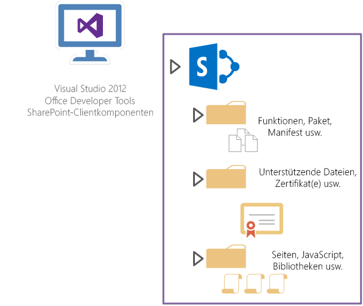
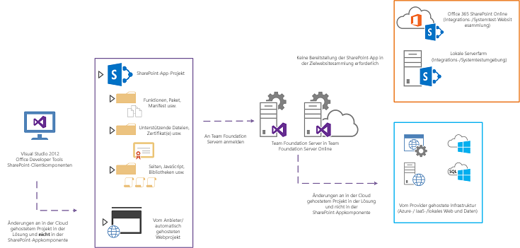
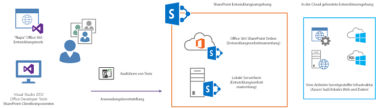
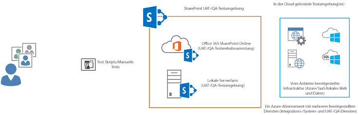

# Application Lifecycle Management in SharePointSharePoint Server 2013 Application Lifecycle Management
In diesem Artikel erfahren Sie, wie Sie gängige ALM (Application Lifecycle Management)-Konzepte und -Methoden auf die Anwendungsentwicklung mit SharePoint-Technologien anwenden können.Applies common application lifecycle management (ALM) concepts and practices to application development using SharePoint Server 2013 technologies.

**Bereitgestellt von:** Eric Charran, Microsoft Corporation**Provided by:** Eric Charran, Microsoft Corporation

**Mitwirkende:** Vesa Juvonen, Microsoft Corporation | Steve Peschka, Microsoft Corporation**Contributors:** Vesa Juvonen, Microsoft Corporation | Steve Peschka, Microsoft Corporation

> **Wichtig:** In diesem Artikel wird Bezug genommen auf automatisch gehostete SharePoint-Add-Ins. Die Preview-Phase für automatisch gehostete Apps ist beendet.**Important** This topic refers to autohosted SharePoint Add-ins. The preview program for autohosted apps has ended. Please disregard all references to autohosted SharePoint Add-ins. Bitte ignorieren Sie alle Verweise auf automatisch gehostete SharePoint-Add-Ins.Please disregard all references to autohosted SharePoint Add-ins. 

## Überblick über ALM (Application Lifecycle Management)Overview of application lifecycle management (ALM)

Entwickler haben in Microsoft SharePoint mehrere Möglichkeiten, mithilfe von SharePoint-Technologien Anwendungen zu erstellen und bereitzustellen –sowohl lokale Anwendungen als auch Anwendungen für gehostete Plattformen oder Public-Cloud-Plattformen.Microsoft SharePoint gives developers several options for creating and deploying applications that are based on SharePoint technologies, for both on-premises and in hosted or public cloud platforms. Dabei bietet SharePoint jetzt noch mehr Flexibilität hinsichtlich der unterstützten Anwendungstypen sowie neue Optionen für die Verwendung standardbasierter Technologien in Anwendungen.SharePoint offers increased flexibility in the shape applications can take as well as new options for using standards-based technologies with applications. Doch auch, wenn Entwickler mit den Anwendungsfunktionen und Bereitstellungsoptionen des neuen SharePoint-Anwendungsmodells innovative und immersive Anwendungen entwickeln können: Sie müssen gleichzeitig in der Lage sein,die Aspekte Qualitätssicherung, Anwendungstests und ALM in ihren Entwicklungsprozess zu integrieren.Although these application capabilities and deployment options afforded by the new application model inSharePoint provide an effective means for developers to create new and immersive applications, developers must be able to infuse quality, testing and ALM considerations into the development process. In diesem Artikel erfahren Sie, wie Sie gängige ALM-Konzepte und -Methoden auf die Anwendungsentwicklung mit SharePoint-Technologien anwenden können.This article applies common ALM concepts and practices to application development using SharePoint technologies.

### NeuerungenWhat's new

SharePoint etabliert ein neues Paradigma für die Implementierung von Anwendungen.SharePoint establishes a new paradigm for implementing applications. Angesichts dieser kompletten Neuorientierung des Modells für die Anwendungsentwicklung mit SharePoint-Technologien müssen Entwickler und Architekten sich umfassend in die neuen Muster, Methoden und Bereitstellungsmodelle einarbeiten, die SharePoint für die Anwendungsentwicklung bereitstellt.Because of this shift in application development with SharePoint technologies, developers and architects should have a thorough understanding of the new application development patterns, practices, and deployment models for SharePoint. Ein wichtiger Punkt dabei: Zwar hat sich das Anwendungsmodell für die Entwicklung von Lösungen mit SharePoint verändert, doch sind viele der zur Lösungsentwicklung verwendeten Muster (inklusive der verfügbaren Technologien und Implementierungstechniken) konform mit den aktuell verfügbaren Technologien für die Entwicklung von Webanwendungen.SharePoint Server 2013 establishes a new paradigm for implementing applications. Because of this shift in application development with SharePoint technologies, developers and architects should have a thorough understanding of the new application development patterns, practices, and deployment models for SharePoint Server 2013. It's important to note that while the application model for developing solutions with SharePoint has changed, many of the patterns used for solution development including choice of technologies, implementation techniques are in line with existing web application development technologies.
  
    
    
Nachfolgend erläutern wir Ihnen, welche Typen von Anwendungen Sie mit den SharePoint-Technologien erstellen können, und geben Ihnen wichtige Tipps für lokale Anwendungen und Cloudanwendungen.The following resources outline the application types that can be constructed using SharePoint Server 2013 technologies and contain considerations for both on-premises and cloud applications. To understand hosting options for SharePoint Add-ins, see  Choose patterns for developing and hosting your SharePoint Add-in. Informationen zu Hostingoptionen für SharePoint-Add-Ins finden Sie unter [Auswählen von Mustern für die Entwicklung und das Hosting Ihres Add-Ins für SharePoint](http://msdn.microsoft.com/library/05ce5435-0a03-4ddc-976b-c33b08d03457%28Office.15%29.aspx).For more detailed information about the hosting options of SharePoint Add-ins, see  [Choose patterns for developing and hosting your SharePoint Add-in](http://msdn.microsoft.com/library/05ce5435-0a03-4ddc-976b-c33b08d03457%28Office.15%29.aspx).
  
    
    
Da SharePoint jetzt mehr Flexibilität in puncto Lösungsimplementierung bietet, empfiehlt Microsoft seinen Kunden außerdem eine Evaluierung der zur Anwendungsentwicklung mit SharePoint verwendeten Technologien.Additionally, Microsoft advises customers to evaluate the technologies used when developing applications with SharePoint as there is a wider set of choices for solution implementation. Bei der Anwendungsentwicklung können Sie für die Darstellungsschicht und die Benutzerschicht auf standardbasierte Technologien wie HTML5 und JavaScript setzen und gleichzeitig OData und OAuth für dienstbasierte Zugriffe auf Back-End-Dienste wie SharePoint verwenden.When creating applications, customers can focus on leveraging standards-based technologies such as HTML5 and JavaScript for presentation and user experience layers, while OData and OAuth can be leveraged for service-based access to back end services including SharePoint. Dabei sollten Sie genau abwägen, ob voll vertrauenswürdiger Code erforderlich ist (d. h. in SharePoint bereitgestellte kompilierte Assemblys).Customers should consider carefully whether full trust code (that is, compiled assemblies deployed to SharePoint) are required. Dieses Entwicklungsparadigma wird zwar weiterhin unterstützt und ist in manchen Szenarien auch erforderlich, führt jedoch im ALM-Prozess zu signifikantem Overhead.although continuing to use that development paradigm, while still valid and required in some situations, does impose significant overhead on the ALM process.
  
    
    
Weitere Informationen zu den neuen flexiblen Entwicklungstechnologien für Anwendungen in SharePoint finden Sie unter [Übersicht über die SharePoint-Entwicklung](sharepoint-development-overview.md).For more information about the new flexible development technologies for applications on SharePoint Server 2013, see  [SharePoint development overview](sharepoint-development-overview.md).
  
    
    

### Vorteile und ÄnderungenBenefits and changes

Die von SharePoint unterstützten Technologien zur Anwendungsentwicklung bieten jetzt mehr Flexibilität hinsichtlich der Auswahl von Programmiersprachen und Programmierarchitekturen. Entwickler müssen daher ihre aktuellen ALM-Methoden an die von SharePoint unterstützten Optionen anpassen.Because SharePoint-supported application development technologies now offer a more flexible assortment of languages and programming architectures, developers need to adapt existing ALM practices around mainstream development techniques to accommodate for their presence within SharePoint. Neben den Konzepten Testing, Buildimplementierung, Bereitstellung und Qualitätslenkung sollte jetzt auch die Bereitstellung in SharePoint als SharePoint-Anwendung in die ALM-Strategie aufgenommen werden.Concepts such as testing, build establishment, deployment, and quality control, can be expanded to include deployment to SharePoint as a SharePoint application. Konkret bedeutet das: Auch wenn viele Entwickler ausgiebige Erfahrung mit der Programmierung und Bereitstellung serverseitiger Farmlösungen haben, die die Kernfunktionen von SharePoint erweitern, müssen sie nun möglicherweise gängige ALM-Methoden für das neue flexible Entwicklungsmodell für SharePoint-Anwendungen in ihren Implementierungsprozess integrieren.Because SharePoint-supported application development technologies now offer a more flexible assortment of languages and programming architectures, developers need to adapt existing ALM practices around mainstream development techniques to accommodate for their presence within SharePoint. Concepts such as testing, build establishment, deployment, and quality control, can be expanded to include deployment to SharePoint as a SharePoint application. This may mean that although many developers that are accustomed to writing and deploying server-side farm solutions that extend the core capabilities of SharePoint, common ALM practices for the new flexible development model facilitated by SharePoint Server 2013 applications must be applied to the implementation process.
  
    
    
Da immer mehr Kunden auf in der Cloud gehostete SharePoint-Implementierungen umsteigen, müssen Entwickler wissen, wie sie die Entwicklung, das Testing und die Bereitstellung von Zielumgebungen außerhalb der physischen Grenzen ihrer Organisation in ihre ALM-Strategie aufnehmen können.As customers continue the transition to cloud-hosted implementations of SharePoint Server 2013, developers will need to understand how to extend ALM concepts to include development, testing, and deployment target environments that sit outside the physical boundaries of the organization. This includes evaluating the technology strategy for conducting application development, testing, and deployment. Dazu müssen sie unter anderem die Technologien auf den Prüfstand stellen, die sie nutzen, um ihre Anwendungen zu entwickeln, zu testen und bereitzustellen.This includes evaluating the technology strategy for conducting application development, testing, and deployment.
  
    
    
Entwickler und Architekten erstellen heute verstärkt Lösungen aus mehreren Anwendungskomponenten, die unterschiedliche Hostingoptionen miteinander kombinieren.Developers and architects alike can become well-versed in synthesizing solutions that consist of multiple application components that span or combine different types of hosting options. Dabei sollten ALM-Verfahren einheitlich auf alle in der Lösung enthaltenen Anwendungen angewendet werden.During this adaptation process, ALM procedures should be applied unilaterally to these applications. Ein Beispiel: Ein Entwickler muss eine Anwendung bereitstellen, für die sowohl lokale Dienste wie IIS, ASP.NET, MVC, WebAPI und WCF bereitgestellt werden müssen als auch Microsoft Azure, SharePoint und SQL Azure. Gleichzeitig müssen die Anwendungskomponenten Qualitätstests unterzogen werden, und es gilt festzustellen, ob seit dem letzten Build Regressionen eingefügt wurden.Developers and architects alike can become well-versed in synthesizing solutions that consist of multiple application components that span or combine different types of hosting options. During this adaptation process, ALM procedures should be applied unilaterally to these applications. For example, developers may need to deploy an application that spans on-premises services deployment (that is, IIS, ASP.NET, MVC, WebAPI, and WCF), Microsoft Azure, SharePoint Server 2013, and SQL Azure, while also being able to test the application components to determine quality or whether any regressions have been introduced since a previous build. These requirements may signify a significant shift in how developers and teams regard the daily build and deployment process that is a well-known procedure for on-premises or server-side solutions. Um all diesen Anforderungen gerecht werden zu können, müssen die Entwickler und ihre Teams die altbekannten und gut dokumentierten Build- und Bereitstellungsprozesse für lokale und serverseitige Lösungen möglicherweise von Grund auf überdenken.These requirements may signify a significant shift in how developers and teams regard the daily build and deployment process that is a well-known procedure for on-premises or server-side solutions.
  
    
    

### Wichtige Aspekte für EntwicklungsteamsDevelopment team considerations

Organisationen mit mehr als einem Anwendungsentwickler oder Anwendungsarchitekten müssen die Teamarbeit an SharePoint-Entwicklungsprojekten sorgfältig planen, um höchste Anwendungsqualität und eine ausreichend hohe Entwicklerproduktivität zu gewährleisten.For organizations that have more than one application developer or architect, team development for SharePoint should be carefully planned to provide the highest-quality applications as well as support sufficient developer productivity. Da die Methode für die Anwendungsentwicklung jetzt flexibler ist, müssen die Teams nicht nur mit ALM-Methoden und -Mustern vertraut sein und diese genau definieren; sie müssen auch festlegen, wie die einzelnen Entwickler den Code programmieren werden, und sicherstellen, dass die Gewährleistung höchster Codequalität fester Bestandteil des Anwendungserstellungsprozesses wird.For organizations that have more than one application developer or architect, team development for SharePoint Server 2013 should be carefully planned to provide the highest-quality applications as well as support sufficient developer productivity. Because the method for conducting application development has increased in flexibility, teams will need to be clear and confident not only on ALM practices and patterns, but also on how each developer will write code and ensure that quality code becomes part of the application build process.
  
    
    
Diese Überlegungen beginnen mit der Auswahl der geeigneten Entwicklungsumgebung. In der Vergangenheit waren Entwickler dazu gezwungen, Entwicklungsarbeiten auf separaten Maschinen durchzuführen, die an ein gemeinsames Coderepository wie Visual Studio TFS 2012 angeschlossen waren, das Funktionen für Erstellung, Bereitstellung und Tests bereitstellte. TFS stellt weiterhin eine wichtige instrumentelle Komponente einer ALM-Strategie dar, die für Entwicklungsaktivitäten zentral ist, allerdings sollten sich Teams überlegen, wie sie TFS für die verschiedenen Typen von Entwicklungsumgebungsoptionen verwenden können.These considerations begin with selecting the appropriate development environment. Traditionally, development has been relegated to conducting separate development in virtual machines that are connected to a common code repository that provided build, deployment, and testing capabilities, like Visual Studio TFS 2012. TFS is still a strong instrumental component of an ALM strategy, and central to the development effort, but teams should consider how to leverage TFS across the different types of development environment options.
  
    
    
Je nach Zielumgebung und Lösungstyp (d. h. welche Komponenten lokal und welche in Cloud-Infrastruktur oder bei Cloud-Diensten gehostet werden) können Entwickler jetzt aus einer Kombination neuer Entwicklungsumgebungsoptionen wählen. Diese Optionen bestehen aus neuen Auswahlmöglichkeiten, wie der SharePoint-Entwicklungswebsitevorlage und einem Office 365-Entwicklungsmandanten, sowie älteren Auswahlmöglichkeiten, wie z. B. auf virtuellen Maschinen basierte Entwicklung mithilfe von Hyper-V in Windows 8 oder Windows Server 2012.Depending on the target environment, the solution type (that is, which components will be on-premises and which will be hosted in cloud infrastructure or services), developers can now select from a combination of new development environment options. These options will consist of new choices such as the SharePoint developer site template, an Office 365 developer tenant, as well as legacy choices such as virtual machine-based development using Hyper-V in Windows 8 or Windows Server 2012.
  
    
    
Im folgenden Abschnitt werden für Anwendungsentwickler und -teams Überlegungen zur Entwicklungsumgebung beschrieben.The following section describes development environment considerations for application developers and development teams.
  
    
    

## Überlegungen zur EntwicklungsumgebungDevelopment environment considerations

Die Auswahl einer Entwicklungsumgebung sollte auf Basis mehrerer Faktoren erfolgen. Diese Überlegungen werden größtenteils durch den Typ der entwickelten Anwendung und die Zielplattform für die Anwendung beeinflusst. Wenn Entwickler in der Vergangenheit Anwendungen für SharePoint Server 2010 erstellten, stellten sie virtuelle Maschinen bereit und führten die Entwicklung in Isolation durch. Dies lag daran, dass die Bereitstellung voll vertrauenswürdiger Lösungen Neustarts von SharePoint-Kernabhängigkeiten wie IIS erfordert hätte, was verhindert hätte, dass mehrere Entwickler eine einzelne SharePoint-Umgebung verwenden. Da sich Entwicklungstechnologien verändert haben und es nun mehr Optionen für Entwickler gibt, die Anwendungen erstellen, sollten Entwickler und Teams wissen, welche verschiedenen Entwicklungsumgebungen ihnen zur Verfügung stehen. Abbildung 1 zeigt die Entwicklungsumgebung und die verschiedenen Tools, einschließlich der Typen von Lösungen, die in den Zielumgebungen bereitgestellt werden können.The selection of a development environment should be made based on multiple factors. These considerations are largely influenced by the type of application being developed as well as the target platform for the application. Traditionally, when creating applications for SharePoint Server 2010, developers would provision virtual machines and conduct development in isolation. This was due to the fact that deployment of full trust solutions may have required restarts of core SharePoint dependencies, such as IIS, which would prevent multiple developers from using a single SharePoint environment. Because development technologies have changed and the options for developers creating applications have increased, developers and teams should understand the choice of development environments available to them. Figure 1 shows the development environment and tool mix, and includes the types of solutions that can be deployed to the target environments.
  
    
    

**Abbildung 1: Entwicklungsumgebungen - Komponenten und Tools****Figure 1. Development environment components and tools**

    
 [
  
    
    

### Grundsätze für EntwicklungsumgebungenDevelopment environment philosophy

Angesichts der neuen Möglichkeiten für den Entwurf und die Implementierung von Anwendungen in SharePoint sollten Entwickler evaluieren, ob sie für die Entwicklung ihrer Anwendungen serverseitigen Code benötigen.Because of the investments made in how applications can be designed and implemented using SharePoint, developers should determine if there is a need to conduct development using server-side code. Da heute verstärkt in der Cloud gehostete Anwendungen entwickelt werden, besteht immer seltener die Notwendigkeit für virtualisierte Entwicklungsumgebungen. Das gilt insbesondere für SharePoint.As developers create applications that use the cloud-hosted model, the requirement to conduct development that relies on virtualized environments, specifically for SharePoint, diminishes. Entwickler sollten für die Lösungserstellung stattdessen auf das Remoteentwicklungsmodell setzen, das auf ihrer bereits vorhandenen cloudbasierten Infrastruktur aufsetzt (öffentliche Cloud oder private Cloud).Developers should seek to build solutions with the remote-development model that uses existing cloud-based (both public and private) infrastructure. Wenn sich Entwicklungsumgebungen schnell und unkompliziert bereitstellen lassen, ohne dass zunächst eine virtualisierte Umgebung erstellt und orchestriert werden muss, können die Entwickler ihre Zeit verstärkt in die tatsächliche Programmierung und die Qualitätssicherung investieren statt in die Infrastrukturverwaltung.If development environments can be quickly and easily provisioned without having to create and orchestrate virtualization, developers can invest more time in focusing on development productivity and quality, rather than infrastructure management.
  
    
    
Ob Sie sich für eine virtualisierte Instanz von SharePoint oder die neue SharePoint-Entwicklerwebsitevorlage entscheiden sollten, hängt davon ob, ob für Ihre Anwendung voll vertrauenswürdiger Code in SharePoint bereitgestellt und ausgeführt werden muss.The decision to require a virtualized instance of SharePoint versus the new SharePoint development site template will depend on whether or not the application requires full trust code to be deployed to SharePoint and run there. Ist kein voll vertrauenswürdiger Code erforderlich, empfehlen wir die Verwendung der Entwicklerwebsitevorlage. Diese Vorlage finden Sie in Office 365-Entwicklermandanten oder in der lokalen SharePoint-Implementierung Ihrer Organisation.If no full trust code is required, we recommend using the developer site template, which can be found in Office 365 development tenants or within an organization's implementation of on-premises SharePoint. Mithilfe von Entwicklerwebsitevorlagen können Sie Ihre Anwendungen direkt aus Visual Studio in SharePoint bereitstellen.Developer site templates are designed for developers to deploy applications directly to SharePoint from Visual Studio. Auf Office 365-Entwicklerwebsites sind Anwendungsisolation und OAuth bereits vorkonfiguriert. Sie können also sofort mit der Anwendungsprogrammierung und den Anwendungstests beginnen.Office 365 developer sites are preconfigured for application isolation and OAuth so that developers can begin writing and testing applications right away.
  
    
    
In den nachfolgenden Abschnitten beschreiben wir detailliert, wann Sie welche Entwicklungsumgebung für die Erstellung Ihrer Anwendungen nutzen sollten.The following sections describe in detail when developers can use the different environment options to build applications.
  
    
    

### O365-Entwicklungswebsites (öffentliche Cloud)O365 development sites (public cloud)

Abbildung 2 zeigt, wie Entwickler Office 365 als eine Entwicklungsumgebung verwenden können, und umfasst die Typen von Tools, mit denen SharePoint-Anwendungen erstellt werden, die in Office 365 gehostet werden können.Figure 2 shows how developers can use Office 365 as a development environment and includes the types of tools produce SharePoint applications that can be hosted in Office 365.
  
    
    

**Abbildung 2. Office 365-App-Entwicklung****Figure 2. Office 365 app development**

  
    
    
 [
  
    
    
Entwickler mit MSDN-Abonnements können einen Entwicklungsmandanten erhalten, der eine SharePointWebsite für Entwickler enthält. Die SharePointWebsite für Entwickler ist für die Entwicklung von Anwendungen vorkonfiguriert. Benutzer können Visual Studio 2012 nicht nur für die Entwicklung von Anwendungen verwenden. Mit Office 365-Entwicklerwebsites kann Napa innerhalb der Website zur Erstellung von Anwendungen verwendet werden. Weitere Informationen zum Einstieg in eine Website für Office 365-Entwickler finden Sie unter  [Einrichten einer Entwicklungsumgebung für SharePoint-Add-Ins in Office 365](http://msdn.microsoft.com/library/b22ce52a-ae9e-4831-9b68-c9210af6dc54%28Office.15%29.aspx).Developers with MSDN subscriptions can obtain a development tenant that contains aSharePointDeveloper Site. The SharePointDeveloper Site is preconfigured for developing applications. Users can use not only Visual Studio 2012 in developing applications, but with Office 365 developer sites, Napa can be used within the site to construct applications. For more information about getting started with anOffice 365 Developer Site, see  [Set up a development environment for SharePoint Add-ins on Office 365](http://msdn.microsoft.com/library/b22ce52a-ae9e-4831-9b68-c9210af6dc54%28Office.15%29.aspx).
  
    
    
Entwickler können Anwendungen erstellen, die in Office 365, lokal oder in einer anderen, anbietergehosteten Infrastruktur gehostet werden.Developers can start creating applications that will be hosted in Office 365, on-premises or on other infrastructure in a provider-hosted model. Der Vorteil dieser Umgebung: Sämtliche Infrastruktur-, Virtualisierungs- und Hostingaspekte für SharePoint-Entwicklungsumgebungen werden von Office 365 abstrahiert, sodass Anwendungen ohne Zeitverzögerung erstellt werden können.The benefit of this environment is that infrastructure, virtualization and other hosting considerations for a SharePoint development environment are abstracted by Office 365, allowing developers to create applications instantly. Wichtig zu bedenken ist dabei, dass Entwicklungsumgebungen dieser Art nicht für Anwendungen geeignet sind, für die voll vertrauenswürdiger Code in SharePoint bereitgestellt werden muss.A prime consideration for this type of development environment is that applications that require full trust code to be deployed toSharePoint cannot be accommodated. Microsoft empfiehlt, wann immer möglich das clientseitige Objektmodell (CSOM) von SharePoint sowie clientseitige Technologien wie JavaScript zu verwenden.Microsoft recommends using the SharePoint client-side object model (CSOM) and client-side technologies such asJavaScript as much as possible. Sollte zwar voll vertrauenswürdiger Code erforderlich sein, nicht jedoch die Bereitstellung und Ausführung dieses Codes in SharePoint, empfehlen wir, den serverseitigen Code im Rahmen eines Modells mit automatischem oder anbieterbasiertem Hosting bereitzustellen.In the event that full trust code is required (but deployment of the code to run on SharePoint is not required), we recommend deploying the server-side code in an autohosted or provider-hosted model. Dabei verwenden in anbietergehosteten Infrastrukturen bereitgestellte Lösungen mit voll vertrauenswürdigem Code ebenfalls CSOM, unterstützen jedoch auch Programmiersprachen wie C#.Note that these full trust code solutions that are deployed to provider-hosted infrastructure also use the CSOM but can use languages such as C#. Ebenso können in einem anbietergehosteten Modell bereitgestellte Anwendungen auch dann CSOM zur Interaktion mit SharePoint verwenden, wenn sie andere Technologiestacks nutzen.It's also important to note that these applications deployed in a provider-hosted model can use other technology stacks and still use the CSOM to interact with SharePoint.
  
    
    
Entwicklungsteams, die separate Features oder Anwendungen erstellen, die eine größere Lösung enthalten, benötigen ein zentralisiertes Entwicklungsziel, um Testkomponenten zu integrieren. Da jeder Entwickler Features und Anwendungen auf seiner eigenen Office 365-Entwicklersite erstellt, sollte eine zentralisierte Websitesammlung in einem Zielmandanten oder einer lokalen Umgebung so bereitgestellt werden, dass dort die Anwendungskomponenten jedes Entwicklers bereitgestellt werden können. Dieser Ansatz ermöglicht die zentrale Durchführung von Integrationstests für Lösungskomponenten. Im  [Abschnitt zur Durchführung von Tests](#Testing) in diesem Dokument wird näher auf diesen Prozess eingegangen.Development teams creating separate features or applications that contain a larger solution will need a centralized deployment target to integration test components. Because each developer is creating features or applications on their own Office 365 developer site, a centralized site collection in a target tenant or on-premises environment should be provisioned so that each developer's application components can be deployed there. This approach will allow for a centralized place to conduct integration testing between solution components. The  [testing section of this document](#Testing) reviews this process in more detail.
  
    
    

#### NapaOffice 365-EntwicklungstoolsNapaOffice 365 development tools

Die Napa-Entwicklungstools können von Entwicklern verwendet werden, um die Erstellung von Anwendungen in einer Office 365-Entwicklerwebsite zu vereinfachen. Die Napa-Tools sind für Entwickler oder Poweruser gedacht, die mit clientseitigen Technologien vertraut sind, um rasch Anwendungen für einen Prototyp, eine Machbarkeitsstudie oder eine schnelle Geschäftslösung zu entwickeln und bereitzustellen. Diese Tools bieten die Möglichkeit, Anwendungsfunktionen in SharePoint zu entwickeln. Während des Lebenszyklus einer Anwendung kann unter bestimmten Umständen ein Import der Anwendung in Visual Studio erforderlich sind. Zu diesen Umständen zählen folgende:The Napadevelopment tools can be used by developers for the simpler creation of applications within an Office 365 developer site. The intention of the Napa tools is for developers, or power users who are proficient in client-side technologies, to quickly develop and deploy applications in a prototype, proof-of-concept or rapid business solution scenario. These tools provide a means of developing application functionality on SharePoint. However, during the lifecycle of an application, there may be points at which the application should be imported into Visual Studio. These conditions are outlined as follows"
  
    
    

- Wenn mehr als ein Entwickler zu einer Lösung beitragen muss bzw. einen Teil der Lösung entwickeln mussWhen more than one developer has to contribute or develop part of the solution
    
  
- Wenn eine Anwendung einen Abhängigkeitsgrad von Benutzern erreicht, der die Anwendung von Praktiken der Lebenszyklusverwaltung erfordertWhen an application reaches a level of dependence by users whom requires the application of lifecycle management practices
    
  
- Wenn sich funktionsbezogene Anforderungen für die Anwendung mit der Zeit ändern und ergänzende Lösungskomponenten erforderlich sind (wie kompilierte Dienste oder Datenquellen)When functional requirements for the application change over time to require supplementary solution components (such as compiled services or data sources)
    
  
- Wenn die Anwendung in andere Anwendungen oder Lösungskomponenten integriert werden mussWhen the application requires integration with other applications or solution components
    
  
- Wenn Entwickler Qualitätskontrollmaßnahmen wie automatisierte Builds und Tests verwenden müssenWhen developers have to use quality control measures such as automated builds and testing
    
  
Sobald eine dieser Bedingungen oder eine ähnliche Bedingung eintritt, müssen Entwickler die Lösung in eine Umgebung unter Quellcodeverwaltung wie TFS exportieren und Überlegungen und Verfahren des ALM-Entwurfs auf die künftige Entwicklung der Anwendung anwenden.Once these or other similar conditions occur, developers must export the solution into a source controlled environment such as TFS and apply ALM design considerations and procedures to the application's future development.
  
    
    

### Entwicklungswebsites (Remoteentwicklung)Development sites (remote development)

Für Organisationen oder Entwickler, die SharePoint-Anwendungen nicht hauptsächlich in Office 365-Entwicklerwebsites entwickeln möchten, können zur Entwicklung von SharePoint-Anwendungen lokale Entwicklungswebsites verwendet werden. In diesem Modell werden die Funktionen der Office 365-Entwicklerwebsites durch lokale Entwicklungswebsites ersetzt, die in einer SharePoint-Farm gehostet werden. Kunden können eine Private Cloud für die Entwicklung erstellen, indem Sie auf internen Entwicklerwebsiteinstanzen eine SharePoint-Farm bereitstellen. Kunden können ihre eigene Governance-Automatisierung verwenden, um Entwicklerwebsite-Vorlagenerstellung zu ermöglichen, oder die in SharePoint integrierten Funktionen zur Bereitstellung von Entwicklerwebsiteinstanzen verwenden. Abbildung 3 illustriert diesen Aufbau.For organizations or developers who choose not to use Office 365 developer sites as a primary means for SharePoint application development, on-premises developer sites can be used to develop SharePoint applications. In this model, the Office 365 developer sites' capability is replaced with on-premises developer sites hosted within a SharePoint farm. Customers can create a development private cloud by deploying a SharePoint farm to house developer site instances. Customers can supply their own governance automation in order to provide developer site template creation or use the SharePoint in-product capabilities to provision developer site instances. Figure 3 illustrates this setup.
  
    
    

**Abbildung 3. Lokale App-Entwicklung mit der Entwicklerwebsitevorlage****Figure 3. On-premises app development with the developer site template**

  
    
    
 [
  
    
    
    
    
Abbildung 3 beschreibt die Entwicklungstools und Anwendungstypen, die Entwicklerwebsites ermöglichen, wenn eine lokale SharePoint-Farm als Host verwendet wird. Beachten Sie, dass NapaOffice 365-Entwicklungstools in dieser Umgebung nicht eingesetzt werden können, da diese nur in Office 365-Entwicklungswebsites verwendet werden können.Figure 3 describes the development tools and application types that can be enabled with developer sites when using an on-premises SharePoint farm as a host. Note that NapaOffice 365 development tools cannot be used in this environment as they are a capability only present in Office 365 development sites.
  
    
    
Die SharePoint-Farm, die Website für Entwickler-Instanzen hostet, muss überwacht werden und Service-, Recovery Point- und zeitbezogene Ziele erfüllen, damit Entwickler, die damit Anwendungen erstellen, produktiv und unterbrechungsfrei arbeiten können. Kunden können auf diese Umgebung Private Cloud-Konzepte wie Elastizität, Skalierungseinheiten und eine Verwaltungs-Fabric anwenden. Betrieb und Verwaltung müssen auf die SharePoint-Farm angewendet werden, in der auch die Entwicklerwebsites verwaltet werden. Dadurch lässt sich eine unkontrollierte Verbreitung zahlreicher Entwicklerwebsites vermeiden, die nicht in Verwendung sind. Außerdem bietet dies die Möglichkeit zu ermitteln, wann die Umgebung skaliert werden muss.TheSharePoint farm that hosts Developer Site instances must be monitored and meet service and recovery point and time level objectives so that developers who rely on them to create applications can be productive and not experience outages. Customers can apply private cloud concepts such as elasticity and scale units and a management fabric to this environment. Operations and management have to be applied to the SharePoint farm where the developer sites are hosted also. This will help control unmonitored sprawl of multiple developer sites that are stale or unused and provide a way to understand when the environment has to scale.
  
    
    
Kunden können IaaS-Funktionen (Infrastructure-as-a-Service) wie Microsoft Azure verwenden, um die SharePoint-Farms zu hosten, die Entwicklerwebsites enthalten und hosten. Sie können auch ihre eigenen lokalen virtuellen oder physischen Umgebungen verwenden. Beachten Sie, dass bei Verwendung dieses Modells SharePoint nicht für jeden Entwickler installiert werden muss. Zur Remoteanwendungsentwicklung müssen nur Visual Studio und Office- und SharePoint-Entwicklungstools auf der Arbeitsstation des Entwicklers installiert sein.Customers can decide to use infrastructure as a service (IaaS) capabilities like Microsoft Azure to host theSharePoint farms that contain and host developer sites, or their own on-premises virtual or physical environments. Note that using this model does not require a SharePoint installation for each developer. Remote application development will only require Visual Studio and Office and SharePoint development tools on the developer work station.
  
    
    
Entwickler müssen vom Anbieter gehostete Infrastruktur schaffen, um die vom Anbieter gehosteten Anwendungen bereitzustellen. Vom Anbieter gehostete Komponenten einer SharePoint-Anwendung können zwar in einer Vielzahl von Technologien implementiert werden, doch Entwickler müssen eine Infrastruktur zum Hosten dieser Komponenten der Anwendungen bereitstellen, die außerhalb von SharePoint ausgeführt werden. Wenn ein Team z. B. eine SharePoint-Anwendung entwickelt, bei der sich die Komponente für die Benutzeroberfläche und sonstige Komponenten in einer ASP.NET-Anwendung befinden, sollte das Entwicklungsteam lokale Versionen von IIS,SQL Server usw. verwenden und herkömmliche ALM-Teamentwicklungsmuster für ASP.NET verwenden.Developers must establish provider-hosted infrastructure to deploy the provider-hosted applications. Although provider-hosted components of a SharePoint application can be implemented in a wide-array of technologies, developers must provide an infrastructure for hosting those components of the application that run outside SharePoint. For example, if a team is developing a SharePoint application whose user experience and other components reside in anASP.NET application, the development team should use local versions of IIS,SQL Server, and so on engage in traditional ALM team development patterns for ASP.NET.
  
    
    

### Eigenständige Farmumgebungen (virtualisierte Farmentwicklung)Self-contained farm environments (virtualized farm development)

Erfordert Ihre Lösung die Bereitstellung und Ausführung von voll vertrauenswürdigem Code in einer SharePoint-Farm, ist eine vollständige (und häufig auch virtualisierte) Implementierung von SharePoint nötig.For those solutions that require the deployment of full trust code to run on a SharePoint farm a full (often virtualized) implementation of SharePoint Server 2013 will be required. For guidance on how to create an on-premises development environment for SharePoint, see  Set up an on-premises development environment for SharePoint Add-ins. Eine Anleitung für die Erstellung einer lokalen Entwicklungsumgebung für SharePoint finden Sie unter [Einrichten einer lokalen Entwicklungsumgebung für SharePoint-Add-Ins](http://msdn.microsoft.com/library/b0878c12-27c9-4eea-ae3b-7e79e5a8838d%28Office.15%29.aspx).For guidance on how to create an on-premises development environment for SharePoint, see  [Set up an on-premises development environment for SharePoint Add-ins](http://msdn.microsoft.com/library/b0878c12-27c9-4eea-ae3b-7e79e5a8838d%28Office.15%29.aspx).
  
    
    
Abbildung 4 gibt einen Überblick über die verschiedenen Typen von Anwendungen, die sich in einer lokalen virtualisierten Umgebung erstellen lassen.Figure 4 shows the types of applications that can be created using an on-premises virtualized environment.
  
    
    

**Abbildung 4. Lokale Entwicklung mit einer virtuellen Umgebung****Figure 4. On-premises development with a virtual environment**

  
    
    
 [
  
    
    
    
    
Entwickler können Remoteentwicklung für die SharePoint und in der Cloud gehosteten Anwendungen in ihren eigenen SharePoint-Farmen sowie die Entwicklung von Farmlösungen mit voller Vertrauenswürdigkeit verwenden. Diese Farmen werden oft in einem Virtualisierungsserver gehostet, der auf der Arbeitsstation des Entwicklers oder in einer zentralen Private Cloud gehostet wird, die für Entwickler leicht zugänglich ist. Die SharePoint-Farmumgebung ist normalerweise von den Farmen anderer Entwickler getrennt und bietet einen Isolationsgrad, der beim Entwickeln von voll vertrauenswürdigem Code erforderlich ist und den Neustart kritischer Dienste (z. B. IIS) erfordern kann.Developers can conduct remote development for the SharePoint and cloud-hosted applications within their own SharePoint farms as well as the development of full trust farm solutions. These farms are often hosted within a virtualization server running either on the developer's workstation or in a centralized virtualization private cloud that can easily be accessible to developers. The SharePoint farm environment is usually separate from other developers' farms and provides a level of isolation that is required when developing full trust code that may require the restart of critical services (that is IIS).
  
    
    
Remoteentwicklung und die Entwicklung von voll vertrauenswürdigem Code können innerhalb der eigenständigen Farm erfolgen, da jede Entwicklungsfarm isoliert ist und nur einem Entwickler zugeordnet ist.Remote development can occur within the self-contained farm as well as the development of full trust code as each development farm is isolated and dedicated to a single developer.
  
    
    
Organisationen oder Entwickler müssen die SharePoint-Farmen, die in den virtuellen Computern ausgeführt werden, verwalten und aktualisieren. Entwickler, die an einer einzelnen Anwendung mitarbeiten, müssen die Parität zwischen den Entwicklungsfarmen wahren, die in den virtuellen Computern ausgeführt werden. Dadurch wird sichergestellt, dass jede für die Anwendung entwickelte Codekomponente konsistent ist. Weitere gängige Überlegungen sind eine Standardkonfiguration für die Farmen, einschließlich Domänenzugriff und Anmeldeinformationen, Dienstanwendungs-Anmeldeinformationen, Testidentitäten oder -konten und andere umgebungsbezogene Konfigurationselemente (wie Zertifikate).Organizations or developers will have to manage and update the SharePoint farms running within the virtual computers. For developers who are contributing to a single application, parity across the development farms running inside the virtual computers must be maintained. This practice ensures that each component of code developed for the application has consistency. Other common considerations are a standard configuration for the farms including domain access and credentials, service application credentials, testing identities or accounts and other environmental configuration elements (such as certificates).
  
    
    
Ähnlich einer zentralisierten Farm für Entwicklungswebsites können diese virtuellen Maschinen, auf denen SharePoint-Entwicklerfarmen ausgeführt werden, in IaaS-Plattformen wie Microsoft Azure und lokalen Private Cloud-Angeboten gehostet werden.Similar to a centralized farm for development sites, these virtual machines running developerSharePoint farms can be hosted in IaaS platforms such as Microsoft Azure, and on-premises private cloud offerings.
  
    
    
Obgleich virtuelle Maschinen einen hohen Grad an Isolation und Unabhängigkeit von anderen virtuellen Entwicklermaschinen bieten, sollten Teams gleiche Konfigurationen für virtuelle Maschinen anstreben. Dazu zählen eine gemeinsame Konfiguration für Domäne, Konto und Sicherheit und SharePoint und eine Verbindung zu einem Quellcodeverwaltungs-Repository wie Visual Studio Team Foundation Server (TFS).Note that, although virtual machines offer a great deal of isolation and independence from other developer virtual machines, teams should strive to have uniformity between the virtual machine configurations. This includes common domain, account and security, SharePoint configurations and a connection to a source control repository such as Visual Studio Team Foundation Server (TFS).
  
    
    

## Überlegungen zum ALM-EntwurfALM design considerations

Bei der Erstellung von SharePoint-Anwendungen müssen einige Punkte beachtet werden, um zu Konsistenz- und Qualitätszwecken Governance- und gängige Entwicklungspraktiken bereitzustellen. Wenn ALM-Prinzipien auf die SharePoint-Anwendungsentwicklung angewendet werden, müssen sich Entwickler auf technische sowie prozessgesteuerte Überlegungen konzentrieren.When constructing SharePoint applications, there are several considerations that have to be addressed to provide governance and common development practices for consistency and quality. When applying ALM principles to SharePoint application development, developers must focus on technical considerations as well as process-driven considerations.
  
    
    
Zur Anwendungsentwicklung, insbesondere wenn Teams von Entwicklern an den gleichen Projekten arbeiten, ist normalerweise die Unterstützung einer ALM-Plattform wie Visual Studio Team Foundation Server 2012 erforderlich. SharePoint-Anwendungen erfordern wie andere technische Lösungen Coderepository-Verwaltung und Versionsverwaltung, Builddienste, Testdienste und Praktiken der Releaseverwaltung. Im folgenden Abschnitt werden Überlegungen für ALM mit Bezug auf die verschiedenen Anwendungsmodelle für SharePoint-Anwendungen beschrieben.The support of an ALM platform, such as Visual Studio Team Foundation Server 2012, is usually a requirement when conducting application development especially with teams of developers working on the same set of projects. SharePoint applications, like other technical solutions, require code repository management and versioning, build services, testing services, and release management practices. The following section describes considerations for ALM as applied to the different application models for SharePoint applications.
  
    
    

### ÜbersichtOverview

Für jede Art von SharePoint-Anwendung müssen die ALM-Überlegungen unverändert angewendet werden. Praktiken und Verfahren rund um Build, Tests und Änderungsverwaltung müssen allerdings angepasst werden.For each type of SharePoint application, the ALM considerations must be applied without variation in concept. However, practices and procedures around build, testing, and change management must be adjusted.
  
    
    
Einige SharePoint-Anwendungen verwenden clientseitige Technologien. Die meisten Entwickler, die Erfahrung in der Entwicklung von SharePoint Server 2010-Anwendungen haben, müssen sich daran gewöhnen, nicht kompilierten Code zu entwickeln und darauf ALM-Prinzipien anzuwenden. So müssen etwa auch Konzepte wie ein "Build" auf eine Lösung angewendet werden, die möglicherweise keinen kompilierten Code aufweist. ALM-Plattformen wie Visual Studio 2012 weisen integrierte Funktionen zur Validierung von Builds auf. Dabei wird der Code zuerst kompiliert, und anschließend werden Buildüberprüfungstests ausgeführt.Some SharePoint applications will use client-side technologies. Most developers who have SharePoint Server 2010 application development experience will have to adjust to developing and applying ALM principles to non-compiled code. This adjustment includes applying concepts such as a "build" to a solution that may not have compiled code. ALM platforms such as Visual Studio 2012 have built-in capabilities to validate builds by first compiling the code, and second, by running build verification tests (BVTs) against the build.
  
    
    
Bei SharePoint-Anwendungen sollte der Build- und Testprozess mit den herkömmlichen Anwendungsentwicklungsprozessen übereinstimmen. Dazu zählt die Erstellung eines Buildzeitplans durch die ALM-Plattform, welche die Lösung kompiliert und in der Zielumgebung bereitstellt.For SharePoint applications, the process relating to build and testing should remain consistent with traditional application development processes. This includes the creation of a build schedule by the ALM platform, which will compile the solution and deploy it into the target environment.
  
    
    

### BuildprozesseBuild processes

Die SharePoint-Anwendungsbuildprozesse werden durch die ALM-Plattform erleichtert. Visual Studio Team Foundation Server 2012 bietet sowohl Build- als auch Testdienste, die beim Einchecken der Lösung von Visual Studio 2012 (fortlaufende Integration) oder in bestimmten geplanten Zeitabständen ausgelöst werden können.The SharePoint application build processes are facilitated by the ALM platform. Visual Studio Team Foundation Server 2012 provides both build and test services that can be triggered on solution check in from Visual Studio 2012 (continuous integration) or at specified scheduled intervals.
  
    
    

#### SharePoint-BuildkomponentenSharePoint build components

Wenn Entwickler Buildprozesse für die Entwicklung von SharePoint-Anwendung planen, müssen sie die Interaktionen zwischen den Komponenten berücksichtigen (siehe Abbildung 5).When planning build processes for SharePoint application development, developers have to consider the interactions between the components, as shown in Figure 5.
  
    
    

**Abbildung 5. In SharePoint gehostete App-Buildkomponenten****Figure 5. SharePoint-hosted app build components**

  
    
    

  
    
    

  
    
    
Die Illustration in Abbildung 5 ist eine logische Darstellung einer SharePoint-Anwendung. Diese Illustration zeigt eine Von SharePoint gehostetes Add-In und hebt wichtige Anwendungsobjekte als Bestandteil eines Visual Studio 2012Von SharePoint gehostetes Add-In-Projekts hervor. Das SharePoint-App-Projekt enthält die Features, das Paket und das Manifest, welche bei SharePoint registriert werden. Das Projekt enthält außerdem Seiten, Skriptbibliotheken und andere Elemente der Benutzeroberfläche, welche die SharePoint-Anwendung bilden. Darüber hinaus enthält das SharePoint-Projekt unterstützende Dateien, welche die zur Bereitstellung in einer SharePoint-Zielumgebung erforderlichen Zertifikate umfassen.The illustration in Figure 5 is a logical representation of a SharePoint application. This illustration shows a SharePoint-hosted add-in and highlights key application objects as part of a Visual Studio 2012SharePoint-hosted add-in project. The SharePoint app project contains the features, package, and manifest that will be registered with SharePoint. The project also contains pages, script libraries, and other elements of user experience that constitute the SharePoint application. In addition, the SharePoint project has supporting files which include the necessary certificates for deployment to a target SharePoint environment.
  
    
    

**Abbildung 6. Vom Anbieter und automatisch gehostete App-Build-Komponenten****Figure 6. Provider-hosted and autohosted app build components**

  
    
    

  
    
    

  
    
    
Abbildung 6 zeigt eine in der Cloud gehostete (d. h. automatisch oder vom Anbieter gehostete) SharePoint-Anwendung. Der Hauptunterschied in der Projektstruktur ist, dass die Visual Studio 2012-Lösung zusätzlich zu einem oder mehreren Projekten, welche die in der Cloud gehosteten Anwendungskomponenten enthalten, ein SharePoint-Anwendungsprojekt enthält. Dazu können Webanwendungen, SQL-Datenbankprojekte oder Dienstanwendungen zählen, die in Azure oder einer lokalen vom Anbieter gehosteten Infrastruktur (wie ASP.NET) bereitgestellt werden, und andere Lösungskomponenten zählen. Eine Anleitung zum Packen und Bereitstellen besonders vertrauenswürdiger Anwendungen finden Sie unter  [Packen und Veröffentlichen besonders vertrauenswürdiger Add-Ins für SharePoint](http://msdn.microsoft.com/library/3c28aed8-c037-407c-9154-39a74073e170%28Office.15%29.aspx).Figure 6 shows a SharePoint cloud-hosted application (that is, autohosted or provider-hosted). The main difference in the project structure is that the Visual Studio 2012 solution contains a SharePoint application project in addition to one or more projects that contain the cloud-hosted application components. These may include web applications, SQL database projects, or service applications that will be deployed to Azure or an on-premises provider hosted infrastructure (such as ASP.NET) and other solution components. For guidance on packaging and deployment with high-trust applications, see  [Package and publish high-trust SharePoint Add-ins](http://msdn.microsoft.com/library/3c28aed8-c037-407c-9154-39a74073e170%28Office.15%29.aspx).
  
    
    

**Abbildung 7. ALM mit Visual Studio Team Foundation Server****Figure 7. ALM with Visual Studio Team Foundation Server**

  
    
    

  
    
    

  
    
    
Abbildung 7 zeigt TFS als die ALM-Plattform. Teams verwenden TFS zum Speichern von Code und zur Durchführung von Teamentwicklungsarbeiten mit lokal bereitgestelltem TFS oder mit cloudbasierten TFS-Diensten von Microsoft. TFS kann für die Durchführung von Build- und Bereitstellungsaktivitäten mit einer SharePoint-Anwendung durch Builddefinitionen konfiguriert werden. TFS kann auch zur Durchführung von Buildüberprüfungstests verwendet werden, die durch die Ausführung kodierter UI-Tests automatisiert werden können, die Teil der Builddefinition sind.Figure 7 shows TFS as the ALM platform. Teams will use TFS to store code and conduct team development either using TFS deployed on-premises or using Microsoft cloud-based TFS services. TFS can be configured to conduct build and deployment activities with a SharePoint application through build definitions. TFS can also be used to conduct build verification tests (BVTs) that may be automated through the execution of coded UI tests that are part of the build definition.
  
    
    

**Abbildung 8. TFS-Buildziele****Figure 8. TFS build targets**

  
    
    

  
    
    

  
    
    
Abbildung 8 zeigt die Zielumgebungen, in denen durch eine TFS-Builddefinition ausgeführte Skripts die SharePoint-Anwendungskomponenten bereitstellen. Bei in SharePoint gehosteten Anwendungen umfasst dies die Bereitstellung in SharePoint Online oder in lokalen SharePoint-Anwendungskatalogen.Figure 8 shows the target environments where scripts executed by a TFS build definition will deploy the SharePoint application components. For SharePoint-hosted applications this includes deployment to either SharePoint Online or to on-premises SharePoint application catalogs.
  
    
    
Bei in der Cloud gehosteten SharePoint-Anwendungen werden die Komponenten der Lösung, die zusätzliche Infrastruktur außerhalb von SharePoint erfordern, in Zielumgebungen bereitgestellt. Bei automatisch gehosteten Anwendungen ist dies Microsoft Azure. Bei vom Anbieter gehosteten Anwendungen kann es sich bei dieser Infrastruktur um Microsoft Azure oder andere lokale oder IaaS-gehostete Umgebungen handeln.For cloud-hosted SharePoint applications, the components of the solution that require additional infrastructure outside SharePoint are deployed to target environments. For autohosted applications, this will be Microsoft Azure. For provider-hosted applications, this infrastructure can be Microsoft Azure, or other on-premises or IaaS-hosted environments.
  
    
    

#### Erstellen eines Builds für SharePoint-AnwendungenCreating a build for SharePoint applications

TFS stellt Builddienste bereit, die in die Quellcodeverwaltung eingecheckte Lösungen kompilieren und die Ausgabe auf automatisierte Weise an einem zentralen Ort zur Bereitstellung in Zielumgebungen ablegen können. Die vorrangig verwendete Methode, um TFS für automatisierte Builds, Bereitstellungen und das Testen von SharePoint-Anwendungen zu konfigurieren, stellt die Erstellung einer Builddefinition in Visual Studio dar. Die Builddefinition enthält Informationen darüber, welche Codeprojekte kompiliert werden sollen, sowie alle Aktivitäten nach der Kompilierung, wie die Durchführung von Tests und die eigentliche Bereitstellung in den Zielumgebungen. Weitere Informationen zum Team Foundation-Builddienst finden Sie unter  [Einrichten des Team Foundation-Builddiensts](http://msdn.microsoft.com/de-DE/library/vstudio/ee259687.aspx).TFS provides build services that can compile solutions checked into source control and place the output in a centralized drop location for deployment to target environments in an automated manner. The primary method of configuring TFS to conduct automated builds, deployments, and testing of SharePoint applications is to create a build definition in Visual Studio. The build definition contains information about which code projects to compile, as well as any post-compilation activities such as testing and actual deployment to the target environments. For more information about the Team Foundation Build Service, see  [Set up Team Foundation Build Service](http://msdn.microsoft.com/de-DE/library/vstudio/ee259687.aspx).
  
    
    
Um eine fortlaufende Integration zu erzielen, kann die Builddefinition ausgelöst werden, wenn Entwickler Code einchecken. Außerdem kann die Ausführung der Builddefinition in festen zeitlichen Abständen geplant werden.To achieve continuous integration, the build definition can be triggered when developers check in code. Additionally, the build definition can be scheduled to execute at set intervals.
  
    
    
Bei SharePoint-Anwendungen sollten Entwickler das Builddefinitionsprojekt  [Fortlaufende Integration von Office/SharePoint in TFS 2012](http://officesharepointci.codeplex.com/) verwenden, um geplante Builds oder fortlaufende Integration zu erzielen. Dieses Projekt bietet Builddefinitionen, Windows PowerShell-Skripts und Prozessanleitungen zum Konfigurieren von Visual Studio Online oder einer lokalen Version von TFS zur Erstellung und Bereitstellung von SharePoint-Anwendungen in einem fortlaufenden Integrationsmodell. Entwickler sollten die Komponenten in diesem Projekt herunterladen und ihre TFS-Instanz entsprechend konfigurieren. Eine Anleitung zum Konfigurieren von TFS mit der bereitgestellten Builddefinition für SharePoint-Anwendungen und zum Konfigurieren der Builddefinition für die Verwendung der Windows PowerShell-Skripte zur Bereitstellung der SharePoint-Anwendung in einer Zielumgebung finden Sie unter [Fortlaufende Integration von Office/SharePoint in TFS 2012 - Dokumentation](http://officesharepointci.codeplex.com/documentation).ForSharePoint applications, developers should use the  [Office/SharePoint Continuous Integration with TFS 2012](http://officesharepointci.codeplex.com/) build definitions project to achieve scheduled builds or continuous integration. This project provides build definitions, Windows PowerShell scripts, and process instructions on how to configure Visual Studio Online or an on-premises version of TFS to build and deploy SharePoint applications in a continuous integration model. Developers should download the components in this project and configure their instance of TFS accordingly. For instructions on how to configure TFS with the provided build definition for SharePoint applications and configure the build definition to use the Windows PowerShell scripts to deploy the SharePoint application to a target environment, see the [Office/SharePoint Continuous Integration with TFS 2012 documentation](http://officesharepointci.codeplex.com/documentation).
  
    
    

#### Konfigurieren von Build- und BereitstellungsverfahrenConfiguring build and deployment procedures

Abbildung 9 zeigt einen Standardprozess für SharePoint-Anwendungsbuilds und Bereitstellungen, wenn die Builddefinition in der TFS-Instanz des Teams erstellt, konfiguriert und bereitgestellt wurde.Figure 9 shows a standard process for SharePoint application builds and deployments when the build definition has been created, configured, and deployed to the team's instance of TFS.
  
    
    

**Abbildung 9. Build- und Bereitstellungsprozess mit TFS****Figure 9. Build and deployment process with TFS**

  
    
    
 [
  
    
    
    
Der Entwickler checkt die SharePointVisual Studio 2012-Lösung ein. Je nach gewünschter Konfiguration (d. h. fortlaufende Integration oder geplanter Build) führen TFS-Builddienste die von der SharePoint-Anwendungsbuilddefinition definierten Schritte aus. Diese vom Entwicklern konfigurierte Definition enthält die Vorlage für den Buildprozess mit fortlaufender Integration sowie Anleitungen nach dem Build zur Ausführung von Windows PowerShell-Skripts zur Anwendungsbereitstellung. Beachten Sie, dass die Erweiterungen der SharePoint Online-Verwaltungsshell erforderlich sind, um die Anwendung in SharePoint Online bereitzustellen. Weitere Informationen zu Erweiterungen der SharePoint Online-Verwaltungsshell finden Sie im Download Center auf der Seite zur  [SharePoint Online-Verwaltungsshell](http://www.microsoft.com/en-us/download/details.aspx?id=35588).The developer checks in the SharePoint application Visual Studio 2012 solution. Depending on the desired configuration (that is, continuous integration or scheduled build), TFS build services will execute the steps defined by the SharePoint application build definition. This definition, configured by developers, contains the continuous integration build process template as well as post-build instructions to execute Windows PowerShell scripts for application deployment. Note that the SharePoint Online Management Shell extensions will be required in order to deploy the application to SharePoint Online. For more information about SharePoint Online Management Shell extensions, see  [SharePoint Online Management Shell page](http://www.microsoft.com/en-us/download/details.aspx?id=35588) on the Download Center.
  
    
    
Nachdem der Build ausgelöst wurde, kompiliert TFS die mit der SharePoint-Anwendung verknüpften Projekte und führt Windows PowerShell-Skripts aus, um die Lösung in der SharePoint-Zielumgebung bereitzustellen.Once the build has been triggered, TFS will compile the projects associated with the SharePoint application and execute Windows PowerShell scripts to deploy the solution to the target SharePoint environment.
  
    
    

#### Der SharePoint-Anwendung vertrauenTrusting the SharePoint application

Im Anschluss an die Bereitstellung der Anwendungskomponenten in den Zielumgebungen sollte beachtet werden, dass ein Mandantenadministrator (oder Websitesammlungsadministrator) der Anwendung auf der App-Informationsseite in SharePoint vertrauen muss, bevor jemand auf die Anwendung zugreift oder automatisierte Tests durchgeführt werden, die Teil des Builds sein können. Diese Anforderung bezieht sich auf automatisch gehostete und in SharePoint gehostete Apps. Dieser manuelle Prozess stellt eine Änderung im Buildprozess dar, da Tests, die normalerweise am Anschluss an die Bereitstellung in der Zielumgebung ausgeführt würden, angehalten werden müssen, bis der Anwendung vertraut wurde.Following deployment of the application components to the target environments, it is important to note that before anyone accessing the application, including automated tests that may be part of the build, a tenant (or site collection) administrator will have to trust the application on the app information page in SharePoint. This requirement applies to autohosted and SharePoint-hosted apps. This manual process represents a change in the build process as tests that would typically run following the deployment to the target environment will have to be suspended until the application is trusted.
  
    
    
Beachten Sie, dass Entwickler bei in der Cloud (automatisch oder vom Anbieter) gehosteten Anwendungen die Nicht-SharePoint-Komponenten in der in der Cloud gehosteten Infrastruktur getrennt vom Anwendungspaket bereitstellen können, das in SharePoint bereitgestellt wurde.Note that for cloud-hosted (auto and provider) applications, developers can deploy the non-SharePoint components to the cloud-hosted infrastructure separately from the application package that is deployed to SharePoint.
  
    
    

**Abbildung 10. Bereitstellen von Nicht-SharePoint-Komponenten****Figure 10. Deploying non-SharePoint components**

  
    
    
 [
  
    
    
    
Wenn Entwickler Änderungen an der Lösung vornehmen, welche die SharePoint-Anwendung darstellt, kann es, wie Abbildung 10 zeigt, Fälle geben, in denen Änderungen an den Projekten in der Lösung vorgenommen werden, die nicht für das SharePoint-Anwendungsprojekt selbst gelten. In diesem Fall muss das SharePoint-Anwendungsprojekt nicht erneut bereitgestellt werden, da es nicht geändert wurde. Die mit den in der Cloud gehosteten Projekten verbundenen Änderungen müssen erneut bereitgestellt werden.As shown in Figure 10, when developers make changes to the solution that represents the SharePoint application, there may be circumstances where changes are made to the projects within the solution that do not apply to theSharePoint application project itself. In this circumstance, the SharePoint application project does not have to be redeployed as it has not changed. The changes associated with the cloud-hosted projects must be redeployed.
  
    
    
Änderungen an der Anwendung, die in Infrastruktur außerhalb von SharePoint bereitgestellt wird, können getrennt von den Anwendungskomponenten vorgenommen werden, die in der Zielwebsitesammlung oder im Zielmandanten bereitgestellt werden. Für Entwickler bedeutet dies, dass ein automatisierter Buildprozess erstellt werden kann, um die in der Cloud gehosteten Komponenten häufig (bei Auslösung) und getrennt vom SharePoint-Anwendungsprojekt bereitzustellen. Somit ist der manuelle Schritt zur Genehmigung der Berechtigung der Anwendung auf der App-Informationsseite in SharePoint nicht erforderlich, was den Bereitstellungs- und Testprozess für die Builddefinition reibungsloser macht. Die SharePoint-Anwendungskomponente der Lösung müsste nur bereitgestellt werden, wenn die Elmente in diesem Projekt geändert wurden und eine erneute Bereitstellung erforderlich ist.Changes to the application that will be deployed to infrastructure outside SharePoint can be done so separately from the application components that get deployed into the target site collection or tenant. For developers, this means that an automated build process can be created to deploy the cloud-hosted components on a frequent (triggered) basis and separately from the SharePoint application project. Thus, the manual step to approve the application's permission on the app information page in SharePoint is not required, allowing for a more continuous deployment and testing process for the build definition. The SharePoint application component of the solution would only have to be deployed in a circumstance were the items within this project changed and required redeployment.
  
    
    

### TestenTesting

Wie im  [Abschnitt zu Buildprozessen](#ALMBuildProcess) beschrieben, stellen Anwendungstests eine Methode dar, mit der ermittelt werden kann, ob die Kompilierung und Bereitstellung der Anwendung erfolgreich war. Der Einsatz von Tests zur Überprüfung des Builds und der Bereitstellung der Anwendung ermöglicht dem Team ein besseres Verständnis der Qualität und erlaubt ihm zu erkennen, wann eine kürzliche Änderung am Anwendungscode die SharePoint-Anwendung beeinträchtigt hat.As described in the  [build processes section](#ALMBuildProcess), application testing is a method of determining whether the compilation and deployment of the application was successful. By using testing as a means of verifying the build and deployment of the application, the team is provided with an understanding of quality, as well as a way of knowing when a recent change to the application's code has compromised the SharePoint application.
  
    
    
Abbildung 11 zeigt, welche Arten von Testansätzen für SharePoint-Anwendungsmodelle am besten geeignet sind.Figure 11 shows the types of testing approaches that are best used with SharePoint application models.
  
    
    

**Abbildung 11. Testansätze****Figure 11. Testing approaches**

  
    
    
 [
  
   
    
    
Abbildung 11 schlägt die Verwendung verschiedener Typen von Tests zum Testen von SharePoint-Anwendungen nach Typ vor. Kodierte UI-Tests sollten für in SharePoint gehostete Anwendungen verwendet werden, bei denen sich Geschäftslogik und Benutzeroberfläche auf der gleichen Ebene befinden. Geschäftslogik kann zwar in JavaScript-Bibliotheken abstrahiert werden, jedoch wird diese Logik vorrangig über die Benutzeroberfläche getestet.Figure 11 suggests the use of different types of tests for testing SharePoint applications by type. Coded UI tests should be used against SharePoint-hosted applications where the business logic and the user experience reside in the same layer. While business logic can be abstracted to JavaScript libraries, a primary means of testing that logic will be through the user experience.
  
    
    
In der Cloud (d. h. automatisch und vom Anbieter) gehostete Anwendungen können vollständig kodierte UI-Tests und auch Komponententests zur Überprüfung der Dienstkomponenten der Lösung verwenden. So kann der Entwickler aus einer funktionsbezogenen Perspektive Vertrauen in die Qualität der Implementierung der gehosteten Infrastruktur der Anwendung gewinnen.Cloud-hosted applications (that is, autohosted and provider-hosted) can use fully coded UI tests while also using unit tests for verification of the service components of the solution. This provides developer confidence in the quality of the application's hosted infrastructure implementation from a functional perspective.
  
    
    
Die folgenden Abschnitte enthalten die Überlegungen zu kodierten UI-Tests und anderen Testtypen im Hinblick auf SharePoint-Anwendungen.The following sections review the considerations for coded UI tests and other test types in relation to SharePoint applications.
  
    
    

#### Clientseitiger Code und kodierte UI-TestsClient-side code and coded UI tests

Für Buildüberprüfungstests sowie vollständige Systemtests werden kodierte UI-Tests empfohlen. Diese Tests basieren auf aufgezeichneten Aktionen, um nicht nur die Geschäftslogik und die mittlere Anwendungsebene, sondern auch die Benutzeroberfläche zu testen. Bei SharePoint-Anwendungen, die clientseitigen Code verwenden, können sich Einstiegspunkte und Ausführung der Geschäftslogik größtenteils in der Benutzeroberflächenebene befinden. Aus diesem Grund können kodierte UI-Tests nicht nur die Benutzeroberfläche, sondern auch die Geschäftslogik der Anwendung testen. Weitere Informationen zum kodierten UI-Test finden Sie unter  [Überprüfen von Code mithilfe der Benutzeroberflächenautomatisierung](http://msdn.microsoft.com/de-DE/library/dd286726.aspx).For build verification testing (BVT) as well as complete system testing, coded UI tests are recommended. These tests rely on recorded actions to test not only the business logic and middle tier of the application, but the user experience as well. For SharePoint applications that use client-side code, much of the business logic's entry points and execution may exist in the user experience tier. For this reason, coded UI tests can not only test the user experience, but the business logic of the application as well. For more information about the coded UI test, see  [Verifying Code by Using UI Automation](http://msdn.microsoft.com/de-DE/library/dd286726.aspx).
  
    
    
Kodierte UI-Tests können in Von SharePoint gehostetes Add-Ins verwendet werden, bei denen Benutzeroberfläche und Geschäftslogik nicht getrennt sind. Diese Tests können wie andere Tests über eine Builddefinition in TFS ausgeführt werden, sodass sie die Funktionalität einer Anwendung nach der Bereitstellung (und nachdem der Anwendung von SharePoint vertraut wurde) überprüfen können.Coded UI tests can be used in SharePoint-hosted add-ins where much of the UX and the business logic may be intermixed. These tests, like others can be run from a build definition in TFS so that they can verify an application's functionality after deployment (and the application is trusted by SharePoint).
  
    
    

#### Nicht kodierte UI-TestsNon-coded UI tests

In Fällen, in denen sich die Anwendungslogik außerhalb der Benutzeroberflächenebene der Anwendung befindet, wie bei in der Cloud gehosteten Anwendungen, sollte eine Kombination aus kodierten und nicht kodierten UI-Tests verwendet werden. Tests wie herkömmliche Komponententests können verwendet werden, um die Buildqualität der Dienstlogik zu überprüfen, die in einer vom Anbieter gehosteten Infrastruktur implementiert wurde. Dadurch kann der Entwickler aus einer testbezogenen Perspektive umfassendes Vertrauen in das ordnungsgemäße Funktionieren der vom Anbieter gehosteten Komponenten gewinnen.For circumstances where the application logic exists outside the application's UX layer, such as in cloud-hosted applications, a combination of coded UI tests and non-coded UI tests should be leveraged. Tests such as traditional unit tests can be used to validate the build quality of service logic that is implemented on a provider-hosted infrastructure. This provides the developer with a holistic confidence in the provider-hosted components of the solution function, and are covered from a testing point of view.
  
    
    

#### Webleistungs- und AuslastungstestsWeb performance and load tests

Durch Webleistungs- und Auslastungstests gewinnen Entwickler Vertrauen in das ordnungsgemäße Funktionieren der Anwendung unter erwarteten oder prognostizierten Benutzerlasten. Bei diesen Tests wird auch ermittelt, inwiefern die Anwendung gleichzeitig eine vorhersehbare Benutzerbasis verarbeiten kann, die mit der Zeit in angemessenem Umfang ansteigt. Sowohl kodierte Tests als auch Komponententests können als Quelle für den Webleistungs- und Auslastungstest dienen. Mithilfe einer ALM-Plattform wie TFS können diese Tests verwendet werden, um einen Auslastungstest für Ihre Anwendung durchzuführen.Web performance and load tests provide developers with the confidence that the application functions under expected or anticipated user loads. This testing includes determining the application's capability to concurrently handle a predictable user base that will reasonably scale over time. Both coded UI and unit tests can be the source of the web performance and load test. Using an ALM platform like TFS, these tests can be used to load test the application.
  
    
    
Beachten Sie, dass das Testen der Infrastruktur nicht das vorrangige Ziel dieser Tests ist, wenn mit diesen SharePoint-Anwendungen getestet werden. Für die Infrastruktur, ob in SharePoint oder vom Anbieter gehostet, sollte ein ähnlicher Bezugswert für Auslastung und Leistung festgelegt werden. Die Webleistungs- und Auslastungstests für die Anwendung machen zwar Herausforderungen der Infrastruktur deutlich, sollten aber hauptsächlich als Methode zum Testen der Anwendungsleistung betrachtet werden.Note that the testing of the infrastructure is not a primary goal of these tests when using them to test SharePoint applications. The infrastructure, whether SharePoint-hosted or provider-hosted, should have a similar load and performance baseline established. The web performance and load tests for the application will highlight infrastructure challenges, but should be regarded primarily as a means to test the application's performance.
  
    
    
Weitere Informationen zu Webleistungs- und Auslastungstests finden Sie unter  [Ausführen von Leistungstests für eine Anwendung vor der Veröffentlichung](http://msdn.microsoft.com/de-DE/library/vstudio/dn250793.aspx).For more information about web performance and load tests, see  [Run performance tests on an application before a release](http://msdn.microsoft.com/de-DE/library/vstudio/dn250793.aspx).
  
    
    

#### Qualität und TestumgebungenQuality and testing environments

Viele Organisationen besitzen mehrere Testumgebungen, die physisch oder virtuell und voneinander getrennt sein können. Diese Umgebungen können in Abhängigkeit vom ALM-Prozess eines Teams und von den rechtlichen Anforderungen oder einer Kombination dieser beiden Faktoren variieren. Um die Anzahl und die Typen von Testumgebungen zu ermitteln, die Teams verwenden sollten, wurden die folgenden Richtlinien auf Basis funktionsbezogener Praktiken erstellt, die sich speziell auf SharePoint-Anwendungen beziehen. Es sind aber auch ALM-Praktiken enthalten, die für Softwareentwicklung im Allgemeinen gelten.Many organizations have several testing environments that may be either physical, or virtual and separate from each other. These environments can vary based on a team's ALM process, regulatory requirements or a combination of both. To determine the number and types of testing environments that teams should use, the following guidance is based on functional practices specific to SharePoint applications, but also uses ALM practices for software development at large.
  
    
    

#### EntwicklertestsDeveloper testing

Entwicklertests können in der Umgebung durchgeführt werden, in der die Entwickler ihre Komponente der Lösung erstellen. Zahlreiche Entwickler, die jeweils an verschiedenen Aspekten oder Komponenten einer größeren Anwendung arbeiten, führen jeweils Komponententests und kodierte UI-Tests durch und stellen den Anwendungscode in ihrer Entwicklungswebsite bereit.Developer testing can occur in the environment where the developers are creating their component of the solution. Multiple developers, working on different aspects or components of a larger application, will each have unit tests, coded UI tests, and the application code deployed into their development site.
  
    
    

**Abbildung 12. Prozess für Entwicklertests****Figure 12. Developer testing process**

  
    
    
 [
  
    
    
    
Entwickler führen Tests in Visual Studio mit den in ihrer eigenen Office 365-Entwicklerwebsite oder in der lokalen Entwicklerwebsite bereitgestellten Lösungskomponenten durch. Bei in der Cloud gehosteten Anwendungen werden die Tests in Visual Studio auch mit den Lösungskomponenten durchgeführt, die sich in vom Anbieter gehosteter Infrastruktur befinden. Diese Komponenten befinden sich im Microsoft Azure-Abonnement des Entwicklers.Developers will execute tests from Visual Studio against the solution components deployed in their own Office 365 or on-premises developer site. For cloud-hosted applications, the tests will also be executed from Visual Studio against the solution components that reside on provider-hosted infrastructure. These components will reside in the developer's Microsoft Azure subscription.
  
    
    
Beachten Sie, dass bei diesem Ansatz davon ausgegangen wird, dass Entwickler einzelne Office 365-Entwicklerwebsites und Microsoft Azure-Abonnements besitzen, die durch MSDN-Abonnements bereitgestellt werden. Auch wenn Entwickler Anwendungen für die lokale Bereitstellung erstellen, können diese Entwicklerdienste für Entwicklung und Tests verwendet.Note that this approach assumes that developers either have individual Office 365 developer sites and Microsoft Azure subscriptions, which are supplied through MSDN subscriptions. Even if developers are creating applications for on-premises deployment, these developer services can be used for development and testing.
  
    
    
Wenn Entwickler diese Dienste nicht besitzen oder Entwicklungsarbeiten vollständig lokal durchführen müssen, führen sie Tests für ihre Komponenten mit der Entwicklungswebsitesammlung einer lokalen Farm und entwicklerspezifischer, vom Anbieter gehosteten Infrastruktur durch. Die vom Anbieter gehostete Infrastruktur kann sich in speziellen virtuellen Maschinen des Entwicklers befinden. Zur Entwicklung voll vertrauenswürdiger Lösungen benötigen Entwickler eine eigene virtuelle SharePoint-Farm und vom Anbieter gehostete Infrastruktur.If developers do not have these services, or are required to do development entirely on-premises, then they will execute tests for their components against an on-premises farm's developer site collection and developer-specific, provider-hosted infrastructure. The provider-hosted infrastructure can reside in developer-dedicated virtual machines. For the development of full-trust solutions, developers would require their own virtual SharePoint farm and provider-hosted infrastructure.
  
    
    

#### Integrations- und SystemtestsIntegration and systems testing

Um die Anwendung zu testen, sollten alle Entwicklungskomponenten in einer zentralen Umgebung zusammengeführt und bereitgestellt werden. Diese Integrationsumgebung bietet einen Ort, an dem Entwickler die von ihnen erstellten Komponenten der Lösung bereitstellen und beobachten können, wie sie mit anderen Lösungskomponenten interagieren, die von anderen Entwicklern geschrieben wurden.In order to test the application, all of the development components should be assembled and deployed in a centralized environment. This integration environment provides a place where developers can deploy and observe the components of the solution they created interacting with other solution components written by other developers.
  
    
    

**Abbildung 13. Integrationstestumgebung****Figure 13. Integration testing environment**

  
    
    
 [
  
    
    
Für Tests dieser Art erstellt die ALM-Plattform die SharePoint-Anwendung sowie alle erforderlichen Komponenten und stellt sie in den Zielumgebungen bereit.For this type of testing, the ALM platform will build and deploy the SharePoint application and any required components to the target environments. Im Fall von in SharePoint gehosteten Anwendungen ist das entweder eine Office 365-Website oder eine lokale/IaaS-basierte SharePoint-Websitesammlung, die speziell für Integrations- und Systemtests eingerichtet wurde.For SharePoint-hosted applications, this will either be an Office 365 site or an on-premises/IaaS SharePoint site collection specifically established for integration and systems testing. Im Fall von in der Cloud gehosteten SharePoint-Anwendungen stellt TFS die Komponenten außerdem in einem zentralisierten Microsoft Azure-Abonnement bereit, in dem die Dienste speziell für Integrations- und Systemtests konfiguriert werden.For SharePoint cloud-hosted applications, TFS will also deploy the components to a centralized Microsoft Azure subscription where the services will be configured specifically for integration/systems testing. Anschließend führt TFS die Tests der programmierten UI und die Komponententests für die SharePoint-Anwendungen sowie für alle Komponenten aus, die die Lösung in der gehosteten Infrastruktur benötigt.TFS will then execute coded UI or unit tests against the SharePoint application, as well as any components that the solution requires on hosted infrastructure.
  
    
    

#### Benutzerakzeptanztests und QualitätssicherungstestsUAT and QA testing

Für Benutzerakzeptanztests haben Organisationen oft separate Umgebungen, in denen diese Tests getrennt von Integrations- und Systemtests durchgeführt werden. Eine Trennung dieser Testumgebung verhindert, dass automatisierte fortlaufende Freigaben und Tests Benutzerakzeptanztests beeinträchtigen, wobei Benutzer über einen längeren Zeitraum Tests mit einem speziellen Build der Anwendung durchführen.For user acceptance testing (UAT), organizations often have separate environments where this function is performed apart from integration and systems testing. Separating these testing environments prevents the cadence of automated continuous release and testing from interfering with UAT activities where users may be executing tests against a specified build of the application over an extended period of time.
  
    
    

**Abbildung 14. Benutzerakzeptanztests****Figure 14. UAT testing**

  
    
    
 [
  
    
    
    
Wie in Abbildung 14 gezeigt, führen Benutzer, die mit der Durchführung von Akzeptanztests oder Testressourcen der Organisation beauftragt wurden, Testskripts in einer stabilen Umgebung aus, die auf einen umfassend veröffentlichten Build der Anwendung konzentriert ist. Codebereitstellung und Tests werden zwar in der Integrationsumgebung fortgeführt, doch Benutzer führen manuelle Tests durch, um zu überprüfen, ob die Anwendung die erforderlichen Verwendungs- und Testfälle erfüllt. Die Anwendung und jegliche vom Anbieter gehostete Infrastruktur werden - normalerweise von einem Versions-Manager - in dieser Testumgebung bereitgestellt. Auch eine automatisierte Bereitstellung ist möglich. Diese Art von Bereitstellung verwendet in TFS eine spezielle Builddefinition für Benutzerakzeptanztests, die derjenigen entspricht, welche die Bereitstellung für die Integrations- und Systemtestumgebung durchführt.As shown in Figure 14, users assigned to conduct acceptance testing or organizational testing resources conduct test scripts in a stable environment that is focused on a well-publicized build of the application. While code deployment and testing continues in the integration environment, users will conduct manual testing to validate that the application meets required use or test cases. The application and any provider-hosted infrastructure will be deployed, typically by a release manager, into this testing environment. An automated deployment is possible as well. This sort of deployment uses a dedicated UAT build definition in TFS that mirrors the one that conducts deployment for the integration and systems testing environment.
  
    
    
Bei in der Cloud gehosteter Infrastruktur ist eine Bereitstellung in einem Microsoft Azure-Abonnement möglich, das auch von der Integrations- und Systemtestumgebung verwendet wird, wenn die Dienste so benannt und konfiguriert sind, dass sie nebeneinander als verschiedene Dienste oder Datenbanken bereitgestellt werden können. Dieser Ansatz bietet eine Reihe von Diensten und Datenbanken im Microsoft Azure-Testabonnement für Integrations- und Systemtests sowie Benutzerakzeptanz und QA-Tests (siehe Abbildung 15).For cloud-hosted infrastructure, deployment into a Microsoft Azure subscription that is shared with the integration and systems test environments is possible if the services are named and configured to be deployed side by side as different services or databases. This approach provides a set of services and databases in the testing Microsoft Azure subscription for integration and systems testing as well as UAT and QA testing, as shown in Figure 15.
  
    
    

**Abbildung 15. Integrations- und Benutzerakzeptanztests****Figure 15. Integration and UAT testing**

  
    
    
 [
  
   
    
    

#### Methoden für die CodeheraufstufungCode promotion practices

Der Prozess des Heraufstufens von Code zwischen den Entwicklungs- und Testumgebungen sowie der Produktionsumgebung sollte mithilfe eines klar definierten Releaseverwaltungsprozesses erfolgen. Abbildung 16 zeigt, wie Entwickler ihre Lösungskomponenten in Entwicklungsumgebungen bereitstellen, um Komponententests durchzuführen.The code promotion process between the development and testing environments as well as the production environment should be done using a well-defined release management process. In Figure 16, developers conduct deployment of their solution components to development environments for unit testing.
  
    
    

**Abbildung 16. Releaseverwaltungsprozess****Figure 16. Release management process**

  
    
    
 [
  
   
    
    
Im Anschluss an das Einchecken bei TFS stellt ein automatisiertes Buildverfahren die Lösung zusammen und stellt sie in der Zielumgebung für Integrations- und Systemtests bereit, wo Buildüberprüfungstests als Bestandteil der Builddefinition in TFS ausgeführt werden. Dieser Ansatz umfasst die Bereitstellung der vom Anbieter gehosteten Komponenten der Lösung in der Zielumgebung (Microsoft Azure oder lokale Umgebungen). Beachten Sie, dass bei Microsoft Azure-Infrastruktur für Integrations- und Systemtests sowie Benutzerakzeptanz- und QA-Tests das gleiche Microsoft Azure-Abonnement verwendet werden kann, vorausgesetzt, dass diese in unterschiedlichen Namespaces und eigenen SQL-Datenbanken bereitgestellt werden.Following a check-in to TFS, an automated build procedure will compile and deploy the solution to the target integration and system testing environment where build verification tests will be executed as part of the build definition in TFS. This approach includes deploying the provider-hosted components of the solution to the target environment (Microsoft Azure or on-premises environments). Note that for Microsoft Azure infrastructure, the Microsoft Azure subscription can be the same one used for both integration and system testing as well as UAT and QA assuming they are deployed to different namespaces and separate SQL databases.
  
    
    
Ein Versions-Manager oder eine separate TFS-Build-Definition, die in den meisten Fällen manuell aufgerufen wird, kann Komponenten in der Umgebung für Benutzerakzeptanz- und QA-Tests bereitstellen. Mit diesem Ansatz lässt sich die Buildversion steuern, mit der Benutzer testen. Versions-Manager können die Builds von einer TFS-Freigabe herunterladen und den Bereitstellungsprozess selbst ausführen. Von der Heraufstufung bis zur Produktion ist die Releaseverwaltung an der Bereitstellung der Anwendung in der Produktionsumgebung und der Überwachung der Installation und der Buildüberprüfung durch Tests beteiligt.A release manager or a separate TFS build definition, manually invoked in most cases, can deploy to the UA or TQA environment. This approach helps control the build version that users will be testing against. Release managers can pick up the builds from a TFS share and execute the deployment process themselves. From promotion to production, release management will be involved to deploy the application to the production environment and monitor its installation and build verification through tests.
  
    
    

## Patches und Upgrades für AnwendungenApplication patching and upgrades

Microsoft hat für Anwendungsentwickler dedizierte Richtlinien für Anwendungsupgrades formuliert.Microsoft has specific guidance on how application developers can upgrade applications. The sps15short platform supports the notification of new application versions to users. Mit der SharePoint-Plattform können Anwendungen so konfiguriert werden, dass Benutzer über die Verfügbarkeit neuer Anwendungsversionen informiert werden.Microsoft has specific guidance on how application developers can upgrade applications. The SharePoint Server 2013 platform supports the notification of new application versions to users.
  
    
    
Was Sie bei der Ausarbeitung der Upgrade- und Patchingstrategie für Ihre SharePoint-Anwendung beachten sollten, können Sie unter [Aktualisieren von Add-Ins für SharePoint](http://msdn.microsoft.com/library/3edcb33c-fa9e-4e9e-82d6-5519fd981324%28Office.15%29.aspx) nachlesen.For considerations on establishing a strategy around SharePoint application upgrades and patching, see  [Update SharePoint Add-ins](http://msdn.microsoft.com/library/3edcb33c-fa9e-4e9e-82d6-5519fd981324%28Office.15%29.aspx).
  
    
    
Für Änderungen an Anwendungen entspricht das Muster, dessen Befolgung empfohlen wird, vorhandenen Mustern für Codeentwicklung und Sustained Engineering. Dazu zählen eindeutiges Verzweigen und Zusammenführen für Programmfehlerbehebungen und Featureentwicklung sowie inkrementelle Bereitstellungen in Zielanwendungskatalogen. Die obige Anleitung kann verwendet werden, um Änderungen an Anwendungen für SharePoint durchzuführen und diese in Zielanwendungskatalogen oder dem Store bereitzustellen.For changes to applications, the recommended pattern to follow is consistent with existing code development and sustained engineering patterns. This includes disciplined branching and merging for bug fixes and feature development as well as incremental deployments to target application catalogs. The preceding guidance can be used to complete changes to applications for SharePoint and deploy them to target application catalogs or the store.
  
    
    
Die Informationen in  [Aktualisierungsverfahren für Add-Ins für SharePoint](http://msdn.microsoft.com/library/3dba209d-cb98-4e5d-b4b2-fad31e667ca1%28Office.15%29.aspx) bieten zusätzliche taktische Anleitungen zu den Aktualisierungsverfahren für SharePoint-Anwendungen. Dazu zählt die Beschleunigung von Entwicklungstests durch die Verkürzung des Zyklus, in dem Anwendungsupdates in der Farm in Testumgebungen übernommen werden. Darüber hinaus bietet dieser Artikel Anleitungen dazu, wie Sie in verschiedenen Anwendungsbereitstellungsmodellen den Status berücksichtigen.The information in  [SharePoint Add-ins update process](http://msdn.microsoft.com/library/3dba209d-cb98-4e5d-b4b2-fad31e667ca1%28Office.15%29.aspx) provides additional tactical guidance on the techniques for updating SharePoint applications. This includes accelerating deployment testing by shortening the cycle by which application updates are reflected in the farm in test environments. Additionally, this article has guidance on how to accommodate for state within various application deployment models.
  
    
    

## Zusätzliche RessourcenAdditional resources

-  [Auswählen von Mustern für die Entwicklung und das Hosting Ihres Add-Ins für SharePointChoose patterns for developing and hosting your SharePoint Add-in](http://msdn.microsoft.com/library/05ce5435-0a03-4ddc-976b-c33b08d03457%28Office.15%29.aspx)
    
  
-  [Einrichten des Team Foundation-BuilddienstsSet up Team Foundation Build Service](http://msdn.microsoft.com/de-DE/library/vstudio/ee259687.aspx)
    
  
-  [Verwenden einer Office 365 SharePoint-Website, um vom Anbieter gehostete Add-Ins auf einer lokalen SharePoint-Website zu autorisierenUse an Office 365 SharePoint site to authorize provider-hosted add-ins on an on-premises SharePoint site](http://msdn.microsoft.com/library/2f65ba3f-b246-4064-b4fb-ad18399d387a%28Office.15%29.aspx)
    
  
-  [Übersicht über die SharePoint-EntwicklungSharePoint development overview](sharepoint-development-overview.md)
    
  
-  [Was ist das Open Data Protocol?What is the Open Data Protocol?](http://www.odata.org/)
    
  
-  [Das OAuth 2.0-AutorisierungsframeworkThe OAuth 2.0 authorization framework](http://oauth.net/)
    
  

  
    
    

