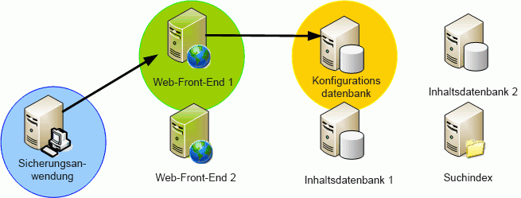
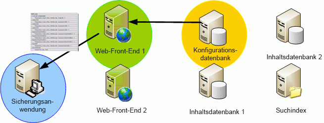
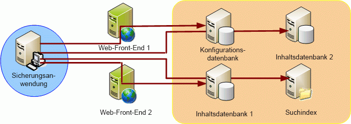

# SharePoint VSS WriterSharePoint VSS Writer
 **Zusammenfassung:** Informationen Sie zu den Eigenschaften und Features von der Gruppenrichtlinien-Verwaltungskonsole (Volume Shadow Copy Service, VSS) Writer für Microsoft SharePoint. Der VSS im Lieferumfang von Windows Server ist die Infrastruktur, die Funktionen der integrierten Shadow-Kopien bereitstellt. Schattenkopien erstellt von VSS ergänzen des Administrators die Speicher Band Archivierung Sicherungslösungen, Bereitstellung von High Fidelity Point-in-Time-Kopien, die erstellt werden können und auf einfache Weise und verbessern, damit helfen, die verschiedene Aspekte der Speicherung und Verwaltung vereinfachen wiederhergestellt. Microsoft SharePoint Foundation verwendet VSS zum Vereinfachen der Sicherung und Wiederherstellungsvorgängen.**Summary:** Learn about the characteristics and features of the Volume Shadow Copy Service (VSS) writer for Microsoft SharePoint. The VSS included with Windows Server is the infrastructure that provides built-in shadow copy capabilities. Shadow copies created by VSS augment the storage administrator's tape backup archival solutions, providing high fidelity point-in-time copies that can be created and restored easily and effectively, thereby helping to simplify several aspects of storage and data management. Microsoft SharePoint Foundation uses VSS to simplify backup and restore operations. 
  
    
    

## Eigenschaften des SystemsCharacteristics of the System

Im folgenden sind die SharePoint Foundation VSS-Lösung Funktionen und Merkmale:Following are the SharePoint Foundation VSS solution features and characteristics:
  
    
    

- **Ein einzelner VSS-Verweisschreiber.** Das Schreiben von Daten von Anwendungen zu Sicherungsanwendungen war nie einfach. Zum erfolgreichen Sichern verschiedener Windows-Plattformanwendungen besitzen Sicherungsanwendungen eine sehr große Anzahl von APIs, für die spezifischer Code geschrieben werden muss. Der SharePoint Foundation VSS Writer (nachfolgend "SPF VSS Writer" genannt) ermöglicht das Nutzen des einzelnen Writers zum Sichern von SharePoint Foundation.**A single VSS reference writer.** There has been no easy way for applications to describe their data to backup applications. To successfully back up various Windows platform applications, backup applications have an excessive number of APIs that they need to write specific code for. The SharePoint Foundation VSS writer (hereafter called "the SPF-VSS Writer") enables backup applications to take advantage of the single writer to backup SharePoint Foundation.
    
  
- **Sicherung und Wiederherstellung der vollständigen Farm für den Notfall.** Mit dem SPF VSS Writer kann eine Sicherungsanwendung (Anforderer) auf die VSS-API zugreifen, um einen Sicherungs- oder Wiederherstellungsvorgang für eine gesamte SharePoint Foundation-Farm anzufordern, einschließlich eines Setups in einem einzelnen System oder einer Farmkonfiguration. (Der IIS-Konfigurationsspeicher, bei dem es sich hauptsächlich um die Datei `applicationhost.config` handelt, ist nicht enthalten. Er muss separat gesichert und wiederhergestellt werden.)**Full farm backup and restore for catastrophe.** The SPF-VSS Writer enables a backup application (requestor) to access the VSS API to request a backup or a restore operation for an entire SharePoint Foundation farm, including a single box setup or a farm configuration. (The IIS configuration store, which is primarily the `applicationhost.config` file, is not included. It must be backed up and restored separately.)
    
  
- **Granularität auf Datenbankebene**. Mit dem SPF VSS Writer kann ein Anforderer alle Datenbanken, ein Segment der Datenbanken (Mehrfachauswahl) oder eine einzelne Datenbank (Einzelauswahl) sowohl für Sicherungs- als auch für Wiederherstellungsvorgänge auswählen. Alle Datenbanken mit Ausnahme der Konfigurations- und der Inhaltsdatenbank der Zentraladministration können über den Writer ausgewählt werden. Die Konfigurations- und die Inhaltsdatenbank der Zentraladministration können nur als Teil der ganzen Farm gesichert und wiederhergestellt werden. (Der IIS-Konfigurationsspeicher ist nicht enthalten. Er muss separat gesichert und wiederhergestellt werden.)**Database level granularity**. The SPF-VSS Writer enables a requestor to select all databases, a segment of the databases (multiple select), or a single database (single select) for both backup and restore operations. All databases, except configuration and the Central Administration content database, are selectable through the writer. The configuration and Central Administration content databases can be backed up and restored only as part of the whole farm. (The IIS configuration store is not included. It must be backed up and restored separately.)
    
  
- **Inventur von Datenbanken.** Vor der Sicherung generiert der SPF VSS Writer eine flache Liste der für eine Sicherung in der Farm ausgewählten Datenbanken. Die Liste wird an den Anforderer zurückgegeben, sodass die Sicherung an dem Speicherort ausgeführt werden kann, an dem sich die Datenbank physikalisch befindet.**Inventory of databases.** Before backup, the SPF-VSS Writer generates a flat list of databases selected for backup within the farm. The list is returned to the requestor so that backup can be run on the location where the database is physically located.
    
  
- **Farmunterstützung.** Vom Writer wird Unterstützung für die Synchronisierung der Sicherung und Wiederherstellung in einer SharePoint Foundation-Farm auf begrenzte Art und Weise bereitgestellt. Der Anforderer erhält vom Writer eine Liste der Server, Datenbanken und Dateien, die der Farm zugeordnet sind. Der Anforderer ist für das Herstellen einer separaten Verbindung mit jedem Server verantwortlich, um den SPF VSS Writer auf diesem Server zum Generieren der Sicherung oder zum Ausführen des Wiederherstellungsvorgangs aufzurufen.**Farm support.** The writer understands and provides support to synchronize backup and recovery on a SharePoint Foundation farm in a limited way. The writer provides the requestor with a list of servers, databases, and files associated with the farm. The requestor is responsible for making a separate connection to each server to call the SPF-VSS Writer on that server to generate the backup or to run the restore operation.
    
  
- **Sichern von Inhalt ohne Unterbrechung.** Falls eine Datei von einer Anwendung während der Sicherung geändert wird, kann die Datei dadurch beschädigt werden. Mit VSS wird eine rasche Momentaufnahme der Dateien für die Schattenkopie erstellt, während die Anwendung am ursprünglichen Speicherort ohne Unterbrechung weiter ausgeführt wird.**Backup content without interruption.** If an application modifies a file while it is being backed up, the file could become corrupt. VSS enables a quick snapshot of the files to the shadow copy, while the application continues to operate at the original location without interruption.
    
  
- **Austauschbare Datenbanksicherung und -wiederherstellung von Drittanbietern.** Mit dem SPF VSS Writer wird die austauschbare/erweiterbare Sicherung für Lösungen von Drittanbietern angeboten, die auf SharePoint Foundation aufbauen. Es sind jedoch nur die Datenbanken im Writer enthalten, die in der Konfigurationsdatenbank registriert sind. Alle weiteren Dateien und nicht registrierten Datenbanken sind nicht enthalten.**Third-party pluggable database backup and recovery.** The SPF-VSS Writer offers pluggable/extensible backup for third-party solutions built on top of SharePoint Foundation. However, only databases that are registered within the configuration database are included in the writer. Any additional files and unregistered databases are not included.
    
  
- **Sicherung und Wiederherstellung von Suchindexdateien.** Da Suchindexdateien im Dateisystem gespeichert werden, ist zu ihrer Sicherung ein separater Dateischreiber erforderlich. Zur Lösung dieses Problems enthält SharePoint Foundation einen separaten Suchschreiber, der Suchindexdateien behandelt. Zur Vereinfachung des Sicherns von Anwendungsschreibern deklariert SharePoint Foundation schreiberübergreifende Abhängigkeiten so, dass Suchindexdateien beim Sichern von registrierten Datenbanken in der Farm gesichert oder wiederhergestellt werden.**Search index files backup and recovery.** Because search index files are stored in the file system, a separate file writer is needed to them up back up. To resolve this, SharePoint Foundation includes a separate search writer that handles search index files. To simplify the process for backup application writers, SharePoint Foundation declares cross-writer dependencies in such a way that search index files are also backed up or restored when backing up registered databases in the farm.
    
  
- **Vollständiges Rollback.** Der SPF VSS Writer behandelt alle Komponenten in einer SharePoint Foundation-Bereitstellung, einschließlich der Konfigurationsdatenbank und der Inhaltsdatenbanken und der Suchdatenbank und des Suchindexes. Wie bereits zuvor erwähnt, besitzt der Writer auch eine Abhängigkeit vom Suchschreiber, der alle Suchindexdateien für die Sicherung und Wiederherstellung behandelt. Zum Zeitpunkt der Wiederherstellung kann der Writer ein Rollback der gesamten SharePoint Foundation-Bereitstellung durchführen, indem eine vorherige Farmsicherung wiederhergestellt wird. (Der IIS-Konfigurationsspeicher ist nicht enthalten. Er muss separat gesichert und wiederhergestellt werden.)**Full rollback.** The SPF-VSS Writer handles all components within a SharePoint Foundation deployment, including the configuration database and the content databases and the Search database and index. As mentioned previously, the writer also has a dependency on the Search writer, which handles all the Search index files for backup and recovery. At the time of recovery, the writer can roll back the entire SharePoint Foundation deployment by restoring a previous farm backup. (The IIS configuration store is not included. It must be backed up and restored separately.)
    
    > [!NOTE]
    > Wichtige Informationen zur Wiederherstellung finden Sie im Abschnitt „Wiederherstellen“ im Artikel [VSS-Anforderer und SharePoint](vss-requestors-and-sharepoint.md).[Note:](vss-requestors-and-sharepoint.md) See "Restoring" in  VSS requestors and SharePoint for important information about restorations.

- **Synchronisierung von Datenbanken nach der Wiederherstellung.** Zur Sicherstellung, dass alle Datenbanken nach Abschluss eines Wiederherstellungsvorgangs mit der Farm synchronisiert werden, wird jede Datenbank automatisch nach der Wiederherstellung getrennt und wieder mit der Farm verbunden. Administratoren müssen keine zusätzlichen Verfahren ausführen, um die wiederhergestellten Datenbanken erneut zu synchronisieren.**Post-restore synchronization of databases.** To ensure that all databases are synchronized with the farm after a restore operation is complete, each of the databases are automatically detached and reattached to the farm post recovery. Administrators do not need to run additional procedures to resynchronize the restored databases.
    
> [!IMPORTANT]
> Wenn Sie in Ihrer SharePoint Foundation-Farm SQL-Aliasse zur Anbindung an SQL Server verwenden, müssen Sie die Komponenten für SQL-Clientkonnektivität auf den Farmservern installieren, um SPF-VSS Writer für Sicherungen/Wiederherstellungen nutzen zu können.Important: If you use SQL aliases in your SharePoint Foundation farm to connect to the SQL Server, then you must install the SQL client connectivity components on your farm servers in order to use the SPF-VSS writer for backup/restore. Zu diesen Komponenten gehört der SQL-WMI-Anbieter für die Konfigurationsverwaltung. SPF-VSS Writer benötigt diesen Anbieter, um die SQL-Aliasse auf die richtige SQL Server-Instanz auflösen zu können.The components include SQL WMI provider for configuration management, which the SPF-VSS writer needs to resolve SQL aliases to the correct SQL Server. Eine Installation von Verwaltungstools wie SQL Management Studio ist nicht erforderlich.It is not necessary to install any of the management tools such as SQL Management Studio. Sie müssen dieselbe Installationsquelle verwenden wie für die Installation der SQL Server-Vollversion, beispielsweise eine Daten-DVD.You must use the same installation source (for example, a data DVD) that you would use to install the full SQL Server product. (Verwenden Sie auf keinen Fall die separaten, eigenständigen Versionen der Clientkomponenten.(Do not use the separate, stand-alone, version of the client components. Der SQL-WMI-Anbieter ist in diesen Versionen nicht enthalten.) Entscheiden Sie sich für eine benutzerdefinierte Installation, und installieren Sie lediglich die Clientkomponenten.That version does not include the SQL WMI provider.) Choose to make a custom installation and choose only the client components to install. 
  
    
    

## Von SPF-VSS Writer ausgeführte FunktionenFunctions Performed by the SPF-VSS Writer

Vom SPF VSS Writer werden die folgenden Funktionen ausgeführt:The SPF-VSS Writer performs the following functions:
  
    
    

1. Erstellt SharePoint Foundation-Komponenten.Builds SharePoint Foundation components.
    
  - Generiert eine vollständige Liste aller Komponenten in der SharePoint Foundation-Farm.Generates a full list of all components within the SharePoint Foundation farm.
    
  
  - Er muss nicht an den Sicherungsprozess oder Wiederherstellungsprozess gebunden sein.Is not necessarily tied to backup process or restore process.
    
  

  
  

  

  
2. Sichert Farm oder Datenbank.Backs up farm or database.
    
  - Fordert eine SharePoint Foundation-Sicherung (Farm/Datenbank) über VSS an.Requests a SharePoint Foundation (farm/database) backup via VSS.
    
  

  
  

  

  
3. Stellt eine Farm oder Datenbank wieder her.Restores a farm or database.
    
  - Fordert eine SharePoint Foundation-Wiederherstellung (Farm/Datenbank) über VSS an.Requests a SharePoint Foundation (farm/database) recovery via VSS.
    
  
  - Implementiert **postRestore()** zum Synchronisieren von Websitetabellen.Implements **postRestore()** to synchronize sites table.
    
  

  
  

  

  

## Nächste SchritteNext steps

Erfahren Sie, wie erstellen und Verwenden eines VSS-Requestors für SharePoint:Learn how to create and use a VSS requestor for SharePoint:
  
    
    

-  [VSS-Anforderer und SharePointVSS requestors and SharePoint](vss-requestors-and-sharepoint.md)
    
  

## Siehe auchSee also

-  [Übersicht über SharePoint und der Volumeschattenkopie-DienstOverview of SharePoint and the Volume Shadow Copy Service](overview-of-sharepoint-and-the-volume-shadow-copy-service.md)
    
  

