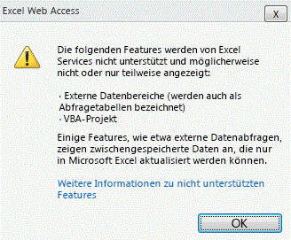
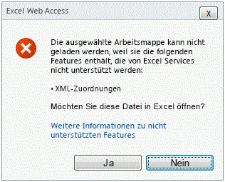

# Unterstützte und nicht unterstützte FeaturesSupported and Unsupported Features

  
    
    

Microsoft Excel weist umfangreiche Features auf. Mit jeder Version wird die Funktionslücke zwischen Excel und Excel Services kleiner, und die Anzahl nicht unterstützter Features wird geringer. Allerdings kann nicht jedes Excel-Feature in der zweiten Version von Excel Services, in Microsoft SharePoint Server 2010, unterstützt werden. Es werden bevorzugt Features unterstützt, die in wichtigen Excel Services-Szenarien benötigt werden und mit denen für Excel Services als Serverdienst sichergestellt wird, dass die Erwartungen der Kunden bezüglich Zuverlässigkeit, Skalierbarkeit und Sicherheit erfüllt werden.Microsoft Excel is feature-rich. With every release, the functionality gap between Excel and Excel Services gets narrower, and the number of unsupported features is reduced. But is not possible to support every Excel feature in the second version of Excel Services, in Microsoft SharePoint Server 2010. When deciding which feature to support, priorities are given to features that are needed in key Excel Services scenarios, and to ensuring that Excel Services is a server-grade service that meets customers' expectations for reliability, scalability, and security.
  
    
    

> **Hinweis:** In diesem Artikel setzen wir voraus, dass Sie wissen, welche Features in Microsoft Office SharePoint Server 2007 unterstützt werden und welche nicht.**Note** This topic assumes that you are familiar with what is supported and unsupported in Microsoft Office SharePoint Server 2007. You can find more information about the unsupported features in Office SharePoint Server 2007 in  Unsupported Features in Excel Services. Weitere Informationen zu den Features, die in Office SharePoint Server 2007 nicht unterstützt werden, finden Sie unter [Unsupported Features in Excel Services](http://msdn.microsoft.com/de-DE/library/ms496823.aspx).Note This topic assumes that you are familiar with what is supported and unsupported in Microsoft Office SharePoint Server 2007. You can find more information about the unsupported features in Office SharePoint Server 2007 in  [Unsupported Features in Excel Services](http://msdn.microsoft.com/de-DE/library/ms496823.aspx). 
  
    
    

## Unterstützung für neue Excel-FeaturesSupport for New Excel Features

Die Funktionsweise der meisten neuen Features in Microsoft Excel 2010 ist in Excel Services identisch. Einige Features werden wie in Excel angezeigt, während andere Features angezeigt werden können und außerdem interaktiv sind.Most of the new features in Microsoft Excel 2010 work in some way in Excel Services. Some features display as they do in Excel. Others can be displayed and are also interactive.
  
    
    
 **Die folgenden neuen Features können angezeigt werden:****Following are new features that can be viewed:**
  
    
    

- SparklinesSparklines
    
  
-  [Symbolsatz](http://blogs.msdn.com/excel/archive/2009/08/05/icon-set-improvements-in-excel-2010.aspx) und [Verbesserungen bei den Datenbalken](http://blogs.msdn.com/excel/archive/2009/08/07/data-bar-improvements-in-excel-2010.aspx)[Icon set](http://blogs.msdn.com/excel/archive/2009/08/05/icon-set-improvements-in-excel-2010.aspx) and [data bar improvements](http://blogs.msdn.com/excel/archive/2009/08/07/data-bar-improvements-in-excel-2010.aspx)
    
  
-  [Benannte PivotTable-MengenPivotTable named sets](http://blogs.msdn.com/excel/archive/2009/10/05/pivottable-named-sets-in-excel-2010.aspx)
    
  
-  [Verbesserungen bei PivotTablesPivotTable improvements](http://blogs.msdn.com/excel/archive/2009/10/15/a-few-more-pivottable-improvements-in-excel-2010.aspx)
    
  
 **Die folgenden neuen Features können angezeigt werden und sind interaktiv:****Following are new features that can be viewed and interacted with:**
  
    
    

- DatenschnitteSlicers
    
  
- PowerPivot-DateienPowerPivot files
    
  
Die neuen Funktionen in Excel werden ebenfalls unterstützt. Eingebettete Bilder, ein langjähriges Feature von Excel, werden nun unterstützt und können in Excel Services angezeigt werden.The new functions in Excel are also supported. Embedded images, a long-time feature of Excel, are now supported and can be viewed in Excel Services. 
  
    
    

## Features, die früher das Laden von Excel-Dateien verhindertenFeatures that Previously Prevented Excel Files from Loading

In Office SharePoint Server 2007 werden Excel-Arbeitsmappen, die nicht unterstützte Features wie z. B. VBA-Makros, Formsteuerelemente usw. enthalten, nicht in Excel Services geladen.In Office SharePoint Server 2007, Excel workbooks that contain unsupported features like VBA macros, form controls, and so on are not loaded in Excel Services.
  
    
    
Um Benutzern mit dieser Einschränkung zu helfen, ignoriert Excel Services in SharePoint Server 2010 bestimmte nicht unterstützte Features. Das heißt, anstatt das Laden der gesamten Datei zu verhindern, wird die Datei von Excel Services geladen, aber die Features, die von Excel Services nicht unterstützt werden, werden nicht angezeigt.In SharePoint Server 2010, to help users work with this limitation, Excel Services ignores certain unsupported features. In other words, rather than blocking the entire file from loading, Excel Services loads the file but you do not see the features that Excel Services does not support.
  
    
    
Die folgenden Features hindern Excel Services nicht am Laden einer Datei:Following are features that do not prevent Excel Services from loading a file:
  
    
    

- Zellkommentare.Cell comments.
    
  
- Formelbezüge auf externe Arbeitsmappen.Formula references to external books.
    
  
- Abfragetabellen (werden auch als externe Datenbereiche bezeichnet).Query tables (also known as external data ranges).
    
  
- Microsoft Visual Basic for Applications (VBA).Microsoft Visual Basic for Applications (VBA).
    
  
- Jede OfficeArt-Technologie. Beispielsweise Formen, WordArt, SmartArt, Organigramme, Diagramme, Signaturzeilen, Freihandanmerkungen usw.Any OfficeArt technology. For example, Shapes, WordArt, SmartArt, organization chart, diagrams, signature lines, ink annotations, and so on.
    
  
Beachten Sie, dass diese Features auch weiterhin nicht unterstützt werden. Dies bedeutet, dass sie nicht gerendert, ausgeführt oder eingesetzt werden können wie dies auf dem Client der Fall ist. Die meisten aufgelisteten Features werden in Excel Services nicht angezeigt. Wenn z. B. beim Anzeigen im Client eine Form in der Nähe von Zelle A1 vorhanden ist, ist beim Anzeigen auf dem Server keine Form sichtbar. Andere Features, wie z. B. Formelbebezüge und Abfragetabellen, enthalten Werte, die zuletzt auf dem Client aktualisiert wurden. Die Werte in den Zellen sind also weiterhin vorhanden, aber sie können nicht aktualisiert werden.Note that these features continue to be unsupported. This means that they do not render, execute, or work in any way as they do on the client. Most of the features in the list do not render in Excel Services. For example, if there is a Shape near cell A1 when viewed in the client, you see no Shape when viewed on the server. Other features, like formula references and query tables, show values that were last refreshed on the client. In other words, the values in the cells are still there, but you cannot update them. 
  
    
    
Schließlich wird VBA-Code nicht auf dem Server ausgeführt. In Office SharePoint Server 2007, Excel Services wurde das Laden von XLSM-Dateien nicht unterstützt. In SharePoint Server 2010 werden VBA-Makros von Excel Services ignoriert. Deshalb können XLSM-Dateien nun in Excel Services geladen werden.Lastly, VBA code does not execute on the server. In Office SharePoint Server 2007, Excel Services did not support loading *.xlsm files. In SharePoint Server 2010, Excel Services ignores VBA macros. Therefore, *.xlsm files can now be loaded in Excel Services.
  
    
    

## Anzeigen einer Datei mit ignorierten FeaturesViewing a File with Ignored Features

Wenn Excel Services Dateien laden und bestimmte nicht unterstützte Features nicht rendern kann, woher können Sie dann wissen, dass in der angezeigten Datei Features fehlen? Sie wissen, dass Sie eine Datei mit fehlenden Features anzeigen, da von Excel Services oben in der Arbeitsmappe eine entsprechende Benachrichtigung anzeigt wird. Diese Benachrichtigung ist im folgenden Bildschirmfoto dargestellt.If Excel Services is able to load files and not render certain unsupported features, how can you know the file that you are viewing is missing some features? You know that you are viewing a file with some missing features because Excel Services displays a notification above the worksheet to alert you. The following screenshot shows the notification.
  
    
    

**Benachrichtigung zu nicht unterstützten Features oben in der Arbeitsmappe****Unsupported Features notification on top of workbook**

  
    
    
Diese Benachrichtigung ist der erste Hinweis darauf, dass die Datei anders als im Excel-Client dargestellt wird.This notification is the first indication that the file is rendering differently than it would in the Excel client.
  
    
    
Durch Klicken auf **Weitere Informationen zu nicht unterstützten Features** in der folgenden Abbildung werden Informationen zu den Features angezeigt, die in der Datei nicht unterstützt werden.In the following figure, clicking **Learn more about unsupported features** provides information about which unsupported features are in the file.
  
    
    

**Fehlermeldung zu nicht unterstützten Features für VBA****Unsupported feature error message for VBA**

  
    
    

  
    
    

  
    
    
Zugeschnittene Bilder werden nicht angezeigt (d. h. fehlende Features).Cropped images are not displayed (that is, missing features). 
  
    
    

    
> **Hinweis:** Enthält eine Arbeitsmappe ignorierte oder fehlende nicht unterstützte Features, für die beim Laden im Ansichtsmodus eine Benachrichtigungsleiste angezeigt wurde, werden die nicht unterstützten Features entfernt, wenn eine Kopie der Arbeitsmappe gespeichert wird.**Note** For workbooks that contain ignored or missing unsupported features that loaded in view mode with a notification bar, attempting to save a copy of the workbook involves removing the unsupported features. A dialog box alerts the user of this. Der Benutzer wird durch ein Dialogfeld über diesen Vorgang informiert.A dialog box alerts the user of this. 
  
    
    

## Weitere nicht unterstützte FeaturesOther Unsupported Features

Alle anderen unterstützten Features verhalten sich in Excel Services weiterhin wie in Office SharePoint Server 2007. Das heißt, Excel Services verhindert das Laden einer Datei, wenn nicht unterstützte Features gefunden werden. Die Benutzer werden wie im folgenden Bildschirmfoto gezeigt benachrichtigt, dass die Datei nicht geladen werden kann.All other unsupported features continue to behave as they do in Office SharePoint Server 2007 for Excel Services. That is, Excel Services blocks loading of a file if it detects the existence of one or more of these unsupported features. Users are informed that the file cannot be loaded, as shown in the following screen shot. 
  
    
    

> **Hinweis:** Weitere Details zu diesen nicht unterstützten Features finden Sie im Artikel [Unsupported Features in Excel Services](http://msdn.microsoft.com/de-DE/library/ms496823.aspx).**Note** The  [Unsupported Features in Excel Services](http://msdn.microsoft.com/de-DE/library/ms496823.aspx) topic contains more details about these unsupported features.
  
    
    

> **Vorsicht:** Die Informationsleiste mit der Liste der nicht unterstützten Features wird nicht angezeigt, wenn die Datei über ein Webpart geladen wird.**Caution** The information bar with the list of unsupported features is not displayed if the file is loaded from a Web Part. 
  
    
    

**Fehlermeldung zu nicht unterstützten Features für XML-Zuordnungen****Unsupported feature error message for XML maps**

  
    
    

  
    
    

  
    
    
Im Gegensatz zu Arbeitsmappen mit externen Verknüpfungen werden Diagramme mit externen Verknüpfungen am Laden gehindert.Unlike workbooks with external links, charts with external links are blocked from loading. 
  
    
    

## Siehe auchSee also

#### KonzepteConcepts

  
    
    
 [Excel Services (Übersicht)Excel Services Overview](excel-services-overview.md)
  
    
    
 [Excel Services-ArchitekturExcel Services Architecture](excel-services-architecture.md)
  
    
    
 [Excel Services - Blogs, Foren und RessourcenExcel Services Blogs, Forums, and Resources](excel-services-blogs-forums-and-resources.md)
#### Sonstige RessourcenOther resources

  
    
    
 [Walkthrough: Developing a Custom Application Using Excel Web ServicesWalkthrough: Developing a Custom Application Using Excel Web Services](walkthrough-developing-a-custom-application-using-excel-web-services.md)
