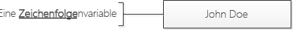
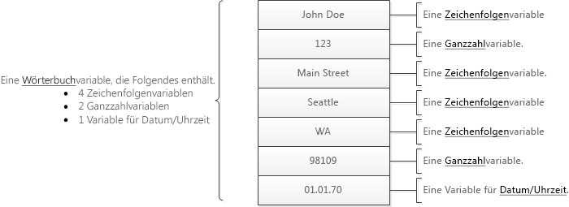
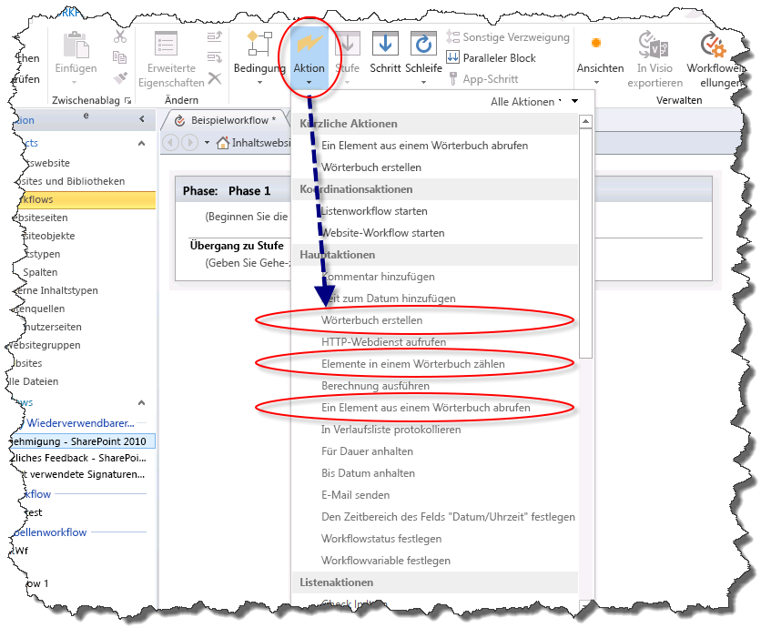
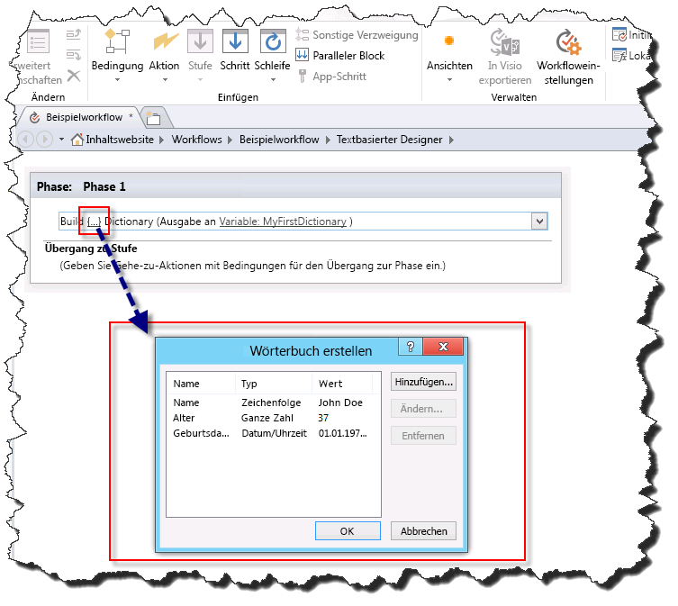
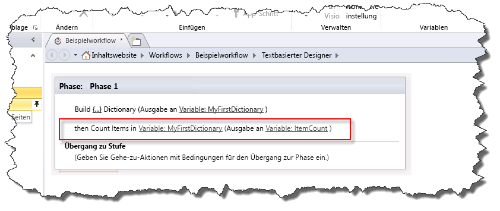
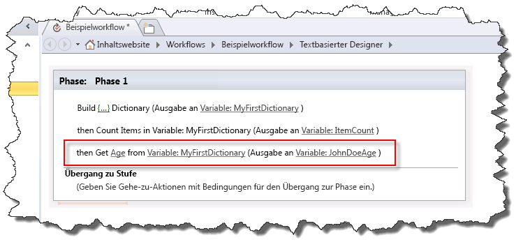

# Verstehen von Wörterbuchaktionen in SharePoint Designer 2013Understanding Dictionary actions in SharePoint Designer 2013
Der Variablentyp "Wörterbuch" ist ein neuer Variablentyp in der Workflowplattform von SharePoint, die Sie mit SharePoint Designer 2013 verwenden können.The Dictionary variable type is a new variable type in the SharePoint Workflow platform that you can use with SharePoint Designer 2013. 

   

## Grundlegendes zum Variablentyp "Wörterbuch"Understanding the Dictionary variable type

Ein Workflow ist eine Folge von Aktionen, die zu einem gewünschten Ergebnis führen. Beim Erstellen eines Workflows müssen Sie häufig Werte für die Verwendung in anderen Teilen des Workflows in einer Variablen (Speichercontainer) speichern.A workflow is a series of actions that perform a desired outcome. As you build a workflow you often need to save values in a variable (storage container) to use in other parts of the workflow.
  
    
    
Wenn Sie eine Variable erstellen, müssen Sie dem Workflowmodul mitteilen, welche Art von Daten in der Variablen enthalten sind. Beispiel: Sie möchten den Namen eines Mitarbeiters in einer Variablen speichern. Der Name eines Mitarbeiters ist eine Zeichenfolge. Somit würden Sie eine Variable vom Typ **String** erstellen. Der Workflow könnte dann den Namen des Mitarbeiters, z. B. "John Doe", in der Variablen speichern.When you create a variable you need to tell the workflow engine what type of data will be contained in the variable. For example, you might want to save the name of an employee in a variable. The name of an employee is a string of characters so you would create a variable of type **String**. The workflow could then store the name of the employee, such as "John Doe," in the variable. 
  
    
    

**Abbildung: Eine Zeichenfolgenvariable****Figure: A String variable**

  
    
    

  
    
    

  
    
    
SharePoint Designer 2013 verfügt über einen neuen Variablentyp **Wörterbuch**. Der Variablentyp **Wörterbuch** ist ein Container, der eine Auflistung von anderen Variablen enthalten soll. In Ihrem Workflow muss möglicherweise mehr als nur der Name des Mitarbeiters gespeichert werden. Sie müssen möglicherweise auch seine Adresse und sein Geburtsdatum speichern. Wenn Sie keine **Wörterbuch**-Variable verwenden, müssen Sie mehrere eigenständige Variablen erstellen. Dies kann schnell zu Schwierigkeiten in der Organisation und bei der Verwendung in der Workflowlogik führen. Eine **Wörterbuch**-Variable ermöglicht es, mehrere Datenpunkte in einer Variablen zu speichern.SharePoint Designer 2013 has a new variable type called **Dictionary**. The **Dictionary** variable type is a container designed to hold a collection of other variables. For example, your workflow might need to store more than just the name of the employee. It might also need to store his address and birth date. If you do not use the **Dictionary** variable you will have to create multiple stand-alone variables. This can quickly become difficult to organize and difficult to work with in the logic of the workflow. A **Dictionary** variable allows you to store multiple data points in a single variable.
  
    
    
Die Abbildung veranschaulicht das Konzept.The figure illustrates the concept.
  
    
    

**Abbildung: Eine Wörterbuchvariable****Figure: A Dictionary variable**

  
    
    

  
    
    

  
    
    

  
    
    

  
    
    

## Workflowaktionen für den Variablentyp "Wörterbuch"Workflow actions that use the Dictionary variable type

Ein Workflow besteht aus mehreren Aktionen, die während der Verarbeitung des Workflows ausgeführt werden. SharePoint Designer 2013 enthält viele verschiedene Aktionen. Beispielsweise gibt es eine Aktion zum Senden einer E-Mail, zum Erstellen eines Listenelements und zum Protokollieren von Nachrichten im Workflowverlauf.A workflow consists of multiple actions that are executed as the workflow is processed. SharePoint Designer 2013 contains many different actions. For example, there is an action to send an email message, create a list item, and log messages to workflow history.
  
    
    
Im Folgenden sind die drei Aktionen aufgeführt, die speziell für den Variablentyp **Wörterbuch** entwickelt wurden.The following are the three actions specifically designed for the **Dictionary** variable type.
  
    
    

- **Wörterbuch erstellen****Build Dictionary**
    
  
- **Elemente in einem Wörterbuch zählen****Count Items in a Dictionary**
    
  
- **Ein Element aus einem Wörterbuch abrufen****Get an Item from a Dictionary**
    
  
Die Workflowaktionen für den Variablentyp Wörterbuch finden Sie in der Dropdownliste **Aktion**, wie in der Abbildung dargestellt.The workflow actions for the Dictionary variable type can be found on the **Action** drop-down list, as shown in the figure.
  
    
    

**Abbildung: Wörterbuchaktionen****Figure: Dictionary actions**

  
    
    

  
    
    

  
    
    

### Erstellen von Variablen mit der Aktion "Wörterbuch erstellen"Create variables with the "Build Dictionary" action

Sie verwenden die Aktion **Wörterbuch erstellen**, um eine Variable vom Typ **Wörterbuch** zu erstellen. Sie geben den Inhalt des Wörterbuchs ein und geben dann den Namen des Wörterbuchs in der Variablenliste an.You use the **Build Dictionary** action to create a variable of type **Dictionary**. You enter the contents of the dictionary and then specify the name of the dictionary in the variable list.
  
    
    
Die Abbildung zeigt das Dialogfeld **Wörterbuch erstellen**. Beachten Sie, dass dem Wörterbuch drei Variablen hinzugefügt wurden: eine Zeichenfolge, eine ganze Zahl und eine Datum/Uhrzeit-Variable.The figure shows the **Build a Dictionary** dialog box. Notice that three variables have been added to the dictionary: a string, an integer, and a date/time.
  
    
    

**Abbildung: Das Dialogfeld "Wörterbuch erstellen"****Figure: The "Build a Dictionary" dialog box**

  
    
    

  
    
    

  
    
    
Ein **Wörterbuch** kann jeden Typ von Variable enthalten, der in der SharePoint-Workflowplattform verfügbar ist. In der folgenden Liste werden die verfügbaren Variablentypen definiert:A **Dictionary** can contain any type of variable available in the SharePoint Workflow platform. The following list defines the variable types available:
  
    
    

- **Boolean**: Ein Ja/Nein-Wert Wert**Boolean**: A Yes or No value
    
  
- **Date/Time**: Datum und Uhrzeit**Date/Time**: A date and time
    
  
- **Dictionary**: Eine Auflistung von Variablen**Dictionary**: A collection of variables
    
  
- **Guid**: Eine GUID (Globally Unique Identifier)**Guid**: A Globally Unique Identifier (GUID)
    
  
- **Integer**: Eine ganze Zahl ohne Dezimalstellen**Integer**: A whole number without decimals
    
  
- **Number**: Eine Zahl, die Dezimalstellen enthalten kann**Number**: A number that can contain decimals
    
  
- **Zeichenfolge**: Eine Folge aus Zeichen**String**: A string of characters
    
  

    
> **Wichtig:** Der Variablentyp **Wörterbuch** ist wichtig bei der Verwendung der Aktion **HTTP-Webdienst aufrufen**.**Important:** The **Dictionary** variable type is critical when you are using the **Call HTTP Web Service** action.
  
    
    

    
> **Vorsicht:** Sie können das Feld **Name** nur für die Suche verwenden, wenn Sie einen Wert in einem Wörterbuch festlegen.**Caution:** Using the **Name** field as a lookup is only supported when you are setting a value in a dictionary. Wenn Sie ein Wörterbuch aufbauen, wird das Feld **Name** nicht für die Suche unterstützt.Using the **Name** field as a lookup is not supported when you are building a dictionary.
  
> [!NOTE] 
> Eine **Dictionary**-Variable kann eine Variable vom Typ **Wörterbuch** enthalten.Note: A **Dictionary** variable can contain a variable of type **Dictionary**. Die Möglichkeit, **Dictionary**-Variablen in einem **Wörterbuch** zu speichern, bietet eine Reihe von Vorteilen.The ability to store **Dictionary** variables within a **Dictionary** provides a number of benefits. Sie können z. B. ein **Wörterbuch** erstellen, um Informationen über Mitarbeiter zu speichern.For example, you might create a **Dictionary** to store information about employees. Innerhalb des **Wörterbuchs** können Sie einen weiteren **Wörterbuch**-Eintrag für jeden Mitarbeiter erstellen.Within the **Dictionary** you might create another **Dictionary** entry for each employee. Wenn Sie den Workflow erstellen, können Sie die **Wörterbuch**-Variable verwenden, anstatt ständig neue eigenständige Variablen für jede Information zu jedem Mitarbeiter zu erstellen.As you build the workflow you can use the **Dictionary** variable instead of constantly creating new stand-alone variables for each piece of information about each employee. Wie in diesem Beispiel gezeigt, kann ein **Wörterbuch** verwendet werden, um komplexe Informationen im Workflow zu organisieren.As this example shows, a **Dictionary** can be used to organize complex information within the workflow.
  
    
    

### Ermitteln und Speichern von Variablen mit der Aktion „Elemente in einem Wörterbuch zählen“Count and store variables with the "Count Items in a Dictionary" action

Mit der Aktion **Elemente in einem Wörterbuch zählen** zählen Sie die Variablen, die ein **Wörterbuch** enthält, und speichern diese Zahl dann in einer ganzzahligen Variablen. Anschließend können Sie die Anzahl von Elementen zum Durchlaufen des **Wörterbuchs** verwenden.You use the **Count Items in a Dictionary** action to count the variables that a **Dictionary** contains and then store that number in an Integer variable. You can then use the item count to loop through the **Dictionary**.
  
    
    
Die Abbildung zeigt die Workflowaktion **Elemente in einem Wörterbuch zählen**.The figure shows the **Count Items in a Dictionary** workflow action.
  
    
    

**Abbildung: Elemente in einem Wörterbuch zählen****Figure: Count items in a Dictionary**

  
    
    

  
    
    

  
    
    

  
    
    

  
    
    

### Abrufen von Variablen mit der Aktion "Ein Element aus einem Wörterbuch abrufen"Retrieve variables with the "Get an Item from a Dictionary" action

Mit der Aktion **Ein Element aus einem Wörterbuch abrufen** rufen Sie eine im **Wörterbuch** gespeicherte Variable ab und platzieren sie in einer Variablen. Dies ist hilfreich, wenn Sie einen Wert aus dem Wörterbuch in einer eigenständigen Variablen gespeichert benötigen. Sie können einen Wert durch Eingeben des Namens der Variablen abrufen.You use the **Get an Item from a Dictionary** action to retrieve a variable stored in the **Dictionary** and place it in a variable. This is valuable when you need a value in the dictionary stored in a stand-alone variable. You can retrieve a value by entering the name of the variable.
  
    
    
Die Abbildung zeigt die Workflowaktion **Ein Element aus einem Wörterbuch abrufen**. Beachten Sie, dass **Age** der Name der Variablen im **Wörterbuch** ist, die in eine neue **Integer**-Variable ausgegeben wird.The figure shows the **Get an Item from a Dictionary** workflow action. Notice that **Age** is the name of the variable in the **Dictionary** and it is being output to a new **Integer** variable.
  
    
    

**Abbildung: Ein Element aus einem Wörterbuch abrufen****Figure: Get an item from a Dictionary**

  
    
    

  
    
    

  
    
    

  
    
    

  
    
    

## Siehe auchSee also

-  [Workflow in SharePoint]((http://technet.microsoft.com/de-DE/sharepoint/jj556245.aspx))[Workflow in SharePoint]((http://technet.microsoft.com/de-DE/sharepoint/jj556245.aspx))
    
  
-  [Neu in SharePoint-Workflows]((http://msdn.microsoft.com/library/6ab8a28b-fa2f-4530-8b55-a7f663bf15ea.aspx))[What's new in workflow in SharePoint]((http://msdn.microsoft.com/library/6ab8a28b-fa2f-4530-8b55-a7f663bf15ea.aspx))
    
  
-  [Erste Schritte mit SharePoint-Workflows]((http://msdn.microsoft.com/library/cc73be76-a329-449f-90ab-86822b1c2ee8.aspx))[Getting started with SharePoint workflow]((http://msdn.microsoft.com/library/cc73be76-a329-449f-90ab-86822b1c2ee8.aspx))
    
  

  
    
    

