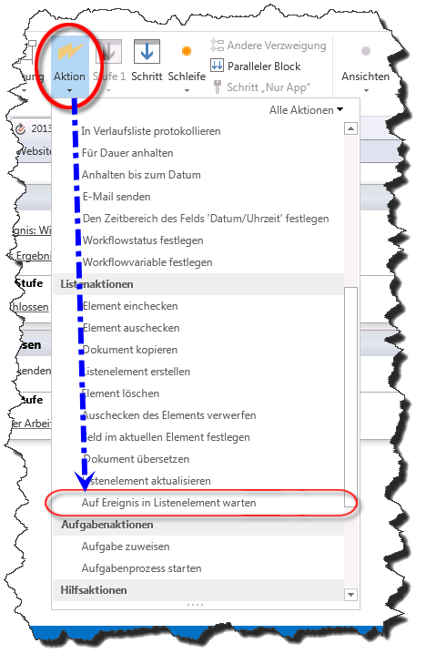
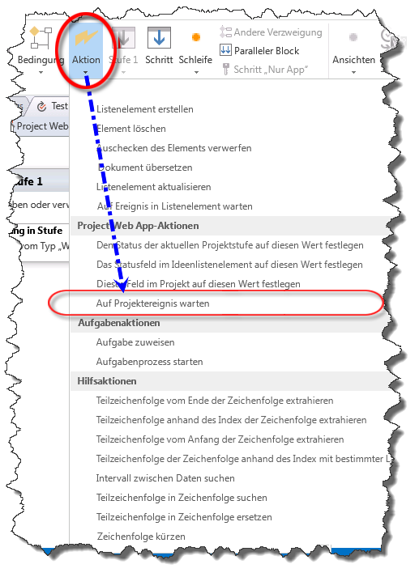
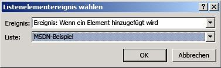
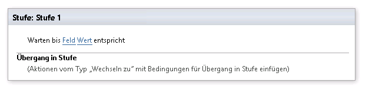

# Verstehen von Ereignisaktionen in SharePoint Designer 2013
Informationen zur Verwendung von Ereignisaktionen in SharePoint Designer 2013.
## Übersicht über Ereignisaktionen in SharePoint Designer 2013

Ein SharePoint-Workflow kann eine Benachrichtigung beim Hinzufügen oder Ändern eines Elements abonnieren. Wenn ein Element hinzugefügt oder geändert wird, wird ein Ereignis aufgerufen. Ein Workflow kann auf diese Ereignisse warten, bevor mit dem Workflow fortgefahren wird. Die Ereignisaktionen in SharePoint Designer 2013 sind die folgenden: 
  
    
    

- **Auf Ereignis in Listenelement warten:** Wird verwendet, damit gewartet wird, bis ein neues Element erstellt oder ein Element geändert wird.
    
  
- **Auf Projektereignis warten:** Wird verwendet, damit gewartet wird, bis ein Projekt eingecheckt, zugesichert oder eingereicht wird.
    
  
- **Auf Feldänderung im aktuellen Element warten:** Wird verwendet, damit gewartet wird, bis ein Feld im aktuellen Element geändert wird.
    
  
Sie finden die Ereignisaktionen im Dropdownmenü **Aktion** im Menüband von SharePoint Designer 2013 (siehe Abbildungen unten).
  
> [!NOTE] 
> Die **Project Web App-Aktionen** sind nur verfügbar, wenn Sie mit einer Project Web App-Website arbeiten.
  
    
    

**Ereignisaktion in SharePoint Designer 2013**

  
    
    

  
    
    

  
    
    

**Project Web App-Ereignisaktion in SharePoint Designer 2013**

  
    
    

  
    
    

  
    
    

**Auf Feldänderung im aktuellen Element warten in SharePoint Designer 2013**

  
    
    

  
    
    

  
    
    

  
    
    

  
    
    

## Verwenden von Ereignisaktionen in SharePoint

Ein Workflow sorgt für die Abstimmung von Geschäftsprozessen. In einem Geschäftsprozess ist es häufig wichtig zu warten, bis ein Element hinzugefügt oder in einer SharePoint-Liste aktualisiert wird. Das Verwenden der Ereignisaktionen ermöglicht es, auf ein Ereignis zu warten und dann eine Workflowaktion auszuführen.
  
    
    
Die Ereignisaktionen befinden sich im Dropdown-Menü „Aktionen" im SharePoint Designer 2013-Menüband. Sie können die Aktion für den Workflow hinzufügen und sie dann entsprechend anpassen.
  
    
    

### Auf Ereignis in Listenelement warten

Die Aktion **Auf Ereignis in Listenelement warten** enthält zwei Bereiche, die bearbeitet werden können, wie in der Abbildung dargestellt.
  
    
    

**Auf Ereignis in Listenelement warten**

  
    
    

  
    
    

  
    
    

  
    
    

  
    
    
Die zwei Bereiche, die bearbeitet werden können sind die folgenden:
  
    
    

- **Dieses Elementereignis:** Die Liste und das Ereignis, die überwacht werden.
    
  
- **Ausgabevariable:** Eine Variable, in der die GUID des Elements gespeichert wird, von dem das Ereignis stammt. Elemente müssen ein ID- und ein GUID-Feld aufweisen. Die ID ist in der Liste eindeutig, und eine GUID ist global eindeutig. Beispiel: die ID des ersten Elements in der Liste ist „1" und die ID des zweiten Elements ist „2". Die GUID ist global eindeutig und ist ein 128-Bit-Wert, der aus einer Gruppe von 8 Hexadezimalziffern, gefolgt von drei Gruppen von jeweils 4 Hexadezimalziffern besteht, auf die wiederum eine Gruppe von 12 Hexadezimalziffern folgt. Ein Beispiel für eine GUID ist: 6B29FC40-CA47-1067-B31D-00DD010662DA. Die Aktion **Auf Ereignis in Listenelement warten** ruft die GUID ab.
    
  
Durch Klicken auf den Link **Dieses Elementereignis** wird das Dialogfeld **Listeneintragsereignis auswählen** geöffnet, wie in der Abbildung dargestellt.
  
    
    

**Dialogfeld „Listeneintragsereignis auswählen"**

  
    
    

  
    
    

  
    
    

  
    
    

  
    
    
Die Dropdownliste **Ereignis** entspricht dem Ereignistyp. Es stehen die Optionen „Warten, bis ein Element zur Liste hinzugefügt wird" oder „Warten, bis ein Element in der Liste geändert wird" zur Verfügung. Die Dropdownliste **Liste** entspricht der Liste, die überwacht wird.
  
    
    

### Auf Projektereignis warten

Die Aktion **Auf Projektereignis warten** enthält einen Bereich, der bearbeitet werden kann, wie in der Abbildung dargestellt.
  
    
    

**Auf Projektereignis warten**

  
    
    

  
    
    

  
    
    

  
    
    

  
    
    
Der zu bearbeitende Bereich ist:
  
    
    

- **Dieses Projektereignis:** Das Projektereignis, auf das der Workflow warten soll.
    
  
In der Dropdownliste **Dieses Projektereignis** stehen drei Projektereignisse zur Auswahl. Diese umfassen das Warten, bis ein Projekt eingecheckt, zugesichert oder eingereicht wird.
  
    
    
Sobald das Ereignis eingetreten ist, setzt der Workflow den Prozess fort.
  
    
    

### Auf Feldänderung im aktuellen Element warten

Die Aktion **Auf Feldänderung im aktuellen Listenelement warten** enthält zwei Bereiche, die bearbeitet werden können, wie in der Abbildung dargestellt.
  
    
    

**Auf Feldänderung im aktuellen Element warten**

  
    
    

  
    
    

  
    
    

  
    
    

  
    
    
Die Bereiche, die bearbeitet werden können sind die folgenden:
  
    
    

- **Feld:** Das Elementfeld, dessen Änderungen überwacht werden sollen.
    
  
- **Wert:** Der Wert, den das Feld aufweisen muss, damit mit dem Workflow fortgefahren wird.
    
  
Sobald ein Feld geändert hat, wird der Workflow fortgesetzt.
  
    
    

## Siehe auch

-  [Workflows in SharePoint ]((http://technet.microsoft.com/de-DE/sharepoint/jj556245.aspx))
    
  
-  [Neuerungen bei SharePoint-Workflows]((http://msdn.microsoft.com/library/6ab8a28b-fa2f-4530-8b55-a7f663bf15ea.aspx))
    
  
-  [Erste Schritte mit SharePoint-Workflows]((http://msdn.microsoft.com/library/cc73be76-a329-449f-90ab-86822b1c2ee8.aspx))
    
  
-  [Workflowentwicklung in SharePoint Designer und Visio](workflow-development-in-sharepoint-designer-and-visio.md)
    
  
-  [Kurzübersicht zu Workflowaktionen (SharePoint-Workflowplattform)](workflow-actions-quick-reference-sharepoint-workflow-platform.md)
    
  

  
    
    

