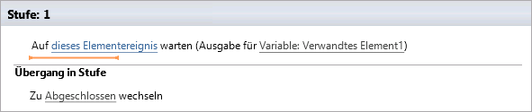

# Verstehen von Ereignisaktionen in SharePoint Designer 2013Understanding Eventing Actions in SharePoint Designer 2013
Informationen zur Verwendung von Ereignisaktionen in SharePoint Designer 2013.Learn to use Eventing Actions in SharePoint Designer 2013.
## Übersicht über Ereignisaktionen in SharePoint Designer 2013Overview of Eventing Actions in SharePoint Designer 2013

Ein SharePoint-Workflow kann eine Benachrichtigung beim Hinzufügen oder Ändern eines Elements abonnieren. Wenn ein Element hinzugefügt oder geändert wird, wird ein Ereignis aufgerufen. Ein Workflow kann auf diese Ereignisse warten, bevor mit dem Workflow fortgefahren wird. Die Ereignisaktionen in SharePoint Designer 2013 sind die folgenden:A SharePoint workflow can subscribe to be notified when an item is added or changed. When an item is added or changed, it is called an event. A workflow can wait for these events to happen before proceeding with the workflow. The Eventing actions in SharePoint Designer 2013 are: 
  
    
    

- **Auf Ereignis in Listenelement warten:** Wird verwendet, damit gewartet wird, bis ein neues Element erstellt oder ein Element geändert wird.**Wait for Event in List Item:** Used to wait for a new item to be created or an item to be changed.
    
  
- **Auf Projektereignis warten:** Wird verwendet, damit gewartet wird, bis ein Projekt eingecheckt, zugesichert oder eingereicht wird.**Wait for Project Event:** Used to wait for a project to be checked in, committed, or submitted.
    
  
- **Auf Feldänderung im aktuellen Element warten:** Wird verwendet, damit gewartet wird, bis ein Feld im aktuellen Element geändert wird.**Wait for Field Change in Current Item:** Used to wait for a field to be changed in the current item.
    
  
Sie finden die Ereignisaktionen im Dropdownmenü **Aktion** im Menüband von SharePoint Designer 2013 (siehe Abbildungen unten).The Eventing actions are accessed in the **Action** drop-down menu of the SharePoint Designer 2013 ribbon as shown in the figures.
  
> [!NOTE] 
> Die **Project Web App-Aktionen** sind nur verfügbar, wenn Sie mit einer Project Web App-Website arbeiten.The **Project Web App Actions** are only available when working with a Project Web App site.
  
    
    

**Ereignisaktion in SharePoint Designer 2013****Eventing Action in SharePoint Designer 2013**

  
    
    

  
    
    

  
    
    

**Project Web App-Ereignisaktion in SharePoint Designer 2013****Project Web App Eventing Action in SharePoint Designer 2013**

  
    
    

  
    
    

  
    
    

**Auf Feldänderung im aktuellen Element warten in SharePoint Designer 2013****Wait for Field Change in Current Item event in SharePoint Designer 2013**

  
    
    

  
    
    

  
    
    

  
    
    

  
    
    

## Verwenden von Ereignisaktionen in SharePointUsing Eventing Actions in SharePoint

Ein Workflow sorgt für die Abstimmung von Geschäftsprozessen. In einem Geschäftsprozess ist es häufig wichtig zu warten, bis ein Element hinzugefügt oder in einer SharePoint-Liste aktualisiert wird. Das Verwenden der Ereignisaktionen ermöglicht es, auf ein Ereignis zu warten und dann eine Workflowaktion auszuführen.A workflow orchestrates business processes. In a business process it is often important to wait for an item to be added or updated in a SharePoint list. Using the Eventing actions you can wait for an event to happen and then perform a workflow action.
  
    
    
Die Ereignisaktionen befinden sich im Dropdown-Menü „Aktionen" im SharePoint Designer 2013-Menüband. Sie können die Aktion für den Workflow hinzufügen und sie dann entsprechend anpassen.The Eventing actions are located on the Actions drop-down menu in the SharePoint Designer 2013 ribbon. You can add the action to your workflow and then customize it for your particular circumstance.
  
    
    

### Auf Ereignis in Listenelement wartenWait for Event in List Item

Die Aktion **Auf Ereignis in Listenelement warten** enthält zwei Bereiche, die bearbeitet werden können, wie in der Abbildung dargestellt.The **Wait for Event in List Item** action contains two editable regions, as shown in the figure.
  
    
    

**Auf Ereignis in Listenelement warten****Wait for Event in List Item**

  
    
    

  
    
    

  
    
    

  
    
    

  
    
    
Die zwei Bereiche, die bearbeitet werden können sind die folgenden:The two editable regions are:
  
    
    

- **Dieses Elementereignis:** Die Liste und das Ereignis, die überwacht werden.**This item event:** The list and event that will be monitored.
    
  
- **Ausgabevariable:** Eine Variable, in der die GUID des Elements gespeichert wird, von dem das Ereignis stammt. Elemente müssen ein ID- und ein GUID-Feld aufweisen. Die ID ist in der Liste eindeutig, und eine GUID ist global eindeutig. Beispiel: die ID des ersten Elements in der Liste ist „1" und die ID des zweiten Elements ist „2". Die GUID ist global eindeutig und ist ein 128-Bit-Wert, der aus einer Gruppe von 8 Hexadezimalziffern, gefolgt von drei Gruppen von jeweils 4 Hexadezimalziffern besteht, auf die wiederum eine Gruppe von 12 Hexadezimalziffern folgt. Ein Beispiel für eine GUID ist: 6B29FC40-CA47-1067-B31D-00DD010662DA. Die Aktion **Auf Ereignis in Listenelement warten** ruft die GUID ab.**Output variable:** A variable in which to save the GUID of the item from which the event originated. Items have both an ID and a GUID field. The ID is unique to the list and a GUID is globally unique. For example, the ID of the first item in the list will be the number 1 and the ID of the second item will be the number 2. The GUID is globally unique and in the format of a 128-bit value consisting of 8 hexadecimal digits, followed by three groups of 4 hexadecimal digits each, followed by one group of 12 hexadecimal digits. An example of a GUID is: 6B29FC40-CA47-1067-B31D-00DD010662DA. The **Wait for Event in List Item** action retrieves the GUID.
    
  
Durch Klicken auf den Link **Dieses Elementereignis** wird das Dialogfeld **Listeneintragsereignis auswählen** geöffnet, wie in der Abbildung dargestellt.Clicking the **this item event** link opens the **Choose List Item Event** dialog box, as shown in the figure.
  
    
    

**Dialogfeld „Listeneintragsereignis auswählen"****Choose List Item Event dialog box**

  
    
    

  
    
    

  
    
    

  
    
    

  
    
    
Die Dropdownliste **Ereignis** entspricht dem Ereignistyp. Es stehen die Optionen „Warten, bis ein Element zur Liste hinzugefügt wird" oder „Warten, bis ein Element in der Liste geändert wird" zur Verfügung. Die Dropdownliste **Liste** entspricht der Liste, die überwacht wird.The **Event** drop-down list corresponds to the type of event. The options are to wait for an item to be added to a list or to wait for an item to be changed in a list. The **List** drop-down corresponds to the list that is monitored.
  
    
    

### Auf Projektereignis wartenWait for Project Event

Die Aktion **Auf Projektereignis warten** enthält einen Bereich, der bearbeitet werden kann, wie in der Abbildung dargestellt.The **Wait for Project Event** action contains one editable region, as shown in the figure.
  
    
    

**Auf Projektereignis warten****Wait for Project Event**

  
    
    

  
    
    

  
    
    

  
    
    

  
    
    
Der zu bearbeitende Bereich ist:The editable region is:
  
    
    

- **Dieses Projektereignis:** Das Projektereignis, auf das der Workflow warten soll.**This project event:** The project event that the workflow should wait for.
    
  
In der Dropdownliste **Dieses Projektereignis** stehen drei Projektereignisse zur Auswahl. Diese umfassen das Warten, bis ein Projekt eingecheckt, zugesichert oder eingereicht wird.The **This project event** drop-down includes three project events to choose from. These include waiting for the project to be checked in, committed, or submitted.
  
    
    
Sobald das Ereignis eingetreten ist, setzt der Workflow den Prozess fort.Once an event has occurred the workflow will continue to process.
  
    
    

### Auf Feldänderung im aktuellen Element wartenWait for Field Change in Current Item

Die Aktion **Auf Feldänderung im aktuellen Listenelement warten** enthält zwei Bereiche, die bearbeitet werden können, wie in der Abbildung dargestellt.The **Wait for Field Change in Current Item** action contains two editable regions, as shown in the figure.
  
    
    

**Auf Feldänderung im aktuellen Element warten****Wait for Field Change in Current Item**

  
    
    

  
    
    

  
    
    

  
    
    

  
    
    
Die Bereiche, die bearbeitet werden können sind die folgenden:The editable regions are:
  
    
    

- **Feld:** Das Elementfeld, dessen Änderungen überwacht werden sollen.**Field:** The field in the item that should be monitored for change.
    
  
- **Wert:** Der Wert, den das Feld aufweisen muss, damit mit dem Workflow fortgefahren wird.**Value:** The value that the field should equal in order for the workflow to proceed.
    
  
Sobald ein Feld geändert hat, wird der Workflow fortgesetzt.Once a field has changed the workflow continues.
  
    
    

## Siehe auchSee also

-  [Workflows in SharePoint ](http://technet.microsoft.com/de-DE/sharepoint/jj556245.aspx)[Workflow in SharePoint ](http://technet.microsoft.com/de-DE/sharepoint/jj556245.aspx)
    
  
-  [Neuerungen bei SharePoint-Workflows](http://msdn.microsoft.com/library/6ab8a28b-fa2f-4530-8b55-a7f663bf15ea.aspx)[What's new in workflow in SharePoint](http://msdn.microsoft.com/library/6ab8a28b-fa2f-4530-8b55-a7f663bf15ea.aspx)
    
  
-  [Erste Schritte mit SharePoint-Workflows](http://msdn.microsoft.com/library/cc73be76-a329-449f-90ab-86822b1c2ee8.aspx)[Getting started with SharePoint workflow](http://msdn.microsoft.com/library/cc73be76-a329-449f-90ab-86822b1c2ee8.aspx)
    
  
-  [Workflowentwicklung in SharePoint Designer und VisioWorkflow development in SharePoint Designer and Visio](workflow-development-in-sharepoint-designer-and-visio.md)
    
  
-  [Kurzübersicht zu Workflowaktionen (SharePoint-Workflowplattform)Workflow actions quick reference (SharePoint Workflow platform)](workflow-actions-quick-reference-sharepoint-workflow-platform.md)
    
  

  
    
    

