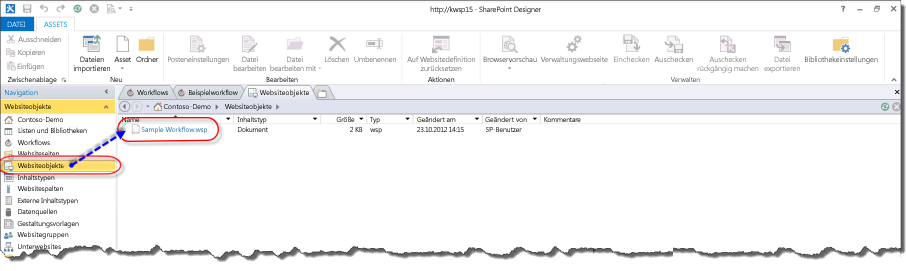

# Grundlegendes zum Packen und Bereitstellen von Workflows in SharePointUnderstanding how to package and deploy workflow in SharePoint
Erhalten Sie Informationen zum Packen und Bereitstellen eines Workflows in SharePoint mit SharePoint Designer 2013.Learn how to package and deploy a workflow in SharePoint with SharePoint Designer 2013.
## Übersicht über die Workflow-Packfunktionen von SharePoint Designer 2013Overview of the workflow packaging capabilities of SharePoint Designer 2013

SharePoint Designer 2013 bietet die Möglichkeit, einen Workflow als Vorlage zu speichern.SharePoint Designer 2013 provides the capability to save a workflow as a template. Das Speichern eines Workflows als Vorlage wird auch als Packen des Workflows bezeichnet.Saving a workflow as a template is also known as packaging the workflow. Nachdem der Workflow als Vorlage gespeichert wurde, kann er in die SharePoint-Umgebungen importiert und verwendet werden, ohne dass der Workflow neu entwickelt werden muss.After the workflow is saved as a template, it can then be imported into other SharePoint environments and used without the need to redevelop the workflow. Nicht alle Arten von Workflows können als Vorlage gespeichert werden.Not all workflow types can be saved as a template. Die folgende Matrix zeigt die Workflowtypen, die als Vorlage gespeichert werden können.The following matrix shows the workflow types that can be saved as a template. 
  
    
    

**Unterstützung nach Plattform für das Speichern eines Workflows als Vorlage****Support, by platform, for saving a workflow as a template**

|**Workflowtyp****Workflow type**|**SharePoint 2010 Workflow-Plattform****SharePoint 2010 Workflow platform**|**SharePoint-Workflowplattform****SharePoint Workflow platform**|
|:-----|:-----|:-----|
|ListenworkflowList Workflow    |NeinNo    |JaYes    |
|Website-WorkflowSite Workflow    |NeinNo    |JaYes    |
|Wieder verwendbaren WorkflowsReusable Workflow    |JaYes    |JaYes    |
   

> [!NOTE] 
> SharePoint enthält zwei verschiedene Workflowplattformen: die SharePoint 2010-Workflowplattform und die SharePoint-Workflowplattform.Note: SharePoint contains two different workflow platforms: the SharePoint 2010 Workflow platform and the SharePoint Workflow platform. Beide Plattformen stehen in SharePoint zur Verfügung.Both platforms are available in SharePoint. Weitere Informationen zu den beiden Workflows finden Sie unter [Erste Schritte mit SharePoint-Workflow.](http://msdn.microsoft.com/library/cc73be76-a329-449f-90ab-86822b1c2ee8.aspx)For more information about the two workflow, see  [Getting started with SharePoint workflow.](http://msdn.microsoft.com/library/cc73be76-a329-449f-90ab-86822b1c2ee8.aspx)
  
    
    

## Packen eines Workflows in SharePoint Designer 2013Packaging a workflow by using SharePoint Designer 2013

Der Prozess für das Verpacken eines Workflows umfasst das Speichern des Workflows in eine Vorlagendatei mit SharePoint Designer 2013. Ein Workflow-Paket liegt in Form einer Datei Web Solution Package (WSP) und hat die Dateierweiterung WSP. Wenn Sie ein Paket ein Workflows gehen Sie folgendermaßen vor.The process for packaging a workflow involves saving the workflow to a template file by using SharePoint Designer 2013. A workflow package is in the form of a Web Solution Package (WSP) file and has a .wsp extension. To package a workflow follow these steps. 
  
    
    

### Paket eines WorkflowsPackage a workflow

1. Öffnen Sie einen vorhandenen Workflow oder entwickeln Sie neuen Workflow in SharePoint Designer 2013.Open an existing workflow, or develop a new workflow, in SharePoint Designer 2013.
    
  
2. Klicken Sie auf der Registerkarte **Workfloweinstellungen** im Menüband auf die Schaltfläche **Speichern als Vorlage** im Abschnitt **Verwalten**, wie in der Abbildung dargestellt.On the **Workflow Settings** tab in the ribbon, click the **Save as Template** button in the **Manage** section as shown in the figure.
    
   **Abbildung: Speichern Sie Workflow als Vorlage.****Figure: Save workflow as template**

  

  
  

  

  
3. Ein Dialogfeld mit Informationen wird angezeigt, damit Sie wissen, dass die Vorlage in der Bibliothek **Websiteobjekte** gespeichert wurde.An informational dialog box appears to let you know the template has been saved to the **Site Assets** library.
    
  
4. Klicken Sie auf der Bibliothek Websiteobjekte, um die Workflowvorlage anzuzeigen, wie in der Abbildung dargestellt.Click the Site Assets library to view the workflow template as shown in the figure.
    
   **Abbildung: Eine Workflowvorlage in Websiteobjekten****Figure: A workflow template in Site Assets**

  

  
  

  

  

  
    
    

> **Tipp:** Eine Workflowvorlage speichert automatisch in der Bibliothek **Websiteobjekte** der Websitesammlung, in die sich der Workflow befindet.**Tip:** A workflow template automatically saves to the **Site Assets** library of the site collection in which the workflow resides.
  
    
    

## Bereitstellen eines Workflowpakets in SharePointDeploying a workflow package to SharePoint

Sie können einem Workflow-Paket bereitstellen, zu einer SharePoint-Farm oder Website, die unterscheidet sich von der Farm oder Website entwickelt wurde. In der Reihenfolge für einen Workflow muss Bereitstellung erfolgreich zwei Elemente werden erfüllt sein:You can deploy a workflow package to a SharePoint farm or site that is different from the farm or site in which it was developed. In order for a workflow deployment to be successful two items must be fulfilled:
  
    
    

- Alle Workflow Abhängigkeiten wie Listen, Bibliotheken, Spalten und Inhaltstypen müssen auf der neuen Website bereits vorhanden sein.All workflow dependencies such as lists, libraries, columns, and content types must already exist on the new site.
    
  
- Jede einzelne Abhängigkeit benötigen den genauen Namen der Quelle Abhängigkeit.Each dependency must have the exact name of the source dependency.
    
  
Wenn ein Workflow bereitgestellt wird und die genauen Abhängigkeiten nicht vorhanden sind, wird ein Fehler ausgegeben.If a workflow is deployed and the exact dependencies do not exist then the result will be an error.
  
    
    
Bevor Sie einen Workflow bereitstellen können, müssen Sie zuerst die Workflowvorlage aus der SharePoint-Quellfarm exportieren.Before you can deploy a workflow you must first export the workflow template from the source SharePoint farm. Verwenden Sie dieses Verfahren, um eine Workflowvorlage zu exportieren.To export a workflow template, follow this procedure.
  
    
    

### Exportieren einer WorkflowvorlageExport a workflow template

1. Öffnen Sie SharePoint Designer 2013, und navigieren Sie zu der Bibliothek Websiteobjekte, in die Vorlage gespeichert ist.Open SharePoint Designer 2013 and navigate to the Site Assets library where the template is located.
    
  
2. Wählen Sie die Workflowvorlage aus, den, die Sie durch Klicken auf exportieren möchten.Select the workflow template you want to export by clicking it.
    
  
3. Klicken Sie auf die Schaltfläche **Datei exportieren**, um die Vorlagendatei an Ihrem lokalen Computer oder einem Netzlaufwerk zu speichern, wie in der Abbildung dargestellt.Click the **Export File** button to save the template file to your local computer or a network drive, as shown in the figure.
    
   **Abbildung: Exportieren der Workflowvorlage aus SharePoint Designer 2013****Figure: Export workflow template from SharePoint Designer 2013**

  

  
  

  

  
Zum Bereitstellen von einem Workflow-Paket verwenden Sie dieses Verfahren.To deploy a workflow package follow this procedure.
  
    
    

### Bereitstellen einer WorkflowlösungDeploy a workflow solution

1. Öffnen Sie Internet Explorer und navigieren Sie zu der SharePoint-Websitesammlung, in der Sie den Workflow bereitstellen möchten.Open Internet Explorer and navigate to the SharePoint site collection where you want to deploy the workflow.
    
  
2. Klicken Sie auf **Websiteaktionen** und wählen Sie **Websiteeinstellungen**.Click **Site Actions** and select **Site Settings**.
    
  
3. Klicken Sie im Abschnitt **Web-Designer-Kataloge** auf **Lösungen**.In the **Web Design Galleries** section click **Solutions**.
    
    > [!NOTE] 
    > Sie müssen sich auf der Seite **Websiteeinstellungen** für die Websitesammlung befinden, um den Katalog **Lösungen** zu sehen.Note: You must be on the **Site Settings** page for the site collection in order to see the **Solutions** gallery. Wenn Sie sich auf der Seite **Websiteeinstellungen** für eine Unterwebsite befinden, ist der Katalog **Lösungen** nicht sichtbar ist.If you are on the **Site Settings** page for a sub-site then the **Solutions** gallery is not visible.

4. Klicken Sie auf die Schaltfläche **Lösung hochladen**, um die Lösung wie in der Abbildung gezeigt hochzuladen.Click the **Upload Solution** button to upload the solution as shown in the figure.
    
   **Abbildung: Lösungsschaltfläche hoch****Figure: Upload Solution button**

  

  
  

  

  
5. Aktivieren Sie die Lösung, indem Sie auf die Schaltfläche **Aktivieren**, wie in der Abbildung dargestellt.Activate the solution by clicking the **Activate** button as shown in the figure.
    
   **Abbildung: Dialogfeld Lösung und die Schaltfläche aktivieren****Figure: Activate Solution dialog and button**

  

  
  

  

  
Nachdem eine workflowlösung für eine Websitesammlung aktiviert wurde, kann es als ein Feature für alle untergeordneten Websites verfügbar. Verwenden Sie dieses Verfahren, um das Workflowfeature für eine Unterwebsite zu aktivieren.After a workflow solution has been activated for a site collection, it is available as a feature for all sub-sites. To activate the workflow feature for a sub-site, follow this procedure.
  
    
    

### Aktivieren des WorkflowfeaturesActivate the workflow feature

1. Öffnen Sie die **Websiteeinstellungen** auf der Website, in dem Sie das Workflowfeature aktivieren möchten.Open **Site Settings** on the site where you wish to activate the workflow feature.
    
  
2. Klicken Sie in der Gruppe **Websiteaktionen** auf **Websitefeatures verwalten**.In the **Site Actions** group, click **Manage site features**.
    
  
3. Klicken Sie neben dem Workflowfeature auf **Aktivieren**, wie in der Abbildung dargestellt.Click **Activate** next to the workflow feature as shown in the figure.
    
  

**Abbildung: Aktivieren Sie Workflowfeatures für Website****Figure: Activate workflow feature for site**

  
    
    

  
    
    

  
    
    

  
    
    

  
    
    

## Siehe auchSee also

-  [Workflows in SharePoint ](http://technet.microsoft.com/de-DE/sharepoint/jj556245.aspx)[Workflow in SharePoint ](http://technet.microsoft.com/de-DE/sharepoint/jj556245.aspx)
    
  
-  [Neuerungen bei SharePoint-Workflows](http://msdn.microsoft.com/library/6ab8a28b-fa2f-4530-8b55-a7f663bf15ea.aspx)[What's new in workflow in SharePoint](http://msdn.microsoft.com/library/6ab8a28b-fa2f-4530-8b55-a7f663bf15ea.aspx)
    
  
-  [Erste Schritte mit SharePoint-Workflows](http://msdn.microsoft.com/library/cc73be76-a329-449f-90ab-86822b1c2ee8.aspx)[Getting started with SharePoint workflow](http://msdn.microsoft.com/library/cc73be76-a329-449f-90ab-86822b1c2ee8.aspx)
    
  
-  [Workflowentwicklung in SharePoint Designer und VisioWorkflow development in SharePoint Designer and Visio](workflow-development-in-sharepoint-designer-and-visio.md)
    
  
-  [Kurzübersicht zu Workflowaktionen (SharePoint-Workflowplattform)Workflow actions quick reference (SharePoint Workflow platform)](workflow-actions-quick-reference-sharepoint-workflow-platform.md)
    
  
-  [Blogartikel des SharePoint Designer-Teams: Verpackungs- und Bereitstellungsszenario für Workflows](http://blogs.msdn.com/b/sharepointdesigner/archive/2012/08/30/packaging-list-site-and-reusable-workflow-and-how-to-deploy-the-package.aspx)[Blog article from the SharePoint Designer team: Workflow package and deploy scenario](http://blogs.msdn.com/b/sharepointdesigner/archive/2012/08/30/packaging-list-site-and-reusable-workflow-and-how-to-deploy-the-package.aspx)
    
  

