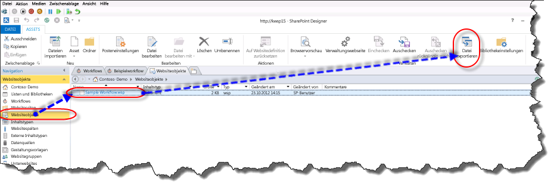
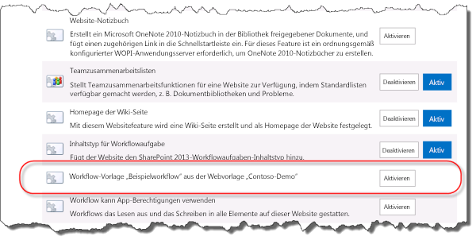

# Grundlegendes zum Packen und Bereitstellen von Workflows in SharePoint
Erhalten Sie Informationen zum Packen und Bereitstellen eines Workflows in SharePoint mit SharePoint Designer 2013.
## Übersicht über die Workflow-Packfunktionen von SharePoint Designer 2013

SharePoint Designer 2013 bietet die Möglichkeit, einen Workflow als Vorlage zu speichern. Das Speichern eines Workflows als Vorlage wird auch als Packen des Workflows bezeichnet. Nachdem der Workflow als Vorlage gespeichert wurde, kann er in die SharePoint-Umgebungen importiert und verwendet werden, ohne dass der Workflow neu entwickelt werden muss. Nicht alle Arten von Workflows können als Vorlage gespeichert werden. Die folgende Matrix zeigt die Workflowtypen, die als Vorlage gespeichert werden können. 
  
    
    

**Unterstützung nach Plattform für das Speichern eines Workflows als Vorlage**

|**Workflowtyp**|**SharePoint 2010 Workflow-Plattform**|**SharePoint-Workflowplattform**|
|:-----|:-----|:-----|
|Listenworkflow    |Nein    |Ja    |
|Website-Workflow    |Nein    |Ja    |
|Wieder verwendbaren Workflows    |Ja    |Ja    |
   

> [!NOTE] 
> SharePoint enthält zwei verschiedene Workflowplattformen: die SharePoint 2010-Workflowplattform und die SharePoint-Workflowplattform. Beide Plattformen stehen in SharePoint zur Verfügung. Weitere Informationen zu den beiden Workflows finden Sie unter [Erste Schritte mit SharePoint-Workflow.]((http://msdn.microsoft.com/library/cc73be76-a329-449f-90ab-86822b1c2ee8.aspx))
  
    
    

## Packen eines Workflows in SharePoint Designer 2013

Der Prozess für das Verpacken eines Workflows umfasst das Speichern des Workflows in eine Vorlagendatei mit SharePoint Designer 2013. Ein Workflow-Paket liegt in Form einer Datei Web Solution Package (WSP) und hat die Dateierweiterung WSP. Wenn Sie ein Paket ein Workflows gehen Sie folgendermaßen vor. 
  
    
    

### Paket eines Workflows

1. Öffnen Sie einen vorhandenen Workflow oder entwickeln Sie neuen Workflow in SharePoint Designer 2013.
    
  
2. Klicken Sie auf der Registerkarte **Workfloweinstellungen** im Menüband auf die Schaltfläche **Speichern als Vorlage** im Abschnitt **Verwalten**, wie in der Abbildung dargestellt.
    
   **Abbildung: Speichern Sie Workflow als Vorlage.**

  

  
  

  

  
3. Ein Dialogfeld mit Informationen wird angezeigt, damit Sie wissen, dass die Vorlage in der Bibliothek **Websiteobjekte** gespeichert wurde.
    
  
4. Klicken Sie auf der Bibliothek Websiteobjekte, um die Workflowvorlage anzuzeigen, wie in der Abbildung dargestellt.
    
   **Abbildung: Eine Workflowvorlage in Websiteobjekten**

  

  
  

  

  

  
    
    

> **Tipp:** Eine Workflowvorlage speichert automatisch in der Bibliothek **Websiteobjekte** der Websitesammlung, in die sich der Workflow befindet.
  
    
    

## Bereitstellen eines Workflowpakets in SharePoint

Sie können einem Workflow-Paket bereitstellen, zu einer SharePoint-Farm oder Website, die unterscheidet sich von der Farm oder Website entwickelt wurde. In der Reihenfolge für einen Workflow muss Bereitstellung erfolgreich zwei Elemente werden erfüllt sein:
  
    
    

- Alle Workflow Abhängigkeiten wie Listen, Bibliotheken, Spalten und Inhaltstypen müssen auf der neuen Website bereits vorhanden sein.
    
  
- Jede einzelne Abhängigkeit benötigen den genauen Namen der Quelle Abhängigkeit.
    
  
Wenn ein Workflow bereitgestellt wird und die genauen Abhängigkeiten nicht vorhanden sind, wird ein Fehler ausgegeben.
  
    
    
Bevor Sie einen Workflow bereitstellen können, müssen Sie zuerst die Workflowvorlage aus der SharePoint-Quellfarm exportieren. Verwenden Sie dieses Verfahren, um eine Workflowvorlage zu exportieren.
  
    
    

### Exportieren einer Workflowvorlage

1. Öffnen Sie SharePoint Designer 2013, und navigieren Sie zu der Bibliothek Websiteobjekte, in die Vorlage gespeichert ist.
    
  
2. Wählen Sie die Workflowvorlage aus, den, die Sie durch Klicken auf exportieren möchten.
    
  
3. Klicken Sie auf die Schaltfläche **Datei exportieren**, um die Vorlagendatei an Ihrem lokalen Computer oder einem Netzlaufwerk zu speichern, wie in der Abbildung dargestellt.
    
   **Abbildung: Exportieren der Workflowvorlage aus SharePoint Designer 2013**

  

  
  

  

  
Zum Bereitstellen von einem Workflow-Paket verwenden Sie dieses Verfahren.
  
    
    

### Bereitstellen einer Workflowlösung

1. Öffnen Sie Internet Explorer und navigieren Sie zu der SharePoint-Websitesammlung, in der Sie den Workflow bereitstellen möchten.
    
  
2. Klicken Sie auf **Websiteaktionen** und wählen Sie **Websiteeinstellungen**.
    
  
3. Klicken Sie im Abschnitt **Web-Designer-Kataloge** auf **Lösungen**.
    
    > [!NOTE] 
    > Sie müssen sich auf der Seite **Websiteeinstellungen** für die Websitesammlung befinden, um den Katalog **Lösungen** zu sehen. Wenn Sie sich auf der Seite **Websiteeinstellungen** für eine Unterwebsite befinden, ist der Katalog **Lösungen** nicht sichtbar ist.

4. Klicken Sie auf die Schaltfläche **Lösung hochladen**, um die Lösung wie in der Abbildung gezeigt hochzuladen.
    
   **Abbildung: Lösungsschaltfläche hoch**

  

  
  

  

  
5. Aktivieren Sie die Lösung, indem Sie auf die Schaltfläche **Aktivieren**, wie in der Abbildung dargestellt.
    
   **Abbildung: Dialogfeld Lösung und die Schaltfläche aktivieren**

  

  
  

  

  
Nachdem eine workflowlösung für eine Websitesammlung aktiviert wurde, kann es als ein Feature für alle untergeordneten Websites verfügbar. Verwenden Sie dieses Verfahren, um das Workflowfeature für eine Unterwebsite zu aktivieren.
  
    
    

### Aktivieren des Workflowfeatures

1. Öffnen Sie die **Websiteeinstellungen** auf der Website, in dem Sie das Workflowfeature aktivieren möchten.
    
  
2. Klicken Sie in der Gruppe **Websiteaktionen** auf **Websitefeatures verwalten**.
    
  
3. Klicken Sie neben dem Workflowfeature auf **Aktivieren**, wie in der Abbildung dargestellt.
    
  

**Abbildung: Aktivieren Sie Workflowfeatures für Website**

  
    
    

  
    
    

  
    
    

  
    
    

  
    
    

## Siehe auch

-  [Workflows in SharePoint ]((http://technet.microsoft.com/de-DE/sharepoint/jj556245.aspx))
    
  
-  [Neuerungen bei SharePoint-Workflows]((http://msdn.microsoft.com/library/6ab8a28b-fa2f-4530-8b55-a7f663bf15ea.aspx))
    
  
-  [Erste Schritte mit SharePoint-Workflows]((http://msdn.microsoft.com/library/cc73be76-a329-449f-90ab-86822b1c2ee8.aspx))
    
  
-  [Workflowentwicklung in SharePoint Designer und Visio](workflow-development-in-sharepoint-designer-and-visio.md)
    
  
-  [Kurzübersicht zu Workflowaktionen (SharePoint-Workflowplattform)](workflow-actions-quick-reference-sharepoint-workflow-platform.md)
    
  
-  [Blogartikel des SharePoint Designer-Teams: Verpackungs- und Bereitstellungsszenario für Workflows]((http://blogs.msdn.com/b/sharepointdesigner/archive/2012/08/30/packaging-list-site-and-reusable-workflow-and-how-to-deploy-the-package.aspx))
    
  

