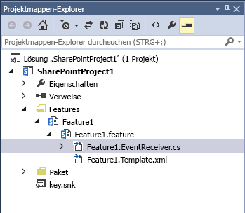

# <a name="use-feature-upgrade-to-apply-new-sharepoint-master-pages-when-upgrading-from-sharepoint-2010"></a><span data-ttu-id="6d2c1-102">Verwenden eines Featureupgrades für das Anwenden neue SharePoint-Gestaltungsvorlagen bei einem Upgrade von SharePoint 2010</span><span class="sxs-lookup"><span data-stu-id="6d2c1-102">Use Feature upgrade to apply new SharePoint master pages when upgrading from SharePoint 2010</span></span>
<span data-ttu-id="6d2c1-p101">Learn how to reset a custom master page during the  `FeatureUpgrading` event when you're upgrading a SharePoint site from the 2010 to the 2013 compatibility mode. When you upgrade your SharePoint 2010 customizations to SharePoint, any references to custom master pages you've created switch back to the default.master page. If you've deployed a feature that contains one or more custom master pages to an upgraded SharePoint site collection that is running in SharePoint 2010 compatibility mode you'll need to reset your SharePoint master pages when you upgrade to the 2013 compatibility mode. This topic explains how to use a feature receiver to make sure that your SharePoint custom master pages get reset when you upgrade from SharePoint 2010.</span><span class="sxs-lookup"><span data-stu-id="6d2c1-p101">Learn how to reset a custom master page during the  `FeatureUpgrading` event when you're upgrading a SharePoint site from the 2010 to the 2013 compatibility mode. When you upgrade your SharePoint 2010 customizations to SharePoint, any references to custom master pages you've created switch back to the default.master page. If you've deployed a feature that contains one or more custom master pages to an upgraded SharePoint site collection that is running in SharePoint 2010 compatibility mode you'll need to reset your SharePoint master pages when you upgrade to the 2013 compatibility mode. This topic explains how to use a feature receiver to make sure that your SharePoint custom master pages get reset when you upgrade from SharePoint 2010.</span></span> 
  
    
    


## <a name="use-custom-upgrade-code-to-reset-a-master-page"></a><span data-ttu-id="6d2c1-107">Zurücksetzen von Masterseiten mithilfe von benutzerdefiniertem Upgradecode</span><span class="sxs-lookup"><span data-stu-id="6d2c1-107">Use custom upgrade code to reset a master page</span></span>

<span data-ttu-id="6d2c1-108">Wie wir bereits in der Anleitung unter [Bereitstellen von benutzerdefinierten Features in aktualisierten Websitesammlungen in SharePoint](http://technet.microsoft.com/de-DE/library/dn673579%28v=office.15%29.aspx) erläutert haben, werden die Websitesammlungen in Ihrer Farm nach einem Upgrade von SharePoint 2010 auf SharePoint standardmäßig im SharePoint 2010-Kompatibilitätsmodus ausgeführt.</span><span class="sxs-lookup"><span data-stu-id="6d2c1-108">As the guidance in  [Deploy custom features to upgraded site collections in SharePoint](http://technet.microsoft.com/de-DE/library/dn673579%28v=office.15%29.aspx) explains, when you upgrade from SharePoint 2010 to SharePoint, the site collections in your farm will run in SharePoint 2010 compatibility mode by default.</span></span> <span data-ttu-id="6d2c1-109">Je nachdem, welche Upgradestrategie Sie für Ihre benutzerdefinierten Features gewählt haben, haben Sie die Features entweder in einem oder in zwei Lösungspaketen bereitgestellt:</span><span class="sxs-lookup"><span data-stu-id="6d2c1-109">Depending on the approach to upgrading your custom features that you've taken, you'll have deployed any given feature by using either one or two solution packages:</span></span>
  
    
    

- <span data-ttu-id="6d2c1-110">A single solution package that can be deployed to both the "14" and the "15" compatibility levels, either because of custom logic for the "15" compatibility level, or because the feature works without any problems in both the "14" and the "15" compatibility levels.</span><span class="sxs-lookup"><span data-stu-id="6d2c1-110">A single solution package that can be deployed to both the "14" and the "15" compatibility levels, either because of custom logic for the "15" compatibility level, or because the feature works without any problems in both the "14" and the "15" compatibility levels.</span></span>
    
  
- <span data-ttu-id="6d2c1-p103">Two solution packages that contain different versions of the same feature. This approach is called "feature masking."</span><span class="sxs-lookup"><span data-stu-id="6d2c1-p103">Two solution packages that contain different versions of the same feature. This approach is called "feature masking."</span></span>
    
  
<span data-ttu-id="6d2c1-p104">In either case, during upgrade any custom master pages you've created will revert to the default.master page. If you don't reset these pages with logic inside your feature, you'll need to reactivate the feature (or the "15" version of the feature) to reset the master pages to your custom versions. You can reset your 2013 custom master pages by using a feature receiver that is tied to the  `FeatureUpgrading` event.</span><span class="sxs-lookup"><span data-stu-id="6d2c1-p104">In either case, during upgrade any custom master pages you've created will revert to the default.master page. If you don't reset these pages with logic inside your feature, you'll need to reactivate the feature (or the "15" version of the feature) to reset the master pages to your custom versions. You can reset your 2013 custom master pages by using a feature receiver that is tied to the  `FeatureUpgrading` event.</span></span>
  
    
    

### <a name="to-reset-a-2013-custom-master-page-with-a-feature-receiver"></a><span data-ttu-id="6d2c1-116">To reset a 2013 custom master page with a feature receiver</span><span class="sxs-lookup"><span data-stu-id="6d2c1-116">To reset a 2013 custom master page with a feature receiver</span></span>


1. <span data-ttu-id="6d2c1-p105">Open your solution in Visual Studio. Find your feature under the **Features** node in Solution Explorer, and open the feature.xml file for your feature.</span><span class="sxs-lookup"><span data-stu-id="6d2c1-p105">Open your solution in Visual Studio. Find your feature under the **Features** node in Solution Explorer, and open the feature.xml file for your feature.</span></span>
    
  
2. <span data-ttu-id="6d2c1-p106">Add an  `<UpgradeActions>` section to the feature.xml file and make sure that the action applies only to the version of the feature that is currently in use for the "14" compatibility level. This section specifies the name of an action to perform when the feature is upgraded. The following example specifies an upgrade when version 1.0.0.0 of the feature is in use. In the example, the action `UpgradeFeature` is passed to the implementation of the **FeatureUpgrading(SPFeatureReceiverProperties, String, IDictionary<String, String>)** method that you'll define later after you've added a feature receiver.</span><span class="sxs-lookup"><span data-stu-id="6d2c1-p106">Add an  `<UpgradeActions>` section to the feature.xml file and make sure that the action applies only to the version of the feature that is currently in use for the "14" compatibility level. This section specifies the name of an action to perform when the feature is upgraded. The following example specifies an upgrade when version 1.0.0.0 of the feature is in use. In the example, the action `UpgradeFeature` is passed to the implementation of the **FeatureUpgrading(SPFeatureReceiverProperties, String, IDictionary<String, String>)** method that you'll define later after you've added a feature receiver.</span></span>
    
```XML
  
<UpgradeActions
    ReceiverAssembly="MyFeatureReceiver, Version=2.0.0.0, Culture=neutral, PublicKeyToken=<token>"
    ReceiverClass="MyFeature.MyFeatureEventReceiver">
  <VersionRange BeginVersion="1.0.0.0" EndVersion="1.0.0.0">
   <CustomUpgradeAction Name="UpgradeFeature"/>
<ApplyElementManifests>
<ElementManifest Location="MasterPages\\UpgradeElements.xml" />
</ApplyElementManifests>
  </VersionRange>
</UpgradeActions>

```


    You place the master page or pages in the **MasterPages** folder of the project, and any metadata related to the master page(s) in the **UpgradeElements.xml** file.
    
  
3. <span data-ttu-id="6d2c1-p107">Add a  `<Properties>` section to the feature.xml file. This section contains key-value pairs that specify the 2013 custom master page or pages that you want to set when the site is upgraded. The following example specifies the value of the `My15MasterPage` key that you'll use in the feature receiver.</span><span class="sxs-lookup"><span data-stu-id="6d2c1-p107">Add a  `<Properties>` section to the feature.xml file. This section contains key-value pairs that specify the 2013 custom master page or pages that you want to set when the site is upgraded. The following example specifies the value of the `My15MasterPage` key that you'll use in the feature receiver.</span></span>
    
```
  
<Properties>
  <Property Key="My15MasterPage" Value="_catalogs/masterpage/My15MasterPage.master" />
</Properties>

```

4. <span data-ttu-id="6d2c1-126">In Solution Explorer, under the **Features** node, right click the name of your feature, and then choose **Add Event Receiver** to add an event receiver to the feature.</span><span class="sxs-lookup"><span data-stu-id="6d2c1-126">In Solution Explorer, under the **Features** node, right click the name of your feature, and then choose **Add Event Receiver** to add an event receiver to the feature.</span></span>
    
    <span data-ttu-id="6d2c1-p108">This adds a code file under your feature in Solution Explorer. Figure 1 shows where a sample Feature1.EventReceiver.cs file appears under the feature in the **Features** folder.</span><span class="sxs-lookup"><span data-stu-id="6d2c1-p108">This adds a code file under your feature in Solution Explorer. Figure 1 shows where a sample Feature1.EventReceiver.cs file appears under the feature in the **Features** folder.</span></span>
    

   <span data-ttu-id="6d2c1-129">**Figure 1. The code file for an event receiver in a feature**</span><span class="sxs-lookup"><span data-stu-id="6d2c1-129">**Figure 1. The code file for an event receiver in a feature**</span></span>

  

  
  

    <span data-ttu-id="6d2c1-p109">This file contains a commented and empty  `FeatureUpgrading` method. You'll use this method in the following step.</span><span class="sxs-lookup"><span data-stu-id="6d2c1-p109">This file contains a commented and empty  `FeatureUpgrading` method. You'll use this method in the following step.</span></span>
    
  
5. <span data-ttu-id="6d2c1-p110">Open the code file and uncomment the FeatureUpgrading method, which overrides the **FeatureUpgrading(SPFeatureReceiverProperties, String, IDictionary<String, String>)** method. The following example applies the `My15MasterPage` file that was specified earlier in the feature.xml file.</span><span class="sxs-lookup"><span data-stu-id="6d2c1-p110">Open the code file and uncomment the FeatureUpgrading method, which overrides the **FeatureUpgrading(SPFeatureReceiverProperties, String, IDictionary<String, String>)** method. The following example applies the `My15MasterPage` file that was specified earlier in the feature.xml file.</span></span>
    
```cs
  
public override void FeatureUpgrading(SPFeatureReceiverProperties properties, string upgradeActionName, System.Collections.Generic.IDictionary<string, string> parameters)
        {
 
            try
            {
            if (upgradeActionName != "UpgradeFeature")
                return;
                //Set the master page to a value stored as a property in the feature.xml file
                string masterPage = properties.Definition.Properties[My15MasterPage].Value;
                string baseURL;
                var currentWeb = properties.Feature.Parent as SPWeb;
 
                //Checks to see that the API returns a string that ends in a "/" and if not adds it.
                if (currentWeb.ServerRelativeUrl.Substring(currentWeb.ServerRelativeUrl.Length - 1) == "/")
                {
                    baseURL = currentWeb.ServerRelativeUrl;
                }
                else
                {
                    baseURL = currentWeb.ServerRelativeUrl + "/";
                }
 
                masterPage = baseURL + masterPage;
                currentWeb.CustomMasterUrl = masterPage;
 
                currentWeb.Properties.Update();
                currentWeb.Update();
            }
            }
 
            catch (Exception ex)
            {
             //Handle exception
            }
        }

```

<span data-ttu-id="6d2c1-p111">Once you're done with the upgrade, you'll want to think about the future and long-term maintenance of your feature. Refer to  [Application Lifecycle Management in SharePoint 2010](http://msdn.microsoft.com/de-DE/library/office/gg604045%28v=office.14%29.aspx) for guidance on maintaining full-trust code. Although this article refers to SharePoint 2010 specifically, it applies equally well to full-trust code in SharePoint. If you aren't familiar with feature versioning and upgrade actions, refer to the [Models for Solution Lifecycle Management](http://msdn.microsoft.com/de-DE/library/office/gg604045%28v=office.14%29.aspx#sectionSection7) section of this article. You should also look at [Best Practices for Using Feature Versions](http://msdn.microsoft.com/de-DE/library/office/ee535064%28v=office.14%29.aspx).</span><span class="sxs-lookup"><span data-stu-id="6d2c1-p111">Once you're done with the upgrade, you'll want to think about the future and long-term maintenance of your feature. Refer to  [Application Lifecycle Management in SharePoint 2010](http://msdn.microsoft.com/de-DE/library/office/gg604045%28v=office.14%29.aspx) for guidance on maintaining full-trust code. Although this article refers to SharePoint 2010 specifically, it applies equally well to full-trust code in SharePoint. If you aren't familiar with feature versioning and upgrade actions, refer to the [Models for Solution Lifecycle Management](http://msdn.microsoft.com/de-DE/library/office/gg604045%28v=office.14%29.aspx#sectionSection7) section of this article. You should also look at [Best Practices for Using Feature Versions](http://msdn.microsoft.com/de-DE/library/office/ee535064%28v=office.14%29.aspx).</span></span>
  
    
    

## <a name="see-also"></a><span data-ttu-id="6d2c1-140">Siehe auch</span><span class="sxs-lookup"><span data-stu-id="6d2c1-140">See also</span></span>
<span data-ttu-id="6d2c1-141"><a name="bk_addresources"> </a></span><span class="sxs-lookup"><span data-stu-id="6d2c1-141"><a name="bk_addresources"> </a></span></span>


-  [<span data-ttu-id="6d2c1-142">Bereitstellen von benutzerdefinierten Features in aktualisierten Websitesammlungen in SharePoint</span><span class="sxs-lookup"><span data-stu-id="6d2c1-142">Deploy custom features to upgraded site collections in SharePoint</span></span>](http://technet.microsoft.com/de-DE/library/dn673579%28v=office.15%29.aspx)
    
  
-  [<span data-ttu-id="6d2c1-143">Aktualisieren von Anpassungen für SharePoint-Websites</span><span class="sxs-lookup"><span data-stu-id="6d2c1-143">Upgrade site customizations for SharePoint</span></span>](upgrade-site-customizations-for-sharepoint.md)
    
  
-  [<span data-ttu-id="6d2c1-144">Upgrade to SharePoint</span><span class="sxs-lookup"><span data-stu-id="6d2c1-144">Upgrade to SharePoint</span></span>](http://technet.microsoft.com/de-DE/library/cc303420%28v=office.15%29.aspx)
    
  
-  [<span data-ttu-id="6d2c1-145">SharePoint and SharePoint Online solution pack for branding and site provisioning</span><span class="sxs-lookup"><span data-stu-id="6d2c1-145">SharePoint and SharePoint Online solution pack for branding and site provisioning</span></span>](http://www.microsoft.com/en-us/download/details.aspx?id=42030)
    
  
-  [<span data-ttu-id="6d2c1-146">Install and manage solutions for SharePoint</span><span class="sxs-lookup"><span data-stu-id="6d2c1-146">Install and manage solutions for SharePoint</span></span>](http://technet.microsoft.com/de-DE/library/cc263205%28v=office.15%29.aspx)
    
  

