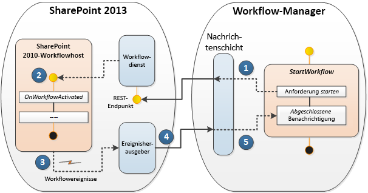

# Verwenden von Workflow-Interop für SharePoint
Enthält eine Erörterung der Verwendung von SharePoint-Workflow Interop im Workflow-Designer Visual Studio 2012. Workflow-Interop ermöglicht Ihnen, einen Workflow SharePoint 2010 innerhalb eines Workflows SharePoint von aufgerufen werden soll. Dies ist ein wichtiges Feature, mit dem Sie die vorhandenen Workflowfeatures wiederverwenden und zum Aufrufen von für Workflow-Aktivitäten, die nicht in SharePoint integriert werden.

  
    
    

> **Wichtig:** Informationen zum Verwenden von SharePoint-Workflow-Interop-Funktionen in SharePoint Designer 2013, finden Sie unter  [Grundlegendes zur Koordination Aktionen in SharePoint Designer 2013](understanding-coordination-actions-in-sharepoint-designer.md). 
  
    
    

## SharePoint-Workflowinteroperabilität

Es folgt das Problem. Sie haben legacy SharePoint 2010 Workflows, die Sie auf Ihrer SharePoint Plattform wiederverwenden möchten. Oder, schlechter, Sie neue SharePoint Workflows erstellen, und Sie benötigen, Aktivitäten aufgerufen werden soll, die nur in der SharePoint 2010-Plattform verfügbar sind. Und Sie nicht wissen, was zu tun. Tatsächlich, die Lösung ist einfach: Verwenden von SharePoint-Workflow Interop.
  
    
    
SharePoint-workflowinteroperabilität kann SharePoint 2010 Workflows (basierend auf Windows Workflow Foundation 3) reibungslos das Workflowmodul SharePoint entwickelt dem Windows Workflow Foundation 4 basiert. Während die neue Windows Workflow Foundation 4 Ausführung Engine in Workflow-Manager,, der als externer Dienst ausgeführt wird gehostet wird, enthält SharePoint noch den Vorversionen SharePoint Workflow-Host die verwendet wird, um SharePoint 2010 Workflows zu verarbeiten. SharePoint-workflowinteroperabilität handelt die beiden ausführungsumgebungen, wie in Abbildung 1 dargestellt.
  
    
    

**Abbildung 1. SharePoint-workflowinteroperabilität in Aktion**

  
    
    

  
    
    

  
    
    
Lassen Sie uns durchgehen des Prozess, der in Abbildung 1 dargestellt. Verwenden Sie die Buchstaben auf Punkt der Hervorhebung in der Abbildung verweisen:
  
    
    

  
    
    
> ( **A** ) eine Instanz eines Workflows SharePoint gestartet in dann Windows Workflow Foundation 4-basierte Workflow-Manager. Beachten Sie, dass der Workflow-Manager nicht in SharePoint ist, aber stattdessen als externer Dienst ausgeführt wird.
    
  

  
    
    
> ( **B** ) erreichen Sie einen Punkt im SharePoint Workflow - Schrittnummer 3 im Workflow-Manager -, an den Sie einen Workflow SharePoint 2010 aufrufen möchten. In der Workflow-Designer Visual Studio 2012 führen Sie dies durch die Implementierung der Aktivitätsfeeds **Start 2010 WF** wie in Abbildung 2 dargestellt.
    
   **Abbildung 2. Stufenkachel zum Starten eines Workflows für SharePoint 2010.**

  

  
  

    
    
    From the perspective of the SharePoint object model, this is accomplished using the  [StartWorkflow](https://msdn.microsoft.com/library/Microsoft.SharePoint.WorkflowServices.WorkflowInteropService.StartWorkflow.aspx) method on the [WorkflowInteropService](https://msdn.microsoft.com/library/Microsoft.SharePoint.WorkflowServices.WorkflowInteropService.aspx) class.
    
  

  
    
    
> ( **C** ) beginnt zu diesem Zeitpunkt der SharePoint 2010 Workflow in der Windows Workflow Foundation 3.5 Workflow-Host innerhalb von SharePoint ausgeführt. Aber ein wichtiger Aspekt angezeigt wird. In einigen Szenarien sollten Sie den Workflow 2013 warten, bis des 2010-Workflows, bis Sie abgeschlossen (und möglicherweise einige Daten zurückgeben) vor dem Ausführen den 2013-Workflow fortfahren. In anderen Szenarien Dies kann nicht erforderlich sein, und beide Workflows unabhängig und parallel ausgeführt.
    
    To control this behavior, the  [WorkflowInterop](https://msdn.microsoft.com/library/Microsoft.SharePoint.WorkflowServices.Activities.WorkflowInterop.aspx) class, which controls executing workflows in the Windows Workflow Foundation 3.5 workflow host, provides a [Wait](https://msdn.microsoft.com/library/Microsoft.SharePoint.WorkflowServices.Activities.WorkflowInterop.Wait.aspx) property. Setting this Boolean property to " **Yes**" (in the designer dialog box) or to **true** in the on the **Wait** property, causes the 2013 workflow to pause until the 2010 finished executing and returns a **completed** message.
    
    
    

   **Abbildung 3. Starten eines Dialogfelds für Workfloweigenschaften**

  

  
  

  

  

  
    
    
> ( **D** ) die praktische Auswirkung der Auswahl von **true** oder **false** auf die **Wait** -Eigenschaft ( **Yes** oder **No** im Dialogfeld Eigenschaften) wird hier dargestellt. Wenn **Wait** **true**ist, klicken Sie dann der 2010-Workflow übergibt ein  [WorkflowCompleted](https://msdn.microsoft.com/library/Microsoft.SharePoint.WorkflowServices.WorkflowInteropEventReceiver.WorkflowCompleted.aspx) -Ereignis (und optional gibt Daten als Eigenschaft [DynamicValue](http://msdn.microsoft.com/library/2af7983b-8357-4e0f-9ba9-dfdeed05a8a7.aspx) ). Weitere Informationen über dynamische Werte finden Sie unter [Understanding Dynamic Value](http://msdn.microsoft.com/library/c5702628-9625-4d19-95c5-13923e91fea1.aspx).
    
    Of course, if **Wait** is set to **false**, then your 2010 workflow executes, then terminates normally.
    
  

  
    
    
> ( **E** ) dieser Schritt ist nur relevant, wenn der Aufruf des Workflows 2010 **Wait=true**angegeben. In diesem Fall der 2013-Workflow **WorkflowCompleted** -Ereignis empfangen und startet die Ausführung des Workflows 2013 an der Stelle, die sie unterbrochen.
    
  

  
    
    
> ( **F** ) 2013-Workflow dann nach abgeschlossener Ausführung und normal beendet. Wenn **Wait=false**, klicken Sie dann den 2013-Workflow ausgeführt wird und unabhängig von der 2010-Workflow wird beendet. 
    
  

## Workflow-Interop-design

SharePoint-workflowinteroperabilität ist eine messaging-Framework, das eine Instanz 1: 1-Zuordnung zwischen WF-3 und 4 WF-Workflow-Aktivitäten unterstützt. WF 3 und 4 WF interagieren über den Nachrichtenaustausch von, die durch eine Reihe von WF 4 Aktivitäten auf  [WorkflowInteropService](https://msdn.microsoft.com/library/Microsoft.SharePoint.WorkflowServices.WorkflowInteropService.aspx) eingebunden sind.
  
    
    
Zur Unterstützung der Workflow-Interop bietet die Workflowentwurfsoberfläche in SharePoint Designer Zugriff auf eine neue Workflowaktivität **Start 2010 WF**, ist ein Wrapper für die  [StartWorkflow](https://msdn.microsoft.com/library/Microsoft.SharePoint.WorkflowServices.WorkflowInteropService.StartWorkflow.aspx) -Methode. Dadurch können Sie einen Listenworkflow oder Website-Workflow starten.
  
    
    
Die Aktivität ist tatsächlich eine Folge von Nachrichten, die stattfinden zwischen den Workflow-Manager und SharePoint 2010 Workflow-Host, der in SharePoint ausgeführt wird. Diese beiden sind von messaging-Ebene vermittelt, wie in Abbildung 4 dargestellt. Die Sequenz beginnt im Workflow-Manager SharePoint mit einem Aufruf der Methode **StartWorkflow**. Die Meldung "Start" wechselt zu den Workflowdienst innerhalb von SharePoint, wobei wiederum er den Workflow im Workflow-Host SharePoint 2010 gestartet. Nach Abschluss der Ausführung des Workflows 2010 ist ein Ereignis ausgelöst, die eine "Abgeschlossene" Nachricht über Herausgeber des Ereignisses zurück an den 2013-Workflow-Manager sendet.
  
    
    

**Abbildung 4. SharePoint Workflow Interop-messaging-Protokoll**

  
    
    

  
    
    

  
    
    

  
    
    

  
    
    

## Zusätzliche Ressourcen

-  [Erste Schritte mit Workflows in SharePoint](get-started-with-workflows-in-sharepoint.md)
    
  
-  [Grundlegendes zu SharePoint-Workflows](sharepoint-workflow-fundamentals.md)
    
  
-  [Grundlegendes zur Koordination Aktionen in SharePoint Designer 2013](understanding-coordination-actions-in-sharepoint-designer.md)
    
  
-  [WorkflowInteropService](https://msdn.microsoft.com/library/Microsoft.SharePoint.WorkflowServices.WorkflowInteropService.aspx)
    
  
-  [WorkflowInteropEventReceiver](https://msdn.microsoft.com/library/Microsoft.SharePoint.WorkflowServices.WorkflowInteropEventReceiver.aspx)
    
  

  
    
    

