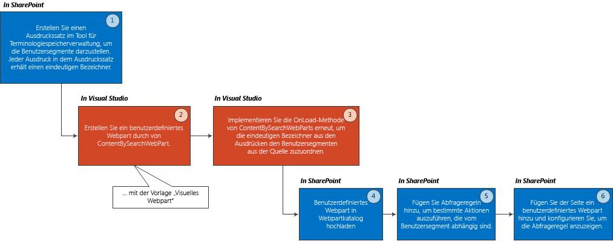

# <a name="user-segmentation-in-sharepoint"></a><span data-ttu-id="94c8f-102">Benutzersegmentierung in SharePoint</span><span class="sxs-lookup"><span data-stu-id="94c8f-102">User segmentation in SharePoint</span></span>
<span data-ttu-id="94c8f-103">Zeigen Sie maßgeschneiderte Inhalte für von Ihnen definierte Benutzersegmente an – z. B. basierend auf Gebietsschema, Interessen, Geschlecht oder Empfehlungslinks –, indem Sie eine Kombination aus Ausdruckssätzen, dem Inhaltssuche-Webpart und Abfrageregeln in SharePoint verwenden.</span><span class="sxs-lookup"><span data-stu-id="94c8f-103">Display content you tailor for user segments you define—for example, based on locale, interests, gender, or referral links—by using a combination of term sets, the Content Search Web Part, and query rules in SharePoint Server 2013. SharePoint Server 2013 provides the building blocks to tailor content you show on a SharePoint site, depending on certain attributes of end-users, for example their gender, where they live, their interests, or referral links. These groupings of user attributes are known as user segments.</span></span>
<span data-ttu-id="94c8f-104">SharePoint bietet die Bausteine, um die Inhalte, die Sie auf einer SharePoint-Website anzeigen, je nach bestimmten Attributen der Endbenutzer maßgeschneidert anzupassen, z. B. auf Basis des Geschlechts, des Wohnorts, ihrer Interessen oder Empfehlungslinks.</span><span class="sxs-lookup"><span data-stu-id="94c8f-104">SharePoint provides the building blocks to tailor content you show on a SharePoint site, depending on certain attributes of end-users, for example their gender, where they live, their interests, or referral links.</span></span> <span data-ttu-id="94c8f-105">Diese Gruppierungen von Benutzerattributen werden als Benutzersegmente bezeichnet.</span><span class="sxs-lookup"><span data-stu-id="94c8f-105">These groupings of user attributes are known as user segments.</span></span> 
  
    
    

<span data-ttu-id="94c8f-106">In SharePoint kann diese Benutzersegmentierungsfunktion in vielen Szenarios von Vorteil sein, z. B.:</span><span class="sxs-lookup"><span data-stu-id="94c8f-106">In SharePoint, this user segmentation functionality can be beneficial in many scenarios, such as:</span></span>
- <span data-ttu-id="94c8f-107">Anzeigen von verschiedenen Banner auf einer Seite je nach der Endbenutzer Geschlecht</span><span class="sxs-lookup"><span data-stu-id="94c8f-107">Displaying different banners on a page depending on the end-user's gender</span></span> 
    
  
- <span data-ttu-id="94c8f-108">Je nach Gebietsschema des Endbenutzers bietet verschiedene Rabatt anzeigen</span><span class="sxs-lookup"><span data-stu-id="94c8f-108">Displaying different discount offers depending on the end-user's locale</span></span> 
    
  
- <span data-ttu-id="94c8f-109">Anzeigen von anderen Artikeln auf einer Seite je nach der Endbenutzer verweisende Link (der Website, die auf der Seite an den Endbenutzer geschaltet).</span><span class="sxs-lookup"><span data-stu-id="94c8f-109">Displaying different articles on a page depending on the end-user's referrer link (the web site that brought the end-user to your page).</span></span> 
    
  
<span data-ttu-id="94c8f-110">Zum Implementieren der benutzersegmentierung in SharePoint, führen Sie drei Dinge: Erstellen des Ausdruckssatzes für jede Benutzersegment, erweitern Sie die Inhaltssuche-Webpart, um Ihre Benutzersegmente aufmerksam zu machen und dann Abfrageregeln für bestimmte Aktionen für jede Benutzersegment verwenden.</span><span class="sxs-lookup"><span data-stu-id="94c8f-110">To implement user segmentation in SharePoint, you'll do three things: create a term set for each user segment, extend the Content Search Web Part to make it aware of your user segments, and then use query rules to perform specific actions for each user segment.</span></span>
## <a name="prerequisites"></a><span data-ttu-id="94c8f-111">Voraussetzungen</span><span class="sxs-lookup"><span data-stu-id="94c8f-111">Prerequisites</span></span>
<span data-ttu-id="94c8f-112"><a name="SP15_Prerequisites"> </a></span><span class="sxs-lookup"><span data-stu-id="94c8f-112"></span></span>

<span data-ttu-id="94c8f-113">Bevor Sie mit der Implementierung der Benutzersegmentierung in SharePoint beginnen, muss Folgendes in Ihrer Entwicklungsumgebung installiert sein:</span><span class="sxs-lookup"><span data-stu-id="94c8f-113">Before you get started implementing user segmentation in SharePoint, be sure to have the following installed in your development environment:</span></span>
  
    
    

- <span data-ttu-id="94c8f-114">SharePoint</span><span class="sxs-lookup"><span data-stu-id="94c8f-114">SharePoint</span></span>
    
  
- <span data-ttu-id="94c8f-115">Visual Studio 2012</span><span class="sxs-lookup"><span data-stu-id="94c8f-115">Visual Studio 2012</span></span>
    
  
<span data-ttu-id="94c8f-p102">In diesem Artikel wird davon ausgegangen, dass Sie Erfahrung zur Entwicklung von Webparts in SharePoint verfügen. Weitere Informationen zur Entwicklung von Webparts finden Sie unter  [Baustein: Webparts](http://msdn.microsoft.com/en-us/library/ee535520%28v=office.14%29.aspx)</span><span class="sxs-lookup"><span data-stu-id="94c8f-p102">This article assumes that you have experience with developing Web Parts in SharePoint. For more information on developing Web Parts, refer to  [Building Block: Web Parts](http://msdn.microsoft.com/en-us/library/ee535520%28v=office.14%29.aspx)</span></span>
  
    
    

## <a name="overview-on-adding-user-segmentation-functionality-to-your-sharepoint-site"></a><span data-ttu-id="94c8f-118">Übersicht über das Hinzufügen der benutzersegmentierungsfunktion zu Ihrer SharePoint-Website</span><span class="sxs-lookup"><span data-stu-id="94c8f-118">Overview on adding user segmentation functionality to your SharePoint site</span></span>
<span data-ttu-id="94c8f-119"><a name="SP15_Overview_User_Segmentation"> </a></span><span class="sxs-lookup"><span data-stu-id="94c8f-119"></span></span>

<span data-ttu-id="94c8f-120">Abbildung 1 zeigt die grundlegenden Schritte zum Hinzufügen der benutzersegmentierungsfunktion zu Ihrer SharePoint-Website.</span><span class="sxs-lookup"><span data-stu-id="94c8f-120">Figure 1 shows the basic steps to add user segmentation functionality to your SharePoint site.</span></span>
  
    
    

<span data-ttu-id="94c8f-121">**Abbildung 1. Schritte zum Hinzufügen der benutzersegmentierungsfunktion zu Ihrer SharePoint-Website**</span><span class="sxs-lookup"><span data-stu-id="94c8f-121">**Figure 1. Steps to add user segmentation functionality to your SharePoint site**</span></span>

  
    
    

  
    
    

  
    
    

  
    
    

  
    
    

## <a name="create-a-term-set"></a><span data-ttu-id="94c8f-123">Erstellen des Ausdruckssatzes</span><span class="sxs-lookup"><span data-stu-id="94c8f-123">Create a term set</span></span>
<span data-ttu-id="94c8f-124"><a name="SP15_Create_a_term_set"> </a></span><span class="sxs-lookup"><span data-stu-id="94c8f-124"></span></span>

<span data-ttu-id="94c8f-125">Ein Ausdruck ist ein Wort oder Satz, das bzw. der einem Element in SharePoint zugeordnet werden kann.</span><span class="sxs-lookup"><span data-stu-id="94c8f-125">A term is a word or a phrase that can be associated with an item in SharePoint.</span></span> <span data-ttu-id="94c8f-126">Ein Ausdruckssatz ist eine Sammlung verwandter Ausdrücke.</span><span class="sxs-lookup"><span data-stu-id="94c8f-126">Aterm set is a collection of related terms.</span></span> <span data-ttu-id="94c8f-127">Weitere Informationen finden Sie unter [Übersicht über verwaltete Metadaten in SharePoint](http://technet.microsoft.com/en-us/library/ee424402.aspx).</span><span class="sxs-lookup"><span data-stu-id="94c8f-127">For more information, see [Overview of managed metadata in SharePoint](http://technet.microsoft.com/en-us/library/ee424402.aspx).</span></span> <span data-ttu-id="94c8f-128">Sie können Ausdruckssätze entweder mit dem SharePoint-Terminologiespeicher-Verwaltungstool oder programmgesteuert erstellen.</span><span class="sxs-lookup"><span data-stu-id="94c8f-128">You can create term sets either through the SharePoint Term Store Management Tool, or programmatically.</span></span> 
  
    
    

> <span data-ttu-id="94c8f-129">**Hinweis:** In den folgenden Themen finden Sie ausführliche Anweisungen zum Erstellen eines Ausdruckssatzes mit dem Terminologiespeicher-Verwaltungstool:> [Einrichten neuer Ausdruckssätze](http://office.microsoft.com/en-us/sharepoint-help/set-up-a-new-term-set-HA102922634.aspx)> [Erstellen und Verwalten von Ausdrücken in einem Ausdruckssatz](http://office.microsoft.com/en-us/office365-sharepoint-online-enterprise-help/create-and-manage-terms-in-a-term-set-HA102771989.aspx)</span><span class="sxs-lookup"><span data-stu-id="94c8f-129">**Note:** See the following topics for detailed instructions on how to use the Term Store Management Tool to create your term set:>  [Set up a new term set](http://office.microsoft.com/en-us/sharepoint-help/set-up-a-new-term-set-HA102922634.aspx)>  [Create and manage terms in a term set](http://office.microsoft.com/en-us/office365-sharepoint-online-enterprise-help/create-and-manage-terms-in-a-term-set-HA102771989.aspx)</span></span>
  
    
    

<span data-ttu-id="94c8f-p104">Sie können einen Ausdruckssatz mithilfe von Typen über  [Microsoft.SharePoint.Taxonomy](https://msdn.microsoft.com/library/Microsoft.SharePoint.Taxonomy.aspx) programmgesteuert erstellen. Im folgenden Codebeispiel wird veranschaulicht, wie ein **TermSet** -Objekt erstellt und die **NavigationTermSet**zu erhalten. Im nächsten Schritt erstellen Sie **Term** -Objekte innerhalb Ihrer **TermSet**. Schließlich übernehmen Sie diese Änderungen in der **TermStore** zu, und Laden Sie die **TermSet** für die Navigation verwenden.</span><span class="sxs-lookup"><span data-stu-id="94c8f-p104">You can create a term set programmatically by using the types exposed via  [Microsoft.SharePoint.Taxonomy](https://msdn.microsoft.com/library/Microsoft.SharePoint.Taxonomy.aspx) . The following code example shows how to create a **TermSet** object and obtain the **NavigationTermSet**. Next, you create **Term** objects within your **TermSet**. Finally, commit these changes to the **TermStore** and load the **TermSet** to use for navigation.</span></span>
  
    
    
<span data-ttu-id="94c8f-p105">Jeden Ausdruck in Ihre hinzugefügte Set erhält einen eindeutigen Bezeichner. Dieser Bezeichner wird der Schlüssel zum Erstellen der  [ContentBySearchWebPart](https://msdn.microsoft.com/library/Microsoft.Office.Server.Search.WebControls.ContentBySearchWebPart.aspx) sollten Sie Ihre Benutzersegmente.</span><span class="sxs-lookup"><span data-stu-id="94c8f-p105">Each term you add to your term set receives a unique identifier. This identifier is the key to making the  [ContentBySearchWebPart](https://msdn.microsoft.com/library/Microsoft.Office.Server.Search.WebControls.ContentBySearchWebPart.aspx) aware of your user segments.</span></span>
  
    
    


```cs

static void CreateNavigationTermSet(string siteUrl)
{
    using (SPSite site = new SPSite(siteUrl))
    {
        using (SPWeb web = site.OpenWeb())
        {
            TaxonomySession taxonomySession = new TaxonomySession(site);
            taxonomySession.UpdateCache();
            TermStore termStore = taxonomySession.DefaultSiteCollectionTermStore;

            // Create a TermSet object in a default site collection term group.
            Group siteCollectionGroup = termStore.GetSiteCollectionGroup(site, createIfMissing: true);
            TermSet termSet = siteCollectionGroup.CreateTermSet("Navigation Demo", Guid.NewGuid(), lcid: 1033);

            // Obtain navigation term set.
            NavigationTermSet navigationTermSet = NavigationTermSet.GetAsResolvedByWeb(termSet, web, "GlobalNavigationTaxonomyProvider");

            // Create a term that points to a SharePoint page set at the term set level of hierarchy.
            NavigationTerm term1 = navigationTermSet.CreateTerm("Term 1", NavigationLinkType.FriendlyUrl, Guid.NewGuid());

            // Create a term that points to an already existing URL outside of SharePoint.
            NavigationTerm term2 = navigationTermSet.CreateTerm("Term 2", NavigationLinkType.SimpleLink, Guid.NewGuid());
            term2.SimpleLinkUrl = "http://www.bing.com/";

            // Create a term that points to an existing SharePoint page.
            NavigationTerm term3 = navigationTermSet.CreateTerm("Term 3", NavigationLinkType.FriendlyUrl, Guid.NewGuid());

            // Save all changes to the term store.
            termStore.CommitAll();
        }
    }
}
```


## <a name="create-a-custom-web-part-for-user-segmentation"></a><span data-ttu-id="94c8f-136">Erstellen eines benutzerdefinierten Webparts für benutzersegmentierung</span><span class="sxs-lookup"><span data-stu-id="94c8f-136">Create a custom Web Part for user segmentation</span></span>
<span data-ttu-id="94c8f-137"><a name="SP15_Create_a_custom_web_part_user_segmentation"> </a></span><span class="sxs-lookup"><span data-stu-id="94c8f-137"></span></span>

<span data-ttu-id="94c8f-138">Erstellen Sie in Visual Studio 2012 ein benutzerdefiniertes Webpart unter Verwendung der Vorlage für visuelle Webparts in der SharePoint-Kategorie.</span><span class="sxs-lookup"><span data-stu-id="94c8f-138">In Visual Studio 2012, create a custom Web Part by using the Visual Web Parts template from the SharePoint Server 2013 category. Your custom Web Part must inherit from the  ContentBySearchWebPart object.</span></span> <span data-ttu-id="94c8f-139">Ihr benutzerdefiniertes Webpart muss vom [ContentBySearchWebPart](https://msdn.microsoft.com/en-us/library/office/microsoft.office.server.search.webcontrols.contentbysearchwebpart.aspx)-Objekt erben.</span><span class="sxs-lookup"><span data-stu-id="94c8f-139">Your custom Web Part must inherit from the  [ContentBySearchWebPart](https://msdn.microsoft.com/en-us/library/office/microsoft.office.server.search.webcontrols.contentbysearchwebpart.aspx) object.</span></span>
  
    
    

> <span data-ttu-id="94c8f-140">**Hinweis:** In diesem Artikel wird davon ausgegangen, dass Sie Erfahrung mit der Entwicklung von Webparts in SharePoint haben.</span><span class="sxs-lookup"><span data-stu-id="94c8f-140">**Note** This article assumes that you have experience with developing Web Parts in SharePoint. For more information on developing Web Parts, refer to  Building Block: Web Parts</span></span> <span data-ttu-id="94c8f-141">Weitere Informationen zur Entwicklung von Webparts finden Sie unter [Baustein: Webparts](http://msdn.microsoft.com/en-us/library/ee535520%28v=office.14%29.aspx)</span><span class="sxs-lookup"><span data-stu-id="94c8f-141">This article assumes that you have experience with developing Web Parts in SharePoint. For more information on developing Web Parts, refer to  [Building Block: Web Parts](http://msdn.microsoft.com/en-us/library/ee535520%28v=office.14%29.aspx)</span></span>
  
    
    


## <a name="configure-a-custom-web-part-with-user-segmentation-logic"></a><span data-ttu-id="94c8f-142">Konfigurieren eines benutzerdefinierten-Webparts mit Benutzersegmentierungslogik</span><span class="sxs-lookup"><span data-stu-id="94c8f-142">Configure a custom Web Part with user segmentation logic</span></span>
<span data-ttu-id="94c8f-143"><a name="SP15_Configure_custom_web_part_user_segmentation_logic"> </a></span><span class="sxs-lookup"><span data-stu-id="94c8f-143"></span></span>

<span data-ttu-id="94c8f-p108">In Ihrer benutzerdefinierten Webparts können Sie die  [OnLoad()](https://msdn.microsoft.com/library/Microsoft.Office.Server.Search.WebControls.ContentBySearchWebPart.OnLoad.aspx) -Methode oder die [OnInit()](https://msdn.microsoft.com/library/Microsoft.Office.Server.Search.WebControls.ContentBySearchWebPart.OnInit.aspx) -Methode, um Ihre benutzerdefinierte Logik auszuführen erneut implementieren. Diese beiden Methoden sind hilfreich festzulegen oder Anpassen von Eigenschaften des [ContentBySearchWebPart](https://msdn.microsoft.com/en-us/library/office/microsoft.office.server.search.webcontrols.contentbysearchwebpart.aspx) -Objekts.</span><span class="sxs-lookup"><span data-stu-id="94c8f-p108">In your custom Web Part, you can re-implement either the  [OnLoad()](https://msdn.microsoft.com/library/Microsoft.Office.Server.Search.WebControls.ContentBySearchWebPart.OnLoad.aspx) method or the [OnInit()](https://msdn.microsoft.com/library/Microsoft.Office.Server.Search.WebControls.ContentBySearchWebPart.OnInit.aspx) method to carry out your custom logic. Both these methods are useful to set or customize properties of the [ContentBySearchWebPart](https://msdn.microsoft.com/en-us/library/office/microsoft.office.server.search.webcontrols.contentbysearchwebpart.aspx) object.</span></span>
  
    
    

### <a name="example-1-add-male-and-female-user-segments-to-your-sharepoint-site"></a><span data-ttu-id="94c8f-146">Beispiel 1: Hinzufügen von männlichen und weiblichen Benutzersegmenten zu Ihrer SharePoint-Website</span><span class="sxs-lookup"><span data-stu-id="94c8f-146">Example 1: Add Male and Female user segments to your SharePoint Server 2013 site</span></span>

<span data-ttu-id="94c8f-147">Um die Benutzersegmente **Männlich** und **Weiblich** hinzuzufügen, können Sie die [OnLoad()](https://msdn.microsoft.com/library/Microsoft.Office.Server.Search.WebControls.ContentBySearchWebPart.OnLoad.aspx)-Methode erneut implementieren, wie im folgenden Code dargestellt.</span><span class="sxs-lookup"><span data-stu-id="94c8f-147">To add **Male** and **Female** user segments, you can re-implement the [OnLoad()](https://msdn.microsoft.com/library/Microsoft.Office.Server.Search.WebControls.ContentBySearchWebPart.OnLoad.aspx) method as shown in the following code.</span></span>
  
    
    

```cs

protected override void OnLoad(EventArgs e)
{
    if (this.AppManager != null)
    {
        if (this.AppManager.QueryGroups.ContainsKey(this.QueryGroupName) &amp;&amp; this.AppManager.QueryGroups[this.QueryGroupName].DataProvider != null)
        {
            this.AppManager.QueryGroups[this.QueryGroupName].DataProvider.BeforeSerializeToClient += new
                BeforeSerializeToClientEventHandler(AddMycustomProperties);
        }
    }
    base.OnLoad(e);
}
```

<span data-ttu-id="94c8f-148">Die entsprechende **AddMycustomProperties** -Methode sieht wie im folgenden Code aus.</span><span class="sxs-lookup"><span data-stu-id="94c8f-148">The corresponding **AddMycustomProperties** method would look like the following code.</span></span>
  
    
    


```cs

private void AddMycustomProperties(object sender, BeforeSerializeToClientEventArgs e)
{
    DataProviderScriptWebPart dp = sender as DataProviderScriptWebPart;
    string gender = (string)Page.Session["DataProvider.Gender"];
    // Depends on what your DataProvider is: Facebook, LinkedIn, etc.

    if (dp != null &amp;&amp; gender != null)
    {   try
        {
            // Set property to male or female GUID.
            if (gender.CompareTo("female") == 0)
            {
                dp.Properties["TermSetName"] = new String[] { "TermUniqueIdentifier" };
                // E.g. 47ba9139-a4c5-4ff0-8f9a-2864be32da92
            }
            else if(gender.CompareTo("male") == 0)
            {
                dp.Properties["UserSegmentTerms"] = new String[] { "TermUniqueIdentifier" };
                // E.g. f5bf2195-2170-4b11-a018-a688a285e579
            }
        }
        catch (ArgumentException exp)
        {
             // Do something with the exception.
        }
   }
}
```


### <a name="example-2-create-user-segments-based-on-the-type-of-web-browser-your-end-user-is-using-when"></a><span data-ttu-id="94c8f-149">Beispiel 2: Erstellen von Benutzersegmenten abhängig vom Typ des vom Endbenutzer verwendeten Webbrowsers</span><span class="sxs-lookup"><span data-stu-id="94c8f-149">Example 2: Create user segments based on the type of Web browser your end-user is using when</span></span>

<span data-ttu-id="94c8f-150">Um Benutzersegmente basierend auf dem Typ des Webbrowsers zu erstellen, den der Endbenutzer zum Anzeigen Ihrer SharePoint-Website verwendet, implementieren Sie die **OnLoad**-Methode erneut, wie im folgenden Code dargestellt.</span><span class="sxs-lookup"><span data-stu-id="94c8f-150">To create user segments based on the type of web browser the end-user is using, to view your SharePoint Server 2013 site, re-implement the **OnLoad** method as shown in the following code.</span></span>
  
    
    

```cs

protected override void OnLoad(EventArgs e)
{
    if (this.AppManager != null)
    {
        if (this.AppManager.QueryGroups.ContainsKey(this.QueryGroupName) &amp;&amp; this.AppManager.QueryGroups[this.QueryGroupName].DataProvider != null)
        {
             this.AppManager.QueryGroups[this.QueryGroupName].DataProvider.BeforeSerializeToClient += new 
                 BeforeSerializeToClientEventHandler(AddMycustomProperties);
        }
    }
    base.OnLoad(e);
}
```

<span data-ttu-id="94c8f-151">Der Code für die **AddMycustomProperties**-Methode würde wie im folgenden Beispiel aussehen.</span><span class="sxs-lookup"><span data-stu-id="94c8f-151">The code for the **AddMycustomProperties** method would look like the following example.</span></span>
  
    
    


```cs

private void AddMycustomProperties(object sender, BeforeSerializeToClientEventArgs e)
{
    DataProviderScriptWebPart dataProvider = sender as DataProviderScriptWebPart;
    SPSite site = SPContext.Current.Site;
  
    TaxonomySession session = new TaxonomySession(site);
    TermStore defaultSiteCollectionStore = session.DefaultSiteCollectionTermStore;
    List<string> userSegmentTerms = new List<string>();

    var userAgentparts = Page.Request.UserAgent.Split(new char[] { ';', '(', ')' });

    foreach (var part in userAgentparts)
    {
        var entry = part.Trim();
        var terms = termStore.GetTermsWithCustomProperty("UserAgent", entry, false);

            if (terms.Count > 0)
            {
                userSegmentTerms.Add(terms[0].Id.ToString());
            }
    }
    dataProvider.Properties["UserSegmentTerms"] = userSegmentTerms.ToArray();
}
```


## <a name="upload-the-custom-web-part-to-the-sharepoint-web-part-gallery"></a><span data-ttu-id="94c8f-152">Hochladen Sie das benutzerdefinierte Webpart auf der SharePoint-Webpartkatalog</span><span class="sxs-lookup"><span data-stu-id="94c8f-152">Upload the custom Web Part to the SharePoint Web Part Gallery</span></span>
<span data-ttu-id="94c8f-153"><a name="SP15_Upload_custom_web_part"> </a></span><span class="sxs-lookup"><span data-stu-id="94c8f-153"></span></span>

<span data-ttu-id="94c8f-154">Um das benutzerdefinierte Webpart auf der Seite verwenden, müssen Sie das Webpart in der **SharePoint Web Part Gallery**hoch.</span><span class="sxs-lookup"><span data-stu-id="94c8f-154">In order to use your custom Web Part in your page, you need to upload the Web Part to the **SharePoint Web Part Gallery**.</span></span>
  
    
    
<span data-ttu-id="94c8f-p109">Wählen Sie in der **SharePoint Web Part Gallery** **Websiteeinstellungen** aus, und wählen Sie dann auf **Webparts** im Rahmen der **Web-Designer-Kataloge**. Wählen Sie auf der Registerkarte **Dateien** **Dokument hochladen**.</span><span class="sxs-lookup"><span data-stu-id="94c8f-p109">In the **SharePoint Web Part Gallery**, choose **Site Settings**, and then choose **Web parts** under **Web Designer Galleries**. On the **Files** tab, choose **Upload Document**.</span></span>
  
    
    

## <a name="add-query-rules-to-carry-out-specific-actions-that-depend-on-the-user-segment"></a><span data-ttu-id="94c8f-157">Fügen Sie Abfrageregeln, um bestimmte Aktionen auszuführen, die abhängig von der Benutzersegment hinzu</span><span class="sxs-lookup"><span data-stu-id="94c8f-157">Add query rules to carry out specific actions that depend on the user segment</span></span>
<span data-ttu-id="94c8f-158"><a name="SP15_Add_query_rules_to_carry_out_actions"> </a></span><span class="sxs-lookup"><span data-stu-id="94c8f-158"></span></span>

<span data-ttu-id="94c8f-p110">Eine Abfrageregel überträgt Abfragen zur Verbesserung der Relevanz von Suchergebnissen durch Intelligent reagieren, was der Benutzer möglicherweise versucht, zu erhalten. In einer Abfrageregel Geben Sie Bedingung und Aktion korrelierte. Wenn eine Abfrage die Bedingungen in einer Abfrageregel erfüllt, führt das Suchsystem die Aktionen in der Regel zur Verbesserung der Relevanz der Suchergebnisse, wie die Ergebnisse Eingrenzung oder Ändern der Reihenfolge, in der Ergebnisse angezeigt werden, angegeben.</span><span class="sxs-lookup"><span data-stu-id="94c8f-p110">A query rule transforms queries to improve the relevance of search results by reacting intelligently to what the user might be trying to find. In a query rule, you specify conditions and correlated actions. When a query meets the conditions in a query rule, the search system performs the actions specified in the rule to improve the relevance of the search results, such as narrowing down the results or changing the order in which results are displayed.</span></span>
  
    
    
<span data-ttu-id="94c8f-p111">Bei der Implementierung der benutzersegmentierung verwenden Sie Abfrageregeln, um Bedingungen und Aktionen für die Segmente definierten Benutzer zu definieren. Wenn ein Endbenutzer einen bestimmten Benutzersegment gehört, die Abfrageregel wird aktiviert, und die  [ContentBySearchWebPart](https://msdn.microsoft.com/library/Microsoft.Office.Server.Search.WebConrols.ContentBySearchWebPart.aspx) zeigt Inhalte, die für dieses Segment bestimmten Benutzer zugeschnitten ist.</span><span class="sxs-lookup"><span data-stu-id="94c8f-p111">When implementing user segmentation, you use query rules to define conditions and actions for the defined user segments. When an end-user is part of a particular user segment, the query rule will activate and the  [ContentBySearchWebPart](https://msdn.microsoft.com/library/Microsoft.Office.Server.Search.WebConrols.ContentBySearchWebPart.aspx) will display content that is tailored for that particular user segment.</span></span>
  
    
    

### <a name="to-create-a-query-rule-that-will-activate-for-a-particular-user-segment"></a><span data-ttu-id="94c8f-164">Erstellen eine Abfrageregel, die für ein bestimmtes Benutzersegment aktivieren</span><span class="sxs-lookup"><span data-stu-id="94c8f-164">To create a query rule that will activate for a particular user segment</span></span>


1. <span data-ttu-id="94c8f-165">Wählen Sie in der veröffentlichungswebsitesammlung in den **Websiteeinstellungen** **Die Verwaltung von Websitesammlungen**, und wählen Sie dann auf **Suchabfrageregeln**.</span><span class="sxs-lookup"><span data-stu-id="94c8f-165">In your publishing site collection in **Site Settings**, choose **Site Collection Administration**, and then choose **Search Query Rules**.</span></span> 
    
  
2. <span data-ttu-id="94c8f-166">Wählen Sie eine ergebnisquelle aus, und wählen Sie dann auf **Neue Abfrageregel**.</span><span class="sxs-lookup"><span data-stu-id="94c8f-166">Choose a result source, and then choose **New Query Rule**.</span></span>
    
  
3. <span data-ttu-id="94c8f-p112">Geben Sie im Feld **Regelname** einen Regelnamen. Klicken Sie auf, um **Kontext** zu erweitern.</span><span class="sxs-lookup"><span data-stu-id="94c8f-p112">Type a rule name in the **Rule Name** field. Then, click to expand **Context**.</span></span>
    
  
4. <span data-ttu-id="94c8f-169">Klicken Sie im Abschnitt **Abfrage erfolgt über diese Benutzersegmente** wählen Sie **eine der folgenden Benutzersegmente**, und klicken Sie dann auf **Benutzersegment hinzufügen**.</span><span class="sxs-lookup"><span data-stu-id="94c8f-169">Under the **Query is performed by these user segments** section, choose **One of these user segments**, and then click **Add User Segment**.</span></span>
    
  
5. <span data-ttu-id="94c8f-p113">Geben Sie im Feld **Titel** einen Namen für diese Benutzer Segment Abfrageregel ein. Wählen Sie **Add User Segment Begriff**.</span><span class="sxs-lookup"><span data-stu-id="94c8f-p113">In the **Title** field, type a name for this user segment query rule. Choose **Add user segment term**.</span></span>
    
  
6. <span data-ttu-id="94c8f-p114">Erweitern Sie den **Verwalteten Metadatendienst**, klicken Sie im Dialogfeld **Import von Ausdruck zu speichern**. Suchen Sie unter **Site Collection**; den Ausdruckssatz, der die benutzersegmentierung Begriffe enthält, die Sie zuvor definiert, in  [Erstellen des Ausdruckssatzes](#SP15_Create_a_term_set). Wählen Sie die Benutzersegment diese Abfrageregel angewendet werden soll. Klicken Sie auf **Speichern**.</span><span class="sxs-lookup"><span data-stu-id="94c8f-p114">In the **Import from term store** dialog box, expand the **Managed Metadata Service**. Under **Site Collection**, locate the term set that holds the user segmentation terms that you previously defined in  [Create a term set](#SP15_Create_a_term_set). Select the user segment for which you want to apply this query rule. Then, click **Save**.</span></span>
    
  
7. <span data-ttu-id="94c8f-176">Nennen Sie Ihre Benutzer Segment n im Dialogfeld **Benutzersegment hinzufügen**.</span><span class="sxs-lookup"><span data-stu-id="94c8f-176">Name your user segment n the **Add User Segment** dialog box.</span></span>
    
    <span data-ttu-id="94c8f-177">Sie haben nun eine Abfrageregel auf ein Benutzersegment zugeordnet, das wiederum zu einem Benutzer Segment Ausdruck zugeordnet ist.</span><span class="sxs-lookup"><span data-stu-id="94c8f-177">You have now mapped a query rule to a user segment, which in turn is mapped to a user segment term.</span></span>
    
  
8. <span data-ttu-id="94c8f-178">Wählen Sie unter **Abfragebedingungen** **Bedingung entfernen**.</span><span class="sxs-lookup"><span data-stu-id="94c8f-178">Under **Query Conditions**, choose **Remove Condition**.</span></span> 
    
    <span data-ttu-id="94c8f-179">Dies gibt an, dass die Abfrage, die in der  [ContentBySearchWebPart](https://msdn.microsoft.com/library/Microsoft.Office.Server.Search.WebConrols.ContentBySearchWebPart.aspx) konfiguriert die abfragebedingung fungiert.</span><span class="sxs-lookup"><span data-stu-id="94c8f-179">This specifies that the query configured in the  [ContentBySearchWebPart](https://msdn.microsoft.com/library/Microsoft.Office.Server.Search.WebConrols.ContentBySearchWebPart.aspx) will act as the query condition.</span></span>
    
  
9. <span data-ttu-id="94c8f-p115">Legen Sie die entsprechenden Aktionen, die Abfrageregel ausgeführt wird. Wählen Sie eine entsprechende Aktion, die Sie als Ergebnis - Ihrer Abfrageregel übernehmen möchten, klicken Sie im Abschnitt **Aktionen**. Sie können entweder **Heraufgestuft Ergebnis hinzufügen** oder **Hinzufügen eines Ergebnisblocks** auswählen.</span><span class="sxs-lookup"><span data-stu-id="94c8f-p115">Set the corresponding actions that your query rule will perform. Under the **Actions** section, select a corresponding action that you want to take as a result of -your query rule. You can select to either **Add Promoted Result** or **Add a Result Block**.</span></span>
    
  
10. <span data-ttu-id="94c8f-183">Speichern Sie die Abfrageregel.</span><span class="sxs-lookup"><span data-stu-id="94c8f-183">Save your query rule.</span></span>
    
  
11. <span data-ttu-id="94c8f-184">Wiederholen Sie die Schritte 1 bis 10 für die anderen Benutzersegmente, je nach den Aktionen, die Sie ausführen möchten.</span><span class="sxs-lookup"><span data-stu-id="94c8f-184">Repeat steps 1 through 10 for your other user segments, depending on the actions you want to perform.</span></span>
    
  

## <a name="add-a-custom-web-part-to-the-sharepoint-page-and-configure-it-to-show-the-query-rule"></a><span data-ttu-id="94c8f-185">Der SharePoint-Seite ein benutzerdefiniertes Webpart hinzu und konfigurieren Sie, um die Abfrageregel anzuzeigen.</span><span class="sxs-lookup"><span data-stu-id="94c8f-185">Add a custom Web Part to the SharePoint page and configure it to show the query rule</span></span>
<span data-ttu-id="94c8f-186"><a name="SP15_Add_custom_web_part_to_SharePoint"> </a></span><span class="sxs-lookup"><span data-stu-id="94c8f-186"></span></span>

<span data-ttu-id="94c8f-187">Sie müssen Ihre benutzerdefinierten Webparts zu Ihrer SharePoint-Seite hinzufügen.</span><span class="sxs-lookup"><span data-stu-id="94c8f-187">You need to add your custom Web Part to your SharePoint page.</span></span>
  
    
    

### <a name="to-add-your-custom-web-part"></a><span data-ttu-id="94c8f-188">So fügen Sie das benutzerdefinierte Webpart hinzu</span><span class="sxs-lookup"><span data-stu-id="94c8f-188">To add your custom Web Part</span></span>


1. <span data-ttu-id="94c8f-189">Navigieren zu einer Kategorieseite, wählen Sie **Bearbeiten (Seite)**, und wählen Sie dann auf **Bearbeiten Seitenvorlage**.</span><span class="sxs-lookup"><span data-stu-id="94c8f-189">Navigate to a category page, choose **Edit page**, and then choose **Edit page template**.</span></span>
    
  
2. <span data-ttu-id="94c8f-p116">Wählen Sie im oberen Bereich der Seite **Webpart hinzufügen**. Wählen Sie dann das benutzerdefinierte Webpart aus dem Dropdown-Menü in der oberen rechten Ecke des Webparts.</span><span class="sxs-lookup"><span data-stu-id="94c8f-p116">Select **Add a Web Part** in the top section of the page. Then, select your custom Web Part from the drop-down menu in the upper right corner of the Web Part.</span></span>
    
  
3. <span data-ttu-id="94c8f-192">Klicken Sie auf **Webpart bearbeiten**.</span><span class="sxs-lookup"><span data-stu-id="94c8f-192">Click **Edit Web Part**.</span></span>
    
  
4. <span data-ttu-id="94c8f-193">Erweitern Sie den Abschnitt **Einstellungen**, und wählen Sie im Feld **Ergebnistabelle** **SpecialTermResults**.</span><span class="sxs-lookup"><span data-stu-id="94c8f-193">Expand the **Settings** section, and in the **Result Table** field, choose **SpecialTermResults**.</span></span> 
    
  
5. <span data-ttu-id="94c8f-194">Speichern Sie Ihre Konfiguration.</span><span class="sxs-lookup"><span data-stu-id="94c8f-194">Save your configuration.</span></span>
    
  

## <a name="additional-resources"></a><span data-ttu-id="94c8f-195">Zusätzliche Ressourcen</span><span class="sxs-lookup"><span data-stu-id="94c8f-195">Additional resources</span></span>
<span data-ttu-id="94c8f-196"><a name="bk_addresources"> </a></span><span class="sxs-lookup"><span data-stu-id="94c8f-196"></span></span>


-  [<span data-ttu-id="94c8f-197">Erstellen von Websites für SharePoint</span><span class="sxs-lookup"><span data-stu-id="94c8f-197">Build sites for SharePoint</span></span>](https://officedevcentersite-release.azurewebsites.net/sharepoint/docs/general-development/build-sites-for-sharepoint)
    
  
-  [<span data-ttu-id="94c8f-198">Einrichten von Benutzersegmentierung auf Laufwerk adaptive Erfahrung in einem Produktkatalog in SharePoint</span><span class="sxs-lookup"><span data-stu-id="94c8f-198">Set up User Segmentation to drive adaptive experiences in a Product Catalog in SharePoint</span></span>](http://blogs.msdn.com/b/adaptive_experiences_in_sharepoint_2013/archive/2012/11/14/set-up-user-segmentation-to-drive-adaptive-experiences-in-a-product-catalog-in-sharepoint.aspx)
    
  

  
    
    

