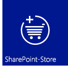
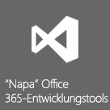
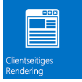
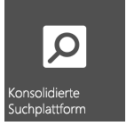
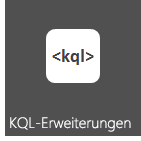
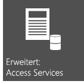

# Neuerungen für Entwickler in SharePoint
Informationen zu den Features und Funktionen in SharePoint, einschließlich des neuen Cloud-Add-In-Modells, der Entwicklungstools, Plattformverbesserungen, mobilen Add-Ins und vieles mehr.
## Cloud-Add-In-Modell

SharePoint führt ein Cloud-Add-In-Modell ein, mit dem Sie Add-Ins erstellen können. Ein SharePoint-Add-In ist eine eigenständige Funktion, die die Funktionen von SharePoint-Websites erweitert. Ein Add-In kann SharePoint-Komponenten wie Listen, Workflows und Seiten der Website enthalten, aber es kann auch eine Remote-Webanwendung und Remotedaten in SharePoint zum Vorschein bringen. Ein Add-In hat nur wenige oder keine Abhängigkeiten von einer anderen Software auf dem Gerät oder der Plattform, wo es installiert ist, außer dem, was in die Plattform integriert ist. Aufgrund dieses Merkmals können Add-Ins einfach installiert und sauber deinstalliert werden. Add-Ins haben keinen benutzerdefinierten Code, der auf SharePoint-Servern ausgeführt wird. Stattdessen wird die gesamte benutzerdefinierte Logik „nach oben“ in die Cloud oder „nach unten“ auf Clientcomputer verschoben. Darüber hinaus führt SharePoint ein innovatives Bereitstellungsmodell für SharePoint-Add-Ins ein, das Komponenten wie Office Store und den Add-In-Katalog enthält.

&nbsp;&nbsp;&nbsp;&nbsp;

## Vertrautes Programmiermodell mithilfe von Webstandards

Mit SharePoint kann jeder Webentwickler, auch jene, die auf Nicht-Microsoft-Plattformstapeln arbeiten, SharePoint-Lösungen erstellen. Dies ist möglich, da SharePoint auf den üblichen Webstandards wie HTML, CSS und JavaScript basiert. Die Implementierung stützt sich außerdem auf eingeführte Protokolle wie OData und OAuth.
  

  &nbsp;&nbsp;&nbsp;&nbsp;&nbsp;&nbsp;

## Entwicklungstools

Die aktuelle Version zeigt die enormen Schritte, die für die Optimierung der vorhandenen Entwicklungstools wie Visual Studio und SharePoint Designer unternommen wurden. Daneben wurde auch das neu entwickelte webbasierte Tool Napa Office 365-Entwicklungstools zur Entwicklung von Add-Ins bereitgestellt. Mit dem neuen vereinheitlichten Projektsystem Visual Studio können Sie SharePoint-Add-Ins, Office-Add-Ins und SharePoint-Add-Ins entwickeln, die Office-Add-Ins oder Office-Add-Ins beinhalten, welche von SharePoint gehostet werden. Zusätzlich zu den SharePoint-Projektvorlagen aus früheren Versionen enthält Visual Studio 2012 nun eine neue Add-In-Projektvorlage im Ordner „Add-Ins" namens Add-Ins für SharePoint. Dem Fenster „Eigenschaften" und den Eigenschaftenseiten wurden einige neue Eigenschaften zur Unterstützung von SharePoint-Add-In-Projekten hinzugefügt. Weitere Verbesserungen betreffen umfassende Unterstützung der Entwicklung des Cloud-Add-In-Modells, einschließlich OData- und OAuth-Unterstützung, sowie umfassende Unterstützung der Workflow-Manager-Client 1.0-Plattformentwicklung.

&nbsp;&nbsp;&nbsp;&nbsp;

## Zentrale Plattformverbesserungen

SharePoint wurde für die Unterstützung der neuen cloudbasierten Architektur und des app-gesteuerten Entwicklungsframework umfassend verbessert und optimiert. Angefangen bei den SharePoint-APIs auf der untersten Ebene, über Konnektivität bis hin zu Integration sozialer Medien ist SharePoint dafür ausgelegt, eine komplette Anwendungsentwicklungsumgebung zu unterstützen. Neben der Verwendung von REST-Endpunkten (Representational State Transfer) für Webdienste, gibt es auch eine neue API für die Server- und die Cliententwicklung. Remoteereignisempfänger werden jetzt auch neben dem clientseitigen Rendering unterstützt. 
  
&nbsp;&nbsp;&nbsp;&nbsp;&nbsp;&nbsp;

    
    
    

## Mobilität

SharePoint ermöglicht Ihnen, Windows Phone 7-Anwendungen mit lokalen SharePoint-Diensten und -Anwendungen bzw. mit in der Cloud ausgeführten Remote-SharePoint-Diensten und -Anwendungen (wie jene, die SharePoint Online verwenden) zu kombinieren, um leistungsfähige Anwendungen zu entwickeln, deren Funktionalität über die herkömmlichen Desktop- oder Laptopfunktionen hinausgehen und eine wirklich mobile und leichter zugängliche Umgebung schaffen. Die neuen Mobilitätsfeatures in SharePoint bauen auf vorhandenen Microsoft-Tools und -Technologien auf, wie SharePoint, Windows Phone 7, Visual Studio und Microsoft Silverlight. Sie können SharePoint-unterstützte mobile Anwendungen für Windows Phone mit dem neuen SharePoint Phone-Anwendungsassistenten Visual Studio für einfache listenbasierte mobile Anwendungen erstellen. Sie können die neuen Features aus SharePoint, wie den Geolocation-Feldtyp, integrieren und Mitteilungen von SharePoint Server mit Push auf Ihre mobilen Anwendungen übertragen.

&nbsp;&nbsp;&nbsp;&nbsp;

## Soziale Netzwerke und Zusammenarbeit

Neue und verbesserte Features für soziale Funktionen und Zusammenarbeit erleichtern den Benutzern die Kommunikation, damit sie immer auf dem Laufenden sind. Der verbesserte soziale Meine Website-Feed verbindet Menschen und lässt sie Inhalte tauschen. Das neue Feature Communitywebsite stellt den Benutzern eine reichhaltige Communityumgebung bereit, in der sie nicht nur schnell Informationen finden und teilen können, sondern auch auf Menschen mit gleichen Interessen treffen.

&nbsp;&nbsp;&nbsp;&nbsp;&nbsp;&nbsp;

## Suche

Die Suchfunktion in SharePoint enthält mehrere Verbesserungen, kundenspezifische Inhaltsverarbeitung mit dem Webdienst für Inhaltserweiterung und ein neues Framework für die Darstellung der Suchergebnistypen. Außerdem wurde bedeutende Verbesserungen bei der Sprache der Schlüsselwortabfrage (KQL) eingeführt.

&nbsp;&nbsp;&nbsp;&nbsp;

## Workflows

Workflow-Manager-Client 1.0 ist eine neu entworfene Workflowinfrastruktur, basierend auf Windows Workflow Foundation 4. Sie bringt dem Workflowauthoring in SharePoint mehr Leistungsstärke und Flexibilität. In einer vollständig deklarierten Authoringumgebung können IT-Arbeiter mit SharePoint Designer 2013 leistungsstarke Workflows nutzen. Mit einer Reihe neuer Visual Studio 2012-Workflowprojektvorlagen greifen Entwickler auf intelligentere Features, wie benutzerdefinierte Aktionen, zu. Der wichtigste Punkt aber ist, Workflow-Manager-Client 1.0 ist vollständig mit Modell für SharePoint-Add-Ins integriert. Workflows werden nicht in SharePoint ausgeführt, sondern in der Cloud. Dies bietet enorme Flexibilität bei der Entwicklung von workflowbasierten SharePoint-Add-Ins.

&nbsp;&nbsp;&nbsp;&nbsp;&nbsp;&nbsp;

## Enterprise Content Management

In SharePoint können Sie jetzt .NET-Client, Silverlight, Windows Phone und JavaScript APIs zusätzlich zu der erweiterten Gruppe von .NET-Server-verwalteten APIs verwenden, Um ECM-Bedienerfreundlichkeit und -Verhalten (Enterprise Content Management) anzupassen.

&nbsp;&nbsp;&nbsp;&nbsp;&nbsp;&nbsp;

## Business Connectivity Services

Business Connectivity Services (BCS) ermöglicht SharePoint, auf Daten aus externen Systemen, wie SAP, ERP und CRM, zuzugreifen, zusätzlich zu anderen datengesteuerten Anwendungen, die über WCF-Dienste oder OData-Endpunkte dargestellt werden. BCS in SharePoint wurde in vielfacher weise geändert und verbessert. Dazu zählen auch OData-Konnektivität, externe Ereignisse, externe Daten in Add-Ins, Filterung und Sortierung, REST-Unterstützung und anderes mehr.

&nbsp;&nbsp;&nbsp;&nbsp;

## Anwendungsdienste

SharePoint umfasst verschiedene Dienste für das Arbeiten mit den Daten Ihrer SharePoint-Websites. Neu in SharePoint ist der maschinelle Übersetzungsdienst, der Webseiten, Dokumente und Datenströme in mehrere Sprachen übersetzt. SharePoint beinhaltet auch Access Services und ein neues Datenzugriffsmodell. Zum Konvertieren von Dateien und Datenströmen in andere Formate verfügt SharePoint über Word Automation Services und PowerPoint Automation Services (ein neues Feature für SharePoint). SharePoint bietet auch Tools zur Datenanalyse, z. B. PerformancePoint Services und Visio Services, Business Intelligence und leistungsfähigen neuen Features in Excel Services ermöglichen die einfache.

&nbsp;&nbsp;&nbsp;&nbsp;&nbsp;&nbsp;

## Zusätzliche Ressourcen

-  [Übersicht über die SharePoint-Entwicklung](sharepoint-development-overview.md)
    
  
-  [Entwickeln von Add-Ins für SharePoint](../sp-add-ins/sharepoint-add-ins.md)
    
  
-  [SharePoint-Add-Ins im Vergleich zu SharePoint-Lösungen](sharepoint-add-ins-compared-with-sharepoint-solutions.md)
    
  
-  [Auswählen des richtigen API-Satzes in SharePoint](choose-the-right-api-set-in-sharepoint.md)
    
  
-  [Barrierefreiheit in SharePoint](accessibility-in-sharepoint.md)
    
  

