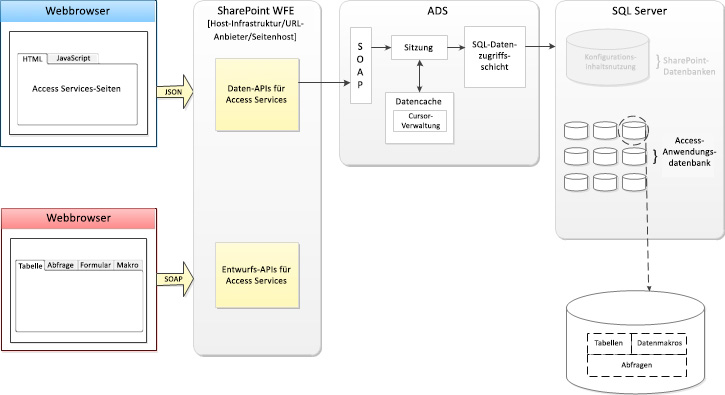

# Neuigkeiten in AccessWhat's new in Access
Hier finden Sie Informationen zu den Features in Access 2013, welche die Erstellung, Bereitstellung und Verwaltung von webbasierten Anwendungen für die Zusammenarbeit lokal oder in der Cloud erleichtern.Learn about the features in Access 2013 makes it easy to create, deploy, and manage collaborative web-based applications on premise or in the cloud.
## EinführungIntroduction

Access 2013 verfügt über ein neues Anwendungsmodell, das für den Zweck entworfen wurde, die Webentwicklung ähnlich wie frühere Versionen von Access mit der Windows-Bereitstellung zu vereinfachen. Access 2013 ermöglicht Experten das schnelle Erstellen einer Anwendung, die zum Leiten ihres Unternehmens verwendet werden kann. Durch die Verwendung von Microsoft SharePoint zum Hosten des Front-Ends der App und von Microsoft SQL Server 2012 als die entsprechende Datenspeichertechnologie, verbessert Access 2013 die Verwaltbarkeit und Skalierbarkeit von Access-Anwendungen erheblich. Durch die Kompatibilität mit Office 365 und SQL Azure wird die Reichweite von Access-Anwendungen maßgeblich erweitert.Access 2013 features a new application model that is designed for one purpose―to simplify web development much like earlier versions of Access with Windows development. Access 2013 enables subject matter experts to quickly create an application that can be used to run their business. By using Microsoft SharePoint to host the front end of the app and Microsoft SQL Server 2012 as its data storage technology, Access 2013 significantly improves the manageability and scalability of Access applications. Compatibility with Office 365 and SQL Azure significantly expand the reach of Access applications.
  
    
    

## ArchitekturArchitecture

In einer lokalen Umgebung werden Access 2013-Apps durch SharePoint gehostet, während die Daten in SQL Server 2012 gespeichert werden. SharePoint stellt Authentifizierung, Autorisierung und Sicherheit für Access 2013-Apps bereit. Die Back-End-Tabellen, -Ansichten, -Makros und -Abfragen werden in einer SQL Server 2012-Datenbank gespeichert.In an on-premise environment, Access 2013 apps are hosted by SharePoint while the data is stored in SQL Server 2012. SharePoint provides authentication, authorization, and security for Access 2013 apps. The back-end tables, views, macros, and queries are stored in an SQL Server 2012 database.
  
    
    
Access 2013 bietet über die Dienste Office 365 und SQL Azure eine Methode zur Bereitstellung einer Access-App in der Cloud.Access 2013, through the Office 365 and SQL Azure services, provides a method to deploy an Access app to the cloud.
  
    
    
In Abbildung 1 wird eine Übersicht der Access 2013-Architektur dargestellt.Figure 1 provides an overview of Access 2013 architecture.
  
    
    

**Abbildung 1. Access 2013-Architektur****Figure 1. Access 2013 architecture**

  
    
    

  
    
    

  
    
    
Beim Erstellen einer neuen Access-Anwendung erstellt Access Services in SharePoint eine neue Anwendungsdatenbank, die die in der Anwendung enthaltenen Daten, Ansichten, Abfragen und Makros speichert.When a new Access application is created, Access Services in SharePoint creates a new Application database that stores the data, view, queries and macros contained in the app. Die Access Services 2013 System-Datenbank kann so konfiguriert werden, dass neue Anwendungsdatenbanken auf einem separaten Server SQL Server 2012-Server erstellt werden.The Access Services 2013 System database can be configured to create new Application databases on a separate SQL Server 2012 server.
  
    
    
Die Verwendung von SQL Server 2012 zum Speichern von Daten bietet eine zuvor in Access-Anwendungen nicht gekannte Verwaltbarkeit und Skalierbarkeit. Nun sind die Tage Geschichte, in denen eine Access-Anwendung neu entwickelt und in einer leistungsstärkeren Umgebung erneut implementiert werden müsste.Using SQL Server 2012 to store data provides manageability and scalability previously unknown to Access applications. Gone are the days when an Access application would have to be redesigned and reimplemented in a more powerful environment.
  
    
    
Eine Access 2013-App ist in dem Moment online, in dem sie entwickelt wird. Sie können die App für andere Benutzer freigeben, im privaten Unternehmenskatalog oder im Office Store bereitstellen.An Access 2013 app is online the moment it's created. You can decide to share the app with other people, deploy to the private corporate catalog, or deploy to the Office Store.
  
    
    

## Entwickeln von Access-AppsDeveloping Access apps

Im Gegensatz zu vielen der SharePoint-Anwendungsdienste macht Access Services 2013 keine API verfügbar, die Sie zum Entwickeln von Access-Apps in Visual Studio verwenden können.Unlike many of the SharePointapplication services, Access Services 2013 doesn't expose an API that you can use to develop Access apps in Visual Studio. Access 2013 ist die Umgebung, die Sie zum Entwickeln von Access 2013-Apps verwenden.Access 2013 is the environment that you use to develop Access 2013 apps.
  
    
    
Weitere Informationen zur Entwicklung von Access 2013-Apps finden Sie unter [Gewusst wie: Erstellen und Anpassen einer Web-App in Access](http://msdn.microsoft.com/library/628745f4-82e9-4838-9726-6f3e506a654f%28Office.15%29.aspx)For more information about how to develop Access 2013 apps, see  [How to: Create and customize a web app in Access](http://msdn.microsoft.com/library/628745f4-82e9-4838-9726-6f3e506a654f%28Office.15%29.aspx)
  
    
    

## Siehe auchSee also

-  [Neuigkeiten in Access für EntwicklerNew in Access for developers](http://msdn.microsoft.com/library/df778f51-d65e-4c30-b618-65003ceb39b3%28Office.15%29.aspx)
    
  
-  [Benutzerdefinierte Web-App-Referenz für AccessAccess custom web app reference](http://msdn.microsoft.com/library/8d696fa4-a6f2-4fb1-8662-a313bf0b5989%28Office.15%29.aspx)
    
  

