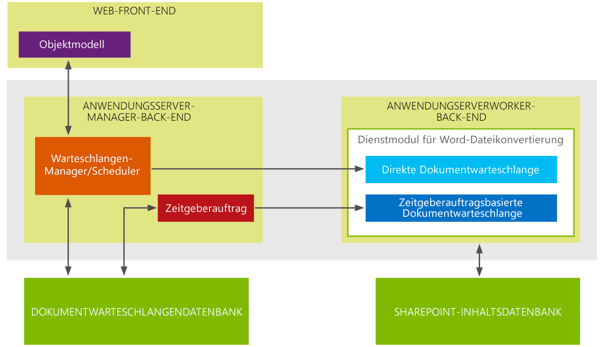

# Neuigkeiten in Word Automation Services für Entwickler
Dieses Thema bietet eine allgemeine Übersicht über das Hinzufügen und Erweiterungen für Entwickler in Word Automation Services. In Microsoft SharePoint ist die primäre zusätzlich zu Word Automation Services Unterstützung für "on Demand" Datei Konvertierung Anforderungen. Die wichtigste Verbesserung Word Automation Services wird die Unterstützung für die Verwendung von Datenströmen als Eingabe und Ausgabe von Konvertierungsaufgaben hinzugefügt.
## Erstellen Sie eine on Demand dateikonvertierung

In Word Automation Services in Microsoft SharePoint erstellbare nun bei Bedarf fordert Datei konvertieren, dass das Ergebnis in der Datei Conversionthat werden sofort verarbeitet. In SharePoint 2010 würden Sie ein Konvertierungsauftrags Datei in Ihrem Code erstellen und starten Sie die Konvertierung mithilfe der ConversionJob.Start-Methode. Der Konvertierungsauftrag würde dann basierend festgelegt sind in Word Automation Services dafür, wie oft Konvertierungsaufgaben starten starten. Im Intervall würde SharePoint Zeitgeberauftrag für den Konvertierungsauftrag starten. Die Zeitgeberauftrag für die Basis-Methode verwenden, die frühesten können Sie beginnen eine Konvertierung Auftrag ist eine Minute. 
  
    
    
In Word Automation Services in Microsoft SharePoint müssen Sie jetzt die Option hinzugefügte, eine Datei Konvertierung Anforderung erstellen, die verarbeitet wird, sobald Sie einreichen und die Konvertierung wird sofort gestartet und hängt SharePoint Zeitgeberauftrag nicht. 
  
    
    
Eine Möglichkeit zum Unterschied zwischen auf Anforderung Datei Konvertierung Anfragen und SharePoint für den Zeitgeberauftrag für basierenden Konvertierung vorstellen Aufträge besteht darin, die bei Bedarf Datei Konvertierung Anfragen zu verstehen synchron verarbeitet werden, während der Zeitgeberauftrag für basierenden Konvertierungsaufgaben für SharePoint asynchron erfolgen. Die Architektur Word Automation Services wurde neu gestaltet, zur Unterstützung der neuen Art von bei Bedarf Datei Konvertierung Anforderung und der vorhandenen SharePoint Zeitgeberauftrag basierend Datei Konvertierungen.
  
    
    

**Abbildung 1. Word Automation Services 2013-Architektur**

  
    
    

  
    
    

  
    
    
In Abbildung 1, können Sie sehen, dass die Word Automation Services-Architektur beibehält 2 trennen Warteschlangen für Konvertierungen: eine Warteschlange für Demand (unmittelbar) dateikonvertierung Anfragen und eine Warteschlange für SharePoint-Zeitgeberauftrag-basierte Konvertierungsaufgaben bei Bedarf Anfragen im unmittelbaren platziert werden basierend dokumentwarteschlange, in dem die Konvertierungen sofort verarbeitet werden.
  
    
    
Im Gegensatz dazu werden der Zeitgeberauftrag für die SharePoint-basierte Konvertierung Aufträge in der Warteschlange Zeitgeberauftrag basierendes Dokument platziert. In dem Intervall für Word Automation Services Konvertierungsaufgaben für diese Anforderungen zu starten. Konvertierung Anforderungen in der Warteschlange sofortige basierendes Dokument haben immer Vorrang gegenüber Konvertierung Aufträge in der Warteschlange Zeitgeberauftrag basierendes Dokument.
  
    
    

### Wichtige Punkte

- Eine on Demand Datei Konvertierung Anforderung ist ein zusätzliches Feature und nicht ersetzen den vorhandenen SharePoint-Zeitgeberauftrag-basierte Konvertierungsauftrag. Dies bedeutet, dass die Lösungen, die kompiliert und in SharePoint 2010 ausgeführt werden hingegen weiterhin kompilieren und Ausführen in SharePoint.
    
  
- Sie können bei Bedarf Datei Konvertierung Anfragen nur für eine Datei zu einem Zeitpunkt tätigen
    
  
- Word Automation Services wird immer auf Anforderung Datei Konvertierungsaufgaben über Konvertierungsaufgaben basierend auf den Zeitgeberauftrag SharePoint bevorzugen. Wenn Word Automation Services bereits auf eine Datei Konvertierungsauftrag, die die SharePoint Zeitgeberauftrag verwendet funktionsfähig ist, wird Word Automation Services unterbrechen diese Aufgabe und an bis zum Abschluss der on Demand Datei Konvertierungsauftrag arbeiten zu wechseln. Wechselt dann zurück, um den SharePoint Zeitgeberauftrag für basierenden Datei Konvertierungsauftrag arbeiten
    
  

## Führen Sie die Datei Konvertierungen auf Datenströme

Das neue Feature in Word Automation Services in Microsoft SharePoint wird unterstützt für die Konvertierung von Streams. In SharePoint 2010 können Sie nur Dateien konvertieren, die in SharePoint Bibliotheken gespeichert wurden. Jetzt können Sie Dateien konvertieren, die außerhalb der SharePoint mithilfe von Streams gespeichert sind.
  
    
    

### Wichtige Punkte

- Sie können nur Datenströme als Eingabe verwenden, beim Erstellen einer on Demand Datei Konvertierungsauftrag
    
  
- Aufgrund der vorstehenden Punkt können Sie nur einen Datenstrom zu einem Zeitpunkt konvertieren
    
  
Durch die hinzugefügte auf Anforderung Datei Konvertierung Anfragen und Unterstützung für das Konvertieren von Datenströmen wurde Word Automation Services erheblich verbessert, um einen größeren Wertebereich dokumentkonvertierung Szenarien zu aktivieren.
  
    
    

### Zusätzliche Ressourcen

-  [Word Automation Services in SharePoint Server 2010](http://msdn.microsoft.com/en-us/library/ee558278)
    
  
-  [Word Automation Services-Klassenbibliothek](http://msdn.microsoft.com/en-us/library/ee559408)
    
  

