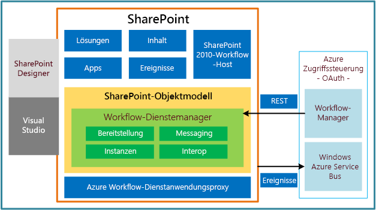

# Neuerungen in Workflows für SharePointWhat's new in workflows for SharePoint
Hier erhalten Sie Informationen zu den neuen Features für Workflows in SharePoint. Das Workflow-Framework in SharePoint hat sich gegenüber früheren Versionen erheblich geändert. Die folgenden Abschnitte bieten kurze Zusammenfassungen zu den wichtigsten Updates und Verbesserungen an der Workflowinfrastruktur.Learn about the capabilities and features that are new to workflows in SharePoint. The workflow framework in SharePoint is significantly changed from previous versions. The following sections provide brief summaries of the most significant updates and enhancements to the workflow infrastructure.
  
    
    

## Vollständig neu gestaltete WorkflowinfrastrukturCompletely redesigned workflow infrastructure

SharePoint-Workflows werden von Windows Workflow Foundation 4 (WF) unterstützt, das in Vergleich zu früheren Versionen erheblich überarbeitet wurde. Windows Workflow Foundation basiert wiederum auf der von  [Windows Communication Foundation (WCF)](http://msdn.microsoft.com/en-us/netframework/aa663324) bereitgestellten Messaging-Funktion.SharePoint workflows are powered by Windows Workflow Foundation 4 (WF), which was substantially redesigned from previous versions. Windows Workflow Foundation, in turn, is built on the messaging functionality that is provided by  [Windows Communication Foundation (WCF)](http://msdn.microsoft.com/en-us/netframework/aa663324).
  
    
    
Das wahrscheinlich bedeutendste Feature der neuen Workflowinfrastruktur ist die Einführung von Microsoft Azure als neuer Host für die Workflowausführung. Das Workflowausführungsmodul befindet sich jetzt außerhalb von SharePoint in Microsoft Azure. Abbild 1 zeigt eine verallgemeinerte Ansicht der neuen Workflowinfrastruktur. Ausführlichere Informationen zu den in Abbildung 1 präsentierten Konzepten finden Sie unter  [Grundlegendes zu SharePoint-Workflows](sharepoint-workflow-fundamentals.md).Perhaps the most prominent feature of the new workflow infrastructure is the introduction of Microsoft Azure as the new workflow execution host. The workflow execution engine now lives outside of SharePoint, in Microsoft Azure. Figure 1 provides a generalized, high-level view of the new workflow infrastructure. For a more thorough discussion of the concepts presented in Figure 1, see  [SharePoint workflow fundamentals](sharepoint-workflow-fundamentals.md).
  
    
    

**Abbildung 1. Allgemeine Architektur der Workflowinfrastruktur****Figure 1. High-level architecture of the workflow infrastructure**

  
    
    

  
    
    

  
    
    

  
    
    

  
    
    

## Vollständig deklarative Erstellungsumgebung ohne CodeFully declarative, no-code authoring environment

Eine weitere bedeutende Änderung besteht darin, dass Workflows auf der WF 4-Plattform vollständig deklarativ sind. Das bedeutet, dass Workflows nicht länger zu verwalteten Assemblys kompiliert und in einem Assembly-Cache bereitgestellt werden. Stattdessen definieren XAML-Dateien Ihre Workflows und legen ihre Ausführung fest.Another of the prominent changes is that workflows on the WF 4 platform are fully declarative. That is, workflows are no longer compiled into managed assemblies and deployed to an assembly cache. Instead, XAML files define your workflows and frame their execution.
  
    
    

## Erweiterte Unterstützung der SharePoint Designer 2013-ErstellungEnhanced SharePoint Designer 2013 authoring support

SharePoint Designer 2013 wurde mit dem Ziel aktualisiert, es für die Erstellung von SharePoint-Workflows zur gewünschten Erstellungsumgebung zu machen. SharePoint Designer 2013 bietet Workflowautoren sowohl eine Designeroberfläche als auch eine textbasierte Erstellungsumgebung für Workflows. Zusätzlich können Sie für Workflows benutzerdefinierte Aktionen in Visual Studio 2012 entwickeln und diese dann in SharePoint Designer 2013 importieren, wo dann Workflow-Designer darauf zugreifen kann.SharePoint Designer 2013 has been updated with the goal of making it the authoring environment of choice for authoring SharePoint workflows. SharePoint Designer 2013 provides workflow authors with both a designer surface and a text-based workflow authoring environment. Additionally, you can develop workflow custom actions in Visual Studio 2012 and then import them into SharePoint Designer 2013, where they can then be accessed from the Workflow Designer.
  
    
    
Kurz gesagt, wurden die Anforderungen der Information-Worker ("Hauptbenutzer") und der Entwickler in den Umgebungen zur SharePoint-Workflowerstellung und -entwicklung genutzt.In short, the needs of both the information worker (the "power user") and the developer have been harnessed in SharePoint workflow authoring and development environments.
  
    
    

## Unterstützung des Visual Studio 2012-WorkflowprojekttypsVisual Studio 2012 workflow project type support

Um die Zusammenarbeit von Information-Worker und Softwareentwickler zu vereinfachen, bietet Visual Studio 2012 die SharePoint-Workflowprojekttypen und einen benutzerdefinierten Aktionselementtyp für Workflows. Weitere Informationen zum Entwickeln von Workflows mithilfe von Visual Studio 2012 sowie Informationen zur Unterscheidung von SharePoint Designer 2013 und Visual Studio 2012 bei der Workflowentwicklung finden Sie unter  [Entwickeln von SharePoint-Workflows mit Visual Studio](develop-sharepoint-workflows-using-visual-studio.md).To make collaboration easier between information worker and software developer, Visual Studio 2012 provides SharePoint workflow project types and a workflow custom action-item type. For more information about developing workflows by using Visual Studio 2012, and for information about differentiating between SharePoint Designer 2013 and Visual Studio 2012 in workflow development, see  [Develop SharePoint workflows using Visual Studio](develop-sharepoint-workflows-using-visual-studio.md).
  
    
    

## Unterstützung für das Erstellen benutzerdefinierter AktionenSupport for creating custom actions

In die Vorhersage der Geschäftsanforderungen von Workflowautoren für die Bereitstellung von Workflowvorlagen, Aktionen und Aktivitäten in SharePoint Designer 2013 und in Visual Studio 2012 wurde viel Arbeit gesteckt. Dennoch können wir nicht die spezifischen Anforderungen jeder einzelnen Person vorhersagen. Aus diesem Grund bietet Visual Studio 2012 einen benutzerdefinierten Aktionselementtyp für Workflows, mit dem Entwickler benutzerdefinierte Aktionen erstellen können. Weitere Informationen zu benutzerdefinierte Aktionen für Workflows finden Sie unter  [Vorgehensweise: Erstellen und POST von benutzerdefinierten Workflowaktionen](how-to-build-and-deploy-workflow-custom-actions.md).A lot of effort has gone into anticipating the business requirements of workflow authors in the providing of workflow templates, actions, and activities in SharePoint Designer 2013 and in Visual Studio 2012. However, we also know that we cannot anticipate each person's specific needs. For this reason, Visual Studio 2012 provides a workflow custom action-item type that lets developers create custom actions. For more information about workflow custom actions, see  [How to: Build and deploy workflow custom actions](how-to-build-and-deploy-workflow-custom-actions.md).
  
    
    

## Unterstützung von Tools für SharePoint-WorkflowsTools support for SharePoint workflows

Visual Studio 2012 bietet Vorlagen und Unterstützung für das Erstellen von Workflows für das SharePoint-Workflow-Framework. SharePoint-Workflows ähneln früheren Versionen von Workflows, allerdings werden Sie von WF 4 unterstützt und in Microsoft Azure ausgeführt. Außerdem sind sie rein deklarativ (XAML) und für die Interaktion mit der Cloud sowie für die Arbeit mit SharePoint-Add-Ins konzipiert. Einer ihrer Hauptvorteile besteht darin, dass Sie es Ihnen ermöglichen, Workflows außerhalb von SharePoint Server remote zu hosten und auszuführen.Visual Studio 2012 provides templates and support for creating workflows on the SharePoint workflow framework. SharePoint workflows are similar to previous versions of workflows except that they are powered by WF 4 and run in Microsoft Azure. They are also declarative-only (XAML) and designed to interact with the cloud and work with SharePoint Add-ins. One of their primary benefits is that they enable you to remotely host and run workflows outside SharePoint Server.
  
    
    

## Neue WorkflowaktionenNew workflow actions

Nachfolgend sind die neuen Workflowaktionen aufgeführt, die in SharePoint bereitgestellt werden. Ausführliche Informationen zu neuen und überholten Aktionen finden Sie unter  [Workflowaktions- und -aktivitätenreferenz für SharePoint](workflow-actions-and-activities-reference-for-sharepoint.md). Neu für Workflows in SharePoint sind eine Reihe von Workflowaktionen, die Ihnen die Integration mit Project 2013 und die Erstellung projektbasierter Workflows gestatten.Following are new workflow actions that are provided in SharePoint. For a full detailing of both new and deprecated actions, see  [Workflow actions and activities reference for SharePoint](workflow-actions-and-activities-reference-for-sharepoint.md). New to workflows in SharePoint are a set of workflow actions that allow you to integrate with Project 2013 and let you create Project-based workflows.
  
    
    

**Tabelle 1. Neue Workflowaktionen in SharePoint****Table 1. New workflow actions in SharePoint**

|**Aktion****Action**|**Beschreibung****Description**|
|:-----|:-----|
|Aufgabe zuweisenAssign a Task    |Weist eine einzelne Workflowaufgabe zu einem Benutzer oder einer Gruppe zu.Assigns a single workflow task to a user or group.    |
|Aufgabenprozess startenStart a Task Process    |Startet die Ausführung eines Aufgabenprozesses.Initiates execution of a task process.    |
|Zu dieser Phase wechselnGo to This Stage    |Gibt die nächste Phase in einem Workflow an, an welche die Ablaufsteuerung übergeben werden sollte.Specifies the next stage in a workflow to which flow control should be handed.    |
|HTTP-Webdienst aufrufenCall HTTP Web Service    |Dient als Methodenaufruf für einen REST-Endpunkt (Representational State Transfer).Functions as a method call to a Representational State Transfer (REST) endpoint.    |
|Listenworkflow startenStart a List Workflow    |Startet einen listenbezogenen Workflow.Starts a list-scoped workflow.    |
|Website-Workflow startenStart a Site Workflow    |Startet einen websitebezogenen Workflow.Starts a site-scoped workflow.    |
|DynamicValue erstellenBuild DynamicValue    |Erstellt eine neue Variable vom Typ **DynamicValue**.Creates a new variable of type **DynamicValue**.    |
|Eigenschaft von DynamicValue abrufenGet Property from DynamicValue    |Ruft einen Eigenschaftswert von einer angegebenen Variablen vom Typ **DynamicValue** ab.Retrieves a property value from a specified variable of type **DynamicValue**.    |
|Elemente in DynamicValue zählenCount Items in DynamicValue    |Gibt die Anzahl der Zeilen in einer Variablen vom Typ **DynamicValue** zurück.Returns the number of rows in a variable of type **DynamicValue**.    |
|Zeichenfolge kürzenTrim String    |Entfernt alle führenden und nachfolgenden Leerzeichen aus der aktuellen Zeichenfolge.Removes all leading and trailing white-space characters from the current string.    |
|Teilzeichenfolge in Zeichenfolge suchenFind Substring in String    |Gibt den auf 1 basierenden Index für das erste Vorkommen eines oder mehrerer Zeichen oder das erste Vorkommen einer Zeichenfolge innerhalb einer Zeichenfolge zurück.Returns 1-based index of the first occurrence of one or more characters, or the first occurrence of a string, within a string.    |
|Teilzeichenfolge in Zeichenfolge ersetzenReplace Substring in String    |Gibt eine neue Zeichenfolge zurück, in der alle Vorkommen eines angegebenen Zeichens oder einer Zeichenfolge durch ein anderes angegebenes Zeichen oder durch eine Zeichenfolge ersetzt werden.Returns a new string in which all occurrences of a specified character or string are replaced with another specified character or string.    |
|Dokument übersetzenTranslate Document    |Funktioniert als Wrapper für die HTTP-Aktivität, die die synchrone Übersetzungs-API aufruft. Sie müssen eine maschinelle Übersetzungsdienstanwendung für die SharePoint-Website konfigurieren, für die Sie den Workflow ausführen.Functions as a wrapper around the HTTP activity that calls the synchronous translation API. You must configure a Machine Translation Service Application for the SharePoint site on which you run the workflow.    |
|Workflowstatus festlegenSet Workflow Status    |Aktualisiert den Workflowstatus gemäß der Meldungszeichenfolge.Updates workflow status as specified in message string.    |
|Projekt aus aktuellem Element erstellen [Microsoft Project]Create a Project from Current Item [Microsoft Project]    |Erstellt auf Basis des aktuellen Elements ein Project Server-Projekt.Creates a Project Server project based on the current item.    |
|Aktuellen Projektphasenstatus auf diesen Wert festlegen [Microsoft Project]Set the current project stage status to this value [Microsoft Project]    |Legt die beiden Statusfelder innerhalb der aktuellen Phase des Projekts fest.Sets the two status fields within the current stage of the project.    |
|Statusfeld im Ideenlistenelement auf diesen Wert festlegen [Microsoft Project]Set the status field in the idea list item to this value [Microsoft Project]    |Aktualisiert das Statusfeld des ursprünglichen SharePoint-Listenelements.Updates the status field of the original SharePoint list item.    |
|Auf Projektereignis warten [Microsoft Project]Wait for Project Event [Microsoft Project]    |Hält die aktuelle Instanz des Workflows an, um auf ein angegebenes Projektereignis zu warten: Projekt wurde eingecheckt, Projekt wurde bestätigt, Projekt wurde übermittelt.Pauses the current instance of the workflow to await a specified Project event: Project checked in, Project committed, Project submitted.    |
|Dieses Feld im Projekt auf diesen Wert festlegen [Microsoft Project]Set this field in the project to this value [Microsoft Project]    |Legt den Wert für das unternehmensspezifische Feld für ein angegebenes Projekt fest.Sets the value for the enterprise custom field for a specified project.    |
   

## Zusätzliche RessourcenAdditional resources

-  [Erste Schritte mit Workflows in SharePointGet started with workflows in SharePoint](get-started-with-workflows-in-sharepoint.md)
    
  
-  [Neuerungen für Entwickler in SharePointWhat's new for developers in SharePoint](what-s-new-for-developers-in-sharepoint.md)
    
  
-  [Workflowaktions- und -aktivitätenreferenz für SharePointWorkflow actions and activities reference for SharePoint](workflow-actions-and-activities-reference-for-sharepoint.md)
    
  
-  [Kurzübersicht zu Workflowaktionen (SharePoint-Workflowplattform)Workflow actions quick reference (SharePoint Workflow platform)](workflow-actions-quick-reference-sharepoint-workflow-platform.md)
    
  

