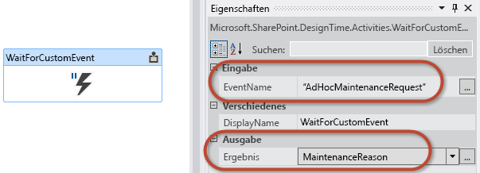

# <a name="working-with-the-sharepoint-workflow-services-client-side-object-model"></a><span data-ttu-id="2ec22-102">Arbeiten mit dem clientseitigen Objektmodell für SharePoint-Workflow-Dienste</span><span class="sxs-lookup"><span data-stu-id="2ec22-102">Working with the SharePoint Workflow Services Client Side Object Model</span></span>
<span data-ttu-id="2ec22-p101">Zeigt, wie die clientseitige SharePoint-Objektmodell-API (CSOM) zum Erstellen und Steuern von Workflow-Manager 1.0-Workflowdefinitionen und -Instanzen verwendet wird. **Bereitgestellt von:** [Andrew Connell](http://social.msdn.microsoft.com/profile/andrew%20connell%20%5bmvp%5d/),  [AndrewConnell.com](http://www.andrewconnell.com)</span><span class="sxs-lookup"><span data-stu-id="2ec22-p101">Demonstrates how to use the SharePoint client-side object model (CSOM) API to create and control Workflow Manager 1.0 workflow definitions and instances. **Provided by:** [Andrew Connell](http://social.msdn.microsoft.com/profile/andrew%20connell%20%5bmvp%5d/),  [AndrewConnell.com](http://www.andrewconnell.com)</span></span>
  
    
    


## <a name="working-with-the-sharepoint-workflow-services-client-side-object-model"></a><span data-ttu-id="2ec22-105">Arbeiten mit dem clientseitigen Objektmodell für SharePoint-Workflow-Dienste</span><span class="sxs-lookup"><span data-stu-id="2ec22-105">Working with the SharePoint Workflow Services Client Side Object Model</span></span>

<span data-ttu-id="2ec22-p102">Die Implementierung von Workflows in SharePoint 2007 und SharePoint 2010 blieb im Wesentlichen von Version zu Version gleich. Microsoft hat einige neue Funktionen in SharePoint 2010 hinzugefügt, z. B. die Möglichkeit, Workflows zu Websites zuzuordnen, und Tools für die Erstellung von Workflows, SharePoint Designer 2010 und Visual Studio 2010, gegenüber den Vorgängern verbessert. Die Implementierung von Workflowaufgaben und Workflowformularen sowie die serverseitigen Workflow-APIs bleiben im Wesentlichen unverändert.</span><span class="sxs-lookup"><span data-stu-id="2ec22-p102">The implementation of workflows in SharePoint 2007 and SharePoint 2010 remained largely the same from version to version. Microsoft did add some new functionality in SharePoint 2010, such as the ability to associate workflows with sites, and improved the workflow authoring tools, SharePoint Designer 2010 and Visual Studio 2010, from their predecessors. However, the implementation of workflow tasks, workflow forms, and the workflow server-side APIs remains largely unchanged.</span></span> 
  
    
    
<span data-ttu-id="2ec22-p103">In SharePoint 2010 hat Microsoft Features und Funktionen eingeführt, die Kunden ermutigten, ihre Anpassungen in Sandkastenlösung zu verschieben. Diese werden in einem isolierten Prozess ausgeführt und sind für beide Arten von SharePoint-Bereitstellungen geeignet: lokale, bei denen SharePoint auf Unternehmensservern installiert und vom Unternehmen verwaltet wird, und Cloud- oder genauer gesagt Office 365-Bereitstellungen.</span><span class="sxs-lookup"><span data-stu-id="2ec22-p103">In SharePoint 2010, Microsoft introduced features and capabilities that encouraged customers to move their customizations into sandboxed solution. These would run in an isolated process and were friendly to both types of SharePoint deployments: on-premises, where the SharePoint was installed on company servers and maintained by the company , and to the cloud, or more specifically, Office 365.</span></span> 
  
    
    
<span data-ttu-id="2ec22-p104">In SharePoint hat Microsoft noch weitere Funktionen hinzugefügt. Diese Updates waren an Cloud-Bereitstellungen orientiert. Insbesondere führte Microsoft das neue SharePoint-App-Modell ein, das einen Schritt weiter als die Sandkastenlösung geht, da im Gegensatz zu Sandkastenlösung die Ausführung von serverseitigem Code im SharePoint-Prozess ausdrücklich blockiert wird. Microsoft erweiterte außerdem vorhandene Technologien in SharePoint, z. B. das clientseitige Objektmodell (CSOM), und führte neue Funktionen ein, darunter die Unterstützung für App-Identitäten über  [OAuth](http://msdn.microsoft.com/library/office/fp142382.aspx).</span><span class="sxs-lookup"><span data-stu-id="2ec22-p104">In SharePoint, Microsoft added even more capabilities; these updates were oriented toward cloud deployments. Specifically, Microsoft introduced the new SharePoint app model, which went further than the sandboxed solution in that, unlike sandboxed solution, they explicitly blocked server-side code from running in the SharePoint process. Microsoft also built up existing technologies in SharePoint, such as the client-side object model (CSOM), and introduced new capabilities, like support for app identities using  [OAuth](http://msdn.microsoft.com/library/office/fp142382.aspx).</span></span>
  
    
    
<span data-ttu-id="2ec22-114">Mit der Einführung von SharePoint schließlich stellte Microsoft eine völlig neue Workflowarchitektur und Workflowplattform bereit, die grundlegende Veränderungen in der Produktausrichtung darstellen.</span><span class="sxs-lookup"><span data-stu-id="2ec22-114">And then, with the introduction of SharePoint Server 2013, Microsoft introduced an entirely new workflow architecture and platform that reflect fundamental shifts in the product direction.</span></span> 
  
    
    
<span data-ttu-id="2ec22-115">Die wichtigste Änderung in der neuen Architektur: Die Workflowausführung in SharePoint findet nicht mehr in SharePoint statt.</span><span class="sxs-lookup"><span data-stu-id="2ec22-115">The most prominent change in the new architecture is that workflow execution in SharePoint no longer takes place in SharePoint.</span></span> <span data-ttu-id="2ec22-116">Stattdessen verwendet SharePoint ein vollkommen neues Ausführungsmodul: Workflow-Manager 1.0.</span><span class="sxs-lookup"><span data-stu-id="2ec22-116">Instead, SharePoint uses a completely new execution engine: Workflow Manager 1.0.</span></span> <span data-ttu-id="2ec22-117">Workflow-Manager hostet die Windows Workflow Foundation-Laufzeit sowie alle für Windows Workflow Foundation erforderlichen Dienste.</span><span class="sxs-lookup"><span data-stu-id="2ec22-117">Workflow Manager hosts the Windows Workflow Foundation runtime and all the necessary services required by Windows Workflow Foundation.</span></span> <span data-ttu-id="2ec22-118">Wenn ein Workflow veröffentlicht oder eine neue Instanz eines veröffentlichten Workflows gestartet wird, benachrichtigt SharePoint den Workflow-Manager, der wiederum die Workflowabschnitte verarbeitet.</span><span class="sxs-lookup"><span data-stu-id="2ec22-118">When a workflow is published, or a new instance of a published workflow is started, SharePoint notifies Workflow Manager, which in turn processes the workflow episodes.</span></span> <span data-ttu-id="2ec22-119">Wann immer der Workflow auf Informationen in SharePoint zugreift, beispielsweise auf Listenelementeigenschaften oder Benutzereigenschaften, authentifiziert er sich mittels OAuth und kommuniziert über neue und verbesserte REST-APIs.</span><span class="sxs-lookup"><span data-stu-id="2ec22-119">When the workflow access information in SharePoint, such as list item properties or user properties, it authenticates using the OAuth support and communicates over new and improved REST APIs.</span></span>
  
    
    
<span data-ttu-id="2ec22-120">Diese Änderungen in der Workflowarchitektur hatten auf bestimmte Bereiche erhebliche Auswirkungen, beispielsweise auf benutzerdefinierte Workflowformulare. Details hierzu finden Sie im MSDN-Artikel „Erstellen von benutzerdefinierten SharePoint-Workflowformularen mit Visual Studio 2012“.</span><span class="sxs-lookup"><span data-stu-id="2ec22-120">These changes in the workflow architecture had significant impacts in certain areas, such as custom workflow forms, as discussed in the MSDN article How to: Create Custom SharePoint Server 2013 Workflow Forms with Visual Studio 2012. This article touches on one of the things that Microsoft added to SharePoint to support the new style of creating custom workflow forms: the improvements to the CSOM and addition of the Workflow Services CSOM API.</span></span> <span data-ttu-id="2ec22-121">Der vorliegende Artikel geht auf die Komponenten ein, die Microsoft zu SharePoint hinzugefügt hat, um die neue Herangehensweise an die Erstellung benutzerdefinierter Workflowformulare zu unterstützen: die Verbesserungen an CSOM und die Ergänzung der Workflowdienste-CSOM-API</span><span class="sxs-lookup"><span data-stu-id="2ec22-121">These changes in the workflow architecture had significant impacts in certain areas, such as custom workflow forms, as discussed in the MSDN article How to: Create Custom SharePoint Server 2013 Workflow Forms with Visual Studio 2012. This article touches on one of the things that Microsoft added to SharePoint to support the new style of creating custom workflow forms: the improvements to the CSOM and addition of the Workflow Services CSOM API.</span></span>
  
    
    

## <a name="introduction-to-the-workflow-services-csom-api-in-sharepoint"></a><span data-ttu-id="2ec22-122">Einführung in die Workflowdienste-CSOM-API in SharePoint</span><span class="sxs-lookup"><span data-stu-id="2ec22-122">Introduction to the Workflow Services CSOM API in SharePoint</span></span>

<span data-ttu-id="2ec22-p107">In SharePoint 2007 und SharePoint 2010 war die Workflow-API nur im serverseitigen Objektmodell vorhanden. In SharePoint ist derselbe Workflow-API immer noch vorhanden, da SharePoint das alte Workflowausführungsmodul in SharePoint aus Gründen der Abwärtskompatibilität beinhaltet.</span><span class="sxs-lookup"><span data-stu-id="2ec22-p107">In SharePoint 2007 and SharePoint 2010, the workflow API was manifested only in the server-side object model. In SharePoint, this same workflow API is still present, since SharePoint includes the old workflow execution engine in SharePoint for backward compatibility.</span></span> 
  
    
    
<span data-ttu-id="2ec22-p108">Aber die neue und bevorzugte Workflowarchitektur, die mit SharePoint eingeführt wurde und Workflow-Manager verwendet, enthält eine völlig neue serverseitige API. In SharePoint hat Microsoft das CSOM um eine stabile API für die neue Workflowarchitektur erweitert. Diese Ergänzung des CSOM gilt nur für die neue SharePoint- und Workflow-Manager 1.0-Workflowarchitektur, nicht die ältere Version, die noch von SharePoint gehostet wird.</span><span class="sxs-lookup"><span data-stu-id="2ec22-p108">However, the new and preferred workflow architecture introduced with SharePoint that uses Workflow Manager includes a brand new server-side API. In SharePoint, Microsoft extended the CSOM to include a robust API for the new workflow architecture. Note that this addition to the CSOM only applies to the new SharePoint and Workflow Manager 1.0 workflow architecture, not the legacy version that is still hosted by SharePoint.</span></span>
  
    
    
<span data-ttu-id="2ec22-p109">Die Workflowdienste-CSOM-API wird wie der Rest des CSOM sowohl in einer verwalteten .NET-Silverlight-API und einer JavaScript-API implementiert, die als JavaScript-Objektmodell (JSOM) bezeichnet wird. JSOM muss von Entwicklern verwendet werden, wenn sie benutzerdefinierte Workflowformulare erstellen, da diese Formulare ASP.NET-Webformulare sind, die keinen serverseitigen Code benötigen. Daher wird die Workflowdienste-JSOM-API in benutzerdefinierten Zuordnungsformularen für die Erstellung von Workflowzuordnungen sowie in Initiierungsformularen zum Starten neuer Workflowinstanzen verwendet.</span><span class="sxs-lookup"><span data-stu-id="2ec22-p109">The Workflow Services CSOM API, like the rest of the CSOM, is implemented both in a .NET Silverlight managed API and a JavaScript API known as the JavaScript Object Model (JSOM). JSOM is what developers must use when creating custom workflow forms as those forms will be ASP.NET web forms that must not have any server-side code. Thus the Workflow Services JSOM API is used in custom association forms to create workflow associations as well as on initiation forms to start new workflow instances.</span></span>
  
    
    
<span data-ttu-id="2ec22-p110">Aber das sind noch nicht alle Möglichkeiten. Workflowdienste-CSOM und -JSOM sind sehr stabil und ermöglichen Entwicklern nahezu beliebige Aktionen mit Workflows in SharePoint. Neben der Erstellung von Workflowzuordnungen und -instanzen können Entwickler auch programmgesteuert neue Workflowdefinitionen bereitstellen und sogar mit laufenden Workflowinstanzen vom CSOM und JSOM kommunizieren, wie im restlichen Teil dieses Artikels dargestellt wird.</span><span class="sxs-lookup"><span data-stu-id="2ec22-p110">However, the possibilities do not stop there. The Workflow Services CSOM and JSOM is very robust and enables developers to do almost anything with workflows in SharePoint. Aside from creating workflow associations and instances, developers can also programmatically deploy new workflow definitions and even communicate with running workflow instances from the CSOM and JSOM, as is discussed in the remainder of this article.</span></span>
  
    
    
<span data-ttu-id="2ec22-134">Dieser Artikel konzentriert sich auf das Thema Workflowformulare im Kontext von SharePoint Server 2013.</span><span class="sxs-lookup"><span data-stu-id="2ec22-134">This article focuses on the topic of workflow forms in the context of SharePoint Sever 2013.</span></span> <span data-ttu-id="2ec22-135">Dabei nimmt er Bezug auf SharePoint mit dem öffentlichen Update vom März 2013 sowie die Office Developer Tools für Visual Studio 2013.</span><span class="sxs-lookup"><span data-stu-id="2ec22-135">It is based on the SharePoint with the March 2013 Public Update applied and Office Developer Tools for Visual Studio 2013.</span></span> <span data-ttu-id="2ec22-136">Alle Informationen in diesem Artikel gelten sowohl für lokale SharePoint-Bereitstellungen als auch für Office 365.</span><span class="sxs-lookup"><span data-stu-id="2ec22-136">Everything in this article applies to both SharePoint on-premises deployments as well as Office 365.</span></span>
  
    
    

## <a name="workflow-services-csom-and-jsom-api-components"></a><span data-ttu-id="2ec22-137">Komponenten der Workflowdienste-CSOM-API und der Workflowdienste-JSOM-API</span><span class="sxs-lookup"><span data-stu-id="2ec22-137">Workflow Services CSOM and JSOM API components</span></span>

<span data-ttu-id="2ec22-p112">In diesem Artikel liegt der Schwerpunkt auf der Workflowdienste-CSOM-API und infolgedessen auch auf der JSOM-API. Die serverseitige Workflowdienste-API wird hier nicht behandelt. Das Workflowdienste-CSOM besteht aus mehreren Diensten, die zum Ausführen verschiedener Aufgaben verwendet werden. Diese werden in den folgenden Abschnitten erläutert.</span><span class="sxs-lookup"><span data-stu-id="2ec22-p112">This article focuses on the Workflow Services CSOM API and thus, by extension, the JSOM API as well; the server side Workflow Services API is not discussed here. The Workflow Services CSOM consists of several different services that are used to perform different tasks. Each of these is discussed in the following sections.</span></span> 
  
    
    

> <span data-ttu-id="2ec22-141">**Hinweis:** Es existiert ein weiterer Dienst, der nicht in der CSOM-API enthalten ist, sondern in der serverseitigen API.</span><span class="sxs-lookup"><span data-stu-id="2ec22-141">**Note** There is one additional service that is not present in the CSOM, but is present instead with the server-side API. This is the Messaging Service, which is used to manage message queuing and message transport.</span></span> <span data-ttu-id="2ec22-142">Konkret handelt es sich um den Nachrichtendienst, der Nachrichtenwarteschlangen sowie die Nachrichtenübermittlung verwaltet.</span><span class="sxs-lookup"><span data-stu-id="2ec22-142">Note There is one additional service that is not present in the CSOM, but is present instead with the server-side API. This is the Messaging Service, which is used to manage message queuing and message transport.</span></span> 
  
    
    

<span data-ttu-id="2ec22-p114">Zum Arbeiten mit den Workflowdienste-CSOM- und JSOM-APIs müssen Entwickler die erforderlichen Verweise zu ihren Projekten (bei CSOM) und Seiten (bei JSOM) hinzufügen. Beide Implementierungen haben dieselben Anforderungen:</span><span class="sxs-lookup"><span data-stu-id="2ec22-p114">To work with the Workflow Services CSOM and JSOM APIs, developers must add the necessary references to their projects (in the case of CSOM) and pages (in the case of JSOM). Both implementations have the same requirements:</span></span>
  
    
    

- <span data-ttu-id="2ec22-145">Verweisen Sie auf die SharePoint-CSOM und JSOM-Kernbibliotheken:</span><span class="sxs-lookup"><span data-stu-id="2ec22-145">Reference the core SharePoint CSOM and JSOM libraries:</span></span>
    
  - <span data-ttu-id="2ec22-146">Microsoft.SharePoint.Client.dll</span><span class="sxs-lookup"><span data-stu-id="2ec22-146">Microsoft.SharePoint.Client.dll</span></span>
    
  
  - <span data-ttu-id="2ec22-147">Microsoft.SharePoint.Client.Runtime.dll</span><span class="sxs-lookup"><span data-stu-id="2ec22-147">Microsoft.SharePoint.Client.Runtime.dll</span></span>
    
  
  - <span data-ttu-id="2ec22-148">Microsoft.SharePoint.Client.WorkflowServices.dll</span><span class="sxs-lookup"><span data-stu-id="2ec22-148">Microsoft.SharePoint.Client.WorkflowServices.dll</span></span>
    
  

- <span data-ttu-id="2ec22-149">Verweisen Sie auf die Workflowdienste-CSOM- und JSOM-Bibliotheken:</span><span class="sxs-lookup"><span data-stu-id="2ec22-149">Reference the Workflow Services CSOM and JSOM libraries:</span></span>
    
  - <span data-ttu-id="2ec22-150">SP.js</span><span class="sxs-lookup"><span data-stu-id="2ec22-150">SP.js</span></span>
    
  
  - <span data-ttu-id="2ec22-151">SP.Runtime.js</span><span class="sxs-lookup"><span data-stu-id="2ec22-151">SP.Runtime.js</span></span>
    
  
  - <span data-ttu-id="2ec22-152">SP.WorkflowServices.js</span><span class="sxs-lookup"><span data-stu-id="2ec22-152">SP.WorkflowServices.js</span></span>
    
  

### <a name="workflow-service-manager"></a><span data-ttu-id="2ec22-153">Workflowdienst-Manager</span><span class="sxs-lookup"><span data-stu-id="2ec22-153">Workflow Service Manager</span></span>

<span data-ttu-id="2ec22-p115">Das Gateway zu alle in der Workflowdienste-CSOM-API enthaltenen Dienste ist der Workflowdienst-Manager. Dieses Objekt wird von Entwicklern verwendet, um Instanzen für alle anderen Dienste zu erhalten, die in den folgenden Abschnitten beschrieben sind. Ähnlich wie andere CSOM-API-Implementierungen hängt der  [WorkflowServicesManager](https://msdn.microsoft.com/library/Microsoft.SharePoint.WorkflowServices.WorkflowServicesManager.aspx) vom Kern-SharePoint-CSOM ab, und deshalb müssen Sie einen gültigen Clientkontext und einen Verweis auf die SharePoint-Website übergeben, mit der Sie eine Verbindung herstellen möchten, wie in den folgenden Codebeispielen für CSOM und JSOM dargestellt.</span><span class="sxs-lookup"><span data-stu-id="2ec22-p115">The gateway to all services included in the Workflow Services CSOM API is the Workflow Service Manager. This object is what developers use to obtain instances to all the other services described in the following sections. Similar to other CSOM API implementations, the  [WorkflowServicesManager](https://msdn.microsoft.com/library/Microsoft.SharePoint.WorkflowServices.WorkflowServicesManager.aspx) has a dependency on the core SharePoint CSOM and, therefore, you must pass in a valid client context and reference to the SharePoint site you want to connect to, as shown in the following CSOM and JSOM code examples.</span></span>
  
    
    

#### <a name="csom-creating-a-workflowservicesmanager-instance"></a><span data-ttu-id="2ec22-157">CSOM: Erstellen einer WorkflowServicesManager-Instanz</span><span class="sxs-lookup"><span data-stu-id="2ec22-157">CSOM: Creating a WorkflowServicesManager instance</span></span>


```

var clientContext = new ClientContext(siteCollectionUrl);
var workflowServicesManager = new WorkflowServicesManager(clientContext, clientContext.Web); 

```


#### <a name="jsom-creating-a-workflowservicesmanager-instance"></a><span data-ttu-id="2ec22-158">JSOM: Erstellen einer WorkflowServicesManager-Instanz</span><span class="sxs-lookup"><span data-stu-id="2ec22-158">JSOM: Creating a WorkflowServicesManager instance</span></span>


```

var clientContext = SP.ClientContext.get_current();
var workflowServicesManager = SP.WorkflowServices.WorkflowServicesManager.newObject(context, context.get_web()); 

```


### <a name="deployment-service"></a><span data-ttu-id="2ec22-159">Bereitstellungsdienst</span><span class="sxs-lookup"><span data-stu-id="2ec22-159">Deployment service</span></span>

<span data-ttu-id="2ec22-p116">Beim Erstellen von benutzerdefinierten Workflows mit Visual Studio 2012, entweder über ein Lösungspaket (*.wsp) oder als SharePoint-App (*.app), erstellen Sie Workflowdefinitionen. Eine Definition umfasst den Workflowprozess und darin definierten Geschäftsregeln und Attribute wie den Speicherort der benutzerdefinierten Zuordnungs- und Initiierungsformulare. An sich sind diese Definitionen nicht sehr nützlich, da sie außerhalb des Kontexts einer Zuordnung zu einer Website, Liste oder Dokumentbibliothek nicht ausgeführt werden können. Sie können die auf einer Website veröffentlichten und verfügbaren Workflowdefinitionen finden, indem Sie die Seite aufrufen, auf der eine neue Workflowzuordnung erstellt werden kann, wie in der folgenden Abbildung dargestellt.</span><span class="sxs-lookup"><span data-stu-id="2ec22-p116">When you create custom workflows using Visual Studio 2012, either using a solution package (*.wsp) or as a SharePoint app (*.app), you are creating workflow definitions. A definition is the workflow process and all business rules and attributes defined within it, such as the location of custom association and initiation forms. On their own, these definitions are not very useful because they cannot be run outside the context of an association with a site, list, or document library. The workflow definitions published and available in a site can be found by going to the page where a new workflow association can be created, as shown in the following figure.</span></span>
  
    
    

<span data-ttu-id="2ec22-164">**Abbildung 1: Hinzufügen einer Workflowverknüpfung**</span><span class="sxs-lookup"><span data-stu-id="2ec22-164">**Figure 1. Add a workflow association**</span></span>

  
    
    

  
    
    

  
    
    
<span data-ttu-id="2ec22-p118">Auf die Sammlung von veröffentlichten Workflowdefinitionen kann über den Bereitstellungsdient zugegriffen werden. Mit diesem Dienst können Sie eine Liste aller derzeit gespeicherten und veröffentlichten Definitionen auf der Website abrufen und sowohl gespeicherte als auch neue Definitionen speicher, vorhandene Definitionen entfernen und bestimmen, welche Workflowaktionen für mit SharePoint Designer 2013 erstellte Workflows verfügbar sind.</span><span class="sxs-lookup"><span data-stu-id="2ec22-p118">The collection of published workflow definitions is accessible through the deployment service. This service enables you to get a list of all currently saved and published definitions on the site, as well as to publish both saved and new definitions, remove existing definitions, and determine what workflow actions are available to SharePoint Designer 2013-authored workflows.</span></span>
  
    
    
<span data-ttu-id="2ec22-169">Das Objekt **WorkflowDeploymentService** steht über die Klasse **WorkflowServicesManager** zur Verfügung, wie in den folgenden Codebeispielen gezeigt.</span><span class="sxs-lookup"><span data-stu-id="2ec22-169">The **WorkflowDeploymentService** object is available through the **WorkflowServicesManager** class, as shown in the following code examples.</span></span>
  
    
    

#### <a name="csom-obtaining-a-workflowdeploymentservice-instance"></a><span data-ttu-id="2ec22-170">CSOM: Abrufen einer WorkflowDeploymentService-Instanz</span><span class="sxs-lookup"><span data-stu-id="2ec22-170">CSOM: Obtaining a WorkflowDeploymentService instance</span></span>


```

var clientContext = new ClientContext(siteCollectionUrl);
var workflowServicesManager = new WorkflowServicesManager(clientContext, clientContext.Web);
var workflowDeploymentService = workflowServicesManager.GetWorkflowDeploymentService(); 

```


#### <a name="jsom-obtaining-a-workflowdeploymentservice-instance"></a><span data-ttu-id="2ec22-171">JSOM: Abrufen einer WorkflowDeploymentService-Instanz</span><span class="sxs-lookup"><span data-stu-id="2ec22-171">JSOM: Obtaining a WorkflowDeploymentService instance</span></span>


```

var clientContext = SP.ClientContext.get_current();
var workflowServicesManager = SP.WorkflowServices.WorkflowServicesManager.newObject(context, context.get_web()); 
var workflowDeploymentService = workflowServicesManager.getWorkflowDeploymentService();

```


### <a name="subscription-service"></a><span data-ttu-id="2ec22-172">Abonnementdienst</span><span class="sxs-lookup"><span data-stu-id="2ec22-172">Subscription service</span></span>

<span data-ttu-id="2ec22-p119">Sie erinnern sich aus dem vorherigen Abschnitt, dass Sie Workflows als Definitionen erstellen und an SharePoint veröffentlichen. Zum Verwenden dieser Definitionen muss ein Benutzer eine Zuordnung erstellen, die die Definition mit einer bestimmten SharePoint-Website, -Liste oder -Dokumentbibliothek zusammen mit zusätzlichen Metadaten verknüpft. Funktionsweise und Verhalten dieses Prozesses sind im Wesentlichen in SharePoint 2010 gleich, aber die Implementierung SharePoint unterscheidet sich deutlich. Workflow-Manager 1.0 nutzt eine Instanz von Microsoft Azure Service Bus 1.0.</span><span class="sxs-lookup"><span data-stu-id="2ec22-p119">Recall from the previous section that you create workflows and publish them to SharePoint as definitions. To use these definitions, a user must create an association that links the definition to a specific SharePoint site, list, or document library along with additional metadata. This process basically works and behaves the same way in SharePoint 2010 but the implementation in SharePoint is very different. Workflow Manager 1.0 takes advantage of an instance of Microsoft Azure Service Bus 1.0.</span></span>
  
    
    
<span data-ttu-id="2ec22-p120">Service Bus ist von entscheidender Bedeutung, da die Komponente den Veröffentlichungs- und Abonnementdienst unterstützt (auch bekannt als PubSub ). Das ist ein asynchrones Messagingframework, das einen Herausgeber unterstützt, der eine Nachricht zu einem in Service Bus gespeicherten Thema sendet. Beliebig viele Abonnenten können anfordern, benachrichtigt zu werden, wenn eine Nachricht zu diesem Thema veröffentlicht wird, die bestimmte Kriterien erfüllt.</span><span class="sxs-lookup"><span data-stu-id="2ec22-p120">Service Bus is instrumental because it supports the publication and subscription service (also known as PubSub). This is an asynchronous messaging framework that supports a publisher sending a message to a topic stored in Service Bus. Any number of subscribers can request to be notified when a message is published to that topic that meets specific criteria.</span></span> 
  
    
    
<span data-ttu-id="2ec22-p121">SharePoint und Workflow-Manager 1.0 verwenden das PubSub-Modell zum Erstellen von Zuordnungen. Workflowzuordnungen werden als Abonnements für Themen erstellt. Eine Zuordnung für die Workflowdefinition kann beispielsweise in einer Liste erstellt und auf ein automatisches Starten festgelegt werden, wenn Elemente zu der Liste hinzugefügt werden. Wenn ein Element zu der Liste hinzugefügt wird, veröffentlicht SharePoint ein Ereignis an Workflow-Manager 1.0, das Service Bus-Thema sendet. Die Nachricht wird ausgewertet, und die registrierten Abonnenten werden über das Ereignis benachrichtigt. Die abonnierte Zuordnung wird gefunden, und der Workflow wird gestartet. Weitere Informationen zur Funktionsweise dieses Prozesses finden Sie im MSDN-Artikel  [Grundlegendes zu SharePoint-Workflows](sharepoint-workflow-fundamentals.md).</span><span class="sxs-lookup"><span data-stu-id="2ec22-p121">SharePoint and Workflow Manager 1.0 use the PubSub model to create associations. Workflow associations are created as subscriptions on topics. For instance, an association for workflow definition may be created on list and set to start automatically when items are added to the list. When an item is added to the list, SharePoint publishes an event to Workflow Manager 1.0, which it sends to the Service Bus topic. The message is evaluated and the registered subscriptions are notified of the event. The subscribed association is found and the workflow is started. For more information about how this process works, see the MSDN article,  [SharePoint workflow fundamentals](sharepoint-workflow-fundamentals.md).</span></span> 
  
    
    
<span data-ttu-id="2ec22-p122">Dies sollte also verdeutlichen, warum Workflowzuordnungen jetzt in der API als Abonnements bezeichnet werden (zumindest verdeckt). Sie können einen Abonnementdienst im Workflowdienste-CSOM verwenden, um vorhandene Zuordnungen und Abonnements zu erkunden, Zuordnungen und Abonnements zu erstellen und zu löschen und anzufordern, dass Sie bei Ereignissen benachrichtigt werden.</span><span class="sxs-lookup"><span data-stu-id="2ec22-p122">This should clarify, then, why workflow associations are now called subscriptions within the API (that is, under the covers). You can use a Subscription Service in the Workflow Services CSOM to explore existing associations and subscriptions, create and delete associations and subscriptions, and request to be notified of events.</span></span>
  
    
    
<span data-ttu-id="2ec22-189">Das Objekt  [WorkflowSubscriptionService](https://msdn.microsoft.com/library/Microsoft.SharePoint.WorkflowServices.WorkflowSubscriptionService.aspx) steht über die Klasse **WorkflowServicesManager** zur Verfügung, wie in den folgenden Codebeispielen gezeigt.</span><span class="sxs-lookup"><span data-stu-id="2ec22-189">The  [WorkflowSubscriptionService](https://msdn.microsoft.com/library/Microsoft.SharePoint.WorkflowServices.WorkflowSubscriptionService.aspx) object is available through the **WorkflowServicesManager** class, as shown in the following code examples.</span></span>
  
    
    

#### <a name="csom-obtaining-a-workflowsubscriptionservice-instance"></a><span data-ttu-id="2ec22-190">CSOM: Abrufen einer WorkflowSubscriptionService-Instanz</span><span class="sxs-lookup"><span data-stu-id="2ec22-190">CSOM: Obtaining a WorkflowSubscriptionService instance</span></span>


```

var clientContext = new ClientContext(siteCollectionUrl);
var workflowServicesManager = new WorkflowServicesManager(clientContext, clientContext.Web);
var workflowSubscriptionService = workflowServicesManager.GetWorkflowSubscriptionService();

```


#### <a name="jsom-obtaining-a-workflowsubscriptionservice-instance"></a><span data-ttu-id="2ec22-191">JSOM: Abrufen einer WorkflowSubscriptionService-Instanz</span><span class="sxs-lookup"><span data-stu-id="2ec22-191">JSOM: Obtaining a WorkflowSubscriptionService instance</span></span>


```

var clientContext = SP.ClientContext.get_current();
var workflowServicesManager = SP.WorkflowServices.WorkflowServicesManager.newObject(context, context.get_web()); 
var workflowSubscriptionService = workflowServicesManager.getWorkflowSubscriptionService();

```


### <a name="instance-service"></a><span data-ttu-id="2ec22-192">Instanzdienst</span><span class="sxs-lookup"><span data-stu-id="2ec22-192">Instance service</span></span>

<span data-ttu-id="2ec22-p123">Der letzte Dienst, den wir darstellen, ist der Instanzdienst. Sie können diesen Dienst für verschiedene Aufgaben mit Workflowinstanzen verwenden, z. B. das Starten, Anhalten, Fortsetzen, Beenden und Abbrechen von Workflowinstanzen. Sie können ihn auch verwenden, um Debuginformationen zu sammeln und alle derzeit ausgeführten und bereits abgeschlossenen Workflows aufzuzählen. Schließlich können Sie diesen Dienst zum Veröffentlichen von Ereignissen an Workflows verwenden, die derzeit ausgeführt werden, wie wir weiter unten in diesem Artikel sehen werden.</span><span class="sxs-lookup"><span data-stu-id="2ec22-p123">The final service that we'll cover is the instance service. You can use this service to perform several tasks with workflow instances, such as starting, suspending, resuming, terminating, and cancelling workflow instances. You can also use it to collect debug information, as well as enumerate through all currently running workflows, as well as those that have already completed. Finally, you can use this service to publish events to workflows that are currently running, as we'll see later in this article.</span></span>
  
    
    
<span data-ttu-id="2ec22-197">Das Objekt  [WorkflowInstanceService](https://msdn.microsoft.com/library/Microsoft.SharePoint.WorkflowServices.WorkflowInstanceService.aspx) steht über die Klasse **WorkflowServicesManager** zur Verfügung, wie in den folgenden Codebeispielen gezeigt.</span><span class="sxs-lookup"><span data-stu-id="2ec22-197">The  [WorkflowInstanceService](https://msdn.microsoft.com/library/Microsoft.SharePoint.WorkflowServices.WorkflowInstanceService.aspx) object is available through the **WorkflowServicesManager** class, as shown in the following code examples.</span></span>
  
    
    

#### <a name="csom-obtaining-a-workflowinstanceservice-instance"></a><span data-ttu-id="2ec22-198">CSOM: Abrufen einer WorkflowInstanceService-Instanz</span><span class="sxs-lookup"><span data-stu-id="2ec22-198">CSOM: Obtaining a WorkflowInstanceService instance</span></span>


```

var clientContext = new ClientContext(siteCollectionUrl);
var workflowServicesManager = new WorkflowServicesManager(clientContext, clientContext.Web);
var workflowInstanceService = workflowServicesManager.GetWorkflowInstanceService();

```


#### <a name="jsom-obtaining-a-workflowinstanceservice-instance"></a><span data-ttu-id="2ec22-199">JSOM: Abrufen einer WorkflowInstanceService-Instanz</span><span class="sxs-lookup"><span data-stu-id="2ec22-199">JSOM: Obtaining a WorkflowInstanceService instance</span></span>


```

var clientContext = SP.ClientContext.get_current();
var workflowServicesManager = SP.WorkflowServices.WorkflowServicesManager.newObject(context, context.get_web()); 
var workflowInstanceService = workflowServicesManager.getWorkflowInstanceService();

```


### <a name="interop-service"></a><span data-ttu-id="2ec22-200">Interopdienst</span><span class="sxs-lookup"><span data-stu-id="2ec22-200">Interop service</span></span>

<span data-ttu-id="2ec22-p124">In früheren Versionen von SharePoint, insbesondere in SharePoint 2007 und SharePoint 2010 hostete SharePoint die Windows Workflow Foundation-Runtime. Wie bereits erwähnt, verwendet Microsoft diesen Ansatz in SharePoint nicht mehr, sondern führt eine Abhängigkeit von Workflow-Manager 1.0 ein, der die Workflowruntime außerhalb von SharePoint hostet. Folglich werden Workflows nicht mehr in SharePoint ausgeführt und verwaltet, sondern stattdessen übergibt SharePoint die Workflowverwaltung und die Ausführungsverantwortung an Workflow-Manager 1.0.</span><span class="sxs-lookup"><span data-stu-id="2ec22-p124">In previous versions of SharePoint, specifically SharePoint 2007 and SharePoint 2010, SharePoint hosted the Windows Workflow Foundation runtime. As previously explained, Microsoft moved away from this approach in SharePoint by introducing a dependency on Workflow Manager 1.0, which hosts the workflow runtime outside of SharePoint. Consequently, workflows are no longer executed and managed within SharePoint; instead, SharePoint hands off workflow management and execution responsibilities to Workflow Manager 1.0.</span></span>
  
    
    
<span data-ttu-id="2ec22-p125">Um jedoch eine Abwärtskompatibilität bereitzustellen, hat Microsoft das Vorgängermodell mit dem Hosten von vor SharePoint erstellten Workflows in SharePoint aufrechterhalten, indem das Windows Workflow Foundation-Runtimemodul beibehalten wurde. Daher können alle SharePoint 2010 erstellten Workflows trotdem erwartungsgemäß in einer SharePoint-Umgebung ausgeführt werden. Darüber hinaus hat Microsoft eine neue Aktivität, **InvokeSharePointWorkflow** eingeführt, die in einem SharePoint-Workflow verwendet werden kann, um einen vorhandenen Workflow im SharePoint 2010-Workflowhost zu starten, der in SharePoint enthalten ist. Damit können Sie vorhandene Workflowinvestitionen nutzen, die aus früheren Versionen migriert wurden.</span><span class="sxs-lookup"><span data-stu-id="2ec22-p125">However, to provide backward compatibility, Microsoft retained the legacy model of hosting pre-SharePoint-style workflows within SharePoint by keeping the Windows Workflow Foundation runtime engine. Therefore, all workflows created in SharePoint 2010 will still run as expected in a SharePoint environment. In addition, Microsoft included a new activity, **InvokeSharePointWorkflow**, which can be used in a SharePoint workflow to start an existing workflow in the SharePoint 2010 workflow host that is included in SharePoint. This allows you to take advantage of existing workflow investments migrated from previous versions.</span></span>
  
    
    

> <span data-ttu-id="2ec22-208">**Hinweis:** Die Aktivität **InvokeSharePointWorkflow** ist ein Wrapper für die CSOM-Methode [StartWorkflow](https://msdn.microsoft.com/library/Microsoft.SharePoint.Client.WorkflowServices.InteropService.StartWorkflow.aspx).</span><span class="sxs-lookup"><span data-stu-id="2ec22-208">**Note** The **InvokeSharePointWorkflow** activity is a wrapper for the CSOM method, [StartWorkflow](https://msdn.microsoft.com/library/Microsoft.SharePoint.Client.WorkflowServices.InteropService.StartWorkflow.aspx) .</span></span>
  
    
    

<span data-ttu-id="2ec22-p126">Das SharePoint-Workflowdienste-CSOM umfasst außerdem einen speziellen Dienst, über den Entwickler mit diesen älteren Workflows interagieren können. Mit dem  [InteropService](https://msdn.microsoft.com/library/Microsoft.SharePoint.Client.WorkflowServices.InteropService.aspx) können Sie Workflows starten und beenden sowie Ereignisbenachrichtigungen für ausgeführte Workflows aktivieren und deaktivieren.</span><span class="sxs-lookup"><span data-stu-id="2ec22-p126">The SharePoint Workflow Services CSOM also includes a special service that enables developers to interact with these legacy workflows. The  [InteropService](https://msdn.microsoft.com/library/Microsoft.SharePoint.Client.WorkflowServices.InteropService.aspx) lets you start and stop workflows, as well as enable and disable event notifications for running workflows.</span></span>
  
    
    
<span data-ttu-id="2ec22-211">Das Objekt  [WorkflowDeploymentService](https://msdn.microsoft.com/library/Microsoft.SharePoint.Client.WorkflowServices.WorkflowDeploymentService.aspx) steht über die Klasse **WorkflowServicesManager** zur Verfügung, wie in den folgenden CSOM- und JSOM-Codebeispielen gezeigt.</span><span class="sxs-lookup"><span data-stu-id="2ec22-211">The  [WorkflowDeploymentService](https://msdn.microsoft.com/library/Microsoft.SharePoint.Client.WorkflowServices.WorkflowDeploymentService.aspx) object is available through the **WorkflowServicesManager** class, as shown in the following CSOM and JSOM code examples.</span></span>
  
    
    

#### <a name="csom-obtaining-an-interopservice-instance"></a><span data-ttu-id="2ec22-212">CSOM: Abrufen einer InteropService-Instanz</span><span class="sxs-lookup"><span data-stu-id="2ec22-212">CSOM: Obtaining an InteropService instance</span></span>


```

var clientContext = new ClientContext(siteCollectionUrl);
var workflowServicesManager = new WorkflowServicesManager(clientContext, clientContext.Web);
var workflowInteropService = workflowServicesManager.GetWorkflowInteropService();

```


#### <a name="jsom-obtaining-an-interopservice-instance"></a><span data-ttu-id="2ec22-213">JSOM: Abrufen einer InteropService-Instanz</span><span class="sxs-lookup"><span data-stu-id="2ec22-213">JSOM: Obtaining an InteropService instance</span></span>


```

var clientContext = SP.ClientContext.get_current();
var workflowServicesManager = SP.WorkflowServices.WorkflowServicesManager.newObject(context, context.get_web()); 
var workflowInteropService = serviceManager.getWorkflowInteropService();

```


## <a name="example-workflow-services-csom-scenarios"></a><span data-ttu-id="2ec22-214">Beispiel: Workflowdienste-CSOM-Szenarien</span><span class="sxs-lookup"><span data-stu-id="2ec22-214">Example: Workflow Services CSOM scenarios</span></span>

<span data-ttu-id="2ec22-215">In den folgenden Abschnitten wird veranschaulicht, wie Sie die verschiedenen Dienste in im Workflowdienste-CSOM verwenden, um allgemeine Aufgaben in benutzerdefinierten Lösungen durchzuführen.</span><span class="sxs-lookup"><span data-stu-id="2ec22-215">The following sections demonstrate how to use the different services in the Workflow Services CSOM to perform common tasks in custom solutions.</span></span> 
  
    
    

### <a name="get-all-workflows-installed"></a><span data-ttu-id="2ec22-216">Abrufen aller installierten Workflows</span><span class="sxs-lookup"><span data-stu-id="2ec22-216">Get all workflows installed</span></span>

<span data-ttu-id="2ec22-p127">Die meisten der anderen Diensten im Workflowdienste-CSOM erfordern, dass Sie Verweise auf die Workflowdefinition abrufen, die zuvor veröffentlicht wurde. Normalerweise wird auf Workflowdefinitionen anhand der ID verwiesen, die GUIDs sind.</span><span class="sxs-lookup"><span data-stu-id="2ec22-p127">Most of the other services in the Workflow Services CSOM require that you get references to the workflow definition that was previously published. Workflow definitions are usually referenced by their IDs, which are GUIDs.</span></span> 
  
    
    
<span data-ttu-id="2ec22-p128">Zum Abrufen einer Liste aller veröffentlichten Workflowdefinitionen rufen Sie zunächst eine Instanz des Bereitstellungsdienst auf, indem Sie die Methode  [GetWorkflowDeploymentService](https://msdn.microsoft.com/library/Microsoft.SharePoint.Client.WorkflowServices.WorkflowServicesManager.GetWorkflowDeploymentService.aspx) verwenden. Rufen Sie dann die Sammlung aller Workflowdefinitionen ab, indem Sie die Methode [EnumerateDefinitions(Boolean)](https://msdn.microsoft.com/library/Microsoft.SharePoint.Client.WorkflowServices.WorkflowDeploymentService.EnumerateDefinitions.aspx) verwenden. Im Folgenden finden Sie einen Beispielcode:</span><span class="sxs-lookup"><span data-stu-id="2ec22-p128">To get a list of all the published workflow definitions, first get an instance of the deployment service by using the  [GetWorkflowDeploymentService](https://msdn.microsoft.com/library/Microsoft.SharePoint.Client.WorkflowServices.WorkflowServicesManager.GetWorkflowDeploymentService.aspx) method. Then, retrieve the collection of all workflow definitions by using the [EnumerateDefinitions(Boolean)](https://msdn.microsoft.com/library/Microsoft.SharePoint.Client.WorkflowServices.WorkflowDeploymentService.EnumerateDefinitions.aspx) method. Here is example code:</span></span>
  
    
    


```

// connect to the workflow services via a CSOM client context
var clientContext = new ClientContext(siteCollectionUrl);
var workflowServicesManager = new WorkflowServicesManager(clientContext, clientContext.Web);

// connect to the deployment service 
var workflowDeploymentService = workflowServicesManager.GetWorkflowDeploymentService();

// get all installed workflows
var publishedWorkflowDefinitions = workflowDeploymentService.EnumerateDefinitions(true);
clientContext.Load(publishedWorkflowDefinitions);
clientContext.ExecuteQuery();

// display list of all installed workflows
foreach (var workflowDefinition in publishedWorkflowDefinitions) {
  Console.WriteLine("{0} - {1}", workflowDefinition.Id.ToString(), workflowDefinition.DisplayName);
}

```


### <a name="get-all-associations-and-subscriptions"></a><span data-ttu-id="2ec22-222">Abrufen aller Zuordnungen und Abonnements</span><span class="sxs-lookup"><span data-stu-id="2ec22-222">Get all associations and subscriptions</span></span>

<span data-ttu-id="2ec22-p129">Zum Starten einer neuen Workflowinstanz müssen Sie zunächst einen Verweis zu einer vorhandenen Workflowzuordnung abrufen. Aufbauend auf dem vorherigen Codebeispiel zeigt das folgende Beispiel, wie Sie eine Liste aller Workflowzuordnungen für eine bestimmte Workflowdefinition auf einer Website abrufen.</span><span class="sxs-lookup"><span data-stu-id="2ec22-p129">To start a new workflow instance, you need to first get a reference to an existing workflow association. Building on the previous code example, the following example demonstrates how to get a list of all workflow associations for a specific workflow definition in a site.</span></span> 
  
    
    
<span data-ttu-id="2ec22-p130">Nachdem Sie eine Workflowdefinition über das obige Beispiel abgerufen haben, verwenden Sie die Methode  [GetWorkflowSubscriptionService](https://msdn.microsoft.com/library/Microsoft.SharePoint.Client.WorkflowServices.WorkflowServicesManager.GetWorkflowSubscriptionService.aspx) , um eine Instanz des Abonnementdiensts zu erstellen. Verwenden Sie dann die Methode [EnumerateSubscriptionsByDefinition](https://msdn.microsoft.com/library/Microsoft.SharePoint.Client.WorkflowServices.WorkflowSubscriptionService.EnumerateSubscriptionsByDefinition.aspx) (und übergeben Sie die ID einer Workflowdefinition), um eine Liste aller Zuordnungen abzurufen, die für den angegebenen Workflow vorhanden sind. Beachten Sie, dass verschiedene Methoden zum Abrufen von Workflowzuordnungen verfügbar sind, darunter die folgenden:</span><span class="sxs-lookup"><span data-stu-id="2ec22-p130">Once you have obtained a workflow definition using the example above, use the  [GetWorkflowSubscriptionService](https://msdn.microsoft.com/library/Microsoft.SharePoint.Client.WorkflowServices.WorkflowServicesManager.GetWorkflowSubscriptionService.aspx) method to create an instance of the subscription service. Next, use the [EnumerateSubscriptionsByDefinition](https://msdn.microsoft.com/library/Microsoft.SharePoint.Client.WorkflowServices.WorkflowSubscriptionService.EnumerateSubscriptionsByDefinition.aspx) method (passing in the ID of a workflow definition) to get a list of all the associations that exist for the specified workflow. Note that there are several methods available for getting workflow associations, including the following:</span></span>
  
    
    

-  [<span data-ttu-id="2ec22-228">EnumerateSubscriptions</span><span class="sxs-lookup"><span data-stu-id="2ec22-228">EnumerateSubscriptions</span></span>](https://msdn.microsoft.com/library/Microsoft.SharePoint.Client.WorkflowServices.WorkflowSubscriptionService.EnumerateSubscriptions.aspx)
    
  
-  [<span data-ttu-id="2ec22-229">EnumerateSubscriptionsByDefinition</span><span class="sxs-lookup"><span data-stu-id="2ec22-229">EnumerateSubscriptionsByDefinition</span></span>](https://msdn.microsoft.com/library/Microsoft.SharePoint.Client.WorkflowServices.WorkflowSubscriptionService.EnumerateSubscriptionsByDefinition.aspx)
    
  
-  [<span data-ttu-id="2ec22-230">EnumerateSubscriptionsByEventSource</span><span class="sxs-lookup"><span data-stu-id="2ec22-230">EnumerateSubscriptionsByEventSource</span></span>](https://msdn.microsoft.com/library/Microsoft.SharePoint.Client.WorkflowServices.WorkflowSubscriptionService.EnumerateSubscriptionsByEventSource.aspx)
    
  
-  [<span data-ttu-id="2ec22-231">EnumerateSubscriptionsByList</span><span class="sxs-lookup"><span data-stu-id="2ec22-231">EnumerateSubscriptionsByList</span></span>](https://msdn.microsoft.com/library/Microsoft.SharePoint.Client.WorkflowServices.WorkflowSubscriptionService.EnumerateSubscriptionsByList.aspx)
    
  
<span data-ttu-id="2ec22-232">Im folgenden Codebeispiel wird gezeigt, wie Sie Zuordnungen und Abonnements abrufen.</span><span class="sxs-lookup"><span data-stu-id="2ec22-232">The following code example demonstrates getting associations and subscriptions.</span></span>
  
    
    


```

// connect to the workflow services via a CSOM client context
var clientContext = new ClientContext(siteCollectionUrl);
var workflowServicesManager = new WorkflowServicesManager(clientContext, clientContext.Web);

// connect to the deployment service
var workflowDeploymentService = workflowServicesManager.GetWorkflowDeploymentService();

// get all installed workflows
var publishedWorkflowDefinitions = workflowDeploymentService.EnumerateDefinitions(true);
clientContext.Load(publishedWorkflowDefinitions);
clientContext.ExecuteQuery();

// find the first workflow definition
var firstWorkflowDefinition = publishedWorkflowDefinitions.First();

// connect to the subscription service
var workflowSubscriptionService = workflowServicesManager.GetWorkflowSubscriptionService();

// get all workflow associations
var workflowAssociations = workflowSubscriptionService.EnumerateSubscriptionsByDefinition(firstWorkflowDefinition.Id);
clientContext.Load(workflowAssociations);
clientContext.ExecuteQuery();

foreach (var association in workflowAssociations) {
  Console.WriteLine("{0} - {1}",
    association.Id, association.Name);
}

```


### <a name="creating-a-workflow-association"></a><span data-ttu-id="2ec22-233">Erstellen einer Workflowzuordnung</span><span class="sxs-lookup"><span data-stu-id="2ec22-233">Creating a workflow association</span></span>

<span data-ttu-id="2ec22-p131">Für das Erstellen einer neuen Workflowzuordnung, die auch als Abonnement bezeichnet werden kann, ist zusätzlicher Aufwand erforderlich, bevor Sie die Zuordnung tatsächlich an SharePoint veröffentlichen können. Der Grund ist, dass jedes Abonnement zusätzliche Informationen haben muss, die in der Regel auf der Zuordnungsseite gesammelt werden. Diese Metadaten umfassen Folgendes:</span><span class="sxs-lookup"><span data-stu-id="2ec22-p131">Creating a new workflow association, which can also be referred to as a subscription, requires additional effort before actually publishing the association to SharePoint. This is because each subscription needs to have additional information, which is usually collected on the association page. This metadata includes the following:</span></span>
  
    
    

- <span data-ttu-id="2ec22-237">Die ID der Workflowdefinition, auf der die Zuordnung basiert</span><span class="sxs-lookup"><span data-stu-id="2ec22-237">The ID of the workflow definition the association is based on.</span></span>
    
  
- <span data-ttu-id="2ec22-238">Die ID der SharePoint-Website, -Liste oder -Bibliothek, in der die Workflowzuordnung erstellt wird</span><span class="sxs-lookup"><span data-stu-id="2ec22-238">The ID of the SharePoint site, list or document library the workflow association is created on.</span></span>
    
  
- <span data-ttu-id="2ec22-239">Der Anzeigename der Zuordnung</span><span class="sxs-lookup"><span data-stu-id="2ec22-239">The display name of the association.</span></span> 
    
  
- <span data-ttu-id="2ec22-240">Die Startoptionen (ob manuell gestartet oder automatisch, wenn ein Listenelement hinzugefügt oder aktualisiert wird)</span><span class="sxs-lookup"><span data-stu-id="2ec22-240">The startup options (whether started manually or automatically when a list item is added or updated).</span></span>
    
  
- <span data-ttu-id="2ec22-241">Die ID der Liste, in der alle Verlaufslistennachrichten für diese Zuordnung gespeichert werden</span><span class="sxs-lookup"><span data-stu-id="2ec22-241">The ID of the list that will store all history list messages for this association.</span></span>
    
  
- <span data-ttu-id="2ec22-242">Die ID der Liste, in der alle Aufgaben für diese Zuordnung gespeichert werden</span><span class="sxs-lookup"><span data-stu-id="2ec22-242">The ID of the list that will store all tasks for this association.</span></span>
    
  
- <span data-ttu-id="2ec22-p132">Optional eine Sammlung aller Name-Wert-Paare, die an den Workflow gesendet werden sollten. Hierbei handelt es sich um die Felder, die in der Regel in Form eines benutzerdefinierten Zuordnungsformulars übergeben werden</span><span class="sxs-lookup"><span data-stu-id="2ec22-p132">Optionally, a collection of any name/value pairs that should be sent to the workflow. These are the fields that are usually passed in from a custom association form.</span></span>
    
  

### <a name="creating-a-custom-workflow-association"></a><span data-ttu-id="2ec22-245">Erstellen einer benutzerdefinierten Workflowzuordnung</span><span class="sxs-lookup"><span data-stu-id="2ec22-245">Creating a custom workflow association</span></span>


1. <span data-ttu-id="2ec22-246">Zum Erstellen einer benutzerdefinierten Zuordnung verwenden Sie zunächst die Methode  [GetWorkflowSubscriptionService](https://msdn.microsoft.com/library/Microsoft.SharePoint.Client.WorkflowServices.WorkflowServicesManager.GetWorkflowSubscriptionService.aspx) , um einen Verweis auf den Abonnementdienst abzurufen.</span><span class="sxs-lookup"><span data-stu-id="2ec22-246">To create a custom association, first use the  [GetWorkflowSubscriptionService](https://msdn.microsoft.com/library/Microsoft.SharePoint.Client.WorkflowServices.WorkflowServicesManager.GetWorkflowSubscriptionService.aspx) method to get a reference to the subscription service.</span></span>
    
```
  
// connect to the deployment service
var workflowDeploymentService = workflowServicesManager.GetWorkflowDeploymentService();

// get all installed workflows
var publishedWorkflowDefinitions = workflowDeploymentService.EnumerateDefinitions(true);
clientContext.Load(publishedWorkflowDefinitions);
clientContext.ExecuteQuery();

// find the first workflow definition
var firstWorkflowDefinition = publishedWorkflowDefinitions.First();

// connect to the subscription service
var workflowSubscriptionService = workflowServicesManager.GetWorkflowSubscriptionService();

```

2. <span data-ttu-id="2ec22-247">Erstellen Sie eine neue Instanz der Klasse  [WorkflowSubscription](https://msdn.microsoft.com/library/Microsoft.SharePoint.Client.WorkflowServices.WorkflowSubscription.aspx) .</span><span class="sxs-lookup"><span data-stu-id="2ec22-247">Create a new object instance of the  [WorkflowSubscription](https://msdn.microsoft.com/library/Microsoft.SharePoint.Client.WorkflowServices.WorkflowSubscription.aspx) class.</span></span>
    
  
3. <span data-ttu-id="2ec22-p133">Leben Sie die erforderlichen Eigenschaften für das Objekt **WorkflowSubscription** fest, wie im folgenden Codebeispiel gezeigt. Im Beispiel werden die einzelnen Eigenschaftseinstellungen anhand von Codekommentaren erläutert. Beachten Sie, dass einige Eigenschaften, die für CSOM-Workflowdienste nicht relevant sind, aus Gründen der besseren Lesbarkeit ausgelassen wurden. Die folgenden Eigenschaften wurden ausgelassen:</span><span class="sxs-lookup"><span data-stu-id="2ec22-p133">Set the required properties on the **WorkflowSubscription** object, as illustrated in the following code example. In the example, code comments explain each of the property settings. Note that some properties that are not relevant to CSOM workflow services have been left out for readability. These properties have been omitted:</span></span>
    
1. <span data-ttu-id="2ec22-p134">**listId**. Die ID der Liste, in der die Zuordnung erstellt wird.</span><span class="sxs-lookup"><span data-stu-id="2ec22-p134">**listId**. The ID of the list on which the association is created.</span></span>
    
  
2. <span data-ttu-id="2ec22-p135">**historyListId**. Die ID der Liste, in der alle Verlaufslistennachrichten für die Zuordnung gespeichert werden.</span><span class="sxs-lookup"><span data-stu-id="2ec22-p135">**historyListId**. The ID of the list that stores all history list messages for the association.</span></span>
    
  
3. <span data-ttu-id="2ec22-p136">**taskListId**. Die ID der Liste, in der alle Aufgaben für die Zuordnung gespeichert werden.</span><span class="sxs-lookup"><span data-stu-id="2ec22-p136">**taskListId**. The ID of the list that will store all tasks for the association.</span></span>
    
  
4. <span data-ttu-id="2ec22-258">Nach der Erstellung muss das Abonnement auf SharePoint veröffentlicht werden, indem Sie die Methode  [PublishSubscriptionForList](https://msdn.microsoft.com/library/Microsoft.SharePoint.Client.WorkflowServices.WorkflowSubscriptionService.PublishSubscriptionForList.aspx) wie im folgenden Beispiel gezeigt verwenden:</span><span class="sxs-lookup"><span data-stu-id="2ec22-258">Once created, the subscription must be published to SharePoint using the  [PublishSubscriptionForList](https://msdn.microsoft.com/library/Microsoft.SharePoint.Client.WorkflowServices.WorkflowSubscriptionService.PublishSubscriptionForList.aspx) method, as demonstrated in the following code example:</span></span>
    
```
  
// create a new association / subscription
WorkflowSubscription newSubscription = new WorkflowSubscription(clientContext) {
  DefinitionId = firstWorkflowDefinition.Id,
  Enabled = true,
  Name = "New Workflow Association"
};


var startupOptions = new List<string>();
// automatic start
startupOptions.Add("ItemAdded");
startupOptions.Add("ItemUpdated");
// manual start
startupOptions.Add("WorkflowStart");

// set the workflow start settings
newSubscription.EventTypes = startupOptions;


// set the associated task and history lists
newSubscription.SetProperty("HistoryListId", workflowHistoryListId.ToString());
newSubscription.SetProperty("TaskListId", workflowTaskListId.ToString());

// OPTIONAL: add any association form values
newSubscription.SetProperty("Prop1","Value1");
newSubscription.SetProperty("Prop2","Value2");

// create the association
workflowSubscriptionService.PublishSubscriptionForList(newSubscription, listId);
clientContext.ExecuteQuery();

```


### <a name="get-all-workflow-instances"></a><span data-ttu-id="2ec22-259">Abrufen aller Workflowinstanzen</span><span class="sxs-lookup"><span data-stu-id="2ec22-259">Get all workflow instances</span></span>

<span data-ttu-id="2ec22-p137">Sie können den Instanzdienst der Workflowdienste auch verwenden, um alle Workflowinstanzen anzuzeigen, die in einer SharePoint-Website, -Liste oder -Dokumentbibliothek ausgeführt werden. Das zurückgegebene Instanzobjekt enthält Informationen zu der Instanz, z. B. wann diese zuletzt aktualisiert wurde, den aktuellen Status und Fehlermeldungen, die möglicherweise aufgetreten sind, als sie zuvor ausgeführt wurde. Darüber hinaus finden Sie eine Sammlung von Name-Wert-Paaren, die vom benutzerdefinierten Initiierungsformular an den Workflow übermittelt wurden.</span><span class="sxs-lookup"><span data-stu-id="2ec22-p137">You can also use the Workflow Services instance service to view all workflow instances that are running on a SharePoint site, list, or document library. The instance object that is returned contains information on the instance, such as when it was last updated, the current status, and any errors that may have occurred when it ran previously. Additionally, it provides a collection of name/value pairs that were submitted to the workflow from the custom initiation form.</span></span>
  
    
    
<span data-ttu-id="2ec22-p138">Beginnen Sie dafür mit der Methode  [GetWorkflowInstanceService](https://msdn.microsoft.com/library/Microsoft.SharePoint.Client.WorkflowServices.WorkflowServicesManager.GetWorkflowInstanceService.aspx) , um einen Verweis auf den Instanzdienst abzurufen. Beachten Sie, dass der [WorkflowInstanceService](https://msdn.microsoft.com/library/Microsoft.SharePoint.Client.WorkflowServices.WorkflowInstanceService.aspx) mehrere Methoden zum Abrufen der Sammlung von ausgeführten Workflowinstanzen bereitstellt:</span><span class="sxs-lookup"><span data-stu-id="2ec22-p138">To do this, start by using the  [GetWorkflowInstanceService](https://msdn.microsoft.com/library/Microsoft.SharePoint.Client.WorkflowServices.WorkflowServicesManager.GetWorkflowInstanceService.aspx) method to get a reference to the instance service. Note that the [WorkflowInstanceService](https://msdn.microsoft.com/library/Microsoft.SharePoint.Client.WorkflowServices.WorkflowInstanceService.aspx) provides several methods for obtaining the collection of running workflow instances:</span></span>
  
    
    

-  <span data-ttu-id="2ec22-p139">[Enumerate](https://msdn.microsoft.com/library/Microsoft.SharePoint.Client.WorkflowServices.WorkflowInstanceService.Enumerate.aspx) . Akzeptiert eine Workflowzuordnung (d. h. ein Abonnement) als Parameter und kann verwendet werden, um alle Instanzen abzurufen, die basierend auf der angegebenen Zuordnung erstellt wurden.</span><span class="sxs-lookup"><span data-stu-id="2ec22-p139">[Enumerate](https://msdn.microsoft.com/library/Microsoft.SharePoint.Client.WorkflowServices.WorkflowInstanceService.Enumerate.aspx) . Accepts a workflow association (that is, a subscription) as a parameter, and can be used to get all the instances that have been created based on the specified association.</span></span>
    
  
-  <span data-ttu-id="2ec22-267">[EnumerateInstancesForSite](https://msdn.microsoft.com/library/Microsoft.SharePoint.Client.WorkflowServices.WorkflowInstanceService.EnumerateInstancesForSite.aspx) : Ruft eine Liste aller Workflowinstanzen ab, die auf der SharePoint-Website gestartet wurden, die festgelegt wurde, als das ursprüngliche **WorkflowServiceManager**-Objekt erstellt wurde.</span><span class="sxs-lookup"><span data-stu-id="2ec22-267">[EnumerateInstancesForSite](https://msdn.microsoft.com/library/Microsoft.SharePoint.Client.WorkflowServices.WorkflowInstanceService.EnumerateInstancesForSite.aspx) : Gets a list of all workflow instances that have been started on the SharePoint site that was set when creating the original **WorkflowServiceManager** object.</span></span>
    
  
-  <span data-ttu-id="2ec22-p140">[EnumerateInstancesForListItem](https://msdn.microsoft.com/library/Microsoft.SharePoint.Client.WorkflowServices.WorkflowInstanceService.EnumerateInstancesForListItem.aspx) . Akzeptiert eine Listen-ID und eine Element-ID. Verwenden Sie diese Methode, um alle Workflowinstanzen abzurufen, die für ein bestimmtes Listenelement erstellt wurden.</span><span class="sxs-lookup"><span data-stu-id="2ec22-p140">[EnumerateInstancesForListItem](https://msdn.microsoft.com/library/Microsoft.SharePoint.Client.WorkflowServices.WorkflowInstanceService.EnumerateInstancesForListItem.aspx) . Accepts a list ID and item ID; use this method to get all workflow instances that have been created on a specific list item.</span></span>
    
  
<span data-ttu-id="2ec22-p141">Jede dieser Methoden verfügt auch über eine alternative ***WithOffset()**-Methode (z. B.  [EnumerateWithOffset](https://msdn.microsoft.com/library/Microsoft.SharePoint.Client.WorkflowServices.WorkflowInstanceService.EnumerateWithOffset.aspx) ). Mit diesen alternativen Methoden können Sie eine Teilmenge der Workflowinstanzen in Situationen abrufen, in denen das Arbeiten mit der gesamten Websitesammlung umständlich wäre. Verwenden Sie zum Abrufen der Anzahl der Workflowinstanzen die Methode [CountInstances](https://msdn.microsoft.com/library/Microsoft.SharePoint.Client.WorkflowServices.WorkflowInstanceService.CountInstances.aspx) oder die Methode [CountInstancesWithStatus](https://msdn.microsoft.com/library/Microsoft.SharePoint.Client.WorkflowServices.WorkflowInstanceService.CountInstancesWithStatus.aspx) .</span><span class="sxs-lookup"><span data-stu-id="2ec22-p141">Each of theses methods also has an alternate ***WithOffset()** method (for example, [EnumerateWithOffset](https://msdn.microsoft.com/library/Microsoft.SharePoint.Client.WorkflowServices.WorkflowInstanceService.EnumerateWithOffset.aspx) ). These alternative methods allow you to get a subset of the workflow instances in cases where working with the entire collection would be cumbersome. To get a count of the number of workflow instances, use the [CountInstances](https://msdn.microsoft.com/library/Microsoft.SharePoint.Client.WorkflowServices.WorkflowInstanceService.CountInstances.aspx) method, or the [CountInstancesWithStatus](https://msdn.microsoft.com/library/Microsoft.SharePoint.Client.WorkflowServices.WorkflowInstanceService.CountInstancesWithStatus.aspx) method.</span></span>
  
    
    
<span data-ttu-id="2ec22-273">Das folgende Codebeispiel veranschaulicht das Abrufen von Workflowinstanzen:</span><span class="sxs-lookup"><span data-stu-id="2ec22-273">The following code example illustrates getting workflow instances:</span></span>
  
    
    


```

// connect to the instance service
var workflowInstanceService = workflowServicesManager.GetWorkflowInstanceService();

// get all instances
var workflowInstances = workflowInstanceService.EnumerateInstancesForListItem(listId, listItemId);
foreach (var instance in workflowInstances)
{
  Console.WriteLine("{0} - {1} - {2}",
                    instance.Id.ToString(),
                    instance.LastUpdated,
                    instance.Status.ToString());
}
```


### <a name="start-a-workflow-instance"></a><span data-ttu-id="2ec22-274">Starten einer Workflowinstanz</span><span class="sxs-lookup"><span data-stu-id="2ec22-274">Start a workflow instance</span></span>

<span data-ttu-id="2ec22-p142">Für das Starten einer neuen Instanz einer Workflowzuordnung werden viele der Schritte wiederholt, die in den vorherigen Beispielen gezeigt wurde. Zum Starten eines Workflows für ein Element in einer Liste oder Dokumentbibliothek, rufen Sie zuerst einen Verweis auf die Workflowzuordnung und die ID des Elements in der Liste ab. Eine Sammlung von Name-Wert-Paaren mit Informationen kann an den Workflow gesendet werden, wenn dieser gestartet wurde. Dies geschieht, wenn ein benutzerdefiniertes Initiierungsformular vorhanden ist, das verwendet wird, um Daten des Benutzers zu sammeln, der den Workflow startet. Übergeben Sie dann in eine Sammlung, selbst wenn diese leer ist, wenn Sie den Workflow starten, da andernfalls beim Starten ein Fehler auftritt und eine Fehlermeldung zurückgegeben wird.</span><span class="sxs-lookup"><span data-stu-id="2ec22-p142">Starting a new instance of a workflow association involves repeating many of the steps that have been demonstrated in the previous examples. To start a workflow on an item in a list or document library, first obtain a reference to the workflow association and the ID of the item in the list. A collection of name/value pairs of information can be sent to the workflow when it is started. This happens when there is a custom initiation form that is used to collect data from the user starting the workflow. Then pass in a collection, even if it is an empty collection, when starting the workflow or the workflow will fail to start and return an error.</span></span>
  
    
    
<span data-ttu-id="2ec22-p143">Verwensen Sie aufbauend auf den vorherigen Beispielen die Methode  [GetWorkflowInstanceService](https://msdn.microsoft.com/library/Microsoft.SharePoint.Client.WorkflowServices.WorkflowServicesManager.GetWorkflowInstanceService.aspx) , um eine Instanz des Workflowinstanzdiensts abzurufen. Danach starten Sie den Workflow, indem Sie eine der zwei Methoden aufrufen. Die eine startet den Workflow auf einer Website, während die andere den Workflow in einem Listenelement startet.</span><span class="sxs-lookup"><span data-stu-id="2ec22-p143">Building from previous examples, use the  [GetWorkflowInstanceService](https://msdn.microsoft.com/library/Microsoft.SharePoint.Client.WorkflowServices.WorkflowServicesManager.GetWorkflowInstanceService.aspx) method to get an instance of the workflow instance service. Next, start the workflow by calling one of two methods. One starts workflows on a site, while the other starts a workflow on a list item.</span></span>
  
    
    

-  <span data-ttu-id="2ec22-p144">[StartWorkflow](https://msdn.microsoft.com/library/Microsoft.SharePoint.Client.WorkflowServices.WorkflowInstanceService.StartWorkflow.aspx) . Startet einen Workflow auf der SharePoint-Website, die festgelegt wurde, als das ursprüngliche [WorkflowServicesManager](https://msdn.microsoft.com/library/Microsoft.SharePoint.Client.WorkflowServices.WorkflowServicesManager.aspx) -Objekt erstellt wurde. Wenn Sie diese Methode verwenden, müssen Sie die Workflowzuordnung und alle zusätzlichen Starteigenschaften übergeben, die im Initiierungsformular vorhanden sind.</span><span class="sxs-lookup"><span data-stu-id="2ec22-p144">[StartWorkflow](https://msdn.microsoft.com/library/Microsoft.SharePoint.Client.WorkflowServices.WorkflowInstanceService.StartWorkflow.aspx) . Starts a workflow on the SharePoint site that was set when creating the original [WorkflowServicesManager](https://msdn.microsoft.com/library/Microsoft.SharePoint.Client.WorkflowServices.WorkflowServicesManager.aspx) object. When using this method, you must pass in the workflow association and any additional startup properties present on the initiation form.</span></span>
    
  
-  <span data-ttu-id="2ec22-p145">[StartWorkflowOnListItem](https://msdn.microsoft.com/library/Microsoft.SharePoint.Client.WorkflowServices.WorkflowInstanceService.StartWorkflowOnListItem.aspx) . Startet einen Workflow für ein bestimmtes Listenelement. Bei dieser Methode müssen Sie die ID des gewünschten Listenelements sowie andere Parameterwerte übergeben, die für die Methode **StartWorkflow** erforderlich sind.</span><span class="sxs-lookup"><span data-stu-id="2ec22-p145">[StartWorkflowOnListItem](https://msdn.microsoft.com/library/Microsoft.SharePoint.Client.WorkflowServices.WorkflowInstanceService.StartWorkflowOnListItem.aspx) . Starts a workflow on a specific list item. Using this method requires you to pass in the ID of the desired list item, in addition to other parameter values required by the **StartWorkflow** method.</span></span>
    
  
<span data-ttu-id="2ec22-289">Im folgenden Codebeispiel wird veranschaulicht, wie Sie eine Workflowinstanz starten.</span><span class="sxs-lookup"><span data-stu-id="2ec22-289">The following code example demonstrates how to start a workflow instance.</span></span>
  
    
    


```

// connect to the deployment service
var workflowDeploymentService = workflowServicesManager.GetWorkflowDeploymentService();

// get all installed workflows
var publishedWorkflowDefinitions = workflowDeploymentService.EnumerateDefinitions(true);
clientContext.Load(publishedWorkflowDefinitions);
clientContext.ExecuteQuery();

// find the first workflow definition
var firstWorkflowDefinition = publishedWorkflowDefinitions.First();

// connect to the subscription service
var workflowSubscriptionService = workflowServicesManager.GetWorkflowSubscriptionService();

// get all workflow associations
var workflowAssociations = workflowSubscriptionService.EnumerateSubscriptionsByDefinition(firstWorkflowDefinition.Id);
clientContext.Load(workflowAssociations);
clientContext.ExecuteQuery();

// find the first association
var firstWorkflowAssociation = workflowAssociations.First();

// connect to the instance service
var workflowInstanceService = workflowServicesManager.GetWorkflowInstanceService();

// start the workflow
var startParameters = new Dictionary<string, object>();
workflowInstanceService.StartWorkflowOnListItem(firstWorkflowAssociation, listItemId, startParameters);
clientContext.ExecuteQuery();

```


### <a name="publishing-messages-and-events-to-running-workflows"></a><span data-ttu-id="2ec22-290">Veröffentlichen von Nachrichten und Ereignissen an ausgeführte Workflows</span><span class="sxs-lookup"><span data-stu-id="2ec22-290">Publishing messages and events to running workflows</span></span>

<span data-ttu-id="2ec22-p146">Eine weitere leistungsstarke Funktion, die in SharePoint hinzugefügt wurde, ist die Möglichkeit, benutzerdefinierte Ereignisse an ausgeführte Workflowinstanzen zu veröffentlichen. Diese Workflows können eine Aktivität, **WaitForCustomEvent**, haben, die auf ein bestimmtes Ereignis achte, das an den Workflow veröffentlicht werden soll. Das Ereignis kann auch eine Zeichenfolge als Teil der Nachricht enthalten, die die Aktivität als Variable speichern kann.</span><span class="sxs-lookup"><span data-stu-id="2ec22-p146">Another powerful feature that was added in SharePoint is the ability to publish custom events to running workflow instances. These workflows can have an activity, **WaitForCustomEvent**, which listens for a specific event to be published to the workflow. The event can also contain a string as part of the message, which the activity can store as a variable.</span></span>
  
    
    
<span data-ttu-id="2ec22-p147">Wenn Sie ein Ereignis vom Client mithilfe des Workflowdienste-CSOM veröffentlichen möchten, rufen Sie zunächst einen Verweis auf die bestimmte Workflowinstanz ab, an die das Ereignis veröffentlicht werden soll. Veröffentlichen Sie das dann mithilfe des Instanzdiensts über die Methode  [PublishCustomEvent](https://msdn.microsoft.com/library/Microsoft.SharePoint.Client.WorkflowServices.WorkflowInstanceService.PublishCustomEvent.aspx) . Bei Verwendung dieser Methode müssen Sie die gewünschte Instanz, den Ereignisnamen und eine optionale Nutzlast übergeben, wie im folgenden Codebeispiel gezeigt.</span><span class="sxs-lookup"><span data-stu-id="2ec22-p147">To publish an event from the client using the Workflow Service CSOM, first get a reference to the specific workflow instance that the event should be published to. Then, using the instance service, publish the event using the  [PublishCustomEvent](https://msdn.microsoft.com/library/Microsoft.SharePoint.Client.WorkflowServices.WorkflowInstanceService.PublishCustomEvent.aspx) method. When using this method, you must pass in the desired instance, event name, and an optional payload, as shown in the following code example.</span></span>
  
    
    


```

// connect to the instance service
var workflowInstanceService = workflowServicesManager.GetWorkflowInstanceService();

// get all instances
var workflowInstances = workflowInstanceService.EnumerateInstancesForListItem(listId, listItemId);

var targetInstance = workflowInstances.First();

// publish custom event
instanceService.PublishCustomEvent(targetInstance, "AdHocMaintenanceRequest", "Flat Tire");
clientContext.ExecuteQuery();
```

<span data-ttu-id="2ec22-p148">Zum Empfangen der Nachricht im Workflow fügen Sie eine **WaitForCustomEvent**-Aktivität hinzu, und legen Sie über das Fenster **Eigenschaften** die Eigenschaft **EventName** auf den Namen des Ereignisses fest, das die Aktivität überwacht (im Beispiel oben ist das die Zeichenfolge „AdHocMaintenanceRequest"). Legen Sie dann die Eigenschaft **Result** auf die Variable fest, der die Nutzlast des Ereignisses gespeichert ist, wie in Abbildung 2 gezeigt.</span><span class="sxs-lookup"><span data-stu-id="2ec22-p148">To receive the message in the workflow, add a **WaitForCustomEvent** activity and, using the **Properties** window, set the **EventName** property to the name of the event the activity is listening for (in the example above, this would be the string, "AdHocMaintenanceRequest"). Then, set the **Result** property to the variable in which the event's payload is stored, as shown in Figure 2.</span></span>
  
    
    

<span data-ttu-id="2ec22-299">**Abbildung 2: Eingeben von EventName und Ausgabeergebnis**</span><span class="sxs-lookup"><span data-stu-id="2ec22-299">**Figure 2. Input EventName and output Result**</span></span>

  
    
    

  
    
    

  
    
    
<span data-ttu-id="2ec22-302">Dieses Verfahren für die Veröffentlichung eines benutzerdefinierten Ereignisses wird im MSDN-Codebeispiel dargestellt: SharePoint: Von Aktionen und Ereignissen abhängiges Weiterleiten von Workflows zu Zuständen.</span><span class="sxs-lookup"><span data-stu-id="2ec22-302">This technique of publishing a custom event is demonstrated in the MSDN Code Sample: SharePoint: Route Workflows to States Depending on Actions and Events.</span></span>
  
    
    

## <a name="conclusion"></a><span data-ttu-id="2ec22-303">Schlussbemerkung</span><span class="sxs-lookup"><span data-stu-id="2ec22-303">Conclusion</span></span>

<span data-ttu-id="2ec22-p150">Microsoft hat Workflows in die SharePoint 2007-Plattform eingeführt, und die Workflowplattform blieb weitgehend unverändert in SharePoint 2010. Das gilt auch für benutzerdefinierte Formulare in SharePoint-Workflows. In SharePoint wurden dagegen zahlreiche Änderungen an der Workflowplattform und -architektur eingeführt.</span><span class="sxs-lookup"><span data-stu-id="2ec22-p150">Microsoft introduced workflows into the SharePoint 2007 platform, and the workflow platform remained largely unchanged in SharePoint 2010. This was also true when it came to Custom Forms in SharePoint workflows. SharePoint, on the other hand, introduced many changes to workflow platform and architecture.</span></span>
  
    
    
<span data-ttu-id="2ec22-p151">Eine der wichtigsten Verbesserungen für Workflows in SharePoint ist die Erweiterung des CSOM, das jetzt eine vollständige Workflowdienste-API umfasst. Mit dieser Erweiterung können Entwickler mit Workflowdefinitionen, Zuordnungen und Abonnements interagieren sowie Instanzen dieser Workflows erstellen und mit diesen interagieren.</span><span class="sxs-lookup"><span data-stu-id="2ec22-p151">One of the major improvements to workflows in SharePoint is the expansion of CSOM to include a complete Workflow Services API. This addition enables developers to interact with workflow definitions, associations, and subscriptions, and to create and interact with instances of these workflows.</span></span>
  
    
    

## <a name="additional-resources"></a><span data-ttu-id="2ec22-309">Zusätzliche Ressourcen</span><span class="sxs-lookup"><span data-stu-id="2ec22-309">Additional resources</span></span>
<span data-ttu-id="2ec22-310"><a name="bk_addresources"> </a></span><span class="sxs-lookup"><span data-stu-id="2ec22-310"></span></span>


-  [<span data-ttu-id="2ec22-311">Workflows in SharePoint</span><span class="sxs-lookup"><span data-stu-id="2ec22-311">Workflows in SharePoint</span></span>](http://msdn.microsoft.com/de-DE/library/jj163986.aspx)
    
  
-  [<span data-ttu-id="2ec22-312">Was ist Workflow-Manager 1.0?</span><span class="sxs-lookup"><span data-stu-id="2ec22-312">What is Workflow Manager 1.0?</span></span>](http://msdn.microsoft.com/de-DE/library/windowsazure/jj193471%28v=azure.10%29.aspx)
    
  

