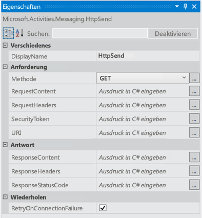
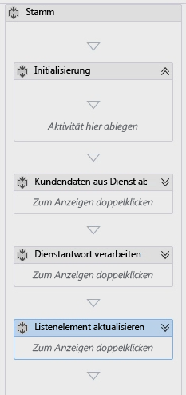
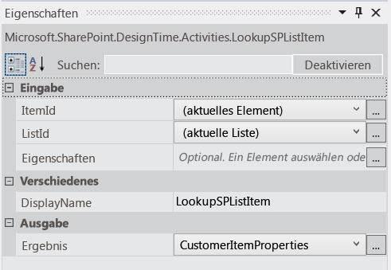
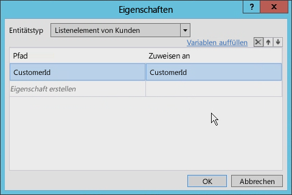
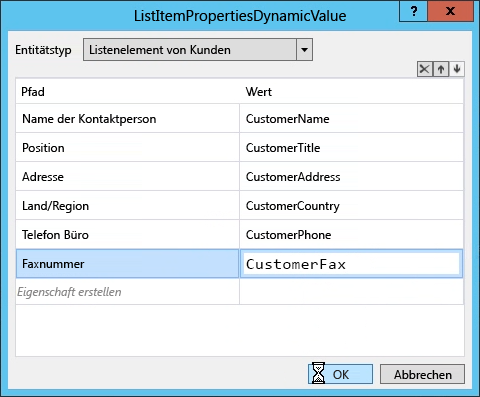
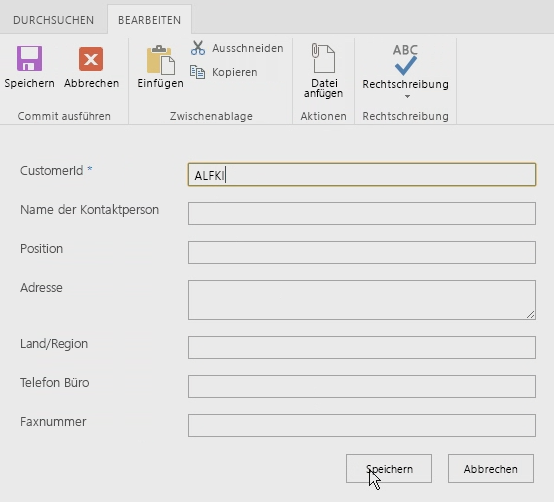

# Arbeiten mit Webdiensten in SharePoint-Workflows mit Visual Studio 2012
In diesem Artikel wird beschrieben, wie Sie Webdienste in Visual Studio 2012-basierten SharePoint-Workflows verwenden können. **Bereitgestellt von:**[Andrew Connell]((http://social.msdn.microsoft.com/profile/andrew%20connell%20%5bmvp%5d/)), [AndrewConnell.com]((http://www.andrewconnell.com))
  
> [!NOTE] 
> Dieser Artikel enthält ein durchgängiges Codebeispiel. Sie können es nutzen, um die Informationen im Artikel nachzuvollziehen, oder es als Grundlage für die Erstellung eigener SharePoint-Workflows verwenden. Herunterladen können Sie den Code in der MSDN Code Gallery unter [Arbeiten mit Webdiensten in SharePoint-Workflows mithilfe von Visual Studio 2012]((http://code.msdn.microsoft.com/Working-with-Web-in-46148199)). 
  
    
    

  
    
    
In der neuesten SharePoint-Version setzt Microsoft in Bezug auf Workflows auf eine vollkommen andere Strategie als noch in früheren Versionen. Das Workflow-Team hat zusammen mit dem Azure-Team ein neues Produkt entwickelt: Workflow-Manager. Workflow-Manager fungiert als hochverfügbarer und skalierbarer Host für die neueste Version der Windows Workflow Foundation-Laufzeit (Version 4) sowie alle erforderlichen Dienste. Dabei nutzt das Tool den Microsoft Azure Service Bus, um hohe Leistung und Skalierbarkeit sicherzustellen. Einmal bereitgestellt, bietet es immer denselben Funktionsumfang, ob in einer lokalen Bereitstellung oder in einer Bereitstellung in der Cloud. Nach der Bereitstellung wird SharePoint an die Workflow-Manager-Farm angebunden und so konfiguriert, dass die gesamte Workflowausführung sowie alle zugehörigen Tasks an die Farm übergeben werden. Eine der wichtigsten Änderungen in der neuen Workflowarchitektur: Alle benutzerdefinierten Workflows in SharePoint sind jetzt vollständig deklarativ, auch Workflows, die in Visual Studio 2012 erstellt wurden. In früheren SharePoint-Versionen waren in Visual Studio 2012 erstellte Workflows nicht ausschließlich deklarativ. Sie kombinierten stattdessen deklarativen XAML-Code mit einer kompilierten Assembly. Die verwaltete Assembly enthielt die Geschäftslogik des Workflows. Als erfahrener SharePoint-Entwickler sind Sie von dieser Neuerung möglicherweise sehr überrascht und fragen sich, wie Sie Ihre benutzerdefinierte Geschäftslogik ohne eine kompilierte Assembly implementieren sollen. Microsoft empfiehlt, dass Sie stattdessen einen benutzerdefinierten Webdienst erstellen, idealerweise einen WCF-, OData- oder RESTful-Webdienst, der Daten im JSON (JavaScript Object Notation)-Format zurückgibt. Diesen können Sie mit den neuen Aktivitäten und Objekten aus der neuen Version kombinieren. 
## Szenarien für die Verwendung von Webdiensten in SharePoint-Workflows

Es ist nicht schwierig Szenarios vorstellbar, in dem Sie einen benutzerdefinierten Webdiensten in einem Workflow SharePoint nutzen würden. Entwickler, die erstellten Workflows mit SharePoint 2007 oder SharePoint 2010 sind die Arbeit mit benutzerdefiniertem Code vertraut, da diese Workflows grundsätzlich programmgesteuerten wurden. Es wurden nicht erforderlich, diese Workflows benutzerdefinierten Code hinzufügen, aber dies also durchaus üblich war.
  
    
    
Mit SharePoint Workflows als rein deklarative müssen vielen Fällen, in dem Sie benutzerdefinierten Code geschrieben haben, können, nun mit Code aus einer externen Webdienst, der aufgerufen und Identitätsdaten durch den Workflow verarbeitet werden. 
  
    
    
SharePoint Workflows können jede Art von Webdienst nutzen. Dies bedeutet, dass am einfachsten kann für Workflows mit Webdiensten interagieren, die Daten mithilfe der Open Data Protocol ( **OData** ) übergeben, wie in den Formaten **Atom** oder **Json** bereitgestellt. OData ist am besten, da sie vollständig vom SharePoint Workflow authoring-Tools ( SharePoint Designer 2013 und Visual Studio 2012 ) unterstützt wird.
  
    
    
Darüber hinaus werden sowohl anonyme Webdienste als auch geschützte mit verschiedenen Typen von Authentifizierung unterstützt. Tatsächlich müssen Sie die vollständige Kontrolle über die Anforderung und Antwort für jeden Dienst Anruf behandeln. Folglich beispielsweise können Sie eine Reihe von Aktivitäten innerhalb eines Workflows verwenden, um zuerst authentifizieren einen Dienst verwenden, um ein OAuth-Token abzurufen und fügen Sie dann das Token in zukünftige Anforderungen zu Diensten mit  [OAuth 2.0]((http://oauth.net/2/))gesichert.
  
    
    

## Nutzen von Webdiensten in workflows

Arbeiten mit Webdiensten SharePoint Workflows umfasst zwei Phasen. Die erste ist einfach den Webdienst aufrufen mithilfe einer neuen **HttpSend** Aktivitätsfeeds eingeführt mit SharePoint möchten. Rufen Sie in die einfachste Webdienste oder für komplexere Aufgaben, bietet HTTP-Verben und bietet bestimmte HTTP-Header **HttpSend** können. Abbildung 1 zeigt viele der Eigenschaften, die für die Aktivität **HttpSend** verfügbar sind.
  
    
    

**Abbildung 1. Eigenschaftenfenster für die Aktivität HttpSend**

  
    
    

  
    
    

  
    
    
Sie müssen auch den Methodentyp angeben, in der Service-Anforderung verwendet werden soll. Beachten Sie in Abbildung 1, die in der **fordern** Sie blockieren kann die Methode (in diesem Fall **GET**) angeben. Verfügbaren Optionen umfassen **GET**, **PUT**, **POST**und **DELETE** (obwohl anderen vorhanden sind). Dies ist die primäre Methode anzuweisen, Webdienste, insbesondere Rest-Dienste, was zu tun ist für die Ressource in der URI der Aktivität definiert.
  
    
    
Beispielsweise, um alle Eigenschaften eines bestimmten Elements erhalten möchten, würde der **Uri** eindeutige Adresse des Elements enthalten, und die Methode auf **GET**fest. Um das Element zu löschen, bleiben die **Uri** würde dieselbe eindeutige-Adresse des Elements, aber die Methode würde auf **DELETE**festgelegt werden. Dies gilt auch für das Aktualisieren eines Elements mit Ausnahme die-Methode würde **POST**festgelegt werden. Bei der Erstellung eines Elements, würde der **Uri** zeigen Sie auf die eindeutige Adresse der Auflistung, in dem das Element erstellt werden soll, und die Methode auf **POST**fest. Beim Erstellen oder Aktualisieren von Elementen, Dienste die Daten erfordern zu verwenden, was als Inhalt in der Anforderung übergeben wird, mit der **RequestContent** -Eigenschaft für die Aktivität **HttpSend** angegeben.
  
    
    
Die zweite Phase der Verwendung von Webdiensten, den wir möchten abdecken umfasst das Senden oder Empfangen von Daten von einem Webdienst. Unabhängig davon, ob Sie die **RequestContent** oder **ResponseContent** -Eigenschaften für die Aktivität **HttpSend** verwenden), können Sie übergeben die Daten als eine komplexe Struktur, die als JavaScript Object Notation (JSON) Zeichenfolgen formatiert sind. Die gute Nachricht ist Ihnen keine erstellen und diese Zeichenfolgen Json manuell bearbeiten. Microsoft bietet Ihnen stattdessen einen neuen Objekttyp [DynamicValue](http://msdn.microsoft.com/en-us/library/windowsazure/jj193446%28v=azure.10%29.aspx), die Ihre Aufgabe erheblich erleichtert. 
  
    
    
 **DynamicValue** -Objekte können hierarchische Datenspeicher sowie speichern die Antwort von einem Webdienst aufzurufen. Es ist außerdem eine Reihe von Aktivitäten im Zusammenhang mit **DynamicValue** -Objekten, die Sie verwenden können, um die Anzahl der Elemente in der Antwort, Extrahieren von Werten aus der Antwort oder Erstellen einer neuen Struktur für aktualisieren oder Erstellen von Elementen.
  
    
    

## Erstellen von Webdiensten für SharePoint-Workflows

Mit der Unterstützung für das Aufrufen von Webdiensten und mangelnde Unterstützung von benutzerdefiniertem Code innerhalb von Workflows müssen Entwickler nun wissen, wie Sie Dienste erstellen. Es gibt viele Optionen zum Erstellen von benutzerdefinierten Webdiensten für die Verwendung in SharePoint Workflows. Die **HttpSend** Aktivität und Datentyp **DynamicValue** sind am besten für Rest-Dienste und mit denen das OData-Protokoll entsprechen.
  
    
    
OData ist ein Protokoll für das Erstellen und Verarbeiten von Daten basierend auf den Prinzipien von REST-Dienste. Es wurde in einführen, um den Austausch von Daten unter Verwendung des HTTP-Protokolls ausgereiften, zuverlässige und robuste standardisieren entwickelt. Nach die OData-Spezifikation abgeschlossen werden konnte, implementiert verschiedene Organisationen das Protokoll auf ihren eigenen Stapeln Technologie. Microsoft implementiert eine eigene Version der OData und Branding-es  [Windows Communication Foundation (WCF) Data Services 5.0](http://msdn.microsoft.com/en-us/library/hh487257%28v=vs.103%29.aspx).
  
    
    
Die Rest-Dienste durch SharePoint implementiert unterstützen tatsächlich OData, da sie mithilfe von WCF Data Services insbesondere WCF Data Services 5.0, das die 3.0 OData-Spezifikation implementiert erstellt wurden.
  
    
    

### Implementieren von OData-Dienst CRUD-Q-Vorgänge

Häufig verwendet für Webdienste führt einfache erstellen, lesen, aktualisieren, löschen und Abfragen Vorgänge auf Daten in einer Datenbank (CRUD-F). Erstellen einen OData-Dienst für die Verwendung mit einem Workflow SharePoint ist ganz einfach mithilfe von WCF. Unter der Voraussetzung, dass Sie eine vorhandene Datenbank verfügen, es sind vier kurze Schritte, die eine sehr geringe Codierung erforderlich:
  
    
    

1. Ein Modell von der Datenbank mithilfe der  [Entity Framework](http://msdn.microsoft.com/en-us/library/bb399567%28v=vs.110%29.aspx)zu erstellen. Es ist kein Code erforderlich (Visual Studio, bietet einen Assistenten).
    
  
2. Erstellen einer neuen WCF Data Service. Es ist kein Code erforderlich (Visual Studio bietet einen Assistenten).
    
  
3. Festlegen Sie in der Codedatei Service des Namens des das Entitätsmodell (erstellte in Schritt 1 #) auf die Quelle des Diensts, und klicken Sie dann festlegen Sie den Zugriff und die Berechtigung für die Entitäten im Modell. Beide Schritte benötigen weniger als zwei Codezeilen.
    
  
4. Veröffentlichen Sie den Dienst an einem Speicherort, auf den Workflow-Manager zugreifen kann.
    
  

### Implementieren von OData-Dienst-Vorgänge

Sie mithilfe von Webdiensten ausführen möchten einer anderen Aufgabe wird Geschäftslogik, die nicht angepasst werden kann in das Modell CRUDQ ausgeführt. Beispiel: haben Sie einen OData-Dienst, der CRUD-Q-Vorgänge für das Erstellen von neuen Bankdarlehen unterstützt. Nehmen Sie an, dass dieser Dienst unterstützt auch die Consumer Aufrufen des Diensts und Bereitstellen einer Credit Score zum Abrufen einer aktuellen Zinssatz für einen künftigen Kredit. Diese Art von Aufgabe fällt nicht in das Modell CRUDQ inzwischen Ruft eine Methode auf und übergibt in eine ganze Zahl und eine Antwort erhalten.
  
    
    
OData und WCF-Datendienste unterstützen dieses Szenario, indem mit  [Dienstvorgänge](http://msdn.microsoft.com/en-us/library/cc668788%28v=vs.110%29.aspx)bereitgestellt. Dienstvorgänge sind allgemeine und sogar dienen innerhalb der SharePoint-Dienste, beispielsweise beim Abrufen einer bestimmten Liste mit der Adresse  `http://[..]/_api/web/lists/GetByTitle('ListTitle')`. Die **GetByTitle** -Methode ist ein Service-Operator, der das Team SharePoint erstellt. Entwickler Erstellen ihrer eigenen benutzerdefinierten Dienstvorgänge in benutzerdefinierten Webdiensten, die mithilfe von WCF Data Services erstellt.
  
    
    

## Exemplarische Vorgehensweise: Erstellen eines Workflows mit Visual Studio 2012

Die folgende exemplarische Vorgehensweise veranschaulicht, wie zum Erstellen eines benutzerdefinierten Workflows, das in der Northwind-Datenbank einen OData-Webdienst aufruft. Sie können die Nordwind-Datenbank gehostet unter  [OData.org]((http://www.odata.org))suchen. 
  
    
    
Wenn der Workflow abgeschlossen ist, Benutzer eine Kunden-ID eingeben und dann den Workflow starten. Beim Starten der Workflow zusätzliche Kundeninformationen abgerufen und aktualisiert das Listenelement mit die abgerufene Daten.
  
    
    

1. Starten Sie Visual Studio 2012, und erstellen Sie ein neues SharePoint gehosteten app-Projekt.
    
  
2. Erstellen Sie in diesem Projekt eine neue benutzerdefinierte Liste, und nennen Sie sie "Kunden".
    
  
3. Erstellen Sie in dieser Liste neue die folgenden Felder aus. Lassen Sie den Standarddatentyp für jedes Feld als **string**:
    
  - CustomerId (aus dem Feld Standard "Titel" umbenannt)
    
  
  - Name des Kunden
    
  
  - Position
    
  
  - Adresse
    
  
  - Land/Region
    
  
  - Telefon Büro
    
  
  - Faxnummer
    
  
4. Nun, Hinzufügen eines Workflows auf das Projekt, indem Sie auf klicken Sie im **Projektmappen-Explorer** auf **Hinzufügen** > **Neues Element**; Wählen Sie dann im Dialogfeld **Neues Element hinzufügen** das Projektelement **Workflow** aus der Kategorie **Office/SharePoint**.
    
  
5. Nennen Sie den Workflow "CompleteCustomerDetails", und klicken Sie auf **Weiter**.
    
  
6. Bei Aufforderung durch den **Assistenten zum Anpassen von** nennen Sie den Workflow "Vollständige Kundendetails", und legen sie **einen Listenworkflow** sein. Klicken Sie auf **Weiter**.
    
  
7. Klicken Sie auf der nächsten Seite des Assistenten das Kontrollkästchen Sie, um eine Zuordnung zu erstellen, wählen Sie aus der Liste **Customer** wählen und dann **Neu erstellen** für den Workflow-Listen Verlauf und Aufgabe. Klicken Sie auf **Weiter**.
    
  
8. Klicken Sie auf der letzten Seite des Assistenten Kontrollkästchen Sie, um den Workflow manuell starten; Lassen Sie die Option für den automatischen start **aufheben** -überprüft. Klicken Sie auf **Fertig stellen**.
    
  
9. Zu diesem Zeitpunkt zeigt Visual Studio die Designeroberfläche Workflow, die eine einzelne **Sequence** Aktivität enthält.
    
  
10. Ändern des Namens der **Sequence**-Aktivität in **Stamm**.
    
  
11. Fügen Sie vier weitere **Sequence** Aktivitäten innerhalb der Stamm-Aktivität hinzu, und nennen Sie sie wie folgt:
    
  - Initialisierung
    
  
  - Abrufen von Kundendaten aus Service
    
  
  - Process Webdienstantwort
    
  
  - Listenelement aktualisieren
  
    
    

    
  
12. Zu diesem Zeitpunkt wird der Workflow angezeigt, wie in Abbildung 2 dargestellt.
    
   **Abbildung 2. Vollständige Kunden Details Workflow mit vier leere Sequences**

  

  
  

  

  

### Rufen Sie die Kunden-ID, die vom Benutzer eingegebene

Ausführen der Workflow muss zunächst wird die Kunden-ID abrufen vom Benutzer eingegeben wurde. Zu diesem Zweck müssen Sie zwei Variable zu erstellen.
  
    
    

1. Klicken Sie auf der Registerkarte **Variablen** im unteren Teil der Workflow-Designer, und erstellen Sie zwei Variablen
    
  - **CustomerItemProperties** (Datentyp = **DynamicValue**; Bereich = **Init**). Verwenden Sie diese Variable zum Speichern des Resultsets von der Aktivität, die alle Eigenschaften aus dem Listenelement abruft.
    
    > [!NOTE] 
    > Der Datentyp **DynamicValue** wird nicht standardmäßig angezeigt. Sie finden ihn über die Option **Nach Typen suchen** in der Spalte **Variablentyp**. Geben Sie in das Suchfeld oben im Dialogfeld **DynamicValue** ein, und klicken Sie dann auf **Microsoft.Activities.DynamicValue**. 

  - **CustomerId** (Datentyp = **String**, Bereich = **Root**): In dieser Variable wird die vom Benutzer eingegebene Kunden-ID gespeichert.
    
  
2. Suchen Sie die **LookupSpListItem**-Aktivität im Abschnitt **SP - Liste** der Toolbox, und ziehen Sie es an die **Init**-Sequenz. Legen Sie die Aktivitätseigenschaften, wie in Abbildung 3 dargestellt.
    
   **Abbildung 3. Eigenschaftenfenster für die Aktivität LookupSPListItem**

  

  
  

    Diese Aktivität weist Workflow-Manager der SharePoint-REST-API verwenden, um die Eigenschaften des aktuellen Listenelements abzurufen und die **JSON** -Antwort in der Variablen **DynamicValue** zu speichern, die Sie gerade erstellt haben.
    
  
3. Rufen Sie die Kunden-ID aus dem Listenelement, indem Sie auf den Link Eigenschaften erhalten möchten , in der **LookupSpListItem**-Aktivität. Auf diese Weise fügt eine **GetDynamicValueProperties**-Aktivität auf die Entwurfsoberfläche.
    
  
4. Klicken Sie im Dialogfeld **Eigenschaften** auf das Auslassungssymbol (**???**), um die Eigenschaftenauswahl zu öffnen (Abbildung 4). Wählen Sie im Assistenten für **Entitätstyp** die Option **List Item of Customers** aus. Fügen Sie dann wie in der Abbildung unten gezeigt eine einzige Eigenschaft hinzu (CustomerId), mit „CustomerId“ unter „Pfad“ und „CustomerId“ unter „Assign To“ („CustomerId“ ist die zuvor erstellte Variable). 
    
  
5. Klicken Sie auf **Eigenschaft erstellen**, und geben Sie **CustomerId** in die Spalte **Pfad** ein.
    
  
6. Geben Sie in der Spalte **Zuordnen zu** **CustomerId**, ist die Variable, die wir zuvor erstellt haben. Abbildung 4 zeigt das Dialogfeld abgeschlossene **Eigenschaften**.
    
   **Abbildung 4. Dialogfeld "Eigenschaften" für die GetDynamicValueProperties-Aktivität.**

  

  
  

  

  

### Rufen Sie den Northwind-OData-Webdienst

Der Workflow hat jetzt einen Verweis auf die Kunden-ID, sodass im nächste Schritt wird den Webdienst aufzurufen. Zu diesem Zweck arbeiten wir in erster Linie mit der Sequenz **Kundendaten vom Dienst abrufen**.
  
    
    

1. Wählen Sie die Sequenz **Kundendaten vom Dienst erhalten möchten**, und erstellen Sie zwei neue Variablen:
    
  - **NorthwindServiceUri** (Datentyp = **String**; Bereich = **Customer Daten vom Dienst abrufen** ). Diese Variable speichert den URI, der verwendet wird, um den Webdienst abzufragen.
    
  
  - **NorthwindServiceResponse** (Datentyp = **DynamicValue**; Bereich = **Root**): Diese Variable wird die Webdienstantwort speichern.
    
  
2. Um die URL, um den Webdienst Abfragen zu erstellen, starten Sie, indem Sie suchen nach einer Aktivität **zuweisen** in der Workflowtoolbox, und ziehen Sie es der Sequenz **Kundendaten vom Dienst abrufen**. Beachten Sie, dass die Aktivität **weisen** zwei Teilen, die ein Name / Wert-Paar darstellt.
    
  
3. Den linken Teil der Aktivität **weisen** auf **NorthwindServiceUri** festgelegt.
    
  
4. Legen Sie den rechten Teil der Aktivität auf die Zeichenfolge  `"http://services.odata.org/Northwind/Northwind.svc/Customers('" + CustomerId + "')?$format=json"`. Abbildung 5 zeigt die abgeschlossene Aktivität.
    
   **Abbildung 5. Zuweisen von Aktivität zum Festlegen einer Variablen mit dem OData-Dienst verwendet**

  

  
  

  

  
5. Ziehen Sie eine **HttpSend** -Aktivität aus der Toolbox zur Sequenz **Kundendaten vom Dienst erhalten möchten**, unmittelbar auf die Aktivität **zuweisen**.
    
  
6. Legen Sie die Eigenschaften für die **HttpSend**-Aktivität unter Verwendung der Werte, die in Abbildung 6 dargestellt.
    
   **Abbildung 6: HttpSend-Eigenschaften**

  

  
  

  

  

### Verarbeiten der Northwind OData Webdienstantwort

Nachdem die Web-Service-Anforderung wurde und die Ergebnisse in einer lokalen Variablen gespeichert sind, besteht der nächste Schritt Verarbeitung die Antwort. Jeder Wert in der Antwort muss auf eine andere Variable hinzugefügt werden. 
  
    
    

1. Erstellen Sie eine Variable für die einzelnen Felder, die wir am Anfang dieser exemplarischen Vorgehensweise (mit Ausnahme von Kundenfeld-ID) hier gezeigte erstellt:
    
  - Name des Kunden
    
  
  - Position
    
  
  - Adresse
    
  
  - Land/Region
    
  
  - Telefon Büro
    
  
  - Faxnummer
    
  
2. Nennen Sie diese Variablen entsprechend der jeweiligen Feldname.
    
  
3. Alle Variablen sollte vom Typ **String**sein; **Root**sollten alle Variablen zugewiesen werden.
    
  
4. Fügen Sie eine **GetDynamicValueProperties** -Aktivität, der Sequenz **Prozess Service-Anforderung**.
    
  
5. Legen Sie im Fenster **Eigenschaften** für **Source** den Wert **NorthwindServiceRepsonse** fest (siehe Abbildung 7).
    
  
6. Klicken Sie auf die Schaltfläche mit den Auslassungszeichen (**??? **) neben der Eigenschaft **Properties**, und geben Sie Werte in die Spalten **Pfad** und **Assign To** ein (siehe Abbildung 7). Die Werte in der Spalte **Assign To** entsprechen den Variablen, die Sie für die verschiedenen Listenfelder in der Liste **Customers** erstellt haben.
    
   **Abbildung 7: Toolfenster „Eigenschaften“ für „GetDynamicValueProperties“ und Inhalte des Dialogfensters „Eigenschaften“**

  

  
  

  

  

### Das Kunden Listenelement aktualisieren

Der letzte Schritt besteht darin, das Listenelement aktualisieren. 
  
    
    

1. Die Abfolge **Listenelement aktualisieren** einer **UpdateListItem** -Aktivität hinzu, und verwenden Sie das Fenster **Eigenschaften** die folgenden Werte festgelegt:
    
  - **ListID:** (aktuelle Liste)
    
  
  - **ItemId:** (aktuelles Element)
    
  
2. Klicken Sie auf die Schaltfläche mit den Auslassungszeichen (**??? **) neben der Eigenschaft **ListItemPropertiesDynamicValues**. Ein Dialogfeld wird geöffnet. Wählen Sie hier für **Entitätstyp** die Option **List Item of Customers** aus. 
    
  
3. Schließlich für jede der Werte aus dem Webdienst extrahiert haben, legen Sie die Werte für das Listenelement an den Variablen im Workflow, wie in Abbildung 8 dargestellt.
    
   **Abbildung 8. Dialogfeld mit festgelegten Werten ListItemPropertiesDynamicValue**

  

  
  

  

  

### Testen des Workflows

Der Workflow ist nun abgeschlossen und sollte ordnungsgemäß funktionieren. Um die Stabilität zu bestätigen, sollten Sie sie testen.
  
    
    

1. Drücken Sie **F5**, um das Debuggen zu starten. Visual Studio wird erstellt und die SharePoint-hosted app.
    
  
2. Wenn im Browser geöffnet wird, navigieren Sie zu der Liste der **Kunden**, erstellen Sie einen einzelnen Kunden-Datensatz mit einer **Kunden-Id** "ALFKI", wie in Abbildung 9 dargestellt, und speichern Sie das Element.
    
   **Abbildung 9: Neues Listenelement**

  

  
  

  

  
3. Im nächsten Schritt den Workflow manuell starten, und klicken Sie dann auf das Listenelement zurück. Aktualisieren Sie die Seite, um den Workflow, der das Listenelement aktualisieren finden Sie unter wie in Abbildung 10 dargestellt.
    
   **Abbildung 10: Aktualisiertes Listenelement**

  

  
  

    Beachten Sie, dass das Listenelement, durch den SharePoint aktualisiert wurde gehosteten app im Namen der Person, die den Workflow gestartet hat. In dieser exemplarischen Vorgehensweise wurde jedoch vom Administrator auslösen.
    
  

## Schlussbemerkung

SharePoint eingeführt, eine neue Workflowarchitektur, die durch ein neues Produkt vereinfacht: Workflow-Manager 1.0. Um sicherzustellen, dass alle benutzerdefinierten Workflows unabhängig von der SharePoint Bereitstellungsoption lokale oder gehostete in Office 365, woher sind alle Workflows jetzt 100 % deklarativen. Aus diesem Grund benutzerdefinierte Geschäftslogik, die zuvor als benutzerdefinierten Code in Visual Studio erstellten Workflows in früheren Versionen von SharePoint implementiert werden nicht mehr unterstützt. 
  
    
    
 Unterstützung für das Aufrufen von Webdiensten in Workflow-Manager mithilfe der neuen **HttpSend** -Aktivität, Microsoft eingeführt. Workflow-Manager eingeführt auch Unterstützung für das Erstellen von Strukturen, an die Webdienste gesendet sowie zum Verarbeiten von deren Antworten, die den Datentyp **DynamicValue** aufgerufen. Beim Erstellen von Workflows, verwenden Sie diese Datentyp und zugehörige Aktionen in zu vereinfachen, erstellen und nutzen robuste Geschäftsprozesse in SharePoint Workflows mithilfe von externen Webdiensten.
  
    
    

## Siehe auch

-  
  [Arbeiten mit komplexen Daten in einem workflow](http://msdn.microsoft.com/en-us/library/windowsazure/jj193446%28v=azure.10%29.aspx)
    
  
-  [Workflows in SharePoint]((http://msdn.microsoft.com/de-DE/library/jj163986.aspx))
    
  

