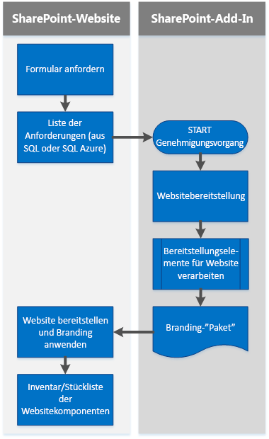

# Branding und Websitebereitstellungslösungen für SharePoint Server 2013, SharePoint Server 2016 und SharePoint Online

Die Einführung des Cloud-Add-In-Modells und von Add-Ins für SharePoint bietet Alternativen zu den vorhandenen, etablierten Verfahren für das Branding und die Bereitstellung von SharePoint-Websites. 

_**Gilt für:** Office 365 | SharePoint Server 2013 | SharePoint Server 2016 | SharePoint Online_

Bis jetzt haben Sie möglicherweise das SharePoint-Feature-Framework, Websitevorlagen, Webvorlagen und Websitedefinitionen verwendet, um Websites und Websitesammlungen bereitzustellen. Das Remotebereitstellungsmuster zeigt Ihnen, wie Sie benutzerdefinierte Add-Ins für SharePoint erstellen, die Websitebranding bereitstellen und andere Aufgaben bei der Websitebereitstellung ausführen.
Die Artikel in diesem Abschnitt bieten Informationen zur Verwendung von Add-Ins für SharePoint zum Bereitstellen und Verwalten von Websitebranding, einem Muster, das manchmal auch als „Remotebereitstellung“ bezeichnet wird.

## Was Sie über SharePoint wissen müssen

Um die Funktionen für das Branding und die Websitebereitstellung in SharePoint-Website verwenden zu können, müssen Sie Folgendes kennen:

- Wichtige SharePoint-Begriffe und -Konzepte.
    
- Die Hierarchie der Strukturelemente von SharePoint.
    
- Die verschiedenen Arten von SharePoint-Websites und deren Verwendungszweck.
    
- Das Dateisystem und die Inhaltsdatenbanken, und wie diese zusammenarbeiten.
    
- Die Dateianpassungsstatus und deren langfristige Auswirkungen auf Upgrades.
    
- Add-Ins für SharePoint.
    
- Die clientseitige Programmierung in SharePoint mit dem clientseitigen Objektmodell (CSOM) von .NET und REST-APIs.

## Wichtige SharePoint-Begriffe und -Konzepte

Die folgende Tabelle enthält Begriffe und Konzepte, die Sie kennen sollten, bevor Sie die SharePoint-Websitebereitstellung und das Branding mit dem Remotebereitstellungsmodell zum ersten Mal verwenden.

**Wichtige SharePoint-Begriffe und -Konzepte**

|**Begriff oder Konzept**|**Beschreibung**|**Weitere Informationen**|
|:-----|:-----|:-----|
|App für SharePoint|Einfache Webanwendungen, die häufig verwendete Webstandards und -technologien integrieren, um die Funktionen einer SharePoint-Website durch das Cloud-Add-in-Modell zu erweitern.| [Erstellen von Add-Ins für SharePoint]((http://msdn.microsoft.com/library/37727101-0692-4652-a481-e6d6379cf921.aspx))|
|App-Web|Die Website, von der das Add-In bereitgestellt wird.| [Hostwebsites, Add-In-Websites und SharePoint-Komponenten in SharePoint 2013]((http://msdn.microsoft.com/library/b791cdf5-8aa2-47fa-bc4c-aee437354759.aspx))|
|Genehmigungsworkflow|Spezielle Workflows für Veröffentlichungssites, die angeben, wer die Veröffentlichung einer Seite genehmigt und wann.| [SharePoint 2013-Genehmigungsworkflow]((http://blogs.msdn.com/b/thirusrinivasan1/archive/2013/10/31/sharepoint-2013-workflow-calling-a-wcf-service.aspx)), [Erste Schritte mit Workflows in SharePoint 2013]((http://msdn.microsoft.com/library/a2643cd7-474d-4e4c-85bb-00f0b6685a1d.aspx))|
|ClientContext|Ein zentrales Objekt, das als „Mittelpunkt“ für alle SharePoint-CSOM und -JSOM-Vorgänge verwendet wird.| [T:Microsoft.SharePoint.Client.ClientContext]((https://msdn.microsoft.com/de-DE/library/office/microsoft.sharepoint.client.clientcontext.aspx))|
|Cloud-Add-In-Modell |Add-Ins für SharePoint sind eigenständige Funktionalitäten, die die Funktionen einer SharePoint-Website erweitern. Sie können das Cloud-Add-In-Modell verwenden, um sichere, zuverlässige, flexible und konsistente Add-Ins für SharePoint zu entwickeln und bereitzustellen.| [Übersicht über Add-Ins für SharePoint]((http://msdn.microsoft.com/library/cd1eda9e-8e54-4223-93a9-a6ea0d18df70.aspx))|
|Inhaltsdatenbank|In Inhaltsdatenbanken wird der gesamte Inhalt einer Websitesammlung gespeichert, darunter: <ul xmlns:xlink="http://www.w3.org/1999/xlink" xmlns:mtps="http://msdn2.microsoft.com/mtps" xmlns:mshelp="http://msdn.microsoft.com/mshelp" xmlns:ddue="http://ddue.schemas.microsoft.com/authoring/2003/5" xmlns:msxsl="urn:schemas-microsoft-com:xslt"><li>
Websitedokumente und Dateien in Dokumentbibliotheken
</li><li>
Listendaten
</li><li>
Webparteigenschaften
</li><li>
Benutzernamen und -rechte
</li></ul>| [Datenbanktypen und -beschreibungen]((https://technet.microsoft.com/de-DE/library/cc678868.aspx))|
|CSOM|„Client-Side Object Model“. Ein Modell zum Schreiben von clientseitigem Code für SharePoint mit .NET Framework.| [Erste Schritte der Verwendung des Clientobjektmodells mit externen Daten in SharePoint 2013]((http://msdn.microsoft.com/library/8ed91929-fdb6-4fde-ba2a-7942870575f3.aspx)) 
  [[MS-CSOM]: SharePoint-Clientabfrageprotokoll](https://msdn.microsoft.com/en-us/library/dd912094%28v=office.15%29.aspx) [Index für SharePoint 2013 .NET Server, CSOM, JSOM und REST-API]((http://msdn.microsoft.com/library/fddbb75f-9f6c-46d3-8d95-1d4a5e791dfa.aspx))|
|Struktur|Die physischen Dateien von SharePoint; die Dateien im Dateisystem. Diese Dateien unterscheiden sich von den Inhalten, die in einer Inhaltsdatenbank gespeichert sind. Nachfolgend ist der Speicherort der Struktur angegeben. `%program files%/Common Files/Microsoft Shared/Web Server Extensions/15/`||
|Hostweb|Die Website, auf der das Add-In installiert ist.| [Hostwebsites, Add-In-Websites und SharePoint-Komponenten in SharePoint 2013]((http://msdn.microsoft.com/library/b791cdf5-8aa2-47fa-bc4c-aee437354759.aspx))|
|OneDrive for Business|Eine persönliche Bibliothek zum Speichern und Organisieren von Arbeitsdokumenten, die Sie in Ihrer Organisation freigeben können.| [OneDrive for Business unterscheidet sich von OneDrive](https://support.office.microsoft.com/en-us/article/What-is-OneDrive-for-Business-187f90af-056f-47c0-9656-cc0ddca7fdc2?CorrelationId=2ac1e496-1807-483a-a39f-c1a460efc7af&amp;ui=en-US&amp;rs=en-US&amp;ad=US#differences) [OneDrive for Business unterscheidet sich von Ihrer Teamwebsite](https://support.office.microsoft.com/en-us/article/Should-I-save-my-documents-to-OneDrive-for-Business-or-a-team-site-d18d21a0-1f9f-4f6c-ac45-d52afa0a4a2e?CTT=5&amp;origin=HA102822076&amp;CorrelationId=e3a0512c-ab5f-4ae7-a58f-e33878242936&amp;ui=en-US&amp;rs=en-US&amp;ad=US)|
|Remotebereitstellung|Ein Modell, das Websites anhand von Vorlagen und Code bereitstellt, die außerhalb von SharePoint in einem vom Anbieter gehosteten Add-In ausgeführt werden.| [Websitebereitstellungsmethoden und Remotebereitstellung in SharePoint 2013]((http://blogs.msdn.com/b/vesku/archive/2013/08/23/site-provisioning-techniques-and-remote-provisioning-in-sharepoint-2013.aspx)) [Self-Service-Websitebereitstellung mit Add-Ins für SharePoint 2013]((http://blogs.msdn.com/b/richard_dizeregas_blog/archive/2013/04/04/self-service-site-provisioning-using-apps-for-sharepoint-2013.aspx))|
|REST| Ein zustandsloser Architekturstil, der Architekturelemente abstrahiert und HTTP-Verben zum Lesen und Schreiben von Daten aus Webseiten verwendet, die XML-Dateien enthalten.| [Gewusst wie: Festlegen von benutzerdefinierten Berechtigungen in einer Liste mithilfe der REST-Schnittstelle]((http://msdn.microsoft.com/library/d5fcc26c-4e44-404b-aacf-e9351af8cc7d.aspx))|
|Stammwebsite|Die erste Website innerhalb einer Websitesammlung. Die Stammwebsite wird manchmal auch als „Webanwendungsstamm“ bezeichnet. ||
|SharePoint Online|Ein cloudbasiertes SharePoint-Angebot in Office 365. | 
  [SharePoint Online – Allgemeine Referenz](https://msdn.microsoft.com/en-us/library/office/gg271151%28v=office.14%29.aspx#sectionSection0)|
|Website|Eine Gruppe von Seiten, die denselben Besitzer und dieselben administrativen Einstellungen haben, wie z. B. Berechtigungen.| [T:Microsoft.SharePoint.Client.Web]((https://msdn.microsoft.com/de-DE/library/office/microsoft.sharepoint.client.web.aspx))|
|Websitesammlung|Eine Gruppe von Seiten, die denselben Besitzer und dieselben administrativen Einstellungen haben, wie z. B. Berechtigungen.| [Erstellen einer Websitesammlung in SharePoint 2013]((https://technet.microsoft.com/de-DE/library/cc263094.aspx))|
|Websitebereitstellung|Ein Prozess, bei dem Websites mit den Features, der Struktur, der Marke und andere Funktionen versehen werden.| [Websitebereitstellungsmethoden und Remotebereitstellung in SharePoint 2013]((http://blogs.msdn.com/b/vesku/archive/2013/08/23/site-provisioning-techniques-and-remote-provisioning-in-sharepoint-2013.aspx)) [Self-Service-Websitebereitstellung mit Add-Ins für SharePoint 2013]((http://blogs.msdn.com/b/richard_dizeregas_blog/archive/2013/04/04/self-service-site-provisioning-using-apps-for-sharepoint-2013.aspx))|
|Unterwebsite|Eine einzelne SharePoint-Website in einer SharePoint-Websitesammlung. Eine Unterwebsite kann die Navigation und die Berechtigungen einer übergeordneten Website übernehmen, oder sie kann über eigene Berechtigungen und Navigation verfügen. Sie können Unterwebsites erstellen, die auf der Stammwebsitesammlung basieren, oder Sie können Websites basierend auf anderen Websitesammlungen erstellen. Sie können auch auswählen, ob Sie die Berechtigungen von der Websitesammlung übernehmen oder eigene Berechtigungen für die Unterwebsite festlegen möchten.||

## Hierarchie der Strukturelemente von SharePoint

Konzeptionell wird die Hierarchie von SharePoint-Objekten als Container ausgedrückt: Die Objekttypen und der Hierarchietyp enthalten alle Typen von Objekten, die sich in der Hierarchie darunter befinden. Tabelle 2 führt die Hierarchie von SharePoint-Strukturelementen auf.

**Tabelle 2: SharePoint-Strukturelemente**

|**Objekttyp (in der hierarchischen Struktur)**|**Beschreibung**|
|:-----|:-----|
|Webanwendungen|Anwenden, die auf einem Server vorhanden sind und auf Anforderungen eines Browsers reagieren. Webanwendungen sind die zentrale Struktur in Internet Information Services (IIS). In SharePoint ist eine Webanwendung eine Website mit einer eindeutigen URL und einer separaten Inhaltsdatenbank, die in SQL Server gespeichert ist.|
|Websitesammlungen|Container mit Websites, die Berechtigungen definieren, und die abhängig von der Konfiguration einige Aspekte des Brandings für alle Websites im Container definieren können.|
|Websites|Eine Sammlung von Listen, Bibliotheken, Struktur, Navigationselementen und Elementen für das Aussehen und Verhalten, die in der Regel um ein zentrales Thema oder Design organisiert sind. Websites, die untergeordnete Websites von anderen Websites in derselben Websitesammlung sind, werden auch als „Unterwebsites“ bezeichnet. Eine Unterwebsite ist eine Website, die in einem Unterordner der übergeordneten Website gespeichert ist. Eine Unterwebsite kann die Berechtigungen und die Navigationsstruktur der übergeordneten Website übernehmen. Die Verwaltungs- und Erstellungsberechtigungen können jedoch auch nur für die Unterwebsite gelten. Unterwebsites können über untergeordnete Unterwebsites verfügen.|
|Apps, Listen und Dokumentbibliotheken|Container mit Inhalt und Daten, die in bestimmten Strukturen organisiert sind. Der Gestaltungsvorlagenkatalog ist eine spezielle Dokumentbibliothek in SharePoint 2010-Veröffentlichungswebsites, in dem alle Brandingelemente – Gestaltungsvorlagen, Seitenlayouts, JavaScript-Dateien, CSS und Bilder – standardmäßig gespeichert sind. Jede Website besitzt einen eigenen Gestaltungsvorlagenkatalog. In Teamwebsites stammt die Gestaltungsvorlage von der Website, und nicht aus der Websitesammlung.|
|Elemente|Einzelnen Inhalts- oder Datenbestandteile, die in Add-Ins, Listen und Dokumentbibliotheken enthalten sind.|

## Add-Ins für SharePoint

Add-Ins für SharePoint sind einfache Lösungen, die nicht auf dem SharePoint-Hostserver installiert werden, sodass sie nicht übermäßig viele API-Aufrufe an den Hostserver verursachen. Sie können Add-Ins für SharePoint mit dem Cloud-Add-In-Modell erstellen. Benutzer können Add-Ins im Office Store oder im App-Katalog des Unternehmens finden und von dort herunterladen. Weitere Informationen finden Sie unter [Übersicht über Add-Ins für SharePoint]((http://msdn.microsoft.com/library/cd1eda9e-8e54-4223-93a9-a6ea0d18df70.aspx)). 

## Das Dateisystem und die Inhaltsdatenbanken, und wie diese zusammenarbeiten

Sie müssen Kenntnisse über das SharePoint-Dateisystem und die Inhaltsdatenbanken haben, damit Sie besser über die Brandingoptionen und die Auswirkungen informiert sind, die die Anpassung von Websites auf Upgrades und Migration haben können.

### Dateisystem

SharePoint speichert Dateien im Dateisystem (der „Struktur“, engl. „hive“). 

In SharePoint Server 2013 und SharePoint Server 2016 wird dieser Speicherort als „15-hive“ oder „16-hive“ bezeichnet. 

Nachfolgend ist der Pfad zu diesem Speicherort aufgeführt: 

SharePoint Server 2013 : `%program files%/Common Files/Microsoft Shared/Web Server Extensions/15/` SharePoint Server 2016 : `%program files%/Common Files/Microsoft Shared/Web Server Extensions/16/`

15-hive und 16-hive umfassen mehrere Unterordner, in denen Dateien gespeichert sind, die Sie beim Branding und bei der Bereitstellung von Websites verwenden.

### Inhaltsdatenbanken

Inhaltsdatenbanken speichern SharePoint-Inhaltsobjekte, z. B. Websitesammlungen. Für jede Websitesammlung wird automatisch eine Inhaltsdatenbank installiert, wenn Sie SharePoint Server 2013 oder SharePoint Server 2016 bereitstellen. Der gesamte Inhalt einer Websitesammlung wird in einer Inhaltsdatenbank auf einem Server gespeichert. Eine Inhaltsdatenbank kann jedoch mit mehr als einer Websitesammlung verknüpft sein, und Sie können Inhaltsdatenbanken an eine SharePoint-Webanwendung anhängen. Möglicherweise müssen Sie Inhalt von einer Inhaltsdatenbank in eine andere verschieben, wenn z. B. die Größe des Inhalts bald die Größe der Inhaltsdatenbank überschreitet.

Einige Eigenschaften einer Inhaltsdatenbank können je nach Verwendung der Websitesammlung unterschiedlich sein. Bei einigen Websites kommt es beispielsweise zu häufigen Schreibvorgängen, bei anderen dagegen weniger, z. B. bei schreibgeschützten Dokumenten. Die Nutzung der Inhalte wirkt sich auf die Aspekte der Inhaltsdatenbank aus, z. B. auf die Größe und Leistung. 

## Dateianpassungsstatus und deren Auswirkungen auf Upgrades

Der Status der SharePoint-Dateien und -Inhalte wirkt sich darauf aus, wie einfach es ist, Updates anzuwenden, und er steuert, ob SharePoint die Datei aus der Inhaltsdatenbank oder dem Dateisystem bereitstellt. Standardmäßig sind alle SharePoint-Dateien nicht angepasst und inaktiv und befinden sich im übereinstimmenden Status im SharePoint-Dateisystem und in der Inhaltsdatenbank. Wenn eine Datei, ein Eintrag in der Inhaltsdatenbank oder beides auf bestimmte Weise verwendet oder geändert werden, kann sich dies auf den Status dieser Inhalte auswirken.

**Tabelle 3: Datei- und Inhaltsstatus**

|**Datei- oder Inhaltsstatus**|**Definition**|**Kommentar**|
|:-----|:-----|:-----|
|nicht angepasst|Ein Attribut, das einer Datei zugeordnet ist und das darauf hinweist, dass die Datei noch nicht geändert wurde.|Mehr als eine Kopie einer Datei kann auf dieselbe Quelle verweisen. Dies erleichtert Designern das Implementieren von Änderungen.|
|angepasst|Ein Attribut, das einer Datei zugeordnet ist und das darauf hinweist, dass sie geändert wurde.|Nachdem eine Datei angepasst wurde, wird sie schwieriger, allgemeine Updates anzuwenden. Gehen Sie bei Anpassungen sehr vorsichtig vor. Als allgemeine Regel gilt, das es besser ist, die standardmäßigen SharePoint-Dateien und -Funktionen zu verwenden, als Systemdateien anzupassen oder Anpassungen hinzuzufügen, die manuell aktualisiert werden müssen.|
|verwaist (ghosted)|Eine Datei mit einer Quelle, die außerhalb der Inhaltsdatenbank gespeichert ist.|In der Inhaltsdatenbank (der „Geist“ der Datei) ist weiterhin ein Zeiger vorhanden, der SharePoint darauf hinweist, im Dateisystem des Servers nach der Quelle der Datei zu suchen.|
|nicht verwaist (unghosted)|Eine nicht angepasste Version der Quelldatei befindet sich in der Inhaltsdatenbank.|Beispiel: Der Entwurfs-Manager von SharePoint 2013 erstellt eine Sandkastenlösung, um die Brandingdateien zu packen. Sie wird nie zum Dateisystem des Servers hinzugefügt, sodass die Dateien der Lösung per Definition immer verwaist sind. Die von der Lösung bereitgestellten Dateien befinden sich jedoch immer noch in einem nicht angepassten Zustand. |

> [!NOTE] 
> Wenn eine Datei angepasst wurde, wird sie nicht aktualisiert, wenn Sie neue Servicepacks installieren oder der SharePoint Online-Dienst aktualisiert wird.

## Websitebranding und -bereitstellung mit dem Cloud-Add-in-Modell

In SharePoint Server 2013 oder SharePoint Server 2016 können Sie benutzerdefinierten CSOM-Code in Add-Ins für SharePoint verwenden, um SharePoint-Websitesammlungen, Websites und Unterwebsites mit Brandingelementen bereitzustellen. Dieses Websitebereitstellungsmuster wird als „Remotebereitstellung“ bezeichnet. SharePoint konzentriert sich immer mehr auf cloudbasierte Bereitstellungen. Daher wurde dieses Muster erstellt, damit Sie die vorkonfigurierten Funktionen von SharePoint nutzen können, um Websitebranding auf eine Weise bereitzustellen, durch die die Komplexität und die langfristigen Betriebskosten verringert werden können.

### Was kann ich mit dem Cloud-Add-In-Modell tun?

In einigen Fällen gibt es keine Beziehung zwischen den Features in voll vertrauenswürdigem Code und dem Cloud-Add-In-Modell. Bei der Entwicklung einer Anpassung basierend auf Add-Ins für SharePoint und dem Cloud-Add-In-Modell sollten Sie eine alternative Herangehensweise zu einer direkten Konvertierung erwägen und Anpassungen so einfach wie möglich halten. Im Folgenden finden Sie einige Beispiele:

- Ersetzen von Ereignisempfängern durch Remoteereignisempfänger (siehe [Gewusst wie: Erstellen eines Remoteereignisempfängers]((http://msdn.microsoft.com/library/628c6103-52f9-4d85-9464-4a6862b36640.aspx))).
    
- Ersetzen von Websitevorlagen, Webvorlagen und Websitedefinitionen durch Remotebereitstellung. Dies funktioniert für Unterwebsites und Websitesammlungen.
    
- Ersetzen von Zeitgeberaufträgen durch Microsoft Azure oder lokale [Workerrollen]((https://msdn.microsoft.com/library/azure/jj149831.aspx)).
    
Einige Elemente, wie HTTP-Module und HTTP-Handler, können nicht mit dem Cloud-Add-In-Modell erstellt werden. Bevor Sie versuchen, eine vorhandene Anpassung im Cloud-Add-In-Modell zu replizieren, sollten Sie zuerst beachten, warum diese Anpassungen erstellt wurden und ob ein vorkonfiguriertes SharePoint-Feature funktionieren könnte.

### Remotebereitstellungsmuster

Die Remotebereitstellung verwendet neue Add-In-Muster, um die Bereitstellungslogik ganz aus der SharePoint-Farm auszulagern. Durch diesen Ansatz entfällt die Notwendigkeit, das Featureframework oder andere Anpassungen in der SharePoint-Farm verwenden zu müssen. Stattdessen können Sie Anpassungen außerhalb von SharePoint steuern. Durch diesen Ansatz können Sie das Bereitstellungsmodul aktualisieren und ändern, ohne dabei die Verfügbarkeit von SharePoint zu beeinträchtigen. Weitere Informationen zum Featureframework finden Sie unter [Websitedefinitionen und Bereitstellung: Das Featureframework](https://msdn.microsoft.com/en-us/library/ms454453%28v=office.12%29.aspx). Die Aspekte und die Implementierungen des Remotebereitstellungsmusters sind in diesem Abschnitt ausführlich dokumentiert. Zum Einstieg sind die folgenden Einführungen in das Muster möglicherweise hilfreich:

-  [Self-Service-Websitebereitstellung mit Add-Ins für SharePoint 2013]((http://blogs.msdn.com/b/richard_dizeregas_blog/archive/2013/04/04/self-service-site-provisioning-using-apps-for-sharepoint-2013.aspx))
    
-  [Videoaufzeichnung von Websitebereitstellungmethoden in SharePoint 2013]((http://blogs.msdn.com/b/vesku/archive/2013/09/09/sharepoint-2013-site-provisioning-techniques-presentation-video-recording.aspx))
    
-  [Warum haben wir das SharePoint-Add-In-Muster eingeführt?]((http://blogs.msdn.com/b/vesku/archive/2013/09/06/introduction-to-sp-apps-or-cam.aspx))
    
Bei der einfachsten Implementierung des Remotebereitstellungsmusters sind die Bereitstellungsanforderungen in einer SQL Server- oder SQL Azure-Datenbank oder einer XML-Datei gespeichert. Ein Add-In für SharePoint liest die Anforderungen aus der Datenquelle, liest die Brandingelemente aus dem Quellspeicherort und wendet Brandingelemente basierend auf den Bereitstellungsanforderungen auf die Zielwebsite an.

Die Codebeispiele für Branding und Bereitstellung folgen dieser Abfolge von Ereignissen, um das Remotebereitstellungsmuster zu zeigen.

**Tabelle 4: Grundlegende Remotebereitstellungsabfolge und zugehörige Beispiele**

|**Schritt**|**Beschreibung**|**Beispiele**|**Artikel**|
|:-----|:-----|:-----|:-----|
|1|Der Benutzer fordert eine Änderung an der Website in einem Formular an, wodurch ein Genehmigungsworkflow angestoßen wird. Die Daten, die der Benutzer mithilfe des Anforderungsformulars übermittelt, werden potenziell in jedem möglichen Datenspeicherformat (SQL, SQL Azure, XML) gespeichert.| 
[SharePoint 2013: Verwenden eines Workflows zum Bereitstellen einer SharePoint-Website (Hostweb)]((https://code.msdn.microsoft.com/SharePoint-2013-Use-e2ee88dd))

[SharePoint 2013: Verwenden eines Workflows zum Bereitstellen einer SharePoint-Website (App-Web)]((https://code.msdn.microsoft.com/SharePoint-2013-Use-2b96feb7))
| [SharePoint 2013-Websitebereitstellung](sharepoint-site-provisioning-solutions.md)|
|2|Wenn der Workflow genehmigt wurde, ruft das Add-In für SharePoint die gespeicherten Daten ab und stellt die Website entsprechend den Metadaten bereit, die der Benutzer in Schritt 1 übermittelt hat.| 
[Bereitstellen von Websites in Batches mit dem Add-In-Modell]((https://code.msdn.microsoft.com/Provision-sites-in-batches-fcf31bc6))

[SharePoint 2013: Verwenden eines Workflows zum Bereitstellen einer SharePoint-Website (Hostweb)]((https://code.msdn.microsoft.com/SharePoint-2013-Use-e2ee88dd))

[SharePoint 2013: Verwenden eines Workflows zum Bereitstellen einer SharePoint-Website (App-Web)]((https://code.msdn.microsoft.com/SharePoint-2013-Use-2b96feb7))

[SharePoint 2013: Verwenden des Add-Ins für SharePoint zum Breitstellen einer lokalen Websitesammlung]((https://code.msdn.microsoft.com/SharePoint-2013-Use-apps-9094e012))
| [SharePoint 2013-Websitebereitstellung](sharepoint-site-provisioning-solutions.md)|
|3|Das Add-In für SharePoint plant die Bereitstellung entsprechend den Anweisungen im Anforderungsformular, indem es die im Add-In-Web und in der Inhaltsdatenbank verfügbaren Daten heranzieht. In dieser Phase werden die entsprechenden Brandingelemente auf der Website bereitgestellt.| 
[SharePoint 2013: Verwenden eines Add-Ins für SharePoint zum Konfigurieren von CSS]((https://code.msdn.microsoft.com/SharePoint-2013-Use-an-app-c5d78f25))

[SharePoint 2013: Verwenden eines Add-Ins für SharePoint zum Anwenden eines Designs auf eine SharePoint-Website]((https://code.msdn.microsoft.com/SharePoint-2013-Use-an-app-d90a49e3))

[SharePoint 2013: Branding einer OneDrive For Business-Website in SharePoint]((https://code.msdn.microsoft.com/SharePoint-2013-Brand-a-6da627cb))

[SharePoint 2013: Bereitstellen eines angepassten CSS auf einer Website mit Remotebereitstellung]((https://code.msdn.microsoft.com/SharePoint-2013-Provision-bf1d878a))

[SharePoint 2013: Verwenden eines Add-Ins für SharePoint zum Bereitstellen eine Wiki-Seite]((https://code.msdn.microsoft.com/SharePoint-2013-Use-an-app-5db977e8))
|
[SharePoint-Seiten und das Seitenmodell](SharePoint-pages-and-the-page-model.md)

[Lösungen für das SharePoint-Websitebranding und die Seitenanpassung](SharePoint-site-branding-and-page-customization-solutions.md)

[SharePoint 2013-Websitebereitstellung](sharepoint-site-provisioning-solutions.md)|

> [!NOTE] 
> Tabelle 4 listet die Schritte auf, die möglicherweise für ein Remotebereitstellungsszenario typisch sind. Die von Ihnen verwendeten Beispiele hängen von dem Ansatz ab, der die Anforderungen des Unternehmens am besten erfüllt. Wenn Sie zum Beispiel keinen benutzerdefinierten Genehmigungsworkflow in Ihrem Unternehmen benötigen, verwenden Sie dieses Beispiel nicht. 

**Abbildung 1: Beispiel für einen Websitebereitstellungs- und Brandingworkflow mit dem Remotebereitstellungsmuster**

### Auswirkungen der Remotebereitstellung auf bereits vorhandenen Website-Inhalt

Abhängig von den bestimmten Websiteelementen, die Sie bereitstellen möchten, überschreibt Ihr Code den standardmäßigen oder bereits vorhandenen Website-Inhalt durch einen Hook für das Remotebereitstellungs-Add-In für SharePoint. Das Add-In wählt Websitevorlagen und andere Funktionen basierend auf den Bereitstellungsanforderungen aus, die in der Datenbank gespeichert sind, ohne dass SharePoint konfiguriert wird.

Das grundlegende Remotebereitstellungsmuster bleibt unabhängig von weiteren Anforderungen das gleiche. Wenn Sie jedoch beabsichtigen, dieses Muster zum Bereitstellen von Websitebranding zu verwenden, passen Sie Ihre Markenentwicklungsstrategie im Kontext der Anpassungsfunktionen an, die von CSOM-, JSOM- und REST-APIs in SharePoint bereitgestellt werden. (Die Codebeispiele in diesem Abschnitt verwenden CSOM.) Berücksichtigen Sie darüber hinaus Folgendes: 

- Websitearchitektur. Erstellen Sie eine Internetwebsite, eine Intranetwebsite oder ein Extranet, bei dem sich autorisierte Benutzer über die Website im Internet anmelden müssen, um auf Unternehmensdaten zuzugreifen?
    
- Das Maß an Kontrolle, das bestimmte Benutzer zum Definieren und Anfordern von Bereitstellungsanforderungen haben. Sollen Benutzer mit einem Formular benutzerdefinierte Bereitstellungsoptionen anfordern können? Werden Änderungen automatisch für die Website übernommen oder erst dann, wenn Entscheider die Änderungen genehmigt haben, oder werden sie durch eine Governance-Richtlinie verwaltet?
    
- Die Arten von Brandinganpassungen, die Sie anwenden möchten (Struktur, Aussehen und Verhalten oder beides).

## Codebeispiele für das Branding und die Websitebereitstellung

Die in diesem Abschnitt beschriebenen Codebeispiele zeigen das wichtigste Szenario und erweitern es um einige spezifische Anwendungsfälle. Die Artikel in diesem Abschnitt umfassen auch einige Codebeispiele. Die folgenden Tabellen führen die Beispiele auf und beschreiben sie.

**Tabelle 5: Beispiele für die Websitebereitstellung**

|**Beispiel**|**Beschreibung**|**Verwandte Artikel**|
|:-----|:-----|:-----|
|Batchbereitstellung|Stellt Websitesammlungen in einer Konsolen-App bereit.| [SharePoint 2013-Websitebereitstellung](sharepoint-site-provisioning-solutions.md)|
| [Provisioning.Pages]((https://github.com/SharePoint/PnP/tree/master/Samples/Provisioning.Pages))|Zeigt die Verwendung des Remotebereitstellungsmodells zum Bereitstellen einer Wiki-Seite und das Hinzufügen von Remote-Webparts und HTML-Code von der Wiki-Seite.| [SharePoint-Seiten und das Seitenmodell](SharePoint-pages-and-the-page-model.md)|
|SiteProvisioningWorkflow|Stellt Websitesammlungen mit einem Workflow im Hostweb und einem Remoteereignisempfänger bereit.| [SharePoint 2013-Websitebereitstellung](sharepoint-site-provisioning-solutions.md)|
|SiteProvisioningWorkflowAppWeb|Stellt Websitesammlungen mit einem Workflow im Add-In-Web und einem Remoteereignisempfänger bereit.| [SharePoint 2013-Websitebereitstellung](sharepoint-site-provisioning-solutions.md)|

> [!NOTE] 
> Die Beispiele BatchProvisioning, SiteProvisioningWorkflow und SiteProvisioningWorkflowAppWeb demonstrieren die wichtigsten Konzepte und Funktionen des Remotebereitstellungsmusters. Das ProvisionWikiPages-Beispiel bezieht sich auf einen bestimmten Anwendungsfall (Bereitstellung einer Wiki-Seite).

**Tabelle 6: Brandingbeispiele**

|**Beispiel**|**Beschreibung**|**Verwandte Artikel**|
|:-----|:-----|:-----|
| [Branding.Theme]((https://github.com/SharePoint/PnP/tree/master/Samples/Branding.Themes))|Zeigt, wie ein Design (CSOM) angewendet wird.| [Lösungen für das SharePoint-Websitebranding und die Seitenanpassung](SharePoint-site-branding-and-page-customization-solutions.md)|
| [OD4B.Configuration.Async]((https://github.com/SharePoint/PnP/tree/master/Solutions/OD4B.Configuration.Async))|Zeigt die Verwendung des Remotebereitstellungsmodells zum Bereitstellen einer Wiki-Seite und das Hinzufügen von Remote-Webparts und HTML-Code von der Wiki-Seite.| [Lösungen für das SharePoint-Websitebranding und die Seitenanpassung](SharePoint-site-branding-and-page-customization-solutions.md)|
| [Branding.AlternateCSSAndSiteLogo ]((https://github.com/SharePoint/PnP/tree/master/Samples/Branding.AlternateCSSAndSiteLogo))|Zeigt, wie das benutzerdefinierten CSS mithilfe einer Benutzeraktion und eingebettetem JavaScript (CSOM) auf die Hostwebsite festgelegt wird.| [Lösungen für das SharePoint-Websitebranding und die Seitenanpassung](SharePoint-site-branding-and-page-customization-solutions.md)|
| [Provisioning.OnPrem.Async]((https://github.com/SharePoint/PnP/tree/master/Samples/Provisioning.OnPrem.Async)) [Provisioning.SiteCol.OnPrem]((https://github.com/SharePoint/PnP/tree/master/Samples/Provisioning.SiteCol.OnPrem))|Zeigt, wie einen Dienst verwendet wird, um alle Informationen im SharePoint-Hostweb zu kapseln|Zeigt, wie Sie einen Dienst verwenden, um alle Informationen im SharePoint-Hostweb im Add-In-Web zu kapseln sowie ein Web und eine Liste von Websitesammlungen in einer bestimmten Webanwendung zu erhalten und einen Inhaltstyp mit einer bestimmten ContentTypeId zu erstellen. Dieses Beispiel ist besonders nützlich, wenn Sie das Remotebereitstellungsmuster zum Bereitstellen von Websites mit Add-Ins für SharePoint verwenden möchten, das CSOM-Mitglied, das Sie zum Durchführen dieses Szenario benötigen, jedoch noch nicht in CSOM verfügbar ist. | [SharePoint 2013-Websitebereitstellung](sharepoint-site-provisioning-solutions.md)|

## SharePoint-Brandingworkflow

Das Branding einer SharePoint-Website ähnelt stark dem Branding jeder anderen Website. Sie verwenden Webtechnologien, mit denen Sie bereits vertraut sind, z. B. HTML, CSS und JavaScript, um die Struktur, das Aussehen und Verhalten sowie das benutzerdefinierte Verhalten Ihrer Websites zu erstellen. SharePoint basiert darüber hinaus auf ASP.NET und verwendet ein Seitenmodell, das dem ASP.NET-Haupstseiten-/-Gestaltungsvorlagenmodell sehr ähnlich ist. Das Seitenmodell umfasst die Struktur und stellt Hooks und Logik für die Anwendung von Elementen für das Aussehen und Verhalten bereit.

SharePoint bietet mehrere Webparts, die Sie verwenden können, um Datenansichten, Bilder, Skripts, Suchergebnisse und vieles mehr in den Entwurf der Website zu integrieren. Abgestimmtes Aussehen bietet eine einfache Möglichkeit für Benutzer, um das Aussehen und Verhalten ihrer Website anzupassen, während die Design- und IT-Abteilung weiterhin die Kontrolle über die verfügbaren Entwurfsdetails und Optionen für Aussehen und Verhalten beibehält Sowohl das Designmodul als auch benutzerdefinierte CSS-Funktionen bieten zahlreiche Möglichkeiten, erweiterte Brandinganpassungen zu nutzen. 

Der Design- und Entwicklungsworkflow für das Branding von SharePoint-Websites entspricht ziemlich genau dem Designworkflow, der in der Branche verwendet wird:

- Planen Sie die Architektur und das Design Ihrer Website.
    
- Erstellen Sie mit vertrauten Webdesigntools und -technologien Designobjekte.
    
- Erstellen Sie Ihre Website mit SharePoint-Tools wie dem Entwurfs-Manager.
    
- Packen Sie das Design Ihrer Website, und verwenden Sie Add-Ins für SharePoint und das Remotebereitstellungsmuster zum Bereitstellen des Websitebrandings.

> [!NOTE] 
> Wenn Sie Branding in SharePoint anwenden, bedeutet dies, dass Sie das Aussehen und Verhalten einer standardmäßigen SharePoint-Website ändern. Dies kann sowohl strukturelle als auch kosmetische Änderungen an der Website umfassen.

### Kosten und Komplexität des Branding

Brandingänderungen können einfach und kostengünstig, jedoch auch komplex und teuer sein. Über die Benutzeroberfläche können Benutzer ein komponiertes Aussehen anwenden, das ein Hintergrundbild, eine Farbpalette, Schriftarten und eine Gestaltungsvorlage umfasst, die diesen Elementen zugeordnet sind, sowie eine Vorschaudatei, die einer Masterseite zugeodnet ist. Mit dem Designmodul von SharePoint 2013 können Sie eigene Designs erstellen, und Sie können benutzerdefinierte CSS erstellen, um das Aussehen und Verhalten Ihrer Website zu ändern. 

**Wichtig** Obwohl es möglich ist, benutzerdefinierte Gestaltungsvorlagen und andere Strukturelemente im Rahmen eines benutzerdefinierten Brandingprojekts zu erstellen, können die langfristige Kosten für die Unterstützung von strukturellen Anpassungen hoch sein. Dies kann dazu führen, dass das Anwenden von Upgrades und die langfristige Anwendbarkeit von kurzfristigen Investitionen in Anpassungen für Ihr Unternehmen teuer wird.

### Branding von SharePoint-Websites, die lokal oder in einer dedizierten Farm gehostet werden

Mit dem Remotebereitstellungsmuster können Sie Branding auf Teamwebsites, Veröffentlichtungswebsites und OneDrive for Business-Websites anwenden, die lokal oder in einer dedizierten Farm gehostet werden, sowohl auf Ebene der Websitessammlung als auch Unterwebsite. 

### SharePoint Online

Teil der Planung für ein SharePoint-Brandingprojekt ist die Entscheidung, welche Typen von Websites Sie erstellen, mit Branding versehen und bereitstellen möchten. Die SharePoint Online-Lizenzierung bestimmt, ob Funktionen der Veröffentlichungswebsite für Sie verfügbar sind. Während Sie mit allen Lizenzen mindestens eine öffentliche Website angeben können, die einige der Features einer SharePoint Server-Veröffentlichungswebsite hat, bieten nicht alle Lizenzen die vollständigen Funktionen einer Veröffentlichungswebsite.

**Tabelle 7: Websiteoptionen in SharePoint Online**

|**Office 365-Edition**|**Teamwebsite**|**Öffentliche Website**|**Veröffentlichungswebsite**|**Hinweise**|
|:-----|:-----|:-----|:-----|:-----|
|Small Business|Ja|Ja|Nein|Enthält eine Teamwebsite und die öffentlichen Website. Enthält keine Veröffentlichungswebsitefunktionen. Die Funktionen für die öffentliche Website sind speziell auf kleine Unternehmen zugeschnitten.|
|Enterprise|Ja|Nein|Ja|Enthält eine Teamwebsitesammlung in der Stammwebanwendung für die Domäne, die keine Veröffentlichungsfunktionen enthält. Sie können neue Veröffentlichungswebsitesammlungen unter dieser Stammwebanwendung erstellen. |
Weitere Informationen finden Sie unter [Office 365 Business-Plan wählen](https://products.office.com/en-us/business/compare-office-365-for-business-plans?legRedir=true&amp;CorrelationId=b633601e-1b0f-46cf-a4f8-1bfa8645376e) und [Modell: Design und Branding in SharePoint 2013](http://www.microsoft.com/en-us/download/details.aspx?id=30715).

## Wann sollte ich Anpassungen vornehmen?

Die meisten Funktionen, die Sie zum Erfüllen Ihrer geschäftlichen Anforderungen benötigen, sind bereits in SharePoint enthalten. Aus diesem Grund sollten Sie vor dem Erstellen einer Anpassung ermitteln, ob tatsächlich ein Business Case für die Erstellung einer Anpassung vorliegt und welche langfristigen Kosten für das Erstellen und Unterstützen dieser Anpassung anfallen würden. Wie werden den Endbenutzern Features und Funktionen bereitgestellt? Sehen Sie sich die Anforderungen hinsichtlich der Geschäftsziele und Benutzeroberfläche an, bevor Sie technologische Aspekte berücksichtigen.

Wenn Sie eine vorhandenen benutzerdefinierte SharePoint-Lösung verwenden und abwägen, ob und wie sie in das Cloud-Add-In-Modell migriert werden soll, versuchen Sie zunächst zu verstehen, warum die Anpassung durchgeführt wurde und zu welchem Zweck sie verwendet wird. 

Wenn Sie in Betracht ziehen, eine vorhandenen Anpassung vom voll vertrauenswürdigen Code in das Cloud-Add-In-Modell zu verschieben, besteht in der Regel keine 1:1-Beziehung zwischen den Features und Funktionen. Statt nach einer 1:1-Übereinstimmung zwischen serverseitigem und clientseitigem Code zu suchen, sollten Sie alternative Ansätze in Betracht ziehen. Tabelle 8 ordnet einige der häufig verwendeten Konzepte und Funktionen von SharePoint-Lösungen deren Entsprechungen in Add-Ins für SharePoint zu.

**Tabelle 8: Zuordnung von SharePoint-Konzepten zu Add-Ins**

|**Aufgabe**|**In der SharePoint-Lösung**|**In Add-Ins für SharePoint**|**Anleitung**|
|:-----|:-----|:-----|:-----|
|Anzeigen von Informationen auf SharePoint-Seiten|Webparts|App-Webparts|Webparts werden auf dem SharePoint-Server mit der Benutzerberechtigung oder uneingeschränkter Berechtigung/erhöhten Rechten ausgeführt. App-Webparts werden im Browser oder auf einem externen Server mit einer App Identität mit speziell erteilten Berechtigungen ausgeführt. Sie sind auf dem Client in ihrer eigenen Domäne vollständig isoliert. Add-In-Webparts werden außerhalb von SharePoint ausgeführt und haben keine Auswirkungen auf die Leistung des SharePoint-Servers. [Gewusst wie: Erstellen von Add-In-Webparts zur Installation mit Ihrem SharePoint-Add-In]((http://msdn.microsoft.com/library/a2664289-6c56-4cb1-987a-22367fad55eb.aspx))|
|Erstellen und Verwalten von Benachrichtigungen|Ereignis- und Funktionsempfänger|Remoteereignisempfänger und Add-In-Ereignisempfänger|Ereignisempfänger und Funktionsempfänger erfordern serverseitigen Code und können keine externe Systeme über Ereignisse benachrichtigen. Remoteereignisempfänger verwenden clientseitigen Code, können in SharePoint-Lösungen oder Add-Ins für SharePoint verwendet werden und können externe Systeme über Ereignisse benachrichtigen. App-Ereignisempfänger führen Code aus, wenn Add-Ins installiert, deinstalliert oder aktualisiert werden. [Behandeln von Ereignissen in Add-Ins für SharePoint]((http://msdn.microsoft.com/library/c050d056-8548-4496-a053-016779d723d9.aspx)) [Gewusst wie: Erstellen eines Ereignisempfängers für ein SharePoint-Add-In]((http://msdn.microsoft.com/library/f20a0476-e3f7-4f1b-b692-2ec893245b85.aspx))|
|Zugreifen auf Daten|Das .NET-Serverobjektmodell (SSOM), .NET-Clientobjektmodell (CSOM) und OData|.NET-Clientobjektmodell (CSOM, JSOM), OData, REST, domänenübergreifende Bibliotheken| [Gewusst wie: Ausführen grundlegender Vorgänge unter Verwendung von SharePoint 2013-Clientbibliothekscode]((http://msdn.microsoft.com/library/5a69c9e3-73bf-4ed5-bc19-182056bdb394.aspx)) [Gewusst wie: Ausführen grundlegender Vorgänge unter Verwendung von JavaScript-Bibliothekscode in SharePoint 2013]((http://msdn.microsoft.com/library/29089af8-dbc0-49b7-a1a0-9e311f49c826.aspx)) [Erste Schritte mit dem SharePoint 2013 REST-Dienst]((http://msdn.microsoft.com/library/2de035a0-ac75-43bd-9665-5c5a59c4c590.aspx)) [.NET-Client-API-Referenz für SharePoint-Add-Ins]((http://msdn.microsoft.com/library/16912f78-e8e4-4a1a-89c2-77b155c7ffa8.aspx)) [JavaScript-API-Referenz für SharePoint-Add-Ins]((http://msdn.microsoft.com/library/46510ed1-a8d9-4fa6-86b3-9b9426897d97.aspx)) [REST-API-Referenz und Beispiele]((http://msdn.microsoft.com/library/02128c70-9d27-4388-9374-a11bce68fdb8.aspx))|
|Packen und bereitstellen|Lösungspakete (WSPs, Featurepakete)|App-Katalog und Office Store|Das Bereitstellen von Lösungspaketen in einer SharePoint-Farm ist schwierig. Sie können ein Add-In für SharePoint im Office Store veröffentlichen, wenn Sie es öffentlich verfügbar zu machen oder verkaufen möchten. Verwenden Sie den Add-In-Katalog, um ein Add-In für SharePoint in Ihrer Organisation verfügbar zu machen. Anleitungen und Codebeispiele im Lösungspaket zeigen, wie Sie Add-Ins für SharePoint zum Bereitstellen von Brandingelementen auf Ihrer SharePoint-Website verwenden. [Gewusst wie: Einrichten eines Add-In-Katalogs auf SharePoint Online]((http://msdn.microsoft.com/library/1d50a571-6e02-4bc0-a3d6-6ef1eca3c2ce.aspx)) [Gewusst wie: Einrichten eines Add-In-Katalogs in SharePoint]((http://msdn.microsoft.com/library/fddbdb6c-250e-411c-9de4-4b6d874fc096.aspx)) [Veröffentlichen von Add-Ins für Office und SharePoint, um sie Benutzern bereitzustellen]((http://msdn.microsoft.com/library/ff075782-1303-4517-91cc-b3d730e9b9ae.aspx)) [Auswählen von Mustern für die Entwicklung und das Hosting Ihres Add-Ins für SharePoint]((http://msdn.microsoft.com/library/05ce5435-0a03-4ddc-976b-c33b08d03457.aspx))|
|Verwenden von externen Daten|Externe Inhaltstypen|App-bezogene externe Inhaltstypen|SharePoint-Websiteadministratoren oder Benutzer von SharePoint Designer müssen externe Inhaltstypen erstellen und/oder installieren, die nur auf Farmebene installiert werden können. Auf die App bezogene externe Inhaltstypen beziehen sich nur auf das Add-In für SharePoint, für die sie erstellt wurden, erfordern keine Administration und können auf OData-Quellen zugreifen. [App-bezogene externe Inhaltstypen in SharePoint 2013]((http://msdn.microsoft.com/library/a34cbbba-dc38-4d3d-b796-d54b5848bdfb.aspx)) [Gewusst wie: Erstellen eines externen Inhaltstyps aus einer OData-Quelle in SharePoint 2013]((http://msdn.microsoft.com/library/bc60ea49-c44e-4531-af62-06b8cf77d35d.aspx))|
|Hinzufügen von benutzerdefinierten Seiten und Masterseiten|Anwendungsseiten und Websiteseiten|Web-gehostete Seiten|Anwendungsseiten werden übergreifend für alle Websites auf dem Server verwendet und auf SharePoint gehostet. Websiteseiten werden von SharePoint gehostet und erfordern, dass Seitensteuerelemente in Listen mit sicheren Steuerelementen aufgeführt sind. Während Anwendungsseiten ideal für benutzerdefinierten Code sind, funktioniert benutzerdefinierter Code auf Websiteseiten nach der Anpassung nicht mehr. Verwenden Sie stattdessen Web-gehostete Seiten. Sie sind auf eine Anpassung ausgelegt, unterstützen die Verwendung von integrierten Webparts auf Websiteseiten, werden extern gehostet und stehen überall dort zur Verfügung, wo das Add-In installiert ist.|

## Inhalt dieses Abschnitts

-  [SharePoint-Seiten und das Seitenmodell](SharePoint-pages-and-the-page-model.md)
    
-  [SharePoint-Entwicklungs- und -Designtools und -Methoden](SharePoint-development-and-design-tools-and-practices.md)
    
-  [Lösungen für das SharePoint-Websitebranding und die Seitenanpassung](SharePoint-site-branding-and-page-customization-solutions.md)

## Siehe auch

-  [Lösungsleitfaden für Office 365-Entwicklungsmuster und -Vorgehensweisen](Office-365-development-patterns-and-practices-solution-guidance.md)
    
-  [Erstellen von Add-Ins für SharePoint]((http://msdn.microsoft.com/library/37727101-0692-4652-a481-e6d6379cf921.aspx))
    
