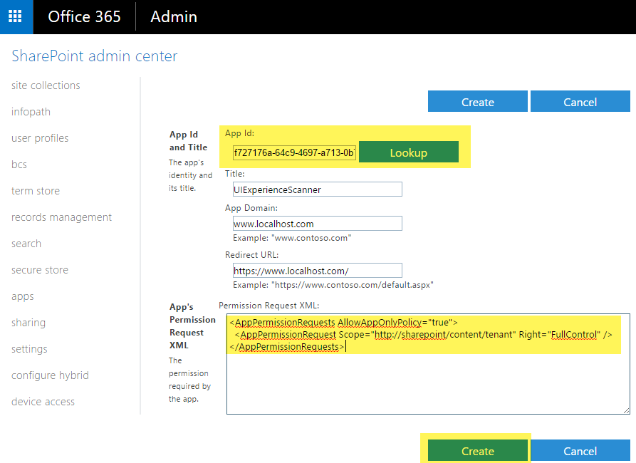

# <a name="granting-access-using-sharepoint-app-only"></a>Gewähren des Zugriffs von SharePoint-App-Only
SharePoint-App-Only ist der älteren, aber immer noch relevant Modell zum Einrichten von app-Prinzipalen. Dieses Modell funktioniert für beide SharePoint Online und SharePoint 2013/2016 lokalen und eignet sich ideal So bereiten Sie Ihre Anwendung für die Migration von lokalem SharePoint zu SharePoint online vor. Unten beschriebenen Schritte wird gezeigt, wie einen app-Prinzipal mit Mandanten Vollzugriff-Berechtigungen einrichten, aber konnte offensichtlich lediglich Leseberechtigungen für diese Vorgehensweise auch erteilen.

## <a name="setting-up-an-app-only-principal-with-tenant-permissions"></a>Einrichten eines nur-app-Prinzipals mit Mandanten Berechtigungen
Navigieren Sie zu einer Website in Ihrem Mandanten (z. B. https://contoso.sharepoint.com), und rufen Sie dann auf der Seite "appregnew.aspx" (z. B. https://contoso.sharepoint.com/_layouts/15/appregnew.aspx). In dieser Seite klicken Sie auf die Schaltfläche generieren, um eine Client-Id und den geheimen Clientschlüssel generieren und füllen Sie die verbleibende Informationen wie in der Screenshot-unten angezeigt.


> [!IMPORTANT]
> Speichern Sie die abgerufene Informationen (Client-Id und den geheimen Clientschlüssel), da Sie dies im nächsten Schritt benötigen!

Nächsten Schritt wird das Erteilen von Berechtigungen für die neu erstellte Prinzipal. Da wir Mandanten bezogenen Berechtigungen gewähren kann dieses Verfahren nur über die Seite "appinv.aspx" auf die Mandantenverwaltungs-Website ausgeführt werden. Sie können diese Website über https://contoso-admin.sharepoint.com/_layouts/15/appinv.aspx erreichen. Nach dem Laden der Seite fügen Sie Ihrer Client-Id hinzu und den erstellten Prinzipal nachschlagen:



Um Berechtigungen zu erteilen, müssen Sie die Berechtigung XML bereitstellen, auf denen die erforderlichen Berechtigungen beschrieben. Da diese Anwendung Zugriff auf alle Websites können muss + auch mit nur-app-Suche verwendet muss es unten aufgeführten Berechtigungen:

```
<AppPermissionRequests AllowAppOnlyPolicy="true">
  <AppPermissionRequest Scope="http://sharepoint/content/tenant" Right="FullControl" />
</AppPermissionRequests>
```

Wenn Sie auf Create wird eine Berechtigung Zustimmungsdialogfeld angezeigt. Drücken Sie vertrauen, die Berechtigungen erteilen:


> [!IMPORTANT]
> Bitte schützen Sie diese Kombination erstellte Client-Id/geheimen Schlüssel wird als wäre es als Administrator an. Verwenden diesen Client-Id/Schlüssel eine kann Lese-/alle Daten in Ihre SharePoint Online-Umgebung aktualisieren!

Mit den vorbereitenden fahren Sie mit der nächsten Kapitel zeigt, wie Sie den erstellte app-Prinzipal über die Client-Id und der geheime Kombination verwenden können.

## <a name="using-this-principal-in-your-application-using-the-sharepoint-pnp-sites-core-library"></a>Verwenden diesen Prinzipal in der Anwendung, die mithilfe der Hauptbibliothek der SharePoint Plug & Play-Websites
Im ersten Schritt Sie SharePoint Plug & Play-Websites Core Bibliothek Nuget-Paket hinzufügen: https://www.nuget.org/packages/SharePointPnPCoreOnline. Danach können Sie unter Codekonstrukt verwenden:

```C#
string siteUrl = "https://contoso.sharepoint.com/sites/demo";
using (var cc = new AuthenticationManager().GetAppOnlyAuthenticatedContext(siteUrl, "[Your Client ID]", "[Your Client Secret]"))
{
    cc.Load(cc.Web, p => p.Title);
    cc.ExecuteQuery();
    Console.WriteLine(cc.Web.Title);
};
```

## <a name="using-this-principal-in-your-application-without-using-the-pnp-sites-core-library"></a>Verwenden diesen Prinzipal in der Anwendung ohne Verwendung der Hauptbibliothek für Plug & Play-Websites
Sobald der Prinzipal erstellt und zugestimmt ist können des Prinzipals-Id und geheimen Schlüssel Sie eine Access anfordern. Die Klasse "tokenhelper.cs" wird die Id und geheimen Clientschlüssel aus der Anwendungskonfigurationsdatei Code.
Verwenden von Microsoft.SharePoint.Client; System verwenden;

```C#
namespace AzureACSAuth
{
    class Program
    {
        static void Main(string[] args)
        {
            string siteUrl = "https://contoso.sharepoint.com/sites/demo";

            //Get the realm for the URL
            string realm = TokenHelper.GetRealmFromTargetUrl(new Uri(siteUrl));

            //Get the access token for the URL.  
            string accessToken = TokenHelper.GetAppOnlyAccessToken(TokenHelper.SharePointPrincipal, new Uri(siteUrl).Authority, realm).AccessToken;

            //Create a client context object based on the retrieved access token
            using (ClientContext cc = TokenHelper.GetClientContextWithAccessToken(siteUrl, accessToken))
            {
                cc.Load(cc.Web, p => p.Title);
                cc.ExecuteQuery();
                Console.WriteLine(cc.Web.Title);
            }
        }
    }
}
```

Ein Beispiel app.config sieht folgendermaßen aus:

```XML
<?xml version="1.0" encoding="utf-8" ?>
<configuration>
  <appSettings>
    <!-- Use AppRegNew.aspx and AppInv.aspx to register client id with secret -->
    <add key="ClientId" value="[Your Client ID]" />
    <add key="ClientSecret" value="[Your Client Secret]" />
  </appSettings>
</configuration>
```

> [!NOTE]
> Sie können auf einfache Weise die Klasse "tokenhelper.cs" in Ihrem Projekt einfügen, durch die AppForSharePointOnlineWebToolkit Nuget-Paket für Ihre Lösung hinzufügen.

