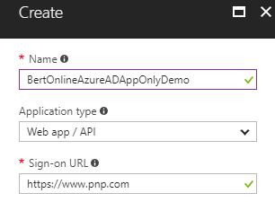
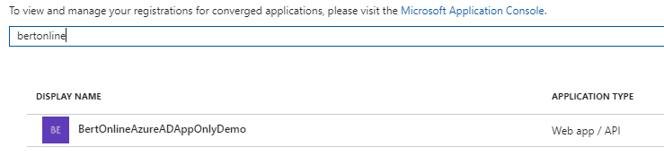
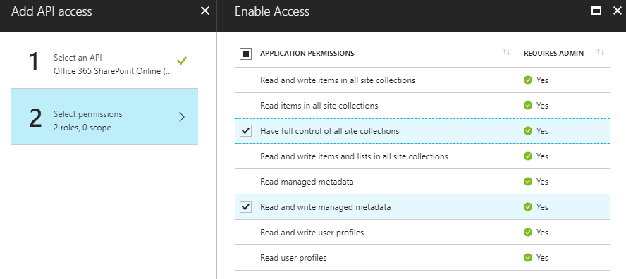
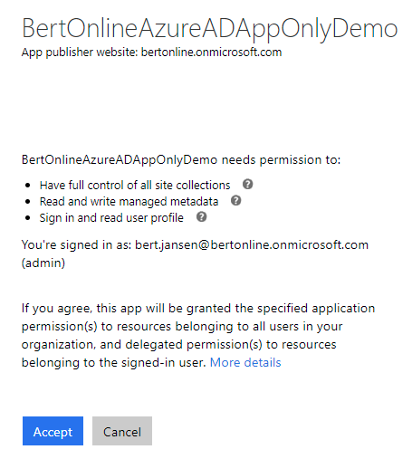

# <a name="granting-access-via-azure-ad-app-only"></a>Gewähren des Zugriffs über App-Only Azure AD
Bei Verwendung von SharePoint Online können Sie Anwendungen in Azure AD definieren und diese Anwendungen können Berechtigungen für SharePoint, aber auch für alle anderen Dienste in Office 365 erteilt werden. Dieses Modell ist das bevorzugte Modell für den Fall, dass Sie SharePoint Online nutzen, wenn Sie SharePoint nutzen Sie, verwenden Sie das Modell SharePoint nur über müssen lokale-basierend Azure ACS [hier](security-apponly-azureacs.md "Link zu Azure ACS app nur Artikel")beschrieben.

## <a name="setting-up-an-azure-ad-app-for-app-only-access"></a>Einrichten einer Azure AD-Apps für nur-app-Zugriff
In Azure AD bei nur-app-sollten Sie in der Regel verwenden eines Zertifikats zum Zugriff anfordern: jedermann das Zertifikat und dessen privaten Schlüssel kann die app und die Berechtigungen für die app verwenden. Unten beschriebenen Schritte führen Sie durch die Einrichtung von diesem Modell.

Sie sind jetzt bereit, die Azure AD-Anwendung für den Aufruf von SharePoint Online mit einem Zugriffstoken App nur zu konfigurieren. Hierzu müssen Sie zum Erstellen und konfigurieren ein selbstsigniertes x. 509-Zertifikat, die verwendet wird, um Ihre Anwendung mit Azure AD, während das Zugriffstoken nur-App anfordern zu authentifizieren. Zunächst müssen Sie das selbstsignierte x. 509-Zertifikat erstellen, die mit dem Tool makecert.exe steht im Windows SDK oder über ein bereitgestellten Powershellskript, das eine Abhängigkeit zu Makecert nicht vorhanden ist, die erstellt werden kann. Verwenden von PowerShell-Skript ist die bevorzugte Methode und wird in diesem Kapitel erläutert.

> [!IMPORTANT]
> Es ist wichtig, dass die Ausführung der folgenden Skripts mit Administratorrechten.

So erstellen Sie eine selbst signierte Zertifikat mit diesem Skript:

```powershell
.\Create-SelfSignedCertificate.ps1 -CommonName "MyCompanyName" -StartDate 2017-10-01 -EndDate 2019-10-01
```

> [!NOTE]
> Die Daten werden in US-Datumsformat bereitgestellt: JJJJ-MM-TT

Von hier aus kann das eigentliche Skript kopiert werden:

```powershell
<#
.SYNOPSIS
Creates a Self Signed Certificate for use in server to server authentication
.DESCRIPTION
.EXAMPLE
PS C:\> .\Create-SelfSignedCertificate.ps1 -CommonName "MyCert" -StartDate 2015-11-21 -EndDate 2017-11-21
This will create a new self signed certificate with the common name "CN=MyCert". During creation you will be asked to provide a password to protect the private key.
.EXAMPLE
PS C:\> .\Create-SelfSignedCertificate.ps1 -CommonName "MyCert" -StartDate 2015-11-21 -EndDate 2017-11-21 -Password (ConvertTo-SecureString -String "MyPassword" -AsPlainText -Force)
This will create a new self signed certificate with the common name "CN=MyCert". The password as specified in the Password parameter will be used to protect the private key
.EXAMPLE
PS C:\> .\Create-SelfSignedCertificate.ps1 -CommonName "MyCert" -StartDate 2015-11-21 -EndDate 2017-11-21 -Force
This will create a new self signed certificate with the common name "CN=MyCert". During creation you will be asked to provide a password to protect the private key. If there is already a certificate with the common name you specified, it will be removed first.
#>
Param(

   [Parameter(Mandatory=$true)]
   [string]$CommonName,

   [Parameter(Mandatory=$true)]
   [DateTime]$StartDate,
   
   [Parameter(Mandatory=$true)]
   [DateTime]$EndDate,

   [Parameter(Mandatory=$false, HelpMessage="Will overwrite existing certificates")]
   [Switch]$Force,

   [Parameter(Mandatory=$false)]
   [SecureString]$Password
)

# DO NOT MODIFY BELOW

function CreateSelfSignedCertificate(){
    
    #Remove and existing certificates with the same common name from personal and root stores
    #Need to be very wary of this as could break something
    if($CommonName.ToLower().StartsWith("cn="))
    {
        # Remove CN from common name
        $CommonName = $CommonName.Substring(3)
    }
    $certs = Get-ChildItem -Path Cert:\LocalMachine\my | Where-Object{$_.Subject -eq "CN=$CommonName"}
    if($certs -ne $null -and $certs.Length -gt 0)
    {
        if($Force)
        {
        
            foreach($c in $certs)
            {
                remove-item $c.PSPath
            }
        } else {
            Write-Host -ForegroundColor Red "One or more certificates with the same common name (CN=$CommonName) are already located in the local certificate store. Use -Force to remove them";
            return $false
        }
    }

    $name = new-object -com "X509Enrollment.CX500DistinguishedName.1"
    $name.Encode("CN=$CommonName", 0)

    $key = new-object -com "X509Enrollment.CX509PrivateKey.1"
    $key.ProviderName = "Microsoft RSA SChannel Cryptographic Provider"
    $key.KeySpec = 1
    $key.Length = 2048 
    $key.SecurityDescriptor = "D:PAI(A;;0xd01f01ff;;;SY)(A;;0xd01f01ff;;;BA)(A;;0x80120089;;;NS)"
    $key.MachineContext = 1
    $key.ExportPolicy = 1 # This is required to allow the private key to be exported
    $key.Create()

    $serverauthoid = new-object -com "X509Enrollment.CObjectId.1"
    $serverauthoid.InitializeFromValue("1.3.6.1.5.5.7.3.1") # Server Authentication
    $ekuoids = new-object -com "X509Enrollment.CObjectIds.1"
    $ekuoids.add($serverauthoid)
    $ekuext = new-object -com "X509Enrollment.CX509ExtensionEnhancedKeyUsage.1"
    $ekuext.InitializeEncode($ekuoids)

    $cert = new-object -com "X509Enrollment.CX509CertificateRequestCertificate.1"
    $cert.InitializeFromPrivateKey(2, $key, "")
    $cert.Subject = $name
    $cert.Issuer = $cert.Subject
    $cert.NotBefore = $StartDate
    $cert.NotAfter = $EndDate
    $cert.X509Extensions.Add($ekuext)
    $cert.Encode()

    $enrollment = new-object -com "X509Enrollment.CX509Enrollment.1"
    $enrollment.InitializeFromRequest($cert)
    $certdata = $enrollment.CreateRequest(0)
    $enrollment.InstallResponse(2, $certdata, 0, "")
    return $true
}

function ExportPFXFile()
{
    if($CommonName.ToLower().StartsWith("cn="))
    {
        # Remove CN from common name
        $CommonName = $CommonName.Substring(3)
    }
    if($Password -eq $null)
    {
        $Password = Read-Host -Prompt "Enter Password to protect private key" -AsSecureString
    }
    $cert = Get-ChildItem -Path Cert:\LocalMachine\my | where-object{$_.Subject -eq "CN=$CommonName"}
    
    Export-PfxCertificate -Cert $cert -Password $Password -FilePath "$($CommonName).pfx"
    Export-Certificate -Cert $cert -Type CERT -FilePath "$CommonName.cer"
}

function RemoveCertsFromStore()
{
    # Once the certificates have been been exported we can safely remove them from the store
    if($CommonName.ToLower().StartsWith("cn="))
    {
        # Remove CN from common name
        $CommonName = $CommonName.Substring(3)
    }
    $certs = Get-ChildItem -Path Cert:\LocalMachine\my | Where-Object{$_.Subject -eq "CN=$CommonName"}
    foreach($c in $certs)
    {
        remove-item $c.PSPath
    }
}

if(CreateSelfSignedCertificate)
{
    ExportPFXFile
    RemoveCertsFromStore
}
```

Werden Sie aufgefordert, ein Kennwort zum Verschlüsseln von Ihrem privaten Schlüssel, und beide Vorführen der. PFX-Datei und. CER-Datei wird im aktuellen Ordner exportiert werden. 

Als Nächstes ist eine Azure AD-Anwendung im Mandanten Azure Active Directory registrieren, die mit Ihrem Office 365-Mandanten verknüpft ist. Öffnen Sie dazu im Office 365 Admin Center (https://portal.office.com) mit dem Konto des ein Benutzer Mitglied der Mandant globale Admins. Klicken Sie auf den Link "Azure AD", der unter der Gruppe "Admin zentriert" in der Strukturansicht links im Office 365 Admin Center verfügbar ist. In den neuen Browser-Registerkarte, die geöffnet wird finden Sie die Microsoft Azure-Verwaltungsportal. Wenn es zum ersten Mal, dass Sie dem Azure-Verwaltungsportal mit Ihrem Konto zugreifen wird, müssen Sie ein neues Azure-Abonnement registrieren einige Informationen und eine Kreditkarte für die Zahlung müssen bereitstellen. Aber keine Sorge, zur Wiedergabe mit Azure AD und zum Registrieren einer Office 365-Anwendung wird nicht bezahlen nichts. Tatsächlich sind die kostenlose Funktionen. Einmal Zugang zu dem Azure-Verwaltungsportal, wählen Sie im Abschnitt "Active Directory", und wählen die Option "App Registrierungen". Finden Sie in der nächsten Abbildung Weitere Details.


In der Registerkarte "App Registrierungen" finden Sie die Liste der Azure AD-Anwendungen in Ihrem Mandanten registriert. Klicken Sie auf "neue Anwendung Registrierung" in der oberen linken Teil der Blade. Im nächsten Schritt geben Sie einen Namen für die Anwendung, wählen Sie die Option "Web app / API", und füllen Sie die "Sign-on URL" mit einer URL ein (muss nicht vorhanden, z. B. https://www.pnp.com). Klicken Sie auf "Erstellen", um die Azure AD-Anwendung zu erstellen.



Nach der Erstellung müssen Sie Ihre Azure AD-Anwendung erneut nachschlagen und öffnen Sie es:



> [!IMPORTANT]
> Nach dem Öffnen der Anwendung kopieren Sie die ID der Anwendung, wie Sie es später benötigen.

Jetzt klicken Sie auf "Erforderliche Berechtigungen", und klicken Sie auf die Schaltfläche "Hinzufügen" ein neuer Blade wird angezeigt. Sie müssen die folgenden Berechtigungen zu konfigurieren:
 - Office 365 für SharePoint Online (Anwendung die Berechtigung)
     - Lesen und Schreiben von verwalteten Metadaten
     - Vollzugriff auf alle Websitesammlung haben

Die "Berechtigungen" gelten, auf die Anwendung erteilt werden, wenn als nur-App ausgeführt.



Lediglich ist "" das Zertifikat erstellten wir zuvor Herstellen einer Verbindung mit der Anwendung. Sie müssen Sie das Get-SelfSignedCertificateInformation.ps1 Skript ausführen. 

```powershell
.\Get-SelfSignedCertificateInformation.ps1 | clip
```

Von hier aus kann das eigentliche Skript kopiert werden:

```powershell
$certPath = Read-Host "Enter certificate path (.cer)"
$cert = New-Object System.Security.Cryptography.X509Certificates.X509Certificate2
$cert.Import($certPath)
$rawCert = $cert.GetRawCertData()
$base64Cert = [System.Convert]::ToBase64String($rawCert)
$rawCertHash = $cert.GetCertHash()
$base64CertHash = [System.Convert]::ToBase64String($rawCertHash)
$KeyId = [System.Guid]::NewGuid().ToString()

$keyCredentials = 
'"keyCredentials": [
    {
      "customKeyIdentifier": "'+ $base64CertHash + '",
      "keyId": "' + $KeyId + '",
      "type": "AsymmetricX509Cert",
      "usage": "Verify",
      "value":  "' + $base64Cert + '"
     }
  ],'
$keyCredentials

Write-Host "Certificate Thumbprint:" $cert.Thumbprint
```

Sie müssen den vollständigen qualifizierten Pfad der angeben die. CER-Datei, die Sie erstellt haben, wenn Sie das Zertifikat für die Konfiguration der AppOnly Kontext erstellt haben. Der Befehl kopiert in die Zwischenablage einen JSON-Ausschnitt, den Sie verwenden möchten in den kommenden Schritten. Fügen Sie den Inhalt der Zwischenablage an einem sicheren Ort (wie eine frische neue Editor-Datei).

Wechseln Sie wieder zum Azure AD-Anwendung, die Sie im vorherigen Schritt erstellt haben, und klicken Sie auf die Schaltfläche "Manifest" am oberen Rand der Blade und dann auf Bearbeiten '. Für die Eigenschaft **KeyCredentials** suchen und Ersetzen Sie ihn durch den Codeausschnitt, dem Sie vor dem generiert, wie werden:

```JSON
  "keyCredentials": [
    {
      "customKeyIdentifier": "<$base64CertHash>",
      "keyId": "<$KeyId>",
      "type": "AsymmetricX509Cert",
      "usage": "Verify",
      "value":  "<$base64Cert>"
     }
  ],
```

Wenn Sie diesen Schritt abgeschlossen haben, klicken Sie auf Speichern.

In diesem Beispiel wird die Anwendung die Berechtigung Sites.FullControl.All Admin Zustimmung in einem Mandanten müssen, bevor sie verwendet werden kann. Erstellen Sie eine Zustimmung URL wie folgt:

```
https://login.microsoftonline.com/<tenant>/adminconsent?client_id=<application id>&state=<something>
```

Verwenden die Id der Anwendung von meiner app Azure AD und damit einverstanden, die app aus meinem contoso.onmicrosoft.com Mandanten, sieht die URL folgendermaßen aus:

```
https://login.microsoftonline.com/contoso.onmicrosoft.com/adminconsent?client_id=6e4433ca-7011-4a11-85b6-1195b0114fea&state=12345
```

Durchsuchen, um das erstellte URL und melden Sie sich als Administrator und Zustimmung an die Anwendung. Sie können den Zustimmung Bildschirm zeigen Sie den Namen der Anwendung als auch die von Ihnen konfigurierten berechtigungsbereiche sehen.



> [!NOTE]
> Nach dem Klicken auf "Accept" Sie an die Anmelde-URL umgeleitet sind angegebene früheren (https://www.pnp.com in unserem Fall)... und dieses Listenfeld, die URL die Umleitung schlägt fehl, aber die Grant erfolgreich durchgeführt wurde ungültig ist, in diesem Fall Nothing sorgen.


## <a name="using-this-principal-in-your-application-using-the-sharepoint-pnp-sites-core-library"></a>Verwenden diesen Prinzipal in der Anwendung, die mithilfe der Hauptbibliothek der SharePoint Plug & Play-Websites
Im ersten Schritt, die Sie hinzufügen SharePointPnPCoreOnline Bibliothek Nuget-Paket: https://www.nuget.org/packages/SharePointPnPCoreOnline. Danach können Sie unter Codekonstrukt verwenden:

```C#
using OfficeDevPnP.Core;
using System;

namespace AzureADCertAuth
{
    class Program
    {
        static void Main(string[] args)
        {
            string siteUrl = "https://contoso.sharepoint.com/sites/demo";
            using (var cc = new AuthenticationManager().GetAzureADAppOnlyAuthenticatedContext(siteUrl, "<application id>", "contoso.onmicrosoft.com", @"C:\BertOnlineAzureADAppOnly.pfx", "<password>"))
            {
                cc.Load(cc.Web, p => p.Title);
                cc.ExecuteQuery();
                Console.WriteLine(cc.Web.Title);
            };
        }
    }
}
```

## <a name="faq"></a>Häufig gestellte Fragen
### <a name="can-i-use-other-means-besides-certificates-for-realizing-app-only-access-for-my-azure-ad-app"></a>Kann ich anderweitig neben Zertifikate für nur-app-Zugriff für meine app Azure AD Realität verwenden?
Keine, alle anderen Optionen sind gesperrte und von SharePoint Online und führt zum Fehler Zugriff verweigert.

