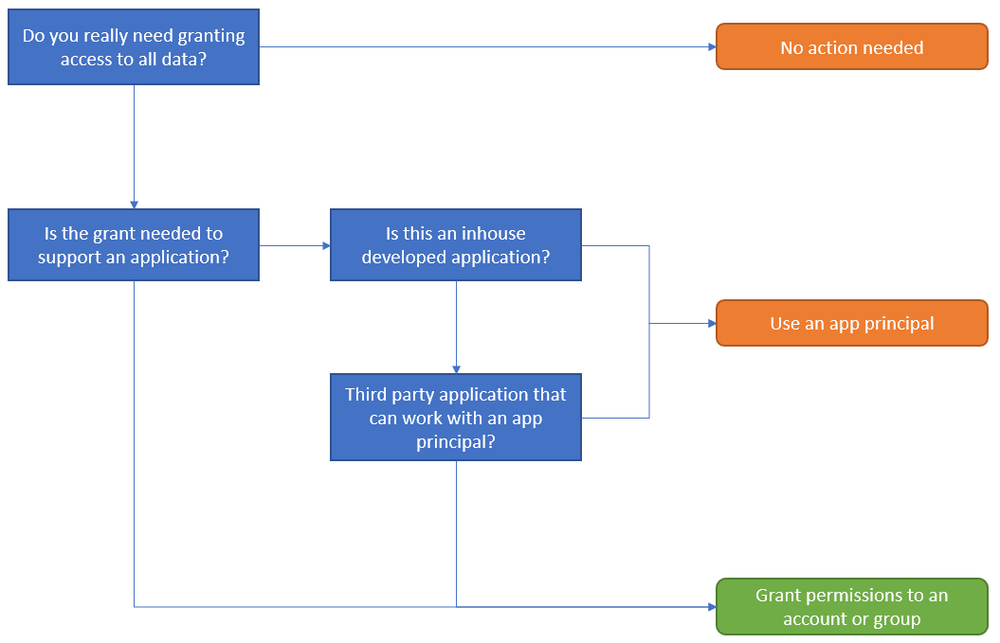
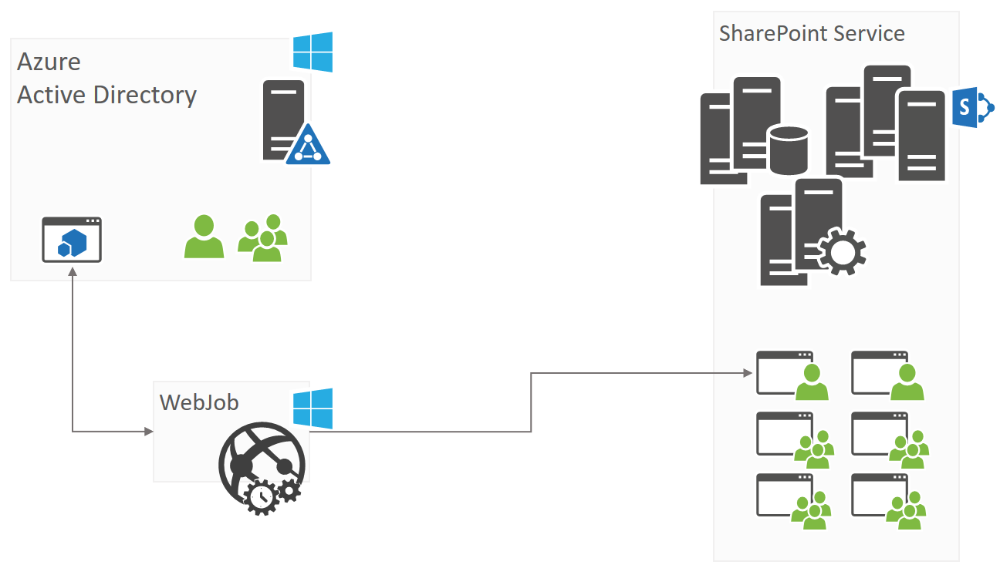

# <a name="alternative-model-for-web-app-policies-in-sharepoint-online"></a>Alternatives Modell zum Web app-Richtlinien in SharePoint Online

Richtlinien für die Web app sind ein Konzept, die SharePoint-Administratoren zum Erteilen oder Verweigern von Berechtigungen für Benutzer und Gruppen für alle Websites unter einer Webanwendung ermöglicht. Diese Berechtigung gewährt und verweigert Take Präferenz über Berechtigungen, die an den Standorten in der Webanwendung festgelegt und daher einen Mechanismus, die in der Regel in diesen Szenarien verwendet werden:
 - Gewähren Sie ein Dienstkonto Berechtigungen für alle Websites, da dieses Dienstkonto verwendet wird, um eine Hintergrund auszuführen, die zum Bearbeiten der Daten in allen Websites muss
 - Support Team schreibgeschützten Zugriff auf alle Websites gewähren, sodass der Supporttechniker über die Website mit dem Endbenutzer durchlaufen kann
 - Verweigern des Zugriffs auf den gesamten Inhalt Benutzer (z. B. nach verlassen das Unternehmen)

Richtlinien sind in SharePoint Online nicht mehr vorhanden, und es ist keine identische alternative Implementierung möglich, jedoch mit der vorhandenen SharePoint-Sicherheitsmodell ähnliche Ergebnisse erzielen können. In diesem Artikel und Videos erfahren Sie mehr dazu.

> [!Video https://www.youtube.com/embed/zcmngkgQdTU]

## <a name="granting-access"></a>Gewähren des Zugriffs

### <a name="whats-the-business-reason-for-this-permission-grant"></a>Was ist der Grund Business für diese Berechtigung erteilen?
Bevor Sie beginnen, Berechtigungen gewährt implementieren ist es wichtig zu verstehen, warum eine Grant erforderlich war. Fragestellungen selbst sind:
 - Gewährt Zugriff auf **Alle** Daten in Ihrer SharePoint Online-Mandanten erforderlich? Schieben Sie wieder, und stellen Sie sicher, dass der Zugriff auf **Alle** Daten handelt es sich um eine Absolute muss zur Unterstützung der Business-Szenario
 - Ist "1" erteilten Berechtigung eine Anwendung oder ein Benutzer geeignet? Wenn sie eine Anwendung ist möglicherweise klicken Sie dann eine app-Prinzipal mit SharePoint Online Breite Berechtigungen Mandanten, insbesondere dann, wenn dies eine internen entwickelte Anwendung ist entwickelt werden

Unten Flussdiagramm nimmt diese Fragen:



> [!IMPORTANT]
>Nur in der Groß-/Kleinschreibung wird der Zugriff gewährte verbraucht werden von einem Benutzer oder eine Anwendung, die Sie über die Benutzer oder Gruppen den Zugriff gewähren sollten nicht mit app-Prinzipalen kompatibel ist. Wenn möglich, bevorzugen Sie app-Prinzipalen über Benutzer und Gruppen, da:
> - App-Prinzipalen werden mit Bereich erteilt alle Websites, d. h., wenn eine Website hinzugefügt wird, dass der app-Prinzipal automatisch Zugriff darauf sowie hat. Im Fall eines WAN-Benutzer-/Gruppen Zugriff auf die jeweiligen Benutzergruppe ersten zur neuen Website hinzugefügt werden muss
> - App-Prinzipalen überschreiben"" Berechtigung Vererbung Einstellung. Nehmen Sie an eine Unterwebsite Unterbrochene Vererbung von Berechtigungen und einem Besitzer Benutzer-/Gruppen beitragen oder Ansicht Zugriff auf die Stammwebsite gewähren des Zugriffs auf die Sub-Website während der app-Prinzipal als solche gewähren, wird immer Zugriff haben.

### <a name="granting-access-using-app-principals"></a>Gewähren des Zugriffs von app-Prinzipalen
Für den Zugriff für alle nicht Human ist es empfehlenswert, app-Prinzipalen verwenden, wie bereits erläutert. Es gibt zwei Ansätze zur Folge: 
 - Mit einer Azure AD-Anwendung: Dies ist die bevorzugte Methode, wenn Sie SharePoint Online verwenden, da Sie auch mit anderen Office 365-Diensten Berechtigungen gewähren können (falls erforderlich) + haben eine Benutzeroberfläche (Azure-Verwaltungsportal) für Ihre app-Prinzipalen verwalten.
 - Verwenden eines SharePoint-nur-App-Prinzipals: Diese Methode ist die Funktionsweise der älteren und nur für den Zugriff auf SharePoint, aber immer noch relevant ist. Diese Methode ist auch empfohlen, wenn Sie noch in SharePoint lokal arbeiten, da dieses Modell in SharePoint lokal als SharePoint Online arbeitet.

Beide Modelle werden in [den Zugriff auf SharePoint mithilfe von einem Anwendungskontext, auch bekannt als nur-app -](https://docs.microsoft.com/en-us/sharepoint/dev/solution-guidance/security-apponly) Artikel ausführlich erläutert.

### <a name="granting-access-via-users-and-groups"></a>Gewähren des Zugriffs über den Benutzer und Gruppen
Wenn Sie Zugriff auf alle Websites zu erteilen, Sie einen Benutzer oder eine Gruppenzugriff auf alle Websites einzeln erteilen müssen, möchten. Dieses Modell unterscheidet sich von was Sie bei der Web-app-Richtlinien verwendet, aber es ist nur Modell, mit denen Sie einem Konto oder eine Gruppe Zugriff auf alle Websites zu gewähren. 

#### <a name="permissions-that-can-be-granted"></a>Berechtigungen, die erteilt werden können
Richtlinien für die Web app verwenden, haben die Option, entweder erteilen "Vollzugriff" oder "Alles lesen", die in SharePoint-Berechtigungen übersetzt hängt davon ab, die folgende:

|**Richtlinienberechtigungen für Web-App**|**Entsprechende SharePoint-Berechtigungen**|
|:-----|:-----|
| Vollzugriff | Hinzufügen von Websitesammlungsadministratoren
| Alles lesen | Fügen Sie using-Berechtigungsstufe "Lesen" (= Besucher der Website)
| | Hinzufügen von "Vollzugriff" Berechtigungsstufe (Websitebesitzer =)
| | Fügen Sie using "Edit" Berechtigungsstufe (Websitemitglieder (=)

Wir bestätigt absichtlich, um die Rolle Websitesammlungsadministrator für die erteilen "Vollzugriff" verwenden, da diese Weise wir das Problem mit Vererbung von Berechtigungen vermeiden. Benutzer können in SharePoint Unterbrechen der Vererbung von Berechtigungen und eindeutige Berechtigungen für Objekte (z. B. Sub-Websites, Listen, Listenelemente) als solche gewähren. Wenn ausgeführt wurde und Sie einen Benutzer beispielsweise der Website-Auflistung Websitegruppe Besitzer hinzufügen, würde der Benutzer nicht Berechtigungen für das Objekt mit eindeutigen Berechtigungen verfügen.

> [!IMPORTANT]
>Wenn das Business-Szenario, das Sie implementieren mit der Berechtigung Vererbung Einschränkungen vorhanden sein kann, können Sie keine Berechtigungen beschrieben SharePoint verwenden. Wenn Sie 100 % sicher, dass Zugriff auf alle Inhalte sichergestellt werden kann müssen, ist die Berechtigung "nur eine gute SharePoint" die Rolle Websitesammlungsadministrator.

#### <a name="granting-by-adding-a-user-or-a-group"></a>Erteilen von durch Hinzufügen eines Benutzers oder einer Gruppe?
Sie können dasselbe Ergebnis erreichen, indem Sie entweder erteilen der Berechtigungen für einen Benutzer oder eine Gruppe, aber beide Modelle Experten und des kohn

| |**Group**|**Benutzer**|
|:-----|:-----|:-----|
| Klarheit | Weitere Konten in der Regel nicht sichtbar zu einem anderen Standort Websitesammlungs-Administratoren oder eine Gruppe auf enthalten | Benutzerkonto wird immer angezeigt, es ist keine unsicher
| Wartung | Sie können auf einfache Weise Zugriff gewähren, der Gruppe neue Mitglieder hinzu | Neue Member müssen alle Websites hinzugefügt werden
| Manipulation | Eine Gruppe kann vermieden werden, die eigentlichen Konten müssen Zugriff (z. B. rechtliche Konto) und anderen Administratoren werden mit weitaus geringerer Wahrscheinlichkeit die Berechtigungen für die Gruppe entfernen | Vollständiger Transparenz vorhanden ist, sind möglicherweise anderen Administratoren häufiger auf die "Seltsames" Benutzer aus ihrer Website entfernen

> [!IMPORTANT]
> Erteilen von Berechtigungen, die mit einer Gruppe ist ein flexibleres Modell.

#### <a name="what-about-modern-team-sites-aka-group-sites"></a>Was geschieht mit modernem Teamwebsites (auch bekannt als Gruppe Websites)?
Moderne Teamwebsites sind SharePoint-Teamwebsites, die mit einer Gruppe von Office 365 verbunden sind. Diese Gruppe von Office 365 fungiert als zentrale Modell für das Gewähren des Zugriffs auf alle Dienste, Gruppe (z. B. SharePoint-Website, Exchange-Postfach, Planner,...). Für diese Websites haben Sie 2 Optionen für das Gewähren des Zugriffs:
 - Hinzufügen von Benutzerkonten (keine Gruppen) an die Mitglieder oder Besitzer der Gruppe der Office 365 mit der modernen Teamwebsite verbunden ist. Vorteil von diesem Ansatz besteht darin, dass die erteilte Berechtigung gilt für alle Dienste, die dieser Gruppe verwenden, aber beim Auswerten von Richtlinien für die Web app dies in der Regel nicht relevant ist
 - Behandeln der modernen Teamwebsite wie eine Website "normal", und gewähren von Berechtigungen wie in früheren Kapiteln beschrieben

> [!IMPORTANT]
> Wir empfehlen Erteilen von Berechtigungen auf SharePoint-Ebene, Bedrohung also die modernen Teamwebsites wie regulären klassische SharePoint-Teamwebsites. Dieser Ansatz richtet mit, was die Webanwendungsrichtlinien Bereitstellung wurden.

#### <a name="granting-permissions-using-pnp-powershell"></a>Erteilen von Berechtigungen mithilfe von Plug & Play-PowerShell
Klicken Sie unter Skripts eine einfache Möglichkeit zum Gewähren von Zugriff über von Plug & Play-PowerShell anzeigen und kann es sich um eine gute Start-Grundlage für die Implementierung. Unter Skripts nicht berücksichtigt in Konto Folgendes:
 - Get-PnPTenantSite ist derzeit nicht aufzählen modernen Teamwebsites
 - Get-PnPTenantSite ist nicht Multi-Geo Beachten
 - Leistung ist nicht optimal, da die Skripts nacheinander ausgeführt werden, es ist keine parallele Ausführung

Da Benutzer kontinuierlich neue Websitesammlungen erstellen ist es wichtig, diese Skripts regelmäßig, idealerweise als geplante Aufgabe auszuführen.

> [!IMPORTANT]
> Verfügt Ihre Mandanten einen Großteil der Websitesammlungen, ist der Ansatz mithilfe einer benutzerdefinierten Anwendung entwickelten eine bessere Lösung für Sie.

##### <a name="full-control"></a>Vollzugriff
Um Benutzern Vollzugriff zu spezifischen (oder alle) SharePoint-Websites können Sie SharePoint PowerShell die Zielbenutzer Websitesammlung-Admins der Ziel-Site (einschließlich aller) vornehmen. Dies kann durch ein globaler Administrator oder eine SharePoint-Service-Administrator erfolgen.
Es wird empfohlen, dass der Zugriff auf Basis bei Bedarf hinzugefügt werden soll, und klicken Sie dann entfernt. Das folgende Skript werden beispielsweise eine Liste der Administratoren für alle Websitesammlungen in einem Mandanten zugewiesen. Im Beispiel wird die [SharePoint-Muster und Methoden (Plug & Play-) von PowerShell-Befehlen](http://aka.ms/sppnp-powershell) zwei Benutzer Administratoren aller Websitesammlungen in den Mandanten vornehmen.

```PowerShell
# comma separated list of users and groups to be added
$adminAccounts = "admin1@contoso.onmicrosoft.com","admin21@contoso.onmicrosoft.com"

# Specify the tenant here
$tenant = "contoso"

# Note: This example assumes that you are managing your credentials in Windows as documented here:
# https://github.com/SharePoint/PnP-PowerShell/wiki/How-to-use-the-Windows-Credential-Manager-to-ease-authentication-with-PnP-PowerShell
write-host "Connecting to https://$($tenant)-admin.sharepoint.com"
Connect-PnPOnline -Url "https://$($tenant)-admin.sharepoint.com"


#Note: we are only fetching the root site collection and any site collection in the /sites path
#Update filters here accordingly to match your requirements
write-host "Getting list of site collections"
$sitecollections = Get-PnPTenantSite | where {($_.Url -like "*$($tenant).sharepoint.com/") -or ($_.Url -like "*$($tenant).sharepoint.com/sites/*")}
foreach($sitecollection in $sitecollections) {
    write-host "Adding administrators to $($sitecollection.Url)"
    Set-PnPTenantSite -Url $sitecollection.Url -Owners $adminAccounts
}
```

##### <a name="full-read"></a>Alles lesen
So Benutzer vollständigen Lesezugriff auf spezifische (oder alle) übergeben Sie die SharePoint-Websites können SharePoint PowerShell die Zielbenutzer für eine Websitesammlung lesen Rolle hinzufügen. Dies kann durch ein globaler Administrator oder eine SharePoint-Service-Administrator erfolgen.
Die allgemeinen Schritte umfassen die Definition einer SharePoint-Lese-Rolle für die Websitesammlung oder wiederverwenden einer vorhandenen Farm und klicken Sie dann die Rolle Benutzer oder Gruppen zuweisen. Verwendung von Azure Active Directory-Gruppen, einschließlich derjenigen mit dynamischen Mitgliedschaft, zum Steuern des Zugriffs auf Ressourcen finden Sie unter: [Zugriff auf Ressourcen mit Azure Active Directory-Gruppen verwalten](https://docs.microsoft.com/en-us/azure/active-directory/active-directory-manage-groups#https%3A%2F%2Fchannel9.msdn.com%2FSeries%2FAzure-Active-Directory-Videos-Demos%2FAzure-AD--Introduction-to-Dynamic-Memberships-for-Groups%2Fplayer). Im Beispiel wird die [SharePoint-Muster und Methoden (Plug & Play-) von PowerShell-Befehlen](http://aka.ms/sppnp-powershell) zum Erstellen einer neuen Rolle Lesezugriff für alle Websitesammlungen in den Mandanten verwendet.

```PowerShell
# Specify the tenant here
$tenant = "contoso"

# Note: This example assumes that you are managing your credentials in Windows as documented here:
# https://github.com/SharePoint/PnP-PowerShell/wiki/How-to-use-the-Windows-Credential-Manager-to-ease-authentication-with-PnP-PowerShell
write-host "Connecting to https://$($tenant)-admin.sharepoint.com"
Connect-PnPOnline -Url "https://$($tenant)-admin.sharepoint.com"

# Note: we are only fetching the root site collection and any site collection in the /sites/ path
# Update filters here accordingly to match your requirements
write-host "Getting list of site collections"
$sitecollections = Get-PnPTenantSite | where {($_.Url -like "*$($tenant).sharepoint.com/") -or ($_.Url -like "*$($tenant).sharepoint.com/sites/*")}
foreach($sitecollection in $sitecollections) {
    write-host "Set FullRead for MyGroup to $($sitecollection.Url)" 
    Connect-PnPOnline -Url $($sitecollection.Url)
    New-PnPGroup -Title 'FullReader' 
    Set-PnPGroupPermissions -Identity 'FullReader' -RemoveRole 'Full Control' -AddRole 'Read'
}
```

#### <a name="granting-permissions-using-a-custom-developed-application"></a>Erteilen von Berechtigungen mithilfe einer benutzerdefinierten Anwendung entwickelten
Ein alternatives Modell überprüft für der PowerShell-Ansatz Hintergrund beim Erstellen einer Anwendung ist, die alle Websitesammlungen (einschließlich modernen Teamwebsites, OneDrive for Business-Websites über Standorte bei Verwendung von Multi-Geo), zählt, ob die erforderliche Benutzergruppe hat Access und falls nicht, dass eine hinzugefügt. Die Architektur einer solchen Anwendung könnte so einfach wie das unten definierte sein:
1. Beginnen Sie mit eine Anwendung in Azure Active Directory für das setup Sie nur-app-Nutzung definieren (siehe "[das Einrichten einer Azure AD-app für nur-app - Zugriff](https://docs.microsoft.com/en-us/sharepoint/dev/solution-guidance/security-apponly-azuread)"), und gewähren Sie Vollzugriff auf alle Websitesammlungen
2. Erstellen Sie eine C#-Anwendung, die autorisiert selbst mithilfe der Azure AD-Anwendung, die Sie in Schritt 1 definiert haben und durchläuft alle Websitesammlungen (Dies kann OD4B Websitesammlungen enthalten), um die erforderlichen Konten/Gruppen hinzufügen, wenn sie nicht vorhanden sind
3. In C#-Anwendung dann muss gehostet und Ausführung in regelmäßigen Abständen geplant werden. Mithilfe einer Azure Web-Projekt ist eine gute Modell dafür, aber die gleiche durch Ausführen der Anwendung als geplante Aufgabe auf einem Server ausgeführt werden konnte



Im Rahmen dieses Handbuchs haben wir eine Anwendung für die ersten Schritte mit diesem erstellt. Im Beispiel heißt [Governance.EnsurePolicy](https://github.com/SharePoint/PnP/tree/master/Solutions/Governance.EnsurePolicy) und im Repository Plug & Play-SharePoint werden kann.

> [!NOTE]
> In diesem Szenario konnte weiter in eine Anwendung erweitert werden, die bedingt gewährt und Berechtigungen entfernt. Beispielsweise konnte das Helpdesk-Mitarbeiter Zugriff für eine bestimmte Website über das Erstellen eines Listenelements SharePoint anfordern, die Anwendung sieht dies und gewährt Zugriff für X Stunden... und entfernt die Berechtigungen weiter unten. Diese Anwendung führt auch ein Protokoll anzeigen, die Zugriff auf die Website gewährt wurde und zu welchen Zeitpunkten.

## <a name="denying-access"></a>Verweigern des Zugriffs
### <a name="replace-deny-all-policy-using-office-365-and-sharepoint-access-controls"></a>Ersetzen verweigern, alle Richtlinien, die mit Office 365 und den Zugriff auf SharePoint-Steuerelemente
Es ist keine Richtlinie "Alles verweigern" in Office 365, vielmehr unsere es wird empfohlen, die mit Office 365 SharePoint-Zugriffsrichtlinien Berechtigungen zu verwalten. Die Querformat muss den Benutzer, Apps und -Geräte. Einige der folgenden Zugriffsrichtlinien werden nachfolgend beschrieben.

Um bestimmte Benutzer den Zugriff auf Office 365-Ressourcen zu blockieren, SharePoint, einschließlich, befolgen Sie die hier beschriebenen Anweisungen: [Entfernen von einem früheren Mitarbeiter von Office 365](https://support.office.com/en-us/article/Remove-a-former-employee-from-Office-365-44d96212-4d90-4027-9aa9-a95eddb367d1). Geben Sie beispielsweise Folgendes ein, um Zugriff auf einen Mitarbeiter abgeschnitten, die Organisation verlassen hat. Dies kann durch ein globaler Administrator oder Benutzerverwaltungsadministrator mithilfe von Office 365 Admin Center oder Skripts mithilfe von PowerShell erfolgen.

Um externe Freigabe, damit Lieferanten, Clients oder Kunden nur Zugriff auf bestimmte Ressourcen haben zu begrenzen, befolgen Sie die Anweisungen hier: [externe Freigabe für Ihre SharePoint Online-Umgebung verwalten](https://support.office.com/en-us/article/Manage-external-sharing-for-your-SharePoint-Online-environment-c8a462eb-0723-4b0b-8d0a-70feafe4be85). Beispielsweise können Sie eine SharePoint Online konfigurieren Zusammenarbeit mit externen Benutzern Extranetwebsite Schwerpunkt. 

Zum Blockieren oder zulassen mit externen Benutzern von bestimmten Domänen auf der Ebene der Mandanten oder Website freigeben, befolgen Sie die Anweisungen hier: [Eingeschränkte Domänen Freigabe in SharePoint Online und OneDrive für Unternehmen](https://support.office.com/en-us/article/Restricted-domains-sharing-in-SharePoint-Online-and-OneDrive-for-Business-5d7589cd-0997-4a00-a2ba-2320ec49c4e9?ui=en-US&rs=en-US&ad=US). Geben Sie beispielsweise Folgendes ein, um die Freigabe mit nur bestimmte Geschäftspartnern unter Bekannte Domänen zu begrenzen. Dies kann durch ein globaler Administrator oder eine SharePoint-Service-Administrator konfiguriert werden. 

Die Überwachung Features können Sie mit Office 365-Sicherheit und Compliance Center Dateiaktivitäten verfolgen. Weitere Informationen finden Sie mit den folgenden Artikeln: 
 - Überwachung von alle Ihre SharePoint-Websitesammlungen mithilfe von Office 365-Sicherheit und Compliance Center: [Suchen der Überwachungsprotokolle melden Sie sich bei der Office 365-Sicherheit und Compliance Center](https://support.office.com/en-us/article/Search-the-audit-log-in-the-Office-365-Security-Compliance-Center-0d4d0f35-390b-4518-800e-0c7ec95e946c?ui=en-US&rs=en-US&ad=US). Dieser Ansatz gibt Ihnen Überwachung aller Ihrer Websites, ein flexibles reporting-Modell und Sie können [API die benutzerdefinierte Verarbeitung von Audit-Daten](https://msdn.microsoft.com/en-us/office-365/office-365-management-activity-api-reference).
 - Verwenden Sie [Office 365-Cloud-App-Sicherheit](https://support.office.com/en-us/article/Overview-of-Office-365-Cloud-App-Security-81f0ee9a-9645-45ab-ba56-de9cbccab475): Office 365-Cloud-App-Sicherheit erhalten Sie einen Einblick in verdächtige Aktivitäten in Office 365, sodass Sie Situationen, die potenziell problematisch und untersuchen können bei Bedarf Ausführen einer Aktion zum Beheben von Sicherheitsproblemen. Mit Office 365 Cloud App-Sicherheit können Sie alle der folgenden Aufgaben ausführen:
    - Finden Sie unter wie die Daten der Organisation in Office 365 zugegriffen und verwendet wird
    - Definieren von Richtlinien, die Warnungen für untypischen oder verdächtigen Aktivitäten auslösen
    - Anhalten von Benutzerkonten auf verdächtige Aktivitäten
    - Erforderliche Anmeldung wieder in apps für Office 365, nachdem eine Warnung ausgelöst wurde

Mit Office 365-Sicherheit und Compliance Center, Sie können auch blockieren, externe Freigabe von vertraulichen Dokumenten definieren, was in Ihrer Organisation vertrauliche Typen sind (Wählen Sie aus der viele Vorlagen oder erstellen Sie eine eigene benutzerdefinierte vertraulichen Typen). Erfahren Sie mehr über integrierte vertrauliche Typen: Arten von vertraulichen Informationen. Weitere Informationen zum Erstellen eigener hier: [Erstellen von vertraulichen Informationstypen für benutzerdefinierte](https://support.office.com/en-us/article/Create-a-custom-sensitive-information-type-82c382a5-b6db-44fd-995d-b333b3c7fc30). 

Verwendung von Azure Active Directory-Gruppen, einschließlich derjenigen mit dynamischen Mitgliedschaft, zum Steuern des Zugriffs auf Ressourcen finden Sie unter: [Zugriff auf Ressourcen mit Azure Active Directory-Gruppen verwalten](https://docs.microsoft.com/en-us/azure/active-directory/active-directory-manage-groups#https%3A%2F%2Fchannel9.msdn.com%2FSeries%2FAzure-Active-Directory-Videos-Demos%2FAzure-AD--Introduction-to-Dynamic-Memberships-for-Groups%2Fplayer). Beispielsweise können Gruppen konfiguriert werden, um Mitglieder zu entfernen, dessen Konto nicht aktiviert ist. Darüber hinaus [Azure Active Directory-Schutz](https://docs.microsoft.com/en-us/azure/active-directory/active-directory-identityprotection) (Teil von Azure AD Premium) ermöglicht Administratoren zum Identifizieren des Anmeldevorgängen riskant und entweder blockieren oder mehrstufige Authentifizierung erfordern.

Sperren oder beschränken Zugriff auf nicht kompatible oder nicht verwalteten Geräten Funktionalität wird in Kürze verfügbar das [bedingte Zugriffsrichtlinien Azure Active Directory](https://docs.microsoft.com/en-us/azure/active-directory/active-directory-conditional-access-azure-portal)nutzt. Mithilfe dieser Richtlinie können Sie Zugriff auf umfangreiche apps auf nicht verwalteten Geräten blockieren und zulassen nur Browserzugriff ohne die Möglichkeit zum Herunterladen, drucken oder synchronisieren. Dies verhindert, dass Daten auf nicht verwalteten Geräten vor. Dies wird durch ein globaler Administrator oder eine SharePoint-Service-Administrator konfiguriert werden.

Zum Blockieren des Zugriffs auf nicht vertrauenswürdigen Netzwerkadressen, können Sie standortbasierte Gruppenrichtlinien verwenden, um eine Liste der vertrauenswürdigen IP-Adressen konfigurieren aus der Zugriff gewährt wird. Befolgen Sie die Anweisungen hier: [Steuern des Zugriffs auf SharePoint und OneDrive auf der Grundlage von Netzwerkadressen](https://support.office.com/en-us/article/Control-access-to-SharePoint-Online-and-OneDrive-data-based-on-defined-network-locations-b5a5f1f1-1174-4c6b-91d0-9273a6b6971f).


