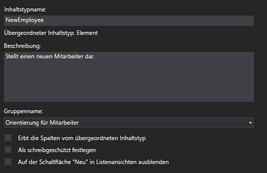
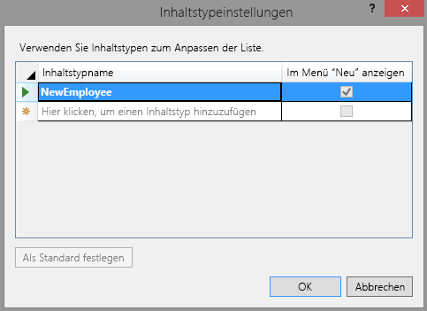

# <a name="add-a-custom-content-type-to-a-sharepoint-hosted-sharepoint-add-in"></a>Hinzufügen eines benutzerdefinierten Inhaltstyps zu einem in SharePoint gehosteten SharePoint-Add-In

Dies ist der vierte einer Reihe von Artikeln über die Grundlagen der Entwicklung von von SharePoint gehosteten SharePoint-Add-Ins. Machen Sie sich zunächst mit [SharePoint-Add-Ins](sharepoint-add-ins.md) und den vorherigen Artikeln dieser Reihe vertraut, die Sie unter [Erste Schritte beim Erstellen von von SharePoint gehosteten SharePoint-Add-Ins](get-started-creating-sharepoint-hosted-sharepoint-add-ins.md#Nextsteps) finden. 
    
> [!NOTE]
> Wenn Sie unsere Artikelreihe zum Thema SharePoint-gehostete Add-Ins durchgearbeitet haben, haben Sie bereits eine Visual Studio-Lösung, die Sie für diesen Artikel verwenden können. Sie können auch das Repository von [SharePoint_SP-hosted_Add-Ins_Tutorials](https://github.com/OfficeDev/SharePoint_SP-hosted_Add-Ins_Tutorials) herunterladen und die Datei „BeforeContentType.sln“ öffnen.

In diesem Artikel fügen Sie dem SharePoint-Add-In „Orientierung für Mitarbeiter“ einen benutzerdefinierten Inhaltstyp hinzu.
 

## <a name="create-the-custom-content-type"></a>Erstellen des benutzerdefinierten Inhaltstyps

1. Klicken Sie im **Projektmappen-Explorer** mit der rechten Maustaste auf das Projekt, und wählen Sie **Neuen Ordner** > ** hinzufügen** aus. Nennen Sie den Ordner **Inhaltstypen**.
     
2. Klicken Sie mit der rechten Maustaste auf den neuen Ordner, und wählen Sie **Neues Element** > **hinzufügen** aus. Das Dialogfeld **Neues Element hinzufügen** wird geöffnet, und der **Office/SharePoint**-Knoten wird angezeigt.
     
3. Wählen Sie **Inhaltstyp** aus, und geben Sie ihm den Namen **NewEmployee**, und wählen Sie dann **hinzufügen**. Wenn Sie vom Assistenten aufgefordert werden, den Basisinhaltstyp auszuwählen, wählen Sie **Element** und dann **Fertig stellen** aus.   
 
4. Wenn der Inhaltstyp-Designer nicht automatisch geöffnet wird, wählen Sie den Inhaltstyp **NewEmployee** im **Projektmappen-Explorer** aus, um ihn zu öffnen.
    
5. Öffnen Sie die Registerkarte **Inhaltstyp** im Designer, und füllen Sie die Textfelder wie folgt aus:
    
   -  **Inhaltstypname**: NewEmployee
   -  **Beschreibung**: Stellt einen neuen Mitarbeiter dar.
   -  **Gruppenname**: Orientierung für Mitarbeiter
 
6. Stellen Sie sicher, dass *keines* der Kontrollkästchen auf der Registerkarte ausgewählt ist. Das Kontrollkästchen für **Erbt die Spalten vom übergeordneten Inhaltstyp** ist möglicherweise standardmäßig aktiviert. *Achten Sie darauf, es zu deaktivieren.*  Die Registerkarte sollte jetzt wie folgt aussehen:
    
    *Abbildung 1. Registerkarte „Inhaltstyp“*

    
 
7. Öffnen Sie die Registerkarte **Spalten** im Designer.
     
8. Wählen Sie im Raster **Hier klicken, um eine Spalte hinzufügen** aus, um eine Dropdownliste der Spalten zu öffnen, und fügen Sie die Spalte **Abteilung** hinzu. Sie ist in der Dropdown-Liste mit dem Anzeigenamen **Abteilung** aufgeführt. Wiederholen Sie diesen Schritt für die Spalte **Orientierungsphase**. (Wenn die Spalten nicht aufgeführt sind, haben Sie möglicherweise mit der falschen Visual Studio-Lösung begonnen. Beginnen Sie mit BeforeContentType.sln.) Wenn Sie fertig sind, sollte das Raster wie folgt aussehen:
    
    *Abbildung 2. Registerkarte „Spalten“*

    

9. Speichern Sie die Datei, und schließen Sie den Designer.

### <a name="modify-the-elementsxml-file"></a>Ändern der Datei „Elements.xml“

1. Der nächste Schritt erfordert, dass Sie direkt im unformatierten XML des Inhaltstyps arbeiten. Wählen Sie daher im **Projektmappen-Explorer** die dem Inhaltstyp **NewEmployee** untergeordnete Datei elements.xml aus.
    
2. Es sind bereits **FieldRef**-Elemente in der Datei für die zwei Spalten, die Sie hinzugefügt haben, vorhanden. Fügen Sie **FieldRef**-Elemente für zwei integrierte SharePoint-Spalten als Peers für die beiden bereits vorhandenen Spalten hinzu. Nachfolgend finden Sie das Markup für die Elemente. *Sie müssen dieselben GUIDs für das ID-Attribut verwenden, da es sich um integrierte Feldtypen mit festen IDs handelt.* Fügen Sie sie *über* den beiden **FieldRef**-Elementen für die benutzerdefinierten Websitespalten hinzu. Beachten Sie, dass wir diesen Feldern den benutzerdefinierten Anzeigenamen **Employee** gegeben haben.
    
    ```
      <FieldRef Name="LinkTitle" ID="{82642ec8-ef9b-478f-acf9-31f7d45fbc31}" DisplayName="Employee" />
      <FieldRef Name="Title" ID="{fa564e0f-0c70-4ab9-b863-0177e6ddd247}" DisplayName="Employee" />
    ```
 
3. Speichern und schließen Sie die Datei.
 
###  <a name="modify-content-type-settings"></a>Ändern der Inhaltstypeinstellungen

1. Erweitern Sie den Knoten **Listen** im **Projektmappen-Explorer**, und wählen Sie **NewEmployeeOrientation**, um den Listentyp-Designer zu öffnen.
    
2. Öffnen Sie die Registerkarte **Spalten** im Designer, und wählen Sie dann die Schaltfläche **Inhaltstypen** aus.
    
3. Fügen Sie im Dialogfeld **Inhaltstypeinstellungen** den Inhaltstyp **NewEmployee** hinzu.
    
4. Wählen Sie in der Liste der Typen den Inhaltstyp **NewEmployee** aus, und wählen Sie dann die Schaltfläche **Als Standard festlegen** aus.
 
5. Wählen Sie den Inhaltstyp **Element** aus, klicken Sie mit der rechten Maustaste auf die kleine Pfeilspitze, die links vom Inhaltstypnamen angezeigt wird, und wählen Sie dann **Löschen** aus.
    
6. Wiederholen Sie den vorherigen Schritt für den Inhaltstyp **Ordner**, sodass **NewEmployee** als einziger Inhaltstyp angezeigt wird. Das Dialogfeld sollte nun wie folgt aussehen:
    
    *Abbildung 3. Dialogfeld „Inhaltstypeinstellungen“*

    
 
7.  Wählen Sie **OK** aus, um das Dialogfeld zu schließen, und speichern und schließen Sie anschließend die Datei.

### <a name="modify-the-schemaxml-file-and-elementxml-file"></a>Ändern der Dateien „schema.xml“ und „element.xml“

1. Öffnen Sie die Datei „schema.xml“.
    
2. Suchen Sie das **Felder**-Element. Es müssen drei **Feld**-Elemente vorhanden sein: **Titel**, **Abteilung** und **Orientierungsphase**. (Diese Elemente befinden sich möglicherweise auf einer einzelnen Linie in dieser generierten Datei. Wenn dies der Fall ist, trennen Sie sie durch Zeilenumbrüche.)
 
3. Lassen Sie die Datei geöffnet, und erweitern Sie im **Projektmappen-Explorer** den Ordner **Websitespalten** und den Knoten **Abteilung**, und öffnen Sie dann die Datei „elements.xml“ für **Abteilung**. Das **Feld**-Element für **Abteilung** in „schema.xml“ sollte das **Feld**-Element für **Abteilung** in „elements.xml“ exakt duplizieren. Wenn keine exakte Übereinstimmung besteht, kopieren Sie das **Feld**-Element aus der Datei „elements.xml“ der Websitespalte, und fügen Sie es anstelle des nicht übereinstimmenden **Feld**-Elements in die Datei „schema.xml“ ein. Schließen Sie die Datei „element.xml“.
    
4. Öffnen Sie die Datei „elements.xml“ für **Orientierungsphase**. Auch hier muss eine exakte Übereinstimmung des **Feld**-Elements in beiden Dateien für die **Orientierungsphase** vorliegen, einschließlich aller untergeordneten Elemente, wie z. B. der Elemente **AUSWAHLMÖGLICHKEITEN** und ** ZUORDNUNGEN**. Wenn keine exakte Übereinstimmung besteht, kopieren Sie das **Feld**-Element aus der Datei „elements.xml“, und fügen Sie es anstelle des nicht übereinstimmenden **Feld**-Elements in die Datei „schema.xml“ ein. Schließen Sie die Datei „element.xml“.
 
5. Während Sie sich weiterhin in der Datei „schema.xml" befinden, suchen Sie im Element **View**, dessen **BaseViewID**-Wert gleich 1 ist, nach dem untergeordneten **ViewFields**-Element, und fügen Sie ihm dann die folgenden zwei **FieldRef**-Elemente als untergeordnete Elemente hinzu.  Möglicherweise sind sie bereits vorhanden, jedoch fehlt ein **ID**-Attribut. Wenn dies der Fall ist, fügen Sie das ID-Attribut hinzu.
    
    ```
      <FieldRef Name="Division" ID="{GUID from the Field element}" />
      <FieldRef Name="OrientationStage" ID="{GUID from the Field element}" />

    ```

6. Ersetzen Sie die zwei Platzhalter- **ID**-Attributwerte durch die GUIDs aus den entsprechenden **Field**-Elementen im Element **ContentType** für **NewEmployee**, das sich zuvor in der Datei „schema.xml" befand. Vergessen Sie nicht die umschließenden Klammern „{}". Das **ViewFields**-Element für das **View**-Element „1“ sollte wie folgt aussehen (Ihre GUIDs können abweichen):

    ```
      <ViewFields>
        <FieldRef Name="LinkTitle" ID="{82642ec8-ef9b-478f-acf9-31f7d45fbc31}" DisplayName="Employee" />
        <FieldRef Name="Division" ID="{509d2d67-9a96-4596-9b3b-58449cdcc6ff}" />
        <FieldRef Name="OrientationStage" ID="{38a3b54c-acf3-4ddf-b748-55c7c28d4cc2}" />        
      </ViewFields>
    ```

7. Suchen Sie in der Datei „schema.xml“ nach dem **View**-Element, dessen **BaseViewID** den Wert „0“ hat. Suchen Sie nach dem **ViewFields**-Element in diesem Element.

8. Kopieren Sie den gesamten **ViewFields**-Abschnitt aus der Ansicht „1“ in den **ViewFields**-Abschnitt der Ansicht „0“. Die beiden Ansichten sollten jetzt identische **ViewFields**-Abschnitte besitzen.
    
9. Speichern und schließen Sie die Datei schema.xml.

10. Erweitern Sie im Ordner **Listen** den Knoten **NewEmployeeOrientation** und die untergeordnete Listeninstanz **NewEmployeesInSeattle**. Sie sollten die elements.xls für die Vorlage deutlich von der elements.xls für die Instanz unterscheiden können. Öffnen Sie die Datei für die Instanz. 
    
11. Fügen Sie zwei **Field**-Elemente zum ersten **Row**-Element hinzu, sodass das **Row**-Element wie folgt aussieht:
    
    ``` 
    <Row>
      <Field Name="Title">Tom Higginbotham</Field>
      <Field Name="Division">Manufacturing</Field>
      <Field Name="OrientationStage">Tour of building</Field>
    </Row>
    ```

12. Speichern und schließen Sie die Datei.
    

## <a name="run-and-test-the-add-in"></a>Ausführen und Testen des Add-Ins

1. Verwenden Sie die F5-TASTE, um Ihr Add-In bereitzustellen und auszuführen. Visual Studio führt eine temporäre Installation des Add-Ins auf Ihrer SharePoint-Testwebsite durch und führt das Add-In sofort aus. 
     
2. Wenn die Standardseite des Add-Ins geöffnet wird, wählen Sie den Link für **Neue Mitarbeiter in Seattle** aus, um die benutzerdefinierte Listeninstanz zu öffnen.
 
3. Die Listenseite mit den Spalten **Abteilung** und **Orientierungsphase** sind darin enthalten. Es ist nicht erforderlich, dass ein Benutzer sie manuell hinzufügt, da sie Bestandteil des Listeninhaltstyps sind. Das erste Element enthält die Daten, die Sie hinzugefügt haben.
    
    *Abbildung 4. Liste „Neue Mitarbeiter in Seattle“*

     
 
4. Versuchen Sie, der Liste neue Elemente hinzuzufügen und vorhandene Elemente zu bearbeiten.
    
5. Schließen Sie zum Beenden der Debugsitzung das Browserfenster, oder beenden Sie das Debuggen in Visual Studio. Jedes Mal, wenn Sie F5 drücken, zieht Visual Studio die vorherige Version des Add-Ins zurück und installiert die neueste.
    
6. Da Sie mit diesem Add-In und dieser Visual Studio-Lösung in anderen Artikeln arbeiten werden, hat es sich bewährt, das Add-In ein letztes Mal zurückzuziehen, wenn Sie Ihre Arbeit daran für eine Weile abgeschlossen haben. Klicken Sie im **Projektmappen-Explorer** mit der rechten Maustaste auf das Projekt, und wählen Sie die Option **Zurückziehen** aus.

## <a name="next-steps"></a>Nächste Schritte
<a name="Nextsteps"> </a>

Im nächsten Artikel dieser Reihe [fügen Sie ein Webpart zu einer Seite in einem von SharePoint gehosteten SharePoint-Add-In hinzu](add-a-web-part-to-a-page-in-a-sharepoint-hosted-sharepoint-add-in.md).
