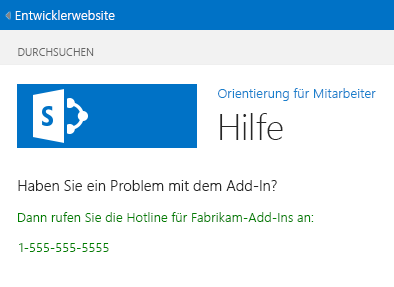

# <a name="add-a-custom-page-and-style-to-a-sharepoint-hosted-sharepoint-add-in"></a>Hinzufügen einer benutzerdefinierten Seite und Formatvorlage zu einem in SharePoint gehosteten SharePoint-Add-In

Dies ist der siebte einer Reihe von Artikeln über die Grundlagen der Entwicklung von von SharePoint gehosteten SharePoint-Add-Ins. Machen Sie sich zunächst mit [SharePoint-Add-Ins](sharepoint-add-ins.md) und den vorherigen Artikeln dieser Reihe vertraut, die Sie unter [Erste Schritte beim Erstellen von von SharePoint gehosteten SharePoint-Add-Ins](get-started-creating-sharepoint-hosted-sharepoint-add-ins.md#Nextsteps) finden. 
    
> [!NOTE]
> Wenn Sie unsere Artikelreihe zum Thema SharePoint-gehostete Add-Ins durchgearbeitet haben, haben Sie bereits eine Visual Studio-Lösung, die Sie für diesen Artikel verwenden können. Sie können auch das Repository von [SharePoint_SP-hosted_Add-Ins_Tutorials](https://github.com/OfficeDev/SharePoint_SP-hosted_Add-Ins_Tutorials) herunterladen und die Datei „BeforePage.sln“ öffnen.

In diesem Artikel fügen Sie dem SharePoint-Add-In „Orientierung für Mitarbeiter“ eine Hilfeseite hinzu und konfigurieren sie für die Verwendung eines benutzerdefinierten CSS-Stylesheets. 

## <a name="add-a-page"></a>Hinzufügen einer Seite

1. Klicken Sie im **Projektmappen-Explorer** mit der rechten Maustaste auf den Ordner **Seiten**, und wählen Sie **Neues Element** > **hinzufügen** aus. Das Dialogfeld **Neues Element hinzufügen** wird geöffnet, und der **Office/SharePoint**-Knoten wird angezeigt.

2. Wählen Sie **Seite** aus, und weisen Sie den Namen **Help.aspx** zu. 

3. Suchen Sie die beiden **asp:Content**-Elemente in der Datei, und fügen Sie das folgende **asp:Content**-Markup zwischen ihnen hinzu.
    
    ```HTML
      <asp:Content ContentPlaceHolderID="PlaceHolderPageTitleInTitleArea" runat="server">
        Help
      </asp:Content> 
    ```

4. Suchen Sie das **asp:Content**-Element mit der ID **PlaceholderAdditionalPageHead**, und fügen Sie ihm das folgende Markup hinzu.
    
    ```HTML
      <link rel="Stylesheet" type="text/css" href="../Content/App.css" />
    ```

5. Suchen Sie das **asp:Content**-Element mit der ID **PlaceHolderMain**, und entfernen Sie alle untergeordneten Elemente.

6. Fügen Sie demselben **asp:Content**-Element Folgendes als Inhalt hinzu.
    
    ```HTML
      <H3>Having a problem with the add-in?</H3>
      <p>Call the help line for Fabrikam Add-ins:</p>
      <p>1-555-555-5555</p>
    ```

7. Speichern und schließen Sie die Datei.

8. Öffnen Sie die Datei „Default.aspx“.

9. Suchen Sie das **asp:Content**-Element mit der ID **PlaceHolderMain**, und fügen Sie das folgende Markup am Ende hinzu. 
    
    ```HTML
      <p><asp:HyperLink runat="server" NavigateUrl="JavaScript:window.location = _spPageContextInfo.webAbsoluteUrl + '/Pages/Help.aspx';" 
        Text="Get help for the Employee Orientation add-in" /></p>
    ```

10. Speichern und schließen Sie die Datei.

## <a name="add-a-style-class-to-the-stylesheet"></a>Hinzufügen einer Formatklasse zum Stylesheet

1. Öffnen Sie im **Projektmappen-Explorer** die Datei „app.css“ im Ordner **Inhalt**, und fügen Sie der Datei dann die folgende Zeile hinzu.
    
    ```
      p {color: green;}
    ```

2. Speichern und schließen Sie die Datei.

## <a name="run-and-test-the-add-in"></a>Ausführen und Testen des Add-Ins

1. Verwenden Sie die F5-TASTE, um Ihr Add-In bereitzustellen und auszuführen. Visual Studio führt eine temporäre Installation des Add-Ins auf Ihrer SharePoint-Testwebsite durch und führt das Add-In sofort aus. 

2. Wenn die Standardseite des Add-Ins geöffnet wird, wählen Sie den Link **Hilfe für das Add-In „Orientierung für Mitarbeiter“** aus, um die Seite **Hilfe** zu öffnen.
    
   Ihre benutzerdefinierte Seite wird geöffnet, und die beiden Zeilen, die Sie in `<p>`-Tags gesetzt haben, sind grün.

   *Abbildung 1. Hilfeseite*

   

3. Schließen Sie zum Beenden der Debugsitzung das Browserfenster, oder beenden Sie das Debuggen in Visual Studio. Jedes Mal, wenn Sie F5 drücken, zieht Visual Studio die vorherige Version des Add-Ins zurück und installiert die neueste.

4. Da Sie mit diesem Add-In und dieser Visual Studio-Lösung in anderen Artikeln arbeiten werden, hat es sich bewährt, das Add-In ein letztes Mal zurückzuziehen, wenn Sie Ihre Arbeit daran für eine Weile abgeschlossen haben. Klicken Sie im **Projektmappen-Explorer** mit der rechten Maustaste auf das Projekt, und wählen Sie die Option **Zurückziehen** aus.

## <a name="next-steps"></a>Nächste Schritte
<a name="Nextsteps"> </a>

Im nächsten Artikel dieser Reihe [fügen Sie benutzerdefiniertes clientseitiges Rendering zu einem in SharePoint gehosteten SharePoint-Add-In hinzu](add-custom-client-side-rendering-to-a-sharepoint-hosted-sharepoint-add-in.md).
 

 

