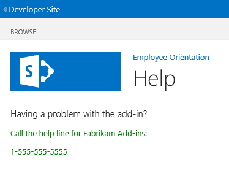

# <a name="add-a-custom-page-and-style-to-a-sharepoint-hosted-sharepoint-add-in"></a><span data-ttu-id="8b70e-101">Hinzufügen einer benutzerdefinierten Seite und Formatvorlage zu einem von SharePoint gehosteten SharePoint-Add-In</span><span class="sxs-lookup"><span data-stu-id="8b70e-101">Add a custom page and style to a SharePoint-hosted SharePoint Add-in</span></span>
<span data-ttu-id="8b70e-102">Erfahren Sie, wie Sie eine benutzerdefinierte Seite und CSS-Datei in ein SharePoint-Add-In einschließen.</span><span class="sxs-lookup"><span data-stu-id="8b70e-102">Learn how to include a custom page and CSS file  in an spappplural.</span></span>
 

 <span data-ttu-id="8b70e-p101">**Hinweis** Der Name „Apps für SharePoint“ wird in „SharePoint-Add-Ins“ geändert. Während des Übergangszeitraums wird in der Dokumentation und der Benutzeroberfläche einiger SharePoint-Produkte und Visual Studio-Tools möglicherweise weiterhin der Begriff „Apps für SharePoint“ verwendet. Weitere Informationen finden Sie unter [Neuer Name für Office- und SharePoint-Apps](new-name-for-apps-for-sharepoint#bk_newname).</span><span class="sxs-lookup"><span data-stu-id="8b70e-p101">The name "apps for SharePoint" is changing to "SharePoint Add-ins". During the transition, the documentation and the UI of some SharePoint products and Visual Studio tools might still use the term "apps for SharePoint". For details, see [New name for apps for Office and SharePoint](new-name-for-apps-for-sharepoint#bk_newname).</span></span>
 

<span data-ttu-id="8b70e-p102">Dies ist der siebte in einer Reihe von Artikeln über die Grundlagen der Entwicklung von von SharePoint gehosteten SharePoint-Add-Ins. Machen Sie sich zunächst mit [SharePoint-Add-Ins](sharepoint-add-ins) und den vorherigen Artikeln in dieser Reihe vertraut:</span><span class="sxs-lookup"><span data-stu-id="8b70e-p102">Learn how to include a custom page and CSS file in an SharePoint Add-ins. This is the seventh in a series of articles about the basics of developing SharePoint-hosted SharePoint Add-ins. You should first be familiar with  [SharePoint Add-ins](sharepoint-add-ins) and the previous articles in this series:</span></span>
 

-  [<span data-ttu-id="8b70e-108">Erste Schritte beim Erstellen von von SharePoint gehosteten SharePoint-Add-Ins</span><span class="sxs-lookup"><span data-stu-id="8b70e-108">Get started creating SharePoint-hosted SharePoint Add-ins</span></span>](get-started-creating-sharepoint-hosted-sharepoint-add-ins)
    
 
-  [<span data-ttu-id="8b70e-109">Bereitstellung und Installation eines von SharePoint gehosteten SharePoint-Add-Ins</span><span class="sxs-lookup"><span data-stu-id="8b70e-109">Deploy and install a SharePoint-hosted SharePoint Add-in</span></span>](deploy-and-install-a-sharepoint-hosted-sharepoint-add-in)
    
 
-  [<span data-ttu-id="8b70e-110">Hinzufügen von benutzerdefinierten Spalten zu einem von SharePoint gehosteten SharePoint-Add-In</span><span class="sxs-lookup"><span data-stu-id="8b70e-110">Add custom columns to a SharePoint-hostedSharePoint Add-in</span></span>](add-custom-columns-to-a-sharepoint-hostedsharepoint-add-in)
    
 
-  [<span data-ttu-id="8b70e-111">Hinzufügen eines benutzerdefinierten Inhaltstyps zu einem von SharePoint gehosteten SharePoint-Add-In</span><span class="sxs-lookup"><span data-stu-id="8b70e-111">Add a custom content type to a SharePoint-hostedSharePoint Add-in</span></span>](add-a-custom-content-type-to-a-sharepoint-hostedsharepoint-add-in)
    
 
-  [<span data-ttu-id="8b70e-112">Hinzufügen eines Webparts zu einer Seite in einem von SharePoint gehosteten SharePoint-Add-In</span><span class="sxs-lookup"><span data-stu-id="8b70e-112">Add a Web Part to a page in a SharePoint-hosted SharePoint Add-in</span></span>](add-a-web-part-to-a-page-in-a-sharepoint-hosted-sharepoint-add-in)
    
 
-  [<span data-ttu-id="8b70e-113">Hinzufügen eines Workflows zu einem von SharePoint gehosteten SharePoint-Add-In</span><span class="sxs-lookup"><span data-stu-id="8b70e-113">Add a workflow to a SharePoint-hosted SharePoint Add-in</span></span>](add-a-workflow-to-a-sharepoint-hosted-sharepoint-add-in)
    
 

 <span data-ttu-id="8b70e-p103">**Hinweis** Wenn Sie diese Reihe zu von SharePoint gehosteten Add-Ins durchgearbeitet haben, haben Sie eine Visual Studio-Projektmappe, die Sie verwenden können, um mit diesem Thema fortzufahren. Sie können außerdem das Repository unter [SharePoint_SP-Hosted_Add-Ins_Tutorials](https://github.com/OfficeDev/SharePoint_SP-hosted_Add-Ins_Tutorials) herunterladen und die Datei „BeforePage.sln“ öffnen.</span><span class="sxs-lookup"><span data-stu-id="8b70e-p103">**Note** If you have been working through this series about SharePoint-hosted add-ins, then you have a Visual Studio solution that you can use to continue with this topic. You can also download the repository at  [SharePoint_SP-hosted_Add-Ins_Tutorials](https://github.com/OfficeDev/SharePoint_SP-hosted_Add-Ins_Tutorials) and open the BeforePage.sln file.</span></span>
 

<span data-ttu-id="8b70e-116">In diesem Artikel fügen Sie dem SharePoint-Add-In „Orientierung für Mitarbeiter“ eine Hilfeseite hinzu und konfigurieren sie für die Verwendung eines benutzerdefinierten CSS-Stylesheets.</span><span class="sxs-lookup"><span data-stu-id="8b70e-116">In this article you add a help page to the Employee Orientation SharePoint Add-in and configure it to use a custom CSS stylesheet.</span></span> 
 

## <a name="add-a-page"></a><span data-ttu-id="8b70e-117">Hinzufügen einer Seite</span><span class="sxs-lookup"><span data-stu-id="8b70e-117">Add a page</span></span>


1. <span data-ttu-id="8b70e-p104">Klicken Sie im **Projektmappen-Explorer** mit der rechten Maustaste auf den Ordner **Seiten**, und wählen Sie **Hinzufügen** > **Neues Element**. Das Dialogfeld **Neues Element hinzufügen** wird mit dem Knoten **Office/SharePoint** geöffnet.</span><span class="sxs-lookup"><span data-stu-id="8b70e-p104">In  **Solution Explorer**, right-click the  **Pages** folder and choose **Add** > **New Item**. The  **Add New Item** dialog opens to the **Office/SharePoint** node.</span></span>
    
 
2. <span data-ttu-id="8b70e-120">Wählen Sie **Seite**, und weisen Sie den Namen „Help.aspx“ zu.</span><span class="sxs-lookup"><span data-stu-id="8b70e-120">Choose  **Page** and give it the nameHelp.aspx.</span></span> 
    
 
3. <span data-ttu-id="8b70e-121">Suchen Sie die beiden **asp:Content**-Elemente in der Datei, und fügen Sie das folgende **asp:Content** Markup zwischen ihnen hinzu.</span><span class="sxs-lookup"><span data-stu-id="8b70e-121">Find the two  **asp:Content** elements in the file, and add the following third **asp:Content** markup in between them.</span></span>
    
```HTML
  <asp:Content ContentPlaceHolderID="PlaceHolderPageTitleInTitleArea" runat="server">
    Help
</asp:Content> 
```

4. <span data-ttu-id="8b70e-122">Suchen Sie das **asp:Content**-Element mit der ID **PlaceholderAdditionalPageHead**, und fügen Sie ihm das folgende Markup hinzu.</span><span class="sxs-lookup"><span data-stu-id="8b70e-122">Find the  **asp:Content** element with the ID of **PlaceholderAdditionalPageHead**, and add the following markup to it.</span></span>
    
```HTML
  <link rel="Stylesheet" type="text/css" href="../Content/App.css" />
```

5. <span data-ttu-id="8b70e-123">Suchen Sie das **asp:Content**-Element mit der ID **PlaceHolderMain**, und entfernen Sie alle untergeordneten Elemente.</span><span class="sxs-lookup"><span data-stu-id="8b70e-123">Find the  **asp:Content** element with the ID of **PlaceHolderMain**, and remove any child elements in it.</span></span>
    
 
6. <span data-ttu-id="8b70e-124">Fügen Sie demselben **asp:Content**-Elements Folgendes als Inhalt hinzu.</span><span class="sxs-lookup"><span data-stu-id="8b70e-124">Add the following as content to the same  **asp:Content** element.</span></span>
    
```HTML
  <H3>Having a problem with the add-in?</H3>
<p> Call the help line for Fabrikam Add-ins:</p>
<p>1-555-555-5555</p>
```

7. <span data-ttu-id="8b70e-125">Speichern und schließen Sie die Datei.</span><span class="sxs-lookup"><span data-stu-id="8b70e-125">Save and close the file.</span></span>
    
 
8. <span data-ttu-id="8b70e-126">Öffnen Sie die Datei „Default.aspx“.</span><span class="sxs-lookup"><span data-stu-id="8b70e-126">Open the Default.aspx file.</span></span>
    
 
9. <span data-ttu-id="8b70e-127">Suchen Sie das **asp:Content**-Element mit der ID **PlaceHolderMain**, und fügen Sie das folgende Markup am Ende hinzu.</span><span class="sxs-lookup"><span data-stu-id="8b70e-127">Find the  **asp:Content** element with the ID of **PlaceHolderMain**, and then add the following markup to the end of it.</span></span> 
    
```HTML
  <p><asp:HyperLink runat="server" NavigateUrl="JavaScript:window.location = _spPageContextInfo.webAbsoluteUrl + '/Pages/Help.aspx';" 
    Text="Get help for the Employee Orientation add-in" /></p>

```

10. <span data-ttu-id="8b70e-128">Speichern und schließen Sie die Datei.</span><span class="sxs-lookup"><span data-stu-id="8b70e-128">Save and close the file.</span></span>
    
 

## <a name="add-a-style-class-to-the-stylesheet"></a><span data-ttu-id="8b70e-129">Hinzufügen einer Formatklasse zum Stylesheet</span><span class="sxs-lookup"><span data-stu-id="8b70e-129">Add a style class to the stylesheet</span></span>


 

 

1. <span data-ttu-id="8b70e-130">Öffnen Sie im **Projektmappen-Explorer** die Datei „app.css“ im Ordner **Inhalt**, und fügen Sie der Datei dann die folgende Zeile hinzu.</span><span class="sxs-lookup"><span data-stu-id="8b70e-130">In  **Solution Explorer**, open the app.css file in the  **Contents** folder, and then add the following line to the file.</span></span>
    
```
  p {color: green;}
```

2. <span data-ttu-id="8b70e-131">Speichern und schließen Sie die Datei.</span><span class="sxs-lookup"><span data-stu-id="8b70e-131">Save and close the file.</span></span>
    
 

## <a name="run-and-test-the-add-in"></a><span data-ttu-id="8b70e-132">Ausführen und Testen des Add-Ins</span><span class="sxs-lookup"><span data-stu-id="8b70e-132">Run and test the add-in</span></span>


 

 

1. <span data-ttu-id="8b70e-p105">Verwenden Sie die F5-TASTE, um Ihr Add-In bereitzustellen und auszuführen. Visual Studio führt eine temporäre Installation des Add-Ins auf Ihrer SharePoint-Testwebsite durch und führt das Add-In sofort aus.</span><span class="sxs-lookup"><span data-stu-id="8b70e-p105">Use the F5 key to deploy and run your add-in. Visual Studio makes a temporary installation of the add-in on your test SharePoint site and immediately runs the add-in.</span></span> 
    
 
2. <span data-ttu-id="8b70e-135">Wenn die Standardseite des Add-Ins geöffnet wird, klicken Sie auf den Link **Hilfe für das Add-In „Orientierung für Mitarbeiter“**, um die Seite **Hilfe** zu öffnen.</span><span class="sxs-lookup"><span data-stu-id="8b70e-135">When the add-in's default page opens, click the  **Get help for the Employee Orientation add-in** link to open the **Help** page.</span></span>
    
    <span data-ttu-id="8b70e-136">Ihre benutzerdefinierte Seite wird geöffnet, und die beiden Zeilen, die Sie in</span><span class="sxs-lookup"><span data-stu-id="8b70e-136">Your custom page opens and the two lines that you put in</span></span> <p> <span data-ttu-id="8b70e-137">-Tags eingeschlossen haben, werden grün angezeigt.</span><span class="sxs-lookup"><span data-stu-id="8b70e-137">tags are green.</span></span>
    

    <span data-ttu-id="8b70e-138">**Hilfeseite**</span><span class="sxs-lookup"><span data-stu-id="8b70e-138">**Help page**</span></span>

 

  
 

    
    
 
3. <span data-ttu-id="8b70e-p107">Schließen Sie zum Beenden der Debugsitzung das Browserfenster, oder beenden Sie das Debuggen in Visual Studio. Jedes Mal, wenn Sie F5 drücken, zieht Visual Studio die vorherige Version des Add-Ins zurück und installiert die neueste.</span><span class="sxs-lookup"><span data-stu-id="8b70e-p107">To end the debugging session, close the browser window or stop debugging in Visual Studio. Each time that you press F5, Visual Studio will retract the previous version of the add-in and install the latest one.</span></span>
    
 
4. <span data-ttu-id="8b70e-p108">Da Sie mit diesem Add-In und dieser Visual Studio-Projektmappe in anderen Artikeln arbeiten werden, hat es sich bewährt, das Add-In ein letztes Mal zurückzuziehen, wenn Sie Ihre Arbeit daran für eine Weile abgeschlossen haben. Klicken Sie mit der rechten Maustaste auf das Projekt im **Projektmappen-Explorer**, und wählen Sie **Zurückziehen** aus.</span><span class="sxs-lookup"><span data-stu-id="8b70e-p108">You will work with this add-in and Visual Studio solution in other articles, and it's a good practice to retract the add-in one last time when you are done working with it for a while. Right-click the project in **Solution Explorer** and choose **Retract**.</span></span>
    
 

## 
<span data-ttu-id="8b70e-145"><a name="Nextsteps"> </a></span><span class="sxs-lookup"><span data-stu-id="8b70e-145"></span></span>

<span data-ttu-id="8b70e-146">Im nächsten Artikel in dieser Reihe fügen Sie ein benutzerdefiniertes clientseitiges Rendering zu einer Listenspalte in einem SharePoint-Add-In hinzu:  [Hinzufügen des benutzerdefinierten clientseitigen Renderings für ein von SharePoint-gehostetes SharePoint Add-In](add-custom-client-side-rendering-to-a-sharepoint-hosted-sharepoint-add-in).</span><span class="sxs-lookup"><span data-stu-id="8b70e-146">In the next article in this series, you'll add a custom client-side rendering to a list column in a SharePoint Add-in:  [Add custom client-side rendering to a SharePoint-hosted SharePoint Add-in](add-custom-client-side-rendering-to-a-sharepoint-hosted-sharepoint-add-in).</span></span>
 

 

