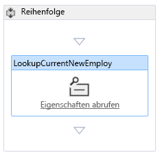

# Hinzufügen eines Workflows zu einem von SharePoint gehosteten SharePoint-Add-InAdd a workflow to a SharePoint-hosted SharePoint Add-in

Dies ist der sechste in einer Reihe von Artikeln über die Grundlagen der Entwicklung von SharePoint gehosteter SharePoint-Add-Ins. Machen Sie sich zunächst mit [SharePoint-Add-Ins](sharepoint-add-ins.md) und den vorherigen Artikeln in dieser Reihe vertraut:This is the sixth in a series of articles about the basics of developing SharePoint-hosted SharePoint Add-ins. You should first be familiar with  [SharePoint Add-ins](sharepoint-add-ins.md) and the previous articles in this series:
 
- [Erste Schritte beim Erstellen von von SharePoint gehosteten SharePoint-Add-InsGet started creating SharePoint-hosted SharePoint Add-ins](get-started-creating-sharepoint-hosted-sharepoint-add-ins.md)
- [Bereitstellung und Installation eines von SharePoint gehosteten Add-Ins für SharePointDeploy and install a SharePoint-hosted SharePoint Add-in](deploy-and-install-a-sharepoint-hosted-sharepoint-add-in.md)
- [Hinzufügen von benutzerdefinierten Spalten zu einem von SharePoint gehosteten SharePoint-Add-InAdd custom columns to a SharePoint-hosted SharePoint Add-in](add-custom-columns-to-a-sharepoint-hosted-sharepoint-add-in.md)
- [Hinzufügen eines benutzerdefinierten Inhaltstyps zu einem von SharePoint gehosteten SharePoint-Add-InAdd a custom content type to a SharePoint-hosted SharePoint Add-in](add-a-custom-content-type-to-a-sharepoint-hosted-sharepoint-add-in.md)
- [Hinzufügen eines Webparts zu einer Seite in einem von SharePoint gehosteten Add-In für SharePointAdd a Web Part to a page in a SharePoint-hosted SharePoint Add-in](add-a-web-part-to-a-page-in-a-sharepoint-hosted-sharepoint-add-in.md)

> [!NOTE]
> Wenn Sie diese Reihe zu von SharePoint gehosteten Add-Ins durchgearbeitet haben, können Sie das Thema mit einer Visual Studio-Lösung weiter vertiefen.Note  If you have been working through this series about SharePoint-hosted add-ins, then you have a Visual Studio solution that you can use to continue with this topic. You can also download the repository at  SharePoint_SP-hosted_Add-Ins_Tutorials and open the BeforeClientRenderedControl.sln file. Sie können auch das Repository unter [SharePoint_SP-hosted_Add-Ins_Tutorials](https://github.com/OfficeDev/SharePoint_SP-hosted_Add-Ins_Tutorials) herunterladen und die Datei „BeforeWorkflow.sln“ öffnen.You can also download the repository at [SharePoint_SP-hosted_Add-Ins_Tutorials](https://github.com/OfficeDev/SharePoint_SP-hosted_Add-Ins_Tutorials) and open the BeforeWorkflow.sln file.

In diesem Artikel fügen Sie einen Workflow im SharePoint-Add-In „Orientierung für Mitarbeiter“ hinzu, der die Personalabteilung (HR) benachrichtigt, dass ein neuer Mitarbeiter bereit ist, die Personalpapiere auszufüllen.In this article you add a workflow the Employee Orientation SharePoint Add-in that notifies the Human Resources (HR) department that a new employee is ready to fill out the HR paperwork.

## Hinzufügen eines Workflows zu einem Add-InAdd a workflow to an add-in

1. Klicken Sie im **Projektmappen-Explorer** mit der rechten Maustaste auf das Projekt, und wählen Sie **Hinzufügen** > **Neuer Ordner** aus.In **Solution Explorer**, right-click the project, and select **Add** > **New Folder**. Nennen Sie den Ordner **Workflows**.Name the folder **Workflows**.
    
2. Klicken Sie mit der rechten Maustaste auf den neuen Ordner, und wählen Sie **Hinzufügen** > **Neues Element** aus.Right-click the new folder, and select **Add** > **New Item**. Das Dialogfeld **Neues Element hinzufügen** wird geöffnet, und der **Office/SharePoint**-Knoten wird angezeigt.Right-click the new folder and choose  AddNew Item. The  **Add New Item** dialog opens to the **Office/SharePoint** node.
    
3. Wählen Sie **Workflow** aus, und geben Sie ihm den Namen **HR_Intake**.Select **Workflow** and give it the name **HR_Intake**. Wenn Sie aufgefordert werden, den Workflowtyp auszuwählen, wählen Sie **Listenworkflow** und dann **Weiter** aus.When prompted to select the type of workflow, select **List Workflow**, and then select **Next**. 
 
4. Aktivieren Sie auf der nächsten Seite des Assistenten die Option **Ja, Zuordnung durchführen...** aus, und legen Sie dann die Dropdownfelder auf die folgenden Werte fest:On the next page of the wizard, enable the  **Yes, associate ...** option and then set the drop down controls to the following values:
    
   -  **Die Bibliothek oder Liste, der der Workflow zugeordnet werden soll**: Neue Mitarbeiter in Seattle**The library or list to associate your workflow with**
   -  **Die Verlaufsliste**: `<create new>`**The history list ...**
   -  **Die Aufgabenliste**: `<create new>`**The Task list ...**

5. Wählen Sie **Weiter** aus.Select **Next**.
    
6. Aktivieren Sie auf der letzten Seite des Assistenten die Option zum automatischen Starten des Workflows *nur*, wenn ein Element *geändert* wird.On the last page of the wizard, enable *only* the option to start the workflow automatically when an item is *changed*.
    
7. Wählen Sie **Fertig stellen** aus.Select **Finish**.
    
   Von den Office Developer Tools für Visual Studio wird Folgendes ausgeführt:The Office Developer Tools for Visual Studio then do the following:
      - Erstellen eines HR_Intake-Workflows im Ordner **Workflows** mit einer untergeordneten Workflow.xaml-Datei, die im Workflow-Designer geöffnet istCreate an HR_Intake workflow in the **Workflow** folder, with a child Workflow.xaml file that is open in the workflow designer.
      - Erstellen einer **WorkflowTaskList**-Listeninstanz, in der Aufgaben, die Teil des Workflows sind, erstellt und aktualisiert werdenCreate a  **WorkflowTaskList** list instance where tasks that are part of the workflow are created and updated.
      - Erstellen einer **WorkflowHistoryList**-Listeninstanz, die ein Protokoll der verschiedenen stattfindenden Schritte bei jeder Ausführung des Workflows istCreate a  **WorkflowHistoryList** list instance, which is a log of the various steps in each execution of the workflow as they occur.
    
8. Ziehen Sie die zwei neuen Listeninstanzen in den Ordner **Listen**.Drag the two new list instances into the  **Lists** folder.
    
## Entwerfen des WorkflowsDesign the workflow

Der Workflow sendet eine E-Mail, um einen Mitarbeiter der Personalabteilung zu benachrichtigen, dass der neue Mitarbeiter die Orientierungsphase der **Tour durch das Gebäude** abgeschlossen hat und zum Ausfüllen der Aufnahmepersonalpapiere bereit ist.The workflow sends an email to notify an HR staffer that the new employee has finished the **Tour of building** stage of orientation and is ready to fill out the HR intake paperwork. Jede Änderung in einem vorhandenen Element der Liste **Neue Mitarbeiter in Seattle** löst den Workflow aus, aber der Workflow führt keine Aktionen aus, bis das Feld **Orientierungsphase** des Listenelements auf **HR paperwork** festgelegt wird.Any change in an existing item on the **New Employees in Seattle** list triggers the workflow, but the workflow does nothing unless the **Orientation Stage** field of the list item is set to **HR paperwork**. Dann wird eine E-Mail an einen Mitarbeiter der Personalabteilung gesendet und eine Aufgabe für diesen Mitarbeiter zur **WorkflowTaskList** hinzugefügt.If it is, an email is sent to an HR staffer and a task for that employee is added to the **WorkflowTaskList**. 

 > [!NOTE]
 > An verschiedenen Punkten während des Entwerfens Ihres Workflows wird ein blaues Rautensymbol mit einem Ausrufezeichen ( At various times when designing your workflow, a blue diamond symbol with an exclamation mark in it (  ) für ein oder mehrere Elemente im Workflow-Designer angezeigt.) will appear on one or more items in the workflow designer. Diese weisen auf temporäre Fehler hin.These report temporary errors. (Bewegen Sie den Cursor über das Symbol, um eine kurze Meldung anzuzeigen, oder suchen Sie in der **Fehlerliste** von Visual Studio nach Details.) Hierbei handelt es sich um Nebeneffekte der Unvollständigkeit des Workflows., will appear on one or more items in the workflow designer. These report temporary errors. (Hover the cursor over the symbol to see a brief message, or look in the Visual Studio  **Error List** for details.) These are side effects of the incompleteness of the workflow. They should all be gone when you have finished this procedure. Diese sollten nicht mehr vorhanden sein, wenn Sie das Verfahren abgeschlossen haben.They should all be gone when you have finished this procedure.

1. Öffnen Sie den Bereich **Toolbox** in Visual Studio, erweitern Sie den Knoten **SP - Liste**, und ziehen Sie dann **LookupSPListItem** in die **Sequenz** im Designer.Open the  **Toolbox** pane in Visual Studio, expand the **SP - List** node, and then drag **LookupSPListItem** into the **Sequence** in the designer.
    
2. Wählen Sie **LookupSPListItem** aus, um die Eigenschaften im Visual Studio-Bereich **Eigenschaften** anzuzeigen.Select the  **LookupSPListItem** so that its properties appear in the Visual Studio **Properties** pane. Set the following properties to these values: Legen Sie die Eigenschaften auf die folgenden Werte fest:Set the following properties to these values:
    
   -  **ItemID:** (aktuelles Element)**ItemID:** (current item)
   -  **ListID:** (aktuelle Liste)**ListID:** (current list)
   -  **DisplayName:** LookupCurrentNewEmployee**DisplayName:** LookupCurrentNewEmployee

   Der Bereich **Eigenschaften** sollte jetzt wie folgt aussehen:The  **Properties** pane should now look like the following:
   
    *Abbildung 1. Eigenschaftenbereich von LookupSPListItem**Figure 1. Properties pane of LookupSPListItem*

    
 

3. Klicken Sie auf eine beliebige Stelle außerhalb des Bereichs, um die Änderungen zu speichern.Select anywhere outside the pane to save your changes. Die Oberfläche des Designers sollte jetzt wie folgt aussehen.Choose  OK. The designer surface should now look like the following:
    
    *Abbildung 2. Sequenz im Workflow-Designer**Sequence in the workflow designer*

    

4. Wählen Sie den Link **Eigenschaften abrufen** in der (neu umbenannten) Aktivität **LookupCurrentNewEmployee** im Designer aus.Click the **Get Properties** link inside the (newly renamed) **LookupCurrentNewEmployee** activity in the designer. This adds a GetDynamicValueProperties activity to the sequence. Dadurch wird eine **GetDynamicValueProperties**-Aktivität zur Sequenz hinzugefügt.This adds a **GetDynamicValueProperties** activity to the sequence.
    
5. Wählen Sie den Text **Definieren...**Select the **Define…** in der Aktivität **GetDynamicValueProperties** aus.text in the **GetDynamicValueProperties** activity. Dadurch wird das Dialogfeld **Eigenschaften** geöffnet.This will open the **Office Add-ins** dialog box.
    
6. Legen Sie den **Entitätstyp** auf **Listenelement von** _Name_der_Listeninstanz_ fest, wobei _Name_der_Listeninstanz_ **Neue Mitarbeiter in Seattle** ist.Set the **Entity Type** to **List Item of ** _list_instance_name_, where _list_instance_name_ is **New Employees in Seattle**.
    
7. Wählen Sie in der Spalte **Pfad** die oberste Zelle aus, und wählen Sie dann **Orientierungsphase** aus der Dropdownliste aus.In the **Path** column, click the top cell and then choose **Orientation Stage** from the drop down.
 
8. Wählen Sie die Zelle darunter aus, und wählen Sie dann **Titel (Titel)** aus der Dropdownliste aus.Select the cell under it, and then select **Title (Title)** from the drop-down.
 
9. Wählen Sie **Variablen auffüllen** aus.Select **Populate Variables**. Dadurch Variablen namens **OrientationStage** und **Title** erstellt, und jeder wird der Wert der entsprechenden Felder im aktuellen Element der Liste **Neue Mitarbeiter in Seattle** zugewiesen.Click **Populate Variables**. This will create a variables named **OrientationStage** and Title and assign each of the value of corresponding fields in the current item of the **New Employees in Seattle** list. The Properties dialog should now look like the following: Das Dialogfeld **Eigenschaften** sollte nun wie folgt aussehen:The  **Properties** pane should now look like the following:
    
   *Abbildung 3. Dialogfeld „Eigenschaften“ der Workflowaktivität**Properties dialog of workflow activity*

   
 

10. Wählen Sie **OK** aus.Select **OK**. Die Designeroberfläche sollte jetzt wie folgt aussehen:Choose  OK. The designer surface should now look like the following:
    
    *Abbildung 4. Workflow-Designer**Figure 4. Workflow designer*

    

11. Öffnen Sie den Bereich **Toolbox** in Visual Studio, erweitern Sie den Knoten **Ablaufsteuerung**, und ziehen Sie dann **Wenn** in den unteren Bereich von **Sequenz** unterhalb von **GetDynamicValueProperties**.Open the  **Toolbox** pane in Visual Studio, expand the **Control Flow** node, and then drag **If** into the bottom of the **Sequence** below the **GetDynamicValueProperties**.
 
12. Geben Sie in das Feld **Bedingung** von **Wenn** den Wert **OrientationStage=="HR paperwork"** ein.In the  **Condition** box of the **If**, enter OrientationStage=="HR paperwork".
    
13. Öffnen Sie den Bereich **Toolbox** in Visual Studio, erweitern Sie den Knoten **SP - Hilfsprogramme**, und ziehen Sie dann **E-Mail** in das Feld **Dann** der **Wenn**-Aktivität.Open the  **Toolbox** pane in Visual Studio, expand the **SP - Utilities** node, and then drag **Email** into the **Then** box of the **If** activity.
    
14. Wählen Sie die **E-Mail**-Aktivität aus.Select the **Email** activity. Legen Sie im Bereich **Eigenschaften** die Werte für die Eigenschaften **Textkörper**, **Betreff** und **An** fest.In the **Properties** pane, set the values of the **Body**, **Subject**, and **To** properties. Wählen Sie in jedem Fall die Popupschaltfläche **...**In each case, choose the callout button **. . .** für die Eigenschaft, und verwenden Sie den sich öffnenden **Ausdrucks-Editor**, um den Wert der Eigenschaft wie in der folgenden Tabelle festzulegen.for the property and use the **Expression Editor** that opens to set the property's value as in the following table. Da es sich dabei um C#-Zeichenfolgenausdrücke handelt, müssen Sie die Anführungszeichen exakt wie gezeigt verwenden.These are C# string expressions, so use quotation marks exactly as shown. `Title` ist hier eine Variable, die Sie zuvor dem Feld **Titel** des Listenelements zugewiesen haben (das den Namen des Mitarbeiters enthält).The `Title` here is a variable that you assigned earlier to the **Title** field of the list item (which holds the name of the employee).
    
    -  **Text:** `Title + " is waiting in the lobby to fill out benefits and employment forms."`**Body:** `Title + " is waiting in the lobby to fill out benefits and employment forms."`
    -  **Betreff:** `Title + " is ready for HR paperwork"`**Subject:** `Title + " is ready for HR paperwork"`
    -  **An:** `new System.Collections.ObjectModel.Collection<string>() {"your_O365_email"}`**To:** `new System.Collections.ObjectModel.Collection<string>() {"your_O365_email"}`
    
    Ersetzen Sie den Platzhalter *your_O365_email* durch die Identität, mit der Sie sich bei Ihrem Office 365-Entwicklerkonto anmelden, z. B. `*alias*@*O365domain*.sharepoint.com`.Replace the placeholder,  your_O365_email  , with the identity that you use to login to your Office 365 developer account, such as alias  O365domain  .sharepoint.com. This is a C# string so it must be in quotation marks. Da es sich hier um eine C#-Zeichenfolge handelt, muss diese in Anführungszeichen eingeschlossen sein.This is a C# string so it must be in quotation marks.
    
15. Öffnen Sie den Bereich **Toolbox** in Visual Studio, erweitern Sie den Knoten **Runtime**, und ziehen Sie dann **TerminateWorkflow** in das Feld **Sonst** der **Wenn**-Aktivität.Open the  **Toolbox** pane in Visual Studio, expand the **Runtime** node, and then drag **TerminateWorkflow** into the **Else** box of the **If** activity.
    
16. Wählen Sie die **TerminateWorkflow**-Aktivität aus, und legen Sie im Bereich **Eigenschaften** den **Grund** auf Folgendes fest (*einschließlich der Anführungszeichen*): `"Not at HR paperwork stage."`.Select the  TerminateWorkflow activity and in the Properties pane, set the Reason to the following, * including the quotation marks*  :"Not at HR paperwork stage.". The designer should now look the following: Der Designer sollte jetzt wie folgt aussehen:Choose  OK. The designer surface should now look like the following:
    
    *Abbildung 5. Workflow-Designer, wenn der Workflow abgeschlossen ist**Workflow designer when the workflow is complete*

    
 

## Ausführen und Testen des Add-InsRun and test the add-in

1. Verwenden Sie die F5-Taste, um Ihr Add-In bereitzustellen und auszuführen.Use the F5 key to deploy and run your add-in. Visual Studio führt eine temporäre Installation des Add-Ins auf Ihrer SharePoint-Testwebsite durch und führt das Add-In sofort aus.Use the F5 key to deploy and run your add-in. Visual Studio makes a temporary installation of the add-in on your test SharePoint site and immediately runs the add-in. Die Konsole **Diensttesthost** des Workflow-Managers wird ebenfalls geöffnet.The Workflow Manager's **Test Service Host** console also opens.
    
2. Wenn die Standardseite des Add-Ins geöffnet wird, öffnen Sie eins der Elemente zum Bearbeiten, und legen Sie den Wert von **OrientationStage** auf **HR paperwork** fest.When the add-in's default page opens,  open one of the items for editing, and set the value of **Orientation Stage** to **HR paperwork**. 
    
   In der Konsole **Diensttesthost** wird der Hinweis angezeigt, dass der Workflow gestartet wurde.In the  **Test Service Host** console, an indication appears that the workflow has started. Shortly after, there is an indication that the workflow has completed. The following is an example: Kurz danach wird der Hinweis angezeigt, dass der Workflow abgeschlossen ist.Shortly after, there is an indication that the workflow has completed. Es folgt ein Beispiel:The following is an example:
 
   *Abbildung 6. Konsole „Diensttesthost“**Figure 6. Test Service Host console*

   
 
    > [!NOTE]
    > Wenn die Konsole **Diensttesthost** nicht geöffnet wird, müssen Sie möglicherweise das Workflow-Debugging aktivieren.If the  **Test Service Host** console does not open, you may need to enable workflow debugging. Klicken Sie im **Projektmappen-Explorer** mit der rechten Maustaste auf den Projektnamen, und wählen Sie **Eigenschaften** aus.Right-click the project name in **Solution Explorer** and select **Properties**. Öffnen Sie im Bereich **Eigenschaften** die Registerkarte **SharePoint**, und aktivieren Sie  das Kontrollkästchen **Workflow-Debugging aktivieren**.Open the **SharePoint** tab on the **Properties** pane and select the **Enable Workflow debugging** check box.

3. Wechseln Sie zum E-Mail-Posteingang (Outlook) Ihres Office 365-Entwicklerkontos.Go to the email inbox (Outlook) of your Office 365 developer account. Dort finden Sie eine E-Mail mit dem Betreff „*Employee* is ready for HR paperwork“, wobei *Employee* der Name des Mitarbeiters ist, dessen Element Sie bearbeitet haben.There is an email with the subject "*Employee* is ready for HR paperwork" where *Employee* is the name of the employee whose item you edited. Der Textkörper der E-Mail lautet „*Employee* is waiting in the lobby to fill out benefits and employment forms.“The body of the email says "*Employee* is waiting in the lobby to fill out benefits and employment forms." Es folgt ein Beispiel:The following is an example:
    
   *Abbildung 7. Vom Workflow gesendete E-Mail**Figure 7. Email sent by workflow*

   

   > [!TIP]
   > Wenn der Workflow gestartet, aber niemals abgeschlossen und die E-Mail nicht gesendet wird, versuchen Sie, die Debugsitzung zu beenden, und drücken Sie einige Male erneut F5, bevor Sie davon ausgehen, dass etwas in Ihrem Code nicht in Ordnung ist.If the workflow begins but never completes, and the email is not sent, try ending the debugging session and trying F5 again a few times before you conclude there is something wrong in your code. Sometimes the problem is in sposhort. Manchmal liegt das Problem bei SharePoint Online.Sometimes the problem is in SharePoint Online. Wenn weiterhin Probleme auftreten, versuchen Sie, einen Inhaltstyp namens **ListFieldsContentType**, falls dieser noch nicht vorhanden ist, zum Abschnitt **ContentTypes** der Datei „schema.xml“ hinzuzufügen.If you are still having problems, try adding a content type called **ListFieldsContentType**, if there isn't one already, to the **ContentTypes** section of the schema.xml file. The following is an example of the markup. Im Folgenden finden Sie ein Beispiel für das Markup:The following is an example of the markup: 
   
   > `<ContentType ID="0x0100781dd48170b94fdc9706313c82b3d04c" Name="ListFieldsContentType" Hidden="TRUE"></ContentType>`
   
   > Kopieren Sie den gesamten **FieldRefs**-Abschnitt des Inhaltstyps **NewEmployee** in diesen neuen Inhaltstyp.Then copy the whole of the FieldRefs section of the NewEmployee content type into this new content type. Speichern Sie das Projekt, ziehen Sie es zurück, und drücken Sie erneut F5.Save the project, retract, and try F5 again.

4. Schließen Sie zum Beenden der Debugsitzung das Browserfenster, oder beenden Sie das Debuggen in Visual Studio.To end the debugging session, close the browser window or stop debugging in Visual Studio. Each time that you press F5, Visual Studio will retract the previous version of the add-in and install the latest one. Jedes Mal, wenn Sie F5 drücken, zieht Visual Studio die vorherige Version des Add-Ins zurück und installiert die neueste.Each time that you select F5, Visual Studio retracts the previous version of the add-in and installs the latest one.
    
5. Da Sie mit diesem Add-In und dieser Visual Studio-Lösung in anderen Artikeln arbeiten werden, hat es sich bewährt, das Add-In ein letztes Mal zurückzuziehen, wenn Sie Ihre Arbeit daran für eine Weile abgeschlossen haben.You will work with this add-in and Visual Studio solution in other articles, and it's a good practice to retract the add-in one last time when you are done working with it for a while. Right-click the project in  Solution Explorer and choose Retract. Klicken Sie mit der rechten Maustaste auf das Projekt im **Projektmappen-Explorer**, und wählen Sie **Zurückziehen** aus.Right-click the project in  **Solution Explorer** and choose **Retract**.
    

## Nächste SchritteNext steps

Im nächsten Artikel dieser Reihe [fügen Sie eine benutzerdefinierte Seite und Formatvorlage zu einem von SharePoint gehosteten SharePoint-Add-In hinzu](add-a-custom-page-and-style-to-a-sharepoint-hosted-sharepoint-add-in.md).In the next article in this series, you'll add a custom page and style to the SharePoint Add-in:  [Add a custom page and style to a SharePoint-hosted SharePoint Add-in](add-a-custom-page-and-style-to-a-sharepoint-hosted-sharepoint-add-in.md).
 

 

