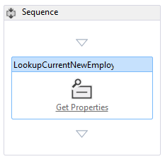
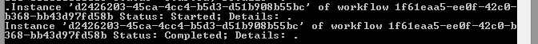

# Hinzufügen eines Workflows zu einem von SharePoint gehosteten SharePoint-Add-InAdd a workflow to a SharePoint-hosted SharePoint Add-in
Erfahren Sie, wie Sie einen Workflow in ein SharePoint-Add-In einschließen.Learn how to include a workflow in a spappsing.
 

 **Hinweis** Der Name „Apps für SharePoint“ wird in „SharePoint-Add-Ins“ geändert. Während des Übergangszeitraums wird in der Dokumentation und der Benutzeroberfläche einiger SharePoint-Produkte und Visual Studio-Tools möglicherweise weiterhin der Begriff „Apps für SharePoint“ verwendet. Weitere Informationen finden Sie unter [Neuer Name für Office- und SharePoint-Apps](new-name-for-apps-for-sharepoint#bk_newname).The name "apps for SharePoint" is changing to "SharePoint Add-ins". During the transition, the documentation and the UI of some SharePoint products and Visual Studio tools might still use the term "apps for SharePoint". For details, see [New name for apps for Office and SharePoint](new-name-for-apps-for-sharepoint#bk_newname).
 

Dies ist der sechste in einer Reihe von Artikeln über die Grundlagen der Entwicklung von von SharePoint gehosteten SharePoint-Add-Ins. Machen Sie sich zunächst mit [SharePoint-Add-Ins](sharepoint-add-ins) und den vorherigen Artikeln in dieser Reihe vertraut:Learn how to surface a remote web form in a SharePoint page in a provider-hosted SharePoint Add-in. This is the sixth in a series of articles about the basics of developing provider-hosted SharePoint Add-ins. You should first be familiar with  [SharePoint Add-ins](sharepoint-add-ins) and the previous articles in this series:
 

-  [Erste Schritte beim Erstellen von von SharePoint gehosteten SharePoint-Add-InsGet started creating SharePoint-hosted SharePoint Add-ins](get-started-creating-sharepoint-hosted-sharepoint-add-ins)
    
 
-  [Bereitstellung und Installation eines von SharePoint gehosteten SharePoint-Add-InsDeploy and install a SharePoint-hosted SharePoint Add-in](deploy-and-install-a-sharepoint-hosted-sharepoint-add-in)
    
 
-  [Hinzufügen von benutzerdefinierten Spalten zu einem von SharePoint gehosteten SharePoint-Add-InAdd custom columns to a SharePoint-hostedSharePoint Add-in](add-custom-columns-to-a-sharepoint-hostedsharepoint-add-in)
    
 
-  [Hinzufügen eines benutzerdefinierten Inhaltstyps zu einem von SharePoint gehosteten SharePoint-Add-InAdd a custom content type to a SharePoint-hostedSharePoint Add-in](add-a-custom-content-type-to-a-sharepoint-hostedsharepoint-add-in)
    
 
-  [Hinzufügen eines Webparts zu einer Seite in einem von SharePoint gehosteten SharePoint-Add-InAdd a Web Part to a page in a SharePoint-hosted SharePoint Add-in](add-a-web-part-to-a-page-in-a-sharepoint-hosted-sharepoint-add-in)
    
 

 **Hinweis** Wenn Sie diese Reihe zu von SharePoint gehosteten Add-Ins durchgearbeitet haben, haben Sie eine Visual Studio-Projektmappe, die Sie verwenden können, um mit diesem Thema fortzufahren. Sie können außerdem das Repository unter [SharePoint_SP-hosted_Add-Ins_Tutorials](https://github.com/OfficeDev/SharePoint_SP-hosted_Add-Ins_Tutorials) herunterladen und die Datei „BeforeWorkflow.sln“ öffnen.**Note** If you have been working through this series about SharePoint-hosted add-ins, then you have a Visual Studio solution that you can use to continue with this topic. You can also download the repository at  [SharePoint_SP-hosted_Add-Ins_Tutorials](https://github.com/OfficeDev/SharePoint_SP-hosted_Add-Ins_Tutorials) and open the BeforeContentType.sln file.
 

In diesem Artikel fügen Sie einen Workflow zum SharePoint-Add-In „Orientierung für Mitarbeiter“ hinzu, der die Personalabteilung (HR) benachrichtigt, dass ein neuer Mitarbeiter bereit ist, die Personalpapiere auszufüllen.In this article you add a workflow the Employee Orientation spappsing that notifies the Human Resources (HR) department that a new employee is ready to fill out the HR paperwork.
 

## Hinzufügen eines Workflows zu einem Add-InAdd  a workflow to an add-in

 

 

1. Klicken Sie im **Projektmappen-Explorer** mit der rechten Maustaste auf das Projekt, und wählen Sie **Hinzufügen** > **Neuer Ordner** aus. Nennen Sie den Ordner „Workflows“.In  **Solution Explorer**, right-click the project and choose  **Add** > **New Folder**. Name the folder Workflows.
    
 
2. Klicken Sie mit der rechten Maustaste auf den neuen Ordner, und wählen Sie **Hinzufügen** > **Neues Element** aus. Das Dialogfeld **Neues Element hinzufügen** wird mit dem Knoten **Office/SharePoint** geöffnet.Right-click the new folder and choose **Add** > **New Item**. The **Add New Item** dialog opens to the **Office/SharePoint** node.
    
 
3. Wählen Sie **Workflow** aus, und geben Sie dem Workflow den Namen „HR_Intake“. Wenn Sie aufgefordert werden, den Workflowtyp auszuwählen, wählen Sie **Listenworkflow** und dann **Weiter** aus.Choose Workflow and give it the name HR_Intake. When prompted to choose the type of workflow, choose List Workflow, and choose Next.
    
 
4. Aktivieren Sie auf der nächsten Seite des Assistenten die Option **Ja, Zuordnung durchführen...** aus, und legen Sie dann die Dropdownfelder auf die folgenden Werte fest:On the next page of the wizard, enable the **Yes, associate ... **option and then set the drop down controls to the following values:
    
      -  **Die Bibliothek oder Liste, der Ihr Workflow zugeordnet werden soll****The library or list to associate your workflow with**
    
    Neue Mitarbeiter in SeattleNew Employees in Seattle
    
 
  -  **Die Verlaufsliste...****The history list ...**
    
    <create new>
    
 
  -  **Die Aufgabenliste...****The Task list ...**
    
    <create new>
    
 

    Klicken Sie auf **Weiter**.Click **Next**.
    
 
5. Aktivieren Sie auf der letzten Seite des Assistenten die Option zum automatischen Starten des Workflows *nur*, wenn ein Element *geändert* wird.On the last page of the wizard, enable *only* the option to start the workflow automatically when an item is *changed*.
    
 
6. Wählen Sie **Fertig stellen**.Choose **Finish**.
    
    Von den Office Developer Tools für Visual Studio wird Folgendes ausgeführt:The Office Developer Tools for Visual Studio will do the following:
    
      - Erstellen eines HR_Intake-Workflows im Ordner **Workflows** mit einer untergeordneten Workflow.xaml-Datei, die im Workflow-Designer geöffnet istCreate an HR_Intake workflow  in the **Workflow** folder, with a child Workflow.xaml file that is open in the workflow designer.
    
 
  - Erstellen einer **WorkflowTaskList**-Listeninstanz, in der Aufgaben, die Teil des Workflows sind, erstellt und aktualisiert werdenCreate a **WorkflowTaskList** list instance where tasks that are part of the workflow are created and updated.
    
 
  - Erstellen einer **WorkflowHistoryList**-Listeninstanz, die ein Protokoll der verschiedenen stattfindenden Schritte bei jeder Ausführung des Workflows istCreate a **WorkflowHistoryList** list instance, which is a log of the various steps in each execution of the workflow as they occur.
    
 
7. Ziehen Sie die zwei neuen Listeninstanzen in den Ordner **Listen**.Drag the two new list instances into the **Lists** folder.
    
 

## Entwerfen des WorkflowsDesign the workflow

Der Workflow sendet eine E-Mail, um einen Mitarbeiter der Personalabteilung zu benachrichtigen, dass der neue Mitarbeiter die Orientierungsphase der **Tour durch das Gebäude** abgeschlossen hat und zum Ausfüllen der Aufnahmepersonalpapiere bereit ist. Jede Änderung in einem vorhandenen Element auf der Liste „Neue Mitarbeiter in Seattle“ löst den Workflow aus, aber der Workflow führt keine Aktionen durch, bis das Feld „Orientierungsphase“ des Listenelements auf HR paperwork festgelegt wird. Dann wird eine E-Mail an einen Mitarbeiter der Personalabteilung gesendet und eine Aufgabe für diesen Mitarbeiter zur **WorkflowTaskList** hinzugefügt.The workflow sends an email to notify an HR staffer that the new employee has finished the Tour of building stage of orientation and is ready to fill out the HR intake paperwork. Any change in an existing item on the New Employees in Seattle list triggers the workflow, but the workflow does nothing unless the Orientation Stage field of the list item is set to HR paperwork.  If it is, then an email is sent to an HR staffer and a task for that employee will be added to the WorkflowTaskList. 
 

 

 **Hinweis** An verschiedenen Punkten während des Entwerfens Ihres Workflows wird ein blaues Rautensymbol mit einem Ausrufezeichen**Note**  At various times when designing your workflow, a blue diamond symbol with an exclamation mark in it, 
 

 
für ein oder mehrere Elemente im Workflow-Designer angezeigt. Diese weisen auf temporäre Fehler hin. (Bewegen Sie den Cursor über das Symbol, um eine kurze Meldung anzuzeigen, oder suchen Sie in der **Fehlerliste** von Visual Studio nach Details.) Hierbei handelt es sich um Nebeneffekte der Unvollständigkeit des Workflows. Diese sollten nicht mehr vorhanden sein, wenn Sie das Verfahren abgeschlossen haben.At various times when designing your workflow, a blue diamond symbol with an exclamation mark in it, , will appear on one or more items in the workflow designer. These report temporary errors. (Hover the cursor over the symbol to see a brief message, or look in the Visual Studio **Error List** for details.) These are side effects of the incompleteness of the workflow. They should all be gone when you have finished this procedure.
 

1. Öffnen Sie den Bereich **Toolbox** in Visual Studio, erweitern Sie den Knoten **SP - Liste**, und ziehen Sie dann **LookupSPListItem** in die **Sequenz** im Designer.Open the Toolbox pane in vsnv, expand the  SP - List node, and then drag LookupSPListItem into the Sequence in the designer.
    
 
2. Wählen Sie **LookupSPListItem** aus, um die Eigenschaften im Visual Studio-Bereich **Eigenschaften** anzuzeigen. Legen Sie die Eigenschaften auf die folgenden Werte fest:Select the **LookupSPListItem** so that its properties appear in the Visual Studio **Properties** pane. Set the following properties to these values:
    
      -  **ItemID:** (aktuelles Element)**ItemId**: (current item)
    
 
  -  **ListID:** (aktuelle Liste)**ListId**: (current list)
    
 
  -  **DisplayName:** LookupCurrentNewEmployee**DisplayName:** LookupCurrentNewEmployee
    
 

    Der Bereich **Eigenschaften** sollte jetzt wie folgt aussehen:The **Properties** pane should now look like the following:
    

    **Eigenschaftenbereich von LookupSPListItem****Properties pane of LookupSPListItem**

 

  
 

    Klicken Sie auf eine beliebige Stelle außerhalb des Bereichs, um die Änderungen zu speichern. Die Oberfläche des Designers sollte jetzt wie folgt aussehen.Click anywhere outside the pane to save your changes and the designer surface should now look like this.
    

    **Sequenz im Workflow-Designer****Sequence in the workflow designer**

 

  
 

    
    
 
3. Klicken Sie auf den Link **Eigenschaften abrufen** in der (neu umbenannten) Aktivität LookupCurrentNewEmployee im Designer. Dadurch wird eine **GetDynamicValueProperties**-Aktivität zur Sequenz hinzugefügt.Click the Get Properties link inside the (newly renamed) LookupCurrentNewEmployee activity in the designer. This adds a GetDynamicValueProperties activity to the sequence.
    
 
4. Klicken Sie auf den Text **Definieren...** in der Aktivität **GetDynamicValueProperties**. Damit wird das Dialogfeld **Eigenschaften** geöffnet.Click the **Define…** text in the **GetDynamicValueProperties** activity. This will open the **Properties** dialog.
    
 
5. Legen Sie den **Entitätstyp** auf **Listenelement von** _Name_der_Listeninstanz_ fest, wobei _Name_der_Listeninstanz_ „Neue Mitarbeiter in Seattle“ ist.Set the Entity Type to List Item of  list_instance_name, where list_instance_name is New Employees in Seattle.
    
 
6. Klicken Sie in der Spalte **Pfad** auf die oberste Zelle, und wählen Sie dann „Orientierungsphase“ aus der Dropdownliste aus.In the **Path** column, click the top cell and then choose Orientation Stage from the drop down.
    
 
7. Klicken Sie auf die Zelle darunter, und wählen Sie dann **Title (Title)** aus der Dropdownliste aus.Click the cell below it and then choose **Title (Title)** from the drop down.
    
 
8. Klicken Sie auf **Variablen auffüllen **. Damit werden die Variablen namens „OrientationStage“ und **Title** erstellt, und jeder wird der Wert der entsprechenden Felder im aktuellen Element der Liste „Neue Mitarbeiter in Seattle“ zugewiesen. Das Dialogfeld **Eigenschaften** sollte nun wie folgt aussehen:Click **Populate Variables**. This will create a variables named OrientationStage and **Title** and assign each of the value of corresponding fields in the current item of the New Employees in Seattle list. The **Properties** dialog should now look like the following:
    
    **Dialogfeld „Eigenschaften“ der Workflowaktivität****Properties dialog of workflow activity**

 

  
 

 

 
9. Wählen Sie **OK** aus. Die Designeroberfläche sollte jetzt wie folgt aussehen:Choose **OK**. The designer surface should now look like the following:
    
    **Workflow-Designer****Workflow Designer**

 

  
 

    
    
 
10. Öffnen Sie den Bereich **Toolbox** in Visual Studio, erweitern Sie den Knoten **Ablaufsteuerung**, und ziehen Sie dann **Wenn** in den unteren Bereich von **Sequenz** unterhalb von **GetDynamicValueProperties**.Open the Toolbox pane in vsnv, expand the Control Flow node, and then drag If into the bottom of the Sequence below the GetDynamicValueProperties.
    
 
11. Geben Sie in das Feld **Bedingung** von **Wenn** den Wert OrientationStage=="HR paperwork" ein.In the Condition box of the If, enter OrientationStage=="HR paperwork".
    
 
12. Öffnen Sie den Bereich **Toolbox** in Visual Studio, erweitern Sie den Knoten **SP - Hilfsprogramme**, und ziehen Sie dann **E-Mail** in das Feld **Dann** der **Wenn**-Aktivität.Open the Toolbox pane in vsnv, expand the  SP - Utilities node, and then drag Email into the Then box of the If activity.
    
 
13. Wählen Sie die Aktivität **E-Mail** aus. Legen Sie im Bereich **Eigenschaften** die Werte für die Eigenschaften des Textkörpers, des Betreffs und der Option „An“ fest. Wählen Sie in jedem Fall die Popupschaltfläche **...** für die Eigenschaft aus, und verwenden Sie den sich öffnenden **Ausdrucks-Editor**, um den Wert der Eigenschaft wie in der folgenden Tabelle festzulegen. Da es sich dabei um C# Zeichenfolgenausdrücke handelt, verwenden Sie die Anführungszeichen exakt wie gezeigt. Der `Title` ist hier eine Variable, die Sie zuvor zum Feld **Title** des Listenelements zugewiesen haben (das den Namen des Mitarbeiters enthält).Select the **Email** activity. In the **Properties** pane,  set the values of the Body, Subject, and To properties. In each case, choose the callout button, **. . .**, for the property and use the **Expression Editor** that opens to  set the property's value as in the following table. These are C# string expressions, so use quotation marks exactly as shown. The Title`Title` here is a variable that you assigned earlier to the **Title** field  of the list item (which holds the name of the employee).
    
      -  **Text:** `Title + " is waiting in the lobby to fill out benefits and employment forms."`body
    
 
  -  **Betreff:** `Title + " is ready for HR paperwork"`subject
    
 
  -  **An:** `new System.Collections.ObjectModel.Collection<string>() {"your_O365_email"}`**to** `new System.Collections.ObjectModel.Collection<string>() {"your_O365_email"}`
    
    Ersetzen Sie den Platzhalter *your_O365_email* durch die Identität, mit der Sie sich bei Ihrem Office 365-Entwicklerkonto anmelden, z. B. *alias*  @ *O365domain* .sharepoint.com. Da es sich hier um eine C#-Zeichenfolge handelt, muss diese in Anführungszeichen eingeschlossen sein.Replace the placeholder, your_O365_email, with the identity that you use to login to your Office 365 developer account, such as alias@O365domain.sharepoint.com. This is a C# string so it must be in quotation  marks.
    
 
14. Öffnen Sie den Bereich **Toolbox** in Visual Studio, erweitern Sie den Knoten **Runtime**, und ziehen Sie dann **TerminateWorkflow** in das Feld **Sonst** der **Wenn**-Aktivität.Open the Toolbox pane in vsnv, expand the Runtime node, and then drag TerminateWorkflow into the Else box of the If activity.
    
 
15. Wählen Sie die Aktivität **TerminateWorkflow** aus, und legen Sie im Bereich **Eigenschaften** den **Grund** auf Folgendes fest, einschließlich der Anführungszeichen* : "Not at HR paperwork stage.". Der Designer sollte jetzt wie folgt aussehen:Select the TerminateWorkflow activity and in the Properties pane, set the Reason to the following,  including the quotation marks: "Not at HR paperwork stage.". The designer should now look the following:
    
    **Workflow-Designer, wenn der Workflow abgeschlossen ist****Workflow designer when the workflow is complete**

 

  
 

 

 

## Ausführen und Testen des Add-InsRun and test the add-in

 

 

1. Verwenden Sie die F5-TASTE, um das Add-In bereitzustellen und auszuführen. Visual Studio führt eine temporäre Installation des Add-Ins auf Ihrer SharePoint-Website durch und führt das Add-In sofort aus. Die Konsole **Diensttesthost** des Workflow-Managers wird ebenfalls geöffnet.Use the F5 key to deploy and run your add-in. vsnv makes a temporary installation of the add-in on your test SharePoint site and immediately runs the add-in. The Workflow Manager's Test Service Host console also opens.
    
 
2. Wenn die Standardseite des Add-Ins geöffnet wird, öffnen Sie eins der Elemente zum Bearbeiten, und legen Sie den Wert von „Orientierungsphase“ auf HR paperwork fest.When the add-in's default page opens,  open one of the items for editing, and set the value of Orientation Stage to HR paperwork. 
    
    In der Konsole **Diensttesthost** wird der Hinweis angezeigt, dass der Workflow gestartet wurde. Kurz danach wird der Hinweis angezeigt, dass der Workflow abgeschlossen ist. Im Folgenden sehen Sie ein Beispiel:In the **Test Service Host** console, an indication appears that the workflow has started. Shortly after, there is an indication that the workflow has completed. The following is an example:
    

    **Konsole „Diensttesthost“****Service Test Host console**

 

  
 

    
    
    
     **Hinweis** Wenn die Konsole **Diensttesthost** nicht geöffnet wird, müssen Sie möglicherweise das Workflow-Debugging aktivieren. Klicken Sie im **Projektmappen-Explorer** mit der rechten Maustaste auf den Projektnamen, und wählen Sie **Eigenschaften** aus. Öffnen Sie im Bereich **Eigenschaften** die Registerkarte **SharePoint**, und aktivieren Sie das Kontrollkästchen **Workflow-Debugging aktivieren**.If the **Test Service Host** console does not open, you may need to enable workflow debugging. Right-click the project name in **Solution Explorer** and choose **Properties**. Open the **SharePoint** tab on the **Properties** pane and check the box for **Enable Workflow debugging**.
3. Navigieren Sie zum E-Mail-Postfach (Outlook) Ihres Office 365-Entwicklerkontos. Dort finden Sie eine E-Mail mit dem Betreff „*Employee* is ready for HR paperwork“, wobei *Employee* der Name des Mitarbeiters ist, deren Element Sie bearbeitet haben. Im Textkörper der E-Mail steht: „*Employee* is waiting in the lobby to fill out benefits and employment forms.“ Im Folgenden sehen Sie ein Beispiel:Navigate to the email inbox (Outlook) of your Office 365 developer account. There is an email with the subject "*Employee* is ready for HR paperwork." where *Employee* is the name of the employee whose item you edited. The body of the email says "*Employee* is waiting in the lobby to fill out benefits and employment forms." The following is an example:
    
    **Vom Workflow gesendete E-Mail****Email sent by workflow**

 

  
 

    
    
    
     **Tipp** Wenn der Workflow gestartet, aber niemals abgeschlossen und die E-Mail nicht gesendet wird, versuchen Sie, die Debugsitzung zu beenden, und drücken Sie einige Male erneut F5, bevor Sie davon ausgehen, dass etwas in Ihrem Code nicht in Ordnung ist. Manchmal liegt das Problem bei SharePoint Online. Wenn weiterhin Probleme auftreten, versuchen Sie, einen Inhaltstyp namens **ListFieldsContentType**, falls dieser noch nicht vorhanden ist, zum Abschnitt **ContentTypes** der schema.xml-Datei hinzuzufügen. Das Folgende ist ein Beispiel für das Markup.`<ContentType ID="0x0100781dd48170b94fdc9706313c82b3d04c" Name="ListFieldsContentType" Hidden="TRUE">`**Tip**  If the workflow begins but never completes, and the email is not sent, try ending the debugging session and trying F5 again a few times before you conclude there is something wrong in your code. Sometimes the problem is in SharePoint Online. If you are still having problems, try adding a content type called  **ListFieldsContentType**, if there isn't one already, to the  **ContentTypes** section of the schema.xml file. The following is an example of the markup. `<ContentType ID="0x0100781dd48170b94fdc9706313c82b3d04c" Name="ListFieldsContentType" Hidden="TRUE">`
 
 `</ContentType>`Kopieren Sie dann den gesamten Abschnitt **FieldRefs** des Inhaltstyps **NewEmployee** in diesen neuen Inhaltstyp. Speichern Sie das Projekt, ziehen Sie es zurück, und drücken Sie erneut F5.Then copy the whole of the **FieldRefs** section of the **NewEmployee** content type into this new content type.
4. Schließen Sie zum Beenden der Debugsitzung das Browserfenster, oder beenden Sie das Debuggen in Visual Studio. Jedes Mal, wenn Sie F5 drücken, zieht Visual Studio die vorherige Version des Add-Ins zurück und installiert die neueste.To end the debugging session, close the browser window or stop debugging in Visual Studio. Each time that you press F5, Visual Studio will retract the previous version of the add-in and install the latest one.
    
 
5. Da Sie mit diesem Add-In und dieser Visual Studio-Projektmappe in anderen Artikeln arbeiten werden, hat es sich bewährt, das Add-In ein letztes Mal zurückzuziehen, wenn Sie Ihre Arbeit daran für eine Weile abgeschlossen haben. Klicken Sie mit der rechten Maustaste auf das Projekt im **Projektmappen-Explorer**, und wählen Sie **Zurückziehen** aus.You will work with this add-in and Visual Studio solution in other articles, and it's a good practice to retract the add-in one last time when you are done working with it for a while. Right-click the project in **Solution Explorer** and choose **Retract**.
    
 

## 

Im nächsten Artikel dieser Reihe fügen Sie eine benutzerdefinierte Seite und Formatvorlage zum SharePoint-Add-In hinzu: [Hinzufügen einer benutzerdefinierten Seite und Formatvorlage zu einem von SharePoint gehosteten SharePoint-Add-In](add-a-custom-page-and-style-to-a-sharepoint-hosted-sharepoint-add-in).In the next article in this series, you'll add  a custom page and style to the spappsing: Add a custom page and styles to a SharePoint-hosted Add-in.
 

 

