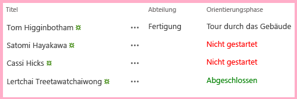

# <a name="add-custom-client-side-rendering-to-a-sharepoint-hosted-sharepoint-add-in"></a><span data-ttu-id="de5da-103">Hinzufügen des benutzerdefinierten clientseitigen Renderings zu einem von SharePoint gehosteten SharePoint-Add-In</span><span class="sxs-lookup"><span data-stu-id="de5da-103">Add custom client-side rendering to a SharePoint-hosted SharePoint Add-in</span></span>
 
<span data-ttu-id="de5da-104">Dies ist der achte in einer Reihe von Artikeln über die Grundlagen der Entwicklung von von SharePoint gehosteten SharePoint-Add-Ins. Machen Sie sich zunächst mit [SharePoint-Add-Ins](sharepoint-add-ins.md) und den vorherigen Artikeln in dieser Reihe vertraut:</span><span class="sxs-lookup"><span data-stu-id="de5da-104">This is the eighth in a series of articles about the basics of developing SharePoint-hosted SharePoint Add-ins. You should first be familiar with  [SharePoint Add-ins](sharepoint-add-ins.md) and the previous articles in this series:</span></span>
 
-  [<span data-ttu-id="de5da-105">Erste Schritte beim Erstellen von von SharePoint gehosteten SharePoint-Add-Ins</span><span class="sxs-lookup"><span data-stu-id="de5da-105">Get started creating SharePoint-hosted SharePoint Add-ins</span></span>](get-started-creating-sharepoint-hosted-sharepoint-add-ins.md)
-  [<span data-ttu-id="de5da-106">Bereitstellung und Installation eines von SharePoint gehosteten SharePoint-Add-Ins</span><span class="sxs-lookup"><span data-stu-id="de5da-106">Deploy and install a SharePoint-hosted SharePoint Add-in</span></span>](deploy-and-install-a-sharepoint-hosted-sharepoint-add-in.md)
-  [<span data-ttu-id="de5da-107">Hinzufügen von benutzerdefinierten Spalten zu einem von SharePoint gehosteten SharePoint-Add-In</span><span class="sxs-lookup"><span data-stu-id="de5da-107">Add custom columns to a SharePoint-hosted SharePoint Add-in</span></span>](add-custom-columns-to-a-sharepoint-hosted-sharepoint-add-in.md)
-  [<span data-ttu-id="de5da-108">Hinzufügen eines benutzerdefinierten Inhaltstyps zu einem von SharePoint gehosteten SharePoint-Add-In</span><span class="sxs-lookup"><span data-stu-id="de5da-108">Add a custom content type to a SharePoint-hosted SharePoint Add-in</span></span>](add-a-custom-content-type-to-a-sharepoint-hosted-sharepoint-add-in.md)
-  [<span data-ttu-id="de5da-109">Hinzufügen eines Webparts zu einer Seite in einem von SharePoint gehosteten SharePoint-Add-In</span><span class="sxs-lookup"><span data-stu-id="de5da-109">Add a Web Part to a page in a SharePoint-hosted SharePoint Add-in</span></span>](add-a-web-part-to-a-page-in-a-sharepoint-hosted-sharepoint-add-in.md)
-  [<span data-ttu-id="de5da-110">Hinzufügen eines Workflows zu einem von SharePoint gehosteten Add-In für SharePoint</span><span class="sxs-lookup"><span data-stu-id="de5da-110">Add a workflow to a SharePoint-hosted SharePoint Add-in</span></span>](add-a-workflow-to-a-sharepoint-hosted-sharepoint-add-in.md)
-  [<span data-ttu-id="de5da-111">Hinzufügen einer benutzerdefinierten Seite und Formatvorlage zu einem von SharePoint gehosteten SharePoint-Add-In</span><span class="sxs-lookup"><span data-stu-id="de5da-111">Add a custom page and style to a SharePoint-hosted SharePoint Add-in</span></span>](add-a-custom-page-and-style-to-a-sharepoint-hosted-sharepoint-add-in.md)

> [!NOTE]
> <span data-ttu-id="de5da-112">Wenn Sie diese Reihe zu von SharePoint gehosteten Add-Ins durchgearbeitet haben, können Sie das Thema mit einer Visual Studio-Lösung weiter vertiefen.</span><span class="sxs-lookup"><span data-stu-id="de5da-112">Note  If you have been working through this series about SharePoint-hosted add-ins, then you have a Visual Studio solution that you can use to continue with this topic. You can also download the repository at  SharePoint_SP-hosted_Add-Ins_Tutorials and open the BeforeClientRenderedControl.sln file.</span></span> <span data-ttu-id="de5da-113">Sie können auch das Repository von [SharePoint_SP-hosted_Add-Ins_Tutorials](https://github.com/OfficeDev/SharePoint_SP-hosted_Add-Ins_Tutorials) herunterladen und die Datei „BeforeClientRenderedControl.sln“ öffnen.</span><span class="sxs-lookup"><span data-stu-id="de5da-113">You can also download the repository at [SharePoint_SP-hosted_Add-Ins_Tutorials](https://github.com/OfficeDev/SharePoint_SP-hosted_Add-Ins_Tutorials) and open the BeforeClientRenderedControl.sln file.</span></span>
 
<span data-ttu-id="de5da-114">Sie können clientseitigen JavaScript-Code verwenden, um das Rendering der Webparts, die meisten Feldtypen (Spalten) und einige andere Steuerelemente anzupassen, indem Sie der **JSLink**-Eigenschaft des Steuerelements eine JavaScript-Datei wie z. B. **SPField.JSLink** zuweisen.</span><span class="sxs-lookup"><span data-stu-id="de5da-114">You can use a little client-side JavaScript to customize the rendering of Web Parts, most types of fields (columns), and some other controls, by assigning a JavaScript file to the  **JSLink** property of the control, such as **SPField.JSLink**. You can also add client-side validation logic in this way. In this article you customize the rendering of a field in a list of the Employee Orientation SharePoint Add-in by using client-side rendering.</span></span> <span data-ttu-id="de5da-115">Auf diese Weise können Sie auch clientseitige Überprüfungslogik hinzufügen.</span><span class="sxs-lookup"><span data-stu-id="de5da-115">You can also add client-side validation logic in this way.</span></span> <span data-ttu-id="de5da-116">In diesem Artikel passen Sie das Rendering eines Feldes in einer Liste des SharePoint-Add-Ins „Orientierung für Mitarbeiter“ mit clientseitigem Rendering an.</span><span class="sxs-lookup"><span data-stu-id="de5da-116">In this article, you customize the rendering of a field in a list of the Employee Orientation SharePoint Add-in by using client-side rendering.</span></span>
 
> [!NOTE]
> - <span data-ttu-id="de5da-117">Wenn der Endbenutzer JavaScript in seinem Browser deaktiviert hat, greift SharePoint auf das serverseitige Rendern und Prüfen zurück.</span><span class="sxs-lookup"><span data-stu-id="de5da-117">Note  If the end-user has JavaScript disabled in their browser, SharePoint will fall back to server-side rendering and validation.</span></span>
> - <span data-ttu-id="de5da-p103">Die JSLink-Eigenschaft wird nicht für Umfrage- oder Ereignislisten unterstützt. Ein SharePoint-Kalender ist eine Ereignisliste.</span><span class="sxs-lookup"><span data-stu-id="de5da-p103">The JSLink property is not supported on Survey or Events lists. A SharePoint calendar is an Events list.</span></span>

## <a name="create-and-register-the-javascript"></a><span data-ttu-id="de5da-120">Erstellen und Registrieren des JavaScript-Codes</span><span class="sxs-lookup"><span data-stu-id="de5da-120">Create and register the JavaScript</span></span>

1. <span data-ttu-id="de5da-121">Klicken Sie im **Projektmappen-Explorer** mit der rechten Maustaste auf den Knoten **Skripts**, und wählen Sie **Hinzufügen** > **Neues Element** > **Web** aus.</span><span class="sxs-lookup"><span data-stu-id="de5da-121">In  **Solution Explorer**, right-click the  **Scripts** node and choose **Add** > **New Item** > **Web**.</span></span> 

2. <span data-ttu-id="de5da-122">Wählen Sie **JavaScript-Datei**, und nennen Sie sie **OrientationStageRendering.js**.</span><span class="sxs-lookup"><span data-stu-id="de5da-122">Choose **JavaScript File** and name it **OrientationStageRendering.js**.</span></span> 

3. <span data-ttu-id="de5da-123">Ihr benutzerdefiniertes Rendern des Felds sollte automatisch erfolgen. Verwenden Sie daher den folgenden Code, um eine anonyme Methode zum JavaScript hinzufügen, die automatisch ausgeführt wird, wenn die Datei geladen wird:</span><span class="sxs-lookup"><span data-stu-id="de5da-123">Your custom rendering of the field should happen automatically, so add an anonymous method to the JavaScript that runs automatically when the file loads with the following code.</span></span>

    ```
      (function () {

      })();
    ```

4. <span data-ttu-id="de5da-124">Fügen Sie im Textkörper dieser Methode (zwischen den {}-Zeichen) den folgenden Code zum Erstellen von JSON-Objekten (Javascript Object Notation) für den Renderingüberschreibungskontext, die Vorlagen in dem Kontext und die Vorlagen für die Felder hinzu.</span><span class="sxs-lookup"><span data-stu-id="de5da-124">In the body fo this method (between the { } characters), add the following code to create JSON (Javascript Object Notation) objects for the rendering override context, the templates in the context, and the templates for the fields.</span></span>
    
    ```
      var customRenderingOverride = {};
    customRenderingOverride.Templates = {};
    customRenderingOverride.Templates.Fields = {

    }
    ```

5. <span data-ttu-id="de5da-125">Fügen Sie im Text des **Felder**-Vorlageobjekts die folgende JSON ein.</span><span class="sxs-lookup"><span data-stu-id="de5da-125">In the body of the **Fields** template object, add the following JSON.</span></span>

    ```
      "OrientationStage": { "View": renderOrientationStage }
    ```

   - <span data-ttu-id="de5da-126">Der Eigenschaftenname `OrientationStage` gibt das Feld mit dem angepassten Rendering an.</span><span class="sxs-lookup"><span data-stu-id="de5da-126">The property name `OrientationStage` identifies the field that has customized rendering.</span></span> 
   - <span data-ttu-id="de5da-127">Der Wert der Eigenschaft ist ein weiteres JSON-Objekt.</span><span class="sxs-lookup"><span data-stu-id="de5da-127">The value of the property is another JSON object.</span></span> 
   - <span data-ttu-id="de5da-128">Die `View`-Eigenschaft gibt den Seiteninhalt an, auf den das benutzerdefinierte Rendering angewendet wird.</span><span class="sxs-lookup"><span data-stu-id="de5da-128">The `View` property identifies the page context in which the custom rendering is applied.</span></span> <span data-ttu-id="de5da-129">In diesem Fall teilt das Objekt SharePoint mit, das angepasste Rendering bei Listenansichten zu verwenden.</span><span class="sxs-lookup"><span data-stu-id="de5da-129">In this case, the object is telling SharePoint to use the customized rendering on list views.</span></span> <span data-ttu-id="de5da-130">(Es gibt weitere Optionen für die Formulare Bearbeiten, Neu und Anzeigen.)</span><span class="sxs-lookup"><span data-stu-id="de5da-130">(Other options would be for the Edit, New, and Display forms.)</span></span> 
   - <span data-ttu-id="de5da-131">Der Wert der Eigenschaft `renderOrientationStage` ist der Name der benutzerdefinierten Renderingmethode, die Sie in einem späteren Schritt erstellen.</span><span class="sxs-lookup"><span data-stu-id="de5da-131">The value of the property `renderOrientationStage` is the name of the custom rendering method that you create in a later step.</span></span>

6. <span data-ttu-id="de5da-p105">Die letzte Aktion, die die anonyme Methode durchführen muss, besteht darin, den Vorlagen-Manager von SharePoint die Renderingüberschreibung zu informieren. Fügen Sie die folgende Zeile am Ende des Hauptteils der Methode hinzu.</span><span class="sxs-lookup"><span data-stu-id="de5da-p105">The last thing that the anonymous method must do is tell SharePoint's template manager about the rendering override. Add the following line to the end of the body of the method.</span></span>
    
    ```
      SPClientTemplates.TemplateManager.RegisterTemplateOverrides(customRenderingOverride);
    ```

   <span data-ttu-id="de5da-134">Die Methode sollte jetzt wie folgt aussehen.</span><span class="sxs-lookup"><span data-stu-id="de5da-134">The method should now look like the following.</span></span>
    
    ```
      (function () {
        var customRenderingOverride = {};
        customRenderingOverride.Templates = {};
        customRenderingOverride.Templates.Fields = {
            "OrientationStage": { "View": renderOrientationStage }
        }

        SPClientTemplates.TemplateManager.RegisterTemplateOverrides(customRenderingOverride);
    })();
    ```

7. <span data-ttu-id="de5da-135">Fügen Sie die folgende Methode zur Datei hinzu.</span><span class="sxs-lookup"><span data-stu-id="de5da-135">Add the following content to the file:</span></span> <span data-ttu-id="de5da-136">Sie legt die Farbe des Spaltenwerts **Orientierungsphase** auf Rot fest, wenn der Wert `Not Started` ist, und auf Grün, wenn der Wert `Completed` ist.</span><span class="sxs-lookup"><span data-stu-id="de5da-136">Add the following method to the file. It sets the color of the  Orientation Stage column value to red when the value is "Not Started" and to green when the value is "Completed". (The  object is a client context object that is declared by in-the-box SharePoint script.)</span></span> <span data-ttu-id="de5da-137">(Das `ctx`-Objekt ist ein Clientkontextobjekt, das vom In-the-Box-SharePoint-Skript deklariert wird.)</span><span class="sxs-lookup"><span data-stu-id="de5da-137">(The `ctx` object is a client context object that is declared by in-the-box SharePoint script.)</span></span>
    
    ```
      function renderOrientationStage(ctx) {
        var orientationStageValue = ctx.CurrentItem[ctx.CurrentFieldSchema.Name];
        if (orientationStageValue == "Not Started")  {
            return "<span style='color:red'>" + orientationStageValue + "</span>"
        }
        else if (orientationStageValue == "Completed") {
            return "<span style='color:green'>" + orientationStageValue + "</span>"
        }
        else {
            return orientationStageValue;
        }
    }
    ```

8. <span data-ttu-id="de5da-138">Erweitern Sie im **Projektmappen-Explorer** **Websitespalten** und **OrientationStage**, und öffnen Sie dann die Datei „elements.xml“.</span><span class="sxs-lookup"><span data-stu-id="de5da-138">In  **Solution Explorer**, expand  **Site Columns** and then **OrientationStage**; and then open the elements.xml file.</span></span> 

9. <span data-ttu-id="de5da-139">Um SharePoint anzuweisen, Ihren benutzerdefinierten JavaScript-Code zu verwenden, fügen Sie eine neues **JSLink**-Attribut zum **Feld**-Element hinzu, und weisen dann die folgende URL als Wert zu: `~site/Scripts/OrientationStageRendering.js`.</span><span class="sxs-lookup"><span data-stu-id="de5da-139">To tell SharePoint to use your custom JavaScript, add a new attribute,  **JSLink**, to the  **Field** element, and then assign the following URL as its value: `~site/Scripts/OrientationStageRendering.js`.</span></span>
    
   > [!NOTE]
   > <span data-ttu-id="de5da-140">Die **JSLink**-Eigenschaft ist immer eine Datei und keine Methode.</span><span class="sxs-lookup"><span data-stu-id="de5da-140">The **JSLink** property is always a file, not a method.</span></span> <span data-ttu-id="de5da-141">Es gibt keine Möglichkeit, SharePoint mitzuteilen, welche Methode ausgeführt werden soll, und aus diesem Grund enthält die Datei eine Methode, die automatisch ausgeführt wird.</span><span class="sxs-lookup"><span data-stu-id="de5da-141">The JSLink property is always a file, not a method. There's no way to tell SharePoint which method to run. That is why the file contains a method that runs automatically.</span></span>

   <span data-ttu-id="de5da-142">Das Start-Tag für das Element **Feld** sieht nun wie folgt aus.</span><span class="sxs-lookup"><span data-stu-id="de5da-142">The start tag for the **Field** element will now look like the following.</span></span>
    
    ```
      <Field
           ID="{some_guid_here}"
           Name="OrientationStage"
           Title="OrientationStage"
           DisplayName="Orientation Stage"
           Description="The current orientation stage of the employee."
           Type="Choice"
           Required="TRUE"
           Group="Employee Orientation" 
           JSLink="~site/Scripts/OrientationStageRendering.js">
    <!-- child elements and end tag omitted -->
    ```

10. <span data-ttu-id="de5da-143">Öffnen Sie die Seite Default.aspx, und fügen Sie den folgenden Code als letztes untergeordnetes Element des **asp:Content**-Elements hinzu, dessen **ContentPlaceHolderID** auf **PlaceHolderMain** festgelegt ist.</span><span class="sxs-lookup"><span data-stu-id="de5da-143">Open the Default.aspx page and add the following code as the last child of the **asp:Content** element that has **ContentPlaceHolderID** set to **PlaceHolderMain**.</span></span> 
    
    ```XML
      <p><asp:HyperLink runat="server" NavigateUrl="JavaScript:window.location = _spPageContextInfo.webAbsoluteUrl + '/Lists/NewEmployeesInSeattle/AllItems.aspx';" 
        Text="List View Page for New Employees in Seattle" /></p>

    ```

## <a name="run-and-test-the-add-in"></a><span data-ttu-id="de5da-144">Ausführen und Testen des Add-Ins</span><span class="sxs-lookup"><span data-stu-id="de5da-144">Run and test the add-in</span></span>

1. <span data-ttu-id="de5da-p108">Verwenden Sie die F5-TASTE, um Ihr Add-In bereitzustellen und auszuführen. Visual Studio führt eine temporäre Installation des Add-Ins auf Ihrer SharePoint-Testwebsite durch und führt das Add-In sofort aus.</span><span class="sxs-lookup"><span data-stu-id="de5da-p108">Use the F5 key to deploy and run your add-in. Visual Studio makes a temporary installation of the add-in on your test SharePoint site and immediately runs the add-in.</span></span> 
 
2. <span data-ttu-id="de5da-147">Das von Ihnen konfigurierte clientseitige Rendering wirkt sich lediglich auf das Rendering des Felds der Seite Listenansicht aus und nicht auf das Listenansicht-Webpart, das wir auf der Homepage hinzugefügt haben.</span><span class="sxs-lookup"><span data-stu-id="de5da-147">The client-side rendering that you have configured affects the rendering of the field only on the list view page, not in the list view Web Part that we put on the home page.</span></span> <span data-ttu-id="de5da-148">Dies liegt daran, dass das Webpart standardmäßig auf serverseitiges Rendering zurückgesetzt wird.</span><span class="sxs-lookup"><span data-stu-id="de5da-148">This is because the Web Part defaults to server-side rendering.</span></span> <span data-ttu-id="de5da-149">Es gibt Möglichkeiten, dies rückgängig zu machen, aber dies würde den Rahmen dieses einfachen Beispiels sprengen.</span><span class="sxs-lookup"><span data-stu-id="de5da-149">There are ways to reverse this, but they are too advanced for this simple example.</span></span> <span data-ttu-id="de5da-150">Um das clientseitige Rendering in Aktion zu sehen, wählen Sie den Link unten auf der Seite **Seite mit der Listenansicht für neue Mitarbeiter in Seattle**.</span><span class="sxs-lookup"><span data-stu-id="de5da-150">So, to see the client-side rendering in action, select the link at the bottom of the page **List View Page for New Employees in Seattle**.</span></span>
 
3. <span data-ttu-id="de5da-151">Wenn die Listenansichtsseite geöffnet wird, legen Sie den Wert **Einführungsphase** für einige Elemente auf **Nicht gestartet** und für andere auf **Abgeschlossen** fest, um das benutzerdefinierte Farbrendering anzuzeigen.</span><span class="sxs-lookup"><span data-stu-id="de5da-151">When the list view page opens, set the **Orientation Stage** value for some items to **Not Started** and set others to **Completed** to see the custom color rendering.</span></span>
    
   <span data-ttu-id="de5da-152">*Abbildung 1. Liste mit benutzerdefiniertem clientseitigem Rendering*</span><span class="sxs-lookup"><span data-stu-id="de5da-152">*List with custom client-side rendering*</span></span>

   
  
4. <span data-ttu-id="de5da-155">Schließen Sie zum Beenden der Debugsitzung das Browserfenster, oder beenden Sie das Debuggen in Visual Studio.</span><span class="sxs-lookup"><span data-stu-id="de5da-155">To end the debugging session, close the browser window or stop debugging in Visual Studio. Each time that you press F5, Visual Studio will retract the previous version of the add-in and install the latest one.</span></span> <span data-ttu-id="de5da-156">Jedes Mal, wenn Sie F5 drücken, zieht Visual Studio die vorherige Version des Add-Ins zurück und installiert die neueste.</span><span class="sxs-lookup"><span data-stu-id="de5da-156">To end the debugging session, close the browser window or stop debugging in Visual Studio. Each time that you press F5, Visual Studio will retract the previous version of the add-in and install the latest one.</span></span>
    
5. <span data-ttu-id="de5da-157">Da Sie mit diesem Add-In und dieser Visual Studio-Lösung in anderen Artikeln arbeiten werden, hat es sich bewährt, das Add-In ein letztes Mal zurückzuziehen, wenn Sie Ihre Arbeit daran für eine Weile abgeschlossen haben.</span><span class="sxs-lookup"><span data-stu-id="de5da-157">You will work with this add-in and Visual Studio solution in other articles, and it's a good practice to retract the add-in one last time when you are done working with it for a while. Right-click the project in  Solution Explorer and choose Retract.</span></span> <span data-ttu-id="de5da-158">Klicken Sie mit der rechten Maustaste auf das Projekt im **Projektmappen-Explorer**, und wählen Sie **Zurückziehen** aus.</span><span class="sxs-lookup"><span data-stu-id="de5da-158">Right-click the project in  **Solution Explorer** and choose **Retract**.</span></span>

## <a name="next-steps"></a><span data-ttu-id="de5da-159">Nächste Schritte</span><span class="sxs-lookup"><span data-stu-id="de5da-159">Next steps</span></span>
<span data-ttu-id="de5da-160"><a name="Nextsteps"> </a></span><span class="sxs-lookup"><span data-stu-id="de5da-160"></span></span>

<span data-ttu-id="de5da-161">Im nächsten Artikel dieser Reihe erstellen Sie [eine benutzerdefinierten Menüband-Schaltfläche im Hostweb einer SharePoint-Add-In](create-a-custom-ribbon-button-in-the-host-web-of-a-sharepoint-add-in.md).</span><span class="sxs-lookup"><span data-stu-id="de5da-161">In the next article in this series, you'll add a custom menu item and custom button to the ribbon in the SharePoint Add-in:  [Create a custom ribbon button in the host web of a SharePoint Add-in](create-a-custom-ribbon-button-in-the-host-web-of-a-sharepoint-add-in.md).</span></span>
 
