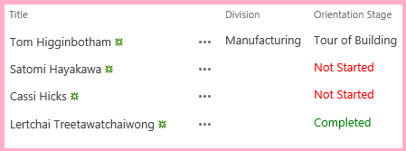

# <a name="add-custom-client-side-rendering-to-a-sharepoint-hosted-sharepoint-add-in"></a>Hinzufügen des benutzerdefinierten clientseitigen Renderings für ein von SharePoint gehostetes SharePoint-Add-In
Passen Sie das Rendering und die Prüfung von Steuerelementen in SharePoint-Add-In-Seiten an.
 
**Hinweis** Der Name „Apps für SharePoint“ wird in „SharePoint-Add-Ins“ geändert. Während des Übergangszeitraums wird in der Dokumentation und der Benutzeroberfläche einiger SharePoint-Produkte und Visual Studio-Tools möglicherweise weiterhin der Begriff „Apps für SharePoint“ verwendet. Weitere Informationen finden Sie unter [Neuer Name für Office- und SharePoint-Apps](new-name-for-apps-for-sharepoint#bk_newname).
 
Dies ist der achte in einer Reihe von Artikeln über die Grundlagen der Entwicklung von von SharePoint gehosteten SharePoint-Add-Ins. Machen Sie sich zunächst mit [SharePoint-Add-Ins](sharepoint-add-ins) und den vorherigen Artikeln in dieser Reihe vertraut:
 
-  [Erste Schritte beim Erstellen von von SharePoint gehosteten SharePoint-Add-Ins](get-started-creating-sharepoint-hosted-sharepoint-add-ins)
-  [Bereitstellung und Installation eines von SharePoint gehosteten Add-Ins für SharePoint](deploy-and-install-a-sharepoint-hosted-sharepoint-add-in)
-  [Hinzufügen von benutzerdefinierten Spalten zu einem von SharePoint gehosteten Add-In für SharePoint](add-custom-columns-to-a-sharepoint-hostedsharepoint-add-in)
-  [Hinzufügen eines benutzerdefinierten Inhaltstyps zu einem von SharePoint gehosteten Add-In für SharePoint](add-a-custom-content-type-to-a-sharepoint-hostedsharepoint-add-in)
-  [Hinzufügen eines Webparts zu einer Seite in einem von SharePoint gehosteten Add-In für SharePoint](add-a-web-part-to-a-page-in-a-sharepoint-hosted-sharepoint-add-in)
-  [Hinzufügen eines Workflows zu einem von SharePoint gehosteten Add-In für SharePoint](add-a-workflow-to-a-sharepoint-hosted-sharepoint-add-in)
-  [Hinzufügen einer benutzerdefinierten Seite und Formatvorlage zu einem von SharePoint gehosteten Add-In für SharePoint](add-a-custom-page-and-style-to-a-sharepoint-hosted-sharepoint-add-in)

**Hinweis** Wenn Sie diese Reihe zu von SharePoint gehosteten Add-Ins durchgearbeitet haben, haben Sie eine Visual Studio-Projektmappe, die Sie verwenden können, um mit diesem Thema fortzufahren. Sie können außerdem das Repository unter [SharePoint_SP-Hosted_Add-Ins_Tutorials](https://github.com/OfficeDev/SharePoint_SP-hosted_Add-Ins_Tutorials) herunterladen und die Datei „BeforeClientRenderedControl.sln“ öffnen.
 
Sie können etwas clientseitiges JavaScript verwenden, um das Rendering von Webparts, der meisten Typen von Feldern (Spalten) und anderer Steuerelemente anzupassen, indem Sie eine JavaScript-Datei zur Eigenschaft **JSLink** des Steuerelements zuweisen, z. B. **SPField.JSLink**. Sie können auch clientseitige Prüflogik auf diese Weise hinzufügen. In diesem Artikel passen Sie das Rendering eines Felds in einer Liste des SharePoint-Add-Ins „Orientierung für Mitarbeiter“ mithilfe von clientseitigem Rendering an.
 
 **Hinweis** Wenn der Endbenutzer JavaScript in seinem Browser deaktiviert hat, greift SharePoint auf das serverseitige Rendern und Prüfen zurück.
 
 **Hinweis** Die JSLink-Eigenschaft wird nicht für Umfrage- oder Ereignislisten nicht unterstützt. Ein SharePoint-Kalender ist eine Ereignisliste.
 
## <a name="create-and-register-the-javascript"></a>Erstellen und registrieren des JavaScript-Codes

- Klicken Sie im **Projektmappen-Explorer** mit der rechten Maustaste auf den Knoten **Skripts**, und wählen Sie **Hinzufügen** > **Neues Element** > **Web** aus.
- Wählen Sie **JavaScript-Datei**, und nennen Sie die Datei „OrientationStageRendering.js“.
- Ihr benutzerdefiniertes Rendern des Felds sollte automatisch erfolgen. Fügen Sie daher eine anonyme Methode zum JavaScript hinzu, die automatisch ausgeführt wird, wenn die Datei mit dem folgenden Code geladen wird.

```
  (function () {

})();
```

- Fügen Sie im Textkörper dieser Methode (zwischen den {}-Zeichen) den folgenden Code zum Erstellen von JSON-Objekten (Javascript Object Notation) für den Renderingüberschreibungskontext, die Vorlagen in dem Kontext und die Vorlagen für die Felder hinzu.
    
```
  var customRenderingOverride = {};
customRenderingOverride.Templates = {};
customRenderingOverride.Templates.Fields = {

}
```

- Fügen Sie im Textkörper des  `Fields`-Vorlagenobjekts das folgende JSON-Objekt ein. Der Name der Eigenschaft  `OrientationStage` identifiziert das Feld, mit dem das Rendering angepasst wurde. Der Wert der Eigenschaft ist ein weiteres JSON-Objekt. Die Eigenschaft `View` gibt den Seitenkontext an, in dem das benutzerdefinierte Rendering angewendet wird. In diesem Fall teilt das Objekt SharePoint mit, das benutzerdefinierte Rendering auf Listenansichten zu verwenden. (Weitere Optionen sind die Formulare zum Bearbeiten, für neue Element und zum Anzeigen.) Der Wert der Eigenschaft `renderOrientationStage` ist der Name der benutzerdefiniertes Renderingmethode, die Sie in einem späteren Schritt erstellen.
    
```
  "OrientationStage": { "View": renderOrientationStage }
```

- Die letzte Aktion, die die anonyme Methode durchführen muss, besteht darin, den Vorlagen-Manager von SharePoint die Renderingüberschreibung zu informieren. Fügen Sie die folgende Zeile am Ende des Hauptteils der Methode hinzu.
    
```
  SPClientTemplates.TemplateManager.RegisterTemplateOverrides(customRenderingOverride);
```

   Die Methode sollte jetzt wie folgt aussehen.
    
```
  (function () {
    var customRenderingOverride = {};
    customRenderingOverride.Templates = {};
    customRenderingOverride.Templates.Fields = {
        "OrientationStage": { "View": renderOrientationStage }
    }

    SPClientTemplates.TemplateManager.RegisterTemplateOverrides(customRenderingOverride);
})();
```

- Fügen Sie die folgende Methode zur Datei hinzu. Sie legt die Farbe des Werts in der Spalte **Orientierungsphase** auf Rot fest, wenn der Wert „Nicht gestartet“ ist, und auf Grün, wenn der Wert „Abgeschlossen“ ist. (Das `ctx`-Objekt ist ein Clientkontextobjekt, das vom standardmäßigen SharePoint-Skript deklariert wird.)
    
```
  function renderOrientationStage(ctx) {
    var orientationStageValue = ctx.CurrentItem[ctx.CurrentFieldSchema.Name];
    if (orientationStageValue == "Not Started")  {
        return "<span style='color:red'>" + orientationStageValue + "</span>"
    }
    else if (orientationStageValue == "Completed") {
        return "<span style='color:green'>" + orientationStageValue + "</span>"
    }
    else {
        return orientationStageValue;
    }
}
```

- Erweitern Sie im **Projektmappen-Explorer** **Websitespalten** und dann **OrientationStage**, und öffnen Sie dann die Datei „elements.xml“. 
- Um SharePoint anzuweisen, Ihren benutzerdefinierten JavaScript-Code zu verwenden, fügen Sie eine neues **JSLink**-Attribut zum **Field**-Element hinzu, und weisen dann die folgende URL als Wert zu: `~site/Scripts/OrientationStageRendering.js`.
    
**Hinweis** Die Eigenschaft **JSLink** ist immer eine Datei, keine Methode. Es gibt keine Möglichkeit, SharePoint mitzuteilen, welche Methode ausgeführt werden soll. Aus diesem Grund enthält die Datei eine Methode, die automatisch ausgeführt wird.

Das Start-Tag für das **Field**-Element sieht nun wie folgt aus.
    
```
  <Field
       ID="{some_guid_here}"
       Name="OrientationStage"
       Title="OrientationStage"
       DisplayName="Orientation Stage"
       Description="The current orientation stage of the employee."
       Type="Choice"
       Required="TRUE"
       Group="Employee Orientation" 
       JSLink="~site/Scripts/OrientationStageRendering.js">
<!-- child elements and end tag omitted -->
```

- Öffnen Sie die Seite „Default.aspx“, und fügen Sie den folgenden Code als letztes untergeordnetes Element des **asp:Content**-Elements hinzu, dessen **ContentPlaceHolderID** auf **PlaceHolderMain** festgelegt ist. 
    
```XML
  <p><asp:HyperLink runat="server" NavigateUrl="JavaScript:window.location = _spPageContextInfo.webAbsoluteUrl + '/Lists/NewEmployeesInSeattle/AllItems.aspx';" 
    Text="List View Page for New Employees in Seattle" /></p>

```

## <a name="run-and-test-the-add-in"></a>Ausführen und Testen des Add-Ins

- Verwenden Sie die F5-TASTE, um Ihr Add-In bereitzustellen und auszuführen. Visual Studio führt eine temporäre Installation des Add-Ins auf Ihrer SharePoint-Testwebsite durch und führt das Add-In sofort aus. 
 
- Das clientseitige Rendering, das Sie konfiguriert haben, wirkt sich nur in der Listenansichtsseite auf das Rendering des Felds aus, nicht jedoch im Listenansicht-Webpart, das wir auf der Startseite abgelegt haben. Der Grund hierfür ist, dass das Webpart standardmäßig das serverseitige Rendering verwendet. Es gibt Möglichkeiten, dies umzukehren, aber diese sind zu fortgeschritten für dieses einfache Beispiel. Um also das clientseitige Rendering in Aktion zu sehen, klicken Sie auf den Link am unteren Rand der Seite **Listenansichtsseite für neue Mitarbeiter in Seattle**.
 
- Wenn die Listenansichtsseite geöffnet wird, legen Sie den Wert **Orientierungsphase** für einige Elemente auf **Nicht gestartet** und für andere auf **Abgeschlossen** fest, um das benutzerdefinierte Farbrendering anzuzeigen.
    
**Liste mit benutzerdefiniertem clientseitigem Rendering**


  
- Schließen Sie zum Beenden der Debugsitzung das Browserfenster, oder beenden Sie das Debuggen in Visual Studio. Jedes Mal, wenn Sie F5 drücken, zieht Visual Studio die vorherige Version des Add-Ins zurück und installiert die neueste.
    
- Da Sie mit diesem Add-In und dieser Visual Studio-Projektmappe in anderen Artikeln arbeiten werden, hat es sich bewährt, das Add-In ein letztes Mal zurückzuziehen, wenn Sie Ihre Arbeit daran für eine Weile abgeschlossen haben. Klicken Sie mit der rechten Maustaste auf das Projekt im **Projektmappen-Explorer**, und wählen Sie **Zurückziehen** aus.

## 
<a name="Nextsteps"> </a>

Im nächsten Artikel dieser Reihe fügen Sie ein benutzerdefiniertes Menüelement und eine benutzerdefinierte Schaltfläche zum Menüband im SharePoint-Add-In hinzu:  [Erstellen einer benutzerdefinierten Menübandschaltfläche im Hostweb eines SharePoint-Add-Ins](create-a-custom-ribbon-button-in-the-host-web-of-a-sharepoint-add-in).
 
