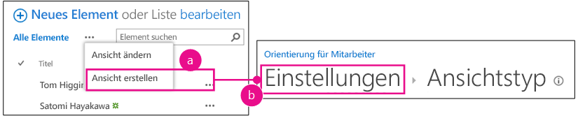
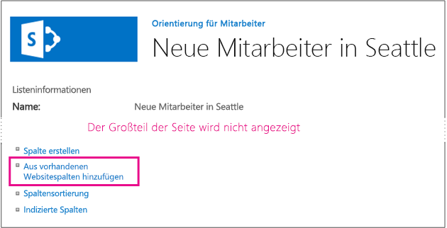

# <a name="add-custom-columns-to-a-sharepoint-hostedsharepoint-add-in"></a>Hinzufügen von benutzerdefinierten Spalten zu einem von SharePoint gehosteten SharePoint-Add-In
Erfahren Sie, wie Sie benutzerdefinierte Spalten in SharePoint-Add-Ins einschließen.
 

 **Hinweis** Der Name „Apps für SharePoint“ wird in „SharePoint-Add-Ins“ geändert. Während des Übergangszeitraums wird in der Dokumentation und der Benutzeroberfläche einiger SharePoint-Produkte und Visual Studio-Tools möglicherweise weiterhin der Begriff „Apps für SharePoint“ verwendet. Weitere Informationen finden Sie unter [Neuer Name für Office- und SharePoint-Apps](new-name-for-apps-for-sharepoint.md#bk_newname).
 

Dies ist der dritte in einer Reihe von Artikeln über die Grundlagen der Entwicklung von von SharePoint gehosteten SharePoint-Add-Ins. Machen Sie sich zunächst mit [SharePoint-Add-Ins](sharepoint-add-ins.md) und den vorherigen Artikeln in dieser Reihe vertraut:
 

-  [Erste Schritte beim Erstellen von von SharePoint gehosteten SharePoint-Add-Ins](get-started-creating-sharepoint-hosted-sharepoint-add-ins.md)
    
 
-  [Bereitstellung und Installation eines von SharePoint gehosteten Add-Ins für SharePoint](deploy-and-install-a-sharepoint-hosted-sharepoint-add-in.md)
    
 

 **Hinweis** Wenn Sie diese Reihe zu von SharePoint gehosteten Add-Ins durchgearbeitet haben, haben Sie eine Visual Studio-Projektmappe, die Sie verwenden können, um mit diesem Thema fortzufahren. Sie können außerdem das Repository unter [SharePoint_SP-Hosted_Add-Ins_Tutorials](https://github.com/OfficeDev/SharePoint_SP-hosted_Add-Ins_Tutorials) herunterladen und die Datei „BeforeColumns.sln“ öffnen.
 

In diesem Artikel kehren wir zum Codieren zurück, indem wir einige Websitespalten zum SharePoint-Add-In „Orientierung für Mitarbeiter“ hinzufügen.
 

## <a name="create-custom-column-types"></a>Erstellen benutzerdefinierter Spaltentypen


 

 

1. Klicken Sie im **Projektmappen-Explorer** mit der rechten Maustaste auf das Projekt, und wählen Sie **Hinzufügen** > **Neuer Ordner** aus. Nennen Sie den Ordner „Websitespalten“.
    
 
2. Klicken Sie mit der rechten Maustaste auf den neuen Ordner, und wählen Sie **Hinzufügen** > **Neues Element** aus. Das Dialogfeld **Neues Element hinzufügen** wird mit dem Knoten **Office/SharePoint** geöffnet.
    
 
3. Wählen Sie **Websitespalte** aus, geben Sie ihr den Namen „Abteilung“, und wählen Sie **Hinzufügen** aus.
    
 
4. Bearbeiten Sie in der Datei „elements.xml“ für die neue Websitespalte das Element **Field** so, dass es die im folgenden Beispiel gezeigten Attribute und Werte hat, mit der Ausnahme, dass *Sie **nicht** den Wert der GUID* für das Attribut **ID** ändern sollten, der von Visual Studio dafür generiert wurde. *Seien Sie also vorsichtig, wenn Sie Kopieren und Einfügen verwenden.*
    
```
  <Field ID="{generated GUID}" 
       Name="Division" 
       Title="Division" 
       DisplayName="Division" 
       Description="The division of the company where the employee works." 
       Group="Employee Orientation" 
       Type="Text" 
       Required ="FALSE">
</Field>
```

5. Fügen Sie eine weitere **Websitespalte** im selben Ordner mit dem Namen „OrientationStage“ hinzu.
    
 
6. Bearbeiten Sie in der Datei „elements.xml“ für die neue Websitespalte das Element **Field** so, dass es die im folgenden Beispiel dargestellten Attribute und Werte aufweist, mit der Ausnahme, dass der Wert der GUID für das Attribut **ID**, den Visual Studio dafür generiert hat, nicht geändert werden sollte.
    
```
  <Field ID="{generated GUID}" 
       Name="OrientationStage" 
       Title="OrientationStage"
       DisplayName="Orientation Stage" 
       Group="Employee Orientation" 
       Description="The current orientation stage of the employee." 
       Type="Choice"
       Required ="TRUE">
</Field>
```

7. Da es sich um ein Auswahlfeld handelt, müssen Sie die Auswahlmöglichkeiten und die Reihenfolge angeben, in der diese in der Dropdownliste angezeigt werden sollen, wenn ein Benutzer eine Auswahl vornimmt. Und da es ein Pflichtfeld ist, müssen Sie einen Standardwert angeben. Fügen Sie das folgende untergeordnete Markup zum Element **Field** hinzu.
    
```
  <CHOICES>
      <CHOICE>Not Started</CHOICE>
      <CHOICE>Tour of building</CHOICE>
      <CHOICE>HR paperwork</CHOICE>
      <CHOICE>Corporate network access</CHOICE>
      <CHOICE>Completed</CHOICE>
</CHOICES>
<MAPPINGS>
      <MAPPING Value="1">Not Started</MAPPING>
      <MAPPING Value="2">Tour of building</MAPPING>
      <MAPPING Value="3">HR paperwork</MAPPING>
      <MAPPING Value="4">Corp network access</MAPPING>
      <MAPPING Value="5">Completed</MAPPING>
</MAPPINGS>
<Default>Not Started</Default>
```

8. Speichern Sie alle Dateien.
    
 

## <a name="run-the-add-in-and-test-the-columns"></a>Ausführen des Add-Ins und Testen der Spalten


 

 

1. Verwenden Sie die F5-TASTE, um Ihr Add-In bereitzustellen und auszuführen. Visual Studio führt eine temporäre Installation des Add-Ins auf Ihrer SharePoint-Testwebsite durch und führt das Add-In sofort aus. 
    
 
2. Wenn die Standardseite des Add-Ins geöffnet wird, wählen Sie den Link für **Neue Mitarbeiter in Seattle** aus, um die benutzerdefinierte Listeninstanz zu öffnen.
    
 
3. Öffnen Sie die Seite **Einstellungen** der Liste, und fügen Sie die zwei Spalten mit den folgenden Schritten hinzu.
    
      1. Klicken Sie auf die Popupschaltfläche **· · ·** direkt über der Liste, und wählen Sie dann **Ansicht erstellen** aus.
    
 
  2. Die Seite **Ansichtstyp** wird mit der Breadcrumb-Struktur **Einstellungen und Ansichtstyp** im oberen Bereich geöffnet. Klicken Sie auf den Breadcrumb **Einstellungen**.
    
    **Schritte zum Öffnen der Seite mit Listeneinstellungen**

 

  
 

    
    
 
  3. Öffnen Sie auf der Seite **Einstellungen** den Link **Aus vorhandenen Websitespalten hinzufügen** etwa in der Mitte der Seite links.
    
    **Seite mit Listeneinstellungen**

 

  
 

    
    
 
  4. Wählen Sie auf der Seite **Spalten aus Websitespalten hinzufügen** in der Dropdownliste **Websitespalten auswählen aus** die Option **Orientierung für Mitarbeiter** aus.
    
    **Seite „Spalten aus Websitespalten hinzufügen“**

 

  
 

    
    
 
  5. Fügen Sie die Spalten **Abteilung** und **Orientierungsphase** zum Feld **Hinzuzufügende Spalten** hinzu.
    
 
  6. Wählen Sie **OK** aus, um zur Seite **Einstellungen** zurückzukehren, und klicken Sie dann auf den Breadcrumb **Neue Mitarbeiter in Seattle** im oberen Bereich der Seite.
    
 
4. Die neuen Spalten befinden sich jetzt in der Liste. Fügen Sie der Liste ein neues Element hinzu. Auf dem Bearbeitungsformular enthält das Feld **Orientierungsphase** bereits den Standardwert „Nicht gestartet“. (Die vorhandenen Elemente in diesem Feld sind leer, da sie erstellt wurden, bevor sich das Feld in der Liste befand.)
    
    **Die Liste mit neuen Spalten**

 

  
 

    
    
 
5. Schließen Sie zum Beenden der Debugsitzung das Browserfenster, oder beenden Sie das Debuggen in Visual Studio. Jedes Mal, wenn Sie F5 drücken, zieht Visual Studio die vorherige Version des Add-Ins zurück und installiert die neueste.
    
 
6. Da Sie mit diesem Add-In und dieser Visual Studio-Lösung in anderen Artikeln arbeiten werden, hat es sich bewähr, das Add-In ein letztes Mal zurückzuziehen, wenn Sie Ihre Arbeit daran für eine Weile abgeschlossen haben. Klicken Sie mit der rechten Maustaste auf das Projekt im **Projektmappen-Explorer**, und wählen Sie **Zurückziehen** aus.
    
 

## 
<a name="Nextsteps"> </a>

Da Sie nicht wirklich möchten, dass Ihre Benutzer die benutzerdefinierten Spalten manuell zur Liste hinzufügen müssen, erstellen Sie im nächsten Artikel dieser Reihe einen benutzerdefinierten Inhaltstyp, der die benutzerdefinierten Spalten enthält und automatisch mit der Listenvorlage für neue Mitarbeiter verknüpft wird: [Hinzufügen eines benutzerdefinierten Inhaltstyps zu einem von SharePoint gehosteten SharePoint-Add-In](add-a-custom-content-type-to-a-sharepoint-hostedsharepoint-add-in.md). 
 

 

