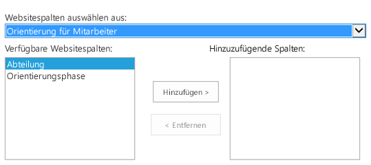

# <a name="add-custom-columns-to-a-sharepoint-hostedsharepoint-add-in"></a><span data-ttu-id="52df7-102">Hinzufügen von benutzerdefinierten Spalten zu einem von SharePoint gehosteten SharePoint-Add-In</span><span class="sxs-lookup"><span data-stu-id="52df7-102">Add custom columns to a SharePoint-hostedSharePoint Add-in</span></span>
<span data-ttu-id="52df7-103">Erfahren Sie, wie Sie benutzerdefinierte Spalten in SharePoint-Add-Ins einschließen.</span><span class="sxs-lookup"><span data-stu-id="52df7-103">Learn how to include custom columns in an SharePoint Add-ins.</span></span>

<span data-ttu-id="52df7-104">Dies ist der dritte in einer Reihe von Artikeln über die Grundlagen der Entwicklung von von SharePoint gehosteten SharePoint-Add-Ins. Machen Sie sich zunächst mit [SharePoint-Add-Ins](sharepoint-add-ins.md) und den vorherigen Artikeln in dieser Reihe vertraut:</span><span class="sxs-lookup"><span data-stu-id="52df7-104">This is the third in a series of articles about the basics of developing SharePoint-hosted SharePoint Add-ins. You should first be familiar with  [SharePoint Add-ins](sharepoint-add-ins.md) and the pervious articles in this series:</span></span>
 

-  [<span data-ttu-id="52df7-105">Erste Schritte beim Erstellen von von SharePoint gehosteten SharePoint-Add-Ins</span><span class="sxs-lookup"><span data-stu-id="52df7-105">Get started creating SharePoint-hosted SharePoint Add-ins</span></span>](get-started-creating-sharepoint-hosted-sharepoint-add-ins.md)
    
 
-  [<span data-ttu-id="52df7-106">Bereitstellung und Installation eines von SharePoint gehosteten SharePoint-Add-Ins</span><span class="sxs-lookup"><span data-stu-id="52df7-106">Deploy and install a SharePoint-hosted SharePoint Add-in</span></span>](deploy-and-install-a-sharepoint-hosted-sharepoint-add-in.md)
    
 

> [!NOTE] 
> <span data-ttu-id="52df7-107">Wenn Sie unsere Artikelreihe zum Thema SharePoint-gehostete Add-Ins durchgearbeitet haben, haben Sie bereits eine Visual Studio-Lösung, die Sie für diesen Artikel verwenden können.</span><span class="sxs-lookup"><span data-stu-id="52df7-107">If you have been working through this series about SharePoint-hosted add-ins, you have a Visual Studio solution that you can use to continue with this topic.</span></span> <span data-ttu-id="52df7-108">Sie können auch das Repository von [SharePoint_SP-hosted_Add-Ins_Tutorials](https://github.com/OfficeDev/SharePoint_SP-hosted_Add-Ins_Tutorials) herunterladen und die Datei „BeforeColumns.sln“ öffnen.</span><span class="sxs-lookup"><span data-stu-id="52df7-108">You can also download the repository at [SharePoint_SP-hosted_Add-Ins_Tutorials](https://github.com/OfficeDev/SharePoint_SP-hosted_Add-Ins_Tutorials) and open the BeforeColumns.sln file.</span></span>
 

<span data-ttu-id="52df7-109">In diesem Artikel kehren wir zum Codieren zurück, indem wir einige Websitespalten zum SharePoint-Add-In „Orientierung für Mitarbeiter“ hinzufügen.</span><span class="sxs-lookup"><span data-stu-id="52df7-109">In this article we get back to coding by adding some site columns to the Employee Orientation SharePoint Add-in.</span></span>
 

## <a name="create-custom-column-types"></a><span data-ttu-id="52df7-110">Erstellen benutzerdefinierter Spaltentypen</span><span class="sxs-lookup"><span data-stu-id="52df7-110">Create custom column types</span></span>


 

 

1. <span data-ttu-id="52df7-p102">Klicken Sie im **Projektmappen-Explorer** mit der rechten Maustaste auf das Projekt, und wählen Sie **Hinzufügen** > **Neuer Ordner** aus. Nennen Sie den Ordner „Websitespalten“.</span><span class="sxs-lookup"><span data-stu-id="52df7-p102">In  **Solution Explorer**, right-click the project and choose  **Add** > **New Folder**. Name the folder Site Columns.</span></span>
    
 
2. <span data-ttu-id="52df7-p103">Klicken Sie mit der rechten Maustaste auf den neuen Ordner, und wählen Sie **Hinzufügen** > **Neues Element** aus. Das Dialogfeld **Neues Element hinzufügen** wird mit dem Knoten **Office/SharePoint** geöffnet.</span><span class="sxs-lookup"><span data-stu-id="52df7-p103">Right-click the new folder and choose  **Add** > **New Item**. The  **Add New Item** dialog opens to the **Office/SharePoint** node.</span></span>
    
 
3. <span data-ttu-id="52df7-115">Wählen Sie **Websitespalte** aus, geben Sie ihr den Namen „Abteilung“, und wählen Sie **Hinzufügen** aus.</span><span class="sxs-lookup"><span data-stu-id="52df7-115">Choose  **Site Column**, give it the name Division, and choose  **Add**.</span></span>
    
 
4. <span data-ttu-id="52df7-116">Bearbeiten Sie in der Datei „elements.xml“ für die neue Websitespalte das Element **Field** so, dass es die im folgenden Beispiel gezeigten Attribute und Werte hat, mit der Ausnahme, dass *Sie **nicht** den Wert der GUID* für das Attribut **ID** ändern sollten, der von Visual Studio dafür generiert wurde. *Seien Sie also vorsichtig, wenn Sie Kopieren und Einfügen verwenden.*</span><span class="sxs-lookup"><span data-stu-id="52df7-116">In the elements.xml file for the new site column, edit the  **Field** element so that it has the attributes and values shown in the following example, except that *you should  **not** change the GUID*  for the **ID** attribute from the value that Visual Studio generated for it, *so be careful if you are using copy-and-paste*  .</span></span>
    
```
  <Field ID="{generated GUID}" 
       Name="Division" 
       Title="Division" 
       DisplayName="Division" 
       Description="The division of the company where the employee works." 
       Group="Employee Orientation" 
       Type="Text" 
       Required ="FALSE">
</Field>
```

5. <span data-ttu-id="52df7-117">Fügen Sie eine weitere **Websitespalte** im selben Ordner mit dem Namen „OrientationStage“ hinzu.</span><span class="sxs-lookup"><span data-stu-id="52df7-117">Add another  **Site Column** to the same folder namedOrientationStage.</span></span>
    
 
6. <span data-ttu-id="52df7-118">Bearbeiten Sie in der Datei „elements.xml“ für die neue Websitespalte das Element **Field** so, dass es die im folgenden Beispiel dargestellten Attribute und Werte aufweist, mit der Ausnahme, dass der Wert der GUID für das Attribut **ID**, den Visual Studio dafür generiert hat, nicht geändert werden sollte.</span><span class="sxs-lookup"><span data-stu-id="52df7-118">In the elements.xml file for the new site column, edit the  **Field** element so that it has the attributes and values shown in the following example, except that you should not change the GUID for the **ID** attribute from the value that Visual Studio generated for it.</span></span>
    
```
  <Field ID="{generated GUID}" 
       Name="OrientationStage" 
       Title="OrientationStage"
       DisplayName="Orientation Stage" 
       Group="Employee Orientation" 
       Description="The current orientation stage of the employee." 
       Type="Choice"
       Required ="TRUE">
</Field>
```

7. <span data-ttu-id="52df7-p104">Da es sich um ein Auswahlfeld handelt, müssen Sie die Auswahlmöglichkeiten und die Reihenfolge angeben, in der diese in der Dropdownliste angezeigt werden sollen, wenn ein Benutzer eine Auswahl vornimmt. Und da es ein Pflichtfeld ist, müssen Sie einen Standardwert angeben. Fügen Sie das folgende untergeordnete Markup zum Element **Field** hinzu.</span><span class="sxs-lookup"><span data-stu-id="52df7-p104">Because this is a Choice field, you must specify the possible choices and the order in which they should appear in the drop-down list when a user is making a choice. And because it is a required field, you must specify a default value. Add the following child markup to the  **Field** element.</span></span>
    
```
  <CHOICES>
      <CHOICE>Not Started</CHOICE>
      <CHOICE>Tour of building</CHOICE>
      <CHOICE>HR paperwork</CHOICE>
      <CHOICE>Corporate network access</CHOICE>
      <CHOICE>Completed</CHOICE>
</CHOICES>
<MAPPINGS>
      <MAPPING Value="1">Not Started</MAPPING>
      <MAPPING Value="2">Tour of building</MAPPING>
      <MAPPING Value="3">HR paperwork</MAPPING>
      <MAPPING Value="4">Corp network access</MAPPING>
      <MAPPING Value="5">Completed</MAPPING>
</MAPPINGS>
<Default>Not Started</Default>
```

8. <span data-ttu-id="52df7-122">Speichern Sie alle Dateien.</span><span class="sxs-lookup"><span data-stu-id="52df7-122">Save all files.</span></span>
    
 

## <a name="run-the-add-in-and-test-the-columns"></a><span data-ttu-id="52df7-123">Ausführen des Add-Ins und Testen der Spalten</span><span class="sxs-lookup"><span data-stu-id="52df7-123">Run the add-in and test the columns</span></span>


 

 

1. <span data-ttu-id="52df7-p105">Verwenden Sie die F5-TASTE, um Ihr Add-In bereitzustellen und auszuführen. Visual Studio führt eine temporäre Installation des Add-Ins auf Ihrer SharePoint-Testwebsite durch und führt das Add-In sofort aus.</span><span class="sxs-lookup"><span data-stu-id="52df7-p105">Use the F5 key to deploy and run your add-in. Visual Studio makes a temporary installation of the add-in on your test SharePoint site and immediately runs the add-in.</span></span> 
    
 
2. <span data-ttu-id="52df7-126">Wenn die Standardseite des Add-Ins geöffnet wird, wählen Sie den Link für **Neue Mitarbeiter in Seattle** aus, um die benutzerdefinierte Listeninstanz zu öffnen.</span><span class="sxs-lookup"><span data-stu-id="52df7-126">When the add-in's default page opens, choose the  **New Employees in Seattle** link to open the custom list instance.</span></span>
    
 
3. <span data-ttu-id="52df7-127">Öffnen Sie die Seite **Einstellungen** der Liste, und fügen Sie die zwei Spalten mit den folgenden Schritten hinzu.</span><span class="sxs-lookup"><span data-stu-id="52df7-127">Open the list's  **Settings** page and add the two columns to it with these steps.</span></span>
    
      1. <span data-ttu-id="52df7-128">Klicken Sie auf die Popupschaltfläche **· · ·** direkt über der Liste, und wählen Sie dann **Ansicht erstellen** aus.</span><span class="sxs-lookup"><span data-stu-id="52df7-128">Click the callout button,  **· · ·**, just above the list, and then choose  **Create View**.</span></span>
    
 
  2. <span data-ttu-id="52df7-p106">Die Seite **Ansichtstyp** wird mit der Breadcrumb-Struktur **Einstellungen und Ansichtstyp** im oberen Bereich geöffnet. Klicken Sie auf den Breadcrumb **Einstellungen**.</span><span class="sxs-lookup"><span data-stu-id="52df7-p106">The  **View Type** page opens, with the breadcrumb structure **Settings > View Type** near the top. Click the **Settings** breadcrumb.</span></span>
    
    <span data-ttu-id="52df7-131">**Schritte zum Öffnen der Seite mit Listeneinstellungen**</span><span class="sxs-lookup"><span data-stu-id="52df7-131">**Steps to open the list settings page**</span></span>

 

  
 

    
    
 
  3. <span data-ttu-id="52df7-134">Öffnen Sie auf der Seite **Einstellungen** den Link **Aus vorhandenen Websitespalten hinzufügen** etwa in der Mitte der Seite links.</span><span class="sxs-lookup"><span data-stu-id="52df7-134">On the  **Settings** page, open the **Add from existing site columns** link on the left about halfway down the page.</span></span>
    
    <span data-ttu-id="52df7-135">**Seite mit Listeneinstellungen**</span><span class="sxs-lookup"><span data-stu-id="52df7-135">**List settings page**</span></span>

 

  
 

    
    
 
  4. <span data-ttu-id="52df7-137">Wählen Sie auf der Seite **Spalten aus Websitespalten hinzufügen** in der Dropdownliste **Websitespalten auswählen aus** die Option **Orientierung für Mitarbeiter** aus.</span><span class="sxs-lookup"><span data-stu-id="52df7-137">On the  **Add Columns from Site Columns** page, choose **Employee Orientation** on the **Select site columns from** drop down list.</span></span>
    
    <span data-ttu-id="52df7-138">**Seite „Spalten aus Websitespalten hinzufügen“**</span><span class="sxs-lookup"><span data-stu-id="52df7-138">**Add Columsn from Site Columns page**</span></span>

 

  
 

    
    
 
  5. <span data-ttu-id="52df7-140">Fügen Sie die Spalten **Abteilung** und **Orientierungsphase** zum Feld **Hinzuzufügende Spalten** hinzu.</span><span class="sxs-lookup"><span data-stu-id="52df7-140">Add the  **Division** and **OrientationStage** columns to the **Columns to add** box.</span></span>
    
 
  6. <span data-ttu-id="52df7-141">Wählen Sie **OK** aus, um zur Seite **Einstellungen** zurückzukehren, und klicken Sie dann auf den Breadcrumb **Neue Mitarbeiter in Seattle** im oberen Bereich der Seite.</span><span class="sxs-lookup"><span data-stu-id="52df7-141">Choose  **OK** to return to the **Settings** page, and then click the **New Employees in Seattle** breadcrumb near the top of the page.</span></span>
    
 
4. <span data-ttu-id="52df7-p108">Die neuen Spalten befinden sich jetzt in der Liste. Fügen Sie der Liste ein neues Element hinzu. Auf dem Bearbeitungsformular enthält das Feld **Orientierungsphase** bereits den Standardwert „Nicht gestartet“. (Die vorhandenen Elemente in diesem Feld sind leer, da sie erstellt wurden, bevor sich das Feld in der Liste befand.)</span><span class="sxs-lookup"><span data-stu-id="52df7-p108">The new columns are now on the list. Add a new item to the list. On the edit form, the  **Orientation Stage** field will already have the default valueNot Started. (The existing items will be blank in this field because they were created before the field was on the list.)</span></span>
    
    <span data-ttu-id="52df7-146">**Die Liste mit neuen Spalten**</span><span class="sxs-lookup"><span data-stu-id="52df7-146">**The list with new columns**</span></span>

 

  
 

    
    
 
5. <span data-ttu-id="52df7-p109">Schließen Sie zum Beenden der Debugsitzung das Browserfenster, oder beenden Sie das Debuggen in Visual Studio. Jedes Mal, wenn Sie F5 drücken, zieht Visual Studio die vorherige Version des Add-Ins zurück und installiert die neueste.</span><span class="sxs-lookup"><span data-stu-id="52df7-p109">To end the debugging session, close the browser window or stop debugging in Visual Studio. Each time that you press F5, Visual Studio will retract the previous version of the add-in and install the latest one.</span></span>
    
 
6. <span data-ttu-id="52df7-p110">Da Sie mit diesem Add-In und dieser Visual Studio-Lösung in anderen Artikeln arbeiten werden, hat es sich bewähr, das Add-In ein letztes Mal zurückzuziehen, wenn Sie Ihre Arbeit daran für eine Weile abgeschlossen haben. Klicken Sie mit der rechten Maustaste auf das Projekt im **Projektmappen-Explorer**, und wählen Sie **Zurückziehen** aus.</span><span class="sxs-lookup"><span data-stu-id="52df7-p110">You will work with this add-in and Visual Studio solution in other articles, and it's a good practice to retract the add-in one last time when you are done working with it for a while. Right-click the project in  **Solution Explorer** and choose **Retract**.</span></span>
    
 

## 
<span data-ttu-id="52df7-152"><a name="Nextsteps"> </a></span><span class="sxs-lookup"><span data-stu-id="52df7-152"></span></span>

<span data-ttu-id="52df7-153">Da Sie nicht wirklich möchten, dass Ihre Benutzer die benutzerdefinierten Spalten manuell zur Liste hinzufügen müssen, erstellen Sie im nächsten Artikel dieser Reihe einen benutzerdefinierten Inhaltstyp, der die benutzerdefinierten Spalten enthält und automatisch mit der Listenvorlage für neue Mitarbeiter verknüpft wird: [Hinzufügen eines benutzerdefinierten Inhaltstyps zu einem von SharePoint gehosteten SharePoint-Add-In](add-a-custom-content-type-to-a-sharepoint-hostedsharepoint-add-in.md).</span><span class="sxs-lookup"><span data-stu-id="52df7-153">You don't really want your users to have to manually add the custom columns to the list, so in the next article in this series, you'll create a custom content type that includes the custom columns and is automatically associated with the New Employees list template:  [Add a custom content type to a SharePoint-hostedSharePoint Add-in](add-a-custom-content-type-to-a-sharepoint-hostedsharepoint-add-in.md).</span></span> 
 

 

