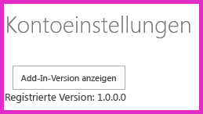

# <a name="add-first-run-logic-to-the-provider-hosted-add-in"></a><span data-ttu-id="16e03-102">Hinzufügen der Logik für die erste Ausführung zum vom Anbieter gehosteten Add-In</span><span class="sxs-lookup"><span data-stu-id="16e03-102">Add first-run logic to the provider-hosted add-in</span></span>
<span data-ttu-id="16e03-103">Erfahren Sie, wie Sie Code für die erste Ausführung in ein vom Anbieter gehostetes SharePoint-Add-In einfügen.</span><span class="sxs-lookup"><span data-stu-id="16e03-103">Learn how to include "first run" code in a provider-hosted SharePoint Add-in.</span></span>
 

 <span data-ttu-id="16e03-p101">**Hinweis** Der Name „Apps für SharePoint“ wird in „SharePoint-Add-Ins“ geändert. Während des Übergangszeitraums wird in der Dokumentation und der Benutzeroberfläche einiger SharePoint-Produkte und Visual Studio-Tools möglicherweise weiterhin der Begriff „Apps für SharePoint“ verwendet. Weitere Informationen finden Sie unter [Neuer Name für Office- und SharePoint-Apps](new-name-for-apps-for-sharepoint.md#bk_newname).</span><span class="sxs-lookup"><span data-stu-id="16e03-p101">**Note**  The name "apps for SharePoint" is changing to "SharePoint Add-ins". During the transition, the documentation and the UI of some SharePoint products and Visual Studio tools might still use the term "apps for SharePoint". For details, see  [New name for apps for Office and SharePoint](new-name-for-apps-for-sharepoint.md#bk_newname).</span></span>
 

<span data-ttu-id="16e03-107">Dies ist der achte in einer Reihe von Artikeln über die Grundlagen der Entwicklung von vom Anbieter gehosteten SharePoint-Add-Ins. Sie sollten sich zuerst mit [SharePoint Add-Ins](sharepoint-add-ins.md) und den vorherigen Artikeln in dieser Reihe vertraut machen:</span><span class="sxs-lookup"><span data-stu-id="16e03-107">This is the eighth in a series of articles about the basics of developing provider-hosted SharePoint Add-ins. You should first be familiar with  [SharePoint Add-ins](sharepoint-add-ins.md) and the previous articles in this series:</span></span>
 

-  [<span data-ttu-id="16e03-108">Erste Schritte beim Erstellen von von einem Anbieter gehosteten SharePoint-Add-Ins</span><span class="sxs-lookup"><span data-stu-id="16e03-108">Get started creating provider-hosted SharePoint Add-ins</span></span>](get-started-creating-provider-hosted-sharepoint-add-ins.md)
    
 
-  [<span data-ttu-id="16e03-109">Übertragen des SharePoint-Aussehens und -Verhaltens auf Ihr vom Anbieter gehostetes Add-In</span><span class="sxs-lookup"><span data-stu-id="16e03-109">Give your provider-hosted add-in the SharePoint look-and-feel</span></span>](give-your-provider-hosted-add-in-the-sharepoint-look-and-feel.md)
    
 
-  [<span data-ttu-id="16e03-110">Einfügen einer benutzerdefinierten Schaltfläche in das vom Anbieter gehostete Add-In</span><span class="sxs-lookup"><span data-stu-id="16e03-110">Include a custom button in the provider-hosted add-in</span></span>](include-a-custom-button-in-the-provider-hosted-add-in.md)
    
 
-  [<span data-ttu-id="16e03-111">Schnelle Übersicht über das SharePoint-Objektmodell</span><span class="sxs-lookup"><span data-stu-id="16e03-111">Get a quick overview of the SharePoint object model</span></span>](get-a-quick-overview-of-the-sharepoint-object-model.md)
    
 
-  [<span data-ttu-id="16e03-112">Hinzufügen von SharePoint-Schreibvorgängen zum vom Anbieter gehosteten Add-In</span><span class="sxs-lookup"><span data-stu-id="16e03-112">Add SharePoint write operations to the provider-hosted add-in</span></span>](add-sharepoint-write-operations-to-the-provider-hosted-add-in.md)
    
 
-  [<span data-ttu-id="16e03-113">Einfügen eines Add-In-Webparts in das vom Anbieter gehostete Add-In</span><span class="sxs-lookup"><span data-stu-id="16e03-113">Include an add-in part in the provider-hosted add-in</span></span>](include-an-add-in-part-in-the-provider-hosted-add-in.md)
    
 
-  [<span data-ttu-id="16e03-114">Verarbeiten von Add-In-Ereignissen im vom Anbieter gehosteten Add-In</span><span class="sxs-lookup"><span data-stu-id="16e03-114">Handle add-in events in the provider-hosted add-in</span></span>](handle-add-in-events-in-the-provider-hosted-add-in.md)
    
 

 <span data-ttu-id="16e03-p102">**Hinweis** Wenn Sie diese Reihe zu vom Anbieter gehosteten Add-Ins durchgearbeitet haben, haben Sie eine Visual Studio-Projektmappe, die Sie verwenden können, um mit diesem Thema fortzufahren. Sie können außerdem das Repository unter [SharePoint_Provider-hosted_Add-Ins_Tutorials](https://github.com/OfficeDev/SharePoint_Provider-hosted_Add-ins_Tutorials) herunterladen und die Datei „BeforeFirstRunLogic.sln“ öffnen.</span><span class="sxs-lookup"><span data-stu-id="16e03-p102">**Note**  If you have been working through this series about provider-hosted add-ins, then you have a Visual Studio solution that you can use to continue with this topic. You can also download the repository at  [SharePoint_Provider-hosted_Add-Ins_Tutorials](https://github.com/OfficeDev/SharePoint_Provider-hosted_Add-ins_Tutorials) and open the BeforeFirstRunLogic.sln file.</span></span>
 

<span data-ttu-id="16e03-p103">In diesem Artikel fügen Sie Code zur Startseite des ChainStore-SharePoint-Add-Ins hinzu, der überprüft, ob die aktuelle Instanz des Add-Ins zum ersten Mal ausgeführt wird. Wenn es das erste Mal ist, stellt Ihr Code die Liste **Lokale Mitarbeiter** und die benutzerdefinierte Menübandschaltfläche bereit.</span><span class="sxs-lookup"><span data-stu-id="16e03-p103">In this article you add code to the start page of the Chain Store SharePoint Add-in that checks to see if the current instance of the add-in is being run for the first time. If it is the first time, your code will deploy the  **Local Employees** list and the custom ribbon button.</span></span>
 

## <a name="create-the-basic-class-for-deploying-sharepoint-components"></a><span data-ttu-id="16e03-119">Erstellen der Basisklasse für die Bereitstellung von SharePoint-Komponenten</span><span class="sxs-lookup"><span data-stu-id="16e03-119">Create the basic class for deploying SharePoint components</span></span>


 

 

 <span data-ttu-id="16e03-p104">**Hinweis** Die Einstellungen für Startprojekte in Visual Studio werden normalerweise auf die Standardwerte zurückgesetzt, wann immer die Projektmappe erneut geöffnet wird. Führen Sie die folgenden Schritte immer unmittelbar nach dem erneuten Öffnen der Beispielprojektmappe in dieser Artikelreihe durch: Klicken Sie mit der rechten Maustaste oben im **Projektmappen-Explorer** auf den Projektmappenknoten, und wählen Sie **Startprojekte festlegen** aus. Stellen Sie sicher, dass alle drei Projekte in der Spalte **Aktion** auf **Starten** festgelegt sind.</span><span class="sxs-lookup"><span data-stu-id="16e03-p104">**Note**   The settings for Startup Projects in Visual Studio tend to revert to defaults whenever the solution is reopened. Always take these steps immediately after reopening the sample solution in this series of articles: Right-click the solution node at the top of **Solution Explorer** and select **Set startup projects**.  Make sure all three projects are set to **Start** in the **Action** column.</span></span>
 


1. <span data-ttu-id="16e03-123">Klicken Sie im **ChainStoreWeb**-Projekt im **Projektmappen-Explorer** mit der rechten Maustaste auf den Ordner **Dienstprogramme**, und wählen Sie dann **Hinzufügen | Vorhandenes Element** aus.</span><span class="sxs-lookup"><span data-stu-id="16e03-123">In the  **ChainStoreWeb** project in **Solution Explorer**, right-click the  **Utilities** folder and select **Add | Existing Item**.</span></span>
    
 
2. <span data-ttu-id="16e03-124">Navigieren Sie im daraufhin geöffneten **Datei-Explorer** zum Projektmappenordner, dem **ChainStoreWeb**-Ordner, und öffnen Sie dann den Ordner **Dienstprogramme**.</span><span class="sxs-lookup"><span data-stu-id="16e03-124">In the  **File Explorer** that opens navigate to the solution folder, the **ChainStoreWeb** folder, and then open the **Utilities** folder.</span></span>
    
 
3. <span data-ttu-id="16e03-125">Wählen Sie „SharePointComponentDeployer.cs“ aus, und klicken Sie auf **Hinzufügen**.</span><span class="sxs-lookup"><span data-stu-id="16e03-125">Select SharePointComponentDeployer.cs and press  **Add**.</span></span>
    
 
4. <span data-ttu-id="16e03-p105">Öffnen Sie die Datei „SharePointComponentDeployer.cs“. Sie enthält eine statische Klasse und zwei statische Methoden, die die Add-In-Version in der Tabelle **Mandanten** der Unternehmensdatenbank abrufen und festlegen. Diese Methoden werden nicht besprochen, da diese Artikelreihe nicht dafür vorgesehen ist, Kenntnissse der ASP.NET- oder SQL Server-/Azure-Programmierung zu vermitteln.</span><span class="sxs-lookup"><span data-stu-id="16e03-p105">Open the file SharePointComponentDeployer.cs. It has a static class and two static methods that get and set the add-in's version in the  **Tenants** table of the corporate database. We won't discuss these methods because this series of articles is not intended to teach ASP.NET or SQL Server/Azure programming.</span></span>
    
 
5. <span data-ttu-id="16e03-129">Fügen Sie die folgenden **using**-Anweisungen am Anfang der Datei hinzu.</span><span class="sxs-lookup"><span data-stu-id="16e03-129">Add the following  **using** statements to the top of the file.</span></span>
    
```
  using System.Web;
using System.Linq;
using System.Collections.Generic;
using Microsoft.SharePoint.Client;
```

6. <span data-ttu-id="16e03-p106">Fügen Sie oben in der Klasse  `SharePointComponentDeployer` die folgenden zwei statischen Felder hinzu. Beide werden in der Methode **Page_Load** Startseite des Add-Ins initialisiert. Sie fügen diesen Code in einem späteren Schritt hinzu. Das erste Feld enthält das Objekt **SharePointContext**, das zum Durchführen der CRUD-Vorgänge in SharePoint erforderlich ist. Das zweite enthält die Versionsnummer des Add-Ins, das im Hostweb installiert ist. Dieser Wert weicht anfangs vom Standardwert ab ( **0000.0000.0000.0000** ), der in der Tabelle **Mandanten** des Unternehmen aufgezeichnet wird, wenn der Handler für die Installation den Mandanten registriert. Die erste Version des Add-Ins ist z. B. **1.0.0.0**.</span><span class="sxs-lookup"><span data-stu-id="16e03-p106">At the top of the  `SharePointComponentDeployer` class, add the following two static fields. Both of these will be initialized in the **Page_Load** method of the add-in's start page. You add that code in a later step. The first field will hold the **SharePointContext** object that is needed to make CRUD operations on SharePoint. The second will hold the version number of the add-in that is installed on the host web. This value will initially be different from the default value ( **0000.0000.0000.0000** ) that is recorded in the corporate **Tenants** table when the installation handler registers the tenant. For example, the first version of the add-in will be **1.0.0.0**.</span></span>
    
```C#
  internal static SharePointContext sPContext;
internal static Version localVersion;
```

7. <span data-ttu-id="16e03-p107">Erstellen Sie die folgende statische Eigenschaft für die Version des Add-Ins, die derzeit in der Tabelle **Mandanten** des Unternehmens aufgezeichnet ist. Sie verwendet die zwei Methoden, die bereits in der Datei vorhanden waren, um diesen Wert abzurufen und festzulegen.</span><span class="sxs-lookup"><span data-stu-id="16e03-p107">Create the following static property to hold the version of the add-in that is currently recorded in the corporate  **Tenants** table. It uses the two methods that were already in the file to get and set this value.</span></span>
    
```C#
  internal static Version RemoteTenantVersion
{
    get
    {
        return GetTenantVersion();
    }
    set
    {
        SetTenantVersion(value);
    }
}
```

8. <span data-ttu-id="16e03-p108">Fügen Sie der Datei die folgende `IsDeployed`-Eigenschaft hinzu. Beachten Sie Folgendes zu diesem Code:</span><span class="sxs-lookup"><span data-stu-id="16e03-p108">Now create the following  `IsDeployed` property. Note the following about this code:</span></span>
    
      - <span data-ttu-id="16e03-p109">Die Methode **Page_Load** der Startseite für das Add-In verwendet den Wert dieser Eigenschaft, um zu bestimmen, ob das Add-In zum ersten Mal ausgeführt wird. Der Wert **false** signalisiert, dass das Add-In im aktuellen Hostweb noch nicht ausgeführt wurde und deshalb seine Komponenten bereitgestellt werden müssen.</span><span class="sxs-lookup"><span data-stu-id="16e03-p109">The  **Page_Load** method of the add-in's start page will use the value of this property to determine whether or not the add-in is running for the first time. A **false** value signals that the add-in has not run before on the current host web, so its components need to be deployed.</span></span>
    
 
  - <span data-ttu-id="16e03-p110">Das Kriterium ist, ob die in der Tabelle **Mandanten** registrierte Versionsnummer niedriger als die tatsächlich installierte Version ist. Bei der ersten Ausführung des Add-Ins ist die Nummer kleiner. In einem späteren Schritt geschriebener Code legt die Version in der Tabelle **Mandanten** auf dieselbe Version wie die tatsächlich installierte fest. Wenn das Add-In also erneut ausgeführt wird, gibt `IsDeployed` den Wert **true** zurück, und die Bereitstellungslogik wird nicht erneut ausgeführt.</span><span class="sxs-lookup"><span data-stu-id="16e03-p110">The criterion is whether or not the version number registered in the  **Tenants** table is lower than the version actually installed. The first time the add-in runs, it will be lower. Code that you write in a later step sets the version in the **Tenants** table to the same version as is actually installed, so when the add-in runs again, `IsDeployed` will return **true** and the deployment logic will not execute again.</span></span>
    
 

```C#
  public static bool IsDeployed
{
    get
    {
        if (RemoteTenantVersion < localVersion)
            return false; 
        else
            return true; 
    }
}
```

9. <span data-ttu-id="16e03-p111">Fügen Sie die folgende Methode zur Klasse  `SharePointComponentDeployer` hinzu. Beachten Sie, dass die letzte Aktion, die die Methode ausführt, das Aktualisieren der Mandantenversion ist, die in der Datenbank des Unternehmens registriert ist ( **0000.0000.0000.0000** ), damit sie mit der aktuellen Version des Add-Ins im Hostweb übereinstimmt ( **1.0.0.0** ). Sie schließen diese Methode in einem späteren Schritt ab.</span><span class="sxs-lookup"><span data-stu-id="16e03-p111">Add the following method to the  `SharePointComponentDeployer` class. Note that the last thing the method does is update the registered tenant version in the corporate database ( **0000.0000.0000.0000** ) to match the actual version of the add-in on the host web ( **1.0.0.0** ). You will complete this method in a later step.</span></span>
    
```C#
  internal static void DeployChainStoreComponentsToHostWeb(HttpRequest request)
{
    // TODO4: Deployment code goes here.

    RemoteTenantVersion = localVersion;
}
```


 <span data-ttu-id="16e03-p112">**Hinweis** Sie fragen sich vielleicht, warum das Add-In Versionsnummern und einen „Kleiner als“-Test verwendet, um die Antwort auf eine einfache Ja/Nein-Frage zu ermitteln: Wird das Add-In zum ersten Mal ausgeführt? Es könnte ebenso gut ein einfaches Zeichenfolgenfeld in der Tabelle **Mandanten** vorhanden sein, das im Installationshandler auf „Noch nicht ausgeführt“ und dann von der Logik für die erste Ausführung in „Bereits einmal ausgeführt“ geändert wird, nachdem die SharePoint-Komponenten bereitgestellt wurden. Für das ChainStore-Add-In funktioniert ein einfacher Test. Es empfiehlt sich jedoch im Allgemeinen, Versionsnummern zu verwenden. Der Grund ist, dass ein Produktions-Add-In in Zukunft wahrscheinlich direkt aktualisiert wird, d. h. nachdem es bereits installiert wurde. Dann muss Ihre Add-In-Logik auf mehr als die zwei Möglichkeiten „Noch nicht ausgeführt“ und „Bereits einmal ausgeführt“ reagieren können. Angenommen, Sie möchten beispielsweise eine weitere Liste zum Hostweb im Upgrade von Version 1.0.0.0 auf 2.0.0.0 hinzufügen. Sie könnten dies mit einem Updateereignishandler durchführen oder in einer „Erste Ausführung nach Update“-Logik. In beiden Fällen muss Ihre Bereitstellungslogik neue Komponenten bereitstellen, aber auch vermeiden, dass versucht wird, Komponenten erneut bereitzustellen, die in einer früheren Version des Add-Ins bereitgestellt wurden. Die Versionsnummer 1.0.0.0 würde signalisieren, dass die Komponenten der Version 1.0.0.0 bereitgestellt wurden, aber die Logik für die erste Ausführung nach dem Update noch nicht ausgeführt wurde.</span><span class="sxs-lookup"><span data-stu-id="16e03-p112">**Note**  You may wonder now why the add-in uses version numbers and a "less than" test to determine the answer to a simple yes/no question: is the add-in running for the first time? We could just as well have a simple string field in the  **Tenants** table that is set to "not run yet" in the installation handler, and then changed to "already run once" by the first-run logic after the SharePoint components are deployed.For the Chain Store add-in, a simple test would work. However, it is generally a good practice to use version numbers. This is because a production add-in is likely to be updated-in-place in the future; that is, updated after it is already installed. When that time comes, your add-in logic will need to be sensitive to more than the two possibilities not-yet-run andalready-run-once. Suppose, for example, that you want to add an additional list to the host web in the upgrade from version 1.0.0.0 to 2.0.0.0. You could do this in an update event handler, or in "first run after update" logic. Either way, your deployment logic will need to deploy new components, but it will also need to avoid trying to redeploy components that were deployed in a previous version of the add-in. A version number of 1.0.0.0 would signal that the components of version 1.0.0.0 have been deployed but that the first-run-after-update logic has not yet run.</span></span>
 


## <a name="add-the-basic-startup-logic"></a><span data-ttu-id="16e03-158">Hinzufügen der grundlegenden Startlogik</span><span class="sxs-lookup"><span data-stu-id="16e03-158">Add the basic startup logic</span></span>


 

 

1. <span data-ttu-id="16e03-p113">Das SharePoint-Hostweb muss der Remotewebanwendung mitteilen, welche Version des Add-Ins installiert wurde. Dafür wird ein Abfrageparameter verwendet. Öffen Sie die Datei „AppManifest.xml“ im **ChainStore**-Projekt. Im Designer sehen Sie den Platzhalter **{StandardTokens}** als Wert für das Feld **Abfragezeichenfolge**. Fügen Sie die Zeichenfolge „&amp;SPAddInVersion=1.0.0.0“ am Ende hinzu. Der Manifest-Designer sollte etwa wie folgt aussehen. *Beachten Sie, dass die Versionsnummer, die Sie in der Abfragezeichenfolge übergeben, mit dem Wert im Feld **Version** des Designers übereinstimmen muss.* (Wenn Sie das Add-In aktualisieren, besteht eine Ihrer Aufgaben darin, diese zwei Werte zu erhöhen und gleich zu halten.)</span><span class="sxs-lookup"><span data-stu-id="16e03-p113">The SharePoint host web needs to tell the remote web application what version of the add-in it has installed. We'll use a query parameter to do this. Open the AppManifest.xml file in the  **ChainStore** project. In the designer you'll see the placeholder **{StandardTokens}** as the value of the **Query string** box. Add the string "&amp;SPAddInVersion=1.0.0.0" to the end. The manifest designer should look similar to the following.  *Notice that the version number you pass in the query string has to match the value in the  **Version** box of the designer.*  (If you ever update the add-in, one of your tasks is to raise these two values and keep them the same.)</span></span>
    
  
 

 

 
2. <span data-ttu-id="16e03-p115">Öffnen Sie die Datei „CorporateDataViewer.aspx.cs“, und fügen Sie den folgenden Code zur Methode **Page_Load** hinzu, direkt unter der Zeile, die das `spContext`-Objekt initialisiert. Beachten Sie Folgendes bei diesem Code:</span><span class="sxs-lookup"><span data-stu-id="16e03-p115">Open the CorporateDataViewer.aspx.cs file and add the following code to the  **Page_Load** method, just below the line that initializes the `spContext` object. Note the following about this code:</span></span>
    
      - <span data-ttu-id="16e03-p116">Er beginnt mit der Festlegung der zwei statischen Felder in der statischen  `SharePointComponentDeployer`-Klasse. Er übergibt das Objekt **SharePointContext**, da der Code in  `SharePointComponentDeployer` SharePoint aufruft und den Abfrageparameter verwendet, den Sie hinzugefügt haben, um die Eigenschaft `localVersion` festzulegen.</span><span class="sxs-lookup"><span data-stu-id="16e03-p116">It begins by setting the two static fields in the static  `SharePointComponentDeployer` class. It passes the **SharePointContext** object because the code in the `SharePointComponentDeployer` will be calling into SharePoint, and it uses the query parameter that you added to set the `localVersion` property.</span></span>
    
 
  - <span data-ttu-id="16e03-p117">Es geschieht nichts, wenn  `IsDeployed` true ist. Das heißt, wenn die Logik für die „erste Ausführung" bereits ausgeführt wurde. Andernfalls wird die Bereitstellungsmethode aufgerufen, und das ASP.NET-Anforderungsobjekt wird übergeben.</span><span class="sxs-lookup"><span data-stu-id="16e03-p117">It does nothing if  `IsDeployed` is true; that is, if the "first run" logic has already run. Otherwise it calls the deployment method and passes the ASP.NET Request object.</span></span>
    
 

```C#
  SharePointComponentDeployer.sPContext = spContext;
SharePointComponentDeployer.localVersion = new Version(Request.QueryString["SPAddInVersion"]);

if (!SharePointComponentDeployer.IsDeployed)
{
    SharePointComponentDeployer.DeployChainStoreComponentsToHostWeb(Request);
}
```


## <a name="programmatically-deploy-a-sharepoint-list"></a><span data-ttu-id="16e03-176">Programmgesteuertes Bereitstellen einer SharePoint-Liste</span><span class="sxs-lookup"><span data-stu-id="16e03-176">Programmatically deploy a SharePoint list</span></span>


 

 

1. <span data-ttu-id="16e03-p118">Ersetzen Sie in der Datei „SharePointComponentDeployer.cs“ `TODO4` durch die folgende Zeile. Im nächsten Schritt erstellen Sie diese Methode.</span><span class="sxs-lookup"><span data-stu-id="16e03-p118">In the SharePointComponentDeployer.cs file, replace the  `TODO4` with the following line. You create this method in the next step.</span></span>
    
```C#
  CreateLocalEmployeesList();
```

2. <span data-ttu-id="16e03-p119">Fügen Sie der `SharePointComponentDeployer`-Klasse die folgende Methode hinzu. Beachten Sie Folgendes zu diesem Code:</span><span class="sxs-lookup"><span data-stu-id="16e03-p119">Add the following method to the  `SharePointComponentDeployer` class. Note the following about this code:</span></span>
    
      - <span data-ttu-id="16e03-p120">Er enthält zwei Aufrufe von **ExecuteQuery**. Der erste ist erforderlich, um festzustellen, ob die Liste bereits vorhanden ist. Der zweite erstellt die Liste.</span><span class="sxs-lookup"><span data-stu-id="16e03-p120">It has two calls of  **ExecuteQuery**. The first is needed to determine if the list already exists. The second does the work of creating the list.</span></span>
    
 
  - <span data-ttu-id="16e03-184">Die Methode **ClientContext.LoadQuery** ist vergleichbar mit **ClientContext.Load**, mit der Ausnahme, dass keine Entität wie z. B. eine Liste, sondern die aufzählbaren Ergebnisse einer Abfrage auf den Client gebracht werden.</span><span class="sxs-lookup"><span data-stu-id="16e03-184">The  **ClientContext.LoadQuery** method is similar to the **ClientContext.Load** except that instead of bringing an entity, such as a list, down to the client, it brings down the enumerable results of a query.</span></span>
    
 

```C#
  private static void CreateLocalEmployeesList()
{
    using (var clientContext = sPContext.CreateUserClientContextForSPHost())
    {
        var query = from list in clientContext.Web.Lists
                    where list.Title == "Local Employees"
                    select list;
        IEnumerable<List> matchingLists = clientContext.LoadQuery(query);
        clientContext.ExecuteQuery();

        if (matchingLists.Count() == 0)
        {
           // TODO5: Create the list 

           // TODO6: Rename the Title field on the list 

           // TODO7: Add "Added to Corporate DB" field to the list 

           clientContext.ExecuteQuery();
        }
    }
}
```

3. <span data-ttu-id="16e03-p121">Ersetzen Sie `TODO5` durch die nachfolgende Zeile. Beachten Sie Folgendes zu diesem Code:</span><span class="sxs-lookup"><span data-stu-id="16e03-p121">Replace  `TODO5` with the following code. Note the following about this code:</span></span>
    
      - <span data-ttu-id="16e03-p122">Die Klasse **ListCreationInformation** ist vergleichbar mit der Klasse **ListItemCreationInformation**, die Sie in einem früheren Artikel dieser Reihe gesehen haben. Es ist eine einfache Klasse, die sich besser für das Senden von Informationen aus der Webanwendung an SharePoint eignet als die vollständige **List**-Klasse.</span><span class="sxs-lookup"><span data-stu-id="16e03-p122">The  **ListCreationInformation** class is similar to the **ListItemCreationInformation** class you saw in an earlier article in this series. It is a lightweight class more suitable for sending information from the web application to SharePoint than the full **List** class.</span></span>
    
 
  - <span data-ttu-id="16e03-p123">Es gibt viele Arten von Listenvorlagen, z. B. den Typ „Aufgaben“ für eine To-Do-Liste und den Typ „Ereignisse“ für einen Kalender. Die Liste **Lokale Mitarbeiter**basiert auf der einfachsten Art: dem Typ „Generisch“.</span><span class="sxs-lookup"><span data-stu-id="16e03-p123">There are many types of list templates, such as the Tasks type for a "to do" list and the Events type for a calendar. The  **Local Employees** list is based on the simplest: the Generic type.</span></span>
    
 
  - <span data-ttu-id="16e03-p124">Die Eigenschaft **ListCreationInformation.Url** enthält die URL der Liste *relativ* zum Hostweb. Durch Angeben von „Listen/LokaleMitarbeiter§ legt der Code die vollständige URL der Liste auf „https:// *{SharePointDomain}*/hongkong/_layouts/15/start.aspx#/Lists/Local%20Employees“ fest.</span><span class="sxs-lookup"><span data-stu-id="16e03-p124">The  **ListCreationInformation.Url** property holds the URL of the list *relative*  to the host web. By specifying "Lists/LocalEmployees", the code is setting the full URL of the list to https:// *{SharePointDomain}*  /hongkong/_layouts/15/start.aspx#/Lists/Local%20Employees.</span></span>
    
 

```C#
  ListCreationInformation listInfo = new ListCreationInformation();
listInfo.Title = "Local Employees";
listInfo.TemplateType = (int)ListTemplateType.GenericList;
listInfo.Url = "Lists/Local Employees";
List localEmployeesList = clientContext.Web.Lists.Add(listInfo);
```

4. <span data-ttu-id="16e03-p125">Ersetzen Sie  `TODO6` durch den folgenden Code, der den öffentlichen Namen des Felds „Titel" (Spalte) von „Titel" in „Name" ändert. Diese Aktion haben Sie auf auf der Seite **Listeneinstellungen** durchgeführt, als Sie die Liste manuell erstellt haben.</span><span class="sxs-lookup"><span data-stu-id="16e03-p125">Replace  `TODO6` with the following code which changes the public name of the "Title" field (column) from "Title" to "Name". This is what you did on the **List Settings** page when you created the list manually.</span></span>
    
```C#
  Field field = localEmployeesList.Fields.GetByInternalNameOrTitle("Title");
field.Title = "Name";
field.Update();
```

5. <span data-ttu-id="16e03-p126">Sie haben außerdem manuell ein Feld namens **Zu Unternehmens-DB hinzugefügt** erstellt. Um diese Aktion programmgesteuert durchzuführen, fügen Sie den folgenden Code anstelle von `TODO7` hinzu. Beachten Sie Folgendes bei diesem Code:</span><span class="sxs-lookup"><span data-stu-id="16e03-p126">You also manually created a field named  **Added to Corporate DB**. To do that programmatically add the following code in place of  `TODO7`. Note the following about this code:</span></span>
    
      - <span data-ttu-id="16e03-p127">Die wichtigsten Eigenschaften des Felds werden mit einem XML-Blob angegeben. Hierbei handelt es sich um ein Relikt aus der SharePoint-Architektur: Websites, Listen, Felder, Inhaltstypen und die meisten anderen Arten von SharePoint-Komponenten werden im XML-Format definiert. In diesem Fall geben wir den Anzeigenamen, den Datentyp und den Standardwert für das Feld an.</span><span class="sxs-lookup"><span data-stu-id="16e03-p127">The key properties of the field are specified with an XML blob. This is a legacy of SharePoint's architecture: websites, lists, fields, content types, and most other kinds of SharePoint components are defined as XML. In this case we are specifying the display name, data type, and default value of the field.</span></span>
    
 
  - <span data-ttu-id="16e03-p128">Der zweite Parameter bestimmt, ob das Feld in der Standardansicht der Liste angezeigt wird. Er wird auf **true** festgelegt.</span><span class="sxs-lookup"><span data-stu-id="16e03-p128">The second parameter determines whether the field is visible in the default view of the list. We're setting it to  **true**.</span></span> 
    
 
  - <span data-ttu-id="16e03-p129">Der dritte Parameter kann verwendet werden, um zu bestimmen, welchen Inhaltstypen das Feld hinzugefügt wird. Wenn Sie **DefaultValue** übergeben, wird es nur zum Standardinhaltstyp der Liste hinzugefügt.</span><span class="sxs-lookup"><span data-stu-id="16e03-p129">The third parameter can be used to determine what content types the field is added to. Passing  **DefaultValue** means that it is only added to the list's default content type.</span></span>
    
 

```C#
  localEmployeesList.Fields.AddFieldAsXml("<Field DisplayName='Added to Corporate DB'"
                                         +"Type='Boolean'>"
                                         + "<Default>FALSE</Default></Field>",
                                         true,
                                         AddFieldOptions.DefaultValue);
```

6. <span data-ttu-id="16e03-p130">Sie erinnern sich, dass **Zu Unternehmens-DB hinzugefügt** standardmäßig **Nein** ist (d. h. false), die benutzerdefinierte Menübandschaltfläche im Add-In dies aber auf **Ja** festlegt, nachdem Mitarbeiter zur Unternehmensdatenbank hinzugefügt wurden. Dieses System funktioniert nur am besten, wenn Benutzer den Wert des Felds nicht manuell ändern können. Um dies sicherzustellen, machen Sie das Feld in den Formularen für das Erstellen und Bearbeiten von Elementen in der Liste **Lokale Mitarbeiter** unsichtbar. Dazu müssen wir zwei weitere Attribute zum ersten Parameter hinzufügen, wie im Folgenden dargestellt.</span><span class="sxs-lookup"><span data-stu-id="16e03-p130">Recall that the  **Added to Corporate DB** is **No** (that is, false) by default, but the custom ribbon button in the add-in sets it to **Yes** after it adds the employee to the corporate database. This system only works best if users cannot manually change the value of the field. To ensure that they don't, make the field invisible in the forms for creating and editing items on the **Local Employees** list. We do this by adding two more attributes to the first parameter, as shown in the following.</span></span>
    
```C#
  localEmployeesList.Fields.AddFieldAsXml("<Field DisplayName='Added to Corporate DB'" 
                                         + " Type='Boolean'"  
                                         + " ShowInEditForm='FALSE' "
                                         + " ShowInNewForm='FALSE'>"
                                         + "<Default>FALSE</Default></Field>",
                                         true,
                                         AddFieldOptions.DefaultValue);
```


    The entire  `CreateLocalEmployeesList` should now look like the following.
    


```C#
  private static void CreateLocalEmployeesList()
{
    using (var clientContext = sPContext.CreateUserClientContextForSPHost())
    {
        var query = from list in clientContext.Web.Lists
                    where list.Title == "Local Employees"
                    select list;
        IEnumerable<List> matchingLists = clientContext.LoadQuery(query);
        clientContext.ExecuteQuery();

        if (matchingLists.Count() == 0)
        {
            ListCreationInformation listInfo = new ListCreationInformation();
            listInfo.Title = "Local Employees";
            listInfo.TemplateType = (int)ListTemplateType.GenericList;
            listInfo.Url = "LocalEmployees";
            List localEmployeesList = clientContext.Web.Lists.Add(listInfo);

            Field field = localEmployeesList.Fields.GetByInternalNameOrTitle("Title");
            field.Title = "Name";
            field.Update();

            localEmployeesList.Fields.AddFieldAsXml("<Field DisplayName='Added to Corporate DB'" 
                                                    + " Type='Boolean'"  
                                                   + " ShowInEditForm='FALSE' "
                                                   + " ShowInNewForm='FALSE'>"
                                                   + "<Default>FALSE</Default></Field>",
                                                    true,
                                                    AddFieldOptions.DefaultValue);
            clientContext.ExecuteQuery();
        }
    }
}
```


## <a name="temporarily-remove-the-custom-button-from-the-project"></a><span data-ttu-id="16e03-209">Vorübergehendes Entfernen der benutzerdefinierten Schaltfläche aus dem Projekt</span><span class="sxs-lookup"><span data-stu-id="16e03-209">Temporarily remove the custom button from the project</span></span>

<span data-ttu-id="16e03-p131">Aus technischen Gründen, die wir im nächsten Artikel behandeln, kann die benutzerdefinierte Schaltfläche, die wir erstellt haben, nicht ohne Änderung installiert werden, wenn sie auf dem Menüband einer Liste eingefügt wird, die programmgesteuert bereitgestellt wird. Wir müssen sie vorübergehend aus dem Projekt entfernen, damit wir unsere Logik für die erste Ausführung testen können. Im nächsten Artikel wird die Schaltfläche wieder in das Menüband zurückgebracht.</span><span class="sxs-lookup"><span data-stu-id="16e03-p131">For technical reasons that we'll discuss in the next article, the custom button we created cannot be installed without modification when it is being put on the ribbon of a list that is programmatically deployed. We'll remove it temporarily from the project, so that we can test our first-run logic. We'll bring it back in the next article.</span></span>
 

 
<span data-ttu-id="16e03-213">Klicken Sie im **Projektmappen-Explorer** im **ChainStore**-Projekt mit der rechten Maustaste auf den Knoten **AddEmployeeToCorpDB**, und wählen Sie **Aus Projekt ausschließen** aus.</span><span class="sxs-lookup"><span data-stu-id="16e03-213">In  **Solution Explorer**, in the  **ChainStore** project, right-click the **AddEmployeeToCorpDB** node and select **Exclude from Project**.</span></span>
 

 

## <a name="request-permission-to-manage-lists-on-the-host-web"></a><span data-ttu-id="16e03-214">Anfordern der Berechtigung zum Verwalten von Listen im Hostweb</span><span class="sxs-lookup"><span data-stu-id="16e03-214">Request permission to manage lists on the host web</span></span>

<span data-ttu-id="16e03-p132">Da das Add-In jetzt eine Liste zum Hostweb und nicht nur Elemente zu einer vorhandenen Liste hinzufügt, müssen die Berechtigungen, die das Add-In anfordert, von „Schreiben" zu „Verwalten" eskaliert werden. Gehen Sie folgendermaßen vor.</span><span class="sxs-lookup"><span data-stu-id="16e03-p132">Since the add-in is now adding a list to the host web, not just items to an existing list, we need to escalate the permissions that the add-in requests from Write to Manage. Follow these steps.</span></span>
 

 

1. <span data-ttu-id="16e03-217">Öffnen Sie im **Projektmappen-Explorer** die Datei „AppManifest.xml“ im **ChainStore**-Projekt.</span><span class="sxs-lookup"><span data-stu-id="16e03-217">In  **Solution Explorer**, open the AppManifest.xml file in the  **ChainStore** project.</span></span>
    
 
2. <span data-ttu-id="16e03-218">Öffnen Sie die Registerkarte **Berechtigungen**, und behalten Sie für den Wert **Bereich** die Einstellung „Web“ bei, aber wählen Sie im Feld **Berechtigung** die Option **Verwalten** aus der Dropdownliste.</span><span class="sxs-lookup"><span data-stu-id="16e03-218">Open the  **Permissions** tab and leave the **Scope** value at Web, but in the **Permission** field, select **Manage** from the drop down.</span></span>
    
 
3. <span data-ttu-id="16e03-219">Speichern Sie die Datei.</span><span class="sxs-lookup"><span data-stu-id="16e03-219">Save the file.</span></span>
    
 

## <a name="run-the-add-in-and-test-the-first-run-logic"></a><span data-ttu-id="16e03-220">Ausführen des Add-Ins und Testen der Logik für die erste Ausführung</span><span class="sxs-lookup"><span data-stu-id="16e03-220">Run the add-in and test the "first run" logic</span></span>


 

 

1. <span data-ttu-id="16e03-221">Öffnen Sie die Seite **Websiteinhalte** der Website des Hongkong-Stores, *und entfernen Sie die Liste **Lokale Mitarbeiter**.*</span><span class="sxs-lookup"><span data-stu-id="16e03-221">Open the  **Site Contents** page of the Hong Kong store's website *and remove the  **Local Employees** list!*</span></span> 
    
 
2. <span data-ttu-id="16e03-p133">Verwenden Sie die F5-TASTE, um Ihr Add-In bereitzustellen und auszuführen. Visual Studio hostet die Remotewebanwendung in IIS Express und die SQL-Datenbank in SQL Express. Außerdem wird eine temporäre Installation des Add-Ins auf Ihrer SharePoint-Testwebsite durchgeführt, und das Add-In wird sofort ausgeführt. Sie werden aufgefordert, Berechtigungen für das Add-In zu erteilen, bevor die Startseite geöffnet wird.</span><span class="sxs-lookup"><span data-stu-id="16e03-p133">Use the F5 key to deploy and run your add-in. Visual Studio hosts the remote web application in IIS Express and hosts the SQL database in a SQL Express. It also makes a temporary installation of the add-in on your test SharePoint site and immediately runs the add-in. You are prompted to grant permissions to the add-in before its start page opens.</span></span>
    
 
3. <span data-ttu-id="16e03-226">Wenn die Add-In-Startseite geöffnet wird, wählen Sie den Link **Zurück zur Website** auf dem Chromesteuerelement im oberen Bereich aus.</span><span class="sxs-lookup"><span data-stu-id="16e03-226">When the add-in's start page opens, select the  **Back to Site** link on the chrome control at the top.</span></span>
    
 
4. <span data-ttu-id="16e03-p134">Navigieren Sie zur Seite **Websiteinhalte**. Die Liste **Lokale Mitarbeiter** ist vorhanden, da Ihre Logik für die erste Ausführung sie hinzugefügt hat.</span><span class="sxs-lookup"><span data-stu-id="16e03-p134">Navigate to the  **Site Contents** page. The **Local Employees** list is present because your first-run logic added it.</span></span>
    
     <span data-ttu-id="16e03-p135">**Hinweis** Wenn die Liste nicht vorhanden ist oder Sie andere Anzeichen haben, dass der Code für die erste Ausführung nicht ausgeführt wird, wird möglicherweise die Tabelle **Mandanten** nicht in einen leeren Zustand zurückgesetzt, wenn Sie F5 drücken. Die häufigste Ursache hierfür ist, dass das Projekt **ChainCorporateDB** nicht mehr als Startprojekt in Visual Studio festgelegt ist. Im oberen Bereich dieses Artikels finden Sie Informationen, wie Sie dies beheben. Stellen Sie außerdem sicher, dass Sie die Datenbank so konfiguriert haben, dass sie wie unter [Konfigurieren von Visual Studio zum erneuten Erstellen der Unternehmensdatenbank bei jeder Debugsitzung](give-your-provider-hosted-add-in-the-sharepoint-look-and-feel.md#Rebuild) beschrieben neu erstellt wird.</span><span class="sxs-lookup"><span data-stu-id="16e03-p135">**Note**  If the list is not there or you have other indications that the first-run code is not executing, it may be that the  **Tenants** table is not being reverted to an empty state when you press F5. The most common cause of this is that the **ChainCorporateDB** project is no longer set as a startup project in Visual Studio. See the note near the top of this article for how to fix this. Also be sure that you've configured the database to be rebuilt as described in [Configure Visual Studio to rebuild the corporate database with each debugging session](give-your-provider-hosted-add-in-the-sharepoint-look-and-feel.md#Rebuild).</span></span>
5. <span data-ttu-id="16e03-p136">Öffnen Sie die Liste, und fügen Sie ein Element hinzu. Beachten Sie, dass im Formular für neue Elemente das Feld **Zu Unternehmens-DB hinzugefügt** nicht mehr vorhanden ist und deshalb nicht manuell festgelegt werden kann. Dies gilt auch für das Formular zum Bearbeiten von Elementen.</span><span class="sxs-lookup"><span data-stu-id="16e03-p136">Open the list and add an item. Note that on the new item form, the  **Added to Corporate DB** field is no longer present, so it cannot be manually set. This is true of the edit item form as well.</span></span>
    
  
 

 

 
6. <span data-ttu-id="16e03-239">Verwenden Sie im Browser die Schaltfläche „Zurück“, um zurück zur Startseite für das Add-In zu navigieren.</span><span class="sxs-lookup"><span data-stu-id="16e03-239">Use the browser's back button to navigate back to the add-in's start page.</span></span>
    
 
7. <span data-ttu-id="16e03-240">Klicken Sie auf das Zahnradsymbol des Chromsteuerelements im oberen Bereich, und wählen Sie **Kontoeinstellungen** aus.</span><span class="sxs-lookup"><span data-stu-id="16e03-240">Press the gear icon on the chrome control at the top, and select  **Account settings**.</span></span>
    
 
8. <span data-ttu-id="16e03-p138">Klicken Sie auf der Seite **Konten** auf die Schaltfläche **Add-In-Version anzeigen**. Als Version wird **1.0.0.0** angezeigt, da die Logik für die erste Ausführung sie geändert hat.</span><span class="sxs-lookup"><span data-stu-id="16e03-p138">On the  **Accounts** page, press the **Show Add-in Version** button. The version shows as **1.0.0.0** because the first-run logic changed it.</span></span>
    
  
 

 

 
9. <span data-ttu-id="16e03-p139">Schließen Sie zum Beenden der Debugsitzung das Browserfenster, oder beenden Sie das Debuggen in Visual Studio. Jedes Mal, wenn Sie F5 drücken, zieht Visual Studio die vorherige Version des Add-Ins zurück und installiert die neueste.</span><span class="sxs-lookup"><span data-stu-id="16e03-p139">To end the debugging session, close the browser window or stop debugging in Visual Studio. Each time that you press F5, Visual Studio will retract the previous version of the add-in and install the latest one.</span></span>
    
 
10. <span data-ttu-id="16e03-p140">Da Sie mit diesem Add-In und dieser Visual Studio-Lösung in anderen Artikeln arbeiten werden, hat es sich bewähr, das Add-In ein letztes Mal zurückzuziehen, wenn Sie Ihre Arbeit daran für eine Weile abgeschlossen haben. Klicken Sie mit der rechten Maustaste auf das Projekt im **Projektmappen-Explorer**, und wählen Sie **Zurückziehen** aus.</span><span class="sxs-lookup"><span data-stu-id="16e03-p140">You will work with this add-in and Visual Studio solution in other articles, and it's a good practice to retract the add-in one last time when you are done working with it for a while. Right-click the project in  **Solution Explorer** and choose **Retract**.</span></span>
    
 

## 
<span data-ttu-id="16e03-248"><a name="Nextsteps"> </a></span><span class="sxs-lookup"><span data-stu-id="16e03-248"><a name="Nextsteps"> </a></span></span>

 <span data-ttu-id="16e03-249">Im nächsten Artikel wird gezeigt, wie Sie die benutzerdefinierte Schaltfläche für das Menüband **Lokale Mitarbeiter** zurück in das Add-In bringen, nachdem die Liste jetzt programmgesteuert bereitgestellt wird: [Programmgesteuerte Bereitstellung einer benutzerdefinierten Schaltfläche im vom Anbieter gehosteten Add-In](programmatically-deploy-a-custom-button-in-the-provider-hosted-add-in.md)</span><span class="sxs-lookup"><span data-stu-id="16e03-249">In the next article, you'll see how to get the custom button for the **Local Employee** ribbon back into the add-in now the list is being deployed programmatically: [Programmatically deploy a custom button in the provider-hosted add-in](programmatically-deploy-a-custom-button-in-the-provider-hosted-add-in.md)</span></span>
 

 

