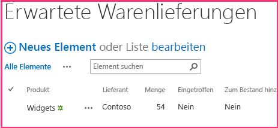

# <a name="add-sharepoint-write-operations-to-the-provider-hosted-add-in"></a>Hinzufügen von SharePoint-Schreibvorgängen zu anbietergehosteten Add-Ins

Dies ist der fünfte Artikel in unserer Artikelreihe über die Grundlagen der Entwicklung von anbietergehosteten SharePoint-Add-Ins. Vor der Lektüre dieses Artikels sollten Sie sich zunächst mit [SharePoint-Add-Ins](sharepoint-add-ins.md) vertraut machen und die vorherigen Artikel der Reihe lesen:

-  [Get started creating provider-hosted SharePoint Add-ins](get-started-creating-provider-hosted-sharepoint-add-ins.md)
-  [Übertragen des SharePoint-Aussehens und -Verhaltens auf Ihr vom Anbieter gehostetes Add-In](give-your-provider-hosted-add-in-the-sharepoint-look-and-feel.md)
-  [Einfügen einer benutzerdefinierten Schaltfläche in das vom Anbieter gehostete Add-In](include-a-custom-button-in-the-provider-hosted-add-in.md)
-  [Schnelle Übersicht über das SharePoint-Objektmodell](get-a-quick-overview-of-the-sharepoint-object-model.md)

> [!NOTE]
> Wenn Sie unsere Artikelreihe zum Thema anbietergehostete Add-Ins durchgearbeitet haben, haben Sie bereits eine Visual Studio-Lösung, die Sie für diesen Artikel verwenden können. Alternativ können Sie das Repository unter [SharePoint_Provider-hosted_Add-Ins_Tutorials](https://github.com/OfficeDev/SharePoint_Provider-hosted_Add-ins_Tutorials) herunterladen und die Datei „BeforeSharePointWriteOps.sln“ öffnen.

In diesem Artikel widmen wir uns wieder dem eigentlichen Programmieren und fügen verschiedene Funktionen hinzu, die Daten in das ChainStore-SharePoint-Add-In schreiben.

## <a name="change-a-column-value-on-a-sharepoint-list-item"></a>Ändern von Spaltenwerten in SharePoint-Listenelementen

Unser Add-In verfügt über eine benutzerdefinierte Menübandschaltfläche, über die sich Mitarbeiter aus der Liste **Lokale Mitarbeiter** des Stores in Hongkong zur Unternehmensdatenbank hinzufügen lassen. Der Benutzer muss jedoch daran denken, den Wert des Felds **Zur Unternehmensdatenbank hinzugefügt** manuell auf **Ja** zu setzen. In diesem Artikel fügen Sie Code ein, der das automatisch erledigt.

> [!NOTE]
> Die Einstellungen für Startprojekte in Visual Studio werden in der Regel nach jedem erneuten Öffnen der Lösung wieder auf die Standardwerte zurückgesetzt. Wann immer Sie beim Durcharbeiten dieser Artikelreihe die Beispiellösung erneut öffnen, müssen Sie umgehend die folgenden Schritte durchführen: 

> 1. Klicken Sie oben im **Projektmappen-Explorer** mit der rechten Maustaste auf den Lösungsknoten, und wählen Sie die Option **Startprojekte festlegen** aus.  
> 2. Stellen Sie sicher, dass alle drei Projekte in der Spalte **Aktion** auf **Start** gesetzt sind.

1. Öffnen Sie im **Projektmappen-Explorer** die Datei „EmployeeAdder.cs“.

2. Fügen Sie der Methode **Page_Load** die unten aufgeführte Zeile hinzu, zwischen dem Aufruf von `AddLocalEmployeeToCorpDB` und dem Aufruf von `Response.Redirect`. Im nächsten Schritt erstellen Sie die Methode **SetLocalEmployeeSyncStatus**.
    
    ```C#
       // Write to SharePoint 
     SetLocalEmployeeSyncStatus();
    ```

3. Fügen Sie der Klasse `EmployeeAdder` die folgende neue Methode hinzu: 

    ```C#
       private void SetLocalEmployeeSyncStatus()
     {
         using (var clientContext = spContext.CreateUserClientContextForSPHost())
         {
             List localEmployeesList = clientContext.Web.Lists.GetByTitle("Local Employees");
             ListItem selectedLocalEmployee = localEmployeesList.GetItemById(listItemID);
             selectedLocalEmployee["Added_x0020_to_x0020_Corporate_x"] = true;
             selectedLocalEmployee.Update();
             clientContext.ExecuteQuery();
         }
     }
    ```

   Zu diesem Code ist Folgendes anzumerken:
    
   - Der interne Name für das Feld **Corporate DB hinzugefügt** sieht seltsam aus. Interne Feldnamen dürfen keine Leerzeichen enthalten. Wenn ein Benutzer also ein Feld mit Leerzeichen im Anzeigenamen erstellt, ersetzt SharePoint jedes Leerzeichen durch die Zeichenfolge „_x0020_", wenn der interne Name festgelegt wird. Dadurch wird „Zu Unternehmens-DB hinzugefügt" zu „Zu_x0020_Unternehmens-DB_x0020_hinzugefügt". Da interne Namen höchstens 32 Zeichen lang sein dürfen, wird der Name auf „Zu_x0020_Unternehmens-DB_x0020_h" gekürzt.

   - Obwohl die Spalte **Zur Unternehmensdatenbank hinzugefügt** in der SharePoint-UI als Feld des Typs **Ja/Nein** bezeichnet wird, handelt es sich tatsächlich um ein boolesches Feld. Deshalb wird sein Wert auf **true** gesetzt, nicht auf **Yes**.

   - Die Methode **Update** der Klasse **ListItem** muss aufgerufen werden, um die Änderungen an der SharePoint-Inhaltsdatenbank zu übernehmen. Es ist eine allgemeine, aber nicht ganz universelle Regel, dass Sie, wenn Sie einen Eigenschaftswert eines Objekts ändern, das in den SharePoint-Datenbanken gespeichert ist, die Methode **Update** des Objekts aufrufen müssen.

## <a name="request-permission-to-write-to-the-host-web-list"></a>Anfordern der Berechtigung zum Schreiben in die Hostwebliste

Da das Add-In nun sowohl in die Liste schreibt als auch aus ihr liest, müssen Sie die Berechtigungen, die das Add-In anfordert, von „Lesen“ auf „Schreiben“ erweitern. Gehen Sie dazu wie folgt vor:

1. Öffnen Sie im **Projektmappen-Explorer** im Projekt **ChainStore** die Datei „AppManifest.xml“.

2. Öffnen Sie die Registerkarte **Berechtigungen**, und wählen Sie im Feld **Berechtigung** aus der Dropdownliste die Option **Schreiben** aus.

3. Speichern Sie die Datei. 

## <a name="run-the-add-in-and-test-the-button"></a>Ausführen des Add-Ins und Testen der Schaltfläche

1. Drücken Sie die Taste F5, um Ihr Add-In bereitzustellen und auszuführen. Visual Studio hostet die Remotewebanwendung in IIS Express und die SQL-Datenbank in SQL Express. Zudem installiert Visual Studio das Add-In vorübergehend auf Ihrer SharePoint-Testwebsite und führt es sofort aus. Bevor die Startseite des Add-Ins geöffnet wird, werden Sie aufgefordert, dem Add-In Berechtigungen zu erteilen. 

2. Wählen Sie im Berechtigungsformular aus der Liste die Option **Lokale Mitarbeiter** aus, und klicken Sie dann auf **Vertrauen**.

3. Die Startseite des Add-Ins wird geöffnet. Klicken Sie oben im Chromsteuerelement auf **Zurück zur Website**.

4. Klicken Sie auf der Startseite der Website auf **Websiteinhalte** > **Lokale Mitarbeiter**. Die Seite mit der Listenansicht wird geöffnet.

5. Falls für keinen der in der Liste aufgeführten Mitarbeiter **Nein** in der Spalte **Zur Unternehmensdatenbank hinzugefügt** angegeben ist: Fügen Sie der Liste einen Mitarbeiter hinzu. Aktivieren Sie dabei jedoch *nicht__ das Kontrollkästchen __Zur Unternehmensdatenbank hinzugefügt*. 

6. Öffnen Sie auf dem Menüband die Registerkarte **Elemente**. Im Abschnitt **Aktionen** der Registerkarte wird die benutzerdefinierte Schaltfläche **Zur Unternehmensdatenbank hinzufügen** angezeigt.

7. Wählen Sie aus der Liste einen Mitarbeiter aus, für den **Nein** in der Spalte **Zur Unternehmensdatenbank hinzugefügt** angegeben ist.

8. Klicken Sie auf die Schaltfläche **Zur Unternehmensdatenbank hinzufügen**. (Zunächst müssen Sie ein Element auswählen.)

9. Die Seite scheint nun neu geladen zu werden, da die Methode **Page_Load** der Seite „EmployeeAdder“ wieder auf sie umleitet. Der Wert des zum Mitarbeiter gehörenden Felds **Zur Unternehmensdatenbank hinzugefügt** wird in **Ja** geändert.
    
   > [!NOTE]
   > Was hindert Benutzer daran, den Wert **Zur Unternehmensdatenbank hinzugefügt** manuell zu ändern und so Diskrepanzen zwischen der Liste und der Unternehmensdatenbank zu verursachen? Zu diesem Zeitpunkt noch nichts. Eine Lösung für dieses Problem werden wir Ihnen in einem späteren Artikel dieser Reihe vorstellen.

10. Schließen Sie zum Beenden der Debugsitzung das Browserfenster, oder beenden Sie das Debuggen in Visual Studio. Wann immer Sie F5 drücken, zieht Visual Studio die bisherige Version des Add-Ins zurück und installiert die jeweils neueste Version.

11. Klicken Sie im **Projektmappen-Explorer** mit der rechten Maustaste auf das Projekt, und wählen Sie die Option **Zurückziehen** aus.

## <a name="create-a-new-custom-list-on-the-host-website"></a>Erstellen einer neuen benutzerdefinierten Liste auf der Hostwebsite

Als nächste Verbesserung ergänzen wir das ChainStore-Add-In um eine Funktion, mit der Benutzer neue Elemente in einer Liste erstellen können, statt nur das Feld eines bereits vorhandenen Listenelements zu ändern. Konkret soll bei der Aufgabe einer neuen Bestellung auf Unternehmensebene automatisch ein Element in einer SharePoint-Liste erstellt werden, das die Mitarbeiter vor Ort über die anstehende Lieferung informiert. Die Liste heißt **Erwartete Lieferungen** und wird wie unten beschrieben erstellt. In einem der noch folgenden Artikel in dieser Reihe werden wir Ihnen zeigen, wie Sie benutzerdefinierte Listen programmgesteuert zu Hostwebsites hinzufügen können. Dieser Artikel beschränkt sich auf die manuelle Vorgehensweise.

1. Navigieren Sie auf der Startseite des Fabrikam-Stores in Hongkong zu **Websiteinhalte** > **Add-In hinzufügen** > **Benutzerdefinierte Liste**. 

2. Geben Sie in das Dialogfeld **Benutzerdefinierte Liste hinzufügen** als Namen **Erwartete Lieferungen** ein, und klicken Sie auf **Erstellen**. 

3. Öffnen Sie auf der Seite **Websiteinhalte** die Liste **Erwartete Lieferungen**.

4. Klicken Sie auf dem Menüband auf der Registerkarte **Liste** auf **Listeneinstellungen**.

5. Wählen Sie im Abschnitt **Spalten** auf der Seite **Listeneinstellungen** die Spalte **Titel** aus.

6. Ändern Sie im Formular **Spalte bearbeiten** den **Spaltennamen** von **Titel** in **Produkt**. Klicken Sie dann auf **OK**.

7. Klicken Sie auf der Seite **Einstellungen** auf **Spalte erstellen**.

8. In einem vorherigen Artikel dieser Reihe haben Sie gelernt, wie Sie benutzerdefinierte Spalten für eine Liste erstellen. Fügen Sie für die Liste **Erwartete Lieferungen** vier Spalten hinzu, und verwenden Sie dabei die Werte in der folgenden Tabelle. Behalten Sie für alle anderen Einstellungen die Standardeinstellungen bei.

   |**Spaltenname**|**Typ**|**Erforderlich?**|**Standardwert**|
   |:-----|:-----|:-----|:-----|
   |Lieferant|**Eine Textzeile**|Nicht erforderlich|Keine|
   |Menge|**Zahl**|Erforderlich|1|
   |Eingetroffen|**Ja/Nein**|Nicht erforderlich|Nein|
   |Zum Bestand hinzugefügt|**Ja/Nein**|Nicht erforderlich|Nein|

9. Sobald Sie die Spalten erstellt haben: Klicken Sie auf der Seite mit den Listeneinstellungen auf **Websiteinhalte**, um die Seite **Websiteinhalte** zu öffnen. Öffnen Sie die Liste **Erwartete Lieferungen**.

10. Klicken Sie auf **Neues Element**. Das Formular für die Erstellung von Elementen sollte exakt wie unten dargestellt aussehen, einschließlich der zwei Sternchen als Markierung für die Pflichtfelder.

   *Abbildung 1: Formular zur Erstellung eines Elements in der Liste „Erwartete Lieferungen“*

   

11. Wir möchten in dieser Liste nicht manuell Elemente erstellen. Klicken Sie daher auf **Abbrechen**.

## <a name="insert-an-item-into-a-sharepoint-list"></a>Einfügen von Elementen in eine SharePoint-Liste

Jetzt fügen Sie eine Funktion zum Add-In hinzu, die immer dann ein Element in der Liste **Erwartete Lieferungen** erstellt, wenn eine Bestellung für das Geschäft in Hongkong auf Unternehmensebene aufgegeben wird.

1. Öffnen Sie im **Projektmappen-Explorer** die Datei OrderForm.aspx.cs.

2. Fügen Sie am Anfang der Datei eine Anweisung des Typs **using** für **Microsoft.SharePoint.Client** ein.

3. Fügen Sie in die Methode **BtnCreateOrder_Click** die folgende Zeile ein, direkt unter dem Aufruf von `CreateOrder`. Die Methode **CreateExpectedShipment** wird im nächsten Schritt erstellt.
    
    ```C#
      CreateExpectedShipment(txtBoxSupplier.Text, txtBoxItemName.Text, quantity);
    ```

4. Fügen Sie der Klasse `OrderForm` die folgende Methode hinzu: 

    ```C#
      private void CreateExpectedShipment(string supplier, string product, UInt16 quantity)
    {
        using (var clientContext = spContext.CreateUserClientContextForSPHost())
        {
            List expectedShipmentsList = clientContext.Web.Lists.GetByTitle("Expected Shipments");
            ListItemCreationInformation itemCreateInfo = new ListItemCreationInformation();
            ListItem newItem = expectedShipmentsList.AddItem(itemCreateInfo);
            newItem["Title"] = product;
            newItem["Supplier"] = supplier;
            newItem["Quantity"] = quantity;
            newItem.Update();
            clientContext.ExecuteQuery();
        }
    }
    ```

   Zu diesem Code ist Folgendes anzumerken:

   - Objekte des Typs **ListItem** werden ohne Konstruktor erstellt, um die Leistung zu verbessern. Objekte des Typs **ListItem** haben zahlreiche Eigenschaften (neben den Standardwerten). Würde ein Konstruktor verwendet, würde das vollständige Objekt in die XML-Nachricht aufgenommen, die von der Methode **ExecuteQuery** an den Server gesendet wird. 
   
   - Objekte des Typs **ListItemCreationInformation** sind schlanke Objekte. Neben den Standardwerten enthalten sie nur die Werte, die absolut notwendig sind, damit der Server ein Objekt des Typs **ListItem** erstellen kann. Eine der Codezeilen vermittelt den Eindruck, dass sie ein Objekt des Typs **ListItem** erstellt; tatsächlich fügt sie jedoch nur XML-Markup in die Nachrichten ein, die an den Server gesendet werden. Die Objekte des Typs **ListItem** werden auf dem Server erstellt.

   - Es ist nicht notwendig, Objekte des Typs **ListItem** wieder an den Client zu senden. Daher enthält der Code keinen Aufruf der Methode **ClientContext.Load**.

   - Es ist nicht notwendig, dass der Code explizit Werte in die Felder **Eingetroffen** und **Zum Bestand hinzugefügt** einfügt: Für diese Felder ist jeweils der Standardwert **Nein** gesetzt, also genau der Wert, den wir möchten.

## <a name="check-for-deleted-components"></a>Prüfen auf gelöschte Komponenten

Jeder Benutzer mit Rechten als Eigentümer der Liste für eine SharePoint-Liste kann die Liste löschen. Und wenn die Liste von einem Add-In an das Hostweb bereitgestellt wird, kann der Websiteeigentümer des Hostwebs sie löschen. Das geschieht möglicherweise, wenn der Besitzer entscheidet, ohne die Funktionalität der Liste zurechzukommen. (Sie kann aus dem SharePoint-Papierkorb wiederhergestellt werden, wenn der Eigentümer seiner Meinung ändert.) 

Die Methode **CreateExpectedShipment** setzt voraus, dass die Liste **Erwartete Lieferungen** existiert. Angenommen, der Besitzer einer Website löscht die Liste. Wenn nun zu einem späteren Zeitpunkt über das **Bestellformular** des Add-Ins eine Bestellung hinzugefügt und die Methode **CreateExpectedShipment** aufgerufen wird, gibt die Methode eine Ausnahme zurück und meldet, dass in der SharePoint-Website keine Liste namens **Erwartete Lieferungen** existiert.

Es empfiehlt sich, die Methode so zu konfigurieren, dass sie prüft, ob `expectedShipmentsList` vorhanden ist, bevor sie Aktionen auf diese Liste anwendet. Wenn Sie mit CSOM arbeiten, können Sie eine solche Prüfung *nicht* mit einer einfachen Struktur wie der unten aufgeführten umsetzen:

`if (expectedShipmentsList != null) { ... }`
 
Stattdessen müssen Sie eine spezielle CSOM-Klasse namens **ConditionalScope** verwenden. Der Grund liegt im Batchsystem von CSOM, das wir bereits im Vorgängerartikel dieses Artikels unserer Reihe erwähnt haben (siehe [Clientseitige Runtime und Batchverarbeitung](get-a-quick-overview-of-the-sharepoint-object-model.md#CSOMBatching)). **ConditionalScope** und das Batchsystem sind komplexere Konzepte, die den Rahmen dieser Einstiegsreihe sprengen würden. Sobald Sie alle Tutorials dieser Reihe durchgearbeitet haben, sollten Sie sich jedoch die zugehörigen Dokumentationsmaterialien in MSDN durchlesen.

Es gibt eine alternative Möglichkeit, auf das Vorhandensein einer Liste zu prüfen: Statt die Methode **GetByTitle** zu verwenden, um einen Verweis auf die Liste abzurufen, können Sie mit Code wie dem folgenden überprüfen, ob sich eine Liste mit dem angegebenen Namen in der „Liste der Listen“ der Website befindet.

```C#
var query = from list in clientContext.Web.Lists 
             where list.Title == "Expected Shipments" 
             select list; 
IEnumerable<List> matchingLists = clientContext.LoadQuery(query); 
clientContext.ExecuteQuery(); 
if (matchingLists.Count() != 0) 
{ 
    List expectedShipmentsList = matchingLists.Single(); 
    // Do something with the list. 
}
clientContext.ExecuteQuery(); 
```

Das oben aufgeführte Codebeispiel ist einfacher als die komplexe Klasse **ConditionalScope**. Zudem verwenden wir genau diesen Code auch an anderer Stelle in dieser Artikelreihe. Einen Nachteil gibt es jedoch: Dieser Code erfordert einen zusätzlichen Aufruf von **ExecuteQuery**, der ausschließlich dazu dient, den Wert abzurufen, der in der Anweisung des Typs **if** abgeprüft werden soll. 

Wenn Sie also diese Technik in der Methode **CreateExpectedShipment** verwenden, um auf das Vorhandensein der Liste zu prüfen, führt diese Methode zwei Aufrufe von **ExecuteQuery** aus. Bei jedem dieser Aufrufe wird vom Remotewebserver eine HTTP-Anforderung an SharePoint gesendet. Solche Anfragen sind das zeitintensivste Element einer CSOM-Methode. Daher empfiehlt es sich in der Regel, sie nur sehr sparsam einzusetzen.

Wir belassen die Methode **CreateExpectedShipment** in diesem Beispiel unverändert. Bei einem in der Produktion eingesetzten Add-In sollten Sie jedoch immer bedenken, wie sich Ihr Code verhält, wenn eine Komponente, auf die er verweist, gelöscht wird. Eine Möglichkeit wäre die programmgesteuerte Wiederherstellung der Liste aus dem Papierkorb. Das würde allerdings bei Benutzern zu Unzufriedenheit führen, die die Liste absichtlich gelöscht haben. 

Es kann unter Umständen die beste Option sein, die Ausnahme einfach hinzunehmen. Eine Ausnahme von SharePoint würde den Benutzer darauf hinweisen, dass das Löschen der Liste einen Teil des Add-Ins beschädigt hat - eine Tatsache, derer er sich möglicherweise gar nicht bewusst war. Er könnte dann die Liste selbst aus dem Papierkorb wiederherstellen oder auf die nicht mehr funktionierende Add-In-Funktion verzichten.

## <a name="request-permission-to-manage-the-website"></a>Anfordern der Berechtigung zum Verwalten der Website

Sie erinnern sich: Sobald ein Add-In eine Lese- oder Schreibberechtigung für den Bereich „Liste“ anfordert, fragt SharePoint den Benutzer, ob er dem Add-In vertraut. Das entsprechende Dialogfeld enthält eine Dropdownliste, aus der der Benutzer die Liste auswählt, auf die das Add-In Zugriff haben soll. Hier kann nur eine einzige Liste ausgewählt werden. Das ChainStore-Add-In allerdings schreibt jetzt zwei unterschiedliche Listen. Um auf mehrere Listen zugreifen zu dürfen, muss das Add-In eine Berechtigung für den Bereich „Web“ anfordern. Gehen Sie wie folgt vor:

1. Öffnen Sie im **Projektmappen-Explorer** im Projekt **ChainStore** die Datei „AppManifest.xml“.

2. Öffnen Sie die Registerkarte **Berechtigungen**, und wählen Sie im Feld **Bereich** aus der Dropdownliste die Option **Web** aus.

3. Wählen Sie im Feld **Berechtigung** aus der Dropdownliste die Option **Schreiben** aus.

4. Speichern Sie die Datei. 

## <a name="run-the-add-in-and-test-the-item-creation"></a>Ausführen des Add-Ins und Testen der Elementerstellung

1. Drücken Sie die Taste F5, um Ihr Add-In bereitzustellen und auszuführen. Visual Studio hostet die Remotewebanwendung in IIS Express und die SQL-Datenbank in SQL Express. Zudem installiert Visual Studio das Add-In vorübergehend auf Ihrer SharePoint-Testwebsite und führt es sofort aus. Bevor die Startseite des Add-Ins geöffnet wird, werden Sie aufgefordert, dem Add-In Berechtigungen zu erteilen. 

2. Die Startseite des Add-Ins wird geöffnet. Klicken Sie unten auf der Seite auf den Link **Bestellformular**.

3. Geben Sie einige Werte in das Formular ein, und klicken Sie dann auf **Bestellung aufgeben**.

4. Klicken Sie im Browser auf die Zurück-Schaltfläche, um wieder zur Startseite zu gelangen. Klicken Sie dann oben auf dem Chromsteuerelement auf **Zurück zur Website**.

5. Klicken Sie auf der Startseite des Hongkong-Stores auf **Websiteinhalte**, und öffnen Sie die Liste **Erwartete Lieferungen**. In der Liste wird jetzt ein Element aufgeführt, das die Bestellung repräsentiert. Der Screenshot unten ist ein Beispiel für eine solche Liste.
  
   *Abbildung 2: Liste „Erwartete Lieferungen“ mit einem einzigen Element*

   

6. Schließen Sie zum Beenden der Debugsitzung das Browserfenster, oder beenden Sie das Debuggen in Visual Studio. Wann immer Sie F5 drücken, zieht Visual Studio die bisherige Version des Add-Ins zurück und installiert die jeweils neueste Version.

7. Klicken Sie im **Projektmappen-Explorer** mit der rechten Maustaste auf das Projekt, und wählen Sie die Option **Zurückziehen** aus.

## <a name="next-steps"></a>Nächste Schritte
<a name="Nextsteps"> </a>

Im nächsten Artikel erfahren Sie, wie Sie das Remotebestellformular als Webpart in eine SharePoint-Seite einbinden können: [Einfügen eines Add-In-Webparts in das vom Anbieter gehostete Add-In](include-an-add-in-part-in-the-provider-hosted-add-in.md).
 

 

