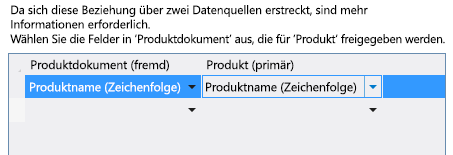

# Zuordnen einer Dokumentbibliothek zu einer EntitätAssociate a document library with an entity
Mit dem Dokumentbibliothek-Feature in SharePoint können Sie mit einzelnen Elementen in einer Liste oder Entität verknüpfte Dokumente erstellen oder hochladen. Sie können beispielsweise eine Dokumentbibliothek zum Speichern von Vertriebsdokumentationen und Produkthandbüchern für jedes Produkt in einer Liste verwenden. In einem Cloud-Geschäfts-Add-In können Sie einer Dokumentbibliothek eine Entität zuordnen, indem Sie eine Beziehung erstellen.By using the document library feature in SharePoint, you can create or upload documents associated with individual items in a list or entity. For example, you might use a document library to store sales literature and product manuals for each product in a list. In a Cloud Business Add-in, you can associate a document library with an entity by creating a relationship.
 

 **Hinweis** Der Name „Apps für SharePoint“ wird in „SharePoint-Add-Ins“ geändert. Während des Übergangszeitraums wird in der Dokumentation und der Benutzeroberfläche einiger SharePoint-Produkte und Visual Studio-Tools möglicherweise weiterhin der Begriff „Apps für SharePoint“ verwendet. Weitere Informationen finden Sie unter [Neuer Name für Office- und SharePoint-Apps](new-name-for-apps-for-sharepoint.md#bk_newname).**Note**  The name "apps for SharePoint" is changing to "SharePoint Add-ins". During the transition, the documentation and the UI of some SharePoint products and Visual Studio tools might still use the term "apps for SharePoint". For details, see  [New name for apps for Office and SharePoint](new-name-for-apps-for-sharepoint.md#bk_newname).
 

## Zuordnen einer DokumentbibliothekAssociating a Document Library

Der Prozess zum Zuordnen einer Dokumentbibliothek umfasst drei Schritte:The process of associating a document library with an entity involves three steps:
 

 

1. Hinzufügen einer SharePoint-Dokumentbibliothek zu Ihrem Projekt als Datenquelle.Add a SharePoint document library to your project as a data source.
    
     **Wichten** Sie müssen zunächst eine Dokumentbibliothek auf Ihrer SharePoint-Website erstellen. Sie muss eine benutzerdefinierte Spalte enthalten, die einem eindeutigen Feld in Ihrer Entität zugeordnet ist.**Important**  You must first create a document library on your SharePoint site. It must contain a custom column that maps to a unique field in your entity.
2. Erstellen einer Beziehung zwischen der Dokumentbibliothek und einer Entität.Create a relationship between the document library and an entity.
    
 
3. Fügen Sie die Dokumentbibliothek zu einem Bildschirm hinzu. Der Prozess unterscheidet sich, je nachdem, ob Sie einen neuen Bildschirm erstellen oder sie zu einem vorhandenen Bildschirm hinzufügen.Add the document library to a screen. The process differs depending on whether you're creating a new screen or adding it to an existing screen.
    
 

### So fügen Sie eine Dokumentbibliothek hinzuTo add a document library

1. Öffnen Sie im **Projektmappen-Explorer** das Kontextmenü des Knotens **Datenquellen**, und klicken Sie dann auf **Datenquelle hinzufügen**.In  **Solution Explorer**, open the shortcut menu for the  **Data Sources** node and choose **Add Data Source**.
    
 
2. Klicken Sie im **Assistenten zum Zuordnen von Datenquellen** auf das **SharePoint**-Symbol und anschließend auf die Schaltfläche **Weiter**.In the  **Attach Data Source Wizard**, choose the  **SharePoint** icon, and then choose the **Next** button.
    
 
3. Geben Sie auf der Seite **Verbindungsinformationen eingeben** im Textfeld **Adresse der SharePoint-Website angeben** die URL Ihrer SharePoint-Entwicklerwebsite an, und klicken Sie dann auf **Weiter**.On the  **Enter Connection Information** page, in the **Specify the SharePoint site address** text box, enter the URL for your SharePoint developer site, and then choose the **Next** button.
    
 
4. Klicken Sie auf der Seite **SharePoint-Elemente auswählen** im linken Bereich auf das Listenelement **Dokumentbibliotheken**, und aktivieren Sie im rechten Bereich das Kontrollkästchen für Ihre Dokumentbibliothek, wie in Abbildung 1 dargestellt.On the  **Choose your SharePoint Items** page, in the left pane, choose the **Document Libraries** list item, and in the right pane, select the checkbox for your document library as shown in Figure 1.
    
    **Abbildung 1. Auswählen der Dokumentbibliothek****Figure 1. Selecting the document library**

 

  
 

    Abbildung 2 zeigt die Dokumentbibliothek auf der SharePoint-Website.Figure 2 shows the document library on the SharePoint site.
    

    **Abbildung 2. Beachten Sie die benutzerdefinierte Spalte „ProductName“****Figure 2. Note the custom ProductName column**

 

  
 

    
     **Wichtig** Die Dokumentbibliothek muss bereits vorhanden sein und eine benutzerdefinierte Spalte enthalten, die einem eindeutigen Feld in Ihrer Entität zugeordnet ist.**Important**  The document library must already exist and must contain a custom column that maps to a unique field in your entity.
5. Geben Sie im Feld **Geben Sie den Namen der Datenquelle an** einen Namen ein, und klicken Sie dann auf die Schaltfläche **Fertig stellen**.In the  **Specify the name of the data source**, enter a name, and then choose the  **Finish** button.
    
 

### So erstellen Sie eine BeziehungTo create a relationship

1. Öffnen Sie im **Projektmappen-Explorer** die Dokumentbibliothek-Entität, und klicken Sie dann auf der Leiste **Perspektive** auf die Registerkarte **Server**.In  **Solution Explorer**, open the document library entity, and then on the  **Perspective** bar, choose the **Server** tab.
    
 
2. Klicken Sie auf der Symbolleiste auf **Beziehung**.On the toolbar, choose  **Relationship**.
    
 
3. Klicken Sie im Dialogfeld **Neue Beziehung hinzufügen** in der Dropdownliste **An** auf die Entität, die Sie zuordnen möchten, wie in Abbildung 3 dargestellt.In the  **Add New Relationship** dialog box, in the **To** dropdown list, choose the entity that you want to associate, as shown in Figure 3.
    
    **Abbildung 3. Erstellen einer Beziehung.****Figure 3. Creating a relationship.**

 

  
 

 

 
4. Klicken Sie in der Dropdownliste **Fremdschlüssel** auf die benutzerdefinierte Spalte aus Ihrer Dokumentbibliothek.In the  **Foreign** key dropdown list, choose the custom column from your document library.
    
 
5. Klicken Sie in der Dropdownliste **Primärschlüssel** auf das Feld aus Ihrer Entität, das der benutzerdefinierten Spalte in der Dokumentbibliothek zugeordnet ist, und klicken Sie dann auf die Schaltfläche **OK**. Für die benutzerdefinierte Spalte „ProductName“ müssen Sie beispielsweise auf das Feld „ProductName“ klicken, wie in Abbildung 4 dargestellt.In the  **Primary** key dropdown list, choose the field from your entity that maps to the custom column in the document library, and then choose the **OK** button. For example, for a ProductName custom column, choose the ProductName field, as shown in Figure 4.
    
    **Abbildung 4. Zusammengehöriger Fremdschlüssel und Primärschlüssel****Figure 4. Related foreign and primary keys**

 

  
 

    
     **Hinweis** Das Feld muss den gleichen Datentyp aufweisen wie das Feld **Fremdschlüssel**.**Note**  The field must be of the same data type as the  **Foreign** key field.

### So fügen Sie eine Dokumentbibliothek zu einer neuen Bildschirmgruppe hinzuTo add a document library to a new screen set

1. Öffnen Sie im **Projektmappen-Explorer** die Entität, die der Dokumentbibliothek zugeordnet ist, und klicken Sie dann auf der Leiste **Perspektive** auf die Registerkarte **HTMLClient**.In  **Solution Explorer**, open the entity that is associated with a document library, and then on the  **Perspective** bar, choose the **HTMLClient** tab.
    
 
2. Klicken Sie auf der Symbolleiste auf **Bildschirm**.On the toolbar, choose  **Screen**.
    
 
3. Geben Sie in dem Dialogfeld **Neuen Bildschirm hinzufügen** im Textfeld **Bildschirmgruppenname** einen Namen für die Bildschirmgruppe ein.In the  **Add New Screen** dialog box, in the **Screen Set Name** text box, enter a name for the screen set.
    
 
4. Klicken Sie in der Liste **Bildschirmdaten** auf Ihre Entität.In the  **Screen Data** list, choose your entity.
    
 
5. Aktivieren Sie in der Liste **Zusätzliche einzuschließende Daten** das Kontrollkästchen für Ihre Dokumentbibliothek, und klicken Sie dann auf die Schaltfläche **OK**.In the  **Additional Data to Include** list, select the checkbox for your document library, and then choose the **OK** button.
    
    Abbildung 5 zeigt eine Bildschirmgruppe für eine Produktentität.Figure 5 shows a screen set for a Product entity.
    

    **Abbildung 5. Produkt-Bildschirmgruppe****Figure 5. Products screen set**

 

  
 

    Der für die Entität erstellte Bildschirm **Ansicht** enthält eine Registerkarte **Dokumente** mit einer Schaltfläche **Dokument hinzufügen**. Die Schaltfläche zeigt ein Popup zum Hinzufügen oder Hochladen von Dokumenten an.The  **View** screen that is created for the entity contains a **Documents** tab with an **Add Document** button. The button displays a Popup for adding or uploading documents.
    
 

### So fügen Sie eine Dokumentbibliothek zu einem vorhandenen Bildschirm hinzuTo add a document library to an existing screen

1. Öffnen Sie im **Projektmappen-Explorer** das Kontextmenü des Bildschirms, den Sie einer Dokumentbibliothek zuordnen möchten, und klicken Sie dann auf **Öffnen**.In  **Solution Explorer**, open the shortcut menu for the screen that you want to associate with a document library and choose  **Open**.
    
 
2. Klicken Sie im Bildschirm-Designer auf den Knoten **Registerkarten**, wie in Abbildung 6 dargestellt, und anschließend auf den Knoten **Registerkarte hinzufügen**.In the screen designer, choose the  **Tabs** node as shown in Figure 6, and then choose the **Add Tab** node.
    
    **Abbildung 6. Der Knoten „Registerkarten“****Figure 6. The Tabs node**

 

  
 

 

 
3. Klicken Sie im Fenster **Eigenschaften** auf die Eigenschaft **Anzeigename**, und geben Sie dann einen aussagekräftigen Namen für die neu hinzugefügte Registerkarte ein, z. B. „Dokumente“.In the  **Properties** window, choose the **Display Name** property and enter a meaningful name for the newly added tab. For example,Documents.
    
 
4. Klicken Sie im linken Bereich des Bildschirm-Designers auf den Link _DocumentLibraryName_ **hinzufügen**, wie in Abbildung 7 dargestellt, dabei ist _DocumentLibraryName_ der Name Ihrer Dokumentbibliothek.In the left pane of the screen designer, choose the  **Add** _DocumentLibraryName_ link as shown in Figure 7, where _DocumentLibraryName_ is the name of your document library.
    
    **Abbildung 7. Der Link „ProductDocuments hinzufügen“****Figure 7. The Add ProductDocuments link**

 

  
 

 

 
5. Klicken Sie im mittleren Bereich auf den Knoten der neuen Registerkarte, erweitern Sie die Liste **Hinzufügen**, und klicken Sie dann auf _DocumentLibraryName_.In the center pane, choose the node for the new tab, expand the  **Add** list, and then choose _DocumentLibraryName_.
    
 
6. Erweitern Sie den Knoten **Befehlszeile** der neuen Registerkarte, wie in Abbildung 8 dargestellt, und klicken Sie dann auf **Hinzufügen**.Expand the  **Command Bar** node for the new tab as shown in Figure 8 and choose **Add**.
    
    **Abbildung 8. Der Knoten „Befehlsleiste“****Figure 8. The Command Bar node**

 

  
 

 

 
7. Akzeptieren Sie im Dialogfeld **Schaltfläche hinzufügen** die Standardauswahlmöglichkeiten, und klicken Sie dann auf die Schaltfläche **OK**.In the  **Add Button** dialog box, accept the default choices and choose the **OK** button.
    
    In Abbildung 9 ist das Dialogfeld **Schaltfläche hinzufügen** mit der Standardmethode, **createOrUploadDocument**, dargestellt.Figure 9 shows the  **Add Button** dialog box with the default method, **createOrUploadDocument**.
    

    **Abbildung 9: Das Dialogfeld „Schaltfläche hinzufügen“****Figure 9. The Add Button dialog box**

 

  
 

 

 
8. Klicken Sie im Fenster **Eigenschaften** auf die Eigenschaft **Anzeigename**, und geben Sie einen aussagekräftigen Namen für die Schaltfläche ein, z.. B. „Dokument hinzufügen“.In the  **Properties** window, choose the **Display Name** property and enter a meaningful name for the button. For example,Add Document.
    
    Der Bildschirm enthält nun eine Registerkarte **Dokumente** mit einer Schaltfläche in der Befehlsleiste. Die Schaltfläche zeigt ein Popup zum Hinzufügen oder Hochladen von Dokumenten an.The screen now contains a  **Documents** tab with a button on the command bar. The button displays a Popup for adding or uploading documents.
    
 

## Zusätzliche RessourcenAdditional resources

-  [Entwickeln von Cloud-Business-Add-InsDevelop cloud business add-ins](develop-cloud-business-add-ins.md)
    
 
-  [Vorfallverwaltung: Lernprogramm für das Cloud-Business-Add-InIncident manager: A cloud business add-in tutorial](incident-manager-a-cloud-business-add-in-tutorial.md)
    
 

