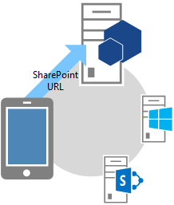
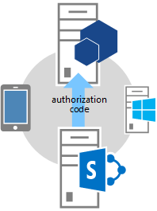
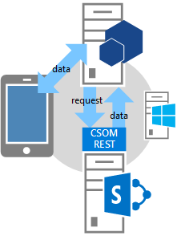

# <a name="authorization-code-oauth-flow-for-sharepoint-add-ins"></a>Autorisierungscode-OAuth-Fluss für SharePoint-Add-Ins
Erfahren Sie mehr über den OAuth-Ablauf für Add-Ins, die dynamisch Zugriff auf SharePoint-Ressourcen anfordern. Außerdem erhalten Sie Informationen zur Verwendung der OAuthAuthorize.aspx-Seite und des SharePoint-Umleitungs-URI.
 

 **Hinweis** Der Name „Apps für SharePoint“ wird in „SharePoint-Add-Ins“ geändert. Während des Übergangszeitraums wird in der Dokumentation und der Benutzeroberfläche einiger SharePoint-Produkte und Visual Studio-Tools möglicherweise weiterhin der Begriff „Apps für SharePoint“ verwendet. Weitere Informationen finden Sie unter [Neuer Name für Office- und SharePoint-Apps](new-name-for-apps-for-sharepoint#bk_newname).
 


## <a name="get-an-overview-of-add-ins-that-request-access-permission-from-sharepoint-on-the-fly"></a>Überblick über Add-Ins, die Zugriffsberechtigungen von SharePoint dynamisch anfordern
<a name="Overview"> </a>


 **Hinweis** In diesem Artikel wird davon ausgegangen, dass Sie mit dem [Erstellen von SharePoint-Add-Ins, die die Autorisierung mit niedriger Vertrauensebene verwenden](creating-sharepoint-add-ins-that-use-low-trust-authorization), und den Konzepten und Prinzipien von OAuth vertraut sind. Weitere Informationen zu OAuth finden Sie unter [OAuth.net](http://oauth.net/) und [Webautorisierungsprotokoll (oauth)](http://datatracker.ietf.org/doc/active/#oauth).
 

In bestimmten Szenarios kann ein Add-In die Berechtigung für den Zugriff auf SharePoint-Ressourcen dynamisch anfordern, das heißt, ein **Add-In kann die Berechtigung für den Zugriff auf SharePoint-Ressourcen im laufenden Betrieb (zur Laufzeit)** statt zum Zeitpunkt der Add-In-Installation anfordern. Diese Art von Add-In muss nicht von SharePoint gestartet werden und noch nicht einmal dort installiert sein. Stattdessen kann es sich dabei beispielsweise um ein systemeigenes Geräte-Add-In, ein von einer beliebigen Website gestartetes Add-In oder ein Office-Add-In handeln, das von einer Office-Anwendung gestartet wird und dynamisch auf SharePoint-Ressourcen zugreift.
 

 

 **Hinweis** Dieser Add-In-Typ kann nur von Benutzern mit Verwaltungsberechtigungen für die Ressourcen ausgeführt werden, auf die das Add-In zugreifen möchte. Wenn ein Add-In beispielsweise nur Leseberechtigung für eine Website anfordert, kann ein Benutzer mit der Berechtigung „Lesen“, aber ohne die Berechtigung „Verwalten“, das Add-In nicht ausführen.
 

Um Aufrufe an SharePoint zu ermöglichen, muss diese Art von Add-In zunächst über das Verkäuferdashboard oder die Seite „appregnew.aspx“ **registriert werden**. Weitere Informationen zum Registrieren von Add-Ins über das Verkäuferdashboard oder die Seite „appregnew.aspx“ finden Sie unter [Registrieren von SharePoint-Add-Ins 2013](register-sharepoint-add-ins-2013).
 

 
Nach dem Registrieren des Add-Ins ist dieses ein  *Sicherheitsprinzipal*  und hat eine Identität, wie Benutzer und Gruppen sie haben. Diese Identität wird alsAdd-In-Prinzipal bezeichnet. Genau wie Benutzer und Gruppen besitzt auch ein Add-In-Prinzipal bestimmte Berechtigungen. Weitere Informationen zu Add-In-Prinzipalen finden Sie unter [Registrieren von SharePoint-Add-Ins 2013](register-sharepoint-add-ins-2013).
 

 
Wenn Sie das Add-In registrieren, erhalten Sie eine Client-ID, einen geheimen Clientschlüssel, eine Add-In-Domäne und einen Umleitungs-URI für den Add-In-Prinzipal. Diese Informationen werden beim Autorisierungsserver, Microsoft Azure Access Control Service (ACS), registriert.
 

 

## <a name="understand-the-oauth-flow-for-add-ins-that-request-permissions-on-the-fly"></a>Grundlegendes zum OAuth-Ablauf für Add-Ins, die Berechtigungen dynamisch anfordern
<a name="Flow"> </a>

In diesem Abschnitt wird der OAuth-Authentifizierungs- und -Autorisierungsablauf für ein SharePoint-Add-In beschrieben, das Berechtigungen dynamisch anfordert. Der Ablauf wird als **Authentifizierungscodefluss** bezeichnet. In der Abfolge wird beschrieben, wie ein Add-In, das nicht von SharePoint gestartet wird, auf Ressourcen in SharePoint zugreifen kann.
 

 

 **Hinweis ** Der Ablauf **umfasst eine Reihe von Interaktionen zwischen dem Add-In, SharePoint, dem Autorisierungsserver (hier ACS) und dem Endbenutzer** während der Laufzeit. Der Ablauf erfordert also entweder SharePoint Online oder eine mit dem Internet verbundene SharePoint-Farm, damit eine Kommunikation mit ACS möglich ist. SharePoint-Farmen, die nicht mit dem Internet verbunden sind, müssen [das besonders vertrauenswürdige Autorisierungssystem](creating-sharepoint-add-ins-that-use-high-trust-authorization) verwenden.
 

Es muss eine Webanwendung oder ein Dienst vorhanden sein, die bzw. der separat von SharePoint gehostet wird. Selbst wenn es sich beim Add-In um ein Geräte-Add-In handelt, muss es über eine Webanwendungs- oder Dienst-URL verfügen, die bei ACS registriert werden kann (siehe oben), selbst wenn die Webkomponente für nichts anderes verwendet wird. Aus Gründen der Einfachheit wird in diesem Artikel davon ausgegangen, dass das Add-In eine Webanwendung namens Contoso.com ist. Die Anwendung verwendet das SharePoint-Clientobjektmodell (CSOM) oder die SharePoint-REST-APIs, um Aufrufe an SharePoint durchzuführen. Wenn die Anwendung erstmals versucht, auf SharePoint zuzugreifen, fordert SharePoint einen Autorisierungscode von ACS an, der an die Contoso.com-Anwendung gesendet werden kann. Die Anwendung verwendet dann den Autorisierungscode, um ein Zugriffstoken von ACS anzufordern. Nachdem das Zugriffstoken abgerufen wurde, schließt die Contoso.com-Anwendung es in alle Anforderungen an SharePoint ein.
 

 

### <a name="see-a-detailed-example-of-the-flow"></a>Hier sehen Sie ein ausführliches Beispiel des Ablaufs
<a name="Fly"> </a>

Nehmen wir an, dass Contoso einen Online-Fotodruckdienst bereitstellt. Ein Benutzer möchte einige Fotos drucken. Der Benutzer möchte es dem Fotodruckdienst von Contoso ermöglichen, auf Fotos in unterschiedlichen Fotobibliotheken zuzugreifen, die der Benutzer auf einer SharePoint Online-Website,  `fabrikam.sharepoint.com`, aufbewahrt, und diese zu drucken.
 

 

 

 
Die Fotodruck-Anwendung ist registriert, verfügt also bereits über eine Client-ID, einen geheimen Clientschlüssel und einen Umleitungs-URI. Der von Contoso bei der Add-In-Registrierung angegebene Umleitungs-URI lautet  `https://contoso.com/RedirectAccept.aspx`. Die Client-ID und der geheime Clientschlüssel befinden sich in der web.config-Datei der Anwendung. Im Folgenden finden Sie ein Beispiel für die web.config-Datei der Anwendung mit Client-ID und geheimem Clientschlüssel.
 

 


```XML
<configuration>
  <appSettings>
    <add key="ClientId" value="c78d058c-7f82-44ca-a077-fba855e14d38 "/>
    <add key="ClientSecret" value="SbALAKghPXTjbBiLQZP+GnbmN+vrgeCMMvptbgk7T6w= "/>

  </appSettings>

</configuration>
```

Im Folgenden sind die Schritte des Authentifizierungscodeablaufs aufgeführt.
 

 

    
 **Tipp** Diese Schritte beziehen sich auf Methoden in der Datei „TokenHelper.cs“ (oder „TokenHelper.vb“). Dieser verwaltete Code ist nicht kompiliert, es gibt dazu also keine Referenzthemen. Die Datei selbst ist jedoch vollständig kommentiert und enthält Beschreibungen aller Klassen, Memberparameter, und Rückgabewerte. Es empfiehlt sich, beim Durchlesen dieser Schritte eine Kopie als Referenz zu öffnen.
 


|**Schritt**||**Beschreibung**|
|:-----|:-----|:-----|
|**1**||**Der Client öffnet eine Anwendung und leitet sie dann an eine SharePoint-Website, um Daten abzurufen. **Ein Benutzer navigiert zu Fotodruck-Website von Contoso; hier gibt die Benutzeroberfläche an, dass der Benutzer Fotos drucken kann, die auf einer beliebigen SharePoint Online-Website gespeichert sind. In diesem Beispiel ist die URL `https://contoso.com/print/home.aspx`. Das Fotodruck-Add-In fordert den Benutzer zur Eingabe der URL der Fotosammlung auf. Der Benutzer gibt eine URL ein, die auf die SharePoint Online-Website verweist: `https://fabrikam.sharepoint.com/`.|
|**2**||**Das Add-In leitet an die Autorisierung-URL der SharePoint-Website um. **Wenn der Benutzer auf die Schaltfläche klickt, um die Fotos abzurufen, leitet das Contoso-Fotodruck-Add-In den Browser zu `https://fabrikam.sharepoint.com/` um. Diese Umleitung ist eine HTTP-302-Umleitungsantwort. Wenn Sie Microsoft .NET verwenden, ist **Response.Redirect** eine von mehreren Methoden, mit der Sie Umleitung in Ihrem Code ausführen können. Mithilfe der Datei „TokenHelper.cs“ (oder .vb) in Ihrem Projekt kann der Code die überladene **GetAuthorizationUrl**-Methode aufrufen (durch Verwenden der Überladung mit drei Argumenten). Diese Methode erstellt die OAuthAuthorize.aspx-Umleitungs-URL für Sie. Alternativ kann Ihr Code die URL manuell erstellen. Wenn Sie beispielsweise beschließen, die **GetAuthorizationUrl**-Methode aufzurufen, um die OAuthAuthorize.aspx-Umleitungs-URL zu erstellen (mithilfe der Datei „TokenHelper.cs“ (oder .vb) in Ihrem Projekt, sieht der Code wie folgt aus: `Response.Redirect(TokenHelper.GetAuthorizationUrl(` `sharePointSiteUrl.ToString(),` `"Web.Read List.Write",` `"https://contoso.com/RedirectAccept.aspx"));`Wenn Sie die Überladung mit drei Parametern der **GetAuthorizationUrl**-Methode in ‚TokenHelper.cs“ (oder .vb) betrachten, sehen Sie, dass der zweite Parameter ein Parameter für den Berechtigungsbereich ist, d. h. eine mit Leerzeichen getrennte Liste von Berechtigungen, die das Add-In-anfordert, im Kurzformat. Weitere Informationen über Berechtigungsbereiche finden Sie unter [Grundlegendes zu Berechtigungsbereichsaliasen und der Verwendung der OAuthAuthorize.aspx-Seite](#Scope). Der dritte Parameter muss der gleiche Umleitungs-URI sein, der beim Registrieren des Add-Ins verwendet wird. Weitere Informationen zur Registrierung finden Sie unter [Registrieren von SharePoint-Add-Ins 2013](register-sharepoint-add-ins-2013). Außerdem sehen Sie, dass die zurückgegebene Zeichenfolge eine URL einschließlich Abfragezeichenfolgeparametern ist. Wenn Sie es vorziehen, können Sie die OAuthAuthorize.aspx-Umleitungs-URL manuell erstellen. Die URL, an die das Fotodruck-Add-In den Benutzer in diesem Fall umleitet, lautet: `https://fabrikam.sharepoint.com/_layouts/15/OAuthAuthorize.aspx?client_id=client_GUID&amp;scope=app_permissions_list&amp;response_type=code&amp;redirect_uri=redirect_uri`Wie das Beispiel zeigt, sendet das Contoso-Fotodruck-Add-In die OAuth-Client-ID und den Umleitungs-URI als Abfragezeichenfolgeparameter an die Fabrikam-Website. Nachfolgend sehen Sie ein Beispiel für die GET-Anforderung mit Beispielwerten für die Abfragezeichenfolge. Zeilenumbrüche wurden zur Verdeutlichung hinzugefügt. Die tatsächliche Ziel-URL ist eine einzelne Zeile. `GET /authcode HTTP/1.1` `Host: fabrikam.sharepoint.com` `/oauthauthorize.aspx` `?client_id= c78d058c-7f82-44ca-a077-fba855e14d38` `&amp;scope=list.read` `&amp;response_type=code` `&amp;redirect_uri= https%3A%2F%2Fcontoso%2Ecom%2Fredirectaccept.aspx` Wenn ein separates Zustimmungs-Popupdialogfeld angezeigt werden soll, können Sie den Abfrageparameter **IsDlg = 1** wie hier dargestellt zum URL-Konstrukt hinzufügen: `/oauthauthorize.aspx?IsDlg=1&amp;client_id= c78d058c-7f82-44ca-a077-fba855e14d38&amp;scope=list.read&amp;response_type=code&amp;redirect_uri= https%3A%2F%2Fcontoso%2Ecom%2Fredirectaccept.aspx`|
|**3**||**SharePoint zeigt die Zustimmungsseite an, damit der Benutzer die Add-Bn-Berechtigungen gewähren kann.**Wenn der Benutzer noch nicht bei der SharePoint Online-Website von Fabrikam angemeldet ist, wird der Benutzer zur Anmeldung aufgefordert. Wenn der Benutzer angemeldet ist, stellt SharePoint eine HTML-Zustimmungsseite dar. Auf der Zustimmungsseite wird der Benutzer aufgefordert, dem Contoso-Fotodruck-Add-In die vom Add-In angeforderten Berechtigungen zu gewähren (oder abzulehnen). In diesem Fall gewährt der Benutzer dem Add-In Lesezugriff auf die Bildbibliothek des Benutzers bei Fabrikam.|
|**4**||**SharePoint fordert einen kurzlebigen Autorisierungscode von ACS an. **Die Fabrikam-SharePoint Online-Website fordert ACS auf, einen kurzlebigen (ca. 5 Minuten) Autorisierungscode zu erstellen, der für diese Kombination von Benutzer und Add-In eindeutig ist. ACS sendet den Autorisierungscode an die Fabrikam-Website.|
|**5**||**Die SharePoint Online-Website leitet an den registrierten Umleitungs-URI der App um und übergibt dabei den Autorisierungscode an das Add-In.**Der Browser wird von der Fabrikam-SharePoint Online-Website über die HTTP-Antwort 302 wieder zu Contoso umgeleitet. Vom URL-Konstrukt für diese Umleitung wird der Umleitungs-URI verwendet, der bei der Registrierung des Fotodruck-Add-Ins angegeben wurde. Darüber hinaus enthält das Konstrukt den Autorisierungscode als Abfragezeichenfolge. Die Umleitungs-URL ist in etwa wie folgt strukturiert: `https://contoso.com/RedirectAccept.aspx?code=<authcode>`|
|**6**||**Das Add-In verwendet den Autorisierungscode, um bei ACS ein Zugriffstoken anzufordern. ACS validiert die Anforderung, macht den Autorisierungscode ungültig und sendet dann Zugriffs- und Aktualisierungstoken an das Add-In.**Contoso ruft den Autorisierungscode aus dem Abfrageparameter ab und fügt ihn dann zusammen mit der Client-ID und dem geheimen Clientschlüssel in eine Anforderung an ACS für ein Zugriffstoken ein. Wenn Sie verwalteten Code und das SharePoint-CSOM, die Datei „TokenHelper.cs“ (oder .vb) verwenden, erfolgt die Anforderung an ACS über die Methode **GetClientContextWithAuthorizationCode**. In diesem Fall sieht der Code in etwa wie folgt aus (wobei `authCode` eine Variable ist, der der Autorisierungscode zugewiesen wurde): `TokenHelper.GetClientContextWithAuthorizationCode(` `"https://fabrikam.sharepoint.com/",` `"00000003-0000-0ff1-ce00-000000000000",` `authCode,` `"1ee82b34-7c1b-471b-b27e-ff272accd564",` `new Uri(Request.Url.GetLeftPart(UriPartial.Path)));` In der Datei „TokenHelper.cs“ (oder .vb) ist der zweite Parameter der **GetClientContextWithAuthorizationCode**-Methode `targetPrincipalName`. Dieser Wert ist in einem Add-In, das auf SharePoint zugreift, immer die Konstante „`00000003-0000-0ff1-ce00-000000000000`“. Wenn Sie die Aufrufhierarchie von **GetClientContextWithAuthorizationCode** verfolgen, sehen Sie auch, dass die Client-ID und der geheime Schlüssel aus der Datei „web.config“ abgerufen werden. ACS empfängt die Anforderung von Contoso und überprüft die Client-ID, den geheimen Clientschlüssel, den Umleitungs-URI und den Autorisierungscode. Sind alle Werte gültig, macht ACS den Autorisierungscode ungültig (dieser kann immer nur einmal verwendet werden) und erstellt ein Aktualisierungs- und ein Zugriffstoken, die an Contoso zurückgegeben werden. Die Contoso-Anwendung kann dieses Zugriffstoken zwischenspeichern, um es in späteren Anforderungen erneut zu verwenden. Standardmäßig sind Zugriffstoken jeweils etwa 12 Stunden lang gültig. Jedes Zugriffstoken gehört zu genau dem Benutzerkonto, das in der ursprünglichen Autorisierungsanforderung angegeben wurde, und gewährt ausschließlich Zugriff auf die Dienste, die in dieser Anforderung aufgeführt sind. Das Add-In muss das Zugriffstoken an einem sicheren Ort speichern. Die Contoso-Anwendung kann auch das Aktualisierungstoken zwischenspeichern. Standardmäßig sind Aktualisierungstoken 6 Monate lang gültig. Das Aktualisierungstoken kann für ein neues Zugriffstoken von ACS eingelöst werden, wann immer das Zugriffstoken abläuft. Weitere Informationen zu Token finden Sie unter [Handhabung von Sicherheitstoken in vom Anbieter gehosteten SharePoint-Add-Ins mit niedriger Vertrauensebene](handle-security-tokens-in-provider-hosted-low-trust-sharepoint-add-ins).|
|**7**||**Das Add-In kann jetzt das Zugriffstoken verwenden, um Daten von der SharePoint-Website anzufordern, die es dem Benutzer anzeigen kann. **Contoso schließt das Zugriffstoken ein, um einen REST-API-Aufruf oder eine CSOM-Aufforderung an SharePoint durchzuführen und übergibt dabei das OAuth-Zugriffstoken im HTTP-**Authorization**-Header. SharePoint gibt die von Contoso angeforderten Informationen zurück. Weitere Informationen zur Durchführung dieser Anforderung finden Sie unter [Handhabung von Sicherheitstoken in vom Anbieter gehosteten SharePoint-Add-Ins mit niedriger Vertrauensebene](handle-security-tokens-in-provider-hosted-low-trust-sharepoint-add-ins).|

## <a name="understand-permission-scope-aliases-and-the-use-of-the-oauthauthorizeaspx-page"></a>Grundlegendes zu Berechtigungsbereichsaliasen und der Verwendung der OAuthAuthorize.aspx-Seite
<a name="Scope"> </a>

In diesem Abschnitt wird davon ausgegangen, dass Sie mit dem Artikel  [Add-In-Berechtigungen in SharePoint](add-in-permissions-in-sharepoint-2013) vertraut sind. In Tabelle 1 sind dieselben URIs für den Add-In-Berechtigungsanforderungsbereich aufgeführt wie in diesem Artikel, mit der Ausnahme, dass die Tabelle über eine zusätzliche Spalte ( **Bereichsalias** ) verfügt und das Recht "FullControl" nicht in der Spalte **Verfügbare Rechte** verfügbar ist, da ein Add-In, das die Berechtigung für den Zugriff auf SharePoint-Ressourcen dynamisch anfordert, keinen Vollzugriff anfordern kann.
 

 
Die in der Spalte **Bereichsalias** aufgeführten Werte sind Kurzversionen der jeweiligen Pendants in der Spalte **Bereichs-URI**. Die Aliase können nur von Add-Ins verwendet werden, die die Berechtigung für den Zugriff auf SharePoint-Ressourcen dynamisch anfordern. (Die Bereichs-URI-Werte werden im Add-In-Manifest von Add-Ins verwendet, die aus SharePoint gestartet werden. Diese Add-Ins fordern Berechtigungen während der Installation an.)
 

 
Die Bereichsaliase kommen nur im Rahmen der Verwendung der OAuthAuthorize.aspx-Umleitungsseite zum Einsatz. Wie in Schritt 2 des im vorherigen Abschnitt beschriebenen OAuth-Ablaufs gezeigt, werden die Aliase, wenn das Add-In verwalteten Code verwendet, beim Aufrufen der Methode **GetAuthorizationUrl** von „TokenHelper.cs“ (oder .vb) in Ihrem Projekt benutzt. Im Folgenden sehen Sie ein weiteres Beispiel:
 

 


```C#
Response.Redirect(TokenHelper.GetAuthorizationUrl(
    sharePointSiteUrl.ToString(), 
    "Web.Read List.Write ", 
    "https://contoso.com/RedirectAccept.aspx "));
```

Der  _scope_-Parameterwert  `Web.Read List.Write` ist ein Beispiel für die Anforderung von Berechtigungen unter Verwendung von Bereichsaliasen. Der _scope_-Parameter ist ein durch Leerzeichen getrennter Satz von Anforderungen für Berechtigungsbereiche und Rechte.
 

 
Wenn Sie keinen verwalteten Code verwenden, werden die Bereichsaliase im Bereichsfeld der Umleitungs-URL verwendet. Beispiel:
 

 
 `https://fabrikam.sharepoint.com/_layout/15/OAuthAuthorize.aspx?client_id=c78d058c-7f82-44ca-a077-fba855e14d38&amp;scope=list.write&amp;response_type=code&amp;redirect_uri=https%3A%2F%2Fcontoso%2Ecom%2Fredirectaccept.aspx`
 

 

 **Hinweis** Eine Beschreibung der Bereiche finden Sie unter [Add-In-Berechtigungen in SharePoint](add-in-permissions-in-sharepoint-2013).
 


**Tabelle 1. Berechtigungsanforderungsbereichs-URIs für SharePoint-Add-Ins und die entsprechenden Aliase**

|**Bereichs-URI**|**Bereichsalias**|**Verfügbare Rechte**|
|:-----|:-----|:-----|
|http://sharepoint/content/sitecollection|Website|Read, Write, Manage|
|http://sharepoint/content/sitecollection/web|Web|Read, Write, Manage|
|http://sharepoint/content/sitecollection/web/list|Auflisten|Read, Write, Manage|
|http://sharepoint/content/tenant|AllSites|Read, Write, Manage|
|http://sharepoint/bcs/connection|Keine (wird derzeit nicht unterstützt)|Lesen|
|http://sharepoint/search|Suche|QueryAsUserIgnoreAppPrincipal|
|http://sharepoint/projectserver|ProjectAdmin |Verwalten|
|http://sharepoint/projectserver/projects|Projekte|Read, Write|
|http://sharepoint/projectserver/projects/project|Project|Read, Write|
|http://sharepoint/projectserver/enterpriseresources|ProjectResources|Read, Write|
|http://sharepoint/projectserver/statusing|ProjectStatusing|SubmitStatus|
|http://sharepoint/projectserver/reporting|ProjectReporting|Lesen|
|http://sharepoint/projectserver/workflow|ProjectWorkflow|Elevate|
|http://sharepoint/social/tenant|AllProfiles|Read, Write, Manage|
|http://sharepoint/social/core|Sozial|Read, Write, Manage|
|http://sharepoint/social/microfeed|MicroFeed|Read, Write, Manage|
|http://sharepoint/taxonomy|TermStore|Read, Write|

## <a name="learn-how-to-use-a-redirect-uri-and-see-a-sample-redirect-page"></a>Verwenden eines Umleitungs-URI und ein Beispiel für eine Umleitungsseite
<a name="RedirectURI"> </a>


 

 
Der **Umleitungs-URI**, der von Add-Ins verwendet wird, die Berechtigungen dynamisch anfordern**, ist der URI, an den SharePoint den Browser nach Gewährung der Zustimmung weiterleitet** (mit dem Autorisierungscode als Abfrageparameter). In Schritt 2 der Ablaufbeschreibung weiter oben finden Sie ein Beispiel, in dem der URI in einem Aufruf der Methode **GetAuthorizationUrl** hartcodiert ist. Alternativ kann ein ASP.NET-Add-In den Umleitungs-URI auch in der Datei „web.config“ speichern, wie im folgenden Beispiel gezeigt:
 

 


```XML
<configuration>
  <appSettings>
    <add key="RedirectUri" value="https://contoso.com/RedirectAccept.aspx" />
  </appSettings>
<configuration>
```

Der Wert kann mit einem Aufruf von `WebConfigurationManager.AppSettings.Get("RedirectUri")` abgerufen werden.
 

 
Der **Endpunkt am Umleitungs-URI erhält den Autorisierungscode vom Abfrageparameter und verwendet ihn, um ein Zugriffstoken abzurufen**, mit dem dann auf SharePoint zugegriffen werden kann. Normalerweise ist der Endpunkt dieselbe Seite oder Controllermethode oder Webmethode, die ursprünglich versucht hat, auf SharePoint zuzugreifen. Es kann sich jedoch auch um eine Seite oder Methode handeln, die nur das Autorisierungstoken erhält und dann an eine andere Seite oder Methode umleitet. Die spezielle Seite oder Methode könnte das Autorisierungstoken übergeben oder zwischenspeichern. (Es hat eine Gültigkeitsdauer von rund 5 Minuten.) Alternativ kann sie das Autorisierungstoken verwenden, um ein Zugriffstoken abzurufen, das dann zwischengespeichert wird.
 

 
Im Folgenden finden Sie ein Beispiel für den Code hinter einer solchen Seite in einer ASP.NET-Anwendung. Beachten Sie Folgendes zu diesem Code:
 

 

- Er verwendet die Datei TokenHelper.cs, die von den Office-Entwicklertools für Visual Studio generiert wird.
    
 
- Der Code geht davon aus, dass es einen "Code"-Abfrageparameter gibt, der einen Autorisierungscode enthält. Das ist sicher, da die Seite nur von SharePoint aufgerufen wird, und nur dann, wenn ein Autorisierungscode weitergegeben wird.
    
 
- Er verwendet das CSOM-Clientkontextobjekt, um auf SharePoint zuzugreifen, könnte dieses Objekt aber auch einfach auf dem Server zwischengespeichert und an eine andere Seite weitergeleitet haben.
    
 
- Die Methode **GetClientContextWithAuthorizationCode** verwendet den Autorisierungscode, um einen Zugriffscode abzurufen. Dann erstellt sie ein SharePoint-Clientkontextobjekt und ändert den Handler des Objekts für das Ereignis **ExecutingWebRequest** so, dass der Handler das Zugriffstoken in alle Anforderungen an SharePoint einschließt. Das Zugriffstoken wird tatsächlich im Objekt zwischengespeichert.
    
 
- Die Methode **GetClientContextWithAuthorizationCode** sendet die Umleitungs-URL im `rUrl`-Parameter zurück an ACS. ACS verwendet sie jedoch als eine Form der Identifikation, falls der Autorisierungscode gestohlen wurde. ACS verwendet sie nicht, um eine erneute Umleitung durchzuführen, damit dieser Code keine Umleitungsendlosschleife an sich selbst durchführt.
    
 
- Der Code sieht keine Methode für den Umgang mit einem abgelaufenen Zugriffstoken vor. Nachdem das Clientkontextobjekt erstellt wurde, verwendet es weiterhin dasselbe Zugriffstoken. Das Aktualisierungstoken verwendet es überhaupt nicht. Dies ist eine angemessene Strategie für Add-Ins, die nur in Sitzungen verwendet werden, die kürzer als die Gültigkeitsdauer eines Zugriffstokens andauern.
    
 
Ein komplexeres Beispiel zur Verwendung des Aktualisierungstoken zum Abrufen eines neuen Zugriffstokens finden Sie im nächsten Abschnitt.
 

 


```C#
public partial class RedirectAccept : System.Web.UI.Page
{
    protected void Page_Load(object sender, EventArgs e)
    {
        string authCode = Request.QueryString["code"];
        Uri rUri = new Uri("https://contoso.com/RedirectAccept.aspx");

        using (ClientContext context = TokenHelper.GetClientContextWithAuthorizationCode(
            "https://fabrikam.sharepoint.com/", 
            "00000003-0000-0ff1-ce00-000000000000",
            authCode,
            "1ee82b34-7c1b-471b-b27e-ff272accd564".
            rUri))
       {
           context.Load(context.Web);
           context.ExecuteQuery();

           Response.Write("<p>" + context.Web.Title + "</p>");
       }
    }
}

```


## <a name="get-sample-code-behind-for-a-page-that-accesses-sharepoint"></a>Zugrunde liegender Beispielcode für eine Seite, die auf SharePoint zugreift
<a name="Default"> </a>

Im Folgenden sehen Sie den Code, der einer Default.aspx-Seite zugrunde liegt. Diese Seite geht von einem Szenario aus, in dem die Default-Seite die Startseite für das Add-In und außerdem die registrierte Umleitungs-URL für das Add-In ist. Beachten Sie Folgendes zu diesem Code:
 

 

- Die Methode **Page_Load** überprüft zunächst, ob in der Abfragezeichenfolge ein Autorisierungscode vorhanden ist. Das ist der Fall, wenn der Browser von SharePoint zu der Seite umgeleitet wurde. Wenn einer vorhanden ist, verwendet der Code ihn, um ein neues Aktualisierungstoken abzurufen, das in einem dauerhaften Cache zwischengespeichert wird, der über Sitzungen hinweg bestehen bleibt.
    
 
- Die Methode überprüft dann, ob ein Aktualisierungstoken im Cache vorhanden ist. 
    
      - Wenn keins vorhanden ist, ruft die Methode eins ab, indem sie SharePoint mitteilt, welche Berechtigungen sie benötigt (Schreibberechtigungen im Webbereich) und einen Autorisierungscode bei SharePoint anfordert. Der Benutzer wird aufgefordert, die Berechtigung zu gewähren. Wenn sie gewährt wird, ruft SharePoint den Autorisierungscode von ACS ab und sendet ihn in einer Umleitung als Abfrageparameter auf dieselbe Seite zurück.
    
 
  - Wenn ein zwischengespeichertes Aktualisierungstoken vorhanden ist, verwendet die Methode dieses, um ein Zugriffstoken direkt von ACS abzurufen. Wie in dem Beispiel am Ende des vorstehenden Abschnitts in diesem Artikel wird das Zugriffstoken verwendet, um ein SharePoint-Clientkontextobjekt zu erstellen. Die Verwendung eines zwischengespeicherten Aktualisierungstokens zum Abrufen eines Zugriffstokens direkt von ACS vermeidet den zusätzlichen Netzwerkaufruf an SharePoint beim Sitzungsstart, sodass Benutzer das Add-In innerhalb der Gültigkeitsdauer des zwischengespeicherten Aktualisierungstokens schneller starten können.
    
 
- Wie im Beispiel am Ende des vorstehenden Abschnitts sieht dieser Code keine Methode für den Umgang mit einem abgelaufenen Zugriffstoken vor. Nachdem das Clientkontextobjekt erstellt wurde, verwendet es weiterhin dasselbe Zugriffstoken. Eine Möglichkeit, sich vor einem abgelaufenen Zugriffstoken zu schützen, besteht darin, das Zugriffstoken zusätzlich zum Aktualisierungstoken zwischenzuspeichern. In diesem Fall würden Sie den Code unten so ändern, dass er die Methode **GetAccessToken** nur aufruft, wenn sich kein nicht abgelaufenes Zugriffstoken im Cache befindet. Auch wenn es zulässig ist, das Aktualisierungstoken auf dem Client zwischenzuspeichern, beispielsweise in einem Cookie, sollte das Zugriffstoken aus Sicherheitsgründen nur in einem serverseitigen Cache gespeichert werden. Das Aktualisierungstoken ist verschlüsselt und kann nur von ACS entschlüsselt werden. Das Zugriffstoken ist jedoch kaum codiert (mit Base64-Codierung) und kann leicht durch einen Man-in-the-Middle-Angriff decodiert werden.
    
 
- Die in diesem Code referenzierte **TokenCache**-Klasse ist unten definiert.
    
 

```C#
using System;
using System.Collections.Generic;
using System.Linq;
using System.Web;
using System.Web.UI;
using System.Web.UI.WebControls;
using Microsoft.SharePoint.Samples;
using Microsoft.SharePoint.Client;

namespace DynamicAppPermissionRequest
{
    public partial class Default : System.Web.UI.Page
    {
        protected void Page_Load(object sender, EventArgs e)
        {
            Uri sharePointSiteUrl = new Uri("https://fabrikam.sharpoint.com/print/");

            if (Request.QueryString["code"] != null)
            {
                TokenCache.UpdateCacheWithCode(Request, Response, sharePointSiteUrl);
            }

            if (!TokenCache.IsTokenInCache(Request.Cookies))
            {
                Response.Redirect(TokenHelper.GetAuthorizationUrl(sharePointSiteUrl.ToString(), 
                                                                  "Web.Write"));
            }
            else
            {
                string refreshToken = TokenCache.GetCachedRefreshToken(Request.Cookies);
                string accessToken = 
                TokenHelper.GetAccessToken(
                           refreshToken, 
                           "00000003-0000-0ff1-ce00-000000000000", 
                           sharePointSiteUrl.Authority, 
                           TokenHelper.GetRealmFromTargetUrl(sharePointSiteUrl)).AccessToken;

                using (ClientContext context = 
                       TokenHelper.GetClientContextWithAccessToken(sharePointSiteUrl.ToString(), 
                                                                   accessToken))
                {
                    context.Load(context.Web);
                    context.ExecuteQuery();

                    Response.Write("<p>" + context.Web.Title + "</p>");
                }
            }
        }
    }
}
```

Im Folgenden sehen Sie ein Codebeispiel für ein Tokencachemodul, das vom vorherigen Beispiel aufgerufen wird. Dabei werden Cookies als Cache verwendet. Es gibt weitere Cacheoptionen. Weitere Informationen finden Sie unter  [Handhabung von Sicherheitstoken in vom Anbieter gehosteten Add-Ins für SharePoint mit niedriger Vertrauensebene](handle-security-tokens-in-provider-hosted-low-trust-sharepoint-add-ins).
 

 


```C#
using System;
using System.Collections.Generic;
using System.Linq;
using System.Web;
using Microsoft.SharePoint.Samples;

namespace DynamicAppPermissionRequest
{
    public static class TokenCache
    {
        private const string REFRESH_TOKEN_COOKIE_NAME = "RefreshToken";

        public static void UpdateCacheWithCode(HttpRequest request, 
                                               HttpResponse response, 
                                               Uri targetUri)
        {
            string refreshToken = 
                TokenHelper.GetAccessToken(
                    request.QueryString["code"], 
                    "00000003-0000-0ff1-ce00-000000000000", 
                    targetUri.Authority, 
                    TokenHelper.GetRealmFromTargetUrl(targetUri), 
                    new Uri(request.Url.GetLeftPart(UriPartial.Path)))
                   .RefreshToken;
            SetRefreshTokenCookie(response.Cookies, refreshToken);
            SetRefreshTokenCookie(request.Cookies, refreshToken);
        }

        internal static string GetCachedRefreshToken(HttpCookieCollection requestCookies)
        {
            return GetRefreshTokenFromCookie(requestCookies);
        }

        internal static bool IsTokenInCache(HttpCookieCollection requestCookies)
        {
            return requestCookies[REFRESH_TOKEN_COOKIE_NAME] != null;
        }

        private static string GetRefreshTokenFromCookie(HttpCookieCollection cookies)
        {
            if (cookies[REFRESH_TOKEN_COOKIE_NAME] != null)
            {
                return cookies[REFRESH_TOKEN_COOKIE_NAME].Value;
            }
            else
            {
                return null;
            }
        }

        private static void SetRefreshTokenCookie(HttpCookieCollection cookies, 
                                                  string refreshToken)
        {
            if (cookies[REFRESH_TOKEN_COOKIE_NAME] != null)
            {
                cookies[REFRESH_TOKEN_COOKIE_NAME].Value = refreshToken;
            }
            else
            {
                HttpCookie cookie = new HttpCookie(REFRESH_TOKEN_COOKIE_NAME, 
                                                   refreshToken);
                cookie.Expires = DateTime.Now.AddDays(30);
                cookies.Add(cookie);
            }
        }
    }
}

```


## <a name="additional-resources"></a>Zusätzliche Ressourcen
<a name="AR"> </a>


-  [Autorisierung und Authentifizierung von SharePoint-Add-Ins](authorization-and-authentication-of-sharepoint-add-ins)
    
 
-  [Erstellen von SharePoint-Add-Ins, die die Autorisierung mit niedriger Vertrauensebene verwenden](creating-sharepoint-add-ins-that-use-low-trust-authorization)
    
 
-  [SharePoint-Add-Ins](sharepoint-add-ins)
    
 
-  [Einrichten einer lokalen Entwicklungsumgebung für SharePoint-Add-Ins](set-up-an-on-premises-development-environment-for-sharepoint-add-ins)
    
 
-  [Erste Schritte beim Erstellen von von einem Anbieter gehosteten SharePoint-Add-Ins](get-started-creating-provider-hosted-sharepoint-add-ins)
    
 
