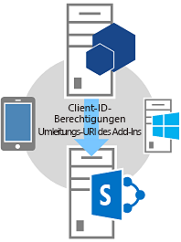
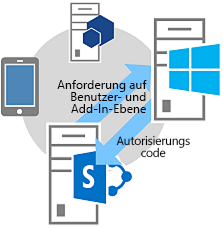

# <a name="authorization-code-oauth-flow-for-sharepoint-add-ins"></a><span data-ttu-id="d8d63-102">Autorisierungscode-OAuth-Fluss für SharePoint-Add-Ins</span><span class="sxs-lookup"><span data-stu-id="d8d63-102">Authorization Code OAuth flow for SharePoint Add-ins</span></span>
<span data-ttu-id="d8d63-103">Erfahren Sie mehr über den OAuth-Ablauf für Add-Ins, die dynamisch Zugriff auf SharePoint-Ressourcen anfordern. Außerdem erhalten Sie Informationen zur Verwendung der OAuthAuthorize.aspx-Seite und des SharePoint-Umleitungs-URI.</span><span class="sxs-lookup"><span data-stu-id="d8d63-103">Learn the OAuth flow for add-ins that request permission to access SharePoint resources on the fly, and how to use the OAuthAuthorize.aspx page and the SharePoint redirect URI.</span></span>
 

 <span data-ttu-id="d8d63-p101">**Hinweis** Der Name „Apps für SharePoint“ wird in „SharePoint-Add-Ins“ geändert. Während des Übergangszeitraums wird in der Dokumentation und der Benutzeroberfläche einiger SharePoint-Produkte und Visual Studio-Tools möglicherweise weiterhin der Begriff „Apps für SharePoint“ verwendet. Weitere Informationen finden Sie unter [Neuer Name für Office- und SharePoint-Apps](new-name-for-apps-for-sharepoint.md#bk_newname).</span><span class="sxs-lookup"><span data-stu-id="d8d63-p101">**Note**  The name "apps for SharePoint" is changing to "SharePoint Add-ins". During the transition, the documentation and the UI of some SharePoint products and Visual Studio tools might still use the term "apps for SharePoint". For details, see  [New name for apps for Office and SharePoint](new-name-for-apps-for-sharepoint.md#bk_newname).</span></span>
 


## <a name="get-an-overview-of-add-ins-that-request-access-permission-from-sharepoint-on-the-fly"></a><span data-ttu-id="d8d63-107">Überblick über Add-Ins, die Zugriffsberechtigungen von SharePoint dynamisch anfordern</span><span class="sxs-lookup"><span data-stu-id="d8d63-107">Get an overview of add-ins that request access permission from SharePoint on the fly</span></span>
<span data-ttu-id="d8d63-108"><a name="Overview"> </a></span><span class="sxs-lookup"><span data-stu-id="d8d63-108"><a name="Overview"> </a></span></span>


 <span data-ttu-id="d8d63-p102">**Hinweis** In diesem Artikel wird davon ausgegangen, dass Sie mit dem [Erstellen von SharePoint-Add-Ins, die die Autorisierung mit niedriger Vertrauensebene verwenden](creating-sharepoint-add-ins-that-use-low-trust-authorization.md), und den Konzepten und Prinzipien von OAuth vertraut sind. Weitere Informationen zu OAuth finden Sie unter [OAuth.net](http://oauth.net/) und [Webautorisierungsprotokoll (oauth)](http://datatracker.ietf.org/doc/active/#oauth).</span><span class="sxs-lookup"><span data-stu-id="d8d63-p102">**Note**  This article assumes that you are familiar with  [Creating SharePoint Add-ins that use low-trust authorization](creating-sharepoint-add-ins-that-use-low-trust-authorization.md) and with the concepts and principles behind OAuth. For more information about OAuth, see [OAuth.net](http://oauth.net/) and [Web Authorization Protocol (oauth)](http://datatracker.ietf.org/doc/active/#oauth).</span></span>
 

<span data-ttu-id="d8d63-p103">In bestimmten Szenarios kann ein Add-In die Berechtigung für den Zugriff auf SharePoint-Ressourcen dynamisch anfordern, das heißt, ein **Add-In kann die Berechtigung für den Zugriff auf SharePoint-Ressourcen im laufenden Betrieb (zur Laufzeit)** statt zum Zeitpunkt der Add-In-Installation anfordern. Diese Art von Add-In muss nicht von SharePoint gestartet werden und noch nicht einmal dort installiert sein. Stattdessen kann es sich dabei beispielsweise um ein systemeigenes Geräte-Add-In, ein von einer beliebigen Website gestartetes Add-In oder ein Office-Add-In handeln, das von einer Office-Anwendung gestartet wird und dynamisch auf SharePoint-Ressourcen zugreift.</span><span class="sxs-lookup"><span data-stu-id="d8d63-p103">In some scenarios, an add-in can request permission to access SharePoint resources on the fly; that is, an  **add-in can request permission to access SharePoint resources dynamically at runtime**, instead of at add-in installation time. This type of add-in does not have to be launched from, or even installed on, SharePoint. For example, it could be native device add-in, an add-in that is launched from any website, or an Office Add-in launched from an Office application that wants to access resources on SharePoint on the fly.</span></span>
 

 

 <span data-ttu-id="d8d63-p104">**Hinweis** Dieser Add-In-Typ kann nur von Benutzern mit Verwaltungsberechtigungen für die Ressourcen ausgeführt werden, auf die das Add-In zugreifen möchte. Wenn ein Add-In beispielsweise nur Leseberechtigung für eine Website anfordert, kann ein Benutzer mit der Berechtigung „Lesen“, aber ohne die Berechtigung „Verwalten“, das Add-In nicht ausführen.</span><span class="sxs-lookup"><span data-stu-id="d8d63-p104">**Note**  This type of add-in can only be run by users who have Manage permissions to the resources the add-in wants to access. For example, if an add-in requests only Read permission to a website, a user who has Read, but not Manage, rights to the website cannot run the add-in.</span></span>
 

<span data-ttu-id="d8d63-p105">Um Aufrufe an SharePoint zu ermöglichen, muss diese Art von Add-In zunächst über das Verkäuferdashboard oder die Seite „appregnew.aspx“ **registriert werden**. Weitere Informationen zum Registrieren von Add-Ins über das Verkäuferdashboard oder die Seite „appregnew.aspx“ finden Sie unter [Registrieren von SharePoint-Add-Ins 2013](register-sharepoint-add-ins.md).</span><span class="sxs-lookup"><span data-stu-id="d8d63-p105">To be able to call into SharePoint, this type of  **add-in must first be registered** through the Seller Dashboard or the appregnew.aspx page. For more information about registering add-ins via the Seller Dashboard or appregnew.aspx, see [Register SharePoint Add-ins 2013](register-sharepoint-add-ins.md).</span></span>
 

 
<span data-ttu-id="d8d63-p106">Nach dem Registrieren des Add-Ins ist dieses ein  *Sicherheitsprinzipal*  und hat eine Identität, wie Benutzer und Gruppen sie haben. Diese Identität wird alsAdd-In-Prinzipal bezeichnet. Genau wie Benutzer und Gruppen besitzt auch ein Add-In-Prinzipal bestimmte Berechtigungen. Weitere Informationen zu Add-In-Prinzipalen finden Sie unter [Registrieren von SharePoint-Add-Ins 2013](register-sharepoint-add-ins.md).</span><span class="sxs-lookup"><span data-stu-id="d8d63-p106">After you've registered your add-in, it is a  *security principal*  and has an identity just as users and groups do. This identity is referred to as anadd-in principal. Like users and groups, an add-in principal has certain permissions. For more information about add-in principals, see  [Register SharePoint Add-ins 2013](register-sharepoint-add-ins.md).</span></span>
 

 
<span data-ttu-id="d8d63-p107">Wenn Sie das Add-In registrieren, erhalten Sie eine Client-ID, einen geheimen Clientschlüssel, eine Add-In-Domäne und einen Umleitungs-URI für den Add-In-Prinzipal. Diese Informationen werden beim Autorisierungsserver, Microsoft Azure Access Control Service (ACS), registriert.</span><span class="sxs-lookup"><span data-stu-id="d8d63-p107">When you register the add-in, you'll get a client id, client secret, add-in domain, and redirect URI for the add-in principal. This information is registered with the authorization server, Microsoft Azure Access Control Service (ACS).</span></span>
 

 

## <a name="understand-the-oauth-flow-for-add-ins-that-request-permissions-on-the-fly"></a><span data-ttu-id="d8d63-124">Grundlegendes zum OAuth-Ablauf für Add-Ins, die Berechtigungen dynamisch anfordern</span><span class="sxs-lookup"><span data-stu-id="d8d63-124">Understand the OAuth flow for add-ins that request permissions on the fly</span></span>
<span data-ttu-id="d8d63-125"><a name="Flow"> </a></span><span class="sxs-lookup"><span data-stu-id="d8d63-125"><a name="Flow"> </a></span></span>

<span data-ttu-id="d8d63-p108">In diesem Abschnitt wird der OAuth-Authentifizierungs- und -Autorisierungsablauf für ein SharePoint-Add-In beschrieben, das Berechtigungen dynamisch anfordert. Der Ablauf wird als **Authentifizierungscodefluss** bezeichnet. In der Abfolge wird beschrieben, wie ein Add-In, das nicht von SharePoint gestartet wird, auf Ressourcen in SharePoint zugreifen kann.</span><span class="sxs-lookup"><span data-stu-id="d8d63-p108">This section summarizes the OAuth authentication and authorization flow for a SharePoint add-in requesting permissions on the fly. The flow is called  **the Authentication Code flow**. The sequence describes how an add-in that is not launched from within SharePoint can access resources in SharePoint.</span></span>
 

 

 <span data-ttu-id="d8d63-p109">**Hinweis ** Der Ablauf **umfasst eine Reihe von Interaktionen zwischen dem Add-In, SharePoint, dem Autorisierungsserver (hier ACS) und dem Endbenutzer** während der Laufzeit. Der Ablauf erfordert also entweder SharePoint Online oder eine mit dem Internet verbundene SharePoint-Farm, damit eine Kommunikation mit ACS möglich ist. SharePoint-Farmen, die nicht mit dem Internet verbunden sind, müssen [das besonders vertrauenswürdige Autorisierungssystem](creating-sharepoint-add-ins-that-use-high-trust-authorization.md) verwenden.</span><span class="sxs-lookup"><span data-stu-id="d8d63-p109">**Note**  The flow  **involves a series of interactions between your add-in, SharePoint, the authorization server (which is ACS), and the end user** at runtime. So, the flow requires either SharePoint Online or a SharePoint farm that is connected to the Internet so it can communicate with ACS. SharePoint farms that are not connected to the Internet must use [the high-trust authorization system](creating-sharepoint-add-ins-that-use-high-trust-authorization.md).</span></span>
 

<span data-ttu-id="d8d63-p110">Es muss eine Webanwendung oder ein Dienst vorhanden sein, die bzw. der separat von SharePoint gehostet wird. Selbst wenn es sich beim Add-In um ein Geräte-Add-In handelt, muss es über eine Webanwendungs- oder Dienst-URL verfügen, die bei ACS registriert werden kann (siehe oben), selbst wenn die Webkomponente für nichts anderes verwendet wird. Aus Gründen der Einfachheit wird in diesem Artikel davon ausgegangen, dass das Add-In eine Webanwendung namens Contoso.com ist. Die Anwendung verwendet das SharePoint-Clientobjektmodell (CSOM) oder die SharePoint-REST-APIs, um Aufrufe an SharePoint durchzuführen. Wenn die Anwendung erstmals versucht, auf SharePoint zuzugreifen, fordert SharePoint einen Autorisierungscode von ACS an, der an die Contoso.com-Anwendung gesendet werden kann. Die Anwendung verwendet dann den Autorisierungscode, um ein Zugriffstoken von ACS anzufordern. Nachdem das Zugriffstoken abgerufen wurde, schließt die Contoso.com-Anwendung es in alle Anforderungen an SharePoint ein.</span><span class="sxs-lookup"><span data-stu-id="d8d63-p110">There has to be a web application or service that is hosted separately from SharePoint. Even if the add-in is a device add-in, it has to have a web application or service URL that can be registered with ACS (see above), even if the web component is used for nothing else. For simplicity, this article will assume that the add-in is a web application called Contoso.com. The application uses the SharePoint client object model (CSOM) or the SharePoint REST APIs to make calls to SharePoint. When the application first attempts to access SharePoint, SharePoint requests an authorization code from ACS that it can send to the Contoso.com application. The application then uses the authorization code to request an access token from the ACS. Once it has the access token, the Contoso.com application includes it in all its requests to SharePoint.</span></span>
 

 

### <a name="see-a-detailed-example-of-the-flow"></a><span data-ttu-id="d8d63-138">Hier sehen Sie ein ausführliches Beispiel des Ablaufs</span><span class="sxs-lookup"><span data-stu-id="d8d63-138">See a detailed example of the flow</span></span>
<span data-ttu-id="d8d63-139"><a name="Fly"> </a></span><span class="sxs-lookup"><span data-stu-id="d8d63-139"><a name="Fly"> </a></span></span>

<span data-ttu-id="d8d63-p111">Nehmen wir an, dass Contoso einen Online-Fotodruckdienst bereitstellt. Ein Benutzer möchte einige Fotos drucken. Der Benutzer möchte es dem Fotodruckdienst von Contoso ermöglichen, auf Fotos in unterschiedlichen Fotobibliotheken zuzugreifen, die der Benutzer auf einer SharePoint Online-Website,  `fabrikam.sharepoint.com`, aufbewahrt, und diese zu drucken.</span><span class="sxs-lookup"><span data-stu-id="d8d63-p111">Suppose that Contoso provides a photo-printing service online. A user wants to print some photos. The user wants to give consent to a Contoso photo-printing service to access and print photos from a set of photo libraries that the user keeps on an SharePoint Online site,  `fabrikam.sharepoint.com`.</span></span>
 

 

 

 
<span data-ttu-id="d8d63-p112">Die Fotodruck-Anwendung ist registriert, verfügt also bereits über eine Client-ID, einen geheimen Clientschlüssel und einen Umleitungs-URI. Der von Contoso bei der Add-In-Registrierung angegebene Umleitungs-URI lautet  `https://contoso.com/RedirectAccept.aspx`. Die Client-ID und der geheime Clientschlüssel befinden sich in der web.config-Datei der Anwendung. Im Folgenden finden Sie ein Beispiel für die web.config-Datei der Anwendung mit Client-ID und geheimem Clientschlüssel.</span><span class="sxs-lookup"><span data-stu-id="d8d63-p112">The photo-printing application is registered, so, it has a client id, client secret, redirect URI. The redirect URI that Contoso provided when it registered the add-in is  `https://contoso.com/RedirectAccept.aspx`. The client id and client secret information are stored included in the photo-printing application's web.config file. The following is an example of how the client id and client secret are entered in the web.config file.</span></span>
 

 


```XML
<configuration>
  <appSettings>
    <add key="ClientId" value="c78d058c-7f82-44ca-a077-fba855e14d38 "/>
    <add key="ClientSecret" value="SbALAKghPXTjbBiLQZP+GnbmN+vrgeCMMvptbgk7T6w= "/>

  </appSettings>

</configuration>
```

<span data-ttu-id="d8d63-148">Im Folgenden sind die Schritte des Authentifizierungscodeablaufs aufgeführt.</span><span class="sxs-lookup"><span data-stu-id="d8d63-148">The following are the steps in the Authentication Code Flow.</span></span>
 

 

    
 <span data-ttu-id="d8d63-p113">**Tipp** Diese Schritte beziehen sich auf Methoden in der Datei „TokenHelper.cs“ (oder „TokenHelper.vb“). Dieser verwaltete Code ist nicht kompiliert, es gibt dazu also keine Referenzthemen. Die Datei selbst ist jedoch vollständig kommentiert und enthält Beschreibungen aller Klassen, Memberparameter, und Rückgabewerte. Es empfiehlt sich, beim Durchlesen dieser Schritte eine Kopie als Referenz zu öffnen.</span><span class="sxs-lookup"><span data-stu-id="d8d63-p113">**Tip**  These steps refer to methods in the TokenHelper.cs (or .vb) file. This managed code is not compiled, so there are no reference topics for it. However, the file itself is fully commented with descriptions of every class, member parameter, and return value. Consider having a copy of it open to refer to as you read these steps.</span></span>
 


|<span data-ttu-id="d8d63-153">**Schritt**</span><span class="sxs-lookup"><span data-stu-id="d8d63-153">**Step**</span></span>||<span data-ttu-id="d8d63-154">**Beschreibung**</span><span class="sxs-lookup"><span data-stu-id="d8d63-154">**Description**</span></span>|
|:-----|:-----|:-----|
|<span data-ttu-id="d8d63-155">**1**</span><span class="sxs-lookup"><span data-stu-id="d8d63-155">**1**</span></span>||<span data-ttu-id="d8d63-p114">**Der Client öffnet eine Anwendung und leitet sie dann an eine SharePoint-Website, um Daten abzurufen. **Ein Benutzer navigiert zu Fotodruck-Website von Contoso; hier gibt die Benutzeroberfläche an, dass der Benutzer Fotos drucken kann, die auf einer beliebigen SharePoint Online-Website gespeichert sind. In diesem Beispiel ist die URL `https://contoso.com/print/home.aspx`. Das Fotodruck-Add-In fordert den Benutzer zur Eingabe der URL der Fotosammlung auf. Der Benutzer gibt eine URL ein, die auf die SharePoint Online-Website verweist: `https://fabrikam.sharepoint.com/`.</span><span class="sxs-lookup"><span data-stu-id="d8d63-p114">**Client opens an application and then directs it to a SharePoint site for data.**A user browses to the Contoso photo-printing website, where the UI indicates that the user can print photos that are kept in any SharePoint Online site. Inn this example the URL is  `https://contoso.com/print/home.aspx`.The photo-printing add-in asks the user to enter the URL of the photo collection. The user enters a URL pointing to the SharePoint Online site:  `https://fabrikam.sharepoint.com/`.</span></span>|
|<span data-ttu-id="d8d63-160">**2**</span><span class="sxs-lookup"><span data-stu-id="d8d63-160">**2**</span></span>||<span data-ttu-id="d8d63-p115">**Das Add-In leitet an die Autorisierung-URL der SharePoint-Website um. **Wenn der Benutzer auf die Schaltfläche klickt, um die Fotos abzurufen, leitet das Contoso-Fotodruck-Add-In den Browser zu `https://fabrikam.sharepoint.com/` um. Diese Umleitung ist eine HTTP-302-Umleitungsantwort. Wenn Sie Microsoft .NET verwenden, ist **Response.Redirect** eine von mehreren Methoden, mit der Sie Umleitung in Ihrem Code ausführen können. Mithilfe der Datei „TokenHelper.cs“ (oder .vb) in Ihrem Projekt kann der Code die überladene **GetAuthorizationUrl**-Methode aufrufen (durch Verwenden der Überladung mit drei Argumenten). Diese Methode erstellt die OAuthAuthorize.aspx-Umleitungs-URL für Sie. Alternativ kann Ihr Code die URL manuell erstellen. Wenn Sie beispielsweise beschließen, die **GetAuthorizationUrl**-Methode aufzurufen, um die OAuthAuthorize.aspx-Umleitungs-URL zu erstellen (mithilfe der Datei „TokenHelper.cs“ (oder .vb) in Ihrem Projekt, sieht der Code wie folgt aus: `Response.Redirect(TokenHelper.GetAuthorizationUrl(` `sharePointSiteUrl.ToString(),` `"Web.Read List.Write",` `"https://contoso.com/RedirectAccept.aspx"));`Wenn Sie die Überladung mit drei Parametern der **GetAuthorizationUrl**-Methode in ‚TokenHelper.cs“ (oder .vb) betrachten, sehen Sie, dass der zweite Parameter ein Parameter für den Berechtigungsbereich ist, d. h. eine mit Leerzeichen getrennte Liste von Berechtigungen, die das Add-In-anfordert, im Kurzformat. Weitere Informationen über Berechtigungsbereiche finden Sie unter [Grundlegendes zu Berechtigungsbereichsaliasen und der Verwendung der OAuthAuthorize.aspx-Seite](#Scope). Der dritte Parameter muss der gleiche Umleitungs-URI sein, der beim Registrieren des Add-Ins verwendet wird. Weitere Informationen zur Registrierung finden Sie unter [Registrieren von SharePoint-Add-Ins 2013](register-sharepoint-add-ins.md). Außerdem sehen Sie, dass die zurückgegebene Zeichenfolge eine URL einschließlich Abfragezeichenfolgeparametern ist. Wenn Sie es vorziehen, können Sie die OAuthAuthorize.aspx-Umleitungs-URL manuell erstellen. Die URL, an die das Fotodruck-Add-In den Benutzer in diesem Fall umleitet, lautet: `https://fabrikam.sharepoint.com/_layouts/15/OAuthAuthorize.aspx?client_id=client_GUID&amp;scope=app_permissions_list&amp;response_type=code&amp;redirect_uri=redirect_uri`Wie das Beispiel zeigt, sendet das Contoso-Fotodruck-Add-In die OAuth-Client-ID und den Umleitungs-URI als Abfragezeichenfolgeparameter an die Fabrikam-Website. Nachfolgend sehen Sie ein Beispiel für die GET-Anforderung mit Beispielwerten für die Abfragezeichenfolge. Zeilenumbrüche wurden zur Verdeutlichung hinzugefügt. Die tatsächliche Ziel-URL ist eine einzelne Zeile. `GET /authcode HTTP/1.1` `Host: fabrikam.sharepoint.com` `/oauthauthorize.aspx` `?client_id= c78d058c-7f82-44ca-a077-fba855e14d38` `&amp;scope=list.read` `&amp;response_type=code` `&amp;redirect_uri= https%3A%2F%2Fcontoso%2Ecom%2Fredirectaccept.aspx` Wenn ein separates Zustimmungs-Popupdialogfeld angezeigt werden soll, können Sie den Abfrageparameter **IsDlg = 1** wie hier dargestellt zum URL-Konstrukt hinzufügen: `/oauthauthorize.aspx?IsDlg=1&amp;client_id= c78d058c-7f82-44ca-a077-fba855e14d38&amp;scope=list.read&amp;response_type=code&amp;redirect_uri= https%3A%2F%2Fcontoso%2Ecom%2Fredirectaccept.aspx`</span><span class="sxs-lookup"><span data-stu-id="d8d63-p115">**The add-in redirects to the SharePoint site authorization URL.**When the user clicks the button to get the photos, the Contoso photo-printing add-in redirects the browser to  `https://fabrikam.sharepoint.com/`. This redirect is a HTTP 302 Redirect Response.If you're using Microsoft .NET,  **Response.Redirect** is one of several ways you can do the redirect from your code. Using the TokenHelper.cs (or .vb) file in your project, your code can call the overloaded **GetAuthorizationUrl** method (using the overload with three arguments). This method constructs the OAuthAuthorize.aspx redirect URL for you. Or, your code can manually construct the URL.For example, if you choose to call the  **GetAuthorizationUrl** method to construct the OAuthAuthorize.aspx redirect URL for you, using the TokenHelper.cs (or .vb) in your project, the code is as follows: `Response.Redirect(TokenHelper.GetAuthorizationUrl(`  `sharePointSiteUrl.ToString(),`  `"Web.Read List.Write",`  `"https://contoso.com/RedirectAccept.aspx"));`If you look at the three-parameter overload of the  **GetAuthorizationUrl** method in TokenHelper.cs (or .vb), you see that the second parameter is a permission scope parameter, which is a space-delimited list of permissions the add-in requests in shorthand format. For more information about permission scopes, see [Understand permission scope aliases and the use of the OAuthAuthorize.aspx page](#Scope). The third parameter must be the same redirect URI that is used when the add-in is registered. For more information about registration, see  [Register SharePoint Add-ins 2013](register-sharepoint-add-ins.md). You will also see that the returned string is a URL including query string parameters.If you prefer, you can manually construct the OAuthAuthorize.aspx redirect URL. For example, the URL that the Contoso photo-printing add-in redirects the user to in this case is: `https://fabrikam.sharepoint.com/_layouts/15/OAuthAuthorize.aspx?client_id=client_GUID&amp;scope=app_permissions_list&amp;response_type=code&amp;redirect_uri=redirect_uri`As the example show, the Contoso photo-printing add-in sends the OAuth client Id and redirect URI to the Fabrikam site as query string parameters. The following is an example of the GET request with sample query string values. Line breaks have been added for clarity. The actual target URL is a single line. `GET /authcode HTTP/1.1`  `Host: fabrikam.sharepoint.com`   `/oauthauthorize.aspx`  `?client_id= c78d058c-7f82-44ca-a077-fba855e14d38`  `&amp;scope=list.read`  `&amp;response_type=code`  `&amp;redirect_uri= https%3A%2F%2Fcontoso%2Ecom%2Fredirectaccept.aspx` If you want a separate consent pop-up dialog, you can add the query parameter  **IsDlg=1** to the URL construct as shown here: `/oauthauthorize.aspx?IsDlg=1&amp;client_id= c78d058c-7f82-44ca-a077-fba855e14d38&amp;scope=list.read&amp;response_type=code&amp;redirect_uri= https%3A%2F%2Fcontoso%2Ecom%2Fredirectaccept.aspx`</span></span>|
|<span data-ttu-id="d8d63-176">**3**</span><span class="sxs-lookup"><span data-stu-id="d8d63-176">**3**</span></span>||<span data-ttu-id="d8d63-p116">**SharePoint zeigt die Zustimmungsseite an, damit der Benutzer die Add-Bn-Berechtigungen gewähren kann.**Wenn der Benutzer noch nicht bei der SharePoint Online-Website von Fabrikam angemeldet ist, wird der Benutzer zur Anmeldung aufgefordert. Wenn der Benutzer angemeldet ist, stellt SharePoint eine HTML-Zustimmungsseite dar. Auf der Zustimmungsseite wird der Benutzer aufgefordert, dem Contoso-Fotodruck-Add-In die vom Add-In angeforderten Berechtigungen zu gewähren (oder abzulehnen). In diesem Fall gewährt der Benutzer dem Add-In Lesezugriff auf die Bildbibliothek des Benutzers bei Fabrikam.</span><span class="sxs-lookup"><span data-stu-id="d8d63-p116">**SharePoint displays the consent page so the user can grant the add-in permissions.**If the user is not already signed into the Fabrikam SharePoint Online site, the user is prompted to sign in. When the user is signed in, SharePoint renders an HTML consent page.The consent page prompts the user to grant (or deny) the Contoso photo-printing add-in the permissions that the add-in requests. In this case, the user would be granting the add-in read access to the user's picture library on Fabrikam.</span></span>|
|<span data-ttu-id="d8d63-181">**4**</span><span class="sxs-lookup"><span data-stu-id="d8d63-181">**4**</span></span>||<span data-ttu-id="d8d63-183">**SharePoint fordert einen kurzlebigen Autorisierungscode von ACS an. **Die Fabrikam-SharePoint Online-Website fordert ACS auf, einen kurzlebigen (ca. 5 Minuten) Autorisierungscode zu erstellen, der für diese Kombination von Benutzer und Add-In eindeutig ist. ACS sendet den Autorisierungscode an die Fabrikam-Website.</span><span class="sxs-lookup"><span data-stu-id="d8d63-183">**SharePoint requests a short-lived authorization code from ACS.**The Fabrikam SharePoint Online site asks ACS to create a short-lived (approximately 5 minutes) authorization code unique to this combination of user and add-in.ACS sends the authorization code to the Fabrikam site.</span></span>|
|<span data-ttu-id="d8d63-184">**5**</span><span class="sxs-lookup"><span data-stu-id="d8d63-184">**5**</span></span>||<span data-ttu-id="d8d63-p117">**Die SharePoint Online-Website leitet an den registrierten Umleitungs-URI der App um und übergibt dabei den Autorisierungscode an das Add-In.**Der Browser wird von der Fabrikam-SharePoint Online-Website über die HTTP-Antwort 302 wieder zu Contoso umgeleitet. Vom URL-Konstrukt für diese Umleitung wird der Umleitungs-URI verwendet, der bei der Registrierung des Fotodruck-Add-Ins angegeben wurde. Darüber hinaus enthält das Konstrukt den Autorisierungscode als Abfragezeichenfolge. Die Umleitungs-URL ist in etwa wie folgt strukturiert: `https://contoso.com/RedirectAccept.aspx?code=<authcode>`</span><span class="sxs-lookup"><span data-stu-id="d8d63-p117">**The SharePoint Online site redirects to the app's registered redirect URI, passing the authorization code to the add-in.**The Fabrikam SharePoint Online site redirects the browser back to Contoso via HTTP 302 Response. The URL construct for this redirection uses the redirect URI that was specified when the photo-printing add-in was registrated. It also includes the authorization code as a query string. The redirect URL is structured like the following: `https://contoso.com/RedirectAccept.aspx?code=<authcode>`</span></span>|
|<span data-ttu-id="d8d63-190">**6**</span><span class="sxs-lookup"><span data-stu-id="d8d63-190">**6**</span></span>||<span data-ttu-id="d8d63-p118">**Das Add-In verwendet den Autorisierungscode, um bei ACS ein Zugriffstoken anzufordern. ACS validiert die Anforderung, macht den Autorisierungscode ungültig und sendet dann Zugriffs- und Aktualisierungstoken an das Add-In.**Contoso ruft den Autorisierungscode aus dem Abfrageparameter ab und fügt ihn dann zusammen mit der Client-ID und dem geheimen Clientschlüssel in eine Anforderung an ACS für ein Zugriffstoken ein. Wenn Sie verwalteten Code und das SharePoint-CSOM, die Datei „TokenHelper.cs“ (oder .vb) verwenden, erfolgt die Anforderung an ACS über die Methode **GetClientContextWithAuthorizationCode**. In diesem Fall sieht der Code in etwa wie folgt aus (wobei `authCode` eine Variable ist, der der Autorisierungscode zugewiesen wurde): `TokenHelper.GetClientContextWithAuthorizationCode(` `"https://fabrikam.sharepoint.com/",` `"00000003-0000-0ff1-ce00-000000000000",` `authCode,` `"1ee82b34-7c1b-471b-b27e-ff272accd564",` `new Uri(Request.Url.GetLeftPart(UriPartial.Path)));` In der Datei „TokenHelper.cs“ (oder .vb) ist der zweite Parameter der **GetClientContextWithAuthorizationCode**-Methode `targetPrincipalName`. Dieser Wert ist in einem Add-In, das auf SharePoint zugreift, immer die Konstante „`00000003-0000-0ff1-ce00-000000000000`“. Wenn Sie die Aufrufhierarchie von **GetClientContextWithAuthorizationCode** verfolgen, sehen Sie auch, dass die Client-ID und der geheime Schlüssel aus der Datei „web.config“ abgerufen werden. ACS empfängt die Anforderung von Contoso und überprüft die Client-ID, den geheimen Clientschlüssel, den Umleitungs-URI und den Autorisierungscode. Sind alle Werte gültig, macht ACS den Autorisierungscode ungültig (dieser kann immer nur einmal verwendet werden) und erstellt ein Aktualisierungs- und ein Zugriffstoken, die an Contoso zurückgegeben werden. Die Contoso-Anwendung kann dieses Zugriffstoken zwischenspeichern, um es in späteren Anforderungen erneut zu verwenden. Standardmäßig sind Zugriffstoken jeweils etwa 12 Stunden lang gültig. Jedes Zugriffstoken gehört zu genau dem Benutzerkonto, das in der ursprünglichen Autorisierungsanforderung angegeben wurde, und gewährt ausschließlich Zugriff auf die Dienste, die in dieser Anforderung aufgeführt sind. Das Add-In muss das Zugriffstoken an einem sicheren Ort speichern. Die Contoso-Anwendung kann auch das Aktualisierungstoken zwischenspeichern. Standardmäßig sind Aktualisierungstoken 6 Monate lang gültig. Das Aktualisierungstoken kann für ein neues Zugriffstoken von ACS eingelöst werden, wann immer das Zugriffstoken abläuft. Weitere Informationen zu Token finden Sie unter [Handhabung von Sicherheitstoken in vom Anbieter gehosteten SharePoint-Add-Ins mit niedriger Vertrauensebene](handle-security-tokens-in-provider-hosted-low-trust-sharepoint-add-ins.md).</span><span class="sxs-lookup"><span data-stu-id="d8d63-p118">**The add-in uses the authorization code to request an access token from ACS, which validates the request, invalidates the authorization code, and then sends access and refresh tokens to the add-in.**Contoso retrieves the authorization code from the query parameter, and then includes it, along with the client ID and client secret, in a request to ACS for an access token.If you are using managed code and the SharePoint CSOM, the TokenHelper.cs (or .vb) file, the method that makes the request to ACS is  **GetClientContextWithAuthorizationCode**. In this case the code looks similar to the following (where  `authCode` is a variable to which the authorization code has been assigned): `TokenHelper.GetClientContextWithAuthorizationCode(`  `"https://fabrikam.sharepoint.com/",`  `"00000003-0000-0ff1-ce00-000000000000",`  `authCode,`  `"1ee82b34-7c1b-471b-b27e-ff272accd564",`  `new Uri(Request.Url.GetLeftPart(UriPartial.Path)));` If you look at the TokenHelper.cs (or .vb) file, the second parameter of the  **GetClientContextWithAuthorizationCode** method is the `targetPrincipalName`. This value is always the constant " `00000003-0000-0ff1-ce00-000000000000`" in an add-in that is accessing SharePoint. You will also see, if you trace the call hierarchy from  **GetClientContextWithAuthorizationCode**, that it obtains the client ID and secret from the web.config file.ACS receives Contoso's request and validates the client ID, client secret, redirect URI, and authorization code. If all are valid, the ACS invalidates the authorization code (it can be used only once) and creates a refresh token and an access token, which it returns to Contoso.The Contoso application can cache this access token for reuse on later requests. By default, access tokens are good for about 12 hours. Each access token is specific to the user account that is specified in the original request for authorization, and grants access only to the services that are specified in that request. Your add-in should store the access token securely.The Contoso application can also cache the refresh token. By default, refresh tokens are good for 6 months. The refresh token can be redeemed for a new access token from ACS whenever the access token expires. For more information about tokens, see  [Handle security tokens in provider-hosted low-trust SharePoint Add-ins](handle-security-tokens-in-provider-hosted-low-trust-sharepoint-add-ins.md).</span></span>|
|<span data-ttu-id="d8d63-203">**7**</span><span class="sxs-lookup"><span data-stu-id="d8d63-203">**7**</span></span>||<span data-ttu-id="d8d63-p119">**Das Add-In kann jetzt das Zugriffstoken verwenden, um Daten von der SharePoint-Website anzufordern, die es dem Benutzer anzeigen kann. **Contoso schließt das Zugriffstoken ein, um einen REST-API-Aufruf oder eine CSOM-Aufforderung an SharePoint durchzuführen und übergibt dabei das OAuth-Zugriffstoken im HTTP-**Authorization**-Header. SharePoint gibt die von Contoso angeforderten Informationen zurück. Weitere Informationen zur Durchführung dieser Anforderung finden Sie unter [Handhabung von Sicherheitstoken in vom Anbieter gehosteten SharePoint-Add-Ins mit niedriger Vertrauensebene](handle-security-tokens-in-provider-hosted-low-trust-sharepoint-add-ins.md).</span><span class="sxs-lookup"><span data-stu-id="d8d63-p119">**The add-in can now use the access token to request data from the SharePoint site which it can display to the user.**Contoso includes the access token to make a REST API call or CSOM request to SharePoint, passing the OAuth access token in the HTTP  **Authorization** header.SharePoint returns the information that Contoso requested. For more about how this request is made, see  [Handle security tokens in provider-hosted low-trust SharePoint Add-ins](handle-security-tokens-in-provider-hosted-low-trust-sharepoint-add-ins.md).</span></span>|

## <a name="understand-permission-scope-aliases-and-the-use-of-the-oauthauthorizeaspx-page"></a><span data-ttu-id="d8d63-207">Grundlegendes zu Berechtigungsbereichsaliasen und der Verwendung der OAuthAuthorize.aspx-Seite</span><span class="sxs-lookup"><span data-stu-id="d8d63-207">Understand permission scope aliases and the use of the OAuthAuthorize.aspx page</span></span>
<span data-ttu-id="d8d63-208"><a name="Scope"> </a></span><span class="sxs-lookup"><span data-stu-id="d8d63-208"><a name="Scope"> </a></span></span>

<span data-ttu-id="d8d63-p120">In diesem Abschnitt wird davon ausgegangen, dass Sie mit dem Artikel  [Add-In-Berechtigungen in SharePoint](add-in-permissions-in-sharepoint.md) vertraut sind. In Tabelle 1 sind dieselben URIs für den Add-In-Berechtigungsanforderungsbereich aufgeführt wie in diesem Artikel, mit der Ausnahme, dass die Tabelle über eine zusätzliche Spalte ( **Bereichsalias** ) verfügt und das Recht "FullControl" nicht in der Spalte **Verfügbare Rechte** verfügbar ist, da ein Add-In, das die Berechtigung für den Zugriff auf SharePoint-Ressourcen dynamisch anfordert, keinen Vollzugriff anfordern kann.</span><span class="sxs-lookup"><span data-stu-id="d8d63-p120">This section assumes you are familiar with the article  [Add-in permissions in SharePoint](add-in-permissions-in-sharepoint.md). Table 1 shows the same add-in permission request scope URIs that are shown in that article, except it has one additional column ( **Scope Alias** ) and the FullControl right is not available in the **Available Rights** column, because an add-in that request permission to access SharePoint resources on the fly can't request full control right.</span></span>
 

 
<span data-ttu-id="d8d63-p121">Die in der Spalte **Bereichsalias** aufgeführten Werte sind Kurzversionen der jeweiligen Pendants in der Spalte **Bereichs-URI**. Die Aliase können nur von Add-Ins verwendet werden, die die Berechtigung für den Zugriff auf SharePoint-Ressourcen dynamisch anfordern. (Die Bereichs-URI-Werte werden im Add-In-Manifest von Add-Ins verwendet, die aus SharePoint gestartet werden. Diese Add-Ins fordern Berechtigungen während der Installation an.)</span><span class="sxs-lookup"><span data-stu-id="d8d63-p121">The values listed in the  **Scope Alias** column are shorthand versions of their counterparts in the **Scope URI** column. The aliases can be used only by add-ins that request permission to access SharePoint resources on the fly. (The scope URI values are used in the add-in manifest of add-ins that are launched from SharePoint. These add-ins request permissions during add-in installation.)</span></span>
 

 
<span data-ttu-id="d8d63-p122">Die Bereichsaliase kommen nur im Rahmen der Verwendung der OAuthAuthorize.aspx-Umleitungsseite zum Einsatz. Wie in Schritt 2 des im vorherigen Abschnitt beschriebenen OAuth-Ablaufs gezeigt, werden die Aliase, wenn das Add-In verwalteten Code verwendet, beim Aufrufen der Methode **GetAuthorizationUrl** von „TokenHelper.cs“ (oder .vb) in Ihrem Projekt benutzt. Im Folgenden sehen Sie ein weiteres Beispiel:</span><span class="sxs-lookup"><span data-stu-id="d8d63-p122">The scope aliases are used only in the context of using the OAuthAuthorize.aspx redirect page. As shown in step 2 of the OAuth flow described in the previous section, when the add-in is using managed code, the aliases are used when you call the  **GetAuthorizationUrl** method of TokenHelper.cs (or .vb) in your project. The following is another example:</span></span>
 

 


```C#
Response.Redirect(TokenHelper.GetAuthorizationUrl(
    sharePointSiteUrl.ToString(), 
    "Web.Read List.Write ", 
    "https://contoso.com/RedirectAccept.aspx "));
```

<span data-ttu-id="d8d63-p123">Der  _scope_-Parameterwert  `Web.Read List.Write` ist ein Beispiel für die Anforderung von Berechtigungen unter Verwendung von Bereichsaliasen. Der _scope_-Parameter ist ein durch Leerzeichen getrennter Satz von Anforderungen für Berechtigungsbereiche und Rechte.</span><span class="sxs-lookup"><span data-stu-id="d8d63-p123">The  _scope_ parameter value, `Web.Read List.Write`, is an example of how you would request permissions using the scope aliases. The  _scope_ parameter is a space-delimited set of permission scope and right requests.</span></span>
 

 
<span data-ttu-id="d8d63-p124">Wenn Sie keinen verwalteten Code verwenden, werden die Bereichsaliase im Bereichsfeld der Umleitungs-URL verwendet. Beispiel:</span><span class="sxs-lookup"><span data-stu-id="d8d63-p124">If you are not using managed code, the scope aliases are used in the scope field in the redirect URL. For example:</span></span>
 

 
 `https://fabrikam.sharepoint.com/_layout/15/OAuthAuthorize.aspx?client_id=c78d058c-7f82-44ca-a077-fba855e14d38&amp;scope=list.write&amp;response_type=code&amp;redirect_uri=https%3A%2F%2Fcontoso%2Ecom%2Fredirectaccept.aspx`
 

 

 <span data-ttu-id="d8d63-222">**Hinweis** Eine Beschreibung der Bereiche finden Sie unter [Add-In-Berechtigungen in SharePoint](add-in-permissions-in-sharepoint.md).</span><span class="sxs-lookup"><span data-stu-id="d8d63-222">**Note**  For a description of the scopes, see  [Add-in permissions in SharePoint](add-in-permissions-in-sharepoint.md).</span></span>
 


<span data-ttu-id="d8d63-223">**Tabelle 1. Berechtigungsanforderungsbereichs-URIs für SharePoint-Add-Ins und die entsprechenden Aliase**</span><span class="sxs-lookup"><span data-stu-id="d8d63-223">**Table 1. SharePoint add-in permission request scope URIs and their corresponding aliases**</span></span>

|<span data-ttu-id="d8d63-224">**Bereichs-URI**</span><span class="sxs-lookup"><span data-stu-id="d8d63-224">**Scope URI**</span></span>|<span data-ttu-id="d8d63-225">**Bereichsalias**</span><span class="sxs-lookup"><span data-stu-id="d8d63-225">**Scope Alias**</span></span>|<span data-ttu-id="d8d63-226">**Verfügbare Rechte**</span><span class="sxs-lookup"><span data-stu-id="d8d63-226">**Available Rights**</span></span>|
|:-----|:-----|:-----|
|<span data-ttu-id="d8d63-227">http://sharepoint/content/sitecollection</span><span class="sxs-lookup"><span data-stu-id="d8d63-227">http://sharepoint/content/sitecollection</span></span>|<span data-ttu-id="d8d63-228">Website</span><span class="sxs-lookup"><span data-stu-id="d8d63-228">Site</span></span>|<span data-ttu-id="d8d63-229">Read, Write, Manage</span><span class="sxs-lookup"><span data-stu-id="d8d63-229">Read, Write, Manage</span></span>|
|<span data-ttu-id="d8d63-230">http://sharepoint/content/sitecollection/web</span><span class="sxs-lookup"><span data-stu-id="d8d63-230">http://sharepoint/content/sitecollection/web</span></span>|<span data-ttu-id="d8d63-231">Web</span><span class="sxs-lookup"><span data-stu-id="d8d63-231">Web</span></span>|<span data-ttu-id="d8d63-232">Read, Write, Manage</span><span class="sxs-lookup"><span data-stu-id="d8d63-232">Read, Write, Manage</span></span>|
|<span data-ttu-id="d8d63-233">http://sharepoint/content/sitecollection/web/list</span><span class="sxs-lookup"><span data-stu-id="d8d63-233">http://sharepoint/content/sitecollection/web/list</span></span>|<span data-ttu-id="d8d63-234">Auflisten</span><span class="sxs-lookup"><span data-stu-id="d8d63-234">List</span></span>|<span data-ttu-id="d8d63-235">Read, Write, Manage</span><span class="sxs-lookup"><span data-stu-id="d8d63-235">Read, Write, Manage</span></span>|
|<span data-ttu-id="d8d63-236">http://sharepoint/content/tenant</span><span class="sxs-lookup"><span data-stu-id="d8d63-236">http://sharepoint/content/tenant</span></span>|<span data-ttu-id="d8d63-237">AllSites</span><span class="sxs-lookup"><span data-stu-id="d8d63-237">AllSites</span></span>|<span data-ttu-id="d8d63-238">Read, Write, Manage</span><span class="sxs-lookup"><span data-stu-id="d8d63-238">Read, Write, Manage</span></span>|
|<span data-ttu-id="d8d63-239">http://sharepoint/bcs/connection</span><span class="sxs-lookup"><span data-stu-id="d8d63-239">http://sharepoint/bcs/connection</span></span>|<span data-ttu-id="d8d63-240">Keine (wird derzeit nicht unterstützt)</span><span class="sxs-lookup"><span data-stu-id="d8d63-240">None (currently not supported)</span></span>|<span data-ttu-id="d8d63-241">Lesen</span><span class="sxs-lookup"><span data-stu-id="d8d63-241">Read</span></span>|
|<span data-ttu-id="d8d63-242">http://sharepoint/search</span><span class="sxs-lookup"><span data-stu-id="d8d63-242">http://sharepoint/search</span></span>|<span data-ttu-id="d8d63-243">Suche</span><span class="sxs-lookup"><span data-stu-id="d8d63-243">Search</span></span>|<span data-ttu-id="d8d63-244">QueryAsUserIgnoreAppPrincipal</span><span class="sxs-lookup"><span data-stu-id="d8d63-244">QueryAsUserIgnoreAppPrincipal</span></span>|
|<span data-ttu-id="d8d63-245">http://sharepoint/projectserver</span><span class="sxs-lookup"><span data-stu-id="d8d63-245">http://sharepoint/projectserver</span></span>|<span data-ttu-id="d8d63-246">ProjectAdmin</span><span class="sxs-lookup"><span data-stu-id="d8d63-246">ProjectAdmin</span></span> |<span data-ttu-id="d8d63-247">Verwalten</span><span class="sxs-lookup"><span data-stu-id="d8d63-247">Manage</span></span>|
|<span data-ttu-id="d8d63-248">http://sharepoint/projectserver/projects</span><span class="sxs-lookup"><span data-stu-id="d8d63-248">http://sharepoint/projectserver/projects</span></span>|<span data-ttu-id="d8d63-249">Projekte</span><span class="sxs-lookup"><span data-stu-id="d8d63-249">Projects</span></span>|<span data-ttu-id="d8d63-250">Read, Write</span><span class="sxs-lookup"><span data-stu-id="d8d63-250">Read, Write</span></span>|
|<span data-ttu-id="d8d63-251">http://sharepoint/projectserver/projects/project</span><span class="sxs-lookup"><span data-stu-id="d8d63-251">http://sharepoint/projectserver/projects/project</span></span>|<span data-ttu-id="d8d63-252">Project</span><span class="sxs-lookup"><span data-stu-id="d8d63-252">Project</span></span>|<span data-ttu-id="d8d63-253">Read, Write</span><span class="sxs-lookup"><span data-stu-id="d8d63-253">Read, Write</span></span>|
|<span data-ttu-id="d8d63-254">http://sharepoint/projectserver/enterpriseresources</span><span class="sxs-lookup"><span data-stu-id="d8d63-254">http://sharepoint/projectserver/enterpriseresources</span></span>|<span data-ttu-id="d8d63-255">ProjectResources</span><span class="sxs-lookup"><span data-stu-id="d8d63-255">ProjectResources</span></span>|<span data-ttu-id="d8d63-256">Read, Write</span><span class="sxs-lookup"><span data-stu-id="d8d63-256">Read, Write</span></span>|
|<span data-ttu-id="d8d63-257">http://sharepoint/projectserver/statusing</span><span class="sxs-lookup"><span data-stu-id="d8d63-257">http://sharepoint/projectserver/statusing</span></span>|<span data-ttu-id="d8d63-258">ProjectStatusing</span><span class="sxs-lookup"><span data-stu-id="d8d63-258">ProjectStatusing</span></span>|<span data-ttu-id="d8d63-259">SubmitStatus</span><span class="sxs-lookup"><span data-stu-id="d8d63-259">SubmitStatus</span></span>|
|<span data-ttu-id="d8d63-260">http://sharepoint/projectserver/reporting</span><span class="sxs-lookup"><span data-stu-id="d8d63-260">http://sharepoint/projectserver/reporting</span></span>|<span data-ttu-id="d8d63-261">ProjectReporting</span><span class="sxs-lookup"><span data-stu-id="d8d63-261">ProjectReporting</span></span>|<span data-ttu-id="d8d63-262">Lesen</span><span class="sxs-lookup"><span data-stu-id="d8d63-262">Read</span></span>|
|<span data-ttu-id="d8d63-263">http://sharepoint/projectserver/workflow</span><span class="sxs-lookup"><span data-stu-id="d8d63-263">http://sharepoint/projectserver/workflow</span></span>|<span data-ttu-id="d8d63-264">ProjectWorkflow</span><span class="sxs-lookup"><span data-stu-id="d8d63-264">ProjectWorkflow</span></span>|<span data-ttu-id="d8d63-265">Elevate</span><span class="sxs-lookup"><span data-stu-id="d8d63-265">Elevate</span></span>|
|<span data-ttu-id="d8d63-266">http://sharepoint/social/tenant</span><span class="sxs-lookup"><span data-stu-id="d8d63-266">http://sharepoint/social/tenant</span></span>|<span data-ttu-id="d8d63-267">AllProfiles</span><span class="sxs-lookup"><span data-stu-id="d8d63-267">AllProfiles</span></span>|<span data-ttu-id="d8d63-268">Read, Write, Manage</span><span class="sxs-lookup"><span data-stu-id="d8d63-268">Read, Write, Manage</span></span>|
|<span data-ttu-id="d8d63-269">http://sharepoint/social/core</span><span class="sxs-lookup"><span data-stu-id="d8d63-269">http://sharepoint/social/core</span></span>|<span data-ttu-id="d8d63-270">Sozial</span><span class="sxs-lookup"><span data-stu-id="d8d63-270">Social</span></span>|<span data-ttu-id="d8d63-271">Read, Write, Manage</span><span class="sxs-lookup"><span data-stu-id="d8d63-271">Read, Write, Manage</span></span>|
|<span data-ttu-id="d8d63-272">http://sharepoint/social/microfeed</span><span class="sxs-lookup"><span data-stu-id="d8d63-272">http://sharepoint/social/microfeed</span></span>|<span data-ttu-id="d8d63-273">MicroFeed</span><span class="sxs-lookup"><span data-stu-id="d8d63-273">Microfeed</span></span>|<span data-ttu-id="d8d63-274">Read, Write, Manage</span><span class="sxs-lookup"><span data-stu-id="d8d63-274">Read, Write, Manage</span></span>|
|<span data-ttu-id="d8d63-275">http://sharepoint/taxonomy</span><span class="sxs-lookup"><span data-stu-id="d8d63-275">http://sharepoint/taxonomy</span></span>|<span data-ttu-id="d8d63-276">TermStore</span><span class="sxs-lookup"><span data-stu-id="d8d63-276">TermStore</span></span>|<span data-ttu-id="d8d63-277">Read, Write</span><span class="sxs-lookup"><span data-stu-id="d8d63-277">Read, Write</span></span>|

## <a name="learn-how-to-use-a-redirect-uri-and-see-a-sample-redirect-page"></a><span data-ttu-id="d8d63-278">Verwenden eines Umleitungs-URI und ein Beispiel für eine Umleitungsseite</span><span class="sxs-lookup"><span data-stu-id="d8d63-278">Learn how to use a redirect URI and see a sample redirect page</span></span>
<span data-ttu-id="d8d63-279"><a name="RedirectURI"> </a></span><span class="sxs-lookup"><span data-stu-id="d8d63-279"><a name="RedirectURI"> </a></span></span>


 

 
<span data-ttu-id="d8d63-p125">Der **Umleitungs-URI**, der von Add-Ins verwendet wird, die Berechtigungen dynamisch anfordern**, ist der URI, an den SharePoint den Browser nach Gewährung der Zustimmung weiterleitet** (mit dem Autorisierungscode als Abfrageparameter). In Schritt 2 der Ablaufbeschreibung weiter oben finden Sie ein Beispiel, in dem der URI in einem Aufruf der Methode **GetAuthorizationUrl** hartcodiert ist. Alternativ kann ein ASP.NET-Add-In den Umleitungs-URI auch in der Datei „web.config“ speichern, wie im folgenden Beispiel gezeigt:</span><span class="sxs-lookup"><span data-stu-id="d8d63-p125">The  **redirect URI** that is used by add-ins that request permission on the fly **is the URI that SharePoint redirects the browser to after consent is granted** (with the authorization code included as a query parameter). Step 2 of the flow description above gives an example where the URI is hardcoded in a call to **GetAuthorizationUrl** method. Alternatively, an ASP.NET add-in can also store the redirect URI in the web.config file as shown in this example:</span></span>
 

 


```XML
<configuration>
  <appSettings>
    <add key="RedirectUri" value="https://contoso.com/RedirectAccept.aspx" />
  </appSettings>
<configuration>
```

<span data-ttu-id="d8d63-283">Der Wert kann mit einem Aufruf von `WebConfigurationManager.AppSettings.Get("RedirectUri")` abgerufen werden.</span><span class="sxs-lookup"><span data-stu-id="d8d63-283">The value can be retrieved with a call to  `WebConfigurationManager.AppSettings.Get("RedirectUri")`.</span></span>
 

 
<span data-ttu-id="d8d63-p126">Der **Endpunkt am Umleitungs-URI erhält den Autorisierungscode vom Abfrageparameter und verwendet ihn, um ein Zugriffstoken abzurufen**, mit dem dann auf SharePoint zugegriffen werden kann. Normalerweise ist der Endpunkt dieselbe Seite oder Controllermethode oder Webmethode, die ursprünglich versucht hat, auf SharePoint zuzugreifen. Es kann sich jedoch auch um eine Seite oder Methode handeln, die nur das Autorisierungstoken erhält und dann an eine andere Seite oder Methode umleitet. Die spezielle Seite oder Methode könnte das Autorisierungstoken übergeben oder zwischenspeichern. (Es hat eine Gültigkeitsdauer von rund 5 Minuten.) Alternativ kann sie das Autorisierungstoken verwenden, um ein Zugriffstoken abzurufen, das dann zwischengespeichert wird.</span><span class="sxs-lookup"><span data-stu-id="d8d63-p126">The  **endpoint at the redirect URI gets the authorization code from the query parameter and uses it to get an access token**, which can then be used to access SharePoint. Typically, the endpoint is the same page, or controller method, or web method that originally attempted to access SharePoint. However, it can be a page or method that only receives the authorization token and then redirects to another page or method. The special page or method could pass the authorization token or cache it. (It has a lifetime of about 5 minutes.) Alternatively, it could use the authorization token to obtain an access token which it caches.</span></span>
 

 
<span data-ttu-id="d8d63-p127">Im Folgenden finden Sie ein Beispiel für den Code hinter einer solchen Seite in einer ASP.NET-Anwendung. Beachten Sie Folgendes zu diesem Code:</span><span class="sxs-lookup"><span data-stu-id="d8d63-p127">The following is an example of the code behind of such a page in an ASP.NET application. Note the following about this code:</span></span>
 

 

- <span data-ttu-id="d8d63-291">Er verwendet die Datei TokenHelper.cs, die von den Office-Entwicklertools für Visual Studio generiert wird.</span><span class="sxs-lookup"><span data-stu-id="d8d63-291">It uses the TokenHelper.cs file that is generated by the Office Developer Tools for Visual Studio.</span></span>
    
 
- <span data-ttu-id="d8d63-p128">Der Code geht davon aus, dass es einen "Code"-Abfrageparameter gibt, der einen Autorisierungscode enthält. Das ist sicher, da die Seite nur von SharePoint aufgerufen wird, und nur dann, wenn ein Autorisierungscode weitergegeben wird.</span><span class="sxs-lookup"><span data-stu-id="d8d63-p128">The code assumes that there is a "code" query parameter that holds an authorization code. This is safe because the page is only called by SharePoint and only when it is passing an authorization code.</span></span>
    
 
- <span data-ttu-id="d8d63-294">Er verwendet das CSOM-Clientkontextobjekt, um auf SharePoint zuzugreifen, könnte dieses Objekt aber auch einfach auf dem Server zwischengespeichert und an eine andere Seite weitergeleitet haben.</span><span class="sxs-lookup"><span data-stu-id="d8d63-294">It uses the CSOM client context object to access SharePoint, but it could also have simply cached that object on the server and redirected to another page.</span></span>
    
 
- <span data-ttu-id="d8d63-p129">Die Methode **GetClientContextWithAuthorizationCode** verwendet den Autorisierungscode, um einen Zugriffscode abzurufen. Dann erstellt sie ein SharePoint-Clientkontextobjekt und ändert den Handler des Objekts für das Ereignis **ExecutingWebRequest** so, dass der Handler das Zugriffstoken in alle Anforderungen an SharePoint einschließt. Das Zugriffstoken wird tatsächlich im Objekt zwischengespeichert.</span><span class="sxs-lookup"><span data-stu-id="d8d63-p129">The  **GetClientContextWithAuthorizationCode** method uses the authorization code to obtain an access code. It then creates a SharePoint client context object and modifies the object's handler for the **ExecutingWebRequest** event so that the handler will include the access token in all requests to SharePoint. The access token is, in effect, cached inside the object.</span></span>
    
 
- <span data-ttu-id="d8d63-p130">Die Methode **GetClientContextWithAuthorizationCode** sendet die Umleitungs-URL im `rUrl`-Parameter zurück an ACS. ACS verwendet sie jedoch als eine Form der Identifikation, falls der Autorisierungscode gestohlen wurde. ACS verwendet sie nicht, um eine erneute Umleitung durchzuführen, damit dieser Code keine Umleitungsendlosschleife an sich selbst durchführt.</span><span class="sxs-lookup"><span data-stu-id="d8d63-p130">The  **GetClientContextWithAuthorizationCode** method sends the redirect URL back to ACS in the `rUrl` parameter, but ACS uses it as a form of identification in case the authorization code has been stolen. ACS does not use it to redirect again, so this code does not loop endlessly redirecting to itself.</span></span>
    
 
- <span data-ttu-id="d8d63-p131">Der Code sieht keine Methode für den Umgang mit einem abgelaufenen Zugriffstoken vor. Nachdem das Clientkontextobjekt erstellt wurde, verwendet es weiterhin dasselbe Zugriffstoken. Das Aktualisierungstoken verwendet es überhaupt nicht. Dies ist eine angemessene Strategie für Add-Ins, die nur in Sitzungen verwendet werden, die kürzer als die Gültigkeitsdauer eines Zugriffstokens andauern.</span><span class="sxs-lookup"><span data-stu-id="d8d63-p131">The code makes no provision for dealing with an expired access token. Once the client context object is created, it keeps using the same access token. It does not use the refresh token at all. This is an appropriate strategy for add-ins that are used only in sessions that last less than the lifespan of an access token.</span></span>
    
 
<span data-ttu-id="d8d63-304">Ein komplexeres Beispiel zur Verwendung des Aktualisierungstoken zum Abrufen eines neuen Zugriffstokens finden Sie im nächsten Abschnitt.</span><span class="sxs-lookup"><span data-stu-id="d8d63-304">For a more complex example that uses the refresh token to get a new access token, see the next section.</span></span>
 

 


```C#
public partial class RedirectAccept : System.Web.UI.Page
{
    protected void Page_Load(object sender, EventArgs e)
    {
        string authCode = Request.QueryString["code"];
        Uri rUri = new Uri("https://contoso.com/RedirectAccept.aspx");

        using (ClientContext context = TokenHelper.GetClientContextWithAuthorizationCode(
            "https://fabrikam.sharepoint.com/", 
            "00000003-0000-0ff1-ce00-000000000000",
            authCode,
            "1ee82b34-7c1b-471b-b27e-ff272accd564".
            rUri))
       {
           context.Load(context.Web);
           context.ExecuteQuery();

           Response.Write("<p>" + context.Web.Title + "</p>");
       }
    }
}

```


## <a name="get-sample-code-behind-for-a-page-that-accesses-sharepoint"></a><span data-ttu-id="d8d63-305">Zugrunde liegender Beispielcode für eine Seite, die auf SharePoint zugreift</span><span class="sxs-lookup"><span data-stu-id="d8d63-305">Get sample code behind for a page that accesses SharePoint</span></span>
<span data-ttu-id="d8d63-306"><a name="Default"> </a></span><span class="sxs-lookup"><span data-stu-id="d8d63-306"><a name="Default"> </a></span></span>

<span data-ttu-id="d8d63-p132">Im Folgenden sehen Sie den Code, der einer Default.aspx-Seite zugrunde liegt. Diese Seite geht von einem Szenario aus, in dem die Default-Seite die Startseite für das Add-In und außerdem die registrierte Umleitungs-URL für das Add-In ist. Beachten Sie Folgendes zu diesem Code:</span><span class="sxs-lookup"><span data-stu-id="d8d63-p132">The following is code behind for a Default.aspx page. This page assumes a scenario in which the Default page is the start page for the add-in and is also the registered Redirect URL for the add-in. Note the following about this code:</span></span>
 

 

- <span data-ttu-id="d8d63-p133">Die Methode **Page_Load** überprüft zunächst, ob in der Abfragezeichenfolge ein Autorisierungscode vorhanden ist. Das ist der Fall, wenn der Browser von SharePoint zu der Seite umgeleitet wurde. Wenn einer vorhanden ist, verwendet der Code ihn, um ein neues Aktualisierungstoken abzurufen, das in einem dauerhaften Cache zwischengespeichert wird, der über Sitzungen hinweg bestehen bleibt.</span><span class="sxs-lookup"><span data-stu-id="d8d63-p133">The  **Page_Load** method first checks for an authorization code in the query string. There will be one if the browser was redirected to the page by SharePoint. If there is one, the code uses it to get a new refresh token, which it caches in a durable cache that lasts across sessions.</span></span>
    
 
- <span data-ttu-id="d8d63-313">Die Methode überprüft dann, ob ein Aktualisierungstoken im Cache vorhanden ist.</span><span class="sxs-lookup"><span data-stu-id="d8d63-313">The method then checks for a refresh token in the cache.</span></span> 
    
      - <span data-ttu-id="d8d63-p134">Wenn keins vorhanden ist, ruft die Methode eins ab, indem sie SharePoint mitteilt, welche Berechtigungen sie benötigt (Schreibberechtigungen im Webbereich) und einen Autorisierungscode bei SharePoint anfordert. Der Benutzer wird aufgefordert, die Berechtigung zu gewähren. Wenn sie gewährt wird, ruft SharePoint den Autorisierungscode von ACS ab und sendet ihn in einer Umleitung als Abfrageparameter auf dieselbe Seite zurück.</span><span class="sxs-lookup"><span data-stu-id="d8d63-p134">If there isn't one, it gets one by telling SharePoint the permissions it needs (Write permission at Web scope) and asking SharePoint for an authorization code. The user is prompted to grant the permission, and if it is granted, SharePoint gets the authorization code from ACS and sends it back as a query parameter on a redirect to this same page.</span></span>
    
 
  - <span data-ttu-id="d8d63-p135">Wenn ein zwischengespeichertes Aktualisierungstoken vorhanden ist, verwendet die Methode dieses, um ein Zugriffstoken direkt von ACS abzurufen. Wie in dem Beispiel am Ende des vorstehenden Abschnitts in diesem Artikel wird das Zugriffstoken verwendet, um ein SharePoint-Clientkontextobjekt zu erstellen. Die Verwendung eines zwischengespeicherten Aktualisierungstokens zum Abrufen eines Zugriffstokens direkt von ACS vermeidet den zusätzlichen Netzwerkaufruf an SharePoint beim Sitzungsstart, sodass Benutzer das Add-In innerhalb der Gültigkeitsdauer des zwischengespeicherten Aktualisierungstokens schneller starten können.</span><span class="sxs-lookup"><span data-stu-id="d8d63-p135">If there is a cached refresh token, the method uses it to obtain an access token, directly from ACS. Just as in the example at the end of the preceding section of this article, the access token is used to create a SharePoint client context object. Using a cached refresh token to get an access token directly from ACS, avoids the additional network call to SharePoint on session startup, so users rerunning the add-in within the lifespan of the refresh token cache experience faster startup.</span></span>
    
 
- <span data-ttu-id="d8d63-p136">Wie im Beispiel am Ende des vorstehenden Abschnitts sieht dieser Code keine Methode für den Umgang mit einem abgelaufenen Zugriffstoken vor. Nachdem das Clientkontextobjekt erstellt wurde, verwendet es weiterhin dasselbe Zugriffstoken. Eine Möglichkeit, sich vor einem abgelaufenen Zugriffstoken zu schützen, besteht darin, das Zugriffstoken zusätzlich zum Aktualisierungstoken zwischenzuspeichern. In diesem Fall würden Sie den Code unten so ändern, dass er die Methode **GetAccessToken** nur aufruft, wenn sich kein nicht abgelaufenes Zugriffstoken im Cache befindet. Auch wenn es zulässig ist, das Aktualisierungstoken auf dem Client zwischenzuspeichern, beispielsweise in einem Cookie, sollte das Zugriffstoken aus Sicherheitsgründen nur in einem serverseitigen Cache gespeichert werden. Das Aktualisierungstoken ist verschlüsselt und kann nur von ACS entschlüsselt werden. Das Zugriffstoken ist jedoch kaum codiert (mit Base64-Codierung) und kann leicht durch einen Man-in-the-Middle-Angriff decodiert werden.</span><span class="sxs-lookup"><span data-stu-id="d8d63-p136">Just as in the example at the end of the preceding section, this code makes no provision for dealing with an expired access token. Once the client context object is created, it keeps using the same access token. One way to protect against an expired access token is to cache the access token, in addition to the refresh token. You would then modify the code below so that it calls the  **GetAccessToken** method only if there isn't an unexpired access token in the cache. However, while it is acceptable to have the refresh token cached on the client, in a cookie, for example, the access token should only be in a server-side cache for security reasons. The refresh token is encrypted and can only be unencrypted by ACS. But the access token is merely encoded (with Base 64 encoding) and can be easily decoded by a man-in-the-middle attack.</span></span>
    
 
- <span data-ttu-id="d8d63-326">Die in diesem Code referenzierte **TokenCache**-Klasse ist unten definiert.</span><span class="sxs-lookup"><span data-stu-id="d8d63-326">The  **TokenCache** class that is referred to in this code is defined below.</span></span>
    
 

```C#
using System;
using System.Collections.Generic;
using System.Linq;
using System.Web;
using System.Web.UI;
using System.Web.UI.WebControls;
using Microsoft.SharePoint.Samples;
using Microsoft.SharePoint.Client;

namespace DynamicAppPermissionRequest
{
    public partial class Default : System.Web.UI.Page
    {
        protected void Page_Load(object sender, EventArgs e)
        {
            Uri sharePointSiteUrl = new Uri("https://fabrikam.sharpoint.com/print/");

            if (Request.QueryString["code"] != null)
            {
                TokenCache.UpdateCacheWithCode(Request, Response, sharePointSiteUrl);
            }

            if (!TokenCache.IsTokenInCache(Request.Cookies))
            {
                Response.Redirect(TokenHelper.GetAuthorizationUrl(sharePointSiteUrl.ToString(), 
                                                                  "Web.Write"));
            }
            else
            {
                string refreshToken = TokenCache.GetCachedRefreshToken(Request.Cookies);
                string accessToken = 
                TokenHelper.GetAccessToken(
                           refreshToken, 
                           "00000003-0000-0ff1-ce00-000000000000", 
                           sharePointSiteUrl.Authority, 
                           TokenHelper.GetRealmFromTargetUrl(sharePointSiteUrl)).AccessToken;

                using (ClientContext context = 
                       TokenHelper.GetClientContextWithAccessToken(sharePointSiteUrl.ToString(), 
                                                                   accessToken))
                {
                    context.Load(context.Web);
                    context.ExecuteQuery();

                    Response.Write("<p>" + context.Web.Title + "</p>");
                }
            }
        }
    }
}
```

<span data-ttu-id="d8d63-p137">Im Folgenden sehen Sie ein Codebeispiel für ein Tokencachemodul, das vom vorherigen Beispiel aufgerufen wird. Dabei werden Cookies als Cache verwendet. Es gibt weitere Cacheoptionen. Weitere Informationen finden Sie unter  [Handhabung von Sicherheitstoken in vom Anbieter gehosteten Add-Ins für SharePoint mit niedriger Vertrauensebene](handle-security-tokens-in-provider-hosted-low-trust-sharepoint-add-ins.md).</span><span class="sxs-lookup"><span data-stu-id="d8d63-p137">The following is a code example for a token cache module that the previous sample code calls. It uses cookies as the cache. There are other caching options. For more information, see  [Handle security tokens in provider-hosted low-trust SharePoint Add-ins](handle-security-tokens-in-provider-hosted-low-trust-sharepoint-add-ins.md).</span></span>
 

 


```C#
using System;
using System.Collections.Generic;
using System.Linq;
using System.Web;
using Microsoft.SharePoint.Samples;

namespace DynamicAppPermissionRequest
{
    public static class TokenCache
    {
        private const string REFRESH_TOKEN_COOKIE_NAME = "RefreshToken";

        public static void UpdateCacheWithCode(HttpRequest request, 
                                               HttpResponse response, 
                                               Uri targetUri)
        {
            string refreshToken = 
                TokenHelper.GetAccessToken(
                    request.QueryString["code"], 
                    "00000003-0000-0ff1-ce00-000000000000", 
                    targetUri.Authority, 
                    TokenHelper.GetRealmFromTargetUrl(targetUri), 
                    new Uri(request.Url.GetLeftPart(UriPartial.Path)))
                   .RefreshToken;
            SetRefreshTokenCookie(response.Cookies, refreshToken);
            SetRefreshTokenCookie(request.Cookies, refreshToken);
        }

        internal static string GetCachedRefreshToken(HttpCookieCollection requestCookies)
        {
            return GetRefreshTokenFromCookie(requestCookies);
        }

        internal static bool IsTokenInCache(HttpCookieCollection requestCookies)
        {
            return requestCookies[REFRESH_TOKEN_COOKIE_NAME] != null;
        }

        private static string GetRefreshTokenFromCookie(HttpCookieCollection cookies)
        {
            if (cookies[REFRESH_TOKEN_COOKIE_NAME] != null)
            {
                return cookies[REFRESH_TOKEN_COOKIE_NAME].Value;
            }
            else
            {
                return null;
            }
        }

        private static void SetRefreshTokenCookie(HttpCookieCollection cookies, 
                                                  string refreshToken)
        {
            if (cookies[REFRESH_TOKEN_COOKIE_NAME] != null)
            {
                cookies[REFRESH_TOKEN_COOKIE_NAME].Value = refreshToken;
            }
            else
            {
                HttpCookie cookie = new HttpCookie(REFRESH_TOKEN_COOKIE_NAME, 
                                                   refreshToken);
                cookie.Expires = DateTime.Now.AddDays(30);
                cookies.Add(cookie);
            }
        }
    }
}

```


## <a name="additional-resources"></a><span data-ttu-id="d8d63-331">Zusätzliche Ressourcen</span><span class="sxs-lookup"><span data-stu-id="d8d63-331">Additional resources</span></span>
<span data-ttu-id="d8d63-332"><a name="AR"> </a></span><span class="sxs-lookup"><span data-stu-id="d8d63-332"><a name="AR"> </a></span></span>


-  [<span data-ttu-id="d8d63-333">Autorisierung und Authentifizierung für Add-Ins in SharePoint</span><span class="sxs-lookup"><span data-stu-id="d8d63-333">Authorization and authentication of SharePoint Add-ins</span></span>](authorization-and-authentication-of-sharepoint-add-ins.md)
    
 
-  [<span data-ttu-id="d8d63-334">Erstellen von SharePoint-Add-Ins, die die Autorisierung mit niedriger Vertrauensebene verwenden</span><span class="sxs-lookup"><span data-stu-id="d8d63-334">Creating SharePoint Add-ins that use low-trust authorization</span></span>](creating-sharepoint-add-ins-that-use-low-trust-authorization.md)
    
 
-  [<span data-ttu-id="d8d63-335">SharePoint-Add-Ins</span><span class="sxs-lookup"><span data-stu-id="d8d63-335">SharePoint Add-ins</span></span>](sharepoint-add-ins.md)
    
 
-  [<span data-ttu-id="d8d63-336">Einrichten einer lokalen Entwicklungsumgebung für SharePoint-Add-Ins</span><span class="sxs-lookup"><span data-stu-id="d8d63-336">Set up an on-premises development environment for SharePoint Add-ins</span></span>](set-up-an-on-premises-development-environment-for-sharepoint-add-ins.md)
    
 
-  [<span data-ttu-id="d8d63-337">Erste Schritte beim Erstellen von von einem Anbieter gehosteten SharePoint-Add-Ins</span><span class="sxs-lookup"><span data-stu-id="d8d63-337">Get started creating provider-hosted SharePoint Add-ins</span></span>](get-started-creating-provider-hosted-sharepoint-add-ins.md)
    
 
