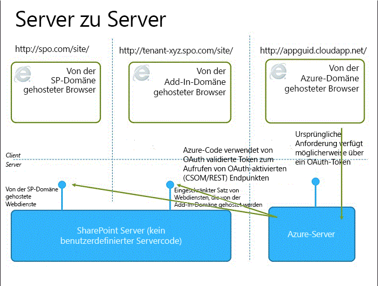

# Auswählen von Mustern für die Entwicklung und das Hosten Ihres SharePoint-Add-Ins

Das SharePoint-Add-In-Modell führt eine breite Palette von Hosting- und Entwicklungsansätzen ein. Einige dieser Ansätze können kombiniert werden. So können Ihre Add-Ins z. B. SharePoint-gehostete und remote gehostete Komponenten verwenden. Um herauszufinden, welches Muster Sie verwenden möchten, ist es hilfreich, mit den eigenen Anforderungen, Technologien und Zielen zu beginnen und diese mit den Optionen und Möglichkeiten abzugleichen, die SharePoint-Add-Ins bieten.

## Faktoren, die Sie bei der Auswahl eines Entwicklungsmusters bedenken sollten

SharePoint-Add-Ins erweitern die Palette möglicher Programmiersprachen und Technologiestapel, die Sie zum Arbeiten mit SharePoint-Ressourcen und -Diensten verwenden können. Welche Optionen genau zur Verfügung stehen, hängt sowohl vom Typ des Add-In als auch vom Hostingmuster ab, den Sie wählen. Sie können Ansätze auch kombinieren.

### Von SharePoint gehostete Add-Ins

Beginnen wir mit der einfachsten Option: in SharePoint gehostete Add-Ins oder Add-Ins, bei denen alle Komponenten entweder in einer lokalen oder einer Office 365-SharePoint-Farm gehostet werden. In SharePoint gehostete Add-Ins werden auf einer SharePoint-Website installiert, die als das Hostweb bezeichnet wird.  Ihre Ressourcen werden auf einer isolierten untergeordneten Website eines Hostweb gehostet, die als das Add-In-Web bezeichnet wird.  Es ist wichtig, [den Unterscheid zwischen Hostwebs und Add-In-Webs](host-webs-add-in-webs-and-sharepoint-components-in-sharepoint.md) zu kennen. 

In Abbildung 1 ist die grundlegende Architektur eines in SharePoint gehosteten Add-Ins dargestellt.

*Abbildung 1: Architektur eines von SharePoint gehosteten Add-Ins*

 
Sie können ein in SharePoint gehostete Add-In mit Add-Ins kombinieren, die über remote gehostete Komponenten verfügen. Jedes Add-In oder jeder Teil eines Add-In, die auf einem Add-In-Web ausgeführt wird, hat die folgenden Anforderungen für drei Kernkomponenten: wo das Add-In gehostet wird, wie das Add-In autorisiert wird, und welche Sprache das Add-In verwenden kann.

|**Komponente**|**Anforderung für von SharePoint gehostete Add-Ins**|
|:-----|:-----|
|Wo die Komponenten des Add-Ins gehostet werden|In der isolierten Add-In-Domäne Ihrer SharePoint-Farm|
|Wie das Add-In autorisiert wird|Die Rechte des angemeldeten Benutzers|
|Welche Sprache das Add-In verwenden kann|JavaScript (mit der SharePoint-JSOM-Bibliothek) + HTML|

|**Erhalten Sie diese Vorteile**|**Berücksichtigen Sie aber Folgendes**|
|:-----|:-----|
|Allgemeine SharePoint-Artefakte, wie Listen und Webparts, können wieder verwendet werden.|Sie können in dem Add-In nur JavaScript und keinen serverseitigen Code verwenden.|
|Aufgrund der leichten Erstellung und Bereitstellung eignen sie sich gut für Produktivitätsapps für kleine Teams und Geschäftsprozessautomatisierung, mit weniger komplexen Geschäftsregeln.|Ihr Add-In besitzt nur die Autorisierungsrechte des angemeldeten Benutzers.|

[Erste Schritte beim Erstellen von von SharePoint gehosteten SharePoint-Add-Ins](get-started-creating-sharepoint-hosted-sharepoint-add-ins.md)

### Vom Anbieter gehostete Add-Ins

Vom Anbieter gehostete SharePoint-Add-Ins umfassen Komponenten, die außerhalb der SharePoint-Farm bereitgestellt und gehostet werden. Sie werden im Hostweb installiert, ihre Remotekomponenten werden jedoch auf einem anderen Server gehostet, *der sich nicht in der SharePoint-Farm befinden sollte*. 

In Abbildung 2 ist die grundlegende Architektur eines von einem Anbieter gehosteten Add-Ins dargestellt.

*Abbildung 2: Architektur eines vom Anbieter gehosteten Add-Ins*

 
Die folgende Tabelle zeigt, dass die Anforderungen für Hosting-Orte, Add-In-Autorisierung und Sprachen bei vom Anbieter gehosteten Add-Ins um einiges geringer sind als bei in SharePoint gehosteten Add-Ins.

|**Komponente**|**Anforderung für vom Anbieter gehostete Add-Ins**|
|:-----|:-----|
|Wo die Komponenten des Add-Ins gehostet werden|Beliebiger Webserver oder Hostingdienst|
|Wie das Add-In autorisiert wird|OAuth oder die domänenübergreifende JavaScript-Bibliothek|
|Welche Sprache das Add-Inverwenden kann|Jede Sprache, die von Ihrem Webserver oder Hostingdienst unterstützt wird|

Ein vom Anbieter gehostetes Add-In interagiert mit einer SharePoint-Website, verwendet aber auch Ressourcen und Dienste, die sich auf der Remotewebsite befinden. Sie sollten Folgendes bedenken, bevor Sie sich zur Erstellung eines vom Anbieter gehosteten Add-Ins entschließen.

|**Erhalten Sie diese Vorteile**|**Berücksichtigen Sie aber Folgendes**|
|:-----|:-----|
|Sie können das Add-In auf Microsoft Azure oder einer beliebigen Remote-Webplattform hosten, einschließlich Plattformen von anderen Anbietern als Microsoft. |Sie sind für das Erstellen der Installations-, Upgrade- und Deinstallationslogik der Remotekomponenten verantwortlich.|
|Verwenden Sie eins der SharePoint-Clientobjektmodelle, die domänenübergreifende JavaScript-Bibliothek oder den SharePoint [REST/OData-basierten Webdienst](http://msdn.microsoft.com/magazine/dn198245.aspx) für die Interaktion mit SharePoint.|Jede Art der Interaktion mit SharePoint hat [entsprechende Optionen für den Datenzugriff](secure-data-access-and-client-object-models-for-sharepoint-add-ins.md).|
|Sichern Sie sich die Autorisierung für SharePoint-Daten mithilfe von einem [der drei Autorisierungssysteme](three-authorization-systems-for-sharepoint-add-ins.md).|Sie müssen sich zwischen OAuth und der domänenübergreifenden Bibliothek entscheiden, um den Zugang des Add-Ins zu SharePoint zu autorisieren.|

## Abstimmen des Hostingmusters mit Ihren Entwicklungszielen

Bei der Auswahl eines Hostingmusters müssen Sie nicht nur die technischen Vorteile und Einschränkungen jeder Option abwägen, sondern auch Ihre Entwicklungsziele berücksichtigen. Die folgende Tabelle erleichtert Ihnen, das für Ihre Anforderungen am besten geeignete Hostingmuster zu finden.

|**Ihre Anforderungen**|**Empfohlenes Hostingmuster**|**Beispiel**|
|:-----|:-----|:-----|
|Nur mit neuen SharePoint-Entitäten arbeiten und diese bereitstellen|Von SharePoint gehostet|Ein Add-In, das eine Personenauswahlsteuerung enthält und Informationen zu SharePoint-Benutzern in einer SharePoint-Liste speichert|
|Vorhandene SharePoint-Entitäten verwenden und mit externen Webdiensten (keine SharePoint-Webdienste) interagieren|Vom Internetanbieter gehostet|Ein Add-In, die Kundenadressen aus einer bestehenden SharePoint-Liste im Hostweb abruft und einen Zuordnungsdienst in einer Webanwendung verwendet, um deren Standorte anzuzeigen|
|Neue SharePoint-Entitäten bereitstellen und mit externen Webdiensten interagieren|Kombination aus in SharePoint gehostet und vom Anbieter gehostet|Ein Zuordnungs-Add-In, das eine SharePoint-Liste im Add-In-Web bereitstellt, sodass sie die Koordinaten (Breiten- und Längengrade) für Adressen speichern kann, die vom Benutzer angegeben werden oder aus einer vorhandenen SharePoint-Liste bezogen werden|

## Was Sie bei der Auswahl des Hostingmusters für vom Anbieter gehostete Add-Ins bedenken sollten

In SharePoint gehostete Add-Ins weisen ein festes Hostingmuster auf, da sie im Add-In-Web gehostet werden. Vom Anbieter gehostete Add-Ins bieten die größte Flexibilität für das Hosting der verschiedenen Komponenten Ihres Add-Ins. Wenn Sie ein Add-In erstellen möchten, müssen Sie daher Ihre Ziele und Anforderungen mit dem entsprechenden Hostingmuster abgleichen. 

### OAuth oder die domänenübergreifende Bibliothek

Eine der wichtigsten Fragen, die Sie sich stellen sollten, wenn Sie vom Anbieter gehostete Add-Ins in Betracht ziehen und sich über deren Erstellung Gedanken machen, ist, wie das Add-In die Autorisierung zur Interaktion mit SharePoint erhält. Vom Anbieter gehostete Add-Ins bieten Ihnen zwei Optionen: die domänenübergreifende JavaScript-Bibliothek und OAuth. 

Mit der **[domänenübergreifenden Bibliothek](access-sharepoint-data-from-add-ins-using-the-cross-domain-library.md)** können Sie von den Remotekomponenten Ihres Add-Ins über einen Proxy mit mehr als einer Domäne interagieren.  Wenn clientseitiger Code und die Berechtigungen eines Benutzers ausreichen, der bei SharePoint angemeldet ist, ist die domänenübergreifende Bibliothek eine gute Option. Die domänenübergreifende Bibliothek ist auch praktisch, wenn Sie Remoteaufrufe durch eine Firewall durchführen.

**OAuth** ist ein offenes Protokoll für die Autorisierung, das auf leicht verwaltbare Weise eine sichere Autorisierung von Clientanwendungen (Desktop-, Web- und mobile Anwendungen) ermöglicht. Wenn Sie planen, ein Add-In für SharePoint zu erstellen, das in einer Remotewebanwendung ausgeführt wird und an SharePoint zurückkommuniziert, müssen Sie oft OAuth verwenden. OAuth ist immer erforderlich, wenn Sie SharePoint von einer remote gehosteten Webanwendung aufrufen, die nicht ausschließlich clientseitigen Code (HTML + JavaScript) verwenden kann. [Erfahren Sie mehr über die Funktionsweise von OAuth in Add-Ins für SharePoint.](creating-sharepoint-add-ins-that-use-low-trust-authorization.md)
 
Unter  [Sicherer Datenzugriff und Clientobjektmodelle für SharePoint-Add-Ins](secure-data-access-and-client-object-models-for-sharepoint-add-ins.md) und [Drei Autorisierungssysteme für SharePoint-Add-Ins](three-authorization-systems-for-sharepoint-add-ins.md) wird die Auswahl zwischen OAuth und der domänenübergreifenden Bibliothek ausführlicher erläutert.

### OAuth mit lokalen SharePoint-Farmen

Wenn Sie eine lokale Bereitstellung von SharePoint verwenden, können Sie OAuth benutzen, müssen sich aber zwischen der Erstellung eines besonders vertrauenswürdigen Add-Ins und der Verwendung eines Office 365-Mandanten entscheiden. Office 365 verwendet Microsoft Azure Access Control Service (ACS) als Vertrauensbroker, und wenn Sie keinen Zugriff auf einen Office 365-Mandanten haben, müssen Sie  [Erstellen besonders vertrauenswürdiger Add-Ins für SharePoint](create-high-trust-sharepoint-add-ins.md) verwenden, das Zertifikate für die Einrichtung einer Vertrauensstellung zwischen Ihrem Add-In und SharePoint benutzt. Sie können besonders vertrauenswürdige Add-Ins zum Add-In-Katalog Ihrer SharePoint-Farm hinzufügen, können sie aber nicht im Office Store verkaufen. Wenn Sie Zugriff auf einen Office 365-Mandanten haben, können Sie diesen mit Ihrer lokalen Installation von SharePoint verknüpfen und [ACS als Vertrauensbroker für Add-Ins verwenden, die in Ihrer lokalen SharePoint-Bereitstellung installiert werden](use-an-office-365-sharepoint-site-to-authorize-provider-hosted-add-ins-on-an-on.md).

In der folgenden Tabelle sind alle möglichen Ansätze für das Hosting der SharePoint-Komponenten und der Remotekomponenten Ihres Add-Ins sowie die Vertrauensbroker aufgeführt, die Ihnen bei Verwendung von OAuth zur Verfügung stehen. Beachten Sie, dass Sie Zugriff auf einen Office 365-Mandanten benötigen, um ACS zur Einrichtung einer Vertrauensstellung zwischen SharePoint und einer SharePoint-Add-In zu verwenden, die in einer lokalen Installation von SharePoint installiert ist.

|**Speicherort der SharePoint-Komponenten**|**Speicherort der Remotekomponenten**|**Vertrauensbroker**|
|:-----|:-----|:-----|
|Lokal|In Cloud|ACS, Zertifikat|
|Lokal|Lokal|ACS, Zertifikat|
|Office 365 SharePoint-Website|In Cloud|ACS|
|Office 365 SharePoint-Website|Lokal|ACS|

## Kombinieren von Anbieterhosting und SharePoint-Hosting

Sie können auch Add-Ins entwickeln, die sowohl in SharePoint-gehostete als auch in der Cloud gehostete Komponenten enthalten. Sie können beispielsweise ein [in der Cloud gehostetes Add-In erstellen, das eine benutzerdefinierte SharePoint-Liste und einen benutzerdefinierten Inhaltstyp enthält](create-a-provider-hosted-add-in-that-includes-a-custom-sharepoint-list-and-conte.md). Wenn Sie diese Architektur wählen, müssen in Ihrem Entwurf und Muster die im Modell enthaltenen Sicherheitseinschränkungen berücksichtigt werden. Sie können in den von SharePoint gehosteten Codekomponenten nur JavaScript verwenden, und die remote gehosteten Komponenten müssen OAuth oder die domänenübergreifende Bibliothek für die Interaktion mit der SharePoint-Website benutzen. Wenn Sie dieses Muster in Erwägung ziehen, sollten Sie die [Funktionsweise der Add-In-Autorisierung in SharePoint](authorization-and-authentication-of-sharepoint-add-ins.md) verstehen. 

Abbildung 3 zeigt die Funktionsweise dieser Architektur, wenn Sie Azure zum Hosten der Remotekomponenten Ihres Add-Ins sowie OAuth verwenden.

*Abbildung 3: Kommunikation zwischen Servern für SharePoint-Add-Ins bei Verwendung von OAuth und Windows Azure*

 

[Erfahren Sie, wie Sie ein Add-In erstellen, das Cloud-Hosting und SharePoint-Hosting kombiniert.](create-a-provider-hosted-add-in-that-includes-a-custom-sharepoint-list-and-conte.md)

Hier sind einige Punkte, über die Sie nachdenken sollten, wenn Sie eine Kombination aus Anbieterhosting und SharePoint-Hosting in Erwägung ziehen.

|**Erhalten Sie diese Vorteile**|**Berücksichtigen Sie aber Folgendes**|
|:-----|:-----|
|Alle Vorteile von beiden Ansätzen werden kombiniert.|Die komplexere Architektur erfordert sorgfältige Planung bezüglich der Kommunikation zwischen Servern und der Einschränkungen für siteübergreifendes Skripting.|

## Vom Anbieter gehostete Add-Ins in Azure-Webrollen

Sie können ein vom Anbieter gehostetes SharePoint-Add-In in einer Azure-Webrolle statt in einer Webanwendung (unabhängig davon, ob die Webanwendung lokal oder eine Azure-Website ist) hosten. Eine Azure-Webrolle ist im Wesentlichen eine Website auf Grundlage der Internetinformationsdienste, die auf Azure gehostet wird. Sie können den Vorteil der Hostingdienste und die Skalierbarkeit der Azure-Webrollen nutzen. Sie können außerdem die Leistung und Benutzerfreundlichkeit Ihrer SharePoint-Add-In verbessern, insbesondere, wenn das Add-In häufig genutzt wird oder sich die Anfrage danach im Laufe der Zeit ändert. Wenn die SharePoint-Add-In weitere Serverressourcen benötigt, kann Azure sie dynamisch dem Add-In zuordnen.

Unter den folgenden Links finden Sie weitere Informationen zu Azure-Webrollen:

-  [Was ist ein Clouddienst?](http://www.windowsazure.com/de-DE/manage/services/cloud-services/what-is-a-cloud-service/)
-  [Einführung in Microsoft Azure](http://www.windowsazure.com/de-DE/develop/net/fundamentals/intro-to-windows-azure/)
-  [Automatische Skalierung und Microsoft Azure](http://msdn.microsoft.com/de-DE/library/hh680945%28v=pandp.50%29.aspx)

Als Voraussetzung benötigen Sie das Microsoft Azure SDK für .NET (Visual Studio 2012) 1.8.1, das Sie mithilfe des  [Webplattform-Installer](http://www.microsoft.com/web/downloads/platform.aspx). installieren können

Die Art, wie Sie das Projekt in vsnv erstellen, hängt davon ab, ob Sie ein SharePoint Add-In-Projekt starten und anschließend das Azure-Webrollenprojekt hinzufügen, oder das Azure-Projekt starten und anschließend das SharePoint-Projekt hinzufügen.

### Hinzufügen eines Clouddiensts zu einem vorhandenen Add-In

Wenn Sie bereits ein vom Anbieter gehostetes SharePoint-Add-In haben, das Sie auf Azure hosten möchten, wählen Sie in der Projektmappe für das SharePoint-Add-In das Webanwendungsprojekt aus. Klicken Sie in der Menüleiste auf **Projekt** > **Microsoft Azure-Clouddienstprojekt hinzufügen**. Es wird ein Azure-Projekt mit der Bezeichnung _NameOfTheWebAppProject_.Azure zur Projektmappe Ihres SharePoint-Add-Ins hinzugefügt. Eine Webrolle für das Webprojekt wird ebenfalls zum Projekt für den Azure-Clouddienst hinzugefügt. Office Developer Tools für Visual Studio 2012 legt die erforderlichen Projekteigenschaften fest, sodass die Webrolle mit dem SharePoint-Add-In arbeiten kann.

### Hinzufügen eines Add-Ins zu einer vorhandenen Webrolle

Wenn Sie bereits eine Webrolle in einem Azure-Clouddienst haben, den Sie als Host für ein vom Anbieter gehostetes SharePoint-Add-In verwenden möchten, öffnen Sie das Azure-Cloudprojekt in Visual Studio, und wählen Sie dann im **Projektmappen-Explorer** das Webrollenprojekt aus. Klicken Sie in der Menüleiste auf **Projekt** > **SharePoint-Add-In-Projekt hinzufügen**. Ein Projekt für ein vom Anbieter gehostetes SharePoint-Add-In mit der Bezeichnung _NameOfTheWebAppProject_.Azure wird erstellt und zur Projektmappe hinzugefügt. Visual Studio verweist auf die Azure-Webrolle als Web-Projekthost für das SharePoint-Add-In.

## Zusätzliche Ressourcen

-  [Kritische Aspekte der Architektur und der Entwicklungslandschaft für SharePoint-Add-Ins](important-aspects-of-the-sharepoint-add-in-architecture-and-development-landscap.md)
-  [SharePoint-Add-Ins](sharepoint-add-ins.md)
-  [Hostwebs, Add-In-Webs und SharePoint-Komponenten in SharePoint](host-webs-add-in-webs-and-sharepoint-components-in-sharepoint.md)
-  [Autorisierung und Authentifizierung für Add-Ins in SharePoint](authorization-and-authentication-of-sharepoint-add-ins.md)
-  [OAuth-Ablauf mit Kontexttoken für SharePoint-Add-Ins](context-token-oauth-flow-for-sharepoint-add-ins.md)
-  [Verwenden einer Office 365 SharePoint-Website, um vom Anbieter gehostete Add-Ins auf einer lokalen SharePoint-Website zu autorisieren](use-an-office-365-sharepoint-site-to-authorize-provider-hosted-add-ins-on-an-on.md)
-  [SharePoint-Add-Ins im Vergleich zu SharePoint-Lösungen](http://msdn.microsoft.com/library/0e9efadb-aaf2-4c0d-afd5-d6cf25c4e7a8%28Office.15%29.aspx)
-  [Erste Schritte beim Erstellen von von einem Anbieter gehosteten SharePoint-Add-Ins](get-started-creating-provider-hosted-sharepoint-add-ins.md)
-  [Erste Schritte beim Erstellen von von SharePoint gehosteten SharePoint-Add-Ins](get-started-creating-sharepoint-hosted-sharepoint-add-ins.md)
-  [Gewusst wie: Erstellen eines von einem Anbieter gehosteten Add-Ins, das eine benutzerdefinierte SharePoint-Liste und einen benutzerdefinierten Inhaltstyp enthält](create-a-provider-hosted-add-in-that-includes-a-custom-sharepoint-list-and-conte.md)

