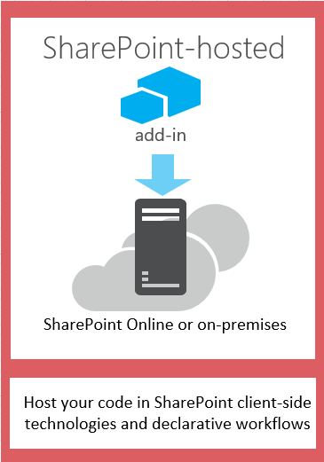
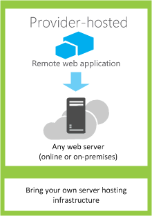

# Auswählen von Mustern für die Entwicklung und das Hosten Ihres SharePoint-Add-InsChoose patterns for developing and hosting your SharePoint Add-in
Lernen Sie die verschiedenen Möglichkeiten zum Hosten der Komponenten von SharePoint-Add-Ins kennen.Learn about the different ways that you can host the components of SharePoint Add-ins.
 

 **Hinweis** Der Name „Apps für SharePoint“ wird in „SharePoint-Add-Ins“ geändert. Während des Übergangszeitraums wird in der Dokumentation und der Benutzeroberfläche einiger SharePoint-Produkte und Visual Studio-Tools möglicherweise weiterhin der Begriff „Apps für SharePoint“ verwendet. Weitere Informationen finden Sie unter [Neuer Name für Office- und SharePoint-Apps](new-name-for-apps-for-sharepoint#bk_newname).The name "apps for SharePoint" is changing to "SharePoint Add-ins". During the transition, the documentation and the UI of some SharePoint products and Visual Studio tools might still use the term "apps for SharePoint". For details, see [New name for apps for Office and SharePoint](new-name-for-apps-for-sharepoint#bk_newname).
 

Das SharePoint-Add-In-Modell führt eine breite Palette von Hosting- und Entwicklungsansätzen ein. Einige dieser Ansätze können kombiniert werden. So können Ihre Add-Ins z. B. SharePoint-gehostete und remote gehostete Komponenten verwenden. Um herauszufinden, welches Muster Sie verwenden möchten, ist es hilfreich, mit den eigenen Anforderungen, Technologien und Zielen zu beginnen und diese mit den Optionen und Möglichkeiten abzugleichen, die SharePoint-Add-Ins bieten.Learn about the different ways that you can host the components of SharePoint Add-ins. The SharePoint add-in model introduces a wide range of hosting and development patterns. Some of these patterns can be used in combination with each other. For example, your add-ins can mix SharePoint-hosted and remotely hosted components. The most useful way to determine which patterns you'll want to use is to start with your own requirements, technologies, and goals and match them with the options and possibilities that are enabled by SharePoint Add-ins.
 

## Faktoren, die Sie bei der Auswahl eines Entwicklungsmusters bedenken solltenWhat to think about when choosing your development pattern

SharePoint-Add-Ins erweitern die Palette möglicher Programmiersprachen und Technologiestapel, die Sie zum Arbeiten mit SharePoint-Ressourcen und -Diensten verwenden können. Welche Optionen genau zur Verfügung stehen, hängt sowohl vom Typ des Add-In als auch vom Hostingmuster ab, den Sie wählen. Sie können Ansätze auch kombinieren.SharePoint Add-ins widen the range of possible programming languages and technology stacks that you can use when you work with SharePoint resources and services. The precise range of options depends on both the type of add-in and the hosting pattern that you choose. It's also possible to mix patterns.
 

 

### Von SharePoint gehostete Add-InsSharePoint-hosted add-ins

Beginnen wir mit der einfachsten Option: in SharePoint gehostete Add-Ins oder Add-Ins, bei denen alle Komponenten entweder in einer lokalen oder einer Office 365-SharePoint-Farm gehostet werden. In SharePoint gehostete Add-Ins werden auf einer SharePoint-Website installiert, die als das Hostweb bezeichnet wird. Ihre Ressourcen werden auf einer isolierten untergeordneten Website eines Hostweb gehostet, die als dasAdd-In-Web bezeichnet wird. Es ist wichtig, [den Unterscheid zwischen Hostwebs und Add-In-Webs](host-webs-add-in-webs-and-sharepoint-components-in-sharepoint-2013) zu kennen. Abbildung 1 illustriert die grundlegende Architektur eines in SharePoint gehosteten Add-In.Start with the simplest option: SharePoint-hosted add-ins, or add-ins where all components are hosted on either an on-premises or Office 365 SharePoint farm. SharePoint-hosted add-ins are installed on a SharePoint website, called the host web. They have their resources hosted on an isolated subsite of a host web, called the add-in web. It's important to know  [the difference between host webs and add-in webs](host-webs-add-in-webs-and-sharepoint-components-in-sharepoint-2013). Figure 1 illustrates the basic architecture of a SharePoint-hosted add-in.
 

 

**Abbildung 1: Architektur eines von SharePoint gehosteten Add-Ins****Figure 1. SharePoint-hosted add-in architecture**

 

 

 
Sie können ein in SharePoint gehostete Add-In mit Add-Ins kombinieren, die über remote gehostete Komponenten verfügen. Jedes Add-In oder jeder Teil eines Add-In, die auf einem Add-In-Web ausgeführt wird, hat die folgenden Anforderungen für drei Kernkomponenten: wo das Add-In gehostet wird, wie das Add-In autorisiert wird, und welche Sprache das Add-In verwenden kann.You can combine a SharePoint-hosted add-in with add-ins that have remotely hosted components, but any add-in or portion of an add-in that runs on an add-in web has the following set of requirements for three key components: where the add-in is hosted, how the add-in gets authorization, and what language it can use.
 

 

|**Komponente****Component**|**Anforderung für von SharePoint gehostete Add-Ins****SharePoint-hosted add-in requirement**|
|:-----|:-----|
|Wo die Komponenten des Add-Ins gehostet werdenWhere the add-in components are hosted|In der isolierten Add-In-Domäne Ihrer SharePoint-FarmIn the isolated add-in domain of your SharePoint farm|
|Wie das Add-In autorisiert wirdHow the add-in gets authorized|Die Rechte des angemeldeten BenutzersThe privileges of the signed-in user|
|Welche Sprache das Add-In verwenden kannWhat language the add-in can use|JavaScript (mit der SharePoint-JSOM-Bibliothek) + HTMLJavaScript (with the SharePoint JSOM library) + HTML|
Dieses Muster ist am einfachsten bereitzustellen, und Sie können die  [Erstellen eines einfachen von SharePoint gehosteten Add-Ins mithilfe von Napa Office 365-Entwicklungstools](create-a-basic-sharepoint-hosted-add-in-by-using-napa-office-365-development-tools) verwenden. Sie sollten Folgendes bedenken, bevor Sie sich zur Erstellung eines in SharePoint gehosteten Add-Ins entschließen.This pattern is the easiest to deploy, and you can use the  [Create a basic SharePoint-hosted add-in by using Napa Office 365 Development Tools](create-a-basic-sharepoint-hosted-add-in-by-using-napa-office-365-development-tools). You'll want to consider the following before deciding to create a SharePoint-hosted add-in.
 

 

|**Erhalten Sie diese Vorteile****Get these benefits**|**Berücksichtigen Sie aber Folgendes****But consider this**|
|:-----|:-----|
|Allgemeine SharePoint-Artefakte, wie Listen und Webparts, können wieder verwendet werden.Reuse common SharePoint items, like lists and Web Parts.|Sie können in dem Add-In nur JavaScript und keinen serverseitigen Code verwenden.You can use only JavaScript in the add-in—you can't use any server-side code.|
|Aufgrund der leichten Erstellung und Bereitstellung eignen sie sich gut für Produktivitätsapps für kleine Teams und Geschäftsprozessautomatisierung, mit weniger komplexen Geschäftsregeln.Relatively easy to create and deploy, so they are good for small team productivity add-ins and business process automation, with lower complexity business rules.|Ihr Add-In besitzt nur die Autorisierungsrechte des angemeldeten Benutzers.Your add-in has only the authorization privileges of the signed-in user.|
 [Erste Schritte beim Erstellen von von SharePoint gehosteten SharePoint-Add-InsGet started creating SharePoint-hosted SharePoint Add-ins](get-started-creating-sharepoint-hosted-sharepoint-add-ins)
 

 

### Vom Anbieter gehostete Add-InsProvider-hosted add-ins

Vom Anbieter gehostete SharePoint-Add-Ins umfassen Komponenten, die außerhalb der SharePoint-Farm bereitgestellt und gehostet werden. Sie werden im Hostweb installiert, die Remotekomponenten werden allerdings auf einem anderen Server gehostet,  *der kein Server in der SharePoint-Farm sein sollte*  . In Abbildung 2 ist die grundlegende Architektur eines vom Anbieter gehosteten Add-Ins illustriert.Provider-hosted SharePoint Add-ins include components that are deployed and hosted outside the SharePoint farm. They are installed to the host web, but their remote components are hosted on another server  *that should not be a server in the SharePoint farm*  . Figure 2 illustrates the basic architecture of a provider-hosted add-in.
 

 

**Abbildung 2: Architektur eines vom Anbieter gehosteten Add-Ins****Figure 2. Provider-hosted add-in architecture**

 

 

 
Die folgende Tabelle zeigt, dass die Anforderungen für Hosting-Orte, Add-In-Autorisierung und Sprachen bei vom Anbieter gehosteten Add-Ins um einiges geringer sind als bei in SharePoint gehosteten Add-Ins.The following table shows how the requirements for hosting location, add-in authorization, and languages are much less fixed for provider-hosted add-ins than they are for SharePoint-hosted add-ins.
 

 

|**Komponente****Component**|**Anforderung für vom Anbieter gehostete Add-Ins****Provider-hosted add-in requirement**|
|:-----|:-----|
|Wo die Komponenten des Add-Ins gehostet werdenWhere the add-in components are hosted|Beliebiger Webserver oder HostingdienstAny web server or hosting service|
|Wie das Add-In autorisiert wirdHow the add-in gets authorized|OAuth oder die domänenübergreifende JavaScript-BibliothekOAuth or the JavaScript cross-domain library|
|Welche Sprache das Add-Inverwenden kannWhat language the add-in can use|Jede Sprache, die von Ihrem Webserver oder Hostingdienst unterstützt wirdAny language supported by your web server or hosting service|
Ein vom Anbieter gehostetes Add-In interagiert mit einer SharePoint-Website, verwendet aber auch Ressourcen und Dienste, die sich auf der Remotewebsite befinden. Sie sollten Folgendes bedenken, bevor Sie sich zur Erstellung eines vom Anbieter gehosteten Add-Ins entschließen.A provider-hosted add-in interacts with a SharePoint site but also uses resources and services that are located on the remote site. You'll want to consider the following before deciding to create a provider-hosted add-in.
 

 

|**Erhalten Sie diese Vorteile****Get these benefits**|**Berücksichtigen Sie aber Folgendes****But consider this**|
|:-----|:-----|
|Sie können das Add-In auf Microsoft Azure oder einer beliebigen Remote-Webplattform hosten, einschließlich Plattformen von anderen Anbietern als Microsoft.Host the add-in on Microsoft Azure or any remote web platform, including non-Microsoft platforms. |Sie sind für das Erstellen der Installations-, Upgrade- und Deinstallationslogik der Remotekomponenten verantwortlich.You are responsible for creating the installation, upgrade, and uninstallation logic of the remote components.|
|Verwenden Sie eins der SharePoint-Clientobjektmodelle, die domänenübergreifende JavaScript-Bibliothek oder den SharePoint [REST/OData-basierten Webdienst](http://msdn.microsoft.com/magazine/dn198245.aspx) für die Interaktion mit SharePoint.Use one of the SharePoint client object models, the JavaScript cross-domain library, or the SharePoint  [REST/OData-based web service](http://msdn.microsoft.com/magazine/dn198245.aspx) to interact with SharePoint.|Jede Art der Interaktion mit SharePoint hat [entsprechende Optionen für den Datenzugriff](secure-data-access-and-client-object-models-for-sharepoint-add-ins).Each way of interacting with SharePoint has  [corresponding options for approaches to data access](secure-data-access-and-client-object-models-for-sharepoint-add-ins).|
|Sichern Sie sich die Autorisierung für SharePoint-Daten mithilfe von einem [der drei Autorisierungssysteme](three-authorization-systems-for-sharepoint-add-ins).Gain authorization to SharePoint data using one of  [the three authorization systems](three-authorization-systems-for-sharepoint-add-ins).|Sie müssen sich zwischen OAuth und der domänenübergreifenden Bibliothek entscheiden, um den Zugang des Add-Ins zu SharePoint zu autorisieren.You need to decide between OAuth and the cross-domain library to authorize your add-in's access to SharePoint.|

## Abstimmen des Hostingmusters mit Ihren EntwicklungszielenMatch your hosting pattern with your development goals

Bei der Auswahl eines Hostingmusters müssen Sie nicht nur die technischen Vorteile und Einschränkungen jeder Option abwägen, sondern auch Ihre Entwicklungsziele berücksichtigen. Die folgende Tabelle erleichtert Ihnen, das für Ihre Anforderungen am besten geeignete Hostingmuster zu finden.In addition to considering the technical advantages and constraints of each option, you'll also need to think about your development goals when deciding on a hosting pattern. You can use the following table to help sort out which hosting pattern best fits your needs.
 

 

|**Ihre Anforderungen****Your requirements**|**Empfohlenes Hostingmuster****Recommended Hosting pattern**|**Beispiel****Example**|
|:-----|:-----|:-----|
|Nur mit neuen SharePoint-Entitäten arbeiten und diese bereitstellenWork with and provision new SharePoint entities exclusively|Von SharePoint gehostetSharePoint-hosted add-in|Ein Add-In, das eine Personenauswahlsteuerung enthält und Informationen zu SharePoint-Benutzern in einer SharePoint-Liste speichertAn add-in that includes a people picker control and that stores information about SharePoint users in a SharePoint list|
|Vorhandene SharePoint-Entitäten verwenden und mit externen Webdiensten (keine SharePoint-Webdienste) interagierenUse existing SharePoint entities and interact with external (non-SharePoint) web services|Vom Internetanbieter gehostetProvider-hosted|Ein Add-In, die Kundenadressen aus einer bestehenden SharePoint-Liste im Hostweb abruft und einen Zuordnungsdienst in einer Webanwendung verwendet, um deren Standorte anzuzeigenAn add-in that gets customer addresses from an existing SharePoint list in the host web and uses a mapping service in a web application to display their locations|
|Neue SharePoint-Entitäten bereitstellen und mit externen Webdiensten interagierenProvision new SharePoint entities and interact with external web services|Kombination aus in SharePoint gehostet und vom Anbieter gehostetCombined SharePoint-hosted and provider-hosted|Ein Zuordnungs-Add-In, das eine SharePoint-Liste im Add-In-Web bereitstellt, sodass sie die Koordinaten (Breiten- und Längengrade) für Adressen speichern kann, die vom Benutzer angegeben werden oder aus einer vorhandenen SharePoint-Liste bezogen werdenA mapping add-in that provisions a SharePoint list on the appweb so that it can store latitude and longitude coordinates for addresses that are supplied by the user or pulled from an existing SharePoint list|

## Was Sie bei der Auswahl des Hostingmusters für vom Anbieter gehostete Add-Ins bedenken solltenWhat to think about when choosing your hosting pattern for provider-hosted add-ins

In SharePoint gehostete Add-Ins weisen ein festes Hostingmuster auf, da sie im Add-In-Web gehostet werden. Vom Anbieter gehostete Add-Ins bieten die größte Flexibilität für das Hosting der verschiedenen Komponenten Ihres Add-Ins. Wenn Sie ein Add-In erstellen möchten, müssen Sie daher Ihre Ziele und Anforderungen mit dem entsprechenden Hostingmuster abgleichen.SharePoint-hosted add-ins have a fixed hosting pattern, since they are hosted on the add-in web. Provider-hosted add-ins provide more flexibility for hosting the various components of your add-in, so if you choose to create one, you'll need to match your goals and requirements to the appropriate hosting pattern. 
 

 

### OAuth oder die domänenübergreifende BibliothekOAuth or the cross-domain library

Eine der wichtigsten Fragen, die Sie sich stellen sollten, wenn Sie vom Anbieter gehostete Add-Ins in Betracht ziehen und sich über deren Erstellung Gedanken machen, ist, wie das Add-In die Autorisierung zur Interaktion mit SharePoint erhält. Vom Anbieter gehostete Add-Ins bieten Ihnen zwei Optionen: die domänenübergreifende JavaScript-Bibliothek und OAuth.One of the most important questions you need to ask when considering provider-hosted add-ins and how you'll build them is how the add-in will get authorization to interact with SharePoint. Provider-hosted add-ins give you two choices: the JavaScript cross-domain library and OAuth. 
 

 
Über die  [domänenübergreifende Bibliothek](access-sharepoint-2013-data-from-add-ins-using-the-cross-domain-library)können Sie von den Remotekomponenten Ihres Add-Ins über einen Proxy mit mehr als einer Domäne interagieren. Wenn clientseitiger Code und die Berechtigungen eines Benutzers ausreichen, der bei SharePoint angemeldet ist, ist die domänenübergreifende Bibliothek eine gute Option. Die domänenübergreifende Bibliothek ist auch praktisch, wenn Sie Remoteaufrufe durch eine Firewall durchführen.The  [cross-domain library](access-sharepoint-2013-data-from-add-ins-using-the-cross-domain-library) lets you interact with more than one domain from the remote components of your add-in through a proxy. If client-side code and the permissions of a user who is signed in to SharePoint are sufficient, the cross-domain library is a good option. The cross-domain library is also convenient whenever you are making remote calls through a firewall.
 

 
OAuth ist ein offenes Protokoll für die Autorisierung, das auf leicht verwaltbare Weise eine sichere Autorisierung von Clientanwendungen (Desktop-, Web- und mobile Anwendungen) ermöglicht. Wenn Sie planen, ein Add-In für SharePoint zu erstellen, das in einer Remotewebanwendung ausgeführt wird und an SharePoint zurückkommuniziert, müssen Sie oft OAuth verwenden. OAuth ist immer erforderlich, wenn Sie SharePoint von einer remote gehosteten Webanwendung aufrufen, die nicht ausschließlich clientseitigen Code (HTML + JavaScript) verwenden kann.  [Erfahren Sie mehr über die Funktionsweise von OAuth in Add-Ins für SharePoint.](creating-sharepoint-add-ins-that-use-low-trust-authorization)OAuth is an open protocol for authorization that enables secure authorization from client applications (desktop, web, and mobile applications) in an easily manageable way. If you plan to build a SharePoint Add-in that runs in a remote web application and communicates back to SharePoint, you will often need to use OAuth. OAuth is required whenever you are calling into SharePoint from a remotely hosted web application that can't use client-side code (HTML + JavaScript) exclusively.  [Learn more about how OAuth works in SharePoint Add-ins.](creating-sharepoint-add-ins-that-use-low-trust-authorization)
 

 
 Unter  [Sicherer Datenzugriff und Clientobjektmodelle für SharePoint-Add-Ins](secure-data-access-and-client-object-models-for-sharepoint-add-ins) und [Drei Autorisierungssysteme für SharePoint-Add-Ins](three-authorization-systems-for-sharepoint-add-ins) wird die Auswahl zwischen OAuth und der domänenübergreifenden Bibliothek ausführlicher erläutert.[Secure data access and client object models for SharePoint Add-ins](secure-data-access-and-client-object-models-for-sharepoint-add-ins) and [Three authorization systems for SharePoint Add-ins](three-authorization-systems-for-sharepoint-add-ins) explain the choice between OAuth and the cross-domain library more thoroughly.
 

 

### OAuth mit lokalen SharePoint-FarmenOAuth with on-premises SharePoint farms

Wenn Sie eine lokale Bereitstellung von SharePoint verwenden, können Sie OAuth benutzen, müssen sich aber zwischen der Erstellung eines besonders vertrauenswürdigen Add-Ins und der Verwendung eines Office 365-Mandanten entscheiden. Office 365 verwendet Microsoft Azure Access Control Service (ACS) als Vertrauensbroker, und wenn Sie keinen Zugriff auf einen Office 365-Mandanten haben, müssen Sie  [Erstellen besonders vertrauenswürdiger Add-Ins für SharePoint](create-high-trust-sharepoint-add-ins) verwenden, das Zertifikate für die Einrichtung einer Vertrauensstellung zwischen Ihrem Add-In und SharePoint benutzt. Sie können besonders vertrauenswürdige Add-Ins zum Add-In-Katalog Ihrer SharePoint-Farm hinzufügen, können sie aber nicht im Office Store verkaufen. Wenn Sie Zugriff auf einen Office 365-Mandanten haben, können Sie diesen mit Ihrer lokalen Installation von SharePoint verknüpfen und [ACS als Vertrauensbroker für Add-Ins verwenden, die in Ihrer lokalen SharePoint-Bereitstellung installiert werden](use-an-office-365-sharepoint-site-to-authorize-provider-hosted-add-ins-on-an-on-premises-sharepoint-site).If you are using an on-premises deployment of SharePoint, you can use OAuth, but you will have to choose between creating high-trust add-ins and using an Office 365 tenancy. Office 365 uses Microsoft Azure Access Control Service (ACS) as the trust broker, and if you do not have access to an Office 365 tenancy, you'll need to use  [Create high-trust SharePoint Add-ins](create-high-trust-sharepoint-add-ins), which uses certificates to establish trust between your add-in and SharePoint. You can add high trust add-ins to the add-in catalog of your SharePoint farm, but you can't sell them in the Office Store. If you do have access to an Office 365 tenancy, you can link it to your on-premises installation of SharePoint and  [use ACS as the trust broker for add-ins that are installed to your on-premises SharePoint](use-an-office-365-sharepoint-site-to-authorize-provider-hosted-add-ins-on-an-on-premises-sharepoint-site).
 

 
In der folgenden Tabelle sind alle möglichen Ansätze für das Hosting der SharePoint-Komponenten und der Remotekomponenten Ihres Add-Ins sowie die Vertrauensbroker aufgeführt, die Ihnen bei Verwendung von OAuth zur Verfügung stehen. Beachten Sie, dass Sie Zugriff auf einen Office 365-Mandanten benötigen, um ACS zur Einrichtung einer Vertrauensstellung zwischen SharePoint und einer SharePoint-Add-In zu verwenden, die in einer lokalen Installation von SharePoint installiert ist.The following table lists all of the possible patterns for hosting both the SharePoint components and the remote components of your add-in, along with the trust brokers that are available to you if you're using OAuth. Note that you'll need access to an Office 365 tenant in order to use ACS to establish trust between SharePoint and a SharePoint Add-in that is installed to an on-premises installation of SharePoint.
 

 

|**Speicherort der SharePoint-Komponenten****SharePoint component location**|**Speicherort der Remotekomponenten****Remote component location**|**Vertrauensbroker****Trust broker**|
|:-----|:-----|:-----|
|LokalOn premises|In CloudIn cloud|ACS, ZertifikatACS, certificate|
|LokalOn premises|LokalOn premises|ACS, ZertifikatACS, certificate|
|Office 365 SharePoint-WebsiteOffice 365 SharePoint site|In CloudIn cloud|ACSACS|
|Office 365 SharePoint-WebsiteOffice 365 SharePoint site|LokalOn premises|ACSACS|

## Kombinieren von Anbieterhosting und SharePoint-HostingCombine provider hosting and SharePoint hosting

Sie können auch Add-Ins erstellen, die sowohl in SharePoint gehostete als auch in der Cloud gehostete Komponenten enthalten. Sie können z. B. ein  [in der Cloud gehostete Add-In erstellen, das eine benutzerdefinierte SharePoint-Liste und einen benutzerdefinierten Inhaltstyp enthält](create-a-provider-hosted-add-in-that-includes-a-custom-sharepoint-list-and-content-type). Wenn Sie diese Architektur wählen, müssen in Ihrem Entwurf und Muster die im Modell enthaltenen Sicherheitseinschränkungen berücksichtigt werden. Sie können in den von SharePoint gehosteten Codekomponenten nur JavaScript verwenden, und die remote gehosteten Komponenten müssen OAuth oder die domänenübergreifende Bibliothek für die Interaktion mit der SharePoint-Website benutzen. Wenn Sie dieses Muster in Erwägung ziehen, sollten Sie die  [Funktionsweise der Add-In-Autorisierung in SharePoint](authorization-and-authentication-of-sharepoint-add-ins) verstehen. Abbildung 4 zeigt die Funktionsweise dieser Architektur, wenn Sie Microsoft Azure zum Hosten der Remotekomponenten Ihres Add-Ins sowie OAuth verwenden.You can also build add-ins that include both SharePoint-hosted and cloud-hosted components. For example, you can create a  [cloud-hosted add-in that includes a custom SharePoint list and content type](create-a-provider-hosted-add-in-that-includes-a-custom-sharepoint-list-and-content-type). If you choose to use this architecture, your design and approach must account for security limitations that are built into the model. You can use only JavaScript in the code components that are hosted by SharePoint, and the remotely hosted components must use either OAuth or the cross-domain library to interact with the SharePoint website. When considering this approach, make sure that you understand how  [add-in authorization works in SharePoint](authorization-and-authentication-of-sharepoint-add-ins). Figure 4 shows you how this architecture works if you use Microsoft Azure to host the remote components of your add-in, and you use OAuth.
 

 

**Abbildung 4: Kommunikation zwischen Servern für SharePoint-Add-Ins bei Verwendung von OAuth und Windows Azure****Figure 4. SharePoint add-in server-to-server communication when you use OAuth and Windows Azure**

 

 

 
 [Erfahren Sie, wie Sie ein Add-In erstellen, das Cloud-Hosting und SharePoint-Hosting kombiniert.Learn how to create an add-in that combines cloud hosting and SharePoint hosting.](create-a-provider-hosted-add-in-that-includes-a-custom-sharepoint-list-and-content-type)
 

 
Hier sind einige Punkte, über die Sie nachdenken sollten, wenn Sie eine Kombination aus Anbieterhosting und SharePoint-Hosting in Erwägung ziehen.Here are some things to think about when you're considering a combination of provider hosting and SharePoint hosting.
 

 

|**Erhalten Sie diese Vorteile****Get these benefits**|**Berücksichtigen Sie aber Folgendes****But consider this**|
|:-----|:-----|
|Alle Vorteile von beiden Ansätzen werden kombiniert.All the benefits of the two approaches.|Die komplexere Architektur erfordert sorgfältige Planung bezüglich der Kommunikation zwischen Servern und der Einschränkungen für siteübergreifendes Skripting.More complex architecture requires careful planning around server-to-server communication and cross-site scripting restrictions.|

## Vom Anbieter gehostete Add-Ins in Azure-WebrollenProvider-hosted add-ins in Azure Web Roles

Sie können eine vom Anbieter gehostete SharePoint-Add-In in einer Microsoft Azure-Webrolle statt in einer Webanwendung (unabhängig davon, ob die Webanwendung lokal oder eine Azure-Website ist) hosten. Eine Azure-Webrolle ist äußerst wichtig, und eine Website auf Grundlage der Internetinformationsdienste und ein Hosting auf Azure. Sie können den Vorteil der Hostingdienste und die Skalierbarkeit der Azure-Webrollen nutzen. Sie können außerdem die Leistung und Benutzerfreundlichkeit Ihrer SharePoint-Add-In verbessern, insbesondere, wenn das Add-In häufig genutzt wird oder sich die Anfrage danach im Laufe der Zeit ändert. Wenn die SharePoint-Add-In weitere Serverressourcen benötigt, kann Azure sie dynamisch dem Add-In zuordnen.You can host a provider-hosted SharePoint Add-in on a Microsoft Azure web role instead of a web application (whether the web application is on-premises or a Azure Web Site). An Azure web role is, essentially, a website that's based on Internet Information Services (IIS) and hosted on Azure. You can take advantage of the hosting services and scalability of Azure web roles. You can also enhance the performance and usability of your SharePoint Add-in, especially if the add-in is heavily used or demand for it changes over time. If the SharePoint Add-in ever requires more server resources, Azure can dynamically allocate them to the add-in.
 

 
Unter den folgenden Links finden Sie weitere Informationen zu Azure-Webrollen:See the following links for more information about Azure web roles.
 

 

-  [Was ist ein Clouddienst?What is a cloud service?](http://www.windowsazure.com/en-us/manage/services/cloud-services/what-is-a-cloud-service/)
    
 
-  [Einführung in Microsoft AzureIntroducing Microsoft Azure](http://www.windowsazure.com/en-us/develop/net/fundamentals/intro-to-windows-azure/)
    
 
-  [Automatische Skalierung und Microsoft AzureAutoscaling and Microsoft Azure](http://msdn.microsoft.com/en-us/library/hh680945%28v=pandp.50%29.aspx)
    
 
Als Voraussetzung benötigen Sie das Microsoft Azure SDK für .NET (VS 2012) 1.8.1, das Sie mithilfe des  [Webplattform-Installer](http://www.microsoft.com/web/downloads/platform.aspx). installieren könnenAs a prerequisite, you will need the Microsoft Azure SDK for .NET (VS 2012) 1.8.1, which you can install by using the  [Web Platform Installer](http://www.microsoft.com/web/downloads/platform.aspx).
 

 
Die Art, wie Sie das Projekt in vsnv erstellen, hängt davon ab, ob Sie ein SharePoint Add-In-Projekt starten und anschließend das Azure-Webrollenprojekt hinzufügen, oder das Azure-Projekt starten und anschließend das SharePoint-Projekt hinzufügen.The way that you use create the project in vsnv depends on whether you start with a SharePoint Add-in project and then add the Azure web role project, or you start with the Azure project and then add the SharePoint project.
 

 

### Hinzufügen eines Clouddiensts zu einem vorhandenen Add-InAdd a cloud service to an existing add-in

Wenn Sie bereits ein vom Anbieter gehostetes SharePoint-Add-In haben, das Sie auf Azure hosten möchten, wählen Sie in der Projektmappe für das SharePoint-Add-In das Webanwendungsprojekt aus. Klicken Sie in der Menüleiste auf **Projekt**, **Microsoft Azure-Clouddienstprojekt hinzufügen**. Es wird ein Azure-Projekt mit der Bezeichnung _NameOfTheWebAppProject_.Azure zur Projektmappe Ihres SharePoint-Add-Ins hinzugefügt. Eine Webrolle für das Webprojekt wird ebenfalls zum Projekt für den Azure-Clouddienst hinzugefügt. Office Developer Tools für Visual Studio 2012 legt die erforderlichen Projekteigenschaften fest, sodass die Webrolle mit dem SharePoint-Add-In arbeiten kann.If you already have a provider-hosted SharePoint Add-in that you want to host on Azure, choose the web application project in the solution for the SharePoint Add-in. On the menu bar, choose **Project**, **Add Microsoft Azure Cloud Service Project**. A Azure project, called  _NameOfTheWebAppProject_.Azure, is added to the solution for your SharePoint Add-in. A web role for the web project is also added to the project for the Azure cloud service. The Office Developer Tools for Visual Studio 2012 sets the necessary project properties so that the web role can work with the SharePoint Add-in.
 

 

### Hinzufügen eines Add-Ins zu einer vorhandenen WebrolleAdd an add-in to an existing web role

Wenn Sie bereits eine Webrolle in einem Azure-Clouddienst haben, den Sie als Host für ein vom Anbieter gehostetes SharePoint-Add-In verwenden möchten, öffnen Sie das Azure-Cloudprojekt in Visual Studio, und wählen Sie dann im **Projektmappen-Explorer** das Webrollenprojekt aus. Klicken Sie in der Menüleiste auf **Projekt**, **SharePoint-Add-In-Projekt hinzufügen**. Ein Projekt für ein vom Anbieter gehostetes SharePoint-Add-In mit der Bezeichnung _NameOfTheWebAppProject_.Azure wird erstellt und zur Projektmappe hinzugefügt. Visual Studio verweist auf die Azure-Webrolle als Web-Projekthost für das SharePoint-Add-In.If you already have a web role in an Azure cloud service that you want to use as a host for a provider-hosted SharePoint Add-in, open the Azure cloud project in Visual Studio, and then, in **Solution Explorer**, choose the web role project. On the menu bar, choose **Project**, **Add Add-in for SharePoint Project**. A project for a provider-hosted SharePoint Add-in is created, called  _NameOfTheWebAppProject_.Azure, and added to the solution. Visual Studio references the Azure web role as the web project host for the SharePoint Add-in.
 

 

## Zusätzliche RessourcenAdditional resources

Weitere Informationen finden Sie in den folgenden Ressourcen:For more information, see the following resources:
 

 

-  [Kritische Aspekte der Architektur und der Entwicklungslandschaft für SharePoint-Add-InsImportant aspects of the SharePoint Add-in architecture and development landscape](important-aspects-of-the-sharepoint-add-in-architecture-and-development-landscape)
    
 
-  [SharePoint-Add-InsSharePoint Add-ins](sharepoint-add-ins)
    
 
-  [Hostwebs, Add-In-Webs und SharePoint-Komponenten in SharePointHost webs, add-in webs, and SharePoint components in SharePoint](host-webs-add-in-webs-and-sharepoint-components-in-sharepoint-2013)
    
 
-  [Autorisierung und Authentifizierung von SharePoint-Add-InsAuthorization and authentication of SharePoint Add-ins](authorization-and-authentication-of-sharepoint-add-ins)
    
 
-  [OAuth-Ablauf mit Kontexttoken für SharePoint-Add-InsContext Token OAuth flow for SharePoint Add-ins](context-token-oauth-flow-for-sharepoint-add-ins)
    
 
-  [Verwenden einer Office 365 SharePoint-Website, um vom Anbieter gehostete Add-Ins auf einer lokalen SharePoint-Website zu autorisierenUse an Office 365 SharePoint site to authorize provider-hosted add-ins on an on-premises SharePoint site](use-an-office-365-sharepoint-site-to-authorize-provider-hosted-add-ins-on-an-on-premises-sharepoint-site)
    
 
-  [SharePoint-Add-Ins im Vergleich zu SharePoint-LösungenSharePoint Add-ins compared with SharePoint solutions](http://msdn.microsoft.com/library/0e9efadb-aaf2-4c0d-afd5-d6cf25c4e7a8%28Office.15%29.aspx)
    
 
-  [Erste Schritte beim Erstellen von von einem Anbieter gehosteten SharePoint-Add-InsGet started creating provider-hosted SharePoint Add-ins](get-started-creating-provider-hosted-sharepoint-add-ins)
    
 
-  [Erste Schritte beim Erstellen von von SharePoint gehosteten SharePoint-Add-InsGet started creating SharePoint-hosted SharePoint Add-ins](get-started-creating-sharepoint-hosted-sharepoint-add-ins)
    
 
-  [Erstellen eines von einem Anbieter gehosteten Add-Ins, das eine benutzerdefinierte SharePoint-Liste und einen benutzerdefinierten Inhaltstyp enthältCreate a provider-hosted add-in that includes a custom SharePoint list and content type](create-a-provider-hosted-add-in-that-includes-a-custom-sharepoint-list-and-content-type)
    
 

