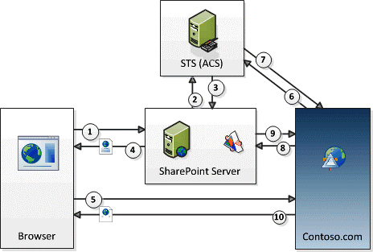

# Kontext-Token-OAuth-Fluss für SharePoint-Add-InsContext Token OAuth flow for SharePoint Add-ins
Erfahren Sie mehr über den OAuth-Authentifizierungs- und -Autorisierungsablauf für vom Anbieter gehostete Add-Ins mit niedriger Vertrauensebene in SharePoint.Learn about the OAuth authentication and authorization flow for low-trust, provider-hosted add-ins in SharePoint.
 

 **Hinweis** Der Name „Apps für SharePoint“ wird in „SharePoint-Add-Ins“ geändert. Während des Übergangszeitraums wird in der Dokumentation und der Benutzeroberfläche einiger SharePoint-Produkte und Visual Studio-Tools möglicherweise weiterhin der Begriff „Apps für SharePoint“ verwendet. Weitere Informationen finden Sie unter [Neuer Name für Office- und SharePoint-Apps](new-name-for-apps-for-sharepoint#bk_newname).The name "apps for SharePoint" is changing to "SharePoint Add-ins". During the transition, the documentation and the UI of some SharePoint products and Visual Studio tools might still use the term "apps for SharePoint". For details, see [New name for apps for Office and SharePoint](new-name-for-apps-for-sharepoint#bk_newname).
 

## Übersicht über OAuth und vom Anbieter gehostete SharePoint-Add-InsGet an overview of OAuth and SharePoint provider-hosted SharePoint Add-ins

In SharePoint **umfasst der OAuth-Authentifizierungs- und Autorisierungsablauf für ein von einem Anbieter gehosteten Add-In mit niedriger Vertrauensebene eine Reihe von Interaktionen zwischen dem Add-In, SharePoint, dem Autorisierungsserver und dem Browser** zur Laufzeit. In diesem Szenario ist Microsoft Azure Access Control Service (ACS) der Autorisierungsserver.In SharePoint, **the OAuth authentication and authorization flow for a provider-hosted, low-trust, add-in involves a series of interactions between your add-in, SharePoint, the authorization server, and the browser** at runtime. The authorization server in this scenario is Microsoft Azure Access Control Service (ACS).
 

 
Mit einem von einem Anbieter gehosteten Add-In erhalten Sie Remotewebanwendungen oder Dienste, die von SharePoint separat und nicht Teil der SharePoint-Farm oder des SharePoint Online-Mandanten sind. Diese können in der Cloud oder auf einem lokalen Server gehostet werden. In diesem Artikel wird die Remotekomponente Contoso.com genannt.With a provider-hosted add-in, you have a remote web application or service that is separate from SharePoint, and not part of the SharePoint farm or SharePoint Online tenancy. It can be hosted in the cloud or on an on-premise server. In this article, the remote component is called Contoso.com.
 

 

 **Hinweis** Die Remotekomponente kann auch Ereignisempfänger hosten, die auf Ereignisse reagieren, die bei SharePoint-Elementen wie Listen oder Listenelementen auftreten. Beispiele für Remoteereignisse, auf die Contoso.com möglicherweise reagieren sollte, sind Listenereignisse, z. B. das Hinzufügen oder Entfernen eines Listenelements, oder Webereignisse, wie das Hinzufügen oder Entfernen einer Website. Weitere Informationen zum Erstellen von Remoteereignisempfängern finden Sie unter [Erstellen eines Remoteereignisempfängers in SharePoint-Add-Ins](create-a-remote-event-receiver-in-sharepoint-add-ins).**Note** The remote component can also host event receivers that respond to events that occur to SharePoint items, such as lists or list items. Examples of remote events that Contoso.com might want to respond to are list events, such as adding or removing a list item; or web events, such as adding or deleting a site. For more information about how to create remote event receivers, see  [Create a remote event receiver in SharePoint Add-ins](create-a-remote-event-receiver-in-sharepoint-add-ins).
 

Contoso.com verwendet das SharePoint-Clientobjektmodell (CSOM) oder die SharePoint-REST-APIs, um Aufrufe an SharePoint durchzuführen. Die Contoso.com-Anwendung verwendet einen OAuth-Ablauf mit Tokenübergabe für die Authentifizierung bei SharePoint. **SharePoint und Contoso.com vertrauen einander nicht, aber beide vertrauen ACS** und akzeptieren von ACS ausgestellte Token. An dem Ablauf sind drei Token beteiligt: SharePoint lässt ACS ein Kontexttoken erstellen, das SharePoint an Constoso.com weiterleitet. Contoso.com validiert, dass das Kontexttoken von ACS stammt, und vertraut ihm deshalb. Contoso.com extrahiert dann ein Aktualisierungstoken aus dem Kontexttoken und verwendet es, um ein Zugriffstoken direkt von ACS zu erhalten. Das Zugriffstoken wird in alle Anforderungen an SharePoint eingeschlossen. SharePoint validiert, dass das Zugriffstoken von ACS ausgestellt wurde, und reagiert deshalb auf die Anforderungen von Contoso.com.Contoso.com uses the SharePoint client object model (CSOM) or the SharePoint REST APIs to make calls to SharePoint. The Contoso.com application uses an OAuth token-passing flow to authenticate with SharePoint. **SharePoint and Contoso.com do not trust each other; but both trust ACS** and will accept tokens issued by ACS. There are three tokens involved: SharePoint has ACS create a context token that SharePoint forwards to Constoso.com. Contoso.com validates that the context token was issued by ACS so it trusts it. Contoso.com then extracts a refresh token from the context token and uses it to get an access token directly from ACS. It includes the access token in all its requests to SharePoint. SharePoint validates that the access token was issued by ACS, so it responds to the requests from Contoso.com.
 

 
 **Sie stellen den Code für die Tokenverarbeitung** in der Remotekomponente bereit. (Wenn Ihre Remotekomponente allerdings auf .NET gehostet ist, stellen die Microsoft Office-Entwicklertools für Visual Studio Beispielcode bereit, der den größten Teil der Arbeit für Sie übernimmt.) Ausführliche Informationen zum Code für die Tokenverarbeitung finden Sie unter [Handhabung von Sicherheitstoken in vom Anbieter gehosteten Add-Ins für SharePoint mit niedriger Vertrauensebene](handle-security-tokens-in-provider-hosted-low-trust-sharepoint-add-ins).**You provide the token-handling code** in the remote component. (But if your remote component is hosted on .NET, the Microsoft Office Developer Tools for Visual Studio provide sample code that does most of the work for you.) For details about token-handling code, see [Handle security tokens in provider-hosted low-trust SharePoint Add-ins](handle-security-tokens-in-provider-hosted-low-trust-sharepoint-add-ins).
 

 

## Erfüllen der Voraussetzungen für die Verwendung des AblaufsComplete the prerequisites for using the flow

Es gibt einige vorbereitende Schritte, die ausgeführt werden müssen, bevor ein SharePoint-Add-In den Kontexttokenablauf verwenden kann.There are some preliminary steps that must be done before a SharePoint Add-in can use the Context Token flow. 
 

 

- Wenn die SharePoint-Add-In in einer lokalen SharePoint-Farm installiert werden soll, gibt es Setupanforderungen, die nicht gelten, wenn sie nur in SharePoint Online installiert wird:If the SharePoint Add-in is to be installed to an on-premise SharePoint farm, there are setup requirements that don't apply if it is only installed to SharePoint Online:
    
      - Die **Farm muss so konfiguriert werden**, dass sie Add-Ins unterstützt. (Dies ist tatsächlich eine Anforderung für die Installation beliebiger SharePoint-Add-Ins in der Farm, selbst wenn sie den Kontexttokenablauf nicht verwenden.) Weitere Informationen finden Sie unter [Konfigurieren einer Umgebung für SharePoint-Add-Ins](http://technet.microsoft.com/en-us/library/fp161236%28v=office.15%29.aspx).The **farm must be configured** to support add-ins. (This is actually a requirement for installing any SharePoint Add-ins to the farm, even if they don't use the Context Token flow.) For more information, see [Configure an environment for SharePoint Add-ins](http://technet.microsoft.com/en-us/library/fp161236%28v=office.15%29.aspx).
    
 
  - Der **Kunde**, der das Add-In installiert, **muss über ein Office 365-Konto verfügen**. Dies ist erforderlich, um Zugriff auf ACS zu erhalten. Der Kunde muss sein Konto nicht für andere Zwecke nutzen.The **customer** who is installing the add-in **must have an Office 365 account**. This is necessary to get access to ACS. The customer does not have to use their account for any other purpose.
    
 
  - Die Farm muss für die Verwendung der Vertrauensstellung konfiguriert werden, die Office 365 mit ACS hat. Dies kann einfach über Windows PowerShell-Skripts durchgeführt werden. Ausführliche Informationen finden Sie unter  [Verwenden einer Office 365 SharePoint-Website, um vom Anbieter gehostete Add-Ins auf einer lokalen SharePoint-Website zu autorisieren](use-an-office-365-sharepoint-site-to-authorize-provider-hosted-add-ins-on-an-on-premises-sharepoint-site).The farm must be configured to share the trust relationship that Office 365 has with ACS. This is easily done with Windows PowerShell scripts. For details, see  [Use an Office 365 SharePoint site to authorize provider-hosted add-ins on an on-premises SharePoint site](use-an-office-365-sharepoint-site-to-authorize-provider-hosted-add-ins-on-an-on-premises-sharepoint-site).
    
 
- Unabhängig davon, ob das Add-In in SharePoint Online oder einer lokalen SharePoint-Farm installiert wird, muss das **SharePoint-Add-In bei ACS registriert werden**. Ausführliche Informationen zur entsprechenden Vorgehensweise finden Sie unter [Registrieren von SharePoint-Add-Ins 2013](register-sharepoint-add-ins-2013). Unter anderem stellt das Add-In ACS seine Client-ID und den geheimen Clientschlüssel als Teil der Registrierung bereit.Regardless of whether the add-in is installed to SharePoint Online or to an on-premise SharePoint farm, the **SharePoint Add-in must be registered with ACS**. For details about how this can be done, see [Register SharePoint Add-ins 2013](register-sharepoint-add-ins-2013). Among other things, the add-in provides ACS with its client ID and client secret as part of the registration.
    
 

## Informationen finden Sie in den Schritten des KontexttokenablaufsSee the steps in the Context Token flow

Der OAuth-Authentifizierungs- und -Autorisierungsablauf für vom Anbieter gehostete SharePoint-Add-Ins ist in der folgenden Abbildung dargestellt.The OAuth authentication and authorization flow for a SharePoint provider-hosted add-in is shown in the following figure.
 

 

**OAuth-Kontexttokenablauf****OAuth Context Token flow**

 

 

 
Die folgenden Schritte entsprechen den Nummern in der Abbildung:These are the steps that correspond to the numbers in the figure:
 

 

 

1. Ein Benutzer startet das SharePoint-Add-In aus SharePoint. Der Entwurf des Add-Ins bestimmt, wie dies funktioniert:A user launches the SharePoint Add-in from SharePoint. The design of the add-in determines how this is done:
    
      - Wenn das Add-In so entworfen ist, dass es in der Remotewebanwendung (unter Contoso.com) in einem Add-In-Webpart part (der im Wesentlichen ein Wrapper um einen **IFRAME** ist) angezeigt werden soll, bedeutet das Starten des Add-Ins einfach, zu einer SharePoint-Seite zu navigieren, die das Add-In-Webpart enthält. (Wenn der Benutzer noch nicht angemeldet ist, fordert SharePoint den Benutzer auf, sich anzumelden.) SharePoint verarbeitet die Seite und erkennt, dass eine Komponente der Contoso.com-Anwendung auf der Seite vorhanden ist. (Ausführliche Informationen zu Add-In-Webparts finden Sie unter [Erstellen von Add-In-Webparts zur Installation mit Ihrem SharePoint-Add-In](create-add-in-parts-to-install-with-your-sharepoint-add-in).)If the add-in is designed to surface the remote web application (at Contoso.com) in an add-in part (which is essentially a wrapper around an **IFRAME**), then launching the add-in simply means navigating to a SharePoint page that contains the add-in part. (If the user is not already logged on, SharePoint prompts the user to log on.) SharePoint processes the page and detects that there is a component from the Contoso.com application on the page. (For details about add-in parts, see  [Create add-in parts to install with your SharePoint Add-in](create-add-in-parts-to-install-with-your-sharepoint-add-in).)
    
 
  - Wenn das Add-In so entworfen ist, dass es eine volle Seite im Browser verwendet, startet der Benutzer das Add-In, indem er auf der SharePoint-Website auf die entsprechende Add-In-Kachel auf der Seite **Websiteinhalte** klickt. (Eine Variante dieser Vorgehensweise ist, wenn das Add-In ein benutzerdefiniertes Menü- oder Menübandelement umfasst, mit dem die Remotekomponente gestartet wird.)If the add-in is designed to use as a full page in the browser, then the user launches it by clicking on its add-in tile on the SharePoint website's **Site Contents** page. (A variation of this is when the add-in includes a custom menu or ribbon item that launches the remote component.)
    
 
2. Unabhängig davon, wie das Add-In gestartet wird, muss SharePoint ein Kontexttoken abrufen, das an die Contoso.com-Anwendung gesendet werden kann. Deshalb fordert SharePoint bei ACS an, ein Kontexttoken zu erstellen, das die Informationen zum SharePoint-Kontext enthält, einschließlich des aktuellen Benutzers, der URL der Remoteanwendung und anderer Informationen. Das Kontexttoken enthält auch ein verschlüsseltes Aktualisierungstoken.Regardless of how the add-in is launched, SharePoint must get a context token that it can send to the Contoso.com application, so it asks ACS to create a context token that contains information about the SharePoint context including the current user, the remote application URL, and other information. The context token also contains an encrypted refresh token.
    
 
3. ACS signiert das Kontexttoken mit einem Algorithmus, der den geheimen Contoso.com-Add-In-Schlüssel verwendet, und gibt es an SharePoint zurück. Nur ACS und das Contoso.com-Add-In kennen den geheimen Schlüssel.ACS signs the context token, with an algorithm that uses the Contoso.com add-in secret, and returns it to SharePoint. Only ACS and the Contoso.com add-in know the secret.
    
 
4. Wenn die Contoso.com-Anwendung in einem Add-In-Webpart angezeigt wird, gibt SharePoint die Seite wieder, auf der das Add-In-Webpart gehostet ist, und fügt das Kontexttoken zur URL hinzu, die der **IFRAME** im Add-In-Webpart aufruft, um seine Inhalte abzurufen. Wenn die Contoso.com-Anwendung eine volle Seite ist, leitet SharePoint den Browser zu Constoso.com um und fügt das Kontexttoken als Teil der Umleitungsantwort hinzu.If the Contoso.com application is surfaced in an add-in part, SharePoint renders the page that hosts the add-in part and adds the context token to the URL that the **IFRAME** in the add-in part calls to get its contents. If the Contoso.com application is full page, SharePoint redirects the browser to Constoso.com and includes the context token as a part of the redirect response.
    
 
5. Das Kontexttoken ist in der Browseranforderung enthalten, die an den Server „Contoso.com“ gesendet wird.The context token is included in the browser request that is sent to the Contoso.com server.
    
 
6. Der Contoso.com-Server erhält das Kontexttoken und validiert die Signatur, da er den geheimen Clientschlüssel kennt. Damit wird Contoso.com versichert, dass das Token von ACS ausgestellt wurde und nicht von einem Betrüger, der sich als SharePoint ausgibt. Contoso.com extrahiert das Aktualisierungstoken aus dem Kontexttoken und sendet es zusammen mit anderen Informationen wie der Client-ID und dem geheimen Clientschlüssel in einer Anforderung für ein Zugriffstoken, das den Zugriff auf SharePoint ermöglicht, an ACS.The Contoso.com server gets the context token and validates the signature which it can do because it knows the client secret. This assures Contoso.com that the token was issued by ACS and not an imposter pretending to be SharePoint. Contoso.com extracts the refresh token from the context token and sends it, along with other information including the its client ID and client secret, to ACS in a request for an access token that will allow it to access SharePoint,
    
 
7. ACS validiert das Aktualisierungstoken, um sicher zu sein, dass das Token von ACS ausgestellt wurde, und gibt dann ein Zugriffstoken an Contoso.com zurück. Optional kann Contoso.com dieses Zugriffstoken zwischenspeichern, damit ACS nicht bei jedem Zugriff auf SharePoint ein Zugriffstoken ausstellen muss. Standardmäßig sind Zugriffstoken jeweils für einige Stunden auf einmal gültig. (Zum Zeitpunkt, zu dem dieser Artikel geschrieben wurde, lag der Standardablaufzeitraum für von ACS ausgestellte Zugriffstoken für SharePoint bei 12 Stunden, aber das könnte sich ändern.) Jedes Zugriffstoken ist für das Benutzerkonto spezifisch, das in der Originalanforderung für eine Autorisierung angegeben ist, und gewährt nur den Zugriff auf den Dienst (in diesem Fall SharePoint), der in dieser Anforderung angegeben ist. Aktualisierungstoken sind länger gültig (sechs Monate zum Zeitpunkt, als dieser Artikel geschrieben wurde) und können ebenfalls zwischengespeichert werden. Dasselbe Aktualisierungstoken kann also für ein neues Zugriffstoken von ACS eingelöst werden, bis das Aktualisierungstoken selbst abläuft. (Weitere Informationen zum Zwischenspeichern von Token finden Sie unter  [Handhabung von Sicherheitstoken in vom Anbieter gehosteten Add-Ins für SharePoint mit niedriger Vertrauensebene](handle-security-tokens-in-provider-hosted-low-trust-sharepoint-add-ins).) Wenn das Aktualisierungstoken abläuft, kann Contoso.com ein neues erhalten, indem ein neues Kontexttoken abgerufen wird. Ausführliche Informationen zur entsprechenden Vorgehensweise finden Sie unter  [Abrufen eines neuen Kontexttokens](handle-security-tokens-in-provider-hosted-low-trust-sharepoint-add-ins#GetNewContextToken).ACS validates the refresh token so that it is assured that it issued the token, and then it returns an access token to Contoso.com. Optionally, Contoso.com can cache this access token so it doesn't have ask ACS for an access token every time that it accesses SharePoint. By default, access tokens are good for a few hours at a time. (When this article was written, the default expiration for ACS-issued access tokens to SharePoint was 12 hours, but that could change.) Each access token is specific to the user account that is specified in the original request for authorization, and grants access only to the service (in this case, SharePoint) that is specified in that request. Refresh tokens are longer lived (six months when this article was written) and can also be cached. So, the same refresh token can be redeemed for a new access token from ACS until the refresh token itself expires. (For more information about caching tokens, see  [Handle security tokens in provider-hosted low-trust SharePoint Add-ins](handle-security-tokens-in-provider-hosted-low-trust-sharepoint-add-ins).) When the refresh token expires, the Contoso.com can get a new one by obtaining a new context token. For details about how this is done, see  [Get a new context token](handle-security-tokens-in-provider-hosted-low-trust-sharepoint-add-ins#GetNewContextToken).
    
 
8. Contoso.com verwendet das Zugriffstoken, um einen SharePoint-REST-API-Aufruf oder eine CSOM-Anforderung an SharePoint durchzuführen. Dafür wird das OAuth-Zugriffstoken im HTTP-**Authorization**-Header übergeben. (Beispielcode für das Erstellen des Headers wird in den Office Developer Tools für Visual Studio bereitgestellt, wenn Ihre Remotekomponente auf einer .NET-Plattform gehostet wird.Contoso.com uses the access token to make a SharePoint REST API call or CSOM request to spnv. It does this by passing the OAuth access token in the HTTP **Authorization** header. (Sample code for creating the header is provided in the Office Developer Tools for Visual Studio if your remote component is hosted on a .NET platform.
    
 
9. SharePoint validiert das Zugriffstoken, damit sichergestellt ist, dass es von ACS ausgestellt wurde. Dann werden die von Contoso.com angeforderten Daten an Contoso.com gesendet oder der von Contoso.com angeforderte CRUD-Vorgang (Erstellen, Lesen, Aktualisieren oder Löschen) durchgeführt.SharePoint validates the access token so that it is assured the token was issued by ACS. It then sends the data that Contoso.com requested to Contoso.com or performs the create, read, update, or delete (CRUD) operation that Contoso.com requested.
    
 
10. Die Contoso.com-Anwendungsseite wird im Browser (oder im **IFRAME** des Add-In-Webparts) wiedergegeben.The Contoso.com application page renders in the browser (or in the **IFRAME** of the add-in part).
    
 

## Zusätzliche RessourcenAdditional resources

-  [Autorisierung und Authentifizierung von SharePoint-Add-InsAuthorization and authentication of SharePoint Add-ins](authorization-and-authentication-of-sharepoint-add-ins)
    
 
-  [Add-In-Berechtigungen in SharePointAdd-in permissions in SharePoint](add-in-permissions-in-sharepoint-2013)
    
 
-  [Kritische Aspekte der Architektur und der Entwicklungslandschaft für SharePoint-Add-InsImportant aspects of the SharePoint Add-in architecture and development landscape](important-aspects-of-the-sharepoint-add-in-architecture-and-development-landscape)
    
 
-  [Erste Schritte beim Erstellen von von SharePoint gehosteten SharePoint-Add-InsGet started creating SharePoint-hosted SharePoint Add-ins](get-started-creating-sharepoint-hosted-sharepoint-add-ins)
    
 

