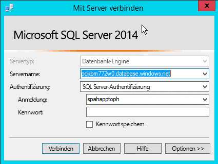
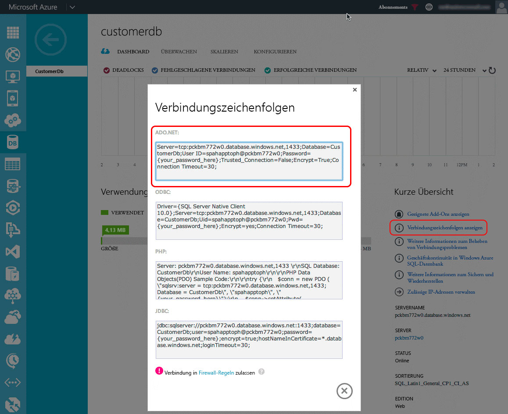
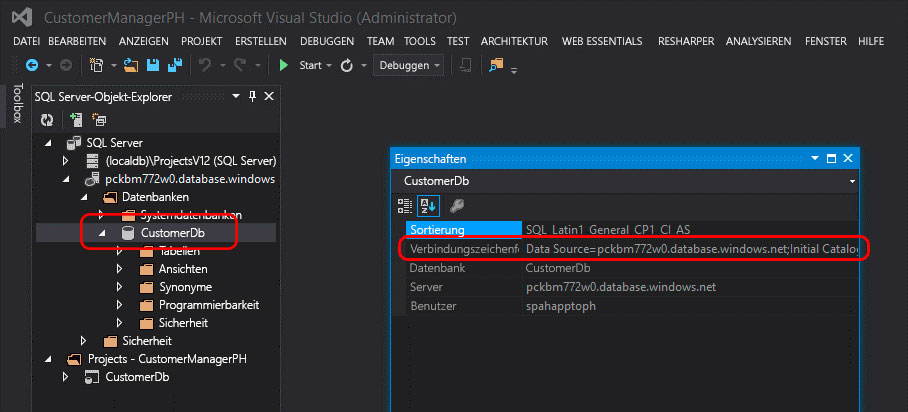

# Konvertieren eines automatisch gehosteten SharePoint-Add-Ins in ein vom Anbieter gehostetes Add-InConvert an autohosted SharePoint Add-in to a provider-hosted add-in
Erfahren Sie, wie Sie ein automatisch gehostetes SharePoint-Add-In in ein vom Anbieter gehostetes Add-In konvertieren können.Learn how to convert an autohosted SharePoint Add-in to a provider-hosted add-in.
 

 **Hinweis** Der Name „Apps für SharePoint“ wird in „SharePoint-Add-Ins“ geändert. Während des Übergangszeitraums wird in der Dokumentation und der Benutzeroberfläche einiger SharePoint-Produkte und Visual Studio-Tools möglicherweise weiterhin der Begriff „Apps für SharePoint“ verwendet. Weitere Informationen finden Sie unter [Neuer Name für Office- und SharePoint-Apps](new-name-for-apps-for-sharepoint.md#bk_newname).**Note**  The name "apps for SharePoint" is changing to "SharePoint Add-ins". During the transition, the documentation and the UI of some SharePoint products and Visual Studio tools might still use the term "apps for SharePoint". For details, see  [New name for apps for Office and SharePoint](new-name-for-apps-for-sharepoint.md#bk_newname).
 

Mit Microsoft SharePoint wurde ein neuer Ansatz für die Erweiterung von SharePoint-Websites zusätzlich zum vorherigen Ansatz eingeführt, der auf der Verwendung lösungsbasierter Anpassungen basiert. Dieses neue Erweiterbarkeitsmodell für SharePoint, das als Add-In-Modell bezeichnet wird, ermöglicht Entwicklern die Erstellung von benutzerdefinierten Implementierungen, die an SharePoint-Umgebungen weitergegeben werden können, unabhängig davon, ob diese in einer lokalen, einer SharePoint Online- oder einer Hybridbereitstellung ausgeführt werden.Microsoft SharePoint introduced a new approach to extending SharePoint sites in addition to the previous approach of using solution-based customizations. This new extensibility model for SharePoint, called the add-in model, enables developers to create custom implementations that can be deployed to SharePoint environments regardless of whether they are running in an on-premises, SharePoint Online, or hybrid deployment.
 

Entwickler können zwei verschiedene Arten von SharePoint-Add-Ins entwickeln. Die erste ist ein von SharePoint gehostetes Add-In, das primär im Browser ausgeführt wird. Alle Ressourcen, die diese unterstützen, wie HTML, CSS, Bilder und JavaScript werden von SharePoint gespeichert und bereitgestellt. Die andere Art von Add-Ins gehört zum Cloud Add-In-Modell (CAM), wird hauptsächlich extern von SharePoint auf einem anderen Server ausgeführt und kommuniziert mit SharePoint über das clientseitige Objektmodell (CSOM) und die REST-API. Bei dieser Art von Add-Ins wird eine Identität über das beliebte OAuth 2.0-Protokoll eingerichtet, das von SharePoint unterstützt wird.Developers can build two different types of SharePoint Add-ins. The first type, a SharePoint-hosted add-in, primarily runs in the browser; and all the assets that support it such as HTML, CSS, images and JavaScript are stored and served by SharePoint. The other types of add-ins fall into the Cloud Add-in model (CAM) and primarily run external to SharePoint on another server and communicate with SharePoint using the client-side object model (CSOM) and REST API. They establish an identity using the popular OAuth 2.0 protocol supported by SharePoint.
 

Entwickler könnten Add-Ins über das Add-In-Modell auf zweierlei Weise implementieren: als vom Anbieter gehostetes Add-In oder als automatisch gehostetes Add-In. Automatisch gehostete Add-Ins wurden als Vorschauprogramm bei der Veröffentlichung von SharePoint eingeführt. Im Mai 2014 kündigte Microsoft jedoch an, dass das Vorschauprogramm beendet und kein Support für das Erstellen von automatisch gehosteten Add-Ins mehr bereitgestellt wird. Die Ankündigung finden Sie unter [Aktualisierte Informationen zum Vorschauprogramm für automatisch gehostete Add-Ins](http://blogs.office.com/2014/05/16/update-on-autohosted-apps-preview-program/).Developers could implement add-ins using the add-in model in one of two ways, either as a provider-hosted add-in or an autohosted add-in. Autohosted add-ins were released as a preview program when SharePoint released, but in May, 2014 Microsoft announced that they would be closing the preview program and would no longer support creating autohosted add-ins. For the announcement, see  [Update on Autohosted Add-ins Preview Program](http://blogs.office.com/2014/05/16/update-on-autohosted-apps-preview-program/).
 
In diesem Artikel werden die Konvertierung und Migration eines automatisch gehosteten Add-Ins zu einem vom Anbieter gehosteten Add-In erläutert. Eine wichtige Voraussetzung ist, dass Entwickler einige spezielle Unterschiede zwischen den zwei Ansätzen verstehen, da dieses Verständnis den Konvertierungsprozess erheblich vereinfacht.This article explains how to convert and migrate an autohosted add-in to a provider-hosted add-in. However, it is important developers understand some specific differences between the two approaches because this knowledge greatly simplifies the conversion process.
 

## Voraussetzungen für die Konvertierung eines automatisch gehosteten Add-Ins in ein vom Anbieter gehostetes Add-InPrerequisites for converting an autohosted add-in to a provider-hosted add-in

- Alle [Voraussetzungen für das Entwickeln von vom Anbieter gehosteten Add-Ins](get-started-creating-provider-hosted-sharepoint-add-ins.md).All of the  [prerequisites for developing provider-hosted add-ins](get-started-creating-provider-hosted-sharepoint-add-ins.md).
    
 
- Azure SDK 2.3, das Sie über [diese Download Center-Seite](http://azure.microsoft.com/downloads) installieren können.Azure SDK v2.3. Install it from here  [this Download Center page](http://azure.microsoft.com/downloads).
    
 

### Kernkonzepte, die Sie kennen solltenCore concepts to know

Bevor Sie ein automatisch gehostetes Add-In in ein vom Anbieter gehostetes Add-In konvertieren, sollten Sie ein grundlegendes Verständnis für SharePoint-Add-Ins und die Unterschiede zwischen von SharePoint gehosteten, vom Anbieter gehosteten und automatisch gehosteten SharePoint-Add-Ins haben. Mit den Informationen in den in Tabelle 1 aufgeführten Artikeln sollten Sie diese Unterschiede verstehen können.Before you convert an autohosted add-in to a provider-hosted add-in, you should have a basic understanding of SharePoint Add-ins and the differences among SharePoint-hosted, provider-hosted, and autohosted SharePoint Add-ins. The articles listed in Table 1 should give you that understanding.
 

 

**Tabelle 1: Kernkonzepte für das Konvertieren eines automatisch gehosteten Add-Ins in ein vom Anbieter gehostetes Add-In****Table 1. Core concepts for converting an autohosted add-in to a provider-hosted add-in**

|**Titel des Artikels****Article title**|**Beschreibung****Description**|
|:-----|:-----|
| [SharePoint-Add-InsSharePoint Add-ins](sharepoint-add-ins.md)|Hier finden Sie Informationen über das neue Add-In-Modell in SharePoint, das es Ihnen ermöglicht, Add-Ins als kompakte, einfach zu verwendende Lösungen für Endbenutzer zu erstellen.Learn about the new add-in model in SharePoint that enables you to create add-ins, which are small, easy-to-use solutions for end users.|
| [Kritische Aspekte der Architektur und der Entwicklungslandschaft für SharePoint-Add-InsImportant aspects of the SharePoint Add-in architecture and development landscape](important-aspects-of-the-sharepoint-add-in-architecture-and-development-landscap.md)|Erfahren Sie mehr über Aspekte der Architektur von SharePoint-Add-Ins und das Modell für SharePoint-Add-Ins, wie z. B. die Hostingoptionen für Add-Ins, Benutzeroberflächenoptionen, das Bereitstellungssystem, das Sicherheitssystem und den Lebenszyklus.Learn about aspects of the architecture of SharePoint Add-ins and the model for SharePoint Add-ins, including the add-in hosting options, user interface (UI) options, deployment system, security system, and lifecycle.|
| [Auswählen von Mustern für die Entwicklung und das Hosting Ihres Add-Ins für SharePointChoose patterns for developing and hosting your SharePoint Add-in](choose-patterns-for-developing-and-hosting-your-sharepoint-add-in.md)|Hier finden Sie Informationen über die verschiedenen Möglichkeiten zum Hosten von SharePoint-Add-Ins.Learn about the various ways that you can host SharePoint Add-ins.|
| [Hostwebs, Add-In-Webs und SharePoint-Komponenten in SharePointHost webs, add-in webs, and SharePoint components in SharePoint](host-webs-add-in-webs-and-sharepoint-components-in-sharepoint.md)|Hier lernen Sie den Unterschied zwischen Hostwebs und Add-In-Webs kennen. Außerdem erfahren Sie, welche SharePoint-Komponenten eines Add-Ins für SharePoint hinzugefügt werden können, welche für das Hostweb bereitgestellt werden, welche für das Add-In-Web bereitgestellt werden und wie das Add-In-Web in einer isolierten Domäne bereitgestellt wird.Learn about the distinction between host webs and add-in webs. Also find out which SharePoint components can be included in a SharePoint Add-in, which are deployed to the host web, which are deployed to the add-in web, and how the add-in web is deployed in an isolated domain.|

## Konvertieren des Add-InsConverting the add-in

Beim Konvertieren eines automatisch gehosteten SharePoint-Add-Ins in ein vom Anbieter gehostetes Add-In müssen zwei oder drei Komponenten geändert werden.Converting an autohosted SharePoint Add-in to a provider-hosted add-in involves modifying two or three components.
 

 

- Das SharePoint-Add-In an sichThe SharePoint add-in itself
    
 
- Die Remotewebanwendung oder -diensteThe remote web application or services
    
 
- Die Microsoft Azure SQL-Datenbank in dem Add-In, falls vorhandenThe Microsoft Azure SQL Database, if any, in the add-in
    
 
Bei einem automatisch gehosteten SharePoint-Add-In wurden die Azure-Website und die Microsoft Azure SQL-Datenbank bei der Installation automatisch bereitgestellt, dagegen können bei vom Anbieter gehosteten Add-Ins die Remotewebanwendung und andere Dienste in jeder beliebigen Webplattform vorhanden sein. In diesem Artikel wird davon ausgegangen, dass die Remotekomponenten des automatisch gehosteten Add-Ins nach der Konvertierung in ein vom Anbieter gehostetes Add-In als Azure-Dienste vorhanden bleiben.A SharePoint autohosted add-in deployed the Azure Web Site and Microsoft Azure SQL Database automatically when it was installed, however provider-hosted add-ins can have their remote web application and other services exist in any web platform. This article assumes that the remote components autohosted add-in are going to be remain as Azure services following the conversion to a provider-hosted add-in.
 

 
In den folgenden Abschnitten ist der Prozess der Konvertierung eines automatisch gehosteten Add-Ins in ein vom Anbieter gehosteten Add-In dargestellt. Das verwendete automatisch gehostete Beispiel-Add-In - Customer Manager - ist einfach, damit Sie sich auf die Konvertierungsschritte statt auf das eigentliche Add-In konzentrieren können. Es besteht aus drei Projekten:The following sections walk through the process of converting an autohosted add-in to a provider-hosted add-in. The example autohosted add-in that is used - Customer Manager - is simple, in order to focus on the conversion steps and not the actual add-in. It consists of three projects:
 

 

- CustomersDb: Ein SQL-Datenbankprojekt, mit dem die erforderliche *.dacpac-Datei generiert wird. Beachten Sie, dass in diesem Projekt kein Schema definiert ist. Es wird einfach verwendet, um eine Datenbank zu erstellen, da das Schema von der ASP.NET-Webanwendung erstellt wird.CustomersDb: A SQL database project that will generate the necessary *.dacpac. Note there is no schema defined in this project. It is simply used to create a database because the schema is created by the ASP.NET web application.
    
 
- CustomerManagerAH: Eine automatisch gehostetes SharePoint-Add-In, dessen Konfiguration das ASP.NET-Webanwendungsprojekt und die Azure SQL-Datenebenenanwendung in das resultierende SharePoint-Add-In-Paket einschließt.CustomerManagerAH: A SharePoint autohosted add-in that is configured to include the ASP.NET web application project and Azure SQL data-tier application in the resulting SharePoint add-in package.
    
 
- CustomerManagerAHWeb: Eine ASP.NET-MVC-Webanwendung, die dem Code First-Migrationsansatz von Entity Framework folgt, um das Datenbankschema zu erstellen sowie Lese- und Schreibvorgänge in der Datenbank auszuführen.CustomerManagerAHWeb: An ASP.NET MVC web application that uses the Entity Framework Code First with Migrations approach to create the database schema as well as read and write to the database.
    
 
Das Add-In ist eine ASP.NET-MVC-Webanwendung, mit der sowohl die Kunden aus einer Tabelle in einer Microsoft Azure SQL-Datenbank angezeigt als auch neue Kunden hinzugefügt werden können. Mit dieser anonymen Webanwendung kann jede Person Kunden anzeigen oder hinzufügen. Die Visual Studio-Lösung für das automatisch gehostete Add-In und damit verbundene Projekte kann aus dem folgenden öffentlichen Repository heruntergeladen werden:  [Autohosted-Migration-Code-Samples](https://github.com/OfficeDev/Auto-Hosted-Migration-Code-Samples).The add-in is an ASP.NET MVC web application that can both show the customers from a table in an Microsoft Azure SQL Database as well as add new customers. This is an anonymous web application that will allow anyone to view or add customers. The Visual Studio solution for the autohosted add-in and associated projects can be downloaded from the following public repository:  [Autohosted-Migration-Code-Samples](https://github.com/OfficeDev/Auto-Hosted-Migration-Code-Samples).
 

 
Für das Konvertieren eines automatisch gehosteten SharePoint-Add-Ins in ein vom Anbieter gehostetes Add-In sind mehrere Schritte erforderlich, die jeweils in den folgenden Abschnitten dargestellt sind.Converting a SharePoint autohosted add-in to a provider-hosted add-in involves multiple steps. Each is outlined in the following sections.
 

 

1. Bereitstellen der Microsoft Azure SQL-DatenbankDeploy the Microsoft Azure SQL Database
    
 
2. Erstellen der Azure-Website zum Hosten der RemotewebanwendungCreate the Azure Web Site to host the remote web application
    
 
3. Registrieren des Add-Ins bei Ihrer SharePoint-WebsiteRegister the add-in with your SharePoint site
    
 
4. Aktualisieren und Bereitstellen der Azure-Website für die RemotewebanwendungUpdate and deploy the Azure Web Site for the remote web application
    
 
5. Aktualisieren und Bereitstellen des vom Anbieter gehosteten SharePoint-Add-InsUpdate and deploy the SharePoint provider-hosted add-in
    
 

### Bereitstellen der Azure SQL-DatenbankDeploy the Azure SQL Database

Der erste Schritt beim Konvertieren des automatisch gehosteten Add-Ins in ein vom Anbieter gehostetes Add-In besteht darin, die Microsoft Azure SQL-Datenbank bereitzustellen, auf der die ASP.NET-Webanwendung basiert. Sie können eine Microsoft Azure SQL-Datenbank mit verschiedenen Methoden erstellen, von denen einige auf der Microsoft Azure-Dokumentationswebsite dokumentiert sind:  [So stellen Sie eine Datenbank für Azure bereit](http://azure.microsoft.com/documentation/articles/sql-database-deploy/).The first step in converting the autohosted add-in to a provider-hosted add-in is to deploy the Microsoft Azure SQL Database that the ASP.NET web application will rely on. There are many different ways to create a Microsoft Azure SQL Database, some of which are documented on the Microsoft Azure documentation site:  [How to Deploy a Database to Azure](http://azure.microsoft.com/documentation/articles/sql-database-deploy/).
 

 
Bei dem in den folgenden Schritten dargestellten Ansatz wird das Datenebenenanwendungs-Bereitstellungsmodell verwendet, da die Datenbank auf diese Weise in einem automatisch gehosteten SharePoint-Add-In bereitgestellt wird. Dabei wird ein Datenebenenanwendungspaket (*.dacpac) erstellt und für die Erstellung der Datenbank verwendet.The approach outlined in the following steps uses the data-tier application deployment model because that is how the database is deployed in a SharePoint autohosted add-in. This involves generating a data-tier application package (*.dacpac) and using it to create the database.
 

 

#### Erstellen und Bereitstellen der Azure SQL-DatenbankCreating and Deploying the Azure SQL Database

Öffnen Sie zunächst die automatisch gehostete Lösung in Visual Studio. Klicken Sie mit der rechten Maustaste auf das Datenbankprojekt **CustomerDb**, und wählen Sie **Erstellen** aus. Damit wird die Datei „CustomerDb.dacpac“ im Ordner `[..]\bin\[debug | release]` erstellt.First open the autohosted solution in Visual Studio. Right-click the database project  **CustomerDb** and select **Build**. This will generate the CustomerDb.dacpac file in the  `[..]\bin\[debug | release]` folder.
 

 
Der nächste Schritt ist die Erstellung einer neuen Microsoft Azure SQL-Datenbank. Melden Sie sich beim **Azure-Verwaltungsportal** (https://manage.windowsazure.com) an, und wählen Sie nach dem Laden des Dashboards den Link SQL-DATENBANKEN am Seitenrand aus:The next step is to create a new Microsoft Azure SQL Database. Login to the  **Azure Management Portal** (https://manage.windowsazure.com) and once the dashboard loads, select the SQL DATABASES link in the margin:
 

 

**Dashboard für die Azure SQL-Datenbank im Azure-Verwaltungsportal****Azure SQL Database dashboard in the Azure Management Portal**

 

 

 
Klicken Sie im obersten Navigationsbereich auf den Link **SERVER**, und klicken Sie dann in der Fußzeile auf die Schaltfläche **HINZUFÜGEN**, wie in der folgenden Abbildung gezeigt:Click the  **SERVERS** link in the top navigation and then click the **ADD** button in the footer as shown in the following figure:
 

 

**Dashboard für die Azure SQL-Datenbank im Azure-Verwaltungsportal****Azure SQL Database dashboard in the Azure Management Portal**

 

 

 
Wählen Sie im daraufhin angezeigten Dialogfeld **SERVER ERSTELLEN** das Azure-**ABONNEMENT**, den **ANMELDENAMEN** und das **KENNWORT** für den Benutzer, der Rechte auf dem Server haben wird, und dieselbe **REGION** aus, die beim Erstellen der Azure-Website zuvor verwendet wurde. Notieren Sie den Anmeldenamen und das Kennwort, da diese in einem späteren Schritt benötigt werden.In the  **CREATE SERVER** dialog that appears, select the Azure **SUBSCRIPTION**, the  **LOGIN NAME** and **PASSWORD** for the user who will have rights to the server and select the same **REGION** used when creating the Azure Web Site previously. Make a note of the login name and password as those will be needed in a later step.
 

 

**Erstellen einer Azure SQL-Datenbank im Azure-Verwaltungsportal****Creating an Azure SQL Database in the Azure Management Portal**

 

 

 
Nachdem das Formular ausgefüllt wurde, klicken Sie auf das **Häkchensymbol** unten rechts, um die Datenbank zu erstellen. Während jetzt der Server erstellt wird, können als einzige Ressource nur andere Azure-Dienste darauf zugreifen. Notieren Sie den Namen der Microsoft Azure SQL-Datenbank, da dieser in einem späteren Schritt benötigt wird.Once the form is filled out, click the  **check icon** in the lower right to create the database. While the server is now created, the only resource that can access it are other Azure services. Make a note of the name of the Microsoft Azure SQL Database because this will be needed in a later step.
 

 
Zum Herstellen einer Verbindung mit der Microsoft Azure SQL-Datenbank und zum Bereitstellen der Datenbank muss eine Firewallregel erstellt werden, mit der der Datenverkehr von dem Computer zugelassen wird, der die Datenbank bereitstellt. Andernfalls werden Verbindungen mit der Microsoft Azure SQL-Datenbank mit Fehlern wie dem in der folgenden Abbildung gezeigten verweigert:In order to connect to the Microsoft Azure SQL Database and deploy the database, a firewall rule must be created that allows traffic from the computer that will deploy the database. Otherwise connections to the Microsoft Azure SQL Database will be refused with errors similar to the one in the following figure:
 

 

**Fehler beim Herstellen einer Verbindung mit einer Azure SQL-Datenbank****Error Connecting to an Azure SQL Database**

 

 

 
Zum Erstellen einer Firewallregel wählen Sie im **Azure-Verwaltungsportal** die zuvor erstellte Microsoft Azure SQL-Datenbank aus und klicken dann im obersten Navigationsbereich auf den Link **KONFIGURIEREN**. Unter dem Abschnitt **Zugelassene IP-Adressen** wird derzeit Ihre IP-Adresse angezeigt, wie in der folgenden Abbildung dargestellt. Klicken Sie auf **ZU DEN ZUGELASSENEN IP-ADRESSEN HINZUFÜGEN**, um eine Firewallregel hinzuzufügen. Damit werden Verbindungen mit der Microsoft Azure SQL-Datenbank und die Bereitstellung der Datenbank zugelassen. Achten Sie darauf, in der Fußzeile auf die Schaltfläche **Speichern** zu klicken.To create a firewall rule, within the  **Azure Management Portal**, select the Microsoft Azure SQL Database previously created and then click the  **CONFIGURE** link in the top navigation. Under the **Allowed IP Addresses** section, your IP address is currently shown as shown in the following figure. Click **ADD TO THE ALLOWED IP ADDRESSES** to add a firewall rule. Doing so will allow connections to the Microsoft Azure SQL Database and deployment of the database. Make sure to click the **Save** button in the footer.
 

 

**Erstellen einer Firewallregel für eine Azure SQL-Datenbank im Azure-Verwaltungsportal****Creating a firewall rule for an Azure SQL Database in the Azure Management Portal**

 

 

 
Der nächste Schritt ist die Bereitstellung der Datenbank und kann über das Azure SDK 2.3 in Visual Studio durchgeführt werden. Installieren Sie das SDK über [diese Download Center-Seite](http://azure.microsoft.com/downloads). Öffnen Sie in Visual Studio das Toolfenster **SQL Server-Objekt-Explorer**, klicken Sie mit der rechten Maustaste auf den Knoten **SQL Server**, und wählen Sie **SQL Server hinzufügen** aus:The next step is to deploy the database. This can be done from Visual Studio using the Azure SDK v2.3. Install it from  [this Download Center page](http://azure.microsoft.com/downloads). Within Visual Studio, open the  **SQL Server Object Explorer** tool window, right-click the **SQL Server** node and select **Add SQL Server**:
 

 

**Hinzufügen einer Azure SQL-Datenbank im Server-Explorer****Adding an Azure SQL Database in Server Explorer**

 

 

 
Geben Sie im Dialogfeld **Mit Server verbinden** den **Servernamen** ein, legen Sie die **Authentifizierung** auf **SQL Server-Authentifizierung** fest, und geben Sie denselben **Anmeldenamen** und dasselbe **Kennwort** ein, die beim Erstellen der Microsoft Azure SQL-Datenbank definiert wurden. Der Servername sollte der vollqualifizierte Name des Servers sein, in diesem Fall `[server-name].database.windows.net`, wie in der folgenden Abbildung gezeigt:In the  **Connect to Server** dialog, enter the **Server Name**, set the  **Authentication** to **SQL Server Authentication** and enter the same **Login** and **Password** defined when creating the Microsoft Azure SQL Database. The server name should be the fully qualified name of the server which is `[server-name].database.windows.net`, as shown in the following figure:
 

 

**Herstellen einer Verbindung mit einer Azure SQL-Datenbank in Visual Studio****Connecting to an Azure SQL Database in Visual Studio**

 

 

 
Erweitern Sie nach dem Herstellen der Verbindung mit der Microsoft Azure SQL-Datenbank den Knoten für den neu hinzugefügten Server, klicken Sie mit der rechten Maustaste auf den Knoten **Datenbanken**, und wählen Sie **Datenebenenanwendung veröffentlichen** aus, um den Assistent für Veröffentlichungen aufzurufen.After connecting to the Microsoft Azure SQL Database, expand the node for the newly added server, right-click on the  **Databases** node and select **Publish Data-tier Application** to bring up the publishing wizard.
 

 
Klicken Sie im Abschnitt **Quell-Datenebenenanwendung (.dacpac)** auf die Schaltfläche **Durchsuchen**, um nach der *.dacpac-Datei zu suchen, die beim Erstellen des Datenbankprojekts in einem vorherigen Schritt generiert wurde. Vergewissern Sie sich, dass der **Datenbankname** auf „CustomerDb“ festgelegt ist, und klicken Sie dann auf **Veröffentlichen**, um die CustomerDb in der Microsoft Azure SQL-Datenbank zu veröffentlichen.In the section  **Source Data-tier Application (.dacpac)**, use the  **Browse** button to find the *.dacpac file generated from when the database project was built in a previous step and ensure the **Database Name** is set toCustomerDb, then click  **Publish** to publish the CustomerDb in the Microsoft Azure SQL Database.
 

 

**Veröffentlichen einer Datenebenenanwendung an eine Azure SQL-Datenbank mithilfe von Visual Studio****Publishing a Data-tier Application to an Azure SQL Database using Visual Studio**

 

 

 
Aktualisieren Sie das Visual Studio-Toolfenster **SQL Server-Objekt-Explorer**, um zu sehen, dass CustomerDb unter dem Knoten **Datenbanken** aufgelistet ist.Refresh the Visual Studio  **SQL Server Object Explorer** tool window to see the CustomerDb listed under the **Databases** node.
 

 

    
 **Hinweis** Abhängig davon, wie die Datenbank für das automatisch gehostete Add-In erstellt wurde, sind möglicherweise einige weitere Schritte erforderlich, um es für Azure bereitzustellen. Zusätzliche Anweisungen finden Sie in den folgenden Artikeln in MSDN: [Konvertieren zwischen Datenebenenanwendungs-Projekten und Datenbankprojekten](http://msdn.microsoft.com/library/40b51f5a-d52c-44ac-8f84-037a0917af33.aspx) [Erstellen und Verwalten von Datenebenenanwendungen](http://msdn.microsoft.com/library/18907b6c-7678-4182-9304-fe56fdb9f0bd.aspx)**Note**   Depending on how the database was created for the autohosted add-in, some extra work might be necessary to deploy it to Azure. Refer to the following articles in MSDN for additional guidance: [Converting between Data-tier Application Projects and Database Projects](http://msdn.microsoft.com/library/40b51f5a-d52c-44ac-8f84-037a0917af33.aspx) [Creating &amp; Managing Data-Tier Application](http://msdn.microsoft.com/library/18907b6c-7678-4182-9304-fe56fdb9f0bd.aspx)
 

#### Aktionen nach der BereitstellungPost-deployment actions

Nachdem die Microsoft Azure SQL-Datenbank erstellt wurde, erstellen Sie eine Kopie der Verbindungszeichenfolge, die für die Herstellung einer Verbindung mit der Datenbank verwendet wird. Dies kann auf zweierlei Weise erfolgen. Erstens können Sie sich beim **Azure-Verwaltungsportal** (https://manage.windowsazure.com) anmelden und zu der im letzten Schritt erstellten Microsoft Azure SQL-Datenbank navigieren: CustomerDb. Klicken Sie auf der Seite **DASHBOARD** für die Datenbank auf den Link **Verbindungszeichenfolgen anzeigen**, um eine Liste der Verbindungszeichenfolgen anzuzeigen. Erstellen Sie eine Kopie der Verbindungszeichenfolge **ADO.NET** zur späteren Verwendung.Once the Microsoft Azure SQL Database has been created, make a copy of the connection string used to establish a connection to the database. This can be obtained two ways. One way is to login to the  **Azure Management Portal** (https://manage.windowsazure.com) and navigate to the Microsoft Azure SQL Database created in the last step: CustomerDb. On the **DASHBOARD** page for the database, click the link **Show Connection Strings** to see a list of connection strings. Make a copy of the **ADO.NET** connection string for later use.
 

 

**Abrufen von Azure SQL-Datenbankverbindungszeichenfolgen aus dem Azure-Verwaltungsportal****Obtaining Azure SQL Database Connection Strings from the Azure Management Portal**

 

 

 
Zweitens können Sie die Verbindungszeichenfolge innerhalb von Visual Studio abrufen, vorausgesetzt, dass das Azure SDK v2.3 installiert ist. Wählen Sie im Toolfenster **SQL Server-Objekt-Explorer** in Visual Studio die Datenbank **CustomerDb** aus, und werfen Sie dann einen Blick in das Toolfenster **Eigenschaften**, in dem die Verbindungszeichenfolge angezeigt wird. Dies ist derselbe Wert wie im **Azure-Verwaltungsportal** oben.The other way to get the connection string is from within Visual Studio, provided the Azure SDK v2.3 is installed. Within the  **SQL Server Object Explorer** tool window in Visual Studio, select the database **CustomerDb**. Once the database is selected, look at the  **Properties** tool window to see connection string. This is the same value found in the **Azure Management Portal** above.
 

 

**Abrufen von Azure SQL-Datenbankverbindungszeichenfolgen in Visual Studio über das Azure SDK****Obtaining Azure SQL Database Connection Strings from Visual Studio via the Azure SDK**

 

 

 

 

 

### Erstellen einer Azure-WebsiteCreate an Azure Web Site

Der nächste Schritt ist die Erstellung einer neuen Azure-Website, auf der sich die Remotewebanwendung für das vom Anbieter gehostete Add-In befindet. Dieser Schritt muss zuerst durchgeführt werden, weil die URL der Remotewebanwendung vor der Registrierung des Add-Ins benötigt wird. Die Registrierung des Add-Ins in SharePoint sollte jedoch vor der Bereitstellung der Dateien für die ASP.NET-Webanwendung erfolgen, da es zwei Ausgaben aus dem Registrierungsvorgang gibt (die Client-ID und den geheimen Clientschlüssel), die vor der Bereitstellung der ASP.NET-Webanwendungsdateien erforderlich sind.The next step is to create a new Azure Web Site where the remote web application will reside for the provider-hosted add-in. This has to be done first because the URL of the remote web application is needed before registering the add-in. However, the registration of the add-in in SharePoint should precede the deployment of the files for the ASP.NET web application because there are two outputs from the registration process (the Client ID and Client Secret) that are needed prior to the deployment of the ASP.NET web application files.
 

 
Melden Sie sich zum Erstellen einer neuen Azure-Website zuerst beim **Azure-Verwaltungsportal** (https://manage.windowsazure.com) an. Wenn das Dashboard geladen ist, klicken Sie auf den Navigationslink **WEBSITES** am linken Rand und dann auf die Schaltfläche **NEU** in der Fußzeile, wie in der folgenden Abbildung gezeigt:To create a new Azure Web Site, first login to the  **Azure Management Portal** (https://manage.windowsazure.com). When the dashboard loads, click the **WEB SITES** navigation link in the left-hand margin, and then the **NEW** button in the footer as shown in the following figure:
 

 

**Azure-Website-Dashboard im Azure-Verwaltungsportal****Azure Web Site dashboard in the Azure Management Portal**

 

 

 
Wählen Sie danach im Assistenten zum Erstellen einer Website **BERECHNEN**, **WEBSITE**, **SCHNELLERFASSUNG** aus, und geben Sie eine **URL** und einen **WEBHOSTINGPLAN** an. Geben Sie schließlich die **REGION** an, in der die Website erstellt werden soll. Merken Sie sich unbedingt die Region, da diese Region für die später zu erstellende Microsoft Azure SQL-Datenbank verwendet werden muss. Wenn noch kein Webhostingplan vorhanden oder ein neuer erwünscht ist, wählen Sie darüber hinaus die Option **Neuen Webhostingplan erstellen** aus. In der folgenden Abbildung ist ein Beispiel gezeigt:Next, in the new web site wizard, select  **COMPUTE**,  **WEB SITE**,  **QUICK CREATE** and then specify a **URL** and **WEB HOSTING PLAN**. Finally specify the  **REGION** where the web site should be created. Make sure to remember the region selected because the same region should be used for the Microsoft Azure SQL Database created later. In addition, if a web hosting plan does not already exist or a new one is desired, select the option **Create new web hosting plan**. The following figure shows an example:
 

 

**Erstellen einer Azure-Website im Azure-Verwaltungsportal****Creating an Azure Web Site in the Azure Management Portal**

 

 

 
Notieren Sie nach dem Erstellen der Azure-Website die URL, die für die Website verwendet wird. In den Abbildungen oben wird die Website  `http://spahapptoph.azurewebsites.net` erstellt.After creating the Azure Web Site, make a note of the URL that is used for the site. In the figures above, the site created is  `http://spahapptoph.azurewebsites.net`. 
 

 

### Registrieren eines neuen Add-InsRegister a new add-in

Alle über das Add-In-Modell erstellten SharePoint-Add-Ins müssen bei der hostenden SharePoint-Farm oder dem hostenden Mandanten registriert werden, um eine Vertrauensstellung zwischen SharePoint und der Remotewebanwendung herzustellen. Dafür muss ein neuer Add-In-Prinzipal bei SharePoint registriert werden, in dem die folgenden Werte angegeben sind:All SharePoint Add-ins created using the add-in model must be registered with the hosting SharePoint farm or tenancy in order to establish a trust between SharePoint and the remote web application. This involves registering a new add-in principal with SharePoint specifying the following values:
 

 

-  **Client-ID**: die Add-In-ID**Client ID** - the add-in ID
    
 
-  **Geheimer Clientschlüssel**: das Add-In-Kennwort**Client Secret** - the add-in password
    
 
-  **Titel**: der Name des Add-Ins**Title** - the name of the add-in
    
 
-  **Add-In-Domäne**: die Domäne der obersten Ebene der Remotewebanwendung**Add-in Domain** - the top-level domain of the remote web application
    
 
Wenn ein automatisch gehostetes Add-In in SharePoint Online installiert wird, erstellt Office 365 automatisch den Add-In-Prinzipal. Office 365 kennt die URL der Remotewebanwendung, da die Website automatisch erstellt wird. Außerdem fügt Office 365 die Client-ID und den geheimen Clientschlüssel zur web.config-Datei der Remotewebanwendung hinzu. Eine von Microsoft bereitgestellte Klasse (in der Datei TokenHelper.cs oder .vb) sucht in dieser Datei nach diesen Angaben, wenn Anforderungen validiert und mit SharePoint authentifiziert werden.When an autohosted add-in is installed in SharePoint Online, Office 365 creates the add-in principal automatically. It knows the URL of the remote web application because it creates the site automatically. It also takes the client ID and client secret and adds them to the remote web application's web.config. The web.config is where a class provided by Microsoft (in the TokenHelper.cs or .vb file) will look for them when validating requests and authenticating with SharePoint.
 

 
In einem vom Anbieter gehosteten Add-In muss der Entwickler das Add-In jedoch manuell registrieren und die web.config-Datei im ASP.NET-Webprojekt manuell aktualisieren.However, in a provider-hosted add-in, the developer has to manually register the add-in and manually update the web.config in the ASP.NET web project.
 

 
Zum Registrieren eines neuen Add-Ins navigieren Sie zur Add-In-Registrierungsseite der SharePoint-Website, auf der das Add-In installiert wird. Diese Seite finden Sie unter `http://[SharePoint-site-url]/_layouts/15/appregnew.aspx`. Legen Sie auf der Add-In-Registrierungsseite die Option **Add-In-Typ** auf **Ein auf einem Webserver ausgeführtes Add-In** fest, und klicken Sie auf die zwei Schaltflächen **Generieren**, um eine neue **Client-ID** und den **geheimen Clientschlüssel** zu erstellen. Geben Sie den Namen des Add-Ins in das Feld **Titel** und die URL der im vorherigen Schritt erstellten Ziel-Azure-Website in das Feld **Add-In-Domäne** ein. Klicken Sie abschließend auf die Schaltfläche **Erstellen**.To register a new add-in, browse to the add-in registration page of the SharePoint website's where the add-in will be installed. This page is found at  `http://[SharePoint-site-url]/_layouts/15/appregnew.aspx`. On the add-in registration page, set the  **Add-in Type** to **An add-in running on a web server** and click the two **Generate** buttons to create a new **Client Id** and **Client Secret**. Enter the name of the add-in in the  **Title** field and the URL of the target Azure Web Site created it the previous step in the **Add-in Domain** field. Finally, click the **Create** button.
 

 
Nachdem das Add-In registriert wurde, zeigt SharePoint eine Zusammenfassung der Informationen an, die im Formular zum Erstellen der Registrierung verwendet wurden. Es ist sehr wichtig, diese Informationen zur sicheren Aufbewahrung zu kopieren, insbesondere die Client-ID und den geheimen Clientschlüssel, da diese in einem späteren Schritt benötigt werden.After the add-in has been registered, SharePoint will display a summary of the information that was used in the form to create the registration. It is very important that this information is copied for safekeeping, specifically the Client Id and Client Secret, because these are needed in a later step.
 

 

### Remotewebanwendung/Azure-Website - Änderungen der KonfigurationRemote web application / Azure Web Site configuration changes

Der nächste Schritt besteht darin, die Remotewebanwendung neu zu konfigurieren, damit sie als ein vom Anbieter gehostetes statt ein automatisch gehostetes Add-In bereitgestellt werden kann. Es gibt zahlreiche Methoden für die Bereitstellung einer ASP.NET-Website an eine Azure-Website, darunter die direkte Bereitstellung von Visual Studio, die automatische Bereitstellung über eine Quellcodeverwaltung wie Visual Studio Online, die Bereitstellung über GitHub oder sogar die bewährte FTP-Option. In diesem Artikel wird Visual Studio verwendet. Bevor die Webanwendung jedoch bereitgestellt werden kann, sind einige Aktualisierungen erforderlich, damit sie mit dem vom Anbieter gehosteten Add-In verwendet werden kann.The next step is to reconfigure the remote web application so that it can be deployed as a provider-hosted add-in instead of an autohosted add-in. There are multiple ways to deploy an ASP.NET site to an Azure Web Site including deploying it straight from Visual Studio, automatically from source control like Visual Studio Online, or from GitHub, or even by using the tried and true FTP option. In this article Visual Studio is used. However before the web application can be deployed, it first needs a few updates in order to work with the provider-hosted add-in.
 

 

#### Aktualisieren des Remote-WebanwendungsprojektsUpdate the remote web application project

Die wichtigste Änderung in der ASP.NET-MVC-Webanwendung findet in der web.config-Datei statt. In dieser Datei finden Sie drei Einstellungen im Knoten **<appSettings>**: **ClientId**, **ClientSecret** und **SqlAzureConnectionString**. Die ersten zwei werden von den von Microsoft bereitgestellten Klassen in TokenHelper.cs oder .vb verwendet, um die Authentifizierung und Kommunikation mit SharePoint von der Remotewebanwendung zu erleichtern. Letztere, `SqlAzureConnectionString`, wird von dem Add-In verwendet, um die Verbindung mit der Microsoft Azure SQL-Datenbank herzustellen.The big change that needs to occur in the ASP.NET MVC web application is within the web.config file. Within this file there are three settings found within the  **<appSettings>** node. These are the **ClientId**,  **ClientSecret**, and  **SqlAzureConnectionString**. The first two are used by the Microsoft-provided class, in TokenHelper.cs or .vb, to facilitate authenticating and communicating with SharePoint from the remote web application. The latter,  `SqlAzureConnectionString`, is used by the add-in to connect to the Microsoft Azure SQL Database.
 

 
In einem automatisch gehosteten SharePoint-Add-In füllt Office 365 die Werte für diese Einstellungen aus, wenn die Azure-Website und die Microsoft Azure SQL-Datenbank bei der Installation des Add-Ins erstellt werden. In einem vom Anbieter gehosteten Add-In müssen diese Werte jedoch manuell festgelegt werden, bevor das Add-In bereitgestellt wird.In a SharePoint autohosted add-in, Office 365 fills in the values for these settings when the Azure Web Site and Microsoft Azure SQL Database are created when the add-in is installed. However in a provider-hosted add-in these must be manually set before the add-in is deployed.
 

 
Ein Option besteht darin, die Werte für die drei Einstellungen aus den Schritten oben zu kopieren und einzufügen, der Nachteil bei diesem Ansatz ist jedoch, dass die web.config-Datei, wenn die Werte jemals geändert werden müssen, manuell aktualisiert und erneut an die Azure-Website bereitgestellt werden muss.One option is to paste in the values for the three settings from the steps above, but the disadvantage with this approach is that if they ever need to be changed, the web.config will need to be manually updated and redeployed to the Azure Web Site.
 

 
Eine andere Option besteht darin, diese Einstellungen einfach zu löschen (die Einstellungsschlüssel beizubehalten und nur das Attribut **value=""** auf eine leere Zeichenfolge festzulegen) und sie stattdessen in den Azure-Website-Einstellungen für das **Verwaltungsportal** zu definieren. Dieser Ansatz bedeutet, dass die Einstellungen geändert werden können, ohne die Codebasis zu aktualisieren.Another option is to simply clear these settings (leave the settings keys in place, just set the  **value=""** attribute to an empty string) and instead define them in the Azure Web Site settings through the **Azure Management Portal**. This approach means that the settings can be changed without updating the codebase.
 

 
Melden Sie sich dafür beim **Azure-Verwaltungsportal** (https://manage.windowsazure.com) an, und navigieren Sie zu der in den vorherigen Schritten erstellten Azure-Website. Klicken Sie auf der Azure-Website-Dashboard-Seite im obersten Navigationsmenü auf **KONFIGURIEREN**, und blättern Sie dann zum Abschnitt **Add-In-Einstellungen** herunter. Fügen Sie drei neue Add-In-Einstellungen hinzu, indem Sie dieselben Einstellungsnamen wie in der web.config-Datei verwenden. Benutzen Sie die in den vorherigen Schritten ermittelten Werte für ClientId, ClientSecret und SqlAzureConnectionString.To do this, login to the  **Azure Management Portal** (https://manage.windowsazure.com) and navigate to the Azure Web Site created in the previous steps. On the Azure Web Site dashboard page, click **CONFIGURE** in the top navigation menu and then scroll down to the **add-in settings** section. Add three new add-in settings using the same same setting names from the web.config file. Use the values obtained in the previous steps for ClientId, ClientSecret, and SqlAzureConnectionString.
 

 
Vergewissern Sie sich, dass die Microsoft Azure SQL-Datenbank-Verbindungszeichenfolge korrekt und gültig ist, denn wenn die Verbindungszeichenfolge über das **Azure-Verwaltungsportal** und Visual Studio verfügbar gemacht wird, wird das Kennwortattribut durch eine Maske ersetzt. Das maskierte Kennwort in der Verbindungszeichenfolge sollte in das korrekte Kennwort geändert werden, das beim Erstellen der Anmeldung für die Microsoft Azure SQL-Datenbank definiert wurde.Make sure the Microsoft Azure SQL Database connection string is correct and valid because, when the connection string is exposed through the  **Azure Management Portal** and Visual Studio, the password attribute is replaced with a mask. The masked password in the connection string should be changed to use the correct password defined when creating the login for the Microsoft Azure SQL Database.
 

 

#### Bereitstellen der Remotewebanwendung an die Azure-WebsiteDeploying the Remote web application to the Azure Web Site

Jetzt müssen die ASP.NET-MVC-Webanwendungsdateien an die Azure-Website als Remotewebanwendung bereitgestellt werden. Klicken Sie in Visual Studio mit der rechten Maustaste auf das Webprojekt, und wählen Sie **Veröffentlichen** aus. Damit wird das Dialogfeld des Assistenten **Web veröffentlichen** angezeigt. Wählen Sie in diesem Dialogfeld die Option **Windows Azure-Websites** aus, und klicken Sie auf **Veröffentlichen**.Now the ASP.NET MVC web application files need to be deployed to the Azure Web Site as the remote web application. Within Visual Studio, right-click the web project and select  **Publish**. This will launch the  **Publish Web** wizard dialog. In this dialog select the option **Windows Azure Web Sites** and click **Publish**.
 

 

**Das Dialogfeld „Web veröffentlichen“ in Visual Studio****Visual Studio's Publish Web Dialog**

 

 

 
Wählen Sie im nächsten Schritt den Namen der Azure-Website aus, die in einem vorherigen Schritt erstellt wurde, wie in der folgenden Abbildung gezeigt. Klicken Sie auf **OK**, und vergewissern Sie sich, dass die URL der Website HTTPS enthält.In the next step, select the name of the Azure Web Site that was created in a previous step as shown in the following figure, click  **OK**, and ensure the URL of the site is HTTPS.
 

 

**Veröffentlichen der ASP.NET-Webanwendung an eine vorhandene Azure-Website****Publishing the ASP.NET web application to an existing Azure Web Site**

 

 

 
Klicken Sie im letzten Schritt auf die Schaltfläche **Verbindung überprüfen**, um sicherzustellen, dass die Einstellungen und die Verbindung ordnungsgemäß funktionieren, und klicken Sie abschließend auf **Veröffentlichen**. Damit wird die Bereitstellung der ASP.NET-Webanwendung an die Azure-Website durch Visual Studio ausgelöst.In the last step, click the button  **Validate Connection** to ensure the settings and connection is in good working order and finally click **Publish**. This will trigger Visual Studio to deploy the ASP.NET web application to the Azure Web Site. 
 

 
Nach der Bereitstellung der Website startet Visual Studio den Standard-Debugging-Browser und navigiert zur Azure-Website. Die Website wird jedoch mit einem Fehler wiedergegeben. Der Grund ist, dass die ASP.NET-MVC-Controller mit einem Attribut (insbesondere  `SharePointContextFilter`) ausgestattet sind, das von SharePoint erwartet, dass bestimmte Werte an den Controller im Header einer HTTP POST-Anforderung gesendet werden, der Browser aber standardmäßig eine HTTP GET-Anforderung startet, deshalb wird dieser Fehler erwartet.After deploying the website, Visual Studio will launch the default debugging browser and navigate to the Azure Web Site. However the site will render with an error. This is because the ASP.NET MVC controllers are decorated with an attribute (specifically the  `SharePointContextFilter`) that expects SharePoint to send certain values to the controller in the header of an HTTP POST request, but by default the browser launched an HTTP GET request, so this error is expected.
 

 

    
 **Hinweis** Zusätzliche Optionen für das Bereitstellen von ASP.NET-Webanwendungen an eine Azure-Website finden Sie in der Azure-Dokumentation: [Bereitstellen einer Microsoft Azure-Website](http://azure.microsoft.com/documentation/articles/web-sites-deploy).**Note**  Refer to the Azure documentation for additional options for deploying ASP.NET web applications to an Azure Web Site:  [How to Deploy a Microsoft Azure Web Site](http://azure.microsoft.com/documentation/articles/web-sites-deploy).
 

#### Aktionen nach der BereitstellungPost-deployment actions

Der nächste Schritt besteht darin, die URL der Website zu kopieren.The next step is to copy the URL of the site.
 

 

#### Benutzerdefinierte Domänen und SSL-Zertifikate für Azure-WebsitesCustom Domains and SSL Certificates for Azure Web Sites

Für alle Azure-Websites wird die folgende Benennungskonvention verwendet:  `http[s]://[site-name].azurewebsites.net`. Microsoft hat allen Websites unter der  `*.azurewebsites.net`-Domäne ein Platzhalter-SSL-Zertifikat hinzugefügt, aber Kunden können auch beliebig eine benutzerdefinierte Domäne mit ihrer Azure-Website verbinden oder eigene SSL-Zertifikate für diese benutzerdefinierten Domänen verwenden.All Azure Web Sites use the following naming convention:  `http[s]://[site-name].azurewebsites.net`. Microsoft has already added a wildcard SSL certificate to all web sites under the  `*.azurewebsites.net` domain, but customers are free to associate a custom domain with their Azure Web Site as well as use their own SSL certificates for these custom domains.
 

 
Informationen zum Verwenden benutzerdefinierter Domänen finden Sie in der Azure-Dokumentation:  [Konfigurieren eines benutzerdefinierten Domänennamens für eine Microsoft Azure-Website](http://azure.microsoft.com/documentation/articles/web-sites-custom-domain-name). Informationen zum Hinzufügen eines benutzerdefinierten SSL-Zertifikats für Ihren benutzerdefinierten Domänennamen finden Sie in der Azure-Dokumentation:  [Aktivieren von HTTPS für eine Microsoft Azure-Website](http://azure.microsoft.com/documentation/articles/web-sites-configure-ssl-certificate).For information on using custom domains, refer to the Azure documentation:  [Configure a Custom Domain Name for a Microsoft Azure Web Site](http://azure.microsoft.com/documentation/articles/web-sites-custom-domain-name). For information on adding a custom SSL certificate for your custom domain name, refer to the Azure documentation:  [Enable HTTPS for a Microsoft Azure Web Site](http://azure.microsoft.com/documentation/articles/web-sites-configure-ssl-certificate).
 

 

### Erneutes Konfigurieren des SharePoint-Add-In-ProjektsReconfiguring the SharePoint Add-in Project

Der letzte Schritt besteht in der erneuten Konfiguration des SharePoint-Add-In-Projekts. Bei dem Visual Studio-Projekt für das SharePoint-Add-In wurde der Add-In-Typ als automatisch gehostet konfiguriert. Ändern Sie dies zunächst von automatisch gehostet in vom Anbieter gehostet, indem Sie die Datei „AppManifest.xml“ im SharePoint-Add-In-Projekt öffnen und die Option **Hosting-Typ** von **Automatisch gehostet** in **Vom Anbieter gehostet** ändern.The last step is to reconfigure the SharePoint add-in project. The Visual Studio project for the SharePoint add-in has the add-in type configured to autohosted. First change this from autohosted to provider-hosted by opening the AppManifest.xml file in the SharePoint add-in project and change the  **Hosting Type** option from **Autohosted** to **Provider-hosted**. 
 

 
Legen Sie darüber hinaus die **Startseite** des Add-Ins so fest, dass sie auf die URL der Startseite der Remotewebanwendung verweist, die der URL der Azure-Website entspricht. Achten Sie darauf, dass Sie die Abfragezeichenfolge {StandardTokens} einfügen, falls sie noch nicht vorhanden ist. Damit wird sichergestellt, dass SharePoint der URL die Kernabfrage-Zeichenfolgetoken hinzufügt, wenn die Remotewebanwendung geöffnet wird.In addition, set the  **Start Page** of the add-in to point to the URL of the remote web application's start page which is the URL of the Azure Web Site. Make sure to include the query string value{StandardTokens}, if it isn't already there. This ensures that SharePoint adds the core query string tokens to the URL when it opens the remote web application.
 

 
Entfernen Sie dann die Referenz im SharePoint-Add-In-Projekt zur ASP.NET-MVC-Webanwendung, indem Sie das SharePoint-Add-In-Projekt im **Projektmappen-Explorer** von Visual Studio auswählen und im Toolfenster **Eigenschaften** die Eigenschaft **Webprojekt** auf **(Keine)** festlegen, wie in Abbildung 20 gezeigt:Next, remove the reference in the SharePoint add-in project to the ASP.NET MVC web application by selecting the SharePoint add-in project in Visual Studio  **Solution Explorer** and within the **Properties** tool window, set the **Web Project** property to **(None)**, as shown in figure 20:
 

 

**Entfernen der Remotewebanwendung aus dem SharePoint-Add-In-Paket****Removing the remote web application from the SharePoint add-in package**

 

 

 
Im letzten Schritt ist eine manuelle Aktualisierung der Datei AppManifest.xml erforderlich, da einige Einstellungen im Designer nicht verfügbar gemacht werden. Speichern Sie dafür alle vorhandenen Änderungen an der Datei AppManifest.xml, klicken Sie dann mit der rechten Maustaste auf dieselbe Datei im **Projektmappen-Explorer**, und wählen Sie **Code anzeigen** aus.The last step requires a manual update to the AppManifest.xml file because some settings are not exposed within the designer. Do this by saving any existing changes to the AppManifest.xml file, and then right-click the same file in  **Solution Explorer** and select **View Code**.
 

 

**Öffnen der Datei AppManifest.xml in der Codeansicht****Opening the AppManifest.xml file in the code view**

 

 

 
Entfernen Sie in der Codeansicht der Datei "AppManifest.xml" die zwei Referenzen auf das ASP.NET-MVC-Webanwendungsprojekt und das SQL-Datenebenen-Anwendungsprojekt, da diese in einem vom Anbieter gehosteten SharePoint-Add-In nicht erforderlich sind.Within the code view of the AppManifest.xml file, remove the two references to the ASP.NET MVC web application project and the SQL data-tier application project as they are not needed within a SharePoint provider-hosted add-in.
 

 
Erstellen Sie danach eine neue GUID, und ersetzen Sie die vorhandene GUID im Attribut **ProductId**. Damit wird SharePoint mitgeteilt, dass dies ein neues Add-In und keine Aktualisierung eines vorhandenen Add-Ins ist.Next, create a new GUID and replace the existing GUID in the  **ProductId** attribute. This will tell SharePoint this is a new add-in, not an update to an existing add-in.
 

 

    
 **Wichtig** Würde die vorhandene Produkt-ID verwendet werden, würde SharePoint die Fehlermeldung „Das bereitgestellte Add-In unterscheidet sich von einem anderen Add-In mit der gleichen Version und Produkt-ID“ zurückgeben, wenn das konvertierte Add-In installiert wird.**Important**  If the existing ProductId was used SharePoint would return the error "The provided add-in differs from another add-in with the same version and product ID" when the converted add-in is installed.
 

Suchen Sie dann nach dem Element **<RemoteWebApplication>**, und aktualisieren Sie das Attribut **ClientId** auf dieselbe GUID, die bei der Registrierung des Add-Ins bei SharePoint abgerufen und in den web.config-Add-In-Einstellungen der Azure-Website verwendet wurde.Then find the  **<RemoteWebApplication>** element and update the **ClientId** attribute to be the same GUID that was obtained when registering the add-in with SharePoint and that was used in the Azure Web Site's web.config add-in settings.
 

 

**Festlegen der Client-ID für ein vom Anbieter gehostetes SharePoint-Add-In****Setting the ClientId for a SharePoint provider-hosted add-in**

 

 

 
Nach dem Speichern aller Änderungen an der Datei "AppManifest.xml" ist das Add-In jetzt bereit für das Testen als vom Anbieter bereitgestelltes SharePoint-Add-In. Stellen Sie das Add-In an eine SharePoint-Farm oder SharePoint Online-Website bereit, um zu überprüfen, ob die Konvertierungsschritte ordnungsgemäß durchgeführt wurden.After saving all changes to the AppManifest.xml file, the add-in is now ready for testing as a SharePoint provider-hosted add-in. Deploy the add-in to a SharePoint farm or SharePoint Online site to verify the conversion steps were performed correctly.
 

 

## Sonstige RessourcenOther resources

Für weitere Informationen zum SharePoint-Add-In-Modell, von SharePoint gehosteten Add-Ins oder dem Add-In-Modell folgen Sie dem  [Blog für Office-Entwickler](http://blogs.office.com/dev/), in dem Sie Neuigkeiten und Aktualisierungen zu Entwicklungstools, Skripts und Dienstprogrammen finden, die Sie beim Erstellen von SharePoint-Add-Ins und der Migration von automatisch gehosteten Add-Ins zu vom Anbieter gehosteten Add-Ins unterstützen.For more information on the SharePoint add-in model, SharePoint-hosted add-ins or the add-in model, follow the  [Office Developer Blog](http://blogs.office.com/dev/) for news and updates on development tools, scripts and utilities to assist in creating SharePoint add-ins and migrating from autohosted add-ins to provider-hosted add-ins.
 

 

