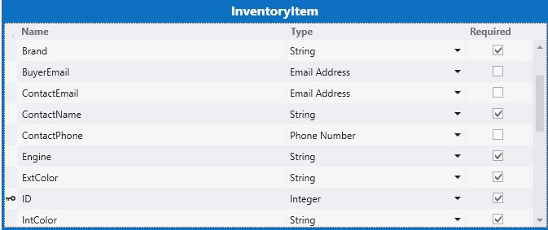
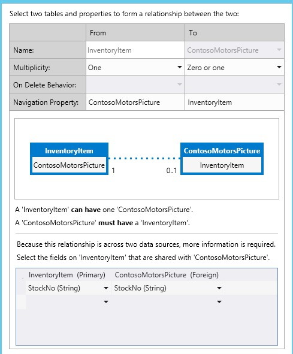

# <a name="create-a-cloud-business-add-in-that-uses-the-sap-gateway"></a><span data-ttu-id="37b5e-101">Erstellen eines Cloud-Business-Add-Ins, das das SAP-Gateway verwendet</span><span class="sxs-lookup"><span data-stu-id="37b5e-101">Create a cloud business add-in that uses the SAP Gateway</span></span>
 <span data-ttu-id="37b5e-102">Erfahren Sie, wie Sie das vom Anbieter gehostete LightSwitch-SharePoint-Add-In erstellen, um mit dem SAP-Gateway für Microsoft auf SAP-Daten zuzugreifen.</span><span class="sxs-lookup"><span data-stu-id="37b5e-102">Learn how to build the LightSwitch SharePoint provider-hosted add-in to access SAP data by means of  SAP Gateway for Microsoft.</span></span>
 

 <span data-ttu-id="37b5e-p101">**Hinweis** Der Name „Apps für SharePoint“ wird in „SharePoint-Add-Ins“ geändert. Während des Übergangszeitraums wird in der Dokumentation und der Benutzeroberfläche einiger SharePoint-Produkte und Visual Studio-Tools möglicherweise weiterhin der Begriff „Apps für SharePoint“ verwendet. Weitere Informationen finden Sie unter [Neuer Name für Office- und SharePoint-Apps](new-name-for-apps-for-sharepoint#bk_newname).</span><span class="sxs-lookup"><span data-stu-id="37b5e-p101">The name "apps for SharePoint" is changing to "SharePoint Add-ins". During the transition, the documentation and the UI of some SharePoint products and Visual Studio tools might still use the term "apps for SharePoint". For details, see [New name for apps for Office and SharePoint](new-name-for-apps-for-sharepoint#bk_newname).</span></span>
 

<span data-ttu-id="37b5e-p102">
In diesem Artikel werden die wichtigsten Schritte des Entwicklungsteams von Microsoft bei der Erstellung eines vom SharePoint-Anbieter gehosteten LightSwitch-Add-Ins erläutert, mit dem auf SAP-Daten mit dem SAP-Gateway für Microsoft zugegriffen werden kann. Dieses Add-In unterstützt CRUD-Vorgänge für SAP-Daten und kann zum Anzeigen von Bildern aus und zum Hochladen von Bildern zu einer SharePoint-Bildbibliothek verwendet werden.
</span><span class="sxs-lookup"><span data-stu-id="37b5e-p102">This article highlights the key steps that the development team at Microsoft used to create a LightSwitch SharePoint provider-hosted add-in that can access SAP data by means of SAP Gateway for Microsoft. This add-in supports CRUD operations on SAP Data, and can be used to view pictures from and upload pictures to a SharePoint picture library.</span></span>
 

<span data-ttu-id="37b5e-p103">Der Zweck dieses Artikels besteht darin, die wichtigsten Punkte des Add-Ins aufzuzeigen, die Sie beim Erstellen ähnlicher Add-Ins unterstützen. Es wird auch ein Codebeispiel bereitgestellt und mit dem Artikel verknüpft, damit Sie besser nachvollziehen können, wie die funktionierende Lösung erstellt wurde.</span><span class="sxs-lookup"><span data-stu-id="37b5e-p103">The purpose of this article is  to show the key points of the add-in that might help you to build similar add-ins.    The code sample is provided and linked to the article so that you can see how the working solution was created, in order to reinforce your learning. 
</span></span>
 

 <span data-ttu-id="37b5e-110">**Beispiel zum Herunterladen:** [ Beispiel: Entwickeln eines Cloud-Business-Add-Ins für den Zugriff auf SAP-Gateway für Microsoft](https://code.msdn.microsoft.com/Sample-Developing-a-Cloud-25d6d1ea)</span><span class="sxs-lookup"><span data-stu-id="37b5e-110">Sample download:     Sample: Developing a Cloud Business Add-in to access SAP Gateway for Microsoft
 https://code.msdn.microsoft.com/Sample-Developing-a-Cloud-25d6d1ea </span></span>
 

## <a name="before-you-begin"></a><span data-ttu-id="37b5e-111">Bevor Sie beginnen</span><span class="sxs-lookup"><span data-stu-id="37b5e-111">Before you begin</span></span>

<span data-ttu-id="37b5e-112">Für die in diesem Artikel beschriebenen Verfahren müssen die folgenden erforderlichen Komponenten vorhanden sein:</span><span class="sxs-lookup"><span data-stu-id="37b5e-112">The following are prerequisites to the procedures in this article:</span></span>
 

 

-  <span data-ttu-id="37b5e-p104">**Eine Office 365-Entwicklerwebsite** in einer Office 365-Domäne, die einem Microsoft Azure Active Directory (Azure AD)-Mandanten zugeordnet ist. Weitere Informationen finden Sie unter [Registrieren für ein Office 365 Developer-Abonnement, Einrichten Ihrer Tools und Umgebung und Beginnen mit der Bereitstellung Ihres Add-Ins](http://msdn.microsoft.com/en-us/library/office/fp179924%28v=office.15%29.aspx) oder [Vorgehensweise: Erstellen einer Entwicklerwebsite in Ihrem vorhandenen Office 365-Abonnement](http://msdn.microsoft.com/en-us/library/office/jj692554%28v=office.15%29.aspx).</span><span class="sxs-lookup"><span data-stu-id="37b5e-p104">**An Office 365 Developer Site** in an Office 365 domain that is associated with a Microsoft Azure Active Directory (Azure AD) tenancy. See [Sign up for an Office 365 Developer Site, set up your tools and environment, and start deploying add-ins](http://msdn.microsoft.com/en-us/library/office/fp179924%28v=office.15%29.aspx) or [How to: Create a Developer Site within your existing Office 365 subscription.](http://msdn.microsoft.com/en-us/library/office/jj692554%28v=office.15%29.aspx)</span></span>
    
 
-  <span data-ttu-id="37b5e-115">**Visual Studio 2013 Update 4** oder höher, das Sie unter [Willkommen bei Visual Studio 2013](http://msdn.microsoft.com/en-us/library/dd831853.aspx) abrufen können.</span><span class="sxs-lookup"><span data-stu-id="37b5e-115">**Visual Studio 2013 Update 4** or later, which you can obtain from [Welcome to Visual Studio 2013](http://msdn.microsoft.com/en-us/library/dd831853.aspx).</span></span>
    
 
-  <span data-ttu-id="37b5e-p105">**Microsoft Office Developer Tools für Visual Studio**. Die Version, die in Update 4 von Visual Studio 2013 oder höher enthalten ist.</span><span class="sxs-lookup"><span data-stu-id="37b5e-p105">**Microsoft Office Developer Tools for Visual Studio.** The version that is included in Update 4 of Visual Studio 2013 or later.</span></span>
    
 
-  <span data-ttu-id="37b5e-p106">**SAP-Gateway für Microsoft** wird in Microsoft Azure bereitgestellt und konfiguriert. Weitere Informationen finden Sie in der Dokumentation zum [SAP-Gateway für Microsoft](http://go.microsoft.com/fwlink/?LinkId=507635).</span><span class="sxs-lookup"><span data-stu-id="37b5e-p106">**SAP Gateway for Microsoft** is deployed and configured in Microsoft Azure. For details, see the documentation for [SAP Gateway for Microsoft](http://go.microsoft.com/fwlink/?LinkId=507635).</span></span>
    
 
-  <span data-ttu-id="37b5e-p107">**Ein Organisationskonto in Microsoft Azure. ** Weitere Informationen finden Sie unter [Grundlagen der Anwendungsregistrierung in Azure AD](http://go.microsoft.com/fwlink/?LinkID=512580).</span><span class="sxs-lookup"><span data-stu-id="37b5e-p107">**An organizational account in Microsoft Azure.** See [Create an organizational user account in Azure AD](http://go.microsoft.com/fwlink/?LinkID=512580).</span></span>
    
     <span data-ttu-id="37b5e-122">**Hinweis** Melden Sie sich bei Ihrem Office 365-Konto an (login.microsoftonline.com), um das temporäre Kennwort zu ändern, nachdem das Konto erstellt wurde.</span><span class="sxs-lookup"><span data-stu-id="37b5e-122">**Note** Log in to your Office 365 account (login.microsoftonline.com) to change the temporary password after the account is created.</span></span>
-  <span data-ttu-id="37b5e-p108">**Ein SAP-OData-Endpunkt** mit Beispieldaten. Weitere Informationen finden Sie in der Dokumentation zum [SAP-Gateway für Microsoft](http://go.microsoft.com/fwlink/?LinkId=507635).</span><span class="sxs-lookup"><span data-stu-id="37b5e-p108">**An SAP OData endpoint** with sample data in it. See the documentation for [SAP Gateway for Microsoft](http://go.microsoft.com/fwlink/?LinkId=507635).</span></span>
    
 
-  <span data-ttu-id="37b5e-p109">**Grundkenntnisse zu Azure AD.** Weitere Informationen finden Sie unter [Erste Schritte mit Azure AD](http://msdn.microsoft.com/en-us/library/azure/dn655157.aspx).</span><span class="sxs-lookup"><span data-stu-id="37b5e-p109">**A basic familiarity with Azure AD.** See [Getting started with Azure AD](http://msdn.microsoft.com/en-us/library/azure/dn655157.aspx).</span></span>
    
 
-  <span data-ttu-id="37b5e-p110">**Grundkenntnisse in der Erstellung von SharePoint-Add-Ins.** Weitere Informationen finden Sie unter [Erste Schritte beim Erstellen von von einem Anbieter gehosteten SharePoint-Add-Ins](http://msdn.microsoft.com/en-us/library/office/fp142381%28v=office.15%29.aspx).</span><span class="sxs-lookup"><span data-stu-id="37b5e-p110">**A basic familiarity with creating SharePoint Add-ins.** See [How to: Create a basic provider-hosted SharePoint Add-in](http://msdn.microsoft.com/en-us/library/office/fp142381%28v=office.15%29.aspx).</span></span>
    
 
-  <span data-ttu-id="37b5e-p111">**Grundkenntnisse zu OAuth 2.0 in Azure AD**. Weitere Informationen finden Sie unter [OAuth 2.0 in Azure AD](http://msdn.microsoft.com/en-us/library/azure/dn645545.aspx) und den untergeordneten Themen.</span><span class="sxs-lookup"><span data-stu-id="37b5e-p111">**A basic familiarity with OAuth 2.0 in Azure AD.** See [OAuth 2.0 and in Azure AD](http://msdn.microsoft.com/en-us/library/azure/dn645545.aspx) and its child topics.</span></span>
    
 

## <a name="solution-overview"></a><span data-ttu-id="37b5e-131">Die Lösung im Überblick</span><span class="sxs-lookup"><span data-stu-id="37b5e-131">Solution Overview</span></span>

<span data-ttu-id="37b5e-p112">Das fiktive Autounternehmen Contoso Motors verkörpert ein echtes Unternehmensszenario, in dem ein Autohaus Informationen über seinen Fahrzeugbestand für Handelsvertreter und andere Händler freigibt. Mithilfe dieses Add-Ins kann das Verkaufspersonal den aktuellen Fahrzeugbestand prüfen, auf den das Add-In direkt über SAP mit dem SAP-Gateway für Microsoft zugreift. Alle in SAP gespeicherten Daten und ein Bild von jedem Fahrzeug sind in einer Bildbibliothek in SharePoint Online gespeichert. In diesem Add-In werden die Daten aus SAP und der SharePoint-Bildbibliothek zusammengeführt und angezeigt. Innerhalb des Add-Ins können Manager und Administratoren Standard-CRUD-Vorgänge für detaillierte Informationen zu jedem Fahrzeug in SAP durchführen.</span><span class="sxs-lookup"><span data-stu-id="37b5e-p112">Contoso Motors is a fictitious auto sales company that represents a real-life business in which an automobile dealership shares information about its inventory of automobiles with sales representatives and other dealerships that it's affiliated with. By using this add-in, sales people can check the current status of their automobile inventory, which the add-in accesses directly from SAP by means of SAP Gateway for Microsoft. All data is stored in SAP, and a picture of each car is stored in a picture library in SharePoint Online. Both the data from SAP and the SharePoint picture library are brought together and displayed by this add-in. Within the add-in, managers and administrators can do standard CRUD operations on the detailed data about each car in SAP.</span></span>
 

 
<span data-ttu-id="37b5e-p113">Im Beispiel in diesem Artikel werden die Fahrzeugbestandsdaten aus SAP und die zugehörigen Bilder in der SharePoint-Bildbibliothek von dem SellerDashboard-Add-In gehandhabt. Mit diesem Add-In werden die standardmäßigen CRUD-Vorgänge (Create, Read, Update und Delete) für die Detailinformationen zu jedem Fahrzeug in SAP unterstützt.</span><span class="sxs-lookup"><span data-stu-id="37b5e-p113">In the example in this article, the SellerDashboard add-in manipulates automobile inventory data from SAP and its picture in SharePoint picture library. Within this add-in, standard CRUD (create, read, update, and delete) operations are supported on the detailed information about each car in SAP.</span></span>
 

 

 <span data-ttu-id="37b5e-p114">**Tipp** Eine Videovorführung dieses Add-Ins finden Sie im Video [Technisches Webinar – SAP-Gateway für Microsoft &amp; das Microsoft Azure-Entwicklungsmodell](http://go.microsoft.com/fwlink/?LinkId=517378) auf BrightTalk. Das Demo der Add-In-Funktionalität beginnt ab der 48. Minute.</span><span class="sxs-lookup"><span data-stu-id="37b5e-p114">For a video demonstration of this add-in, watch the  Technical Webinar - SAP Gateway for Microsoft & Microsoft Azure Development Model http://go.microsoft.com/fwlink/?LinkId=517378  video on BrightTalk. The demo of the app’s functionality starts at 48:00 minutes on the timeline.
</span></span>
 

 <span data-ttu-id="37b5e-141">**Codearchitektur**</span><span class="sxs-lookup"><span data-stu-id="37b5e-141">**Code Architecture**</span></span>
 

 
<span data-ttu-id="37b5e-142">Die SellerDashboard-Projektmappe enthält acht Projekte, und wie die folgende Abbildung zeigt, ist sie in zwei Kategorien unterteilt: BoxXDataStudio und SellerDashboardStudio.</span><span class="sxs-lookup"><span data-stu-id="37b5e-142">The SellerDashboard solution includes eight projects, and as the following image shows, it is divided into two categories: BoxXDataStudio and SellerDashboardStudio.</span></span>
 

 

 

 

### <a name="boxxdatastudio"></a><span data-ttu-id="37b5e-144">BoxXDataStudio</span><span class="sxs-lookup"><span data-stu-id="37b5e-144">BoxXDataStudio</span></span>

<span data-ttu-id="37b5e-145">Dieses Studio enthält alle Komponenten, die für die Interaktion mit dem SAP-Gateway für Microsoft erforderlich sind.</span><span class="sxs-lookup"><span data-stu-id="37b5e-145">This studio includes all of the components needed to interact with SAP Gateway for Microsoft.</span></span>
 

 

-  <span data-ttu-id="37b5e-146">**AADAuthLib**</span><span class="sxs-lookup"><span data-stu-id="37b5e-146">**AADAuthLib**</span></span>
    
    <span data-ttu-id="37b5e-147">Mit dieser Komponente wird der [Azure AD-Autorisierungscodeablauf](https://msdn.microsoft.com/en-us/library/azure/dn645542.aspx) ausgeführt, der ein Singleton-Muster verwendet.</span><span class="sxs-lookup"><span data-stu-id="37b5e-147">This component is used to carry out the  [Azure AD authorization code flow](https://msdn.microsoft.com/en-us/library/azure/dn645542.aspx), which uses a Singleton pattern.</span></span>
    
    <span data-ttu-id="37b5e-p115">Der folgende Codeausschnitt zeigt die Hauptfunktion, die die AADAuthLib-Komponente bereitstellt. Ausführlichere Informationen finden Sie unter der AADAuthLib/AuthUtil.cs-Hilfsklasse im Beispielcode.</span><span class="sxs-lookup"><span data-stu-id="37b5e-p115">The following code snippet shows the main function, which the AADAuthLib component provides. For more detail, see the AADAuthLib/AuthUtil.cs sample code helper class.</span></span>
    


```C#
  // Use the auth code, acquire the refresh token and access token, and store them in the current session
        public bool AcquireTokenFromAuthCode(string authCode, string redirectUrl = "redirectUrl")
        {
            if (!IsAuthorized &amp;&amp; !string.IsNullOrEmpty(authCode))
            {
                AuthenticationResult authResult = _authContext.AcquireTokenByAuthorizationCode(authCode,
                    new Uri(ConfigurationManager.AppSettings["ida:" + redirectUrl]),
                    _clientCredential,
                    ConfigurationManager.AppSettings["ida:ResourceUrl"]);

                HttpContext.Current.Session["RefreshToken"] = authResult.RefreshToken;
                HttpContext.Current.Session["AccessToken-" + ConfigurationManager.AppSettings["ida:ResourceUrl"]] = new Tuple<string, DateTimeOffset>(authResult.AccessToken, authResult.ExpiresOn);

                return true;
            }

            return false;
  }

 // Provide the access token, which is stored in the current session, if the access token expired, use the refresh token get a new one.
 public string AccessToken
        {
            get
            {
                if (!IsAuthorized) throw new UnauthorizedAccessException();

                var accessToken = HttpContext.Current.Session["AccessToken-" + ConfigurationManager.AppSettings["ida:ResourceUrl"]] as Tuple<string, DateTimeOffset>;

                if (IsAccessTokenValid(accessToken))
                {
                    return accessToken.Item1;
                }

                accessToken = RenewAccessToken();
                HttpContext.Current.Session["AccessToken-" + ConfigurationManager.AppSettings["ida:ResourceUrl"]] = accessToken;

                return accessToken.Item1;
            }
  }
```

-  <span data-ttu-id="37b5e-150">**BoxXDataService**</span><span class="sxs-lookup"><span data-stu-id="37b5e-150">**BoxXDataService**</span></span>
    
    <span data-ttu-id="37b5e-151">Dies ist ein WCF-RIA-Dienst, der die von der in Azure gehosteten serverseitigen SellerDashboard-Komponente verwendete Schnittstelle darstellt und die SAP-Datenquelle vom SAP-Gateway für Microsoft verwendet.</span><span class="sxs-lookup"><span data-stu-id="37b5e-151">This is a WCF RIA service, which is the interface used by the SellerDashboard server-side component hosted in Azure, and which consumes the SAP data source from SAP Gateway for Microsoft..</span></span>
    
    <span data-ttu-id="37b5e-p116">Der folgende Codeausschnitt ist die CRUD-Webmethode, die der WCF-RIA-Dienst unterstützt. Weitere Details finden Sie unter „BoxXDataService/BoxXDataService.cs“.</span><span class="sxs-lookup"><span data-stu-id="37b5e-p116">The following code snippet is the CRUD Web method, which the WCF RIA service supports. For more detail see BoxXDataService/BoxXDataService.cs.</span></span>
    


```C#
  [Query(IsDefault = true)]
        public IQueryable<InventoryItem> GetAllCarInventory()
        {
            BoxXDataReader dataReader = BoxXDataReader.Instance;
            IInventoryCollection dataCollection = ModelFactory.CreateInventoryCollection(dataReader.SchemaPropertyNames);
            IInventoryQuery query = QueryFactory.CreateQuery();
            dataReader.GetData(dataCollection, query);

            return dataCollection.Items.Cast<InventoryItem>().AsQueryable();
        }

        [Update]
        public void UpdateCarInventoryItem(InventoryItem carInventoryItem)
        {
            BoxXDataUpdater dataUpdater = BoxXDataUpdater.Instance;
            dataUpdater.UpdateInventoryItem(carInventoryItem);
        }

        [Insert]
        public void InsertCarInventoryItem(InventoryItem carInventoryItem)
        {
            BoxXDataCreater dataCreater = BoxXDataCreater.Instance;
            dataCreater.CreateInventoryItem(carInventoryItem);
        }

        [Delete]
        public void DeleteCarInventoryItem(InventoryItem carInventoryItem)
        {
            BoxXDataDeleter.DeleteInventoryItem(carInventoryItem.ID);
 }
```

-  <span data-ttu-id="37b5e-154">**CarInventoryBoxXDataOperation**</span><span class="sxs-lookup"><span data-stu-id="37b5e-154">**CarInventoryBoxXDataOperation**</span></span>
    
    <span data-ttu-id="37b5e-p117">Dies ist die tatsächliche CRUD-Implementierung für BoxXDataService. Die folgende Abbildung veranschaulicht die grundlegende Codearchitektur von CarInventoryBoxXDataOperation. Der CRUD-Namespace wird zum Implementieren von CRUD-Vorgängen verwendet, und der Util-Namespace ist der Hilfscode für den CRUD-Namespace.</span><span class="sxs-lookup"><span data-stu-id="37b5e-p117">This is the real CRUD implementation for BoxXDataService. The following image shows the main code architecture of CarInventoryBoxXDataOperation. The CRUD namespace is used to implement the CRUD operations, and the Util namespace is the helper code for the CRUD namespace.</span></span>
    
  
 

 

 
-  <span data-ttu-id="37b5e-159">**CarInventoryModel**</span><span class="sxs-lookup"><span data-stu-id="37b5e-159">**CarInventoryModel**</span></span>
    
    <span data-ttu-id="37b5e-p118">Dies ist ein Bibliotheksprojekt, das zum Implementieren des Datenmodells und von Hilfsprogrammen verwendet wird. Die Datenmodelldefinition muss mit den Metadaten des vom SAP-Gateway für Microsoft verwendeten Data-Endpunkts übereinstimmen, welches auf dem SAP-Datenschema basiert. Es wird von BoxXDataService und CarInventoryBoxXDataOperation zum Konvertieren des SAP-Datenbankelements in eine Fahrzeugbestandsinstanz verwendet.</span><span class="sxs-lookup"><span data-stu-id="37b5e-p118">This is a library project that's used to implement the data model and utilities. The data model definition has to match the metadata of the OData endpoint that's used by SAP Gateway for Microsoft, which is based on the SAP data schema. BoxXDataService and CarInventoryBoxXDataOperation use it to convert the SAP database item into a car inventory instance.</span></span>
    
    <span data-ttu-id="37b5e-163">In der folgenden Abbildung werden die Hauptkomponenten dargestellt.</span><span class="sxs-lookup"><span data-stu-id="37b5e-163">The following image shows the main components.</span></span>
    
 

 

 

 

 

### <a name="sellerdashboardstudio"></a><span data-ttu-id="37b5e-165">SellerDashboardStudio</span><span class="sxs-lookup"><span data-stu-id="37b5e-165">SellerDashboardStudio</span></span>

<span data-ttu-id="37b5e-166">SellerDashboardStudio enthält LightSwitch-SharePoint-Add-In-Standardkomponenten.</span><span class="sxs-lookup"><span data-stu-id="37b5e-166">SellerDashboardStudio includes standard LightSwitch SharePoint add-in components.</span></span>
 

 

-  <span data-ttu-id="37b5e-167">**SellerDashboard**</span><span class="sxs-lookup"><span data-stu-id="37b5e-167">**SellerDashboard**</span></span>
    
    <span data-ttu-id="37b5e-168">SellerDashboard ist das StartUp-Projekt und wird zum Veröffentlichen des SellerDashboard-Add-Ins auf der Azure-Website und des SharePoint-Add-Ins auf der SharePoint-Entwicklerwebsite verwendet.</span><span class="sxs-lookup"><span data-stu-id="37b5e-168">SellerDashboard is the StartUp project, and it is used to publish the SellerDashboard add-in to the Azure website and its SharePoint add-in to the SharePoint developer site.</span></span>
    
 
-  <span data-ttu-id="37b5e-169">**SellerDashboard.HTMLClient**</span><span class="sxs-lookup"><span data-stu-id="37b5e-169">**SellerDashboard.HTMLClient**</span></span>
    
    <span data-ttu-id="37b5e-p119">Diese Komponente enthält die Bildschirme, ein benutzerdefiniertes Steuerelement und ein Steuerelement zum Hochladen von Fotos. Die folgende Abbildung zeigt die Hauptkomponenten.</span><span class="sxs-lookup"><span data-stu-id="37b5e-p119">This component includes the screens, a custom control, and a photo upload control. The following image shows its main components.</span></span>
    
 
- 
  
 

    <span data-ttu-id="37b5e-173">SellerDashboard.HTML.Client umfasst die folgenden vier Bildschirme:</span><span class="sxs-lookup"><span data-stu-id="37b5e-173">SellerDashboard.HTML.Client includes these four screens:</span></span>
    
 

      - <span data-ttu-id="37b5e-174">BrowseInventoryItems ist der Startbildschirm und wird zum Durchsuchen von grundlegenden Informationen für alle Bestandselemente verwendet.</span><span class="sxs-lookup"><span data-stu-id="37b5e-174">BrowseInventoryItems is the home screen, used to browse basic information for all inventory items.</span></span>
    
 
  - <span data-ttu-id="37b5e-175">ViewInventoryItem ist der Detailbildschirm und wird zum Anzeigen einer detaillierten Ansicht für jedes Bestandselement verwendet.</span><span class="sxs-lookup"><span data-stu-id="37b5e-175">ViewInventoryItem is the detail screen, used to display a detailed view for each inventory item.</span></span>
    
 
  - <span data-ttu-id="37b5e-176">EditInventoryItem ist der Popupbildschirm "Bearbeiten" und wird zum Bearbeiten eines Bestandselement verwendet.</span><span class="sxs-lookup"><span data-stu-id="37b5e-176">EditInventoryItem is an edit popup screen, used to edit an inventory item.</span></span>
    
 
  - <span data-ttu-id="37b5e-177">AddInventoryItem ist ein Popupbildschirm "Hinzufügen" und wird zum Hinzufügen eines neuen Bestandselements verwendet.</span><span class="sxs-lookup"><span data-stu-id="37b5e-177">AddInventoryItem is an add popup screen, used to add a new inventory item.</span></span>
    
 

    <span data-ttu-id="37b5e-178">Die Datei „UserCode.js“ enthält den benutzerdefinierten UX-Steuerelementcode.</span><span class="sxs-lookup"><span data-stu-id="37b5e-178">The UserCode.js file includes the UX custom control code.</span></span>
    
    <span data-ttu-id="37b5e-179">Die Dateien "photohelper.js" und "sharepointauthhelper.js" im Skriptordner basieren auf dem Leitfaden im Artikel  [Exemplarische Vorgehensweise: Erstellen eines Add-Ins für SharePoint mithilfe von LightSwitch](http://msdn.microsoft.com/en-us/library/jj969621.aspx).</span><span class="sxs-lookup"><span data-stu-id="37b5e-179">The photohelper.js and sharepointauthhelper.js, files, included in the Scripts folder, are based on the guidance provided in the article  [Walkthrough: Creating an Add-in for SharePoint by Using LightSwitch](http://msdn.microsoft.com/en-us/library/jj969621.aspx).</span></span>
    
 
-  <span data-ttu-id="37b5e-180">**SellerDashboard.Server**</span><span class="sxs-lookup"><span data-stu-id="37b5e-180">**SellerDashboard.Server**</span></span>
    
    <span data-ttu-id="37b5e-p120">Diese Komponente umfasst die WCF-RIA-Datenquelle, die SharePoint-Datenquelle und die Fotoupload-Web-API. In der folgenden Abbildung werden die Hauptkomponenten dargestellt.</span><span class="sxs-lookup"><span data-stu-id="37b5e-p120">This component includes the WCF RIA data source, the SharePoint data source, and the photo-upload Web API. The following image shows its main components.</span></span>
    
  
 

    <span data-ttu-id="37b5e-p121">SharePointContext.cs und TokenHelper.cs sind die Hilfsklassen, die den Clientkontext zum Authentifizieren für SharePoint bereitstellen. Damit kann die Fotoupload-Web-API zum Hochladen von Fahrzeugfotos in die Bildbibliothek verwendet werden. Die Dateien "PhotoListHelper.cs" und "PhotosController.cs" implementieren die Fotoupload-Web-API. Weitere Informationen zur Verwendung der Fotoupload-Web-API mit LightSwitch finden Sie im Artikel  [Vorgehensweise: Erstellen eines Add-Ins für SharePoint mithilfe von LightSwitch](http://msdn.microsoft.com/en-us/library/jj969621.aspx).</span><span class="sxs-lookup"><span data-stu-id="37b5e-p121">The SharePointContext.cs and TokenHelper.cs are the helper classes that provide the client context to authenticate to SharePoint. This enables the photo upload Web API to be used to upload photos of cars to the picture library. The PhotoListHelper.cs and PhotosController.cs files implement the photo-upload Web API. For more information about how the photo-upload Web API is used by LightSwitch, see the article  [Walkthrough: Creating an Add-in for SharePoint by Using LightSwitch](http://msdn.microsoft.com/en-us/library/jj969621.aspx).</span></span>
    
 
-  <span data-ttu-id="37b5e-188">**SellerDashboard.SharePoint**</span><span class="sxs-lookup"><span data-stu-id="37b5e-188">**SellerDashboard.SharePoint**</span></span>
    
    <span data-ttu-id="37b5e-p122">Diese Komponente ist nach der LightSwitch-Lösung zum Aktivieren des SharePoint-Projekts enthalten. Mit dieser Komponente können Sie die für die Bildbibliothek verwendete SharePoint-Website konfigurieren und die benötigten Berechtigungen für das Add-In festlegen. SellerDashboard benötigt die Berechtigungsstufe "Vollzugriff" für die SharePoint-Website, die die Bildbibliothek hostet.</span><span class="sxs-lookup"><span data-stu-id="37b5e-p122">This component is included after the LightSwitch solution to enable the SharePoint project. You can use this component to configure the SharePoint site used for the picture library and to set the required permission for the add-in. SellerDashboard needs to be granted the Full Control permission level on the SharePoint site that hosts the picture library.</span></span>
    
 

## <a name="implementation"></a><span data-ttu-id="37b5e-192">Implementierung</span><span class="sxs-lookup"><span data-stu-id="37b5e-192">Implementation</span></span>


 

 

### <a name="overview"></a><span data-ttu-id="37b5e-193">Übersicht</span><span class="sxs-lookup"><span data-stu-id="37b5e-193">Overview</span></span>

<span data-ttu-id="37b5e-p123">In der folgenden Abbildung werden die Komponenten dargestellt, die SellerDashboard beeinflussen. Die durchgezogene Linie veranschaulicht den Datenfluss, und die punktierte Linie den OAuth-Fluss. Die grünen Komponenten sind mit den SAP-Datenvorgängen verknüpft, die blauen Komponenten sind mit dem SharePoint-Bildbibliotheksvorgang verknüpft, und die orangefarbenen Komponenten stellen die Vorgänge der gesamten SellerDashboard-App dar.</span><span class="sxs-lookup"><span data-stu-id="37b5e-p123">The following image show the components that comprise the SellerDashboard. The solid line shows the data flow and the dotted line shows the OAuth flow. The green components are related to the SAP data operations, the blue components are related to the SharePoint picture library operation, and the orange components depict the operations of the whole SellerDashboard app.</span></span>  
 

 
 <span data-ttu-id="37b5e-197">**SellerDashboard Solution**</span><span class="sxs-lookup"><span data-stu-id="37b5e-197">**SellerDashboard Solution**</span></span>
 

 

 

 

 

 

### <a name="data-mashup"></a><span data-ttu-id="37b5e-199">Datenmashup</span><span class="sxs-lookup"><span data-stu-id="37b5e-199">Data mashup</span></span>

<span data-ttu-id="37b5e-200">LightSwitch unterstützt das Datenmashup durch Hinzufügen einer Beziehung zwischen den zwei Datenquellen im Designer.</span><span class="sxs-lookup"><span data-stu-id="37b5e-200">LightSwitch supports the data mashup by adding a relationship between the two data sources in the designer.</span></span>
 

 
 <span data-ttu-id="37b5e-201">**SAP-Datenquelle**</span><span class="sxs-lookup"><span data-stu-id="37b5e-201">**SAP data source**</span></span>
 

 

-  <span data-ttu-id="37b5e-202">*Datenschema in SAP-Datenbank*</span><span class="sxs-lookup"><span data-stu-id="37b5e-202">*Data schema in SAP database*</span></span> 
    
    <span data-ttu-id="37b5e-203">Der folgende Codeausschnitt zeigt ein Beispiel für ein Datenschema aus dem SAP-Gateway für Microsoft.</span><span class="sxs-lookup"><span data-stu-id="37b5e-203">The following snippet shows an example of a data schema from SAP Gateway for Microsoft.</span></span>
    


```XML
  
<?xml version="1.0" encoding="UTF-8"?> 
- <edmx:Edmx xmlns:sap="http://www.sap.com/Protocols/SAPData" xmlns:m="http://schemas.microsoft.com/ado/2007/08/dataservices/metadata" 
xmlns:edmx:"http://schemas.microsoft.com/ado/2007/06/edmx" Version="1.0">
   - <edmx:DataServices m:DataServiceVersion="2.0">
      - <Schema xml:lang="en" xmlns="http://schemas.microsoft.com/ado/2008/09/edm" Namespace="ZCAR_POC_SRV">
         - <EntityType sap:content-version="1" Name="ContosoMotors">
              - <Key>
                     <PropertyRef Name="ID"/>
               </Key>
               <Property Name="ContactPhone" Type="Edm.String"/>
               <Property Name="ContactEmail" Type="Edm.String"/>
               <Property Name="ID" Type="Edm.Int32" Nullable="false"/>
               <Property Name="BuyerEmail" Type="Edm.String" MaxLength="255"/>
               <Property Name="MaxPower" Type="Edm.Int32" Nullable="false"/>
               <Property Name="Engine" Type="Edm.String" Nullable="false" MaxLength="255"/>
               <Property Name="BodyStyle" Type="Edm.String" Nullable="false" MaxLength="255"/>
               <Property Name="Transmission" Type="Edm.String" Nullable="false" MaxLength="255"/>
               <Property Name="Year" Type="Edm.Int32" Nullable="false"/>
               <Property Name="Model" Type="Edm.String" Nullable="false" MaxLength="255"/>
               <Property Name="Brand" Type="Edm.String" Nullable="false" MaxLength="255"/>
               <Property Name="ExtColor" Type="Edm.String" Nullable="false" MaxLength="255"/>
              <Property Name="IntColor" Type="Edm.String" Nullable="false" MaxLength="255"/>
              <Property Name="ContactName" Type="Edm.String" Nullable="false" MaxLength="255"/>
              <Property Name="Price" Type="Edm.String" Nullable="false"/>
              <Property Name="StockNo" Type="Edm.String" Nullable="false"/>
              <Property Name="Arrived_Date" Type="Edm.DateTime" Nullable="false" Precision="0"/>
              <Property Name="Status" Type="Edm.String" Nullable="false" MaxLength="255"/>
      </EntityType>
   - <EntityContainer Name="ZCAR_POC_SRV_Entities" m:IsDefaultEntityContainer="true">
          <EntitySet sap:content-version="1" Name="ContosoMotorsCollection" sap:searchable="true" EntityType="ZCAR_POC_SRV.ContosoMotors"/>
     </EntityContainer>
     <atom:link xmlns:atom="http://www.w3.org/2005/Atom" href="http://contoso.cloudapp.net:8080/perf/sap/opu/odata/sap/ZCAR_POC_SRV/$metadata" rel="self"/>
     <atom:link xmlns:atom="http://www.w3.org/2005/Atom" href="http://contoso.cloudapp.net:8080/perf/sap/opu/odata/sap/ZCAR_POC_SRV/$metadata" rel="latest-version"/>
</Schema>
</edmx:DataServices>
</edms:Edmx>               

```


    This is our test data base, and the Property Type and Nullable value is based on the scenario. The ID is the PropertyRef and the OData CRUD operation is based on ID. The StockNo property is used to mash data with the car picture that is stored in SharePoint picture library.
    
 
-  <span data-ttu-id="37b5e-204">*Für den RIA-Dienst definiertes Datenmodell*</span><span class="sxs-lookup"><span data-stu-id="37b5e-204">*Data model defined for RIA service*</span></span> 
    
```C#
  public interface IInventoryItem
        {
        IEnumerable<InventoryPropertyName> ValidPropertyNames { get; }
        bool IsValid { get; }

        int ID { get; set; }
        DateTime ArrivedDate { get; set; }
        string BodyStyle { get; set; }
        string Brand { get; set; }
        string BuyerEmail { get; set; }
        string ContactEmail { get; set; }
        string ContactName { get; set; }
        string ContactPhone { get; set; }
        string Engine { get; set; }
        string ExtColor { get; set; }
        IEnumerable<Uri> Images { get; }
        string IntColor { get; set; }
        int MaxPower { get; set; }
        string Model { get; set; }
        decimal Price { get; set; }
        bool Removed { get; }
        string Status { get; set; }
        string StockNo { get; set; }
        string Transmission { get; set; }
        int Year { get; set; }

        void AddImageUrl(Uri url);
        bool CopyFrom(IInventoryItem other);
        object GetPropertyValue(InventoryPropertyName property);
        void MarkAsRemoved();
        void SetPropertyValue(InventoryPropertyName property, object value);
       }

        public interface IInventoryCollection
       {
        IEnumerable<InventoryPropertyName> QueriedPropertyNames { get; }
        IEnumerable<IInventoryItem> Items { get; }
        bool Valid { get; }

        IInventoryItem this[int id] { get; }
        bool Contains(int id);
        void AddItem(IInventoryItem inventoryItem);
        IInventoryCollection Filter(Predicate<IInventoryItem> match);
        bool CopyFrom(IInventoryCollection other);
}

```


    Any property that isn't included in the SAP database schema can be ignored. For example, the  **Images** property was added here for scalability considerations. This data model is a middle layer between the real SAP database and the SellerDashboard.Server data source. The LightSwitch project has two components: View and Server. When you add an external data source on the Server side, LightSwitch helps you build an abstract data layer that is added to the data source on the Server side.
    
    Most of the properties have the same type as the properties in the SAP database schema, except for StockNo, whose type has been changed from  **int** to **string**. This is because StockNo is used as a way to define the relationship between the SAP data and SharePoint picture library.
    
     **Tip**  StockNo must have the type  **string** because the value stored in the SharePoint picture library is **Text**. These two types must match in order to accomplish the data mashup.

    The implementation of the two interfaces is in CarInventoryModel/InventoryItem.cs and CarInventoryModel/InventoryCollection.cs.
    
 
-  <span data-ttu-id="37b5e-205">*Von der LightSwitch-Serverseite genutzte Datenquelle*</span><span class="sxs-lookup"><span data-stu-id="37b5e-205">*Data source consumed by the LightSwitch server side*</span></span> 
    
  
 

    <span data-ttu-id="37b5e-p124">Wenn Sie den WCF-RIA-Dienst (BoxXDataService) auf dem SellerDashboard-Server hinzufügen, ist das in CarInventoryModel definierte Datenmodell miteinbezogen, und Sie erhalten die Tabelle mit relevanten Daten. Sie können den Typ einiger Eigenschaften ändern. Sie können z. B. den **BuyerEmail**-Typ von **Zeichenfolge** in **E-Mail-Adresse** ändern, wodurch die Überprüfung des E-Mail-Formats auf Clientseite in LightSwitch unterstützt wird.</span><span class="sxs-lookup"><span data-stu-id="37b5e-p124">In the SellerDashboard server, when you add the WCF RIA Service (BoxXDataService), the data model that's defined in CarInventoryModel is included, and you get the relevant data table. You can change the type of some of the properties. For example, you can change the **BuyerEmail** type from **String** to **Email Address**, and LightSwitch will support the email format check on the client side.</span></span>
    
 
 <span data-ttu-id="37b5e-210">**SharePoint-Bildbibliothek**</span><span class="sxs-lookup"><span data-stu-id="37b5e-210">**SharePoint picture library**</span></span>
 

 
<span data-ttu-id="37b5e-p125">Die Bildbibliothek auf der SharePoint-Hostwebsite heißt „ContosoMotorsPictureLibrary“ und enthält drei neue Spalten mit den Namen „StockNo“, „ThumbnailUrl“ und „FullImageUrl“. Alle Spalten sind als **Text**-Felder konfiguriert.</span><span class="sxs-lookup"><span data-stu-id="37b5e-p125">The picture library in the SharePoint host site is named ContosoMotorsPictureLibrary, and contains three new columns named StockNo, ThumbnailUrl, and FullImageUrl. All of them are configured as **Text** fields.</span></span>
 

 

 <span data-ttu-id="37b5e-213">**Tipp** Bei Spaltennamen wird die Groß-/Kleinschreibung beachtet.</span><span class="sxs-lookup"><span data-stu-id="37b5e-213">**TIP** The column names are case sensitive.</span></span>
 

 <span data-ttu-id="37b5e-p126">Die StockNo-Spalte wird zum Erstellen einer Beziehung zu SAP-Daten verwendet. Die Spalten "ThumbnailUrl" und "FullImageUrl" werden zum einfachen Abrufen der URL für das relevante Foto verwendet.</span><span class="sxs-lookup"><span data-stu-id="37b5e-p126">The StockNo column is used to create a relationship with the SAP data. The ThumbnailUrl and FullImageUrl columns are used to get the URL to the relevant picture in a convenient way.</span></span>
 

 
 <span data-ttu-id="37b5e-216">*Von der LightSwitch-Serverseite genutzte Datenquelle*</span><span class="sxs-lookup"><span data-stu-id="37b5e-216">*Data source consumed by the LightSwitch server side*</span></span> 
 

 
<span data-ttu-id="37b5e-217">ContosoMotorsPicture ist ein LightSwitch-Datenquellenmodell, das der Bildbibliothek der SharePoint-Hostwebsite auf der LightSwitch-Serverseite zugeordnet ist.</span><span class="sxs-lookup"><span data-stu-id="37b5e-217">ContosoMotorsPicture is a LightSwitch data source model, which maps to the SharePoint host site picture library on the LightSwitch server side.</span></span>
 

 

 

 
 <span data-ttu-id="37b5e-219">**Datenbeziehung**</span><span class="sxs-lookup"><span data-stu-id="37b5e-219">**Data relationship**</span></span>
 

 
<span data-ttu-id="37b5e-p127">Fügen Sie eine 1:0-Beziehung oder eine 1:1-Beziehung zwischen InventoryItem und ContosoMotorsPicture hinzu. In der folgenden Abbildung wird dargestellt, wie dies unter Verwendung von LightSwitch in Visual Studio aussieht.</span><span class="sxs-lookup"><span data-stu-id="37b5e-p127">Add a one-to-zero relationship or a one-to-one relationship between the InventoryItem and ContosoMotorsPicture. The following image shows what this looks like, using LightSwitch in Visual Studio</span></span>
 

 

 

 

 

 

### <a name="oauth-with-azure-ad-amp-acs"></a><span data-ttu-id="37b5e-223">OAuth mit Azure AD &amp; ACS</span><span class="sxs-lookup"><span data-stu-id="37b5e-223">OAuth with Azure AD &amp; ACS</span></span>

<span data-ttu-id="37b5e-224">Dieser Abschnitt enthält eine Übersicht darüber, wie das Add-In OAuth in Azure AD und Zugriffssteuerungsdienste (Access Control Services, ACS) implementiert.</span><span class="sxs-lookup"><span data-stu-id="37b5e-224">This section provides an overview of how the add-in implements OAuth in Azure AD and access control services (ACS).</span></span>
 

 
 <span data-ttu-id="37b5e-225">**Übersicht**</span><span class="sxs-lookup"><span data-stu-id="37b5e-225">**Overview**</span></span>
 

 
<span data-ttu-id="37b5e-226">SellerDashboard ist ein vom SharePoint-Anbieter gehostetes Add-In, das beide Datenquellen verwendet: die SharePoint-Bildbibliothek und SAP-Daten mit dem SAP-Gateway für Microsoft.</span><span class="sxs-lookup"><span data-stu-id="37b5e-226">SellerDashboard is a SharePoint provider host add-in that has to operate on both data sources: SharePoint picture library and the SAP data by means of SAP Gateway for Microsoft.</span></span>
 

 
<span data-ttu-id="37b5e-p128">Für den Zugriff auf die SharePoint-Bildbibliothek muss SellerDashboard ACS authentifizieren und einen Zugriffstoken von ACS abrufen. Für den Zugriff auf SAP-Daten muss SellerDashboard jedoch einen anderen Zugriffstoken von Azure AD abrufen, da das SAP-Gateway für Microsoft Azure AD für die Authentifizierung und Autorisierung verwendet.</span><span class="sxs-lookup"><span data-stu-id="37b5e-p128">To access the SharePoint picture library, SellerDashboard needs to authenticate to ACS, and get an access token from it. To access the SAP data, however, the SellerDashboard needs to get a different access token from Azure AD, because SAP Gateway for Microsoft uses Azure AD for Authentication and Authorization.</span></span>
 

 

 

 
 <span data-ttu-id="37b5e-230">**Implementierung**</span><span class="sxs-lookup"><span data-stu-id="37b5e-230">**Implementation**</span></span>
 

 
<span data-ttu-id="37b5e-p129">SellerDashboard ist ein vom SharePoint-Anbieter gehostetes Add-In, die den Fotouploadvorgang unter Verwendung des clientseitigen SharePoint-Objektmodells unterstützt. Der zum Erstellen vom Clientkontext für den SharePoint-Host verwendete SharePoint-Kontext wird zwischengespeichert, und der Clientkontext wird dann von der Upload-Web-API verwendet.</span><span class="sxs-lookup"><span data-stu-id="37b5e-p129">SellerDashboard is a SharePoint provider-hosted add-in that supports the picture-upload operation by using the SharePoint client-side object model. The SharePoint context, which is used to create the client context for the SharePoint host, is cached, and the client context is then used by the upload Web API.</span></span>
 

 
<span data-ttu-id="37b5e-p130">Nachdem der OAuth mit ACS-Prozess abgeschlossen ist, wird die Authentifizierungsanforderung an Azure AD gesendet. Um diesen Prozess abzuschließen, verwendet das Add-In ein Cookie zum Anmelden bei Login.MicrosoftOnline.com und dann zum Abschließen des Azure AD-Autorisierungscodeflusses. Dieser gibt ein Aktualisierungstoken zurück, das vom Add-In für zukünftige Authentifizierungsanforderungen während der Sitzung zwischengespeichert wird.</span><span class="sxs-lookup"><span data-stu-id="37b5e-p130">After the OAuth with ACS process is complete, the request for authentication is sent to Azure AD. To accomplish this, the add-in uses a cookie to sign into Login.MicrosoftOnline.com and then complete the Azure AD authorization code flow , which returns a refresh token that the add-in caches for future authentication requests during the session. Here's the code that is used for this process.</span></span>
 

 


```C#
protected override void Page_Load(object sender, EventArgs e)
{
    if (!IsPostBack)
    {
 SharePointContext spContext = SharePointContextProvider.Current.GetSharePointContext(Context);
        if (spContext != null)
        {
     // Cache the SharePoint Context, which will be used to create Client Context for SharePoint host
            _spContext = spContext;
        }

        
        // Acquire refresh token and access token, and store them in the current session, which will be used do the OAuth with AAD for operating the SAP data
        AuthUtil.Instance.AcquireTokenFromAuthCode(Request.QueryString["code"]);

        if (!AuthUtil.Instance.IsAuthorized)
        {
             Response.Redirect(AuthUtil.Instance.AuthCodeUrl);
        }
     }

     base.Page_Load(sender, e);
 }
```

<span data-ttu-id="37b5e-236">Ausführliche Informationen finden Sie unter „SellerDashBoard.Server/SharePointLaunch.aspx.cs“ und „AADAuthLib/AuthUtil.cs“ im Codebeispiel.</span><span class="sxs-lookup"><span data-stu-id="37b5e-236">For more detail, see SellerDashBoard.Server/SharePointLaunch.aspx.cs, and AADAuthLib/AuthUtil.cs in the code sample.</span></span>
 

 
<span data-ttu-id="37b5e-p131">SellerDashboard.Server enthält die Dateien "SharePointContext.cs" und "TokenHelper.cs", die zum Abrufen von Nur-Add-In-Clientkontext für den SharePoint-Host verwendet werden. Diese zwei Dateien werden von Visual Studio automatisch zu Ihrem SharePoint-Projekt hinzugefügt. (Visual Studio benennt das Projekt < *IhrProjektname*  >Web, z. B. SharePointAppWeb.) Sie können dann die zwei Dateien in Ihren SellerDashboard-Add-In-Quellcode hinzufügen und in Ihr Projekt einbeziehen.</span><span class="sxs-lookup"><span data-stu-id="37b5e-p131">SellerDashboard.Server includes the SharePointContext.cs and TokenHelper.cs files, which are used to get the app-only client context for the SharePoint host. .These two files are added to your SharePoint project automatically by Visual Studio. (Visual Studio names the project < *yourprojectname*  >Web; for example, SharePointAppWeb.) You can then copy these two files to your SellerDashboard add-in source code and include them in your project.</span></span>
 

 

### <a name="crud-operations-on-sap-data-from-sap-gateway-for-microsoft"></a><span data-ttu-id="37b5e-240">CRUD-Vorgänge für SAP-Daten im SAP-Gateway für Microsoft</span><span class="sxs-lookup"><span data-stu-id="37b5e-240">CRUD operations on SAP Data from SAP Gateway for Microsoft</span></span>

<span data-ttu-id="37b5e-p132">Im folgenden Codeausschnitt wird die Hauptcodelogik der CRUD-Vorgänge dargestellt. Weitere Informationen finden Sie unter Implementierung von CarInventoryBoxXDataOperation im Codebeispiel.</span><span class="sxs-lookup"><span data-stu-id="37b5e-p132">The following code snippets show the main code logic of the CRUD operations. For more details, see the implementation of CarInventoryBoxXDataOperation in the code sample.</span></span>
 

 
 <span data-ttu-id="37b5e-243">**BoxXDataCreater**</span><span class="sxs-lookup"><span data-stu-id="37b5e-243">**BoxXDataCreater**</span></span>
 

 


```C#

        public void CreateInventoryItem(IInventoryItem inventoryItem)
        {
            if (_model == null)
            {
                _model = BoxXDataCRUDHelpers.GetMetadata(BoxXDataCRUDHelpers.MetadataUrl);
            }

            // Create new entry request generate
            var requestMessage = new ODataClientRequestMessage(new Uri(BoxXDataCRUDHelpers.DataCollectionUrl),
                                                                ODataConstants.MethodPost);
            BoxXDataCRUDHelpers.CreateEntryRequestHeaderSetter(requestMessage, AuthUtil.Instance.AccessToken);
            BoxXDataCRUDHelpers.SetODataRequestContent(requestMessage, _model, inventoryItem);

            // Create new entry request execute
            IODataResponseMessage responseMessage = requestMessage.GetResponse();

        }
BoxXDataReader
 public void GetData(IInventoryCollection dataCollection, IInventoryQuery query)
        {
            GetValueWithoutLocallyFiltering(dataCollection, query);

            if (query.Filters.Any())
            {
                var filteredCollection = dataCollection.Filter(inventoryItem =>
                    query.Filters.Any(filter => filter.Match(inventoryItem)));

                dataCollection.CopyFrom(filteredCollection);
            }
        }
```

 <span data-ttu-id="37b5e-244">**BoxXDataUpdater**</span><span class="sxs-lookup"><span data-stu-id="37b5e-244">**BoxXDataUpdater**</span></span>
 

 


```C#
public void UpdateInventoryItem(IInventoryItem inventoryItem)
        {
            if (_model == null)
            {
                _model = BoxXDataCRUDHelpers.GetMetadata(BoxXDataCRUDHelpers.MetadataUrl);
            }

            // Update existing entry request generate
            var requestMessage = new ODataClientRequestMessage(new Uri(BoxXDataCRUDHelpers.DataCollectionUrl + '(' + inventoryItem.ID + ')'),
                                                                ODataConstants.MethodPut);
            BoxXDataCRUDHelpers.UpdateEntryRequestHeaderSetter(requestMessage, AuthUtil.Instance.AccessToken);
            BoxXDataCRUDHelpers.SetODataRequestContent(requestMessage, _model, inventoryItem);

            // Update existing entry request execute
            IODataResponseMessage responseMessage = requestMessage.GetResponse();
        }
BoxXDataDeleter
 public static void DeleteInventoryItem(int ID)
        {
            // Delete existing entry request generate
            var requestMessage = new ODataClientRequestMessage(new Uri(BoxXDataCRUDHelpers.DataCollectionUrl + '(' + ID + ')'),
                                                                ODataConstants.MethodDelete);
            BoxXDataCRUDHelpers.DeleteEntryRequestHeaderSetter(requestMessage, AuthUtil.Instance.AccessToken);

            // Delete existing entry request execute
            IODataResponseMessage responseMessage = requestMessage.GetResponse();
        }
```


### <a name="uploading-photos-to-the-sharepoint-picture-library"></a><span data-ttu-id="37b5e-245">Hochladen von Fotos in die SharePoint-Bildbibliothek</span><span class="sxs-lookup"><span data-stu-id="37b5e-245">Uploading photos to the SharePoint picture library</span></span>

<span data-ttu-id="37b5e-246">Mit dem Fotoupload-Steuerelement und dem Implementieren der Fotoupload-Web-API werden Fotos in der SharePoint-Bildbibliothek hochgeladen. Dabei wird der folgende Code verwendet, der auf dem Leitfaden im Artikel  [Vorgehensweise: Erstellen eines Add-Ins für SharePoint mithilfe von LightSwitch](http://msdn.microsoft.com/en-us/library/jj969621.aspx) basiert.</span><span class="sxs-lookup"><span data-stu-id="37b5e-246">The photo-upload control and photo-upload Web API implementation are used to upload photos to the SharePoint picture library, using the following code, which is based on the guidance in the article  [Walkthrough: Creating an Add-in for SharePoint by Using LightSwitch](http://msdn.microsoft.com/en-us/library/jj969621.aspx).</span></span>
 

 
 <span data-ttu-id="37b5e-247">**Änderungen für photohelper.js:**</span><span class="sxs-lookup"><span data-stu-id="37b5e-247">**For the photohelper.js changes:**</span></span>
 

 
<span data-ttu-id="37b5e-248">Fügen Sie dem Uploadformular ein neues Feld hinzu, mit dessen Hilfe die StockNo an die Foto-Upload-Web-API übergeben wird.</span><span class="sxs-lookup"><span data-stu-id="37b5e-248">A new field is added for the uploadForm, which is used to pass the StockNo to the photo-upload Web API.</span></span>
 

 


```

uploadForm = $(
             '<form id="uploadForm" method="POST" enctype="multipart/form-data" action="' + API_URL + '"  data-ajax="false" target="uploadTargetIFrame">' +
             '   <input name="fileInput" id="fileInput" type="file" size="30" data-theme="c" accept="image/*" multiple="true"/>' +
             '   <input type="hidden" name=' + screen.InventoryItem.StockNo + '>' +
             '</form>');

```

<span data-ttu-id="37b5e-249">Fügen Sie die Logik für das Zwischenspeichern der Bild-URL und die Logik zum Zurücksetzen des Bilds hinzu.</span><span class="sxs-lookup"><span data-stu-id="37b5e-249">Add the logic for caching the picture URL, and picture set back logic.</span></span>
 

 


```
function completeUpload(uploadedFiles) {
            var fullImageUrl = uploadedFiles[0];
            var photoNameWithExt = fullImageUrl.substr(fullImageUrl.lastIndexOf('/') + 1);
            var photoNameWithoutExt = photoNameWithExt.substr(0, photoNameWithExt.lastIndexOf("."));
            var photoPathUri = fullImageUrl.substr(0, fullImageUrl.lastIndexOf('/'));
            var photoExt = photoNameWithExt.substr(photoNameWithExt.lastIndexOf(".") + 1, photoNameWithExt.length);
            var thumbnailUrl = photoPathUri + "/_t/" + photoNameWithoutExt + "_" + photoExt + ".jpg";
            setCacheUrl(screen.InventoryItem.StockNo, fullImageUrl + "*#00#" + thumbnailUrl);
            setDetailsCarPicture(fullImageUrl);
            screen.closePopup();
        }
```

 <span data-ttu-id="37b5e-250">**Änderungen für PhotosController.cs:**</span><span class="sxs-lookup"><span data-stu-id="37b5e-250">**For the PhotosController.cs changes:**</span></span>
 

 
<span data-ttu-id="37b5e-251">Verwenden Sie den Nur-App-Clientkontext für den SharePoint-Host, der durch den zwischengespeicherten SharePoint-Kontext erstellt wird.</span><span class="sxs-lookup"><span data-stu-id="37b5e-251">Use the app-only client context for the SharePoint host, which is created by the cached SharePoint Context.</span></span>
 

 
<span data-ttu-id="37b5e-p133">Dies ist notwendig, da ContosoMotorsPictureLibrary nicht zum SellerDashboard-Add-In gehört, sondern eher zur SharePoint-Hostwebsite. Entfernen Sie zudem den für das Löschen von Fotos relevanten Code.</span><span class="sxs-lookup"><span data-stu-id="37b5e-p133">Do this because the ContosoMotorsPictureLibrary doesn't belong to the SellerDashboard add-in; rather, it belongs to the SharePoint host site. Also, remove the photo delete relevant code.</span></span>
 

 


```C#

private ClientContext AppWebContext
    {
        get
        {
            if (appWebContext == null)
            {
                appWebContext = SharePointLaunch.getAppWebContext();
            }
            return appWebContext;
        }
    }

```

 <span data-ttu-id="37b5e-254">**Änderungen für PhotoListHelper.cs:**</span><span class="sxs-lookup"><span data-stu-id="37b5e-254">**For the PhotoListHelper.cs changes:**</span></span>
 

 
<span data-ttu-id="37b5e-p134">Fügen Sie die Logik zum Aktualisieren von Fotos, mit der alte Fotoelemente, falls vorhanden, gelöscht werden hinzu, und fügen Sie dann ein neues Fotoelement hinzu. Weisen Sie die StockNo-Eigenschaft des neues Fotoelements zu und legen Sie die FullImageUrl- und ThumbnailUrl-Werte für das neue Fotoelement fest.</span><span class="sxs-lookup"><span data-stu-id="37b5e-p134">Add the picture update logic, which will delete the old picture item if one exists and then add a new picture item. Assign the StockNo of the new picture item, and at the same time set the FullImageUrl and ThumbnailUrl values to the new picture item.</span></span>
 

 


```C#

            // Delete the old picture item
            foreach (ListItem item in items)
            {
                if (!string.IsNullOrEmpty((string)(item["StockNo"])))
                {
                    string tempStockNo = item["StockNo"].ToString();
                    if (tempStockNo.Equals(stockNo))
                    {
                        item.DeleteObject();
                        siteContext.ExecuteQuery();
                        break;
                    }
                }
            }

            // Update the new picture item
            foreach (ListItem item in items)
            {
                string fullImageName = item["FileLeafRef"].ToString();
                string thumbnailName = fullImageName.Replace('.', '_') + ".jpg";

                if (photoUri.Contains(fullImageName))
                {
                    item["StockNo"] = stockNo;
                    item["FullImageUrl"] = photoUri;
                    item["ThumbnailUrl"] = photoUri.Replace(fullImageName, "_t/" + thumbnailName);
                    item.Update();
                    siteContext.ExecuteQuery();
                    break;
                }
            }


```


### <a name="user-experience"></a><span data-ttu-id="37b5e-257">Benutzererfahrung</span><span class="sxs-lookup"><span data-stu-id="37b5e-257">User Experience</span></span>

<span data-ttu-id="37b5e-p135">Für die Anforderungen dieses Szenarios werden viele benutzerdefinierte Steuerelemente implementiert. Den relevanten Code finden Sie in der Datei "UserCode.js". Mit dem LightSwitch-Designer können Sie im Handumdrehen eine einfache Benutzeroberfläche erstellen. Möglicherweise entspricht der übliche Bildschirmsatz Ihren Testanforderungen. Da der Schwerpunkt dieses Dokuments nicht auf der Benutzerfreundlichkeit liegt, werden hier keine detaillierten Informationen bereitgestellt.</span><span class="sxs-lookup"><span data-stu-id="37b5e-p135">For the special scenario request, many custom controls are implemented to support the request. You can find the relevant code in the UserCode.js file. You can build a simple user interface quickly by using the LightSwitch designer. The Common Screen Set can meet your test request. Because the user experience isn't the main focus of this document, details are not provided here.</span></span>
 

 

## <a name="deploying-the-app"></a><span data-ttu-id="37b5e-263">Bereitstellen der App</span><span class="sxs-lookup"><span data-stu-id="37b5e-263">Deploying the app</span></span>

<span data-ttu-id="37b5e-p136">Führen Sie zum Bereitstellen des Add-Ins die in diesem Abschnitt beschriebenen Schritte durch. Stellen Sie vor dem Bereitstellen des Add-Ins sicher, dass das SAP-Gateway für Microsoft im Azure-Mandanten bereitgestellt und konfiguriert wurde.</span><span class="sxs-lookup"><span data-stu-id="37b5e-p136">Complete the steps in this section to deploy the add-in. Before you deploy this add-in, ensure that SAP Gateway for Microsoft has been deployed and configured on your Azure tenant.</span></span>
 

 

### <a name="create-your-azure-web-site"></a><span data-ttu-id="37b5e-266">Erstellen der Azure-Website</span><span class="sxs-lookup"><span data-stu-id="37b5e-266">Create your Azure web site</span></span>


1. <span data-ttu-id="37b5e-267">Melden Sie sich als globaler Administrator beim [Microsoft Azure-Portal](http://go.microsoft.com/fwlink/?LinkID=512959) an.</span><span class="sxs-lookup"><span data-stu-id="37b5e-267">Log in to the  [Microsoft Azure Portal](http://go.microsoft.com/fwlink/?LinkID=512959) as a global administrator.</span></span>
    
 
2. <span data-ttu-id="37b5e-268">Klicken Sie im linken Menü auf **Websites**.</span><span class="sxs-lookup"><span data-stu-id="37b5e-268">In the left menu, click **Websites**.</span></span>
    
     <span data-ttu-id="37b5e-269">**Hinweis** Diese Website werden Sie zum Hosten des vom Anbieter gehosteten SharePoint-Add-Ins für das SellerDashboard verwenden.</span><span class="sxs-lookup"><span data-stu-id="37b5e-269">**Note** You'll use this web site to host the SharePoint provider-hosted add-in for the SellerDashboard.</span></span>
3. <span data-ttu-id="37b5e-270">Klicken Sie in der Befehlsleiste am unteren Rand der Seite auf **Neu**.</span><span class="sxs-lookup"><span data-stu-id="37b5e-270">In the command bar at the bottom of the page, click **New**.</span></span>
    
 
4. <span data-ttu-id="37b5e-271">Wählen Sie **Berechnen > Website > Schnellerfassung** aus.</span><span class="sxs-lookup"><span data-stu-id="37b5e-271">Select **Compute > Website > Quick Create**.</span></span>
    
 
5. <span data-ttu-id="37b5e-p137">Geben Sie im Feld **URL** den ersten Teil der URL ein, die Sie verwenden möchten, und klicken Sie dann auf **Website erstellen**. Kopieren Sie diese URL, da Sie sie bei der Registrierung des Add-Ins im späteren Verlauf dieses Artikels benötigen. Verwenden Sie z. B. „Contoso.azurewebsites.net“.</span><span class="sxs-lookup"><span data-stu-id="37b5e-p137">In the **URL** box, enter the first part of the URL you want to use, select a Web Hosting Plan, and then click **Create Website**. Copy this URL because you will need it when you register the add-in later in a later section of this article. For example, use Constoso.azurewebsites.net.</span></span>
    
 

### <a name="register-the-sharepoint-app"></a><span data-ttu-id="37b5e-275">Registrieren der SharePoint-App</span><span class="sxs-lookup"><span data-stu-id="37b5e-275">Register the SharePoint app</span></span>

<span data-ttu-id="37b5e-p138">Mit einem leeren SharePoint-Add-In werden dem SharePoint-Add-In Leseberechtigungen gewährt, die zum Abrufen von Fahrzeugfotos aus der Bildbibliothek in SharePoint Online benötigt werden.</span><span class="sxs-lookup"><span data-stu-id="37b5e-p138">An empty SharePoint add-in is used to grant the SharePoint add-in the read permissions that it needs to retrieve images of cars from the picture library in SharePoint Online. Complete the following steps to register the SharePoint add-in with the SharePoint site that contains this picture library and grant the add-in read access to the site.</span></span>
 

 

### <a name="to-register-the-sharepoint-add-in"></a><span data-ttu-id="37b5e-278">So registrieren Sie das SharePoint-Add-In</span><span class="sxs-lookup"><span data-stu-id="37b5e-278">To register the SharePoint add-in</span></span>


1. <span data-ttu-id="37b5e-279">Öffnen Sie die Projektmappe im Projektmappen-Explorer.</span><span class="sxs-lookup"><span data-stu-id="37b5e-279">Open the solution in Solution Explorer.</span></span>
    
 
2. <span data-ttu-id="37b5e-p139">Geben Sie in den Eigenschaften des SharePoint-Add-Ins die **Website-URL** der SharePoint-Website ein, die die Bildbibliothek enthält. Melden Sie sich in der angezeigten Anmeldeaufforderung als Websitebesitzer an.</span><span class="sxs-lookup"><span data-stu-id="37b5e-p139">In the properties of the SharePoint add-in, input the **Site URL** of the SharePoint site that contains the picture library. In the login prompt that appears, log in as a Site Owner.</span></span>
    
 
3. <span data-ttu-id="37b5e-282">Legen Sie die Leseberechtigung im Manifest der Anwendung fest.</span><span class="sxs-lookup"><span data-stu-id="37b5e-282">Set the Read permission in the application's manifest.</span></span>
    
  
 

 

 
4. <span data-ttu-id="37b5e-p140">Legen Sie das Add-In als StartUp-Projekt fest, und führen Sie das Projekt aus. Die ClientID- und ClientSecret-Werte finden Sie in der Datei "ContosoMotorsCarInventoryWeb/Web.config". Der Code sollte folgendermaßen aussehen:</span><span class="sxs-lookup"><span data-stu-id="37b5e-p140">Set the add-in as a StartUp project, and run the project. You can find the ClientID and ClientSecret values in the ContosoMotorsCarInventoryWeb/Web.config file. The code should resemble the following:</span></span>
    
```XML
  <add key="ClientId" value="06af1059-8916-4851-a271-2705e8cf53c6"/>
<add key="ClientSecret" value="LypZu2yVajlHfPLRn5J2hBrwCk5aBOHxE4PtKCjIQkk="/>
```

5. <span data-ttu-id="37b5e-p141">Ersetzen Sie die Werte von ClientID und ClientSecret unter "Gehostete Add-In-Konfiguration" in der Datei "ContosoMotorsCarInventoryWeb/TokenHelper.cs" mit den oben genannten Werten. Der Code sollte folgendermaßen aussehen:</span><span class="sxs-lookup"><span data-stu-id="37b5e-p141">Replace the values of ClientID and ClientSecret at "Hosted add-in configuration" in ContosoMotorsCarInventoryWeb/TokenHelper.cs with above values. The code should resemble the following:</span></span>
    
```C#
  
private static readonly string ClientId = "06af1059-8916-4851-a271-2705e8cf53c6";
private static readonly string ClientSecret = "LypZu2yVajlHfPLRn5J2hBrwCk5aBOHxE4PtKCjIQkk=";

```


### <a name="register-your-web-application-with-azure-ad"></a><span data-ttu-id="37b5e-289">Registrieren Ihrer Webanwendung bei Azure AD</span><span class="sxs-lookup"><span data-stu-id="37b5e-289">Register your web application with Azure AD</span></span>

<span data-ttu-id="37b5e-290">Die Schritte in diesem Abschnitt beschreiben, wie Sie das Beispiel-Add-In aus dem Azure-Verwaltungsportal registrieren.</span><span class="sxs-lookup"><span data-stu-id="37b5e-290">The steps in this section describe how to register the sample add-in from the Azure Management portal.</span></span>
 

 

1. <span data-ttu-id="37b5e-291">Melden Sie sich mit Ihrem Azure-Dienstadministrator- oder -Co-Administratorkonto beim [Azure-Verwaltungsportal](http://go.microsoft.com/fwlink/?LinkID=512959) an.</span><span class="sxs-lookup"><span data-stu-id="37b5e-291">Login to the  [Azure Management Portal](http://go.microsoft.com/fwlink/?LinkID=512959) with your Azure service administrator or co-administrator account.</span></span>
    
 
2. <span data-ttu-id="37b5e-292">Klicken Sie im linken Navigationsbereich auf **Active Directory**.</span><span class="sxs-lookup"><span data-stu-id="37b5e-292">In the left navigation pane, click **Active Directory**.</span></span>
    
 
3. <span data-ttu-id="37b5e-293">Klicken Sie auf der Active Directory-Seite auf das Verzeichnis, das für SAP-Gateway für Microsoft konfiguriert wurde.</span><span class="sxs-lookup"><span data-stu-id="37b5e-293">On the active directory page, click the directory that was configured for SAP Gateway for Microsoft.</span></span>
    
     <span data-ttu-id="37b5e-p142">**Tipp** Wenn Sie nicht sicher sind, welches Verzeichnis verwendet wurde, fragen Sie Ihren SAP-Gateway für Microsoft-Administrator. Hinweis: Es ist das Verzeichnis, das die Benutzer und Gruppen für SAP-Gateway für Microsoft enthält.</span><span class="sxs-lookup"><span data-stu-id="37b5e-p142">**TIP** If you're not sure which one was used, ask your SAP Gateway for Microsoft administrator. Hint: it's the directory that contains the users and groups for SAP Gateway for Microsoft.</span></span>
4. <span data-ttu-id="37b5e-296">Wählen Sie auf der oberen Navigationsleiste **ANWENDUNGEN**.</span><span class="sxs-lookup"><span data-stu-id="37b5e-296">On the top navigation bar, choose **APPLICATIONS**.</span></span>
    
 
5. <span data-ttu-id="37b5e-297">Klicken Sie am unteren Rand der Seite auf **Hinzufügen**.</span><span class="sxs-lookup"><span data-stu-id="37b5e-297">At the bottom of the page, click **Add**.</span></span>
    
 
6. <span data-ttu-id="37b5e-298">Klicken Sie im sich öffnenden Dialogfeld auf **Eine von meinem Unternehmen entwickelte Anwendung hinzufügen**.</span><span class="sxs-lookup"><span data-stu-id="37b5e-298">In the dialog box that opens, click **Add an application my organization is developing**.</span></span>
    
 
7. <span data-ttu-id="37b5e-p143">Geben Sie im Dialogfeld **Anwendung hinzufügen** einen Namen für die Anwendung ein, z. B. „SellerDashboard“.</span><span class="sxs-lookup"><span data-stu-id="37b5e-p143">In the **ADD Application** dialog box, name the application. For example, name it "SellerDashboard."</span></span>
    
 
8. <span data-ttu-id="37b5e-301">Wählen Sie als Anwendungstyp **Webanwendung und/oder Web-API**, und klicken Sie dann auf den Pfeil nach rechts.</span><span class="sxs-lookup"><span data-stu-id="37b5e-301">Choose **Web application and/or web API** as the application type, and then click the right arrow.</span></span>
    
 
9. <span data-ttu-id="37b5e-p144">Verwenden Sie im Dialogfeld **Eigenschaften hinzufügen** die URL der Website, die Sie zuvor erstellt haben (im Abschnitt „Erstellen der Azure-Website“), als ANMELDE-URL. Verwenden Sie zum Beispiel *https://Contoso.azurewebsites.net*.</span><span class="sxs-lookup"><span data-stu-id="37b5e-p144">In the **Add properties** dialog box, use the URL of the site you created earlier (in the Create your Azure web site section) as the SIGN-ON URL. For example, use *https://Constoso.azurewebsites.net*  .</span></span>
    
 
10. <span data-ttu-id="37b5e-304">Geben Sie unter **APP-ID-URI** einen eindeutigen URI für die Anwendung ein, z. B. den Anwendungsnamen angehängt an die **ANMELDE-URL**; Beispiel: *https://Contoso.azurewebsites.net/SellerDashboard*, wobei „Contoso.azurewebsites.net“ die Website ist, die Sie im früheren Verlauf dieses Artikels erstellt haben.</span><span class="sxs-lookup"><span data-stu-id="37b5e-304">For the **APP ID URI**, give the application a unique URI, such as the application name appended to the end of the **SIGN-ON URL**; for example, use  *https://Constoso.azurewebsites.net/SellerDashboard*  , where Constoso.azurewebsites.net is the site you created earlier in this article.</span></span>
    
 
11. <span data-ttu-id="37b5e-305">Klicken Sie auf das Häkchen, um die Anwendung zu erstellen.</span><span class="sxs-lookup"><span data-stu-id="37b5e-305">Click the checkmark to create the application.</span></span> 
    
    <span data-ttu-id="37b5e-306">Das Azure-Dashboard für die Anwendung wird mit einer Erfolgsmeldung geöffnet.</span><span class="sxs-lookup"><span data-stu-id="37b5e-306">The Azure dashboard for the application opens and displays a success message.</span></span>
    
 

 <span data-ttu-id="37b5e-p145">**Hinweis** Sie müssen das Add-In zweimal bei Azure AD registrieren: einmal zum Debuggen und dann erneut zum Bereitstellen für die Produktion, wie in Schritt 10 beschrieben. Um das Add-In zum Debuggen zu registrieren, verwenden Sie die **ANMELDE-URL** und den **ADD-IN-ID-URI** mit der Debug-URL des SellerDashboard.Server-Projekts, sodass Sie den Visual Studio-Debugger (F5) ausführen können. Diese URL hat das Format „https://localhost.*nnnn*, wobei *nnnn* eine Portnummer ist. Sie finden diese URL im Eigenschaftenbereich in Visual Studio. Wenn Sie dann zur Bereitstellung für die Produktion bereit sind, bearbeiten die Registrierung, um die richtige Produktions-URL verwenden.</span><span class="sxs-lookup"><span data-stu-id="37b5e-p145">**Note**  You must register the add-in with Azure AD twice: Once for debugging purposes, and then again to deploy it for production, as described in step 10.To register the add-in for debugging purposes, use the  **SIGN-ON URL** and **APP ID URI** with the debugging URL of the SellerDashboard.Server project so that you can run the Visual Studio debugger (F5). This URL will be of the form https://localhost. *nnnn*  , where *nnnn*  is a port number. You can find this URL in the Properties pane in Visual Studio.Then, when you are ready to deploy for production, edit the registration to use the correct production URL.</span></span>
 


### <a name="configure-application-settings"></a><span data-ttu-id="37b5e-311">Konfigurieren von Anwendungseinstellungen</span><span class="sxs-lookup"><span data-stu-id="37b5e-311">Configure application settings</span></span>

<span data-ttu-id="37b5e-312">Konfigurieren Sie die Einstellungen für die neue Anwendung, die Sie im vorherigen Verfahren erstellt haben.</span><span class="sxs-lookup"><span data-stu-id="37b5e-312">Configure the settings for the new application that you created in the previous procedure.</span></span> 
 

 

1. <span data-ttu-id="37b5e-313">Klicken Sie im oberen Bereich der Anwendungsseite auf **Konfigurieren**.</span><span class="sxs-lookup"><span data-stu-id="37b5e-313">At the top of the application page, click **Configure**.</span></span>
    
 
2. <span data-ttu-id="37b5e-314">Legen Sie Parameter nach Bedarf fest, und notieren Sie sich Konfigurationseinstellungen wie in der folgenden Tabelle beschrieben.</span><span class="sxs-lookup"><span data-stu-id="37b5e-314">Set parameters where required, and make a note of configuration settings as described in the following table.</span></span>
    

|<span data-ttu-id="37b5e-315">**Parameter**</span><span class="sxs-lookup"><span data-stu-id="37b5e-315">**Parameter**</span></span>|<span data-ttu-id="37b5e-316">**Aktion**</span><span class="sxs-lookup"><span data-stu-id="37b5e-316">**Action**</span></span>|
|:-----|:-----|
|<span data-ttu-id="37b5e-317">Client-ID</span><span class="sxs-lookup"><span data-stu-id="37b5e-317">Client ID</span></span>|<span data-ttu-id="37b5e-318">Kopieren Sie den Wert, der im Feld "Client-ID" angezeigt wird.</span><span class="sxs-lookup"><span data-stu-id="37b5e-318">Copy the value that appears in the Client ID field.</span></span>|
|<span data-ttu-id="37b5e-319">Geheimer Clientschlüssel</span><span class="sxs-lookup"><span data-stu-id="37b5e-319">Client Secret</span></span>| <span data-ttu-id="37b5e-p146">Generieren Sie einen neuen Anwendungsschlüssel: Wählen Sie im Abschnitt „Schlüssel“ die Schlüsseldauer aus (1 oder 2 Jahre). Klicken Sie auf der Befehlsleiste am unteren Rand der Seite auf **Speichern**. Der Schlüsselwert wird nun angezeigt. Kopieren Sie den Schlüsselwert, und speichern Sie ihn für die zukünftige Verwendung. Er kann nicht mehr abgerufen werden, nachdem Sie die Seite verlassen haben.</span><span class="sxs-lookup"><span data-stu-id="37b5e-p146">Generate a new application key: In the Keys section, select the key duration of 1 or 2 years. In the command bar at the bottom of the page, click **Save**.  The key value is now displayed. Copy and save the key value for future use; you cannot retrieve it after you leave the page.</span></span>|
|<span data-ttu-id="37b5e-324">App-ID-URI</span><span class="sxs-lookup"><span data-stu-id="37b5e-324">App ID URI</span></span>|<span data-ttu-id="37b5e-325">Kopieren Sie den Wert, der im Feld **Add-In-ID-URI** angezeigt wird.</span><span class="sxs-lookup"><span data-stu-id="37b5e-325">Copy the value that appears in the **Add-in ID URI** field.</span></span>|

    Remember to keep this information handy, because you'll need it in a later procedure.
    
 
3. <span data-ttu-id="37b5e-326">Gehen Sie im Abschnitt **Berechtigungen für andere Anwendungen** folgendermaßen vor:</span><span class="sxs-lookup"><span data-stu-id="37b5e-326">In the **permissions to other applications** section, do the following:</span></span>
    
      1. <span data-ttu-id="37b5e-327">Wählen Sie Ihre SAP-Gateway für Microsoft-Anwendung aus.</span><span class="sxs-lookup"><span data-stu-id="37b5e-327">Select your SAP Gateway for Microsoft application.</span></span>
    
 
  2. <span data-ttu-id="37b5e-328">Aktivieren Sie in der Spalte **Delegierte Berechtigungen** die Felder für die Berechtigungen für das SAP-Gateway für Microsoft, die das vom Anbieter gehostete SharePoint-Add-In für SellerDashboard benötigt.</span><span class="sxs-lookup"><span data-stu-id="37b5e-328">In the **Delegated Permissions** column, enable the boxes for the permissions to the SAP Gateway for Microsoft that your SharePoint provider-hosted add-in for the SellerDashboard will need.</span></span>
    
 
4. <span data-ttu-id="37b5e-329">Klicken Sie in der Befehlsleiste am unteren Rand der Seite auf **Speichern**.</span><span class="sxs-lookup"><span data-stu-id="37b5e-329">In the command bar at the bottom of the page, click **Save**.</span></span>
    
 

### <a name="replace-the-needed-configuration-for-deployment"></a><span data-ttu-id="37b5e-330">Ersetzen der für die Bereitstellung erforderlichen Konfiguration</span><span class="sxs-lookup"><span data-stu-id="37b5e-330">Replace the needed configuration for deployment</span></span>


1. <span data-ttu-id="37b5e-331">Suchen Sie „SellerDashboardHTMLClient/UserCode.js“ und darin den folgenden Codeplatzhalter:</span><span class="sxs-lookup"><span data-stu-id="37b5e-331">Locate SellerDashboardHTMLClient/UserCode.js, and find the following code placeholder:</span></span>
    
```C#
  sharePointUrl: "Replace with your SharePoint host site", 
// https://fake_domain.sharepoint.com/sites/Developer
SharePointRootUrl: "Replace with your SharePoint root site"
 // https://fake_domain.sharepoint.com/ 

```


      1. Replace the sharePointUrl value with your SharePoint site, the one to which the add-in will be installed and that also contains the picture library.
    
 
  2. <span data-ttu-id="37b5e-332">Ersetzen Sie den SharePointRootUrl-Wert durch die entsprechende SharePoint-Stammwebsite.</span><span class="sxs-lookup"><span data-stu-id="37b5e-332">Replace sharePointRootUrl value with the relevant SharePoint root site.</span></span>
    
 
2. <span data-ttu-id="37b5e-333">Suchen Sie „SellerDashboard.Server/Web.config“ in der SellerDashboard-Projektmappe, und suchen Sie den folgenden Platzhalter für die Konfiguration:</span><span class="sxs-lookup"><span data-stu-id="37b5e-333">Locate SellerDashboard.Server/Web.config in the SellerDashboard solution and find the following configuration placeholder:</span></span>
    
```XML
  <add key="ClientSecret" value="MwMp1yxOyy8BGhfD5d9VvuqlRbhaqWESxVNLzgpYNHU=" />
<add key="ClientId" value="ed138b32-c89d-4f22-b74d-7d9d5044b260" />
<add key="Ida:ClientId" value="Replace with Azure register add-in client id" />
<add key="Ida:ClientSecret" value="Replace with Azure register add-in client secret" />
<add key="Ida:TenantId" value="Replace with the SAP Gateway for Microsoft tenant domain, for example <yourDomain>.onmicrosoft.com" />
<add key="Ida:RedirectUrl" value="Replace with the Azure host site, for example https://contoso.azurewebsites.net/SharePointLaunch.aspx" />
<add key="Ida:ResourceUrl" value="Replace with the SAP Gateway for Microsoft instance, for example http://contoso.cloudapp.net/" />
<add key="Ida:ODataServiceBaseUrl" value="Replace with the SAP OData endpoint url, for example https://contoso.cloudapp.net:8081/perf/sap/opu/odata/sap/ZCAR_POC_SRV/" />
<add key="Ida:ODataServiceMetadataUrl" value="Replace with the SAP OData endpoint metadata url, for example https://contoso.cloudapp.net:8081/perf/sap/opu/odata/sap/ZCAR_POC_SRV/$metadata" />
<add key="Ida:DataCollection" value="Replace with OData EntitySet name, for example ContosoMotorsCollection" />
<add key="Ida:ODataFeedOrEntryFormat" value="application/atom+xml" />
<add key="Ida:ODataMetadataFormat" value="application/xml" />
<add key="Ida:ODataContentType" value="application/xml" />
<add key="Ida:ODataVersion" value="2.0" />
<add key="Ida:ODataMaxVersion" value="3.0" />
<add key="Ida:ODataWriterTypeName" value="Replace with the OData EntityType, for example ZCAR_POC_SRV.ContosoMotors" />
<add key="Ida:DefaultID" value="1024" />
<add key="Ida:DefaultStockNo" value="2048" />
<add key="Ida:SPPicLib" value="Replace with you picture library name, for example ContosoMotorsPictureLibrary" />
```


      1. Replace the ClientId and ClientSecret values with the values you got in the previous procedure.
    
 
  2. <span data-ttu-id="37b5e-334">Ersetzen Sie die Werte „Ida:ClientId“ und „Ida:ClientSectet“ durch die Werte aus der Azure AD-App.</span><span class="sxs-lookup"><span data-stu-id="37b5e-334">Replace the Ida:ClientId and Ida:ClientSectet valuse with the values from the Azure AD app.</span></span>
    
 
  3. <span data-ttu-id="37b5e-335">Ersetzen Sie den Ida: TenantId-Wert durch „< *IhreDomäne* >.onmicrosoft.com“.</span><span class="sxs-lookup"><span data-stu-id="37b5e-335">Replace the Ida:TenantId value with < *yourDomain*  >.onmicrosoft.com.</span></span>
    
    <span data-ttu-id="37b5e-336">Wenn Ihr Organisationskonto beispielsweise „someone@< *IhreDomäne* >.onmicrosoft.com“ ist, benötigen Sie „< *IhreDomäne* >.onmicrosoft.com“.</span><span class="sxs-lookup"><span data-stu-id="37b5e-336">For example, if your organizational account is someone@< *yourDomain*  >.onmicrosoft.com, < *yourDomain*  >.onmicrosoft.com is what you need.</span></span>
    
 
  4. <span data-ttu-id="37b5e-337">Ersetzen Sie den Ida: RedirectUrl-Wert durch die Testwebsite, die Sie auf Azure erstellt haben und die dieses Add-In hostet.</span><span class="sxs-lookup"><span data-stu-id="37b5e-337">Replace the Ida:RedirectUrl value with the test site you created on Azure, which hosts this add-in.</span></span>
    
 
  5. <span data-ttu-id="37b5e-338">Ersetzen Sie den Ida:ResourceUrl-Wert mit dem SAP-Gateway für Microsoft-Instanz, die in Azure bereitgestellt und konfiguriert wurde.</span><span class="sxs-lookup"><span data-stu-id="37b5e-338">Replace the Ida:ResourceUrl value with the SAP Gateway for Microsoft instance that's been deployed and configured in Azure.</span></span>
    
 
  6. <span data-ttu-id="37b5e-339">Ersetzen Sie den Ida:ODataServiceBaseUrl-Wert mit der OData-Endpunkt-URL für das SAP-Gateway für Microsoft-Instanz.</span><span class="sxs-lookup"><span data-stu-id="37b5e-339">Replace the Ida:ODataServiceBaseUrl value with the SAP Gateway for Microsoft instance OData endpoint URL.</span></span>
    
 
  7. <span data-ttu-id="37b5e-340">Ersetzen Sie den Ida:ODataServiceMetadataUrl-Wert mit der OData-Endpunktmetadaten-URL für das SAP-Gateway für Microsoft-Instanz.</span><span class="sxs-lookup"><span data-stu-id="37b5e-340">Replace the Ida:ODataServiceMetadataUrl value with the SAP Gateway for Microsoft instance OData endpoint metadata URL</span></span>
    
 
  8. <span data-ttu-id="37b5e-p147">Ersetzen Sie den Ida:DataCollection-Wert. Diesen Wert finden Sie in den Metadaten. Verwenden Sie zum Beispiel ContosoMotorsCollection.</span><span class="sxs-lookup"><span data-stu-id="37b5e-p147">Replace the Ida:DataCollection value. You can get this value from the metadata. For example, use the ContosoMotorsCollection.</span></span>
    
 
  9. <span data-ttu-id="37b5e-p148">Ersetzen Sie den Ida:ODataWriterTypeName-Wert. Den richtigen Wert finden Sie in den Metadaten.</span><span class="sxs-lookup"><span data-stu-id="37b5e-p148">Replace the Ida:ODataWriterTypeName value. You can get the correct value from the metadata.</span></span> 
    
    <span data-ttu-id="37b5e-346">Verwenden Sie beispielsweise Folgendes:</span><span class="sxs-lookup"><span data-stu-id="37b5e-346">For example, use the following:</span></span>
    


```XML
  ZCAR_POC_SRV.ContosoMotors

<EntityContainer Name="ZCAR_POC_SRV_Entities" m:IsDefaultEntityContainer="true">
     <EntitySet sap:content-version="1" Name="ContosoMotorsCollection" sap:searchable="true" EntityType="ZCAR_POC_SRV.ContosoMotors"/>
</EntityContainer>
<atom:link xmlns:atom="http://www.w3.org/2005/Atom" href="http://contoso.cloudapp.net:8080/perf/sap/opu/odata/sap/ZCAR_POC_SRV.ContosoMotors"/>
```

  10. <span data-ttu-id="37b5e-347">Ersetzen Sie den Ida:SPPicLib-Wert mit dem Namen der Bildbibliothek, die Sie auf der SharePoint-Hostwebsite erstellt haben.</span><span class="sxs-lookup"><span data-stu-id="37b5e-347">Replace the Ida:SPPicLib value with the picture library name, which you created in the SharePoint host site.</span></span>
    
 

### <a name="publish-the-project"></a><span data-ttu-id="37b5e-348">Veröffentlichen des Projekts</span><span class="sxs-lookup"><span data-stu-id="37b5e-348">Publish the project</span></span>


1. <span data-ttu-id="37b5e-349">Suchen Sie nach dem SellerDashboard-Projekt in der SellerDashboard-Lösung.</span><span class="sxs-lookup"><span data-stu-id="37b5e-349">Locate the SellerDashboard project in the SellerDashboard solution.</span></span>
    
 
2. <span data-ttu-id="37b5e-350">Klicken Sie mit der rechten Maustaste auf das SellerDashboard, um das Projekt zu veröffentlichen.</span><span class="sxs-lookup"><span data-stu-id="37b5e-350">Right-click the SellerDashboard to publish the project.</span></span>
    
 
3. <span data-ttu-id="37b5e-351">Wählen Sie **Von Anbieter gehostet**.</span><span class="sxs-lookup"><span data-stu-id="37b5e-351">Choose **Provider-hosted**.</span></span>
    
 
4. <span data-ttu-id="37b5e-352">Wählen Sie **Microsoft Azure**.</span><span class="sxs-lookup"><span data-stu-id="37b5e-352">Choose **Windows Azure**.</span></span>
    
 
5. <span data-ttu-id="37b5e-353">Melden Sie sich als globaler Administrator an.</span><span class="sxs-lookup"><span data-stu-id="37b5e-353">Sign in as a global administrator.</span></span>
    
 
6. <span data-ttu-id="37b5e-354">Wählen Sie die Website, die Sie in Azure erstellt haben.</span><span class="sxs-lookup"><span data-stu-id="37b5e-354">Choose the web site you created in Azure.</span></span>
    
 
7. <span data-ttu-id="37b5e-355">Geben Sie an, dass Sie HTTPS verwenden möchten.</span><span class="sxs-lookup"><span data-stu-id="37b5e-355">Indicate that you want to use HTTPS.</span></span>
    
 
8. <span data-ttu-id="37b5e-356">Verwenden Sie die standardmäßigen Datenverbindungszeichenfolge.</span><span class="sxs-lookup"><span data-stu-id="37b5e-356">Use the default data connections string.</span></span>
    
 
9. <span data-ttu-id="37b5e-357">Geben Sie die Website ein, die Sie in Azure als Hostwebsite erstellt haben. Geben Sie die ClientId- und ClientSecret-Werte ein, die Sie im vorherigen Verfahren erhalten haben.</span><span class="sxs-lookup"><span data-stu-id="37b5e-357">Input the web site that you created in Azure as the host web site; input the ClientId and ClientSecret values, which you get in the previous procedure.</span></span>
    
 
10. <span data-ttu-id="37b5e-358">Veröffentlichen Sie das Projekt.</span><span class="sxs-lookup"><span data-stu-id="37b5e-358">Publish.</span></span>
    
     <span data-ttu-id="37b5e-359">Sie erhalten ein veröffentlichtes Paket.</span><span class="sxs-lookup"><span data-stu-id="37b5e-359">You will get a published package.</span></span>
    
 

### <a name="install-the-app"></a><span data-ttu-id="37b5e-360">Installieren der App</span><span class="sxs-lookup"><span data-stu-id="37b5e-360">Install the App</span></span>


1. <span data-ttu-id="37b5e-361">Melden Sie sich als Websiteadministrator bei der SharePoint-Bereitstellungswebsite an.</span><span class="sxs-lookup"><span data-stu-id="37b5e-361">Log into your SharePoint deployment site, as a site administrator.</span></span>
    
 
2. <span data-ttu-id="37b5e-362">Klicken Sie auf der Startseite der Website auf **Neues bereitzustellendes Add-In**.</span><span class="sxs-lookup"><span data-stu-id="37b5e-362">On the site home page, click **New add-in to deploy**.</span></span>
    
 
3. <span data-ttu-id="37b5e-363">Wählen Sie das Paket aus, das Sie beim Veröffentlichungsvorgang erhalten haben.</span><span class="sxs-lookup"><span data-stu-id="37b5e-363">Choose the package that you get from the publish process.</span></span>
    
 
4. <span data-ttu-id="37b5e-364">Stellen Sie es nun bereit.</span><span class="sxs-lookup"><span data-stu-id="37b5e-364">Deploy it and trust it.</span></span>
    
 

## <a name="external-code-list"></a><span data-ttu-id="37b5e-365">Externe Codeliste</span><span class="sxs-lookup"><span data-stu-id="37b5e-365">External Code List</span></span>


 

 


|<span data-ttu-id="37b5e-366">**Webquelle**</span><span class="sxs-lookup"><span data-stu-id="37b5e-366">**Web Source**</span></span>|<span data-ttu-id="37b5e-367">**Sammlung**</span><span class="sxs-lookup"><span data-stu-id="37b5e-367">**Collection**</span></span>|<span data-ttu-id="37b5e-368">**Codespeicherort**</span><span class="sxs-lookup"><span data-stu-id="37b5e-368">**Code Location**</span></span>|<span data-ttu-id="37b5e-369">**Lizenz**</span><span class="sxs-lookup"><span data-stu-id="37b5e-369">**License**</span></span>|
|:-----|:-----|:-----|:-----|
| [<span data-ttu-id="37b5e-370">Survey Add-in Tutorial: Developing a SharePoint Application Using LightSwitch](http://code.msdn.microsoft.com/Survey-App-Tutorial-a70d0afd) [Exemplarische Vorgehensweise: Erstellen eines SharePoint-Add-Ins mithilfe von LightSwitch</span><span class="sxs-lookup"><span data-stu-id="37b5e-370">Survey Add-in Tutorial: Developing a SharePoint Application Using LightSwitch](http://code.msdn.microsoft.com/Survey-App-Tutorial-a70d0afd) [Walkthrough: Creating an Add-in for SharePoint by Using LightSwitch</span></span>](http://msdn.microsoft.com/en-us/library/jj969621.aspx)|<span data-ttu-id="37b5e-371">**Photo Uploader:** PhotoListHelper.csPhotosController.csGlobal.asax.cs</span><span class="sxs-lookup"><span data-stu-id="37b5e-371">**Photo Uploader:**PhotoListHelper.csPhotosController.csGlobal.asax.cs</span></span>| [<span data-ttu-id="37b5e-372">Survey Add-in Tutorial: Developing a SharePoint Application Using LightSwitch (C#)</span><span class="sxs-lookup"><span data-stu-id="37b5e-372">Survey Add-in Tutorial: Developing a SharePoint Application Using LightSwitch (C#)</span></span>](http://www.getcodesamples.com/src/2571E87E/)|<span data-ttu-id="37b5e-373">Apache-Lizenz, Version 2.0</span><span class="sxs-lookup"><span data-stu-id="37b5e-373">Apache License, Version 2.0</span></span>|
|<span data-ttu-id="37b5e-374">keine</span><span class="sxs-lookup"><span data-stu-id="37b5e-374">null</span></span>|<span data-ttu-id="37b5e-375">**ACS Auth:** SharePointContext.csTokenHelper.cs</span><span class="sxs-lookup"><span data-stu-id="37b5e-375">**ACS Auth:**SharePointContext.csTokenHelper.cs</span></span>|<span data-ttu-id="37b5e-376">**Interne VS-Vorlagen:** Visual C#/Office/SharePoint/Apps/AppforSharePoint</span><span class="sxs-lookup"><span data-stu-id="37b5e-376">**VS internal Templates:**Visual C#/Office/SharePoint/Apps/AppforSharePoint</span></span>||
