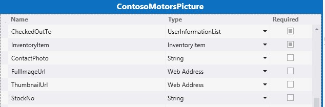

# <a name="create-a-cloud-business-add-in-that-uses-the-sap-gateway"></a>Erstellen eines Cloud-Business-Add-Ins, das das SAP-Gateway verwendet
 Erfahren Sie, wie Sie das vom Anbieter gehostete LightSwitch-SharePoint-Add-In erstellen, um mit dem SAP-Gateway für Microsoft auf SAP-Daten zuzugreifen.
 

 **Hinweis** Der Name „Apps für SharePoint“ wird in „SharePoint-Add-Ins“ geändert. Während des Übergangszeitraums wird in der Dokumentation und der Benutzeroberfläche einiger SharePoint-Produkte und Visual Studio-Tools möglicherweise weiterhin der Begriff „Apps für SharePoint“ verwendet. Weitere Informationen finden Sie unter [Neuer Name für Office- und SharePoint-Apps](new-name-for-apps-for-sharepoint#bk_newname).
 


In diesem Artikel werden die wichtigsten Schritte des Entwicklungsteams von Microsoft bei der Erstellung eines vom SharePoint-Anbieter gehosteten LightSwitch-Add-Ins erläutert, mit dem auf SAP-Daten mit dem SAP-Gateway für Microsoft zugegriffen werden kann. Dieses Add-In unterstützt CRUD-Vorgänge für SAP-Daten und kann zum Anzeigen von Bildern aus und zum Hochladen von Bildern zu einer SharePoint-Bildbibliothek verwendet werden.

 

Der Zweck dieses Artikels besteht darin, die wichtigsten Punkte des Add-Ins aufzuzeigen, die Sie beim Erstellen ähnlicher Add-Ins unterstützen. Es wird auch ein Codebeispiel bereitgestellt und mit dem Artikel verknüpft, damit Sie besser nachvollziehen können, wie die funktionierende Lösung erstellt wurde.
 

 **Beispiel zum Herunterladen:** [ Beispiel: Entwickeln eines Cloud-Business-Add-Ins für den Zugriff auf SAP-Gateway für Microsoft](https://code.msdn.microsoft.com/Sample-Developing-a-Cloud-25d6d1ea)
 

## <a name="before-you-begin"></a>Bevor Sie beginnen

Für die in diesem Artikel beschriebenen Verfahren müssen die folgenden erforderlichen Komponenten vorhanden sein:
 

 

-  **Eine Office 365-Entwicklerwebsite** in einer Office 365-Domäne, die einem Microsoft Azure Active Directory (Azure AD)-Mandanten zugeordnet ist. Weitere Informationen finden Sie unter [Registrieren für ein Office 365 Developer-Abonnement, Einrichten Ihrer Tools und Umgebung und Beginnen mit der Bereitstellung Ihres Add-Ins](http://msdn.microsoft.com/en-us/library/office/fp179924%28v=office.15%29.aspx) oder [Vorgehensweise: Erstellen einer Entwicklerwebsite in Ihrem vorhandenen Office 365-Abonnement](http://msdn.microsoft.com/en-us/library/office/jj692554%28v=office.15%29.aspx).
    
 
-  **Visual Studio 2013 Update 4** oder höher, das Sie unter [Willkommen bei Visual Studio 2013](http://msdn.microsoft.com/en-us/library/dd831853.aspx) abrufen können.
    
 
-  **Microsoft Office Developer Tools für Visual Studio**. Die Version, die in Update 4 von Visual Studio 2013 oder höher enthalten ist.
    
 
-  **SAP-Gateway für Microsoft** wird in Microsoft Azure bereitgestellt und konfiguriert. Weitere Informationen finden Sie in der Dokumentation zum [SAP-Gateway für Microsoft](http://go.microsoft.com/fwlink/?LinkId=507635).
    
 
-  **Ein Organisationskonto in Microsoft Azure. ** Weitere Informationen finden Sie unter [Grundlagen der Anwendungsregistrierung in Azure AD](http://go.microsoft.com/fwlink/?LinkID=512580).
    
     **Hinweis** Melden Sie sich bei Ihrem Office 365-Konto an (login.microsoftonline.com), um das temporäre Kennwort zu ändern, nachdem das Konto erstellt wurde.
-  **Ein SAP-OData-Endpunkt** mit Beispieldaten. Weitere Informationen finden Sie in der Dokumentation zum [SAP-Gateway für Microsoft](http://go.microsoft.com/fwlink/?LinkId=507635).
    
 
-  **Grundkenntnisse zu Azure AD.** Weitere Informationen finden Sie unter [Erste Schritte mit Azure AD](http://msdn.microsoft.com/en-us/library/azure/dn655157.aspx).
    
 
-  **Grundkenntnisse in der Erstellung von SharePoint-Add-Ins.** Weitere Informationen finden Sie unter [Erste Schritte beim Erstellen von von einem Anbieter gehosteten SharePoint-Add-Ins](http://msdn.microsoft.com/en-us/library/office/fp142381%28v=office.15%29.aspx).
    
 
-  **Grundkenntnisse zu OAuth 2.0 in Azure AD**. Weitere Informationen finden Sie unter [OAuth 2.0 in Azure AD](http://msdn.microsoft.com/en-us/library/azure/dn645545.aspx) und den untergeordneten Themen.
    
 

## <a name="solution-overview"></a>Die Lösung im Überblick

Das fiktive Autounternehmen Contoso Motors verkörpert ein echtes Unternehmensszenario, in dem ein Autohaus Informationen über seinen Fahrzeugbestand für Handelsvertreter und andere Händler freigibt. Mithilfe dieses Add-Ins kann das Verkaufspersonal den aktuellen Fahrzeugbestand prüfen, auf den das Add-In direkt über SAP mit dem SAP-Gateway für Microsoft zugreift. Alle in SAP gespeicherten Daten und ein Bild von jedem Fahrzeug sind in einer Bildbibliothek in SharePoint Online gespeichert. In diesem Add-In werden die Daten aus SAP und der SharePoint-Bildbibliothek zusammengeführt und angezeigt. Innerhalb des Add-Ins können Manager und Administratoren Standard-CRUD-Vorgänge für detaillierte Informationen zu jedem Fahrzeug in SAP durchführen.
 

 
Im Beispiel in diesem Artikel werden die Fahrzeugbestandsdaten aus SAP und die zugehörigen Bilder in der SharePoint-Bildbibliothek von dem SellerDashboard-Add-In gehandhabt. Mit diesem Add-In werden die standardmäßigen CRUD-Vorgänge (Create, Read, Update und Delete) für die Detailinformationen zu jedem Fahrzeug in SAP unterstützt.
 

 

 **Tipp** Eine Videovorführung dieses Add-Ins finden Sie im Video [Technisches Webinar – SAP-Gateway für Microsoft &amp; das Microsoft Azure-Entwicklungsmodell](http://go.microsoft.com/fwlink/?LinkId=517378) auf BrightTalk. Das Demo der Add-In-Funktionalität beginnt ab der 48. Minute.
 

 **Codearchitektur**
 

 
Die SellerDashboard-Projektmappe enthält acht Projekte, und wie die folgende Abbildung zeigt, ist sie in zwei Kategorien unterteilt: BoxXDataStudio und SellerDashboardStudio.
 

 

 

 

### <a name="boxxdatastudio"></a>BoxXDataStudio

Dieses Studio enthält alle Komponenten, die für die Interaktion mit dem SAP-Gateway für Microsoft erforderlich sind.
 

 

-  **AADAuthLib**
    
    Mit dieser Komponente wird der [Azure AD-Autorisierungscodeablauf](https://msdn.microsoft.com/en-us/library/azure/dn645542.aspx) ausgeführt, der ein Singleton-Muster verwendet.
    
    Der folgende Codeausschnitt zeigt die Hauptfunktion, die die AADAuthLib-Komponente bereitstellt. Ausführlichere Informationen finden Sie unter der AADAuthLib/AuthUtil.cs-Hilfsklasse im Beispielcode.
    


```C#
  // Use the auth code, acquire the refresh token and access token, and store them in the current session
        public bool AcquireTokenFromAuthCode(string authCode, string redirectUrl = "redirectUrl")
        {
            if (!IsAuthorized &amp;&amp; !string.IsNullOrEmpty(authCode))
            {
                AuthenticationResult authResult = _authContext.AcquireTokenByAuthorizationCode(authCode,
                    new Uri(ConfigurationManager.AppSettings["ida:" + redirectUrl]),
                    _clientCredential,
                    ConfigurationManager.AppSettings["ida:ResourceUrl"]);

                HttpContext.Current.Session["RefreshToken"] = authResult.RefreshToken;
                HttpContext.Current.Session["AccessToken-" + ConfigurationManager.AppSettings["ida:ResourceUrl"]] = new Tuple<string, DateTimeOffset>(authResult.AccessToken, authResult.ExpiresOn);

                return true;
            }

            return false;
  }

 // Provide the access token, which is stored in the current session, if the access token expired, use the refresh token get a new one.
 public string AccessToken
        {
            get
            {
                if (!IsAuthorized) throw new UnauthorizedAccessException();

                var accessToken = HttpContext.Current.Session["AccessToken-" + ConfigurationManager.AppSettings["ida:ResourceUrl"]] as Tuple<string, DateTimeOffset>;

                if (IsAccessTokenValid(accessToken))
                {
                    return accessToken.Item1;
                }

                accessToken = RenewAccessToken();
                HttpContext.Current.Session["AccessToken-" + ConfigurationManager.AppSettings["ida:ResourceUrl"]] = accessToken;

                return accessToken.Item1;
            }
  }
```

-  **BoxXDataService**
    
    Dies ist ein WCF-RIA-Dienst, der die von der in Azure gehosteten serverseitigen SellerDashboard-Komponente verwendete Schnittstelle darstellt und die SAP-Datenquelle vom SAP-Gateway für Microsoft verwendet.
    
    Der folgende Codeausschnitt ist die CRUD-Webmethode, die der WCF-RIA-Dienst unterstützt. Weitere Details finden Sie unter „BoxXDataService/BoxXDataService.cs“.
    


```C#
  [Query(IsDefault = true)]
        public IQueryable<InventoryItem> GetAllCarInventory()
        {
            BoxXDataReader dataReader = BoxXDataReader.Instance;
            IInventoryCollection dataCollection = ModelFactory.CreateInventoryCollection(dataReader.SchemaPropertyNames);
            IInventoryQuery query = QueryFactory.CreateQuery();
            dataReader.GetData(dataCollection, query);

            return dataCollection.Items.Cast<InventoryItem>().AsQueryable();
        }

        [Update]
        public void UpdateCarInventoryItem(InventoryItem carInventoryItem)
        {
            BoxXDataUpdater dataUpdater = BoxXDataUpdater.Instance;
            dataUpdater.UpdateInventoryItem(carInventoryItem);
        }

        [Insert]
        public void InsertCarInventoryItem(InventoryItem carInventoryItem)
        {
            BoxXDataCreater dataCreater = BoxXDataCreater.Instance;
            dataCreater.CreateInventoryItem(carInventoryItem);
        }

        [Delete]
        public void DeleteCarInventoryItem(InventoryItem carInventoryItem)
        {
            BoxXDataDeleter.DeleteInventoryItem(carInventoryItem.ID);
 }
```

-  **CarInventoryBoxXDataOperation**
    
    Dies ist die tatsächliche CRUD-Implementierung für BoxXDataService. Die folgende Abbildung veranschaulicht die grundlegende Codearchitektur von CarInventoryBoxXDataOperation. Der CRUD-Namespace wird zum Implementieren von CRUD-Vorgängen verwendet, und der Util-Namespace ist der Hilfscode für den CRUD-Namespace.
    
  
 

 

 
-  **CarInventoryModel**
    
    Dies ist ein Bibliotheksprojekt, das zum Implementieren des Datenmodells und von Hilfsprogrammen verwendet wird. Die Datenmodelldefinition muss mit den Metadaten des vom SAP-Gateway für Microsoft verwendeten Data-Endpunkts übereinstimmen, welches auf dem SAP-Datenschema basiert. Es wird von BoxXDataService und CarInventoryBoxXDataOperation zum Konvertieren des SAP-Datenbankelements in eine Fahrzeugbestandsinstanz verwendet.
    
    In der folgenden Abbildung werden die Hauptkomponenten dargestellt.
    
 

 

 

 

 

### <a name="sellerdashboardstudio"></a>SellerDashboardStudio

SellerDashboardStudio enthält LightSwitch-SharePoint-Add-In-Standardkomponenten.
 

 

-  **SellerDashboard**
    
    SellerDashboard ist das StartUp-Projekt und wird zum Veröffentlichen des SellerDashboard-Add-Ins auf der Azure-Website und des SharePoint-Add-Ins auf der SharePoint-Entwicklerwebsite verwendet.
    
 
-  **SellerDashboard.HTMLClient**
    
    Diese Komponente enthält die Bildschirme, ein benutzerdefiniertes Steuerelement und ein Steuerelement zum Hochladen von Fotos. Die folgende Abbildung zeigt die Hauptkomponenten.
    
 
- 
  
 

    SellerDashboard.HTML.Client umfasst die folgenden vier Bildschirme:
    
 

      - BrowseInventoryItems ist der Startbildschirm und wird zum Durchsuchen von grundlegenden Informationen für alle Bestandselemente verwendet.
    
 
  - ViewInventoryItem ist der Detailbildschirm und wird zum Anzeigen einer detaillierten Ansicht für jedes Bestandselement verwendet.
    
 
  - EditInventoryItem ist der Popupbildschirm "Bearbeiten" und wird zum Bearbeiten eines Bestandselement verwendet.
    
 
  - AddInventoryItem ist ein Popupbildschirm "Hinzufügen" und wird zum Hinzufügen eines neuen Bestandselements verwendet.
    
 

    Die Datei „UserCode.js“ enthält den benutzerdefinierten UX-Steuerelementcode.
    
    Die Dateien "photohelper.js" und "sharepointauthhelper.js" im Skriptordner basieren auf dem Leitfaden im Artikel  [Exemplarische Vorgehensweise: Erstellen eines Add-Ins für SharePoint mithilfe von LightSwitch](http://msdn.microsoft.com/en-us/library/jj969621.aspx).
    
 
-  **SellerDashboard.Server**
    
    Diese Komponente umfasst die WCF-RIA-Datenquelle, die SharePoint-Datenquelle und die Fotoupload-Web-API. In der folgenden Abbildung werden die Hauptkomponenten dargestellt.
    
  
 

    SharePointContext.cs und TokenHelper.cs sind die Hilfsklassen, die den Clientkontext zum Authentifizieren für SharePoint bereitstellen. Damit kann die Fotoupload-Web-API zum Hochladen von Fahrzeugfotos in die Bildbibliothek verwendet werden. Die Dateien "PhotoListHelper.cs" und "PhotosController.cs" implementieren die Fotoupload-Web-API. Weitere Informationen zur Verwendung der Fotoupload-Web-API mit LightSwitch finden Sie im Artikel  [Vorgehensweise: Erstellen eines Add-Ins für SharePoint mithilfe von LightSwitch](http://msdn.microsoft.com/en-us/library/jj969621.aspx).
    
 
-  **SellerDashboard.SharePoint**
    
    Diese Komponente ist nach der LightSwitch-Lösung zum Aktivieren des SharePoint-Projekts enthalten. Mit dieser Komponente können Sie die für die Bildbibliothek verwendete SharePoint-Website konfigurieren und die benötigten Berechtigungen für das Add-In festlegen. SellerDashboard benötigt die Berechtigungsstufe "Vollzugriff" für die SharePoint-Website, die die Bildbibliothek hostet.
    
 

## <a name="implementation"></a>Implementierung


 

 

### <a name="overview"></a>Übersicht

In der folgenden Abbildung werden die Komponenten dargestellt, die SellerDashboard beeinflussen. Die durchgezogene Linie veranschaulicht den Datenfluss, und die punktierte Linie den OAuth-Fluss. Die grünen Komponenten sind mit den SAP-Datenvorgängen verknüpft, die blauen Komponenten sind mit dem SharePoint-Bildbibliotheksvorgang verknüpft, und die orangefarbenen Komponenten stellen die Vorgänge der gesamten SellerDashboard-App dar.  
 

 
 **SellerDashboard Solution**
 

 

 

 

 

 

### <a name="data-mashup"></a>Datenmashup

LightSwitch unterstützt das Datenmashup durch Hinzufügen einer Beziehung zwischen den zwei Datenquellen im Designer.
 

 
 **SAP-Datenquelle**
 

 

-  *Datenschema in SAP-Datenbank* 
    
    Der folgende Codeausschnitt zeigt ein Beispiel für ein Datenschema aus dem SAP-Gateway für Microsoft.
    


```XML
  
<?xml version="1.0" encoding="UTF-8"?> 
- <edmx:Edmx xmlns:sap="http://www.sap.com/Protocols/SAPData" xmlns:m="http://schemas.microsoft.com/ado/2007/08/dataservices/metadata" 
xmlns:edmx:"http://schemas.microsoft.com/ado/2007/06/edmx" Version="1.0">
   - <edmx:DataServices m:DataServiceVersion="2.0">
      - <Schema xml:lang="en" xmlns="http://schemas.microsoft.com/ado/2008/09/edm" Namespace="ZCAR_POC_SRV">
         - <EntityType sap:content-version="1" Name="ContosoMotors">
              - <Key>
                     <PropertyRef Name="ID"/>
               </Key>
               <Property Name="ContactPhone" Type="Edm.String"/>
               <Property Name="ContactEmail" Type="Edm.String"/>
               <Property Name="ID" Type="Edm.Int32" Nullable="false"/>
               <Property Name="BuyerEmail" Type="Edm.String" MaxLength="255"/>
               <Property Name="MaxPower" Type="Edm.Int32" Nullable="false"/>
               <Property Name="Engine" Type="Edm.String" Nullable="false" MaxLength="255"/>
               <Property Name="BodyStyle" Type="Edm.String" Nullable="false" MaxLength="255"/>
               <Property Name="Transmission" Type="Edm.String" Nullable="false" MaxLength="255"/>
               <Property Name="Year" Type="Edm.Int32" Nullable="false"/>
               <Property Name="Model" Type="Edm.String" Nullable="false" MaxLength="255"/>
               <Property Name="Brand" Type="Edm.String" Nullable="false" MaxLength="255"/>
               <Property Name="ExtColor" Type="Edm.String" Nullable="false" MaxLength="255"/>
              <Property Name="IntColor" Type="Edm.String" Nullable="false" MaxLength="255"/>
              <Property Name="ContactName" Type="Edm.String" Nullable="false" MaxLength="255"/>
              <Property Name="Price" Type="Edm.String" Nullable="false"/>
              <Property Name="StockNo" Type="Edm.String" Nullable="false"/>
              <Property Name="Arrived_Date" Type="Edm.DateTime" Nullable="false" Precision="0"/>
              <Property Name="Status" Type="Edm.String" Nullable="false" MaxLength="255"/>
      </EntityType>
   - <EntityContainer Name="ZCAR_POC_SRV_Entities" m:IsDefaultEntityContainer="true">
          <EntitySet sap:content-version="1" Name="ContosoMotorsCollection" sap:searchable="true" EntityType="ZCAR_POC_SRV.ContosoMotors"/>
     </EntityContainer>
     <atom:link xmlns:atom="http://www.w3.org/2005/Atom" href="http://contoso.cloudapp.net:8080/perf/sap/opu/odata/sap/ZCAR_POC_SRV/$metadata" rel="self"/>
     <atom:link xmlns:atom="http://www.w3.org/2005/Atom" href="http://contoso.cloudapp.net:8080/perf/sap/opu/odata/sap/ZCAR_POC_SRV/$metadata" rel="latest-version"/>
</Schema>
</edmx:DataServices>
</edms:Edmx>               

```


    This is our test data base, and the Property Type and Nullable value is based on the scenario. The ID is the PropertyRef and the OData CRUD operation is based on ID. The StockNo property is used to mash data with the car picture that is stored in SharePoint picture library.
    
 
-  *Für den RIA-Dienst definiertes Datenmodell* 
    
```C#
  public interface IInventoryItem
        {
        IEnumerable<InventoryPropertyName> ValidPropertyNames { get; }
        bool IsValid { get; }

        int ID { get; set; }
        DateTime ArrivedDate { get; set; }
        string BodyStyle { get; set; }
        string Brand { get; set; }
        string BuyerEmail { get; set; }
        string ContactEmail { get; set; }
        string ContactName { get; set; }
        string ContactPhone { get; set; }
        string Engine { get; set; }
        string ExtColor { get; set; }
        IEnumerable<Uri> Images { get; }
        string IntColor { get; set; }
        int MaxPower { get; set; }
        string Model { get; set; }
        decimal Price { get; set; }
        bool Removed { get; }
        string Status { get; set; }
        string StockNo { get; set; }
        string Transmission { get; set; }
        int Year { get; set; }

        void AddImageUrl(Uri url);
        bool CopyFrom(IInventoryItem other);
        object GetPropertyValue(InventoryPropertyName property);
        void MarkAsRemoved();
        void SetPropertyValue(InventoryPropertyName property, object value);
       }

        public interface IInventoryCollection
       {
        IEnumerable<InventoryPropertyName> QueriedPropertyNames { get; }
        IEnumerable<IInventoryItem> Items { get; }
        bool Valid { get; }

        IInventoryItem this[int id] { get; }
        bool Contains(int id);
        void AddItem(IInventoryItem inventoryItem);
        IInventoryCollection Filter(Predicate<IInventoryItem> match);
        bool CopyFrom(IInventoryCollection other);
}

```


    Any property that isn't included in the SAP database schema can be ignored. For example, the  **Images** property was added here for scalability considerations. This data model is a middle layer between the real SAP database and the SellerDashboard.Server data source. The LightSwitch project has two components: View and Server. When you add an external data source on the Server side, LightSwitch helps you build an abstract data layer that is added to the data source on the Server side.
    
    Most of the properties have the same type as the properties in the SAP database schema, except for StockNo, whose type has been changed from  **int** to **string**. This is because StockNo is used as a way to define the relationship between the SAP data and SharePoint picture library.
    
     **Tip**  StockNo must have the type  **string** because the value stored in the SharePoint picture library is **Text**. These two types must match in order to accomplish the data mashup.

    The implementation of the two interfaces is in CarInventoryModel/InventoryItem.cs and CarInventoryModel/InventoryCollection.cs.
    
 
-  *Von der LightSwitch-Serverseite genutzte Datenquelle* 
    
  
 

    Wenn Sie den WCF-RIA-Dienst (BoxXDataService) auf dem SellerDashboard-Server hinzufügen, ist das in CarInventoryModel definierte Datenmodell miteinbezogen, und Sie erhalten die Tabelle mit relevanten Daten. Sie können den Typ einiger Eigenschaften ändern. Sie können z. B. den **BuyerEmail**-Typ von **Zeichenfolge** in **E-Mail-Adresse** ändern, wodurch die Überprüfung des E-Mail-Formats auf Clientseite in LightSwitch unterstützt wird.
    
 
 **SharePoint-Bildbibliothek**
 

 
Die Bildbibliothek auf der SharePoint-Hostwebsite heißt „ContosoMotorsPictureLibrary“ und enthält drei neue Spalten mit den Namen „StockNo“, „ThumbnailUrl“ und „FullImageUrl“. Alle Spalten sind als **Text**-Felder konfiguriert.
 

 

 **Tipp** Bei Spaltennamen wird die Groß-/Kleinschreibung beachtet.
 

 Die StockNo-Spalte wird zum Erstellen einer Beziehung zu SAP-Daten verwendet. Die Spalten "ThumbnailUrl" und "FullImageUrl" werden zum einfachen Abrufen der URL für das relevante Foto verwendet.
 

 
 *Von der LightSwitch-Serverseite genutzte Datenquelle* 
 

 
ContosoMotorsPicture ist ein LightSwitch-Datenquellenmodell, das der Bildbibliothek der SharePoint-Hostwebsite auf der LightSwitch-Serverseite zugeordnet ist.
 

 

 

 
 **Datenbeziehung**
 

 
Fügen Sie eine 1:0-Beziehung oder eine 1:1-Beziehung zwischen InventoryItem und ContosoMotorsPicture hinzu. In der folgenden Abbildung wird dargestellt, wie dies unter Verwendung von LightSwitch in Visual Studio aussieht.
 

 

 

 

 

 

### <a name="oauth-with-azure-ad-amp-acs"></a>OAuth mit Azure AD &amp; ACS

Dieser Abschnitt enthält eine Übersicht darüber, wie das Add-In OAuth in Azure AD und Zugriffssteuerungsdienste (Access Control Services, ACS) implementiert.
 

 
 **Übersicht**
 

 
SellerDashboard ist ein vom SharePoint-Anbieter gehostetes Add-In, das beide Datenquellen verwendet: die SharePoint-Bildbibliothek und SAP-Daten mit dem SAP-Gateway für Microsoft.
 

 
Für den Zugriff auf die SharePoint-Bildbibliothek muss SellerDashboard ACS authentifizieren und einen Zugriffstoken von ACS abrufen. Für den Zugriff auf SAP-Daten muss SellerDashboard jedoch einen anderen Zugriffstoken von Azure AD abrufen, da das SAP-Gateway für Microsoft Azure AD für die Authentifizierung und Autorisierung verwendet.
 

 

 

 
 **Implementierung**
 

 
SellerDashboard ist ein vom SharePoint-Anbieter gehostetes Add-In, die den Fotouploadvorgang unter Verwendung des clientseitigen SharePoint-Objektmodells unterstützt. Der zum Erstellen vom Clientkontext für den SharePoint-Host verwendete SharePoint-Kontext wird zwischengespeichert, und der Clientkontext wird dann von der Upload-Web-API verwendet.
 

 
Nachdem der OAuth mit ACS-Prozess abgeschlossen ist, wird die Authentifizierungsanforderung an Azure AD gesendet. Um diesen Prozess abzuschließen, verwendet das Add-In ein Cookie zum Anmelden bei Login.MicrosoftOnline.com und dann zum Abschließen des Azure AD-Autorisierungscodeflusses. Dieser gibt ein Aktualisierungstoken zurück, das vom Add-In für zukünftige Authentifizierungsanforderungen während der Sitzung zwischengespeichert wird.
 

 


```C#
protected override void Page_Load(object sender, EventArgs e)
{
    if (!IsPostBack)
    {
 SharePointContext spContext = SharePointContextProvider.Current.GetSharePointContext(Context);
        if (spContext != null)
        {
     // Cache the SharePoint Context, which will be used to create Client Context for SharePoint host
            _spContext = spContext;
        }

        
        // Acquire refresh token and access token, and store them in the current session, which will be used do the OAuth with AAD for operating the SAP data
        AuthUtil.Instance.AcquireTokenFromAuthCode(Request.QueryString["code"]);

        if (!AuthUtil.Instance.IsAuthorized)
        {
             Response.Redirect(AuthUtil.Instance.AuthCodeUrl);
        }
     }

     base.Page_Load(sender, e);
 }
```

Ausführliche Informationen finden Sie unter „SellerDashBoard.Server/SharePointLaunch.aspx.cs“ und „AADAuthLib/AuthUtil.cs“ im Codebeispiel.
 

 
SellerDashboard.Server enthält die Dateien "SharePointContext.cs" und "TokenHelper.cs", die zum Abrufen von Nur-Add-In-Clientkontext für den SharePoint-Host verwendet werden. Diese zwei Dateien werden von Visual Studio automatisch zu Ihrem SharePoint-Projekt hinzugefügt. (Visual Studio benennt das Projekt < *IhrProjektname*  >Web, z. B. SharePointAppWeb.) Sie können dann die zwei Dateien in Ihren SellerDashboard-Add-In-Quellcode hinzufügen und in Ihr Projekt einbeziehen.
 

 

### <a name="crud-operations-on-sap-data-from-sap-gateway-for-microsoft"></a>CRUD-Vorgänge für SAP-Daten im SAP-Gateway für Microsoft

Im folgenden Codeausschnitt wird die Hauptcodelogik der CRUD-Vorgänge dargestellt. Weitere Informationen finden Sie unter Implementierung von CarInventoryBoxXDataOperation im Codebeispiel.
 

 
 **BoxXDataCreater**
 

 


```C#

        public void CreateInventoryItem(IInventoryItem inventoryItem)
        {
            if (_model == null)
            {
                _model = BoxXDataCRUDHelpers.GetMetadata(BoxXDataCRUDHelpers.MetadataUrl);
            }

            // Create new entry request generate
            var requestMessage = new ODataClientRequestMessage(new Uri(BoxXDataCRUDHelpers.DataCollectionUrl),
                                                                ODataConstants.MethodPost);
            BoxXDataCRUDHelpers.CreateEntryRequestHeaderSetter(requestMessage, AuthUtil.Instance.AccessToken);
            BoxXDataCRUDHelpers.SetODataRequestContent(requestMessage, _model, inventoryItem);

            // Create new entry request execute
            IODataResponseMessage responseMessage = requestMessage.GetResponse();

        }
BoxXDataReader
 public void GetData(IInventoryCollection dataCollection, IInventoryQuery query)
        {
            GetValueWithoutLocallyFiltering(dataCollection, query);

            if (query.Filters.Any())
            {
                var filteredCollection = dataCollection.Filter(inventoryItem =>
                    query.Filters.Any(filter => filter.Match(inventoryItem)));

                dataCollection.CopyFrom(filteredCollection);
            }
        }
```

 **BoxXDataUpdater**
 

 


```C#
public void UpdateInventoryItem(IInventoryItem inventoryItem)
        {
            if (_model == null)
            {
                _model = BoxXDataCRUDHelpers.GetMetadata(BoxXDataCRUDHelpers.MetadataUrl);
            }

            // Update existing entry request generate
            var requestMessage = new ODataClientRequestMessage(new Uri(BoxXDataCRUDHelpers.DataCollectionUrl + '(' + inventoryItem.ID + ')'),
                                                                ODataConstants.MethodPut);
            BoxXDataCRUDHelpers.UpdateEntryRequestHeaderSetter(requestMessage, AuthUtil.Instance.AccessToken);
            BoxXDataCRUDHelpers.SetODataRequestContent(requestMessage, _model, inventoryItem);

            // Update existing entry request execute
            IODataResponseMessage responseMessage = requestMessage.GetResponse();
        }
BoxXDataDeleter
 public static void DeleteInventoryItem(int ID)
        {
            // Delete existing entry request generate
            var requestMessage = new ODataClientRequestMessage(new Uri(BoxXDataCRUDHelpers.DataCollectionUrl + '(' + ID + ')'),
                                                                ODataConstants.MethodDelete);
            BoxXDataCRUDHelpers.DeleteEntryRequestHeaderSetter(requestMessage, AuthUtil.Instance.AccessToken);

            // Delete existing entry request execute
            IODataResponseMessage responseMessage = requestMessage.GetResponse();
        }
```


### <a name="uploading-photos-to-the-sharepoint-picture-library"></a>Hochladen von Fotos in die SharePoint-Bildbibliothek

Mit dem Fotoupload-Steuerelement und dem Implementieren der Fotoupload-Web-API werden Fotos in der SharePoint-Bildbibliothek hochgeladen. Dabei wird der folgende Code verwendet, der auf dem Leitfaden im Artikel  [Vorgehensweise: Erstellen eines Add-Ins für SharePoint mithilfe von LightSwitch](http://msdn.microsoft.com/en-us/library/jj969621.aspx) basiert.
 

 
 **Änderungen für photohelper.js:**
 

 
Fügen Sie dem Uploadformular ein neues Feld hinzu, mit dessen Hilfe die StockNo an die Foto-Upload-Web-API übergeben wird.
 

 


```

uploadForm = $(
             '<form id="uploadForm" method="POST" enctype="multipart/form-data" action="' + API_URL + '"  data-ajax="false" target="uploadTargetIFrame">' +
             '   <input name="fileInput" id="fileInput" type="file" size="30" data-theme="c" accept="image/*" multiple="true"/>' +
             '   <input type="hidden" name=' + screen.InventoryItem.StockNo + '>' +
             '</form>');

```

Fügen Sie die Logik für das Zwischenspeichern der Bild-URL und die Logik zum Zurücksetzen des Bilds hinzu.
 

 


```
function completeUpload(uploadedFiles) {
            var fullImageUrl = uploadedFiles[0];
            var photoNameWithExt = fullImageUrl.substr(fullImageUrl.lastIndexOf('/') + 1);
            var photoNameWithoutExt = photoNameWithExt.substr(0, photoNameWithExt.lastIndexOf("."));
            var photoPathUri = fullImageUrl.substr(0, fullImageUrl.lastIndexOf('/'));
            var photoExt = photoNameWithExt.substr(photoNameWithExt.lastIndexOf(".") + 1, photoNameWithExt.length);
            var thumbnailUrl = photoPathUri + "/_t/" + photoNameWithoutExt + "_" + photoExt + ".jpg";
            setCacheUrl(screen.InventoryItem.StockNo, fullImageUrl + "*#00#" + thumbnailUrl);
            setDetailsCarPicture(fullImageUrl);
            screen.closePopup();
        }
```

 **Änderungen für PhotosController.cs:**
 

 
Verwenden Sie den Nur-App-Clientkontext für den SharePoint-Host, der durch den zwischengespeicherten SharePoint-Kontext erstellt wird.
 

 
Dies ist notwendig, da ContosoMotorsPictureLibrary nicht zum SellerDashboard-Add-In gehört, sondern eher zur SharePoint-Hostwebsite. Entfernen Sie zudem den für das Löschen von Fotos relevanten Code.
 

 


```C#

private ClientContext AppWebContext
    {
        get
        {
            if (appWebContext == null)
            {
                appWebContext = SharePointLaunch.getAppWebContext();
            }
            return appWebContext;
        }
    }

```

 **Änderungen für PhotoListHelper.cs:**
 

 
Fügen Sie die Logik zum Aktualisieren von Fotos, mit der alte Fotoelemente, falls vorhanden, gelöscht werden hinzu, und fügen Sie dann ein neues Fotoelement hinzu. Weisen Sie die StockNo-Eigenschaft des neues Fotoelements zu und legen Sie die FullImageUrl- und ThumbnailUrl-Werte für das neue Fotoelement fest.
 

 


```C#

            // Delete the old picture item
            foreach (ListItem item in items)
            {
                if (!string.IsNullOrEmpty((string)(item["StockNo"])))
                {
                    string tempStockNo = item["StockNo"].ToString();
                    if (tempStockNo.Equals(stockNo))
                    {
                        item.DeleteObject();
                        siteContext.ExecuteQuery();
                        break;
                    }
                }
            }

            // Update the new picture item
            foreach (ListItem item in items)
            {
                string fullImageName = item["FileLeafRef"].ToString();
                string thumbnailName = fullImageName.Replace('.', '_') + ".jpg";

                if (photoUri.Contains(fullImageName))
                {
                    item["StockNo"] = stockNo;
                    item["FullImageUrl"] = photoUri;
                    item["ThumbnailUrl"] = photoUri.Replace(fullImageName, "_t/" + thumbnailName);
                    item.Update();
                    siteContext.ExecuteQuery();
                    break;
                }
            }


```


### <a name="user-experience"></a>Benutzererfahrung

Für die Anforderungen dieses Szenarios werden viele benutzerdefinierte Steuerelemente implementiert. Den relevanten Code finden Sie in der Datei "UserCode.js". Mit dem LightSwitch-Designer können Sie im Handumdrehen eine einfache Benutzeroberfläche erstellen. Möglicherweise entspricht der übliche Bildschirmsatz Ihren Testanforderungen. Da der Schwerpunkt dieses Dokuments nicht auf der Benutzerfreundlichkeit liegt, werden hier keine detaillierten Informationen bereitgestellt.
 

 

## <a name="deploying-the-app"></a>Bereitstellen der App

Führen Sie zum Bereitstellen des Add-Ins die in diesem Abschnitt beschriebenen Schritte durch. Stellen Sie vor dem Bereitstellen des Add-Ins sicher, dass das SAP-Gateway für Microsoft im Azure-Mandanten bereitgestellt und konfiguriert wurde.
 

 

### <a name="create-your-azure-web-site"></a>Erstellen der Azure-Website


1. Melden Sie sich als globaler Administrator beim [Microsoft Azure-Portal](http://go.microsoft.com/fwlink/?LinkID=512959) an.
    
 
2. Klicken Sie im linken Menü auf **Websites**.
    
     **Hinweis** Diese Website werden Sie zum Hosten des vom Anbieter gehosteten SharePoint-Add-Ins für das SellerDashboard verwenden.
3. Klicken Sie in der Befehlsleiste am unteren Rand der Seite auf **Neu**.
    
 
4. Wählen Sie **Berechnen > Website > Schnellerfassung** aus.
    
 
5. Geben Sie im Feld **URL** den ersten Teil der URL ein, die Sie verwenden möchten, und klicken Sie dann auf **Website erstellen**. Kopieren Sie diese URL, da Sie sie bei der Registrierung des Add-Ins im späteren Verlauf dieses Artikels benötigen. Verwenden Sie z. B. „Contoso.azurewebsites.net“.
    
 

### <a name="register-the-sharepoint-app"></a>Registrieren der SharePoint-App

Mit einem leeren SharePoint-Add-In werden dem SharePoint-Add-In Leseberechtigungen gewährt, die zum Abrufen von Fahrzeugfotos aus der Bildbibliothek in SharePoint Online benötigt werden.
 

 

### <a name="to-register-the-sharepoint-add-in"></a>So registrieren Sie das SharePoint-Add-In


1. Öffnen Sie die Projektmappe im Projektmappen-Explorer.
    
 
2. Geben Sie in den Eigenschaften des SharePoint-Add-Ins die **Website-URL** der SharePoint-Website ein, die die Bildbibliothek enthält. Melden Sie sich in der angezeigten Anmeldeaufforderung als Websitebesitzer an.
    
 
3. Legen Sie die Leseberechtigung im Manifest der Anwendung fest.
    
  
 

 

 
4. Legen Sie das Add-In als StartUp-Projekt fest, und führen Sie das Projekt aus. Die ClientID- und ClientSecret-Werte finden Sie in der Datei "ContosoMotorsCarInventoryWeb/Web.config". Der Code sollte folgendermaßen aussehen:
    
```XML
  <add key="ClientId" value="06af1059-8916-4851-a271-2705e8cf53c6"/>
<add key="ClientSecret" value="LypZu2yVajlHfPLRn5J2hBrwCk5aBOHxE4PtKCjIQkk="/>
```

5. Ersetzen Sie die Werte von ClientID und ClientSecret unter "Gehostete Add-In-Konfiguration" in der Datei "ContosoMotorsCarInventoryWeb/TokenHelper.cs" mit den oben genannten Werten. Der Code sollte folgendermaßen aussehen:
    
```C#
  
private static readonly string ClientId = "06af1059-8916-4851-a271-2705e8cf53c6";
private static readonly string ClientSecret = "LypZu2yVajlHfPLRn5J2hBrwCk5aBOHxE4PtKCjIQkk=";

```


### <a name="register-your-web-application-with-azure-ad"></a>Registrieren Ihrer Webanwendung bei Azure AD

Die Schritte in diesem Abschnitt beschreiben, wie Sie das Beispiel-Add-In aus dem Azure-Verwaltungsportal registrieren.
 

 

1. Melden Sie sich mit Ihrem Azure-Dienstadministrator- oder -Co-Administratorkonto beim [Azure-Verwaltungsportal](http://go.microsoft.com/fwlink/?LinkID=512959) an.
    
 
2. Klicken Sie im linken Navigationsbereich auf **Active Directory**.
    
 
3. Klicken Sie auf der Active Directory-Seite auf das Verzeichnis, das für SAP-Gateway für Microsoft konfiguriert wurde.
    
     **Tipp** Wenn Sie nicht sicher sind, welches Verzeichnis verwendet wurde, fragen Sie Ihren SAP-Gateway für Microsoft-Administrator. Hinweis: Es ist das Verzeichnis, das die Benutzer und Gruppen für SAP-Gateway für Microsoft enthält.
4. Wählen Sie auf der oberen Navigationsleiste **ANWENDUNGEN**.
    
 
5. Klicken Sie am unteren Rand der Seite auf **Hinzufügen**.
    
 
6. Klicken Sie im sich öffnenden Dialogfeld auf **Eine von meinem Unternehmen entwickelte Anwendung hinzufügen**.
    
 
7. Geben Sie im Dialogfeld **Anwendung hinzufügen** einen Namen für die Anwendung ein, z. B. „SellerDashboard“.
    
 
8. Wählen Sie als Anwendungstyp **Webanwendung und/oder Web-API**, und klicken Sie dann auf den Pfeil nach rechts.
    
 
9. Verwenden Sie im Dialogfeld **Eigenschaften hinzufügen** die URL der Website, die Sie zuvor erstellt haben (im Abschnitt „Erstellen der Azure-Website“), als ANMELDE-URL. Verwenden Sie zum Beispiel *https://Contoso.azurewebsites.net*.
    
 
10. Geben Sie unter **APP-ID-URI** einen eindeutigen URI für die Anwendung ein, z. B. den Anwendungsnamen angehängt an die **ANMELDE-URL**; Beispiel: *https://Contoso.azurewebsites.net/SellerDashboard*, wobei „Contoso.azurewebsites.net“ die Website ist, die Sie im früheren Verlauf dieses Artikels erstellt haben.
    
 
11. Klicken Sie auf das Häkchen, um die Anwendung zu erstellen. 
    
    Das Azure-Dashboard für die Anwendung wird mit einer Erfolgsmeldung geöffnet.
    
 

 **Hinweis** Sie müssen das Add-In zweimal bei Azure AD registrieren: einmal zum Debuggen und dann erneut zum Bereitstellen für die Produktion, wie in Schritt 10 beschrieben. Um das Add-In zum Debuggen zu registrieren, verwenden Sie die **ANMELDE-URL** und den **ADD-IN-ID-URI** mit der Debug-URL des SellerDashboard.Server-Projekts, sodass Sie den Visual Studio-Debugger (F5) ausführen können. Diese URL hat das Format „https://localhost.*nnnn*, wobei *nnnn* eine Portnummer ist. Sie finden diese URL im Eigenschaftenbereich in Visual Studio. Wenn Sie dann zur Bereitstellung für die Produktion bereit sind, bearbeiten die Registrierung, um die richtige Produktions-URL verwenden.
 


### <a name="configure-application-settings"></a>Konfigurieren von Anwendungseinstellungen

Konfigurieren Sie die Einstellungen für die neue Anwendung, die Sie im vorherigen Verfahren erstellt haben. 
 

 

1. Klicken Sie im oberen Bereich der Anwendungsseite auf **Konfigurieren**.
    
 
2. Legen Sie Parameter nach Bedarf fest, und notieren Sie sich Konfigurationseinstellungen wie in der folgenden Tabelle beschrieben.
    

|**Parameter**|**Aktion**|
|:-----|:-----|
|Client-ID|Kopieren Sie den Wert, der im Feld "Client-ID" angezeigt wird.|
|Geheimer Clientschlüssel| Generieren Sie einen neuen Anwendungsschlüssel: Wählen Sie im Abschnitt „Schlüssel“ die Schlüsseldauer aus (1 oder 2 Jahre). Klicken Sie auf der Befehlsleiste am unteren Rand der Seite auf **Speichern**. Der Schlüsselwert wird nun angezeigt. Kopieren Sie den Schlüsselwert, und speichern Sie ihn für die zukünftige Verwendung. Er kann nicht mehr abgerufen werden, nachdem Sie die Seite verlassen haben.|
|App-ID-URI|Kopieren Sie den Wert, der im Feld **Add-In-ID-URI** angezeigt wird.|

    Remember to keep this information handy, because you'll need it in a later procedure.
    
 
3. Gehen Sie im Abschnitt **Berechtigungen für andere Anwendungen** folgendermaßen vor:
    
      1. Wählen Sie Ihre SAP-Gateway für Microsoft-Anwendung aus.
    
 
  2. Aktivieren Sie in der Spalte **Delegierte Berechtigungen** die Felder für die Berechtigungen für das SAP-Gateway für Microsoft, die das vom Anbieter gehostete SharePoint-Add-In für SellerDashboard benötigt.
    
 
4. Klicken Sie in der Befehlsleiste am unteren Rand der Seite auf **Speichern**.
    
 

### <a name="replace-the-needed-configuration-for-deployment"></a>Ersetzen der für die Bereitstellung erforderlichen Konfiguration


1. Suchen Sie „SellerDashboardHTMLClient/UserCode.js“ und darin den folgenden Codeplatzhalter:
    
```C#
  sharePointUrl: "Replace with your SharePoint host site", 
// https://fake_domain.sharepoint.com/sites/Developer
SharePointRootUrl: "Replace with your SharePoint root site"
 // https://fake_domain.sharepoint.com/ 

```


      1. Replace the sharePointUrl value with your SharePoint site, the one to which the add-in will be installed and that also contains the picture library.
    
 
  2. Ersetzen Sie den SharePointRootUrl-Wert durch die entsprechende SharePoint-Stammwebsite.
    
 
2. Suchen Sie „SellerDashboard.Server/Web.config“ in der SellerDashboard-Projektmappe, und suchen Sie den folgenden Platzhalter für die Konfiguration:
    
```XML
  <add key="ClientSecret" value="MwMp1yxOyy8BGhfD5d9VvuqlRbhaqWESxVNLzgpYNHU=" />
<add key="ClientId" value="ed138b32-c89d-4f22-b74d-7d9d5044b260" />
<add key="Ida:ClientId" value="Replace with Azure register add-in client id" />
<add key="Ida:ClientSecret" value="Replace with Azure register add-in client secret" />
<add key="Ida:TenantId" value="Replace with the SAP Gateway for Microsoft tenant domain, for example <yourDomain>.onmicrosoft.com" />
<add key="Ida:RedirectUrl" value="Replace with the Azure host site, for example https://contoso.azurewebsites.net/SharePointLaunch.aspx" />
<add key="Ida:ResourceUrl" value="Replace with the SAP Gateway for Microsoft instance, for example http://contoso.cloudapp.net/" />
<add key="Ida:ODataServiceBaseUrl" value="Replace with the SAP OData endpoint url, for example https://contoso.cloudapp.net:8081/perf/sap/opu/odata/sap/ZCAR_POC_SRV/" />
<add key="Ida:ODataServiceMetadataUrl" value="Replace with the SAP OData endpoint metadata url, for example https://contoso.cloudapp.net:8081/perf/sap/opu/odata/sap/ZCAR_POC_SRV/$metadata" />
<add key="Ida:DataCollection" value="Replace with OData EntitySet name, for example ContosoMotorsCollection" />
<add key="Ida:ODataFeedOrEntryFormat" value="application/atom+xml" />
<add key="Ida:ODataMetadataFormat" value="application/xml" />
<add key="Ida:ODataContentType" value="application/xml" />
<add key="Ida:ODataVersion" value="2.0" />
<add key="Ida:ODataMaxVersion" value="3.0" />
<add key="Ida:ODataWriterTypeName" value="Replace with the OData EntityType, for example ZCAR_POC_SRV.ContosoMotors" />
<add key="Ida:DefaultID" value="1024" />
<add key="Ida:DefaultStockNo" value="2048" />
<add key="Ida:SPPicLib" value="Replace with you picture library name, for example ContosoMotorsPictureLibrary" />
```


      1. Replace the ClientId and ClientSecret values with the values you got in the previous procedure.
    
 
  2. Ersetzen Sie die Werte „Ida:ClientId“ und „Ida:ClientSectet“ durch die Werte aus der Azure AD-App.
    
 
  3. Ersetzen Sie den Ida: TenantId-Wert durch „< *IhreDomäne* >.onmicrosoft.com“.
    
    Wenn Ihr Organisationskonto beispielsweise „someone@< *IhreDomäne* >.onmicrosoft.com“ ist, benötigen Sie „< *IhreDomäne* >.onmicrosoft.com“.
    
 
  4. Ersetzen Sie den Ida: RedirectUrl-Wert durch die Testwebsite, die Sie auf Azure erstellt haben und die dieses Add-In hostet.
    
 
  5. Ersetzen Sie den Ida:ResourceUrl-Wert mit dem SAP-Gateway für Microsoft-Instanz, die in Azure bereitgestellt und konfiguriert wurde.
    
 
  6. Ersetzen Sie den Ida:ODataServiceBaseUrl-Wert mit der OData-Endpunkt-URL für das SAP-Gateway für Microsoft-Instanz.
    
 
  7. Ersetzen Sie den Ida:ODataServiceMetadataUrl-Wert mit der OData-Endpunktmetadaten-URL für das SAP-Gateway für Microsoft-Instanz.
    
 
  8. Ersetzen Sie den Ida:DataCollection-Wert. Diesen Wert finden Sie in den Metadaten. Verwenden Sie zum Beispiel ContosoMotorsCollection.
    
 
  9. Ersetzen Sie den Ida:ODataWriterTypeName-Wert. Den richtigen Wert finden Sie in den Metadaten. 
    
    Verwenden Sie beispielsweise Folgendes:
    


```XML
  ZCAR_POC_SRV.ContosoMotors

<EntityContainer Name="ZCAR_POC_SRV_Entities" m:IsDefaultEntityContainer="true">
     <EntitySet sap:content-version="1" Name="ContosoMotorsCollection" sap:searchable="true" EntityType="ZCAR_POC_SRV.ContosoMotors"/>
</EntityContainer>
<atom:link xmlns:atom="http://www.w3.org/2005/Atom" href="http://contoso.cloudapp.net:8080/perf/sap/opu/odata/sap/ZCAR_POC_SRV.ContosoMotors"/>
```

  10. Ersetzen Sie den Ida:SPPicLib-Wert mit dem Namen der Bildbibliothek, die Sie auf der SharePoint-Hostwebsite erstellt haben.
    
 

### <a name="publish-the-project"></a>Veröffentlichen des Projekts


1. Suchen Sie nach dem SellerDashboard-Projekt in der SellerDashboard-Lösung.
    
 
2. Klicken Sie mit der rechten Maustaste auf das SellerDashboard, um das Projekt zu veröffentlichen.
    
 
3. Wählen Sie **Von Anbieter gehostet**.
    
 
4. Wählen Sie **Microsoft Azure**.
    
 
5. Melden Sie sich als globaler Administrator an.
    
 
6. Wählen Sie die Website, die Sie in Azure erstellt haben.
    
 
7. Geben Sie an, dass Sie HTTPS verwenden möchten.
    
 
8. Verwenden Sie die standardmäßigen Datenverbindungszeichenfolge.
    
 
9. Geben Sie die Website ein, die Sie in Azure als Hostwebsite erstellt haben. Geben Sie die ClientId- und ClientSecret-Werte ein, die Sie im vorherigen Verfahren erhalten haben.
    
 
10. Veröffentlichen Sie das Projekt.
    
     Sie erhalten ein veröffentlichtes Paket.
    
 

### <a name="install-the-app"></a>Installieren der App


1. Melden Sie sich als Websiteadministrator bei der SharePoint-Bereitstellungswebsite an.
    
 
2. Klicken Sie auf der Startseite der Website auf **Neues bereitzustellendes Add-In**.
    
 
3. Wählen Sie das Paket aus, das Sie beim Veröffentlichungsvorgang erhalten haben.
    
 
4. Stellen Sie es nun bereit.
    
 

## <a name="external-code-list"></a>Externe Codeliste


 

 


|**Webquelle**|**Sammlung**|**Codespeicherort**|**Lizenz**|
|:-----|:-----|:-----|:-----|
| [Survey Add-in Tutorial: Developing a SharePoint Application Using LightSwitch](http://code.msdn.microsoft.com/Survey-App-Tutorial-a70d0afd) [Exemplarische Vorgehensweise: Erstellen eines SharePoint-Add-Ins mithilfe von LightSwitch](http://msdn.microsoft.com/en-us/library/jj969621.aspx)|**Photo Uploader:** PhotoListHelper.csPhotosController.csGlobal.asax.cs| [Survey Add-in Tutorial: Developing a SharePoint Application Using LightSwitch (C#)](http://www.getcodesamples.com/src/2571E87E/)|Apache-Lizenz, Version 2.0|
|keine|**ACS Auth:** SharePointContext.csTokenHelper.cs|**Interne VS-Vorlagen:** Visual C#/Office/SharePoint/Apps/AppforSharePoint||
