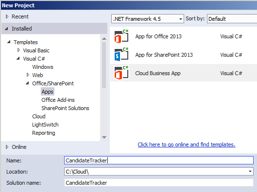

# <a name="create-a-cloud-business-add-in-with-a-social-newsfeed"></a><span data-ttu-id="0f7a0-101">Erstellen eines Cloud-Business-Add-Ins mit einem sozialen Newsfeed</span><span class="sxs-lookup"><span data-stu-id="0f7a0-101">Create a cloud business add-in with a social newsfeed</span></span>
<span data-ttu-id="0f7a0-p101">Mit der **Cloud-Geschäfts-Add-In**-Vorlage in Visual Studio können Sie SharePoint-Add-Ins erstellen, in denen Benutzer SharePoint-Daten anzeigen, hinzufügen und aktualisieren können. Der Projekttyp des **Cloud-Geschäfts-Add-Ins** verwendet Visual Studio LightSwitch-Technologien, die den Prozess zum Erstellen von in SharePoint gehosteten Geschäfts-Add-Ins deutlich vereinfachen. In dieser exemplarischen Vorgehensweise erstellen Sie ein Add-In zum Verfolgen von Kandidaten, die die Funktion von SharePoint für Office 365 zur Integration von sozialen Netzwerken nutzt, um einen Newsfeed für das Add-In bereitzustellen.</span><span class="sxs-lookup"><span data-stu-id="0f7a0-p101">By using the **Cloud Business Add-in** template in Visual Studio, you can create SharePoint Add-ins in which users can view, add, and update SharePoint data. The **Cloud Business Add-in** project type uses Visual Studio LightSwitch technologies, which greatly simplify the process of creating business add-in hosted on SharePoint. In this walkthrough, you’ll create an add-in to track job candidates, taking advantage of the SharePoint for Office 365 social integration feature to provide a newsfeed for the add-in.</span></span>
 
<span data-ttu-id="0f7a0-105">Sie können die komplette Beispielanwendung aus der MSDN-Codegalerie herunterladen: [Erstellen eines Cloud-Geschäfts-Add-Ins mit einem Newsfeed für soziale Netzwerke](http://code.msdn.microsoft.com/Creating-a-Cloud-Business-8540c0c9)</span><span class="sxs-lookup"><span data-stu-id="0f7a0-105">You can download the complete sample application from the MSDN Code Gallery: [Creating a Cloud Business Add-in with a Social Newsfeedhttp://code.msdn.microsoft.com/Creating-a-Cloud-Business-8540c0c9](http://code.msdn.microsoft.com/Creating-a-Cloud-Business-8540c0c9)</span></span>
 

 <span data-ttu-id="0f7a0-p102">**Hinweis** Der Name „Apps für SharePoint“ wird in „SharePoint-Add-Ins“ geändert. Während des Übergangszeitraums wird in der Dokumentation und der Benutzeroberfläche einiger SharePoint-Produkte und Visual Studio-Tools möglicherweise weiterhin der Begriff „Apps für SharePoint“ verwendet. Weitere Informationen finden Sie unter [Neuer Name für Office- und SharePoint-Apps](new-name-for-apps-for-sharepoint#bk_newname).</span><span class="sxs-lookup"><span data-stu-id="0f7a0-p102">The name "apps for SharePoint" is changing to "SharePoint Add-ins". During the transition, the documentation and the UI of some SharePoint products and Visual Studio tools might still use the term "apps for SharePoint". For details, see [New name for apps for Office and SharePoint](new-name-for-apps-for-sharepoint#bk_newname).</span></span>
 


## <a name="prerequisites"></a><span data-ttu-id="0f7a0-109">Voraussetzungen</span><span class="sxs-lookup"><span data-stu-id="0f7a0-109">Prerequisites</span></span>

<span data-ttu-id="0f7a0-110">Diese exemplarische Vorgehensweise erfordert Visual Studio 2013.</span><span class="sxs-lookup"><span data-stu-id="0f7a0-110">This walkthrough requires Visual Studio 2013.</span></span>
 

 
<span data-ttu-id="0f7a0-111">Zum Hosten des Add-Ins benötigen Sie außerdem eine SharePoint-Website oder eine SharePoint-Entwicklerwebsite in Office 365, die Sie abrufen können unter  [Registrieren für eine Office 365-Entwicklerwebsite](http://go.microsoft.com/fwlink/?LinkId=263490).</span><span class="sxs-lookup"><span data-stu-id="0f7a0-111">To host the add-in, you'll also need a SharePoint site or a SharePoint Developer site on Office 365, which you can get from the  [Sign up for an Office 365 Developer Site](http://go.microsoft.com/fwlink/?LinkId=263490).</span></span>
 

 

## <a name="create-a-cloud-business-add-in-project"></a><span data-ttu-id="0f7a0-112">Erstellen eines Cloud-Business-Add-In-Projekts</span><span class="sxs-lookup"><span data-stu-id="0f7a0-112">Create a Cloud Business Add-in Project</span></span>
<span data-ttu-id="0f7a0-113"><a name="bk_create"> </a></span><span class="sxs-lookup"><span data-stu-id="0f7a0-113"></span></span>

 <span data-ttu-id="0f7a0-114">Beginnen Sie zum Erstellen eines Cloud-Business-Add-Ins mit der **Cloud-Geschäfts-Add-In**-Projektvorlage in Visual Studio.</span><span class="sxs-lookup"><span data-stu-id="0f7a0-114">To create a Cloud Business Add-in, you start with the **Cloud Business Add-in** project template in Visual Studio.</span></span>
 

 

### <a name="to-create-the-project"></a><span data-ttu-id="0f7a0-115">So erstellen Sie das Projekt</span><span class="sxs-lookup"><span data-stu-id="0f7a0-115">To create the project</span></span>


1. <span data-ttu-id="0f7a0-116">Wählen Sie auf der Menüleiste die Optionen **Datei**, **Neu**, **Projekt**.</span><span class="sxs-lookup"><span data-stu-id="0f7a0-116">On the menu bar, choose  **File**,  **New**,  **Project**.</span></span>
    
    <span data-ttu-id="0f7a0-117">Das Dialogfeld **Neues Projekt** wird geöffnet.</span><span class="sxs-lookup"><span data-stu-id="0f7a0-117">The  **New Project** dialog box opens.</span></span>
    
 
2. <span data-ttu-id="0f7a0-118">Erweitern Sie in der Vorlagenliste den Knoten **Visual Basic** oder **Visual C#**, dann den Knoten **Office/SharePoint**, klicken Sie auf den Knoten **Add-Ins** und dann auf **Cloud-Geschäfts-Add-In**, wie in Abbildung 1 dargestellt.</span><span class="sxs-lookup"><span data-stu-id="0f7a0-118">In the list of templates, expand the **Visual Basic** or **Visual C#** node, expand the **Office/SharePoint** node, choose the **Add-ins** node, and then choose **Cloud Business Add-in**, as shown in Figure 1.</span></span>
    
    <span data-ttu-id="0f7a0-119">**Abbildung 1. Projekt hinzufügen**</span><span class="sxs-lookup"><span data-stu-id="0f7a0-119">**Figure 1. Add the project**</span></span>

 

  
 

 

 
3. <span data-ttu-id="0f7a0-121">Geben Sie im Textfeld **Name** „CandidateTracker“ ein, und klicken Sie dann auf **OK**.</span><span class="sxs-lookup"><span data-stu-id="0f7a0-121">In the **Name** text box, enterCandidateTracker, and then choose the **OK** button.</span></span>
    
    <span data-ttu-id="0f7a0-122">Der Assistent **Neues Cloud-Geschäfts-Add-In** wird geöffnet.</span><span class="sxs-lookup"><span data-stu-id="0f7a0-122">The **New Cloud Business Add-in** wizard opens.</span></span>
    
 
4. <span data-ttu-id="0f7a0-123">Geben Sie im Assistenten **Neues Cloud-Geschäfts-Add-In** die URL Ihrer Office 365-Entwicklerseite ein, und klicken Sie dann auf die Schaltfläche **Fertig stellen**.</span><span class="sxs-lookup"><span data-stu-id="0f7a0-123">In the **New Cloud Business Add-in** wizard, enter the URL for your Office 365 Developer site, and then choose the **Finish** button.</span></span>
    
    <span data-ttu-id="0f7a0-124">Die URL sollte das Format „https://_MeineWebsite_.sharepoint.com/sites/Developer/“ haben.</span><span class="sxs-lookup"><span data-stu-id="0f7a0-124">The URL should take the form https://  _MySite_.sharepoint.com/sites/Developer/.</span></span>
    
    <span data-ttu-id="0f7a0-125">Im Projektmappen-Explorer wird eine **CandidateTracker**-Projektmappe mit vier Projekten hinzugefügt: ein **CandidateTracker**-Projekt auf oberster Ebene, ein **CandidateTracker.HTMLClient**-Projekt, ein **CandidateTracker.Server**-Projekt und ein **CandidateTracker.SharePoint**-Projekt.</span><span class="sxs-lookup"><span data-stu-id="0f7a0-125">A **CandidateTracker** solution is added to Solution Explorer with four projects: a top-level **CandidateTracker** project, a **CandidateTracker.HTMLClient** project, a **CandidateTracker.Server** project, and a **CandidateTracker.SharePoint** project.</span></span>
    
 

## <a name="add-data-and-screens"></a><span data-ttu-id="0f7a0-126">Hinzufügen von Daten und Bildschirmen</span><span class="sxs-lookup"><span data-stu-id="0f7a0-126">Add Data and Screens</span></span>
<span data-ttu-id="0f7a0-127"><a name="bk_add"> </a></span><span class="sxs-lookup"><span data-stu-id="0f7a0-127"></span></span>

<span data-ttu-id="0f7a0-128">Das CandidateTracker-Add-In benötigt eine Datenbanktabelle, die Sie im **Server**-Projekt erstellen, und Bildschirme zum Anzeigen, Hinzufügen und Aktualisieren von Daten, die Sie im **HTMLClient**-Projekt erstellen.</span><span class="sxs-lookup"><span data-stu-id="0f7a0-128">The candidate tracker add-in needs a database table, which you'll create in the **Server** project, and screens to view, add, and update data, which you'll create in the **HTMLClient** project.</span></span>
 

 

### <a name="to-add-the-database-table"></a><span data-ttu-id="0f7a0-129">So fügen Sie die Datenbanktabelle hinzu</span><span class="sxs-lookup"><span data-stu-id="0f7a0-129">To add the database table</span></span>


1. <span data-ttu-id="0f7a0-130">Öffnen Sie im **Projektmappen-Explorer** das Kontextmenü des Knotens **CandidateTracker.Server**, und klicken Sie dann auf **Tabelle hinzufügen**.</span><span class="sxs-lookup"><span data-stu-id="0f7a0-130">In **Solution Explorer**, open the shortcut menu for the **CandidateTracker.Server** node and choose **Add Table**.</span></span>
    
    <span data-ttu-id="0f7a0-131">Der Entity Designer wird geöffnet.</span><span class="sxs-lookup"><span data-stu-id="0f7a0-131">The entity designer opens.</span></span>
    
 
2. <span data-ttu-id="0f7a0-132">Geben Sie im Fenster **Eigenschaften** im Textfeld der Eigenschaft **Name** „Kandidat“ ein.</span><span class="sxs-lookup"><span data-stu-id="0f7a0-132">In the **Properties** window, in the text box for the **Name** property, enterCandidate.</span></span>
    
 
3. <span data-ttu-id="0f7a0-133">Klicken Sie im Entity Designer auf den Link **<Add Property>**, und geben Sie „Name“ ein.</span><span class="sxs-lookup"><span data-stu-id="0f7a0-133">In the entity designer, choose the <Add Property> link and enter Name.</span></span>
    
 
4. <span data-ttu-id="0f7a0-134">Drücken Sie die EINGABETASTE, um den Standardwert für **Typ**, **String**, zu akzeptieren und das Kontrollkästchen **Erforderlich** aktiviert zu lassen.</span><span class="sxs-lookup"><span data-stu-id="0f7a0-134">Choose the Enter key, accepting the default **Type**, **String**, and leaving the **Required** checkbox checked.</span></span>
    
 
5. <span data-ttu-id="0f7a0-135">Wählen Sie den Link **<Add Property>**, und geben Sie „Telefon“ ein, und drücken Sie dann die **TAB**-Taste.</span><span class="sxs-lookup"><span data-stu-id="0f7a0-135">Choose the  **<Add Property>** link and enterPhone, and then choose the  **Tab** key.</span></span>
    
 
6. <span data-ttu-id="0f7a0-136">Klicken Sie in der Spalte **Typ** auf **Telefonnummer**, und drücken Sie dann zweimal die TAB-Taste.</span><span class="sxs-lookup"><span data-stu-id="0f7a0-136">In the **Type** column, choose **Phone Number**, and then choose the Tab key twice.</span></span>
    
     <span data-ttu-id="0f7a0-137">**Telefonnummer** ist ein benutzerdefinierter Geschäftstyp, der Telefonnummern automatisch formatiert und validiert.</span><span class="sxs-lookup"><span data-stu-id="0f7a0-137">**Phone Number** is acustom business type that automatically formats and provides validation for telephone numbers.</span></span>
    
 
7. <span data-ttu-id="0f7a0-138">Geben Sie in der nächsten Zeile bei **Name** „E-Mail“ ein, und klicken Sie dann bei **Typ** auf **E-Mail-Adresse**.</span><span class="sxs-lookup"><span data-stu-id="0f7a0-138">In the next row, enter Email for the **Name**, and then choose **Email Address** as the **Type**.</span></span>
    
     <span data-ttu-id="0f7a0-139">**E-Mail-Adresse** ist ein weiterer benutzerdefinierter Geschäftstyp, der eine Überprüfung für E-Mail-Adressen bereitstellt.</span><span class="sxs-lookup"><span data-stu-id="0f7a0-139">**Email Address** is another custom business type that provides validation for email addresses.</span></span>
    
 
8. <span data-ttu-id="0f7a0-140">Geben Sie in der nächsten Zeile bei **Name** „ReferredBy“ ein, und klicken Sie dann bei **Typ** auf **Person**.</span><span class="sxs-lookup"><span data-stu-id="0f7a0-140">In the next row, enter ReferredBy for the **Name**, and then choose **Person** as the **Type**.</span></span>
    
    <span data-ttu-id="0f7a0-141">Der Geschäftstyp **Person** stellt eine Verbindung zum SharePoint-Benutzerprofildienst bereit, die Benutzerinformationen aus Active Directory zieht.</span><span class="sxs-lookup"><span data-stu-id="0f7a0-141">The **Person** business type provides a connection to the SharePoint User Profile Service, which pulls user information from Active Directory.</span></span>
    
 
9. <span data-ttu-id="0f7a0-142">Geben Sie in der nächsten Zeile bei **Name** „InterviewDate“ ein, und klicken Sie dann bei **Typ** auf **Datums-/Uhrzeit-Offset**.</span><span class="sxs-lookup"><span data-stu-id="0f7a0-142">In the next row, enter InterviewDate for the **Name**, and then choose **Date Time Offset** as the **Type**.</span></span>
    
    <span data-ttu-id="0f7a0-143">Der Geschäftstyp **Datums-/Uhrzeit-Offset** speichert das Datum und die Uhrzeit im UTC-Format, sodass Benutzern in unterschiedlichen Zeitzonen die korrekte Uhrzeit angezeigt wird.</span><span class="sxs-lookup"><span data-stu-id="0f7a0-143">The **Date Time Offset** business type stores the date and time in UTC format, allowing users in different time zones to see the correct time.</span></span>
    
    <span data-ttu-id="0f7a0-144">Abbildung 2 zeigt die fertige Entität.</span><span class="sxs-lookup"><span data-stu-id="0f7a0-144">Figure 2 shows the completed entity.</span></span>
    

    <span data-ttu-id="0f7a0-145">**Abbildung 2. Die Entität „Kandidaten“**</span><span class="sxs-lookup"><span data-stu-id="0f7a0-145">**Figure 2. The Candidates entity**</span></span>

 

  
 

 

 

### <a name="to-create-the-browse-screen"></a><span data-ttu-id="0f7a0-147">So erstellen Sie den Suchbildschirm</span><span class="sxs-lookup"><span data-stu-id="0f7a0-147">To create the browse screen</span></span>


1. <span data-ttu-id="0f7a0-148">Klicken Sie im Entity Designer in der Leiste **Perspektive** auf die Registerkarte **HTML-Client** und anschließend in der Symbolleiste auf **Bildschirm**.</span><span class="sxs-lookup"><span data-stu-id="0f7a0-148">In the entity designer, on the **Perspective** bar, choose the **HTML Client** tab, and then on the toolbar choose **Screen**.</span></span>
    
    <span data-ttu-id="0f7a0-149">Das Dialogfeld **Neuen Bildschirm hinzufügen** wird geöffnet.</span><span class="sxs-lookup"><span data-stu-id="0f7a0-149">The **Add New Screen** dialog box opens.</span></span>
    
 
2. <span data-ttu-id="0f7a0-150">Klicken Sie im Dialogfeld **Neuen Bildschirm hinzufügen** in der Liste **Bildschirmvorlage auswählen** auf **Bildschirm zum Durchsuchen von Daten**.</span><span class="sxs-lookup"><span data-stu-id="0f7a0-150">In the **Add New Screen** dialog box, in the **Select a screen template** list, choose **Browse Data Screen**.</span></span>
    
 
3. <span data-ttu-id="0f7a0-151">Klicken Sie in der Liste **Bildschirmdaten** auf **Kandidaten** und dann auf die Schaltfläche **OK**.</span><span class="sxs-lookup"><span data-stu-id="0f7a0-151">In the **Screen Data** list, choose **Candidates**, and then choose the **OK** button.</span></span>
    
    <span data-ttu-id="0f7a0-152">Der Bildschirm-Designer wird mit einer Darstellung der Datenentität im linken Bereich und einer Darstellung des Bildschirmlayouts im rechten Bereich geöffnet.</span><span class="sxs-lookup"><span data-stu-id="0f7a0-152">The screen designer opens, with a representation of the data entity in the left pane, and a representation of the screen layout in the right pane.</span></span>
    
 
4. <span data-ttu-id="0f7a0-153">Klicken Sie im rechten Bereich des Bildschirm-Designers auf den Knoten **Liste | Kandidaten**, erweitern Sie die Liste **Liste**, und klicken Sie dann auf **Tabelle**, wie in Abbildung 3 dargestellt.</span><span class="sxs-lookup"><span data-stu-id="0f7a0-153">In the right pane of the screen designer, choose the **List | Candidates** node, then expand the **List** list and choose **Table**, as shown in figure 3.</span></span>
    
    <span data-ttu-id="0f7a0-154">**Abbildung 3. Das Tabellensteuerelement**</span><span class="sxs-lookup"><span data-stu-id="0f7a0-154">**Figure 3. The Table control**</span></span>

 

  
 

    <span data-ttu-id="0f7a0-156">Dadurch werden die Informationen zu **Kandidat** im Tabellenformat statt des standardmäßig festgelegten Listenformats angezeigt.</span><span class="sxs-lookup"><span data-stu-id="0f7a0-156">This will display the **Candidate** information in a tabular format instead of the default list format.</span></span>
    
    <span data-ttu-id="0f7a0-p103">Beachten Sie, dass es zusätzlich zu den von Ihnen für die Tabelle definierten Feldern noch vier weitere Felder gibt: Erstellt von, Erstellt, Geändert von und Geändert. Diese Felder erstellen einen Audit-Trail, der anzeigt, wenn ein Element hinzugefügt oder zuletzt aktualisiert wurde und von wem.</span><span class="sxs-lookup"><span data-stu-id="0f7a0-p103">Notice that in addition to the fields that you defined for the table there are four more fields: Created By, Created, Modified by, and Modified. These fields create an audit trail to show when an item was added or last updated and by whom.</span></span> 
    
 

### <a name="to-create-the-add-screen"></a><span data-ttu-id="0f7a0-159">So erstellen Sie den Hinzufügen-Bildschirm</span><span class="sxs-lookup"><span data-stu-id="0f7a0-159">To create the add screen</span></span>


1. <span data-ttu-id="0f7a0-160">Öffnen Sie im Bildschirm-Designer das Kontextmenü des Knotens **Befehlsleiste**, und klicken Sie dann auf **Schaltfläche hinzufügen**.</span><span class="sxs-lookup"><span data-stu-id="0f7a0-160">In the screen designer, open the shortcut menu for the **Command Bar** node and choose **Add Button**.</span></span>
    
 
2. <span data-ttu-id="0f7a0-161">Erweitern Sie im Dialogfeld **Schaltfläche hinzufügen** die Liste **showTab**, klicken Sie dann auf **addAndEditNew**, wie in Abbildung 4 dargestellt, und klicken Sie dann auf die Schaltfläche **OK**.</span><span class="sxs-lookup"><span data-stu-id="0f7a0-161">In the **Add Button** dialog box, expand the **showTab** list and choose **addAndEditNew** as shown in Figure 4, and then choose the **OK** button.</span></span>
    
    <span data-ttu-id="0f7a0-162">**Abbildung 4. Das Dialogfeld „Schaltfläche hinzufügen“**</span><span class="sxs-lookup"><span data-stu-id="0f7a0-162">**Figure 4. The Add Button dialog box**</span></span>

 

  
 

    <span data-ttu-id="0f7a0-164">Das Dialogfeld **Neuen Bildschirm hinzufügen** wird geöffnet.</span><span class="sxs-lookup"><span data-stu-id="0f7a0-164">The **Add New Screen** dialog box opens.</span></span>
    
 
3. <span data-ttu-id="0f7a0-165">Akzeptieren Sie im Dialogfeld **Neuen Bildschirm hinzufügen** die Standardwerte, und klicken Sie auf **OK**.</span><span class="sxs-lookup"><span data-stu-id="0f7a0-165">In the **Add New Screen** dialog box, accept the default values and choose the **OK** button.</span></span>
    
 
<span data-ttu-id="0f7a0-166">Ein neues Fenster des Bildschirm-Designers wird geöffnet.</span><span class="sxs-lookup"><span data-stu-id="0f7a0-166">A new screen designer window opens.</span></span>
 

 

### <a name="to-create-the-edit-screen"></a><span data-ttu-id="0f7a0-167">So erstellen Sie den Bearbeiten-Bildschirm</span><span class="sxs-lookup"><span data-stu-id="0f7a0-167">To create the edit screen</span></span>


1. <span data-ttu-id="0f7a0-168">Klicken Sie auf die Registerkarte **BrowseCandidates.lsml** und dann im Bildschirm-Designer auf den Knoten **Tabelle | Kandidaten**.</span><span class="sxs-lookup"><span data-stu-id="0f7a0-168">Choose the **BrowseCandidates.lsml** designer tab, and in the screen designer, choose the **Table | Candidates** node.</span></span>
    
 
2. <span data-ttu-id="0f7a0-169">Klicken Sie im Fenster **Eigenschaften** auf den Link **Auf Element tippen**, wie in Abbildung 5 dargestellt.</span><span class="sxs-lookup"><span data-stu-id="0f7a0-169">In the **Properties** window, choose the **Item Tap** link, as shown in Figure 5.</span></span>
    
    <span data-ttu-id="0f7a0-170">**Abbildung 5. Der Link „Auf Element tippen“**</span><span class="sxs-lookup"><span data-stu-id="0f7a0-170">**Figure 5. The Item Tap link**</span></span>

 

  
 

    <span data-ttu-id="0f7a0-172">Das Dialogfeld **Aktion bei Tippen auf Element bearbeiten** wird geöffnet.</span><span class="sxs-lookup"><span data-stu-id="0f7a0-172">The **Edit Item Tap Action** dialog box opens.</span></span>
    
 
3. <span data-ttu-id="0f7a0-173">Erweitern Sie im Dialogfeld **Aktion bei Tippen auf Element bearbeiten** die Liste **showTab**, klicken Sie auf **editSelected**, wie in Abbildung 6 dargestellt, und klicken Sie dann auf die Schaltfläche **OK**.</span><span class="sxs-lookup"><span data-stu-id="0f7a0-173">In the **Edit Item Tap Action** dialog box, expand the **showTab** list and choose **editSelected** as shown in Figure 6, and then choose the **OK** button.</span></span>
    
    <span data-ttu-id="0f7a0-174">**Abbildung 6. Das Dialogfeld „Aktion bei Tippen auf Element bearbeiten“**</span><span class="sxs-lookup"><span data-stu-id="0f7a0-174">**Figure 6. The Edit Item Tap Action dialog box**</span></span>

 

  
 

 

 

### <a name="to-test-the-add-in"></a><span data-ttu-id="0f7a0-176">So testen Sie das Add-In</span><span class="sxs-lookup"><span data-stu-id="0f7a0-176">To test the add-in</span></span>


1. <span data-ttu-id="0f7a0-177">Klicken Sie in der Menüleiste auf **Debuggen**, **Debuggen starten**.</span><span class="sxs-lookup"><span data-stu-id="0f7a0-177">On the menu bar, choose **Debug**, **Start Debugging**.</span></span>
    
    <span data-ttu-id="0f7a0-p104">Beim erstmaligen Ausführen eines SharePoint-Add-Ins auf Ihrem Computer werden Sie dazu aufgefordert, ein Localhost-Zertifikat zu installieren, da Cloud-Geschäfts-Add-Ins immer SSL (Secure Sockets Layer) verwenden. Wenn Sie dieses Zertifikat akzeptieren, erscheint nicht jedes Mal eine Sicherheitswarnung, wenn Sie das Add-In starten. Da das Zertifikat nur für das Localhost gilt, droht für Ihr System keine Gefahr.</span><span class="sxs-lookup"><span data-stu-id="0f7a0-p104">The first time that you run a SharePoint add-in on your computer, you're prompted to install a Localhost certificate because cloud business add-ins always use SSL (Secure Sockets Layer). If you accept this certificate, a security warning won't appear each time that you launch the add-in. Because the certificate applies only to Localhost, your system faces no threat.</span></span>
    
 
2. <span data-ttu-id="0f7a0-181">Klicken Sie im Dialogfeld **Sicherheitshinweis** auf die Schaltfläche **Ja**.</span><span class="sxs-lookup"><span data-stu-id="0f7a0-181">In the **Security Alert** dialog box, choose the **Yes** button.</span></span>
    
 
3. <span data-ttu-id="0f7a0-182">Wenn das Dialogfeld **Sicherheitswarnung** angezeigt wird, klicken Sie auf die Schaltfläche **Ja**.</span><span class="sxs-lookup"><span data-stu-id="0f7a0-182">If a **Security Warning** dialog box appears, choose the **Yes** button.</span></span>
    
    <span data-ttu-id="0f7a0-183">Ihr Webbrowser wird angezeigt.</span><span class="sxs-lookup"><span data-stu-id="0f7a0-183">Your web browser appears.</span></span>
    
 
4. <span data-ttu-id="0f7a0-184">Klicken Sie auf der **Anmelden**-Seite auf die Schaltfläche **Anmelden**.</span><span class="sxs-lookup"><span data-stu-id="0f7a0-184">On the **sign in** page, choose the **Sign In** button.</span></span>
    
 
5. <span data-ttu-id="0f7a0-185">Geben Sie Ihr Kennwort ein und klicken Sie dann auf die Schaltfläche **Anmelden**.</span><span class="sxs-lookup"><span data-stu-id="0f7a0-185">Enter your password, and then choose the **Sign In** button.</span></span>
    
 
6. <span data-ttu-id="0f7a0-186">Klicken Sie, wenn Sie dazu aufgefordert werden, auf die Schaltfläche **Vertrauen**.</span><span class="sxs-lookup"><span data-stu-id="0f7a0-186">If prompted, choose the **Trust It** button.</span></span>
    
 
7. <span data-ttu-id="0f7a0-187">Klicken Sie auf dem Bildschirm **Kandidaten durchsuchen** auf die Schaltfläche **Kandidat hinzufügen**.</span><span class="sxs-lookup"><span data-stu-id="0f7a0-187">On the **Browse Candidates** screen, choose the **Add Candidate** button.</span></span>
    
    <span data-ttu-id="0f7a0-188">Der Bildschirm **Kandidat hinzufügen** wird geöffnet.</span><span class="sxs-lookup"><span data-stu-id="0f7a0-188">The **Add Candidate** screen opens.</span></span>
    
 
8. <span data-ttu-id="0f7a0-189">Geben Sie auf dem Bildschirm **Kandidat hinzufügen** einen Namen, eine Telefonnummer und eine E-Mail-Adresse ein.</span><span class="sxs-lookup"><span data-stu-id="0f7a0-189">On the **Add Candidate** screen, enter a name, phone number, and email address.</span></span>
    
 
9. <span data-ttu-id="0f7a0-190">Klicken Sie auf das Feld **Bezugnahme durch**, und geben Sie die ersten drei Buchstaben Ihres Namens ein.</span><span class="sxs-lookup"><span data-stu-id="0f7a0-190">Choose the **Referred By** field and enter the first three characters of your own name.</span></span>
    
    <span data-ttu-id="0f7a0-p105">Ihr vollständiger Namen sollte in der Liste angezeigt werden. Wenn Ihre Seite mit dem Active Directory verbunden ist, sollte Ihnen eine Liste aller Benutzer angezeigt werden, deren Namen mit den gleichen drei Buchstaben beginnen.</span><span class="sxs-lookup"><span data-stu-id="0f7a0-p105">Your full name should appear in the list. If your site is connected to Active Directory, you should see a list of all users whose name begins with the same three characters.</span></span>
    
 
10. <span data-ttu-id="0f7a0-193">Ändern Sie bei Bedarf das Datum und die Uhrzeit in **Datum des Gesprächs**, und klicken Sie dann auf die Schaltfläche **Speichern**, um zum Bildschirm **Kandidaten durchsuchen** zurückzukehren.</span><span class="sxs-lookup"><span data-stu-id="0f7a0-193">Optionally change the **Interview Date** date and time, and then choose the **Save** button to return to the **Browse Candidates** screen.</span></span>
    
    <span data-ttu-id="0f7a0-p106">Der von Ihnen soeben hinzugefügte Kandidat wird angezeigt; wenn Sie auf die Zeile klicken, wird der Bildschirm **Kandidaten hinzufügen/bearbeiten** geöffnet. Beachten Sie, dass einige Felder spezielle Verhaltensweisen aus den benutzerdefinierten Geschäftstypen erben. Klicken Sie auf das Feld **Telefon**, um die Nummer zu wählen, klicken Sie auf das Feld **E-Mail**, um eine E-Mail zu senden oder zeigen Sie auf das Feld **Erstellt von**, um Ihre Kontaktinformationen anzuzeigen.</span><span class="sxs-lookup"><span data-stu-id="0f7a0-p106">The candidate that you just added is displayed; if you choose the row the **Add Edit Candidates** screen opens. Notice that some of the fields inherit special behaviors from their custom business types. Choose the **Phone** field to dial the number, choose the **Email** field to send an email, or hover over the **Created By** field to see your contact information.</span></span>
    
 
11. <span data-ttu-id="0f7a0-197">Schließen Sie das Browserfenster, um das Add-In zu beenden.</span><span class="sxs-lookup"><span data-stu-id="0f7a0-197">Close the browser window to stop the add-in from running.</span></span>
    
 

## <a name="add-a-newsfeed"></a><span data-ttu-id="0f7a0-198">Hinzufügen eines Newsfeeds</span><span class="sxs-lookup"><span data-stu-id="0f7a0-198">Add a Newsfeed</span></span>
<span data-ttu-id="0f7a0-199"><a name="bk_feed"> </a></span><span class="sxs-lookup"><span data-stu-id="0f7a0-199"></span></span>

<span data-ttu-id="0f7a0-p107">Eine Funktion von SharePoint für Office 365 dient dem Hinzufügen von Newsfeeds, dadurch können Benutzer Aktivitäten in einer Liste verfolgen und Kommentare hinzufügen. Mit Cloud-Geschäfts-Add-Ins können Sie mühelos einen Newsfeed für Ihr Add-In erstellen.</span><span class="sxs-lookup"><span data-stu-id="0f7a0-p107">One of the features of SharePoint for Office 365 is the ability to add newsfeeds, allowing users to track activity on a list and add their comments. Cloud business add-ins make it easy to create a newsfeed for your add-in.</span></span>
 

 

### <a name="to-enable-social-integration"></a><span data-ttu-id="0f7a0-202">So aktivieren Sie die Integration sozialer Netzwerke</span><span class="sxs-lookup"><span data-stu-id="0f7a0-202">To enable social integration</span></span>


1. <span data-ttu-id="0f7a0-203">Klicken Sie auf die Designer-Registerkarte **Candidates.lsml**, dann auf die Leiste **Perspektive** und anschließend auf die Registerkarte **Server**.</span><span class="sxs-lookup"><span data-stu-id="0f7a0-203">Choose the **Candidates.lsml** designer tab, and then on the **Perspective** bar choose the **Server** tab.</span></span>
    
 
2. <span data-ttu-id="0f7a0-204">Aktivieren Sie im Fenster **Eigenschaften** die Kontrollkästchen **Nach dem Erstellen posten** und **Nach dem Aktualisieren posten**, wie in Abbildung 7 dargestellt.</span><span class="sxs-lookup"><span data-stu-id="0f7a0-204">In the **Properties** window, select the **Post when Created** and **Post when Updated** check boxes as shown in Figure 7.</span></span>
    
    <span data-ttu-id="0f7a0-205">**Abbildung 7. Eigenschaften für soziale Netzwerke**</span><span class="sxs-lookup"><span data-stu-id="0f7a0-205">**Figure 7. Social properties**</span></span>

 

  
 

 

 
3. <span data-ttu-id="0f7a0-207">Klicken Sie auf den Link **Auswählen von Postauslösern**.</span><span class="sxs-lookup"><span data-stu-id="0f7a0-207">Choose the **Choose post triggers** link.</span></span>
    
    <span data-ttu-id="0f7a0-208">Das Dialogfeld **Auswählen von Postauslösern** wird geöffnet.</span><span class="sxs-lookup"><span data-stu-id="0f7a0-208">The **Choose post triggers** dialog box appears.</span></span>
    
 
4. <span data-ttu-id="0f7a0-209">Deaktivieren Sie im Dialogfeld **Auswählen von Postauslösern** das Kontrollkästchen **Alle Felder**, aktivieren Sie das Kontrollkästchen **Datum des Gesprächs**, und klicken Sie anschließend auf die Schaltfläche **OK**.</span><span class="sxs-lookup"><span data-stu-id="0f7a0-209">In the **Choose post triggers** dialog box, clear the **All Fields** check box, select the **Interview Date** check box, and then choose the **OK** button.</span></span>
    
 

### <a name="to-test-the-add-in"></a><span data-ttu-id="0f7a0-210">So testen Sie das Add-In</span><span class="sxs-lookup"><span data-stu-id="0f7a0-210">To test the add-in</span></span>


1. <span data-ttu-id="0f7a0-211">Klicken Sie in der Menüleiste auf **Debuggen**, **Debuggen starten**.</span><span class="sxs-lookup"><span data-stu-id="0f7a0-211">On the menu bar, choose **Debug**, **Start Debugging**.</span></span>
    
 
2. <span data-ttu-id="0f7a0-212">Klicken Sie auf dem Bildschirm **Kandidaten durchsuchen** auf den Kandidaten, den Sie zuvor erstellt haben.</span><span class="sxs-lookup"><span data-stu-id="0f7a0-212">On the **Browse Candidates** screen, choose the candidate that you created earlier.</span></span>
    
 
3. <span data-ttu-id="0f7a0-213">Ändern Sie auf dem Bildschirm **Kandidaten hinzufügen/bearbeiten** das **Datum des Gesprächs**, und klicken Sie dann auf die Schaltfläche **Speichern**.</span><span class="sxs-lookup"><span data-stu-id="0f7a0-213">On the **Add Edit Candidate** screen, change the **Interview Date**, and then choose the **Save** button.</span></span>
    
 
4. <span data-ttu-id="0f7a0-214">Klicken Sie auf die Schaltfläche **Kandidat hinzufügen**, und fügen Sie einen weiteren Kandidaten hinzu.</span><span class="sxs-lookup"><span data-stu-id="0f7a0-214">Choose the **Add Candidate** button and add another candidate.</span></span>
    
 
5. <span data-ttu-id="0f7a0-215">Klicken Sie auf dem Bildschirm **Kandidaten durchsuchen** in der SharePoint-Chromleiste auf den Link **Newsfeed**.</span><span class="sxs-lookup"><span data-stu-id="0f7a0-215">On the **Browse Candidates** screen, on the SharePoint chrome bar, choose the **Newsfeed** link.</span></span>
    
    <span data-ttu-id="0f7a0-p108">Der **Kandidatverfolgungs-Newsfeed** wird in einem neuen Browserfenster mit zwei Entitäten für hinzugefügte und aktualisierte Kandidaten geöffnet. Bei einem Beitrag können Sie auf **Gefällt mir** oder auf den Link **Antworten** klicken, um einen Kommentar hinzuzufügen.</span><span class="sxs-lookup"><span data-stu-id="0f7a0-p108">The **Candidate Tracker Newsfeed** opens in a new browser window with two entries for the added and updated candidates. You can choose the **Like** link for a post, or you can choose the **Reply** link to add a comment.</span></span>
    
 
6. <span data-ttu-id="0f7a0-218">Schließen Sie beide Browserfenster, um das Add-In zu beenden.</span><span class="sxs-lookup"><span data-stu-id="0f7a0-218">Close both browser windows to stop the add-in from running.</span></span>
    
 

## <a name="add-validation"></a><span data-ttu-id="0f7a0-219">Hinzufügen einer Validierung</span><span class="sxs-lookup"><span data-stu-id="0f7a0-219">Add Validation</span></span>
<span data-ttu-id="0f7a0-220"><a name="bk_validate"> </a></span><span class="sxs-lookup"><span data-stu-id="0f7a0-220"></span></span>

<span data-ttu-id="0f7a0-p109">In vielen Geschäfts-Add-Ins möchten Sie möglicherweise den Zugriff auf bestimmte Funktionen beschränken, z. B. nur einem Manager ermöglichen, das Datum eines Gesprächs zu ändern. Mit Cloud-Geschäfts-Add-Ins können Sie diese Einstellung vornehmen, indem Sie eine Validierungslogik schreiben. In diesem Fall schreiben Sie den Code, um zu ermitteln, ob der aktuelle Benutzer Mitglied einer bestimmten Active Directory-Sicherheitsgruppe ist.</span><span class="sxs-lookup"><span data-stu-id="0f7a0-p109">In many business add-ins you'll want to restrict access to certain functionality, for example, only allowing a manager to change the interview date. Cloud business add-ins let you do this by writing validation logic; in this case you will write code to determine if the current user is a member of a specific Active Directory Security Group.</span></span>
 

 

### <a name="to-add-validation"></a><span data-ttu-id="0f7a0-223">So fügen Sie eine Validierung hinzu</span><span class="sxs-lookup"><span data-stu-id="0f7a0-223">To add validation</span></span>


1. <span data-ttu-id="0f7a0-224">Klicken Sie auf die Designer-Registerkarte **Candidates.lsml**, dann auf die Leiste **Perspektive** und anschließend auf die Registerkarte **Server**.</span><span class="sxs-lookup"><span data-stu-id="0f7a0-224">Choose the **Candidates.lsml** designer tab, and then on the **Perspective** bar choose the **Server** tab.</span></span>
    
 
2. <span data-ttu-id="0f7a0-225">Erweitern Sie in der Symbolleiste die Liste **Code schreiben**, und klicken Sie dann auf die Methode **Candidates_Validate**.</span><span class="sxs-lookup"><span data-stu-id="0f7a0-225">On the toolbar, expand the **Write Code** list and choose the **Candidates_Validate** method.</span></span>
    
    <span data-ttu-id="0f7a0-226">Der Code-Editor wird geöffnet.</span><span class="sxs-lookup"><span data-stu-id="0f7a0-226">The Code Editor opens.</span></span>
    
 
3. <span data-ttu-id="0f7a0-227">Fügen Sie im Code-Editor folgenden Code zur **Candidates_Validate**-Methode hinzu:</span><span class="sxs-lookup"><span data-stu-id="0f7a0-227">In the Code Editor, add the following code to the **Candidates_Validate** method:</span></span>
    
```VB.net
  If Not Application.User.Department = "Hiring Managers" Then
                results.AddEntityError("Permission denied")
            End If
```


```C#
  if (!(Application.User.Department == "Hiring Managers")) {
results.AddEntityError("Permission denied");
}
```


    The  **Validate** method is run when a user tries to save a record. If the user is a member of the Hiring Managers security group, the record is saved, otherwise a "Permission denied" error message is displayed and the record is discarded.
    
 
<span data-ttu-id="0f7a0-p110">An diesem Punkt wird Ihnen wahrscheinlich beim Ausführen des Add-Ins und Hinzufügen eines neuen Kandidaten die Fehlermeldung angezeigt, sofern Sie kein Mitglied einer Sicherheitsgruppe mit der Bezeichnung Einstellungsmanager sind. Ersetzen Sie „Einstellungsmanager" durch den Namen einer Sicherheitsgruppe, der Sie angehören und versuchen Sie es erneut. Sie sollten nun über die Berechtigung verfügen, einen Kandidaten hinzuzufügen.</span><span class="sxs-lookup"><span data-stu-id="0f7a0-p110">At this point if you run the add-in and add a new candidate, you will likely see the error message unless you are a member of an actual security group name Hiring Managers. Replace "Hiring Managers" with the name of a security group to which you belong and try again. You should now have permission to add a candidate.</span></span>
 

 

## <a name="next-steps"></a><span data-ttu-id="0f7a0-231">Nächste Schritte</span><span class="sxs-lookup"><span data-stu-id="0f7a0-231">Next steps</span></span>
<span data-ttu-id="0f7a0-232"><a name="bk_validate"> </a></span><span class="sxs-lookup"><span data-stu-id="0f7a0-232"></span></span>

<span data-ttu-id="0f7a0-p111">Herzlichen Glückwunsch! Sie haben Ihr erstes Cloud-Geschäfts-Add-In erstellt. Wenn Sie dieses Add-In für andere Benutzer freigeben möchten, müssen Sie das Add-In im nächsten Schritt veröffentlichen. Weitere Informationen dazu finden Sie unter  [Vorgehensweise: Veröffentlichen eines Cloud-Geschäfts-Add-Ins in Office 365](http://msdn.microsoft.com/en-us/library/vstudio/dn454601.aspx) oder [Veröffentlichen von SharePoint-Add-Ins](http://msdn.microsoft.com/en-us/library/office/apps/jj164070.aspx).</span><span class="sxs-lookup"><span data-stu-id="0f7a0-p111">Congratulations! You've created your first cloud business add-in. If this was an add-in that you want to share with users, your next step would be to publish the add-in. See  [How to: Publish a Cloud Business Add-in to Office 365](http://msdn.microsoft.com/en-us/library/vstudio/dn454601.aspx) or [Publish SharePoint Add-ins](http://msdn.microsoft.com/en-us/library/office/apps/jj164070.aspx).</span></span>
 

 
<span data-ttu-id="0f7a0-p112">Das ist natürlich nur ein einfaches Beispiel. Sie können aber noch viel mehr machen, um Add-Ins mit vollem Funktionsumfang zu erstellen. Da die Cloud-Geschäfts-Add-In-Vorlage auf LightSwitch-Technologien basiert, sollten Sie sich die LightSwitch-Dokumentation ansehen, um sich einige Anregungen zu holen. Weitere Informationen finden Sie unter  [LightSwitch-Apps für SharePoint](http://msdn.microsoft.com/en-us/library/vstudio/jj969620.aspx).</span><span class="sxs-lookup"><span data-stu-id="0f7a0-p112">Of course, this is just a simple example; there's much more that you can do to create full-featured add-ins. Since the Cloud Business Add-in template is based on LightSwitch technologies, you may want to explore the LightSwitch documentation to get some ideas. See  [LightSwitch SharePoint Add-ins](http://msdn.microsoft.com/en-us/library/vstudio/jj969620.aspx).</span></span>
 

 

## <a name="additional-resources"></a><span data-ttu-id="0f7a0-240">Zusätzliche Ressourcen</span><span class="sxs-lookup"><span data-stu-id="0f7a0-240">Additional resources</span></span>
<span data-ttu-id="0f7a0-241"><a name="bk_addresources"> </a></span><span class="sxs-lookup"><span data-stu-id="0f7a0-241"></span></span>


-  [<span data-ttu-id="0f7a0-242">Erstellen von Cloud-Business-Add-Ins</span><span class="sxs-lookup"><span data-stu-id="0f7a0-242">Create cloud business add-ins</span></span>](create-cloud-business-add-ins)
    
 

