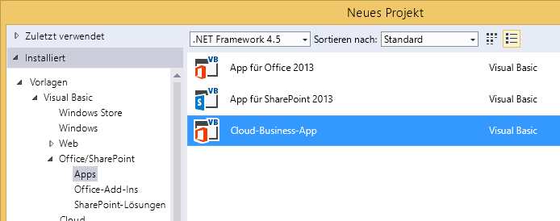
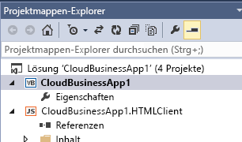
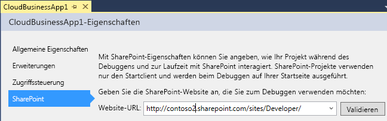

# Erstellen eines Cloud-Business-Add-Ins
Mit der Cloud-Geschäfts-Add-In-Vorlage in Visual Studio können Sie Add-Ins für SharePoint oder SharePoint in Office 365 erstellen, die für das Hinzufügen und Verwalten von Daten optimiert sind.
 

 **Hinweis** Der Name „Apps für SharePoint“ wird in „SharePoint-Add-Ins“ geändert. Während des Übergangszeitraums wird in der Dokumentation und der Benutzeroberfläche einiger SharePoint-Produkte und Visual Studio-Tools möglicherweise weiterhin der Begriff „Apps für SharePoint“ verwendet. Weitere Informationen finden Sie unter [Neuer Name für Office- und SharePoint-Apps](new-name-for-apps-for-sharepoint.md#bk_newname).
 

 **Hinweis** Sie können ein SharePoint-Add-In auch entwickeln, indem Sie die Vorlage für Add-Ins für SharePoint verwenden.
 

### So erstellen Sie ein Cloud-Business-Add-In

1. Wählen Sie auf der Menüleiste die Optionen **Datei**, **Neu**, **Projekt**.
    
    Das Dialogfeld **Neues Projekt** wird geöffnet.
    
 
2. Erweitern Sie in der Vorlagenliste den Knoten **Visual Basic** oder **Visual C#**, dann den Knoten **Office/SharePoint**, klicken Sie auf den Knoten **Add-Ins** und dann auf **Cloud-Business-Add-In**, wie in Abbildung 1 dargestellt.
    
    **Abbildung 1. Vorlage für Cloud-Business-Add-Ins**

 

  
 

 

 
3. Geben Sie im Textfeld **Name** den Namen Ihres Projekts ein, und klicken Sie dann auf die Schaltfläche **OK**.
    
    Der Assistent **Neues Cloud-Geschäfts-Add-In** wird geöffnet.
    
 
4. Geben Sie im Assistenten **Neues Cloud-Geschäfts-Add-In** die Website-URL für Ihren SharePoint-Server oder Ihre Office 365-Entwicklerwebsite ein, wie in Abbildung 2 dargestellt, und klicken Sie anschließend auf die Schaltfläche **Fertig stellen**.
    
    **Abbildung 2. SharePoint-URL**

 

  
 

    Die URL sollte das Format „https://_MeineWebsite_.sharepoint.com/sites/Developer/“ haben.
    
    Dem Projektmappen-Explorer wurde eine neue Projektmappe mit vier Projekten hinzugefügt: ein Projekt auf oberster Ebene, ein **HTMLClient**-Projekt, ein **Server**-Projekt und ein **SharePoint**-Projekt.
    
 

### So ändern Sie die Website für ein Cloud-Business-Add-In

1. Öffnen Sie im **Projektmappen-Explorer** das Kontextmenü des Projektknotens auf oberster Ebene, und klicken Sie dann auf **Eigenschaften**, wie in Abbildung 3 dargestellt.
    
    **Abbildung 3. Der Projektknoten auf oberster Ebene**

 

  
 

    Der Anwendungs-Designer wird geöffnet.
    
 
2. Wählen Sie im Anwendungs-Designer die Registerkarte **SharePoint** aus, wie in Abbildung 4 dargestellt.
    
    **Abbildung 4. Die Registerkarte „SharePoint“**

 

  
 

 

 
3. Klicken Sie in der Liste **Website-URL** auf eine vorhandene URL, oder geben Sie die Website-URL Ihres SharePoint-Servers oder Ihrer Office 365-Entwicklerwebsite ein.
    
 
4. Klicken Sie auf die Schaltfläche **Überprüfen**, um die URL zu überprüfen.
    
 

## Zusätzliche Ressourcen

-  [Entwickeln von Cloud-Business-Add-Ins](develop-cloud-business-add-ins.md)
    
 
-  [Erstellen von Cloud-Business-Add-Ins](create-cloud-business-add-ins.md)
    
 

